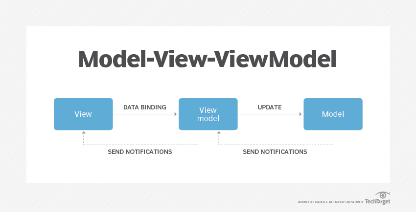

# 개발상식
## :book: `OOP`와 `5가지 원칙`을 설명해주세요.
> Object Oriented Programming, 객체 지향 프로그래밍의 약자로서 캡슐화, 다형성, 상속을 이용하여 코드 재사용을 증가시키고, 유지보수를 감소시키는 장점을 얻기 위해서 객체들을 연결해 프로그래밍 하는 기법입니다.

### 특징
- 캡슐화(Encapsulation) : 객체의 내용 중 숨기고 싶은 부분을 외부에서 접근할 수 없게 감출 수 있습니다. 이는 정보의 은닉과 보호가 가능합니다.

- 추상화(Abstraction) : 객체들의 공통된 특징을 파악해 정의해 놓은 설계 기법입니다.

- 다형성(Polymorphism) : 코드의 재사용성이 증가되고 폭 넓은 코드 구현이 가능하며, 개발속도를 향상시킬 수 있습니다.
  - 하나의 지시(예를 들어 메소드를 실행하는 것)에 대해 여러 객체가 다른 행위를 수행하는 것입니다. 사람의 말투를 예로 들어볼까요? '야.', '야!', '야~' 처럼 다른 의미가 전달되는 것입니다.
  - Overloading(오버로딩)과 Overriding(오버라이딩)으로 표현합니다.

- 상속성(또는 재사용성, Inheritance) : Class의 멤버(데이터)와 함수를 다른 Class에 물려주거나 물려받을 수 있는 기능으로 다형성을 확보할 수 있습니다.

 

### 5가지 원칙
> 각 원칙의 앞 글자를 따 SOLID라고 지칭합니다.

- **SRP**(Single Responsibility Principle, `단일 책임 원칙`) : 모든 클래스는 단 하나의 책임을 가집니다. 클래스를 수정할 이유가 오직 하나여야 합니다.
  - 계산기 클래스는 계산을 하는 책임과 GUI 를 나타내는 책임은 서로 분리되어야 합니다.
  - 계산기 클래스에 GUI를 나타내는 부분까지 있을경우, 이는 SRP 를 위반합니다.

- **OCP**(Open-Closed Principle, `개방-폐쇄 원칙`) : 확장에 대해서는 개방 되어 있어야 하지만, 수정에 대해서는 폐쇄 되어야 합니다.

- **LSP**(Liskov Substitution Principle, `리스코프 치환 원칙`) : 자식 클래스는 언제나 자신의 부모클래스를 대신할 수 있습니다. 
  - 부모클래스가 위치하는 자리에 자식 클래스를 대치되어도 잘 작동해야 합니다.

- **ISP**(Interface Segregation Principle, `인터페이스 분리 원칙`) : 클라이언트는 자신이 이용하지 않는 메서드에 의존하지 않아야 합니다.
  - 클래스는 자신이 사용하지 않는 인터페이스는 구현하지 말아야 합니다.
  - 하나의 일반적인 인터페이스보다는, 여러 개의 구체적인 인터페이스가 낫다.

- **DIP**(Dependency Inversion Principle, `의존 역전 원칙`) : 상위클래스는 하위클래스에 의존해서는 안됩니다.

 

[(상위 문서로)](https://github.com/InSeong-So/IT-Note)

 

## :book: 라이브러리(`Library`) 와 프레임워크(`Framework`) 의 차이점을 알려주세요.
### Library
> 단순하게 활용 가능한 도구들의 집합으로 개발자가 필요에 의해 만든 클래스를 호출하여 사용하는 방식입니다.

- 공통으로 사용될 수 있는 특정한 기능을 모듈화한 것으로 사용자가 직접 실행할 수는 없습니다.

 

### Framework
> `소프트웨어의 특정 문제를 해결하기 위해 상호간 의존하는 클래스와 인터페이스의 집합`입니다.

- 완성된 어플리케이션이 아니므로 개발자가 완성시켜야 합니다.
- 특정 개념의 추상화를 제공하는 재사용 가능한 여러 클래스나 컴포넌트로 구성됩니다.

 

### 차이점
> 두 용어의 차이점은 `개발 주도성이 어디에 있는가?`로 설명할 수 있습니다.
- 라이브러리는 개발자가 프로세스를 작성하면서 필요한 코드를 가져다 사용합니다.
- 프레임워크는 프로세스를 가지고 있으며 개발자(사용자)는 프레임워크 안에서 필요한 코드를 작성합니다.

 

### 결론
즉, 라이브러리는 **개발자**에게, 프레임워크는 개발자가 아닌 **핵심 구조 안**에 프로세스에 대한 주도성이 담겨 있습니다.

 

[(상위 문서로)](https://github.com/InSeong-So/IT-Note)

 

## :book: `Model1` 과 `Model2` 는 무엇이 다른가요?
> 모든 기능이 합쳐져 있는 JSP Model1을 분리시켜놓은 것이 Model2로, MVC 패턴의 기본적인 구조입니다.

### Model1

**모든 클라이언트 요청과 응답을 JSP가 담당하는 구조**

 

페이지(`View`)에 비즈니스 로직을 처리하기 위한 코드와 결과 출력을 관리하는 코드가 뒤섞여 있으며 해당 페이지에서 모든 정보를 저장(`Model`)하거나 처리(`Controller`) 합니다.
- 장점 : 단순한 페이지 작성으로 구현이 쉬워 소규모 애플리케이션에 적합합니다.
- 단점 : 재사용이 힘들고 가독성이 떨어집니다. 대규모 애플리케이션 등에서 코드가 복잡해지면 유지보수가 어렵습니다.

 

### Model2

**클라이언트의 요청, 응답, 비즈니스 로직 처리 부분을 모듈화한 구조**

 

클라이언트의 요청을 하나의 Web Container가 받아 알맞게 처리한 후 그 결과를 View로 전달합니다.
- 장점 : 처리작업의 분리로 유지보수와 확장이 용이합니다.
- 단점 : 구조 설계를 위한 시간이 많이 소요되므로 개발 시간이 증가합니다.

 

[(상위 문서로)](https://github.com/InSeong-So/IT-Note)

 

## :book: `MVC` 패턴은 무엇인가요?
> 소프트웨어 디자인 패턴으로 Model–View–Controller의 약자입니다.

**Model은 애플리케이션의 정보(데이터), View는 텍스트, 체크박스 항목 등과 같은 UI(User Interface) 요소이며 Controller는 데이터와 비즈니스 로직 사이의 상호동작을 관리합니다.**

UI(View)로부터 비즈니스 로직(Model, Controller)을 분리하여 애플리케이션의 시각적 요소나 그 이면에서 실행되는 기능을 영향 없이 쉽게 고칠 수 있습니다. MVC의 구성을 자세히 살펴보면 아래와 같습니다.

1. Controller는 Model에 명령함으로써 Model의 상태를 변경할 수 있으며(`워드 프로세서에서 문서를 편집하는 행위가 되겠죠`), Model의 상태가 변경되면 Controller가 관련된 View에 명령하여 Model의 표현 방식을 바꿀 수 있습니다(`문서를 스크롤하는 행위가 됩니다`).

2. Model은 Model의 상태가 변경되면 Controller와 View에 통보함으로써 View는 수정된 최신 결과를 보여줄 수 있고, Controller는 Model에 적용 가능한 명령을 수정할 수 있습니다(특정 MVC 패턴에서는 Model의 통보 대신 View나 Controller가 직접 Model의 상태를 읽기도 합니다).

3. View는 사용자가 볼 결과물을 표현하기 위해 Model로부터 정보를 가져옵니다.

 

[(상위 문서로)](https://github.com/InSeong-So/IT-Note)

 

## :book: `MVP` 패턴은 무엇인가요?
> MVC가 가진 Model-View-Controller 사이의 강한 결합을 해결하기 위해 등장한 소프트웨어 디자인 패턴으로, Model-View-Presenter의 약자입니다.

**View는 UI를 표현하며 사용자 정보의 입/출력만을 담당합니다.**

 

Presenter는 View로부터 입력을 Model에 요청하고, Model의 응답으로 View를 갱신하는 역할을 합니다.

이는 View가 수정되면 Presenter 또한 수정되야하는 뜻으로, 이렇게 짜여진 아키텍쳐는 Presenter와 View가 강하게 결합하는 형태로 존재하게 됩니다. MVP의 구성은 아래와 같아요.

1. View는 사용자에게 입력받은 정보를 Presenter에 요청하며, Presenter는 Model에게 해당하는 데이터를 요청합니다.
2. Model은 데이터를 찾아 Presenter에게 응답하고, Presenter는 View에게 응답합니다.
3. View는 최종적으로 전송 받은 응답 데이터를 이용해 화면을 갱신합니다.

 

[(상위 문서로)](https://github.com/InSeong-So/IT-Note)

 

## :book: `MVVM` 패턴은 무엇인가요?
> MVP가 가진 View-Presenter의 강한 결합을 해결하기 위해 등장한 소프트웨어 디자인 패턴으로, Model-View-View Model의 약자입니다.

**View Model은 데이터를 제공하며, View는 View Model의 데이터로 UI를 갱신합니다.**

 

리액트 프로그래밍과 관계가 깊습니다. Model, View, View Model 사이의 의존성(결합도)이 매우 낮고, 각각 분리된 모듈로서 존재하게 됩니다. 이는 한 모듈이 변경되어도 다른 모듈에 영향을 주지 않는다는 의미이며, TDD(Test Driven Development, 테스트 주도 개발)와 유지보수가 매우 쉬워졌습니다. MVVM의 구성을 볼까요?

1. View는 View Model에 이벤트(사용자의 입력)를 전달하고, View Model은 Model에 데이터를 요청합니다.
2. Model은 View Model에게 응답하여 데이터를 전송하고, View Model은 이를 가공하여 저장(저장소라는 중앙 집중형 영역을 활용하죠)합니다.
3. 최종적으로 View는 View Model의 데이터를 결합시켜 화면을 갱신합니다.

해당 장에서 언급하지는 않지만, 디자인 패턴인 `Data Binding`과 `Command 패턴`을 활용하여 제작된 구조입니다.

 

[(상위 문서로)](https://github.com/InSeong-So/IT-Note)

 

## :book: `REST`, `RESTful` 은 뭐죠? `RESTful API` 는요?
> REST(Representational State Transfer)는 웹의 장점을 최대한 활용할 수 있는 아키텍처입니다.

최근의 서버 프로그램은 다양한 브라우저와 모바일 디바이스에서도 통신을 할 수 있어야 합니다. REST 아키텍처는 이러한 Hypermedia API의 기본을 충실히 지키고 범용성을 보장합니다.

REST는 **자원**(Resource : URI), **행위**(Verb : HTTP Method), **표현**(Representations)으로 구성됩니다.

 

### 제약 조건과 특징
- 클라이언트-서버 구조(`Client-Server Architecture`) : UI에 대한 관심(Concern)을 데이터에 대한 관심으로부터 분리합니다.
  - `클라이언트의 이식성`과 `서버의 규모 확장성`이 향상됩니다.

- 무상태성(`Stateless`) : 클라이언트와 서버의 통신에는 상태가 없어야 하며, 모든 요청은 필요한 모든 정보를 담아야 합니다.
  - 요청 하나만 봐도 바로 뭔지 알 수 있으므로 가시성이 높습니다.
  - `task(작업)` 실패시 복원이 쉬워 신뢰성이 보장됩니다.
  - 상태를 저장할 필요가 없으므로 규모 확장에 용이합니다.
  - 메시지로만 처리하기 때문에 구현이 단순합니다.

- 캐시 처리 가능(`Cache`) : 모든 서버 응답은 캐시 처리의 여부를 내포하고 있어야 합니다.
  - 효율성, 규모 확장성, 사용자 경험이 향상됩니다.

- 유니폼 인터페이스(`Uniform Interface`) : 구성요소(클라이언트, 서버 등) 사이의 인터페이스는 균일(uniform)해야 합니다.
  - 전체 시스템 아키텍처가 단순해집니다.
  - 상호작용의 가시성이 개선됩니다.
  - 구현과 서비스가 분리되므로 독립적인 갱신이 가능해집니다.

- 계층형 구조(`Layered System` or `Hierarchical System`) : 계층(Hierarchical layers)으로 표현 되어야 합니다.
  - 각 계층에 속한 구성요소는 인접하지 않은 계층의 구성요소를 볼 수 없습니다.

- `Code-On-Demand` : 클라이언트의 요청에 따라 서버에서 클라이언트로 실행 가능한 소프트웨어를 전달합니다. 
  - 이 제약조건은 필수가 아닙니다.

 

### RESTful한 API란?
1. 자원과 행위는 명시적이고 직관적으로 분리되어야 합니다.
2. `Message`는 `Header`와 `Body`를 명확히 분리하여 사용합니다.
3. API 버전을 관리할 수 있어야 합니다.
4. 서버와 클라이언트가 같은 방식을 사용하여 요청하도록 합니다.

| endpoint                | 기능                        |
| ----------------------- | --------------------------- |
| GET /todos              | List all todos              |
| POST /todos             | Create a new todo           |
| GET /todos/:id          | Get a todo                  |
| PUT /todos/:id          | Update a todo               |
| DELETE /todos/:id       | Delete a todo and its items |
| GET /todos/:id/items    | Get a todo item             |
| PUT /todos/:id/items    | Update a todo item          |
| DELETE /todos/:id/items | Delete a todo item          |

**RESTful한 API의 표준**

 

- 장점
  - Open API 를 제공하기 쉽습니다.

  - 멀티 플랫폼 지원, 연동이 쉽습니다.

  - 원하는 타입으로 데이터를 송수신할 수 있습니다.

  - 기존 웹 인프라(HTTP)를 사용합니다.

- 단점
  - 사용할 수 있는 HTTP Method가 적습니다.

  - 분산환경에 부적합 합니다.

  - HTTP 통신 모델만 지원합니다.

 

### RESTful API 설계 시 주의할 점
1. URI는 Resource를 표현해야 합니다(동사보다는 명사를 사용해요).
2. 자원에 대한 행위는 HTTP Method(GET, POST, PUT, DELETE 등)로 표현합니다.
3. 슬래시 구분자(/)는 계층 관계를 나타내는데 사용합니다.
4. URI 마지막 문자로 슬래시(/)를 포함하지 않습니다.
5. 하이픈(-)은 URI 가독성을 높이는데 사용합니다.
6. 밑줄(_)은 URI 에 사용하지 않습니다.
7. URI 경로에는 소문자를 사용합니다.
8. 파일확장자는 URI에 포함시키지 않습니다.

 

[(상위 문서로)](https://github.com/InSeong-So/IT-Note)

 

## :book: `TDD` 는요?
> `Test-driven Development`, *테스트 주도 개발*

일반적인 개발 절차는 디자인(설계), 코드 작성, 기능 테스트로 이루어집니다. 그러나 TDD는 테스트가 주도하는 개발로서 그 절차가 다릅니다.

우선적으로 테스트 코드를 작성하고, 테스트를 통과하는 minimal 한 코드를 작성하는 형태입니다.

 

[(상위 문서로)](https://github.com/InSeong-So/IT-Note)

 

## :book: `함수형 프로그래밍` 은 뭐에요?
> Functional Programming, 기능을 순수 함수로 나누어 구현(해결)하는 기법입니다.

자료 처리를 수학적 함수의 계산으로 취급하고 상태와 가변 데이터를 멀리하는 프로그래밍 패러다임의 하나입니다. 계산 가능성, 결정 문제, 함수 정의, 함수 응용과 재귀를 연구하기 위해 개발된 체계인 `람다 대수`에 근간을 두고 있습니다.

기존 명령형 프로그래밍에서, 명령형 함수는 프로그램의 상태를 변경시킬 수 있었습니다. 따라서 명령형 함수는 참조 투명성이 없고, 같은 코드라도 실행되는 프로그램의 상태에 따라 다른 결과값을 낼 수 있습니다.

그에 반해 함수형 프로그래밍은 함수의 출력값이 입력된 인수에만 의존하므로 부작용을 효율적으로 제거하면서 프로그램의 동작을 이해하고, 동작을 예측하기 쉬워집니다.

 

[(상위 문서로)](https://github.com/InSeong-So/IT-Note)

 

## :book: `Git` 과 `Github` 은 어떻게 달라요?
> 버전 관리 시스템(Version Control System)의 일종으로 Git은 로컬에서의 버전 관리, Github은 웹 기반의 버전 관리로 이해해주세요.

버전 관리 시스템이란 소프트웨어의 코드를 추가 또는 변경하는 과정을 모두 기록하여 특정한 시점으로 돌아가거나, 문제가 생긴 파일을 복원하는 등의 소프트웨어 개발 현장에서 사용하는 프로그램입니다.

Git은 버전 관리 시스템 중 하나로 Git Repository 불리는 데이터 저장소에 소스 코드 등을 넣어서 이용합니다. 이런 Git Repository를 웹에 제공(호스팅)하는 서비스가 GitHub 입니다.

 

[(상위 문서로)](https://github.com/InSeong-So/IT-Note)

 

## :book: `SPA` 는 무엇인가요?
> Single Page Application, 단일 웹 페이지로 하나의 애플리케이션을 구축하는 것입니다.

웹의 오랜 역사에서, Flash와 SilverLight 등의 기술로 웹 표현력을 보충했었지만 이후 Ajax의 등장, HTML5의 확장으로 애플리케이션을 효과적으로 구현할 수 있게 되었습니다.

기존 웹 애플리케이션은 HTTP 요청/응답의 반복이었습니다. 다른 화면으로 변경하려면 반드시 웹 서버와 통신해야 했습니다. 그러나 SPA를 사용하면 HTML로 많은 부분을 처리할 수 있어 웹 서버와는 필요한 때만 통신하면 됩니다. 즉, 웹 서버와의 통신이 줄어드므로 좀 더 쾌적하고 편리해집니다.

물론, 마냥 좋은 점만 있는 것은 아닙니다. 단점은 무엇일까요?
1. 여러 모듈을 읽어 들이므로 초기 실행에 시간이 오래걸립니다.
2. 화면을 구성하는 첫 렌더링 때도 시간이 오래 걸립니다. 그 이후에는 캐시 형태로 저장해두기 때문에 쾌적하게 사용할 수 있습니다!
3. SPA를 단순하게 구성하면 검색 엔진이 SPA의 모든 내용을 제대로 읽을 수 없습니다. 이런 정보 전달의 문제를 해소하기 위해 고민해야 하지만, 현재의 웹 프레임워크(Angular, Vue, React 등)는 어느정도 해결책을 제시해줍니다.

 

[(상위 문서로)](https://github.com/InSeong-So/IT-Note)

 