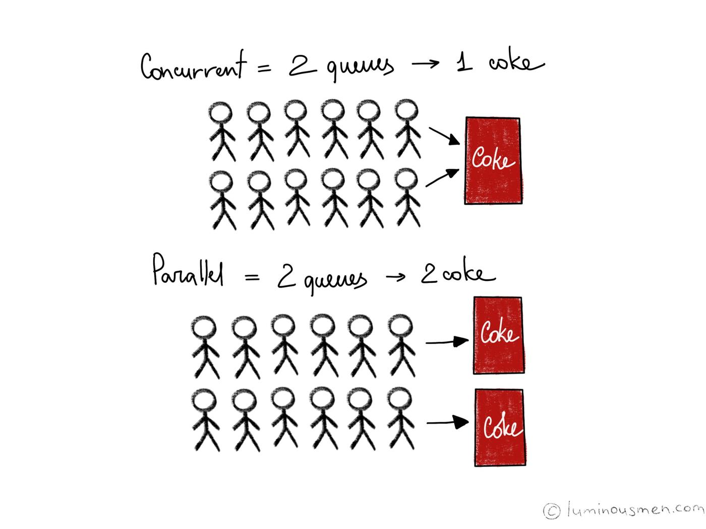

# 개발상식

## :book: `API`와 `SDK`를 설명해주세요.
>응용 프로그램 인터페이스( Application Programming Interface)와 시스템 개발자용 키트(System Developer's Kit)의 약어입니다.

API는 응용 프로그램이 `자신과 연관된 프로그램을 만들 수 있도록 제공하는 인터페이스`입니다. 예로 포토샵이 있죠. 포토샵은 매우 유용한 프로그램이지만 얼굴 보정 필터를 탑재하고 있진 않아요. 그래서 포토샵은 이 필터를 개발하려는 사람들을 위해 다양한 인터페이스를 제공하며, 이 인터페이스가 바로 API입니다. 즉, API는 시스템 호출보다 광범위하며 운영체제의 API를 시스템 호출이라고 말할 수 있어요.

SDK는 API 및 API 사용 메뉴얼, 프로그램 개발에 필요한 코드 편집기와 에뮬레이터 등 `각종 개발용 응용 프로그램까지 하나로 묶어 배포하는 개발 툴`입니다. 한마디로 개발자를 위한 종합 선물 세트죠. 대표적으로 Android Studio가 있어요.

<br>

<sup>[(상위 문서로)](https://github.com/InSeong-So/IT-Note)</sup>

<hr>
<br>

## :book: `객체 지향형 프로그래밍`과 `5가지 원칙`을 설명해주세요.
> Object Oriented Programming, OOP라 불리며 캡슐화, 다형성, 상속을 이용하여 코드 재사용을 증가시키고, 유지보수를 감소시키는 장점을 얻기 위해서 객체들을 연결해 프로그래밍 하는 기법입니다.

객체 지향형 프로그래밍이 가지는 특징은 일반적으로 아래와 같습니다.

- `캡슐화`(Encapsulation) : 객체의 내용 중 숨기고 싶은 부분을 외부에서 접근할 수 없게 감출 수 있습니다. 이는 정보의 은닉과 보호가 가능합니다.

- `추상화`(Abstraction) : 객체들의 공통된 특징을 파악해 정의해 놓은 설계 기법입니다.

- `다형성`(Polymorphism) : 코드의 재사용성이 증가되고 폭 넓은 코드 구현이 가능하며, 개발속도를 향상시킬 수 있습니다.
  - 하나의 지시(예를 들어 메소드를 실행하는 것)에 대해 여러 객체가 다른 행위를 수행하는 것입니다. 사람의 말투를 예로 들어볼까요? '야.', '야!', '야~' 처럼 다른 의미가 전달되는 것입니다.
  - Overloading(오버로딩)과 Overriding(오버라이딩)으로 표현합니다.

- `상속성`(또는 재사용성, Inheritance) : Class의 멤버(데이터)와 함수를 다른 Class에 물려주거나 물려받을 수 있는 기능으로 다형성을 확보할 수 있습니다.

<br>

5가지 원칙은 대체 뭘까요? 객체 지향형 프로그래밍 특징 상, 아래와 같은 규칙을 지켜 프로그래밍하도록 `권장`합니다. 각 원칙의 앞 글자를 따 SOLID라고 지칭합니다.

<br>

### 📣 SRP
> `단일 책임 원칙`(Single Responsibility Principle)
- 모든 클래스는 단 하나의 책임을 가집니다. 클래스를 수정할 이유가 오직 하나여야 합니다.
- 계산기 클래스는 계산을 하는 책임과 GUI 를 나타내는 책임은 서로 분리되어야 합니다.
- 계산기 클래스에 GUI를 나타내는 부분까지 있을경우, 이는 SRP 를 위반합니다.

<br>

### 📣 OCP
> `개방-폐쇄 원칙`(Open-Closed Principle)
- 확장에 대해서는 개방 되어 있어야 하지만, 수정에 대해서는 폐쇄 되어야 합니다.

<br>

### 📣 LSP
> `리스코프 치환 원칙`(Liskov Substitution Principle)
- 자식 클래스는 언제나 자신의 부모클래스를 대신할 수 있습니다. 
- 부모클래스가 위치하는 자리에 자식 클래스를 대치되어도 잘 작동해야 합니다.

<br>

### 📣 ISP
> `인터페이스 분리 원칙`(Interface Segregation Principle)
- 클라이언트는 자신이 이용하지 않는 메서드에 의존하지 않아야 합니다.
- 클래스는 자신이 사용하지 않는 인터페이스는 구현하지 말아야 합니다.
- 하나의 일반적인 인터페이스보다는, 여러 개의 구체적인 인터페이스가 낫다.

<br>

### 📣 DIP
> `의존 역전 원칙`(Dependency Inversion Principle)
- 상위클래스는 하위클래스에 의존해서는 안됩니다.

<br>

<sup>[(상위 문서로)](https://github.com/InSeong-So/IT-Note)</sup>

<hr>
<br>

## :book: `함수형 프로그래밍` 은 뭐에요?
> Functional Programming, 기능을 순수 함수로 나누어 구현(해결)하는 기법입니다.

자료 처리를 수학적 함수의 계산으로 취급하고 상태와 가변 데이터를 멀리하는 프로그래밍 패러다임의 하나입니다. 계산 가능성, 결정 문제, 함수 정의, 함수 응용과 재귀를 연구하기 위해 개발된 체계인 `람다 대수`에 근간을 두고 있습니다.

기존 명령형 프로그래밍에서, 명령형 함수는 프로그램의 상태를 변경시킬 수 있었습니다. 따라서 명령형 함수는 참조 투명성이 없고, 같은 코드라도 실행되는 프로그램의 상태에 따라 다른 결과값을 낼 수 있습니다.

그에 반해 함수형 프로그래밍은 함수의 출력값이 입력된 인수에만 의존하므로 부작용을 효율적으로 제거하면서 프로그램의 동작을 이해하고, 동작을 예측하기 쉬워집니다.

<br>

<sup>[(상위 문서로)](https://github.com/InSeong-So/IT-Note)</sup>

<hr>
<br>

## :book: `순수 함수`란 무엇인가요?
순수 함수는 같은 입력이 주어지면, 같은 출력을 반환해야 합니다. 즉, 부가 효과(Side Effect)가 존재하면 안 됩니다. 부가 효과가 발생하면 순수 함수로서의 기능을 하지 못해 예측 불가능한 오류를 일으킬 수 있습니다.

<br>

<sup>[(상위 문서로)](https://github.com/InSeong-So/IT-Note)</sup>

<hr>
<br>

## :book: 객체 지향 프로그래밍과 함수형 프로그래밍의 가장 큰 `차이점`은 무엇인가요?
객체 지향 프로그래밍은 클래스와 객체의 관계가 중심으로 구성되므로 상태, 멤버 변수, 메서드 등이 긴밀하게 의존합니다. 이는 멤버 변수가 가진 상태에 따라 결과가 변한다는 것이죠.

함수형 프로그래밍은 순수 함수와 보조 함수의 조합으로 상태를 제어하는 복잡성을 최소화하고 변수의 사용을 억제하여 상태 변경을 피해 최적화된 동작을 만들어 낼 수 있습니다.

<br>

<sup>[(상위 문서로)](https://github.com/InSeong-So/IT-Note)</sup>

<hr>
<br>

## :book: `라이브러리`와 `프레임워크`의 차이점을 알려주세요.
### 📣 라이브러리(Library)
> 단순하게 활용 가능한 도구들의 집합으로 개발자가 필요에 의해 만든 클래스를 호출하여 사용하는 방식입니다.

공통으로 사용될 수 있는 특정한 기능을 모듈화한 것으로 사용자가 직접 실행할 수는 없습니다.

<br>

### 📣 프레임워크(Framework)
> `소프트웨어의 특정 문제를 해결하기 위해 상호간 의존하는 클래스와 인터페이스의 집합`입니다.

완성된 어플리케이션이 아니므로 개발자가 완성시켜야 하며, 특정 개념의 추상화를 제공하는 재사용 가능한 여러 클래스나 컴포넌트로 구성됩니다.

<br>

### 📣 차이점
> 두 용어의 차이점은 `개발 주도성이 어디에 있는가?`로 설명할 수 있습니다.

라이브러리는 개발자가 프로세스를 작성하면서 필요한 코드를 가져다 사용하는 반면 프레임워크는 프로세스를 가지고 있으며 개발자(사용자)는 프레임워크 안에서 필요한 코드를 작성합니다.

<br>

### 📣 결론
> 라이브러리는 **개발자**에게, 프레임워크는 개발자가 아닌 **핵심 구조 안**에 프로세스에 대한 주도성이 담겨 있습니다.

<br>

<sup>[(상위 문서로)](https://github.com/InSeong-So/IT-Note)</sup>

<hr>
<br>

## :book: `Model1`과 `Model2`는 무엇이 다른가요?
> 모든 기능이 합쳐져 있는 JSP Model1을 분리시켜놓은 것이 Model2로, MVC 패턴의 기본적인 구조입니다.

### 📣 Model1
<div align=center>


**모든 클라이언트 요청과 응답을 JSP가 담당하는 구조**

</div>

<br>

페이지(`View`)에 비즈니스 로직을 처리하기 위한 코드와 결과 출력을 관리하는 코드가 뒤섞여 있으며 해당 페이지에서 모든 정보를 저장(`Model`)하거나 처리(`Controller`) 합니다.
- 장점 : 단순한 페이지 작성으로 구현이 쉬워 소규모 애플리케이션에 적합합니다.
- 단점 : 재사용이 힘들고 가독성이 떨어집니다. 대규모 애플리케이션 등에서 코드가 복잡해지면 유지보수가 어렵습니다.

<br>

### 📣 Model2
<div align=center>


**클라이언트의 요청, 응답, 비즈니스 로직 처리 부분을 모듈화한 구조**

</div>

<br>

클라이언트의 요청을 하나의 Web Container가 받아 알맞게 처리한 후 그 결과를 View로 전달합니다.
- 장점 : 처리작업의 분리로 유지보수와 확장이 용이합니다.
- 단점 : 구조 설계를 위한 시간이 많이 소요되므로 개발 시간이 증가합니다.

<br>

<sup>[(상위 문서로)](https://github.com/InSeong-So/IT-Note)</sup>

<hr>
<br>

## :book: `MVC` 패턴은 무엇인가요?
> 소프트웨어 디자인 패턴으로 Model–View–Controller의 약자입니다.

<div align=center>


</div>

<br>

> Model은 애플리케이션의 정보(데이터), View는 텍스트, 체크박스 항목 등과 같은 UI(User Interface) 요소이며 Controller는 데이터와 비즈니스 로직 사이의 상호동작을 관리합니다.

UI(View)로부터 비즈니스 로직(Model, Controller)을 분리하여 애플리케이션의 시각적 요소나 그 이면에서 실행되는 기능을 영향 없이 쉽게 고칠 수 있습니다. MVC의 구성을 자세히 살펴보면 아래와 같습니다.

1. Controller는 Model에 명령함으로써 Model의 상태를 변경할 수 있으며(`워드 프로세서에서 문서를 편집하는 행위가 되겠죠`), Model의 상태가 변경되면 Controller가 관련된 View에 명령하여 Model의 표현 방식을 바꿀 수 있습니다(`문서를 스크롤하는 행위가 됩니다`).

2. Model은 Model의 상태가 변경되면 Controller와 View에 통보함으로써 View는 수정된 최신 결과를 보여줄 수 있고, Controller는 Model에 적용 가능한 명령을 수정할 수 있습니다(특정 MVC 패턴에서는 Model의 통보 대신 View나 Controller가 직접 Model의 상태를 읽기도 합니다).

3. View는 사용자가 볼 결과물을 표현하기 위해 Model로부터 정보를 가져옵니다.

<br>

<sup>[(상위 문서로)](https://github.com/InSeong-So/IT-Note)</sup>

<hr>
<br>

## :book: `MVP` 패턴은 무엇인가요?
> MVC가 가진 Model-View-Controller 사이의 강한 결합을 해결하기 위해 등장한 소프트웨어 디자인 패턴으로, Model-View-Presenter의 약자입니다.

<div align=center>


</div>

<br>

> View는 UI를 표현하며 사용자 정보의 입/출력만을 담당합니다.

Presenter는 View로부터 입력을 Model에 요청하고, Model의 응답으로 View를 갱신하는 역할을 합니다.

이는 View가 수정되면 Presenter 또한 수정되야하는 뜻으로, 이렇게 짜여진 아키텍쳐는 Presenter와 View가 강하게 결합하는 형태로 존재하게 됩니다. MVP의 구성은 아래와 같아요.

1. View는 사용자에게 입력받은 정보를 Presenter에 요청하며, Presenter는 Model에게 해당하는 데이터를 요청합니다.
2. Model은 데이터를 찾아 Presenter에게 응답하고, Presenter는 View에게 응답합니다.
3. View는 최종적으로 전송 받은 응답 데이터를 이용해 화면을 갱신합니다.

<br>

<sup>[(상위 문서로)](https://github.com/InSeong-So/IT-Note)</sup>

<hr>
<br>

## :book: `MVVM` 패턴은 무엇인가요?
> MVP가 가진 View-Presenter의 강한 결합을 해결하기 위해 등장한 소프트웨어 디자인 패턴으로, Model-View-View Model의 약자입니다.

<div align=center>


</div>

<br>

> View Model은 데이터를 제공하며, View는 View Model의 데이터로 UI를 갱신합니다.

리액트 프로그래밍과 관계가 깊습니다. Model, View, View Model 사이의 의존성(결합도)이 매우 낮고, 각각 분리된 모듈로서 존재하게 됩니다. 이는 한 모듈이 변경되어도 다른 모듈에 영향을 주지 않는다는 의미이며, TDD(Test Driven Development, 테스트 주도 개발)와 유지보수가 매우 쉬워졌습니다. MVVM의 구성을 볼까요?

1. View는 View Model에 이벤트(사용자의 입력)를 전달하고, View Model은 Model에 데이터를 요청합니다.
2. Model은 View Model에게 응답하여 데이터를 전송하고, View Model은 이를 가공하여 저장(저장소라는 중앙 집중형 영역을 활용하죠)합니다.
3. 최종적으로 View는 View Model의 데이터를 결합시켜 화면을 갱신합니다.

해당 장에서 언급하지는 않지만, 디자인 패턴인 `Data Binding`과 `Command 패턴`을 활용하여 제작된 구조입니다.

<br>

<sup>[(상위 문서로)](https://github.com/InSeong-So/IT-Note)</sup>

<hr>
<br>

## :book: `Flux` 패턴은 무엇인가요?
> MVC 패턴은 양방향 데이터 흐름을 만들어 예측하기 어려운 버그를 발생시킵니다.

<div align=center>


</div>

<br>

> Flux의 가장 큰 특징은, 바로 **단방향 데이터 흐름**입니다.

1. 이벤트(action)가 발생하면 Dipatcher로 전달됩니다.
2. Dispatcher는 등록된 Callback 함수를 실행하고, Store에 데이터를 전달합니다.
3. Store는 변경된 데이터를 View에 알립니다.
4. View는 변경된 데이터로 화면을 변경하거나 출력합니다.

디자인 패턴인 `Observer 패턴`을 활용하여 작성할 수 있습니다.

<br>

<sup>[(상위 문서로)](https://github.com/InSeong-So/IT-Note)</sup>

<hr>
<br>

## :book: `REST`, `RESTful`은 뭐죠? `RESTful API`는요?
> REST(Representational State Transfer)는 웹의 장점을 최대한 활용할 수 있는 아키텍처입니다.

최근의 서버 프로그램은 다양한 브라우저와 모바일 디바이스에서도 통신을 할 수 있어야 합니다. REST 아키텍처는 이러한 Hypermedia API의 기본을 충실히 지키고 범용성을 보장합니다.

REST는 **자원**(Resource : URI), **행위**(Verb : HTTP Method), **표현**(Representations)으로 구성됩니다.

<br>

### 📣 제약 조건과 특징
- 클라이언트-서버 구조(`Client-Server Architecture`) : UI에 대한 관심(Concern)을 데이터에 대한 관심으로부터 분리합니다.
  - `클라이언트의 이식성`과 `서버의 규모 확장성`이 향상됩니다.

- 무상태성(`Stateless`) : 클라이언트와 서버의 통신에는 상태가 없어야 하며, 모든 요청은 필요한 모든 정보를 담아야 합니다.
  - 요청 하나만 봐도 바로 뭔지 알 수 있으므로 가시성이 높습니다.
  - `task(작업)` 실패시 복원이 쉬워 신뢰성이 보장됩니다.
  - 상태를 저장할 필요가 없으므로 규모 확장에 용이합니다.
  - 메시지로만 처리하기 때문에 구현이 단순합니다.

- 캐시 처리 가능(`Cache`) : 모든 서버 응답은 캐시 처리의 여부를 내포하고 있어야 합니다.
  - 효율성, 규모 확장성, 사용자 경험이 향상됩니다.

- 유니폼 인터페이스(`Uniform Interface`) : 구성요소(클라이언트, 서버 등) 사이의 인터페이스는 균일(uniform)해야 합니다.
  - 전체 시스템 아키텍처가 단순해집니다.
  - 상호작용의 가시성이 개선됩니다.
  - 구현과 서비스가 분리되므로 독립적인 갱신이 가능해집니다.

- 계층형 구조(`Layered System` or `Hierarchical System`) : 계층(Hierarchical layers)으로 표현 되어야 합니다.
  - 각 계층에 속한 구성요소는 인접하지 않은 계층의 구성요소를 볼 수 없습니다.

- `Code-On-Demand` : 클라이언트의 요청에 따라 서버에서 클라이언트로 실행 가능한 소프트웨어를 전달합니다. 
  - 이 제약조건은 필수가 아닙니다.

<br>

### 📣 RESTful한 API란?
1. 자원과 행위는 명시적이고 직관적으로 분리되어야 합니다.
2. `Message`는 `Header`와 `Body`를 명확히 분리하여 사용합니다.
3. API 버전을 관리할 수 있어야 합니다.
4. 서버와 클라이언트가 같은 방식을 사용하여 요청하도록 합니다.

<div align=center>

| endpoint                | 기능                        |
| ----------------------- | --------------------------- |
| GET /todos              | List all todos              |
| POST /todos             | Create a new todo           |
| GET /todos/:id          | Get a todo                  |
| PUT /todos/:id          | Update a todo               |
| DELETE /todos/:id       | Delete a todo and its items |
| GET /todos/:id/items    | Get a todo item             |
| PUT /todos/:id/items    | Update a todo item          |
| DELETE /todos/:id/items | Delete a todo item          |

</div>

<br>

- 장점
  - Open API 를 제공하기 쉽습니다.

  - 멀티 플랫폼 지원, 연동이 쉽습니다.

  - 원하는 타입으로 데이터를 송수신할 수 있습니다.

  - 기존 웹 인프라(HTTP)를 사용합니다.

- 단점
  - 사용할 수 있는 HTTP Method가 적습니다.

  - 분산환경에 부적합 합니다.

  - HTTP 통신 모델만 지원합니다.

<br>

### 📣 RESTful API 설계 시 주의할 점
- URI는 Resource를 표현해야 합니다(동사보다는 명사를 사용해요).

- 자원에 대한 행위는 HTTP Method(GET, POST, PUT, DELETE 등)로 표현합니다.

- 슬래시 구분자(/)는 계층 관계를 나타내는데 사용합니다.

- URI 마지막 문자로 슬래시(/)를 포함하지 않습니다.

- 하이픈(-)은 URI 가독성을 높이는데 사용합니다.

- 밑줄(_)은 URI 에 사용하지 않습니다.

- URI 경로에는 소문자를 사용합니다.

- 파일확장자는 URI에 포함시키지 않습니다.

<br>

> 참조
> - [RESTful API 설계 가이드](https://sanghaklee.tistory.com/57)

<sup>[(상위 문서로)](https://github.com/InSeong-So/IT-Note)</sup>

<hr>
<br>

## :book: `정적/동적 타이핑`에 대해 설명해주세요.
> 정적 타이핑(Static typing), 동적 타이핑(dynamic typing)

우리는 C와 Java처럼 변수에 할당할 수 있는 타입을 지정해야만 하는 언어를 **정적 타입 언어(static/strong type)** 라고 묶어 지칭하며, 이를 `명시적 타입 선언(explicit type declaration)`이라고 합니다.

반대로 JavaScript와 Python처럼 변수를 선언할 때 타입을 선언하지 않는 언어를 **동적 타입 언어(dynamic/weak type)** 라고 묶어 지칭하며, 이를 `암시적 타입 선언(implicit type declaration)`이라고 부릅니다.

그럼 특징을 살펴볼까요?

### 📣 정적 타입 언어
- 변수의 타입을 변경할 수 없어 `선언한 타입에 맞는 값만 할당`할 수 있습니다.
  ```java
  // 자바
  int a = 0;
  a = 'A';  // Compile Error
  ```

<br>

- 대부분의 정적 타입 언어는 `컴파일 언어(Compile Language)`로써 컴파일 시점에 `타입을 체크`합니다.
  - 타입 체크(Type Check) : 선언한 데이터 타입에 맞는 값을 할당했는지 검사

<br>

- 위의 절차로 타입의 일관성을 강제하여 안정적인 코드를 구현하고, 런타임(실행)에 발생하는 에러를 줄입니다.

<br>

### 📣 동적 타입 언어
- 미리 선언한 데이터 타입의 값이 아니라, 어떤 타입이라도 자유롭게 할당할 수 있습니다.
  ```js
  // 자바스크립트
  let a = 0;
  a = 'A';  // Not Problem
  ```
  ```py
  # 파이썬
  a = 0
  a = 'A'
  ```
- 위의 절차로, `선언이 아닌 할당에 의해 타입이 결정(타입 추론)`되며 타입의 변환에 매우 자유롭습니다.

<br>

- 단, 타입의 일관성을 강제하지 않으므로 코드 구현과 런타임 간 에러가 발생할 수 있습니다.
  - 이런 여러 문제점을 해결하고자 자바스크립트 진영에서는 타입스크립트(TypeScript)라는 새로운 언어(자바스크립트 기반)가 탄생했습니다.

<br>

- 이와 별개로, 자바스크립트는 개발자의 의도와 상관 없이 엔진에 의해 **암묵적으로 타입이 자동 변환** 되기도 합니다. 아래는 위에서 언급했던 코드입니다.
  ```js
  let a = 'A';
  let b = a + 15;
  console.log(b);
  ```
  - 엔진은 a와 연산하는 `15를 문자열로 변환하여` 문자열 덧셈을 시행합니다. 이처럼 **문자열 타입 변수라고 예측했으나 실은 숫자 타입이었다** 는 문제가 발생합니다. 

<br>

- 즉 동적 타입 언어는 **유연성(flexibility)은 높지만 신뢰성(reliability)은 떨어집니다**.

<br>

<sup>[(상위 문서로)](https://github.com/InSeong-So/IT-Note)</sup>

<hr>
<br>

## :book: `TDD`는요?
> `Test-driven Development`, *테스트 주도 개발*

일반적인 개발 절차는 디자인(설계), 코드 작성, 기능 테스트로 이루어집니다. 그러나 TDD는 테스트가 주도하는 개발로서 그 절차가 다릅니다.

우선적으로 테스트 코드를 작성하고, 테스트를 통과하는 minimal 한 코드를 작성하는 형태입니다.

<br>

<sup>[(상위 문서로)](https://github.com/InSeong-So/IT-Note)</sup>

<hr>
<br>

## :book: `Git`과 `Github`은 어떻게 달라요?
> 버전 관리 시스템(Version Control System)의 일종으로 Git은 로컬에서의 버전 관리, Github은 웹 기반의 버전 관리로 이해해주세요.

버전 관리 시스템이란 소프트웨어의 코드를 추가 또는 변경하는 과정을 모두 기록하여 특정한 시점으로 돌아가거나, 문제가 생긴 파일을 복원하는 등의 소프트웨어 개발 현장에서 사용하는 프로그램입니다.

Git은 버전 관리 시스템 중 하나로 Git Repository 불리는 데이터 저장소에 소스 코드 등을 넣어서 이용합니다. 이런 Git Repository를 웹에 제공(호스팅)하는 서비스가 GitHub 입니다.

<br>

<sup>[(상위 문서로)](https://github.com/InSeong-So/IT-Note)</sup>

<hr>
<br>

## :book: `SPA`는 무엇인가요?
> SPA(Single Page Application)는 서버에 처음에만 페이지를 요청하고, 이후에는 동적으로 페이지를 구성하는 웹 애플리케이션을 뜻합니다.

페이지가 한번 로딩된 이후 데이터를 수정하거나 조회할 때, 페이지가 새로 고침되지 않고 다른 페이지로 넘어가지 않습니다.

다른 방식으로는 MPA(Multi Page Application)가 있는데, 이는 서버로부터 완전한 페이지를 받아오고 이후에 데이터를 수정하거나 조회할 때, 다른 완전한 페이지로 이동(URL이 변경될 수 있는)하는 형태입니다.

웹의 오랜 역사에서, Flash와 SilverLight 등의 기술로 웹 표현력을 보충했었지만 이후 Ajax의 등장, HTML5의 확장으로 애플리케이션을 효과적으로 구현할 수 있게 되었습니다.

기존 웹 애플리케이션은 HTTP 요청/응답의 반복이었습니다. 다른 화면으로 변경하려면 반드시 웹 서버와 통신해야 했습니다. 그러나 SPA를 사용하면 HTML로 많은 부분을 처리할 수 있어 웹 서버와는 필요한 때만 통신하면 됩니다. 즉, 웹 서버와의 통신이 줄어드므로 좀 더 쾌적하고 편리해집니다.

물론, 마냥 좋은 점만 있는 것은 아닙니다. 단점은 무엇일까요?
1. 여러 모듈을 읽어 들이므로 초기 실행에 시간이 오래걸립니다.
2. 화면을 구성하는 첫 렌더링 때도 시간이 오래 걸립니다. 그 이후에는 캐시 형태로 저장해두기 때문에 쾌적하게 사용할 수 있습니다!
3. SPA를 단순하게 구성하면 검색 엔진이 SPA의 모든 내용을 제대로 읽을 수 없습니다. 이런 정보 전달의 문제를 해소하기 위해 고민해야 하지만, 현재의 웹 프레임워크(Angular, Vue, React 등)는 어느정도 해결책을 제시해줍니다.

<br>

<sup>[(상위 문서로)](https://github.com/InSeong-So/IT-Note)</sup>

<hr>
<br>

## :book: `PWA`란 무엇인가요?
> PWA(Progressive Web Apps)

모바일 사이트에서 네이티브 앱과 같은 사용자 경험을 제공하는 기술로서 웹과 앱 모두의 장점이 결합된 제품(App)입니다.

<br>

<sup>[(상위 문서로)](https://github.com/InSeong-So/IT-Note)</sup>

<hr>
<br>

## :book: `CSR`은 무엇이고, `SSR`은 무엇이죠?
### 📣 CSR(Client-Side Rendering)
> 데이터가 없는 껍데기 HTML(그 외 정적인 파일들)만 우선 응답 받고, 데이터는 여러 정적 파일이 로드된 이후 다시 요청해서 응답 받는 방식입니다.

CSR은 SSR보다 초기 전송되는 페이지의 속도는 빠르지만 서비스에서 필요한 데이터를 클라이언트(브라우저)에서 추가로 요청하여 재구성해야 하기 때문에 전제적인 페이지 완료 시점은 SSR보다 느려집니다.

<br>

### 📣 SSR(Server-Side Rendering)
> 데이터까지 전부 삽입된 완성형 HTML을 응답 받습니다.

서버에서 사용자에게 보여줄 페이지를 모두 구성하여 사용자에게 페이지를 보여주는 방식이다. JSP/Servlet의 아키텍처에서 이 방식을 사용했는데, SSR을 사용하면 모든 데이터가 매핑된 서비스 페이지를 클라이언트(브라우저)에게 바로 보여줄 수 있습니다.

서버를 이용해서 페이지를 구성하기 때문에 클라이언트에서 구성하는 CSR(client-side rendering)보다 페이지를 구성하는 속도는 늦어지지만 전체적으로 사용자에게 보여주는 콘텐츠 구성이 완료되는 시점은 빨라진다는 장점이 있으며 SEO(search engine optimization) 또한 쉬워집니다.

<br>

### 📣 정리
CSR은 기본적으로 페이지 로드 이후 동적으로 콘텐츠를 생성하기 때문에 콘텐츠를 빠르게 소비하는 사용자의 요구 사항을 충족시킬 수가 없었습니다. 네트워크 상황이 좋지 않다면 CSR을 이용할 경우 사용자들은 글을 보기 전에 상당 시간 하얀 화면을 봐야 할 수도 있죠.

대부분 SSR을 채택하는 이유는 급변하는 프론트엔드 생태계에 대응하고, CSR의 한계를 극복하기 위해서입니다. 일반적으로 클라이언트에서 작성한 코드의 일부는 서버에서도 동일한 로직으로 구성되는 경우가 많으므로 개발의 난이도는 있지만 생산성 측면에서는 SSR을 구축하는 것이 장기적인 관점에서 더욱 효율적이게 돼죠.

또한 SSR을 사용하면 프론트엔드와 백엔드를 완전히 분리함으로써 생산성을 높일 수 있습니다. 해당 영역은 REST API를 통해 느슨하게 연결할 수 있죠.

기존 CSR 페이지는 프론트엔드에서 개발하고 SSR 페이지는 백엔드에서 개발을 했다면, SSR 환경을 구축하면 페이지의 소유권이 온전히 프론트엔드에 존재하므로 페이지가 변경될 때마다 불필요한 커뮤니케이션을 할 필요가 없어집니다.

다만, 인프라를 구축하고 운영하는 것이 부담스러운 부분이지만 요즘은 가상화를 통한 구성이 너무 잘 되어 있어서 조그만한 투자로 많은 이점을 얻을 수 있습니다.

더불어 백엔드에서도 API 개발과 데이터 활용에 더 집중할 수 있어서 서비스 품질을 높이는 데 기여할 수 있다는 장점이 있어요.

마지막으로 SSR 아키텍처를 구성하면 다른 여러 가지 대안을 활용할 수 있는 토대가 되므로 필요에 따라 CSR로만 구성할 수도, CSR과 prependering을 함께 사용하도록 개발할 수도 있습니다.

<br>

<sup>[(상위 문서로)](https://github.com/InSeong-So/IT-Note)</sup>

<hr>
<br>

## :book: `AOT`와 `JIT`에 대해 설명해주세요.
> JIT(Just In Time Compile), AOT(Ahead Of Time Compile)

JIT는 JIT 컴파일러를 포함하며 브라우저에서 템프릿 컴파일을 진행하므로 매우 느리고 용량도 거대한 반면, AOT는 빌드 시 템플릿을 먼저 컴파일합니다. 따라서 빌드는 시간이 더 소요되나 브라우저에서는 컴파일이 실행되지 않기 때문에 훨씬 빠르죠.

따라서 개발 서버는 JIT 방식으로 빠르게 빌드하여 변경사항을 확인하고, 운영 서버에는 AOT 방식으로 전체 용량 감소 및 컴파일 시간을 최소화 하는 편입니다.

<br>

<sup>[(상위 문서로)](https://github.com/InSeong-So/IT-Note)</sup>

<hr>
<br>

## :book: `반응형(reactivity)` 시스템이란 무엇인가요?
객체의 상태 변화를 감지해서 해당 객체를 사용하는 다른 객체의 상태를 변경하거나, 관련된 뷰(View)를 자동으로 갱신해주는 시스템입니다. 즉, 모든 상태 변경에 대해 이벤트를 발생시키고, 변경을 감지하기 위해서 해당 이벤트에 대한 리스너를 등록하던 일을 자동으로 해 주는 것이죠.

예를 들어 영상을 찍는 스트리머와 이를 송출하는 플랫폼이 있다고 가정해봅시다. 스트리머는 일정하게 영상에 대한 프레임을 송출(emit)하고, 플랫폼은 스트리머을 관찰하고 있다가 새로운 영상을 송출하면 이를 획득하는 방식입니다.

흔히들 구독/알림(Publish/Subscribe) 관계라고 하는데 여기서 스트리머의 역할이 옵저버블(observable), 플랫폼이 옵저버(Observer), 영상 프레임이 Notification이 됩니다.

<br>

<sup>[(상위 문서로)](https://github.com/InSeong-So/IT-Note)</sup>

<hr>
<br>

## :book: 웹 사이트를 만들 때 `고려해야 할 사항`은 무엇이 있을까요?
- 사용자 인터페이스(UI)
- 보안(Security)
- 성능(Performance)
- 검색 엔진 최적화(SEO)
- 유지보수성(Maintainability)

<br>

<sup>[(상위 문서로)](https://github.com/InSeong-So/IT-Note)</sup>

<hr>
<br>

## :book: `웹 페이지를 만들 때의 과정`을 설명해주실 수 있을까요?
> 기획, 디자인, 퍼블리싱, 프로그램 개발, 테스트/검수, 홍보 및 마케팅이 있습니다.

1. 기획 : 만들려는 웹의 목적, 주요 타깃을 결정하고 정리된 컨텐츠(Contents)를 기본으로 전체 디자인 컨셉(Concept)을 잡는 단계입니다.

<br>

2. 디자인 : 기획에서 정한 컨셉에 맞게 시각적 요소를 활용하여 사용성을 높일 수 있는 디자인 작업을 진행하는 단계입니다.

<br>

3. 퍼블리싱 : HTML, CSS, 자바스크립트를 통해 여러 화면의 움직임을 구현하고 웹 표준에 맞는 반응형(또는 적응형) 작업을 진행합니다.

<br>

4. 프로그램 개발 : 화면이 내포하는 실제 기능을 구현하는 단계입니다. 다양한 클라이언트 요청에 개발이 이루어집니다.

<br>

5. 테스트/검수 : 기획 의도에 맞게 디자인과 프로그램 개발 작업을 테스트하고 발생하느 오류를 수정합니다.

<br>

6. 홍보 및 마케팅 : 완성된 웹에 사용자/방문자를 늘리기 위해 적극 홍보합니다.

<br>

> 참조
> - [홈페이지 제작 과정](https://homepage-academy.blogspot.com/2019/09/homepage-production-process.html)

<sup>[(상위 문서로)](https://github.com/InSeong-So/IT-Note)</sup>

<hr>
<br>

## :book: `점진적 향상법`과 `우아한 성능저하법`의 차이를 설명하실 수 있습니까?
### 📣 점진적 향상법(progressive enhancement)
> 많은 테스트를 통해 말그대로 기능을 점진적으로 향상시킵니다. 기능이 제한된 브라우저의 애플리케이션을 개발할 때 주로 사용합니다.

기본 수준의 사용자 환경에 대한 응용 프로그램을 구축하지만 브라우저가 이를 지원할 경우 기능을 강화하는 방법입니다. 기초부터 천천히 발전하므로 노력과 시간이 필요하죠. 예를 들어 아래처럼 웹 페이지 구성을 간략화하면 어떨까요?
1. HTML 마크업 작성
2. CSS 스타일링
3. 자바스크립트 기능 개발

<br>

### 📣 우아한 성능저하법(graceful degradation)
> 신기술을 최신 기기에 적용하여 기능을 구현하고, 오래 된 기기에서 동작하도록 기술 버전을 점차 낮추어 유사한 기능을 구현하는 것입니다.

최신 브라우저를 위한 어플리케이션을 구축하는 동시에 구형 브라우저에서도 계속 동작하도록 하는 개발 방법입니다. 전체가 동일한 애플리케이션을 사용하는 것이 아닌 기기별로 애플리케이션 버전을 다르게 개발하는 것이죠. 예를 들어 최신 모던 브라우저에서는 동작하는 Fetch API의 경우 IE에서는 동작하지 않으니 XhrHTTPRequest를 사용하는 것과 같습니다.

<br>

<sup>[(상위 문서로)](https://github.com/InSeong-So/IT-Note)</sup>

<hr>
<br>

## :book: `표준의 중요성`에 관해 설명해주세요.
> 표준에 의해 공통적인 기준과 상호 운용성이 명확해져 혁신이 빨라집니다.

좁은 의미에서의 표준은 협업을 원활하게 해주며, 개발에 따른 비용과 유지보수 용이성을 제공합니다. 그러나 넓은 의미로 해석하면 아래와 같습니다.
1. 상호 운용성을 제공합니다.
   - 호환성(compatibility), 상호 운용성(Interoperability)의 제공으로 같은 기종 또는 다른 기종 간에 정보교환 및 처리를 가능하게 해줍니다.
2. 비용을 절감시켜 줍니다.
   - 제조업체, 벤더 등 사업자는 단위 생산·거래 비용을 줄일 수 있으며, 대량생산을 통해 규모의 경제(economy of scale)를 실현하는 것이 가능합니다. 또한 기술의 중복투자 방지, 기술이전 촉진 등 연구·개발 비용을 절감할 수 있습니다.
3. 무역 활성화를 통한 시장 진출 도구로 활용할 수 있습니다.
   - 국가 간 무역은 국제표준을 따르므로 기술 무역장벽 제거 및 국제 교역 활성화가 촉진됩니다.
   - 또한 소비자 및 시장의 요구가 반영되어 있기에 표준을 사용한 제품 및 서비스의 시장 진출 시 성공 가능성을 높일 수 있습니다.
4. 사용자에 대한 자유도(선택의 자유)를 높일 수 있습니다.
   - 통일된 형태의 결과물을 통해 제품의 이동을 편리하게 하고, 우수 경쟁체제를 통해 보다 나은 제품 및 서비스를 획득하는 것이 가능합니다.

<br>

<sup>[(상위 문서로)](https://github.com/InSeong-So/IT-Note)</sup>

<hr>
<br>

## :book: `모노레포`는 무엇인지 설명해주세요.
> 모노레포(Monorepo)는 두 개 이상의 프로젝트 코드를 하나의 저장소에서 관리하는 기법입니다.

- 코드의 재사용
  - 여러 저장소에서 프로젝트를 진행하면 비슷한 로직을 각 저장소에서 중복 구현하는 때가 많은데, 이를 공유하려면 저장소와 의존성을 추가해야 합니다. 모노레포를 적용하는 경우 하나의 저장소에서 하나의 키워드만으로 모든 프로젝트가 같은 공통 코드를 사용할 수 있습니다.

<br>

- 의존성 관리
  - 멀티레포 구조에서는 각 저장소에 Linter를 따로 설치했지만 모노레포를 적용하면 그럴 필요가 없습니다.

<br>

- 작은 커밋과 PR
  - 모노레포에서는 여러 패키지의 변경사항을 하나의 커밋과 PR로 제출할 수 있어 작업을 작게 쪼갤 수 있습니다. 물론 하나의 커밋에는 한 패키지의 변경사항만 기록하는 SRP(Single Responsibility Principle, 단일 책임 원칙)를 지켜야하죠.

<br>

- 대규모 리팩토링
  - 모노레포로 저장소를 운영해보니 하나의 파일에 대한 컨트리뷰터가 상당히 많아지므로 해당 로직을 이해하는 여러 사람이 효율적으로 작성하는 방식에 대해서도 함께 생각할 수 있으므로 대규모 리팩토링을 유도할 수 있습니다.

<br>

- 팀 간 협업
  - 모든 구성원이 모든 코드에 접근할 수 있기 때문에 팀 간 협업이 자유롭습니다.

<br>

- 트렁크 기반 개발(Trunk Based Development)
  - 모노레포에서는 서버와 웹을 합쳐 하나의 버전으로 판단할 수 있으므로 Master 브랜치를 항상 배포할 수 있도록 유지하는 트렁크 기반 개발에 도움이 됩니다.

<br>

> 참조
> - [Monorepo with typescript (1)](https://class101.dev/ko/blog/2019/07/12/tony/)
> - [트렁크 기반 개발](https://code-masterjung.tistory.com/73)

<sup>[(상위 문서로)](https://github.com/InSeong-So/IT-Note)</sup>

<hr>
<br>

## :book: `FOUC`에 대해 설명해주세요. 또 FOUC를 피하기 위해선 어떻게 해야 하나요?
> FOUC(Flash Of Unstyled Content)는 외부의 CSS가 불러오기 전에 잠시 스타일이 적용되지 않은 웹 페이지가 나타나는 현상입니다.

해당 웹 문서의 사용자 경험성을 떨어뜨리게 돼죠. IE 브라우저에 유독 자주 나타나지만 다른 브라우저도 발생할 수 있습니다.

이는 브라우저의 렌더링 방식과 연관이 있는데, 브라우저는 요청한 리소스를 응답받고 이를 파싱하여 DOM 트리를 생성합니다. 그 뒤 순서에 마크업의 순서에 따라 스타일을 적용하죠. 이때 렌더 트리가 노출된 후에 CSS나 자바스크립트로 렌더 트리가 변경되면 이 수정된 렌더 트리가 화면에 노출 될 수 있는데, 이 것이 바로 FOUC입니다.

특히 요즘은 여러 CSS 파일을 사용(IE의 경우 @import 명령어를 사용하면 화면에 노출된 상태로 스타일이 적용)하고, 웹 폰트(IE는 다른 브라우저와 다르게 기본 폰트를 불러온 뒤 다시 웹 폰트로 변경)를 적극 기용하는데 이는 DOM 구조를 변경하므로 자주 발생하게 되는 현상입니다.

`<script>` 태그를 `<head>` 태그에 위치시켜 자바스크립트로 인한 FOUC를 방지할 수 있지만, CSS는 효과가 없습니다.

가장 널리 사용하는 방식은 로드와 렌더링이 모두 완료되었을 때 사용자에게 보여주는 것입니다. 화면을 숨기거나, 프로그레스바를 보여준다거나, 프레임워크를 사용하는 방법 등이죠.

<br>

<sup>[(상위 문서로)](https://github.com/InSeong-So/IT-Note)</sup>

<hr>
<br>

## :book: `CI/CD`는 무엇인가요?
> **CI**(Continuous Integration)는 개발자를 위한 자동화 프로세스인 지속적인 통합입니다.

> **CD**는 지속적인 서비스 제공(Continuous Delivery) 또는 지속적인 배포(Continuous Deployment)입니다.

CI/CD는 새로운 코드 통합으로 인해 개발 및 운영팀에 발생하는 문제(Integration Hell)의 해결책입니다. 하나의 애플리케이션에 여러 개발자가 각기 다른 기능을 수정하여 merge하는 경우 문제가 생겨날 수 있으며, 그 항목은 아래와 같습니다.
- 모든 분기 소스 코드를 병합하는 경우, 반복적인 수작업에 많은 시간이 소모됩니다.
- 애플리케이션에 변경 사항을 적용할 때 다른 개발자가 적용하는 변경 사항과 충돌할 가능성이 있습니다.
- 각 개발자가 각자의 로컬 IDE를 커스터마이징하는 경우 더욱 복합적인 문제가 될 수 있습니다.

CI를 성공적으로 구축하면 애플리케이션에 대한 새로운 코드 변경 사항이 정기적으로 빌드 및 테스트되어 공유 저장소에 통합됩니다. 따라서 여러 개발자가 동시에 애플리케이션 개발과 관련된 코드 작업해도 충돌하지 않게 돼죠.

CD는 두 가지로 나뉩니다.
- 지속적인 서비스 제공 : 애플리케이션에 적용된 변경 사항이 버그 테스트를 거쳐 저장소에 자동으로 업로드되는 것으로 운영팀은 이 저장소에서 애플리케이션을 실시간 프로덕션 환경으로 배포할 수 있습니다. 결국 개발팀과 운영팀 사이의 커뮤니케이션 문제를 해결하죠.
- 지속적인 배포 : 저장소에서 애플리케이션의 변경 사항을 프로덕션 환경까지 자동으로 적용하는 것입니다. 이는 운영팀의 수동 프로세스 과부하 문제를 해결하죠.

정리하자면 CI/CD는 지속적 통합 및 지속적 제공의 구축 사례만을 지칭하거나 지속적 통합, 지속적 제공, 지속적 배포라는 3가지 구축 사례 모두를 의미하는 것일 수도 있습니다. 좀 더 복잡하게 설명하면 "지속적인 서비스 제공"은 때로 지속적인 배포의 과정까지 포함하는 방식으로 사용되기도 합니다.

- 참조 : [CI/CD(지속적 통합/지속적 제공): 개념, 방법, 장점, 구현 과정](https://www.redhat.com/ko/topics/devops/what-is-ci-cd)

<br>

<sup>[(상위 문서로)](https://github.com/InSeong-So/IT-Note)</sup>

<hr>
<br>

## :book: `동시성`과 `병렬성`에 대해 설명해주세요.
> 그 전에, 순차성(Sequential)을 언급해봅시다.

기존 소프트웨어는 어떤 작업이 실행되기 전, 모든 작업이 완료되어야 한다는 전제가 존재했는데 이것이 바로 순차성입니다. 하지만 싱글 코어로 모든 작업을 진행하기에는 현대의 기술이 복잡해지고 진화했습니다. 그에 따라 대두된 내용이 바로 `동시성`과 `병렬성`입니다.

<br>

<div align='center'>



</div>

<br>

### `동시성(Concurrency)`
동시성은 동시에 둘 이상의 작업(Task)이 실행되는 것입니다. 중요한 것은 작업이 동시에 수행될 필요는 없으나 가능하다는 것이죠. 이는 인터럽트의 개념에 기반을 두고 있으며, 작업은 번갈아 이루어지지만 서로 연결되어 있지 않은 하위 작업으로 나누어 집니다. 따라서 둘 중 어느 쪽이 더 일찍, 어느 쪽이 더 늦게 끝날지는 중요하지 않죠.

회사원을 예로 들어볼까요? 회사원은 전화를 받거나 업무를 진행합니다. 전화를 받으면 업무가 중단되고, 전화가 끝나야 업무를 재개하죠. 퇴근 전까지 이러한 과정이 반복됩니다.

<br>

### `병렬성(Parallelism)`
병렬성은 작업이 동시에 병렬적으로 실행된다는 것입니다. 병렬성은 스레드나 프로세스의 추상화를 강조하는 동시 실행을 구현하는 방법 중 하나입니다. 또한 병렬화가 참이 되려면 적어도 두 개의 계산 자원이 있어야 한다.

자, 사무실로 돌아가봅시다. 이제 회사원이 두 명이 되었습니다. 한 명은 전화를 받고 다른 한 명은 업무를 진행합니다. 이렇게 회사원이 2명 배치되어 전화 받기와 업무 진행을 병행할 수 있습니다.

<br>

정리하자면 병렬성은 동시성의 하위 유형입니다. 여러 작업을 동시에 수행하기 위해서는 병렬 작업을 올바르게 구성해야 하죠.

<br>

> 참조
> - [Concurrency and parallelism are two different things](https://luminousmen.com/post/concurrency-and-parallelism-are-different)

<sup>[(상위 문서로)](https://github.com/InSeong-So/IT-Note)</sup>

<hr>
<br>
