# 운영체제

## :book: `운영체제`에 대해 설명해주세요.
> 운영체제는 사용자에게 편리한 인터페이스 환경을 제공하고 컴퓨터 시스템의 자원을 효율적으로 관리하는 소프트웨어입니다.

운영체제는 인터페이스(GUI)와 시스템 호출(System call), 커널(Kernel)과 드라이버(Driver)로 구성됩니다. 이 중 **사용자와 으용 프로그램에 인접하여 커널에 명령을 전달하고 실행 결과를 사용자와 응용 프로그램에 돌려주는 인터페이스**와 **운영 체제의 핵심 기능을 모아놓은 커널**로 구분됩니다.

운영체제의 역할과 목적은 아래와 같습니다.
- 효율적인 `자원 관리`
- 안정적인 `자원 보호`
- 확장성 높은 `하드웨어 인터페이스 제공`
- 편리한 `사용자 인터페이스 제공`

 

[(상위 문서로)](https://github.com/InSeong-So/IT-Note)

 

## :book: 시스템 호출에 대해 설명해주세요.
> 시스템 호출(System call)은 커널이 자신을 보호하기 위해 만든 인터페이스입니다.

커널은 보안을 위해 사용자나 응용 프로그램이 자원에 직접 접근하는 것을 차단하므로 자원을 이용 하려면 시스템 호출이라는 인터페이스를 이용해야 합니다.

**커피를 마시기 위해 준비하는 과정**을 예를 들어볼까요? 우리는 커피를 만들기 위해서 커피머신과 재료를 찾고, 이를 조제하여 마십니다. 그러기 위해서는 재료를 구비하고 커피머신의 사용법을 명확히 알아야 하죠. 이 과정 중 커피머신이 망가지거나 더러워질 수 있습니다.

반면 카페에서 커피를 주문한다고 생각해봅시다. 위의 번거로운 과정을 겪지 않아도 되는 것이죠! 이것이 직접 접근(사용자가 컴퓨터 자원에 직접 접근하여 작업)과 시스템 호출(작업을 요청하고 결과만 전달)입니다.

 

[(상위 문서로)](https://github.com/InSeong-So/IT-Note)

 

## :book: `커널`과 `인터페이스`의 설명을 부탁드립니다.
> 커널(kernel)은 운영체제의 핵심 기능을 모아놓은 것이며, 인터페이스(interface)는 사용자와 응용 프로그램에 인접해 커널에 명령을 전달하고 실행 결과를 반환합니다.

 

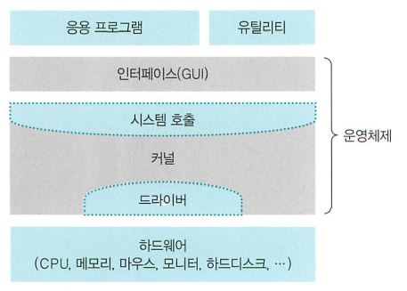

 

커널은 `프로세스, 메모리, 저장장치 관리와 같이 운영체제의 핵심적인 기능을 모아놓은 것`으로 자동차에 비유하자면 엔진에 해당합니다. 마치 벤츠, 테슬라, 아우디의 성능을 엔진이 좌우하는 것처럼 운영체제의 성능은 이 커널에 달려 있습니다. 이러한 커널의 주요 역할은 아래와 같습니다.

|핵심 기능|설명|
|--------|----|
|프로세스 관리|프로세스에 CPU 배분 및 필요한 작업 환경 제공|
|메모리 관리|프로세스에 작업 공간을 배치하고 실제 메모리보다 큰 가상공간 제공|
|파일 시스템 관리|데이터 저장 및 접근 가능한 인터페이스 제공|
|입출력 관리|필요한 입출력 서비스 제공|
|프로세스 간 통신 관리|공동 작업을 위한 프로세스 간 통신 환경 지원|

> 프로세스 간 통신(Inter-Process Communication, IPC)

 

자동차는 사람이 조작이 가능해야 하죠? 핸들과 브레이크, 계기판 등으로 확인하거나 행위에 대해 변경할 수 있어야 하는데 이를 인터페이스라고 합니다. 운영체제의 인터페이스는 `커널에 사용자 명령을 전달하고, 실행 결과를 사용자에게 알려주는 역할`을 해요. 응용 프로그램과 커널의 인터페이스는 **시스템 호출**, 커널과 하드웨어의 인터페이스는 **드라이버**가 담당합니다.

 

[(상위 문서로)](https://github.com/InSeong-So/IT-Note)

 

## :book: 커널의 `종류`를 알려주세요.
> 커널의 핵심 기능은 유기적으로 복잡하게 얽혀 있습니다.

### 단일형 구조 커널
> 단일형 구조(Monolithic Architecture) 커널은 커널의 핵심 기능을 구현하는 모듈들이 구분 없이 하나로 구성되어 있습니다.

 

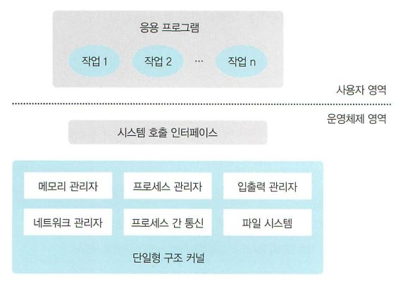

 

초기에는 기능을 만들기에 바빴으므로 모듈을 분리하여 구현할 여유가 없었습니다. 프로그래밍 언어의 함수로 비유하자면 main() 함수에 모든 기능을 탑재한 것이에요.

그런 만큼 모듈 간 통신 비용이 줄어들어 `효율적인 운영이 가능`했습니다. 그러나 `버그나 오류에 대처하기 힘들었으며` 하나의 에러가 `시스템 전체에 영향`을 미치고, `다양한 환경의 시스템에 적용하기 어려워` 현대의 운영체제에 단일형 구조 커널을 구현하기는 쉽지 않았습니다.

 

### :book: 계층형 구조 커널
> 계층형 구조(Layered Architecture) 커널은 비슷한 기능을 가진 모듈을 묶어 하나의 계층으로 만들고 계층 간 통신을 통해 운영체제를 구현합니다.

 

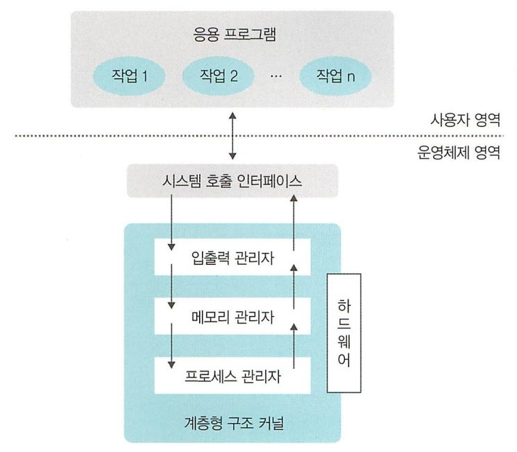

 

단일형 구조 커널을 발전한 형태입니다. 기능을 분류하여 모아놓음으로 `버그나 오류를 쉽게 처리`할 수 있었죠. 오류가 발생하면 전체 커널이 아니라 해당 계층만 수정하면 되어 `디버깅(Debugging)도 쉬웠`습니다. 오늘날의 운영체제는 대부분 이 구조로 이루어져 있습니다.

 

### :book: 마이크로 구조 커널
> 마이크로 구조(Micro Architecture) 커널은 운영체제가 프로세스 관리, 메모리 관리, 프로세스 간 통신 관리 등 가장 기본적인 기능만 제공합니다.

 

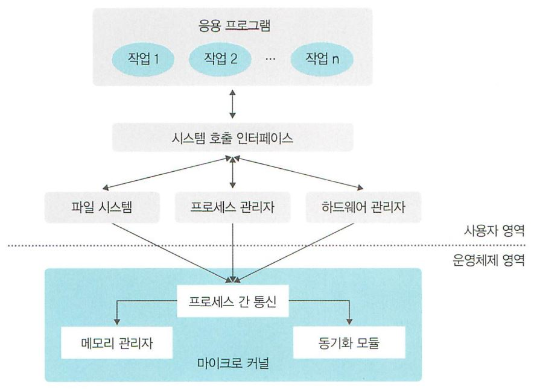

 

하드웨어와 사용자의 요구가 다양해짐에 따라 커널의 계층과 기능도 커져만 갔습니다. 하드웨어의 용량과 커널의 크기가 지나치게 방대해지면서 오류를 잡기 힘들었죠. 따라서 계층형 구조의 접근 방식과 반대인 마이크로 구조 커널이 등장하게 되었습니다.

마이크로 구조 커널은 기본적인 기능만 제공합니다. 모듈은 세분화 되어 존재하지만 모듈 간 정보 교환은 프로세스 간 통신을 이용해 이루어집니다.

마이크로 구조 커널은 각 모듈이 독립적으로 작동하므로 `하나의 모듈에 에러가 발생해도 운영체제가 멈추지 않습니다`. 또한 `다양한 컴퓨터에 이식이 쉽고` `커널이 가벼워 CPU 용량이 작은 시스템에도 적용이 가능`합니다.

 

[(상위 문서로)](https://github.com/InSeong-So/IT-Note)

 

## :book: `가상머신`이란 무엇인가요?
> 가상 머신(Virtual Machine, VM)은 물리적 하드웨어 시스템에 구축되어 자체 CPU, 메모리, 네트워크 인터페이스 및 스토리지를 갖춘 가상 환경입니다.

커널 기반 가상 머신(KVM)과 같은 하이퍼바이저가 탑재된 물리적 머신을 호스트 머신, 호스트 컴퓨터, 호스트 운영 체제 또는 간단히 호스트라고 부릅니다. 리소스를 사용하는 여러 VM을 게스트 머신, 게스트 컴퓨터, 게스트 운영 체제 또는 간단히 게스트라고 부릅니다. 하이퍼바이저는 CPU, 메모리, 스토리지 등의 컴퓨팅 리소스를 처리하는 리소스의 풀로, 기존 게스트 간 또는 새로운 가상 머신에 쉽게 재배치할 수 있습니다.

VM은 시스템의 나머지 부분과 격리되며, 서버처럼 하나의 하드웨어에 여러 VM이 존재할 수 있습니다. 이는 수요에 따라 또는 더 효율적인 리소스 사용을 위해 호스트 서버 간에 이동할 수 있습니다.  

 

[(상위 문서로)](https://github.com/InSeong-So/IT-Note)

 

## :book: `하이퍼바이저`란 무엇인가요?
> 가상 머신을 생성하고 구동하는 소프트웨어입니다.

가상 머신 모니터(Virtual Machine Monitor, VMM)라고도 불리는 하이퍼바이저는 하이퍼바이저 운영 체제와 가상 머신의 리소스를 분리해 VM의 생성과 관리를 지원합니다.

하이퍼바이저로 사용되는 물리 하드웨어를 호스트라고 하며 리소스를 사용하는 여러 VM을 게스트라고 합니다.

하이퍼바이저는 CPU, 메모리, 스토리지 등의 리소스를 처리하는 풀로, 기존 게스트 간 또는 새로운 가상 머신에 쉽게 재배치할 수 있습니다.

모든 하이퍼바이저에서 VM을 실행하려면 메모리 관리 프로그램, 프로세스 스케줄러, I/O(입력/출력) 스택, 기기 드라이버, 보안 관리 프로그램, 네트워크 스택과 같은 운영 체제 수준의 구성 요소가 필요합니다.

하이퍼바이저는 할당되었던 리소스를 각 가상 머신에 제공하고, 물리 리소스에 대해 VM 리소스의 일정을 관리합니다. 물리적 하드웨어는 계속해서 실행 작업을 수행하므로 하이퍼바이저가 일정을 관리하는 동안 CPU가 VM에서 요청한 대로 CPU 명령을 계속 실행합니다.

서로 다른 여러 개의 운영 체제를 나란히 구동할 수 있으며, 하이퍼바이저를 사용해 동일한 가상화 하드웨어 리소스를 공유합니다. 바로 이러한 부분이 가상화의 핵심적인 이점입니다. 가상화가 없다면 하드웨어에서 운영 체제를 1개만 구동할 수 있습니다. 

컨테이너와 VM은 유사하다고 볼 수 있습니다. 이 두 가지 모두 다양한 IT 요소를 결합해 시스템의 나머지 부분으로부터 분리하는 패키지 컴퓨팅 환경이기 때문입니다. 중요한 차이점은 확장 방식과 이식성

 

[참조] <a href="https://www.redhat.com/ko/topics/virtualization/what-is-a-hypervisor">CPU와 GPU의 차이</a>

[(상위 문서로)](https://github.com/InSeong-So/IT-Note)

 

## :book: `GPU`와` CPU`의 차이에 대해 설명하세요.
> 둘 다 실리콘 기반 마이크로프로세서로 데이터를 처리할 수 있으나 아키텍쳐와 용도가 다릅니다.

CPU는 최상위 계층의 '중앙처리장치'로써 컴퓨터의 두뇌와 같은 역할을 담당합니다. 따라서 데이터 처리와 더불어 프로그램에서 분석한 알고리즘에 따라 다음 행동을 결정하고 멀티태스킹을 위해 나눈 작업들에 우선순위를 지정하고 전환하며 가상 메모리를 관리하는 등 컴퓨터를 지휘하는 역할을 수행합니다.

GPU는 픽셀로 이루어진 영상을 처리하는 용도로 탄생했습니다. 반복적이고 비슷한 대량 연산을 병렬적(Parallel)으로 수행하기 때문에 CPU보다 훨씬 빠릅니다. 영상, 렌더링을 비롯한 그래픽 작업의 경우 픽셀 하나하나에 대해 연산을 하기 때문에 연산능력이 비교적 떨어지는 CPU가 GPU로 데이터를 보내 재빠르게 처리합니다.

CPU는 GPU보다 적은 코어를 갖고 있지만 각 코어가 GPU보다 강력하므로 순차 작업(Sequential task)에 좋습니다. 반면 GPU는 병렬 작업을 효율적으로 처리할 수 있는 수천 개의 코어를 가지므로병렬 작업(Paralell task)에 좋습니다.

애플리케이션의 연산 집약적 부분을 GPU로 넘기고 나머지 코드만을 CPU에서 처리하는 GPU 가속 컴퓨팅은 딥러닝, 머신러닝 영역에서 강력한 성능을 제공합니다. 사용자 입장에서는 연산 속도가 놀라울 정도로 빨라졌음을 느낄 수 있죠.

 

[참조] <a href="https://sdc-james.gitbook.io/onebook/2.-1/1./1.1.1.-cpu-gpu">CPU와 GPU의 차이</a>

[(상위 문서로)](https://github.com/InSeong-So/IT-Note)

 

## :book: `메모리의 구성`에 대해 설명해주세요.
> 메모리는 코드, 데이터, 스택, 힙 영역으로 나누어져 있습니다.

| 영역          | 설명                                                                                                              |
| ------------- | ----------------------------------------------------------------------------------------------------------------- |
| `코드` 영역   | 실행될 프로그램의 코드가 저장됩니다.                                                                              |
| `데이터` 영역 | 전역 변수와 정적 변수가 저장됩니다.                                                                               |
| `스택` 영역   | 지역변수와 매개 변수가 저장되어 있으며, 함수의 호출과 함께 할당 컴파일 타임(Compile time)에 크기가 결정됩니다. |
| `힙` 영역     | 사용자에 의해 동적으로 할당되고 해제될 수 있는 메모리 영역 런 타임(Run time)에 크기가 결정됩니다.              |

 

[(상위 문서로)](https://github.com/InSeong-So/IT-Note)

 

## :book: 메모리의 종류인 `RAM` 과 `ROM` 에 대해 알려주세요.
### RAM(Random Access Memory)
> 임의 액세스 방식의 반도체 집적회로 기억장치(Semiconductor IC Memory)입니다.

데이터 읽기와 쓰기가 모두 가능하나 휘발성(Volatile)으로서 전원 공급이 중단되면 내용이 삭제됩니다. 종류로는 용량이 큰 주기억장치로 사용되는 DRAM(Dynamic RAM)과 DRAM 보다 처리 속도가 빨라 캐시 기억장치로 사용되는 SRAM(Static RAM)이 있습니다.

 

### ROM(Read Only Memory)
> 영구 저장이 가능한 반도체 기억장치로 읽는 것만 가능하며 쓰는 것은 불가능합니다.

보통 시스템 초기화 및 진단 프로그램이나 자주 쓰는 함수들로 구성된 서브루틴에 사용합니다. 종류로는 사용자가 한 번 쓰는 것이 가능한 PROM(Programmable ROM),  자외선을 이용하여 내용을 지우는 것이 가능한 PROM 형태인 EPROM(Erasable Programmable ROM), 전기적으로 데이터를 지울 수 있는 EEPROM(Electrically Erasable PROM), 블록 단위로 지우는 것이 가능한 플래쉬 기억장치(Flash Memory)가 있습니다.

 

[(상위 문서로)](https://github.com/InSeong-So/IT-Note)

 

## :book: `메모리 계층`에 대해 알려주세요.
> 메모리 계층(Memory hierarchy)는 CPU가 메모리에 더욱 빠르게 접근하기 위해 나눈 구조입니다.

 

 

이를 설명하자면, 아래와 같습니다.
1. 레지스터와 캐시는 CPU 내부에 존재하므로 CPU는 아주 빠르게 접근할 수 있습니다.
2. 메모리는 CPU 외부에 존재하므로 레지스터와 캐시보다 더 느리게 접근 할 수 밖에 없습니다.
3. 하드 디스크는 CPU가 직접 접근할 방법이 없습니다. 따라서 CPU는 하드 디스크의 데이터를 메모리로 이동시키고, 이 메모리에서 접근하므로 속도가 아주 느립니다.

 

[(상위 문서로)](https://github.com/InSeong-So/IT-Note)

 

## :book: `메모리 관리 전략`에 대해 알려주세요.
> 메모리는 CPU 가 직접 접근하는 유일한 저장장치입니다.

메모리 시스템(하드웨어)은 주소(메모리 위치)를 관리하며 할당과 접근을 제어하는데, 이는 `제한된 물리적 메모리의 효율적인 사용(할당)`과 `효율적인 메모리 참조(논리-물리주소 할당)`를 위함입니다.

이러한 관리에는 여러 전략이 있습니다.
1. **스와핑(Swapping)** : CPU에서 실행 중이지 않은 프로세스의 메모리 이미지를 저장 장치에 이동시켜 메모리 사용의 효율성을 증가시킵니다.
2. **연속 메모리 할당(Contiguous Memory Allocation)** : 각 프로세스가 필요로 하는 메모리 요구량을 분석한 뒤, 필요한 메모리를 연속으로 할당(연속된 물리 메모리이므로 시작 주소만 필요해요)합니다.
3. **페이징(Paging)** : 프로세스가 사용하는 주소 공간을 여러 개로 분할하여 비연속적인 물리 메모리 공간에 할당, 가상 메모리를 모두 같은 크기의 블록으로 편성합니다.
4. **세그멘테이션(Segmentation)** : 프로세스가 필요로 하는 메모리 공간을 분할하여 비연속적인 물리 메모리 공간에 할당합니다.

 

[(상위 문서로)](https://github.com/InSeong-So/IT-Note)

 

## :book: `메모리 할당 알고리즘`에 대해 알려주세요.
> 새로 적재되어야 할 데이터를 주기억장치 영역 중 어느 곳에 배치할지를 결정하는 전략입니다.

페이지, 세그먼트 등이 적재될 위치를 결정하는 정책으로, 종류는 아래와 같습니다.
1. **최초 적합(First-fit)** : 가용공간 중 수용가능한 첫번째 기억공간을 할당합니다.
2. **최적 적합(Best-fit)** : 모든 공간 중에서 수용가능한 가장 작은 곳을 선택합니다.
3. **최악 적합(Worst-fit)** : 모든 공간 중에서 수용가능한 가장 큰 곳을 선택합니다.

따라서, **공간 효율성**은 `최적 적합 > 최초 적합 > 최악 적합` 순으로, **시간 효율성**은 `최초 적합 > 최적적합 ≒ 최악적합` 순이 됩니다.

 

[(상위 문서로)](https://github.com/InSeong-So/IT-Note)

 

## :book: `페이지 교체 알고리즘`에 대해 알려주세요.
> 페이지 부재 발생 시 새로운 페이지를 할당하기 위해 현재 할당된 페이지 중 어느 것과 교체할 지를 결정하는 전략입니다.

여러 종류가 있는데, 하나씩 간단히 살펴봅시다.
1. **FIFO(First-In, First-Out)** : 메모리에 올라온 지 가장 오래된 페이지를 교체합니다.
2. **최적 페이지 교체(Optimal Page Replace)** :	이론상 최적 알고리즘입니다.
3. **NRU 페이지 교체(Not-Recently-Used)**: 최근 미사용 페이지를 교체합니다.
4. **LRU 페이지 교체(Least-Recently-Used)** : 가장 오래 사용되지 않은 페이지를 교체합니다.
5. **LFU 페이지 교체(Least-Frequently-Used)** : 참조 횟수가 가장 작은 페이지를 교체합니다.
6. **MFU 페이지 교체(Most-Frequently-Used)** : 참조 횟수가 가장 많은 페이지를 교체합니다.

 

- ~~랜덤 페이지 교체~~ 잘 사용되지 않습니다.
- ~~2차 기회 : Second Chance. FIFO의 변형판~~ 잘 사용되지 않습니다.
- ~~클럭~~ 잘 사용되지 않습니다.
- ~~에이징~~ 잘 사용되지 않습니다.
- ~~참조 비트 없는 하드웨어 기법~~ 잘 사용되지 않습니다.

 

[(상위 문서로)](https://github.com/InSeong-So/IT-Note)

 

## :book: `가상 메모리`에 대해 설명해주세요.
> 가상 메모리(Virtual Memory)는 크기가 다른 물리 메모리에서 일관되게 프로세스를 실행할 수 있는 기술입니다.

물리적으로 존재하지는 않으나 사용자에게 있어 메모리의 역할을 하는 가상의 메모리로 운영체제가 발전하면서 실제 메모리를 더 효율적으로 사용하기 위해 파생된 기법입니다.

프로그램은 가상 메모리의 크기에 맞춰 수용되지만 수용된 프로그램 실행 시 실제 메모리가 필요합니다.

 

[(상위 문서로)](https://github.com/InSeong-So/IT-Note)

 

## :book: 가상 메모리의 `매핑 테이블`은 무엇인가요?
> 가상 주소는 실제 물리 주소 혹은 스왑 영역 중 한 곳에 위치하고, 메모리 관리자는 가상 주소와 물리 주소를 1:1 매핑 테이블(Mapping Table)로 관리합니다.

사용 가능한 메모리 주소는 적은데 대기하는 프로세스가 많다고 가정해볼까요? 보통 프로세스가 접근하는 순서대로 메모리 주소를 할당하지만, 가끔은 우선순위에 따라 프로세스 순서를 바꾸기도 하죠. 매 순간 프로세스의 메모리 할당과 실행을 관리하는 가장 좋은 방법은 `테이블 형태`로 관리하는 것이며, 이를 매핑 테이블이라고 합니다.

매핑 테이블에는 프로세스가 접근하는 순서, 작업의 양, 현재 주소, 실행할 내용 등이 있죠. 이 매핑 테이블을 메모리 관리자가 공유하면서 프로세스를 처리하면 작업 효율이 올라가겠죠?

아래 그림은 매핑 테이블을 나타낸 것입니다.

 

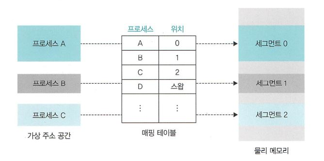

 

가상 주소상 프로세스 A는 물리 메모리의 세그먼트 0에, 프로세스 B는 세그먼트 1에 위치합니다. 그럼 프로세스 D는 뭘까요? 바로 스왑 영역입니다. A가 원할 때는 세그먼트 0에서 원하는 데이터를 가져오기만 하면 되는 형태가 되는 것이죠.

매핑 테이블은 페이징 기법에서는 페이지 매핑 테이블(Page Mapping Table), 세그멘테이션 기법에서는 세그멘테이션 매핑 테이블(Segmentation Mapping Table)이라고 부릅니다.

 

[(상위 문서로)](https://github.com/InSeong-So/IT-Note)

 

## :book: `버퍼`가 무엇인지 알려주세요.
> 버퍼(Buffer)는 속도 차이가 있는 두 장치 사이에서 그 차이를 완화하는 역할을 합니다.

만약 느린 입출력 장치에서 데이터를 읽을 때마다 하나씩 전송하면 작업량에 비해 실제 전송량은 매우 작죠. 그러나 일정량의 데이터를 모아서 한 번에 전송하면 적은 작업량으로 많은 데이터를 전송할 수 있습니다. 이렇게 일정한 데이터를 모아 옮김으로써 속도의 차이를 완화하는 장치가 버퍼입니다.

 

[(상위 문서로)](https://github.com/InSeong-So/IT-Note)

 

## :book: `캐시`란 무엇인가요?
> 캐시(Cache)는 메모리와 CPU 간 속도 차이를 완화하기 위해 메모리 데이터를 미리 가져와 저장해두는 임시 저장소입니다.

캐시는 CPU 내부에 위치하고, CPU 내부 버스 속도로 작동합니다. 메모리의 경우 시스템 버스 속도로 작동하기 때문에 느리죠. 즉 빠른 CPU와 느린 메모리 사이에서 두 장치의 속도 차이를 완화해줍니다.

캐시는 필요한 데이터를 모아 한꺼번에 전달하는 버퍼의 일종으로, CPU가 앞으로 사용할 데이터를 예상하고 미리 가져옵니다. 이러한 작업을 **미리 가져오기(Prefetch)** 라고 합니다.

CPU는 메모리에 접근해야 할 때 캐시를 먼저 방문하여 원하는 데이터가 있는지 찾아볼 수 있죠. 그 데이터가 존재하면 캐시 히트(Cache Hit)라고 하며 이를 바로 사용합니다. 그러나 이 데이터가 없다면 캐시 미스(Cache Miss)라고 하며 메모리에 접근하여 데이터를 찾게 됩니다. 캐시가 히트되는 비율을 캐시 적중률(Cache Hit Ratio)라고 하며, 일반적인 컴퓨터의 캐시 적중률은 약 90%입니다.

 

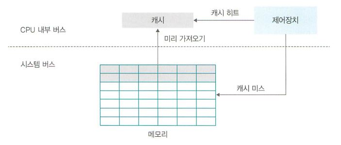

 

[(상위 문서로)](https://github.com/InSeong-So/IT-Note)

 

## :book: `캐시의 지역성`을 설명해주세요.
> 캐시 적중률을 향상시키기 위해 지역성(Locality)의 원리가 사용됩니다.

프로그램이 모든 데이터를 균등하게 접근하거나 비슷한 시간에 참조한다면 캐시 효율이 떨어지게 돼죠. 따라서 접근하는 특정 순간에 집중적으로 참조하는 특성을 지역성이라고 하며 `시간`과 `공간` 지역성이 존재합니다.

- 시간 지역성 : 특정 데이터가 접근되었따면 가까운 미래에 또 한번 데이터에 접근할 가능성이 높습니다.
- 공간 지역성 : 특정 데이터의 주변 주소가 접근되었을 경우입니다. 메모리 주소를 오름차순이나 내림차순으로 접근한다면 캐시에 저장된 같은 블록의 데이터를 접근하게 되므로 캐시의 효율성이 크게 향상됩니다.

 

[(상위 문서로)](https://github.com/InSeong-So/IT-Note)

 

## :book: `캐시 메모리` 에 대해 알려주세요.
> CPU와 주기억장치의 속도 차이로 인한 CPU 대기 시간을 최소화시키기 위해 설치하는 고속 반도체 기억장치입니다.

CPU 와 주기억장치 사이에 설치되며 주기억장치보다 액세스 속도가 높은 칩을 사용하지만 공간이 제한되므로 용량이 적고, 가격이 너무 비쌉니다.

 

[(상위 문서로)](https://github.com/InSeong-So/IT-Note)

 

## :book: 캐시 메모리의 `사상 방식` 에 대해 알려주세요.
> 매핑(Mapping)과 동일한 말입니다. 페이지 테이블 매핑 방식과 비슷하게 사용되지만 캐시의 크기는 메모리보다 작아 항상 메모리의 일부 페이지만 가지고 있죠.

### 캐시 직점 매핑
> 캐시 메모리를 일정 크기로 나누고, 이 덩어리를 P라고 부릅니다.

 

### 캐시 연관 매핑

 

### 캐시 집합-연관 매핑

 

[(상위 문서로)](https://github.com/InSeong-So/IT-Note)

 

## :book: `저장장치의 계층 구조`에 대해 설명할 수 있나요?
> 저장장치 계층 구조(Storage Hierarchy)는 사용자가 저렴한 가격으로 용량은 하드디스크처럼, 작업 속도는 레지스터처럼 사용하게 해줍니다.

최고 성능의 컴퓨터를 제작하기 위해 SSD를 장착하고 메모리를 확장하고, 캐시 적중률을 높이는 것은 너무 비쌉니다.

그래서 가격과 컴퓨터 성능 사이에 타협점이 존재하는데, 이것이 저장장치의 계층 구조입니다. 

 

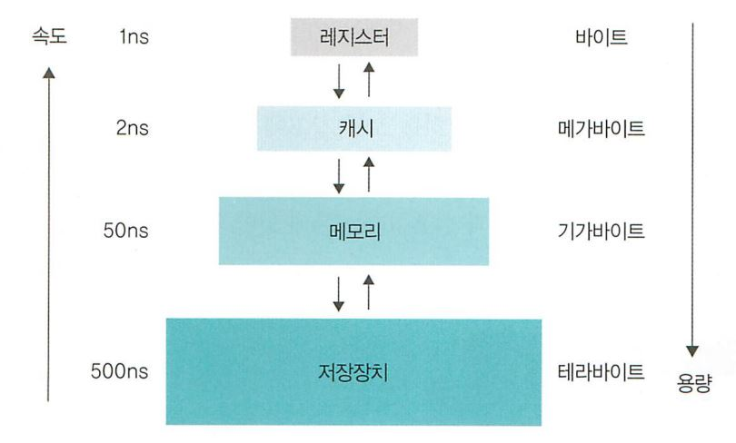

 

이 저장장치 계층 구조는 속도가 빠르고 비싼 저장장치(레지스터, 캐시)를 CPU와 가까운 쪽에, 값이 싸고 용량이 큰 저장장치(하드디스크)는 반대쪽에 배치하여 적당한 가격으로 빠른 속도와 큰 용량을 동시에 얻을 수 있습니다.

그러나 이 구조도 문제가 있죠. 바로 데이터 일관성을 유지하는 것입니다. CPU가 캐시에 저장된 데이터를 변경하면 메모리의 데이터도 갱신되어야 하지만 즉시 반영되지 않고 지연 쓰기를 한다면 일관성에 문제가 생기죠. 또한 다른 작업이 현재 작업의 데이터를 읽어도 일관성이 깨지며, 전원이 꺼지면 데이터를 손실할 수도 있습니다.

 

[(상위 문서로)](https://github.com/InSeong-So/IT-Note)

 

## :book: `인터럽트`에 대해 설명해주세요.
> 주변 장치가 증가함에 따라 작업 효율을 향상하기 위해 등장한 입출력 관리 방식

초기 컴퓨터 시스템은 주변장치가 많지 않았으므로 CPU가 **직접 입출력장치**에 접근하여 데이터를 송/수신했는데, 이러한 방식을 `폴링(Poling)`이라고 합니다. 폴링 방식을 설명하면 아래와 같습니다.
- CPU가 입출력장치의 상태를 주기적으로 검사하여 일정한 조건을 만족할 때 데이터를 처리합니다.
- CPU가 `명령어 해석/실행`이라는 본래 역할 외에 모든 입출력까지 관여하므로 작업 효율은 떨어집니다.

하지만 현재의 컴퓨터는 많은 주변장치가 존재합니다. 따라서 CPU가 모든 입출력에 관여하는 경우 작업 효율이 현저히 떨어지므로 이를 해결하기 위해 등장한 방식이 `인터럽트(Interrupt)`라고 합니다. 인터럽트 방식은 아래와 같아요.
- CPU가 입출력 관리자에게 입출력 명령을 보냅니다.
- 입출력 관리자는 명령받은 데이터를 메모리에 가져다 놓거나 메모리의 데이터를 저장장치로 옮깁니다.
- 데이터 전송이 완료되면 입출력 관리자는 완료 신호를 CPU에 보냅니다.

이렇게 입출력 관리자가 CPU에 보내는 완료 신호를 인터럽트라고 합니다. CPU는 입출력 관리자에게 작업 지시를 내리고 다른 일을 하닥 ㅏ완료 신호를 받으면 하던 일을 중단하고 옮겨진 데이터를 처리하는데, 이처럼 `하던 작업을 중단하고 처리해야 하는 신호`라는 의미에서 `인터럽트`라고 불리게 되었습니다.

 

[(상위 문서로)](https://github.com/InSeong-So/IT-Note)

 

## :book: `병렬 처리`란 무엇이죠?
> 동시에 여러 명령을 처리하여 작업의 능률을 향상하는 방법입니다.

CPU의 사양에 비유하면 하나의 코어에 여러 개의 스레드(Thread)를 이용하는 방식으로 이를 `파이프라인 기법`이라고 합니다. 여기서 스레드는 CPU가 처리할 수 있는 작업의 단위이며 여러 스레드를 동시에 처리하는 방법을 `CPU 멀티스레드(Multi-Thread)`라고 합니다.

물론 병렬 처리에는 파이프라인 기법 뿐만 아니라 `슈퍼스칼라 기법`이 있습니다. 예를 들면 듀얼코어 CPU는 한 CPU에 작업을 처리하는 코어가 2개 있고, 슈퍼스칼라 기법을 이용하여 2개 작업을 동시에 처리할 수 있죠.

 

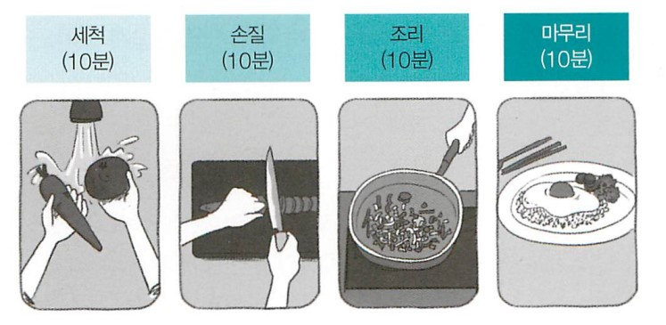

볶음밥 조리 과정

 

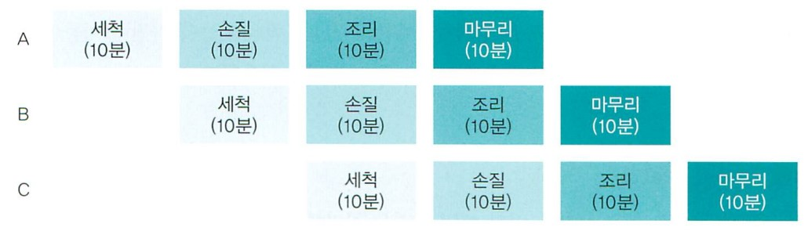

볶음밥 조리 병렬 처리 - 파이프라인

 

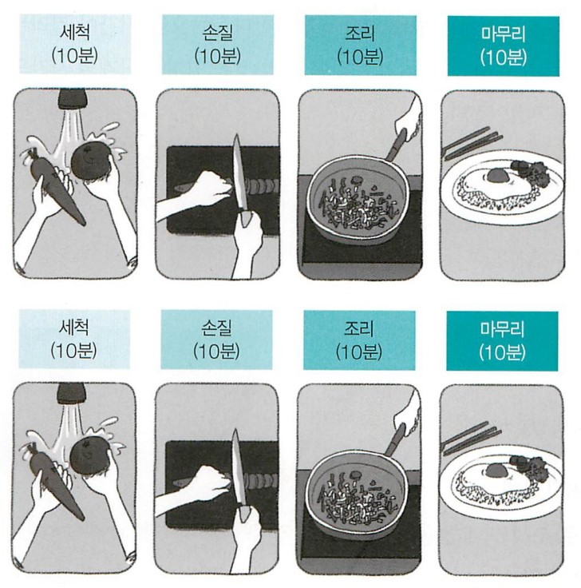

볶음밥 조리 병렬 처리 - 슈퍼스칼라

 

 

[(상위 문서로)](https://github.com/InSeong-So/IT-Note)

 

## :book: `병렬 처리 시 고려사항`은 어떤게 있나요?
### 1. 상호 의존성이 없는지 확인합니다.
각 명령이 서로 독립적이며 앞의 결과가 뒤의 명령에 영향을 미치지 않아야 한다는 것입니다. 

가령 상단의 그림에서 손질한 채소를 볶는 과정을 진행하려면 그 전 단계인 채소 손질이 완료되어야 한다는 뜻이므로 `전, 후` 과정에 상호 의존적인 명령어가 존재하면 병렬 처리를 할 수 없는 것입니다.

 

### 2. 각 단계의 시간을 일정하게 맞춰야 합니다.
각 단계별 처리 시간이 상이하다면 앞의 작업이 종료되어도 `가장 긴 시간이 걸리는 단계`에서 **병목 현상**이 발생합니다. 그러면 전반적으로 진행 단계가 밀려 전체 작업 시간이 늘어나죠. 

결국 단계별 처리 시간의 차이가 크면 병렬 처리의 효과가 떨어집니다.

 

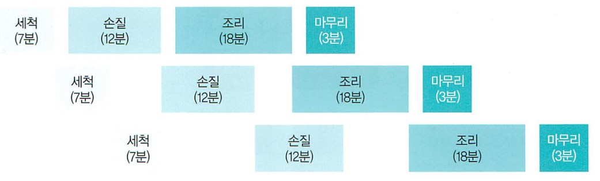

 

 

### 3. 전체 작업 시간을 몇 단계로 나눌지 생각해봅니다.
병렬 처리에서 작업을 N개로 쪼갰을 때 N을 `병렬 처리의 깊이(Depth of parallel processing)`라고 합니다. 병렬 처리의 깊이가 1인 경우 일반적으로 병렬 처리가 없는 작업이죠. 병렬 처리가 2인 경우 작업을 두 단계로 나누므로 동시에 처리할 수 있는 작업의 개수가 최대 2개입니다.

결국 **병렬 처리의 깊이 N은 동시에 처리할 수 있는 작업의 개수를 의미**합니다. 이론적으로는 N이 클수록 동시에 작업할 수 있는 작업 개수가 많아 성능이 높아질 것으로 예상되나, 각 단계마다 작업을 이동하고 새로운 작업을 불러오는 시간이 너무 많이 소요되므로 오히려 성능이 저하됩니다. 이러한 오버헤드를 고려해 일반적으로는 병렬 처리 깊이를 10 ~ 20으로 진행합니다.

 

 

 

[(상위 문서로)](https://github.com/InSeong-So/IT-Note)

 

## :book: `병렬 처리 기법의 종류`를 알려주세요.
## :book: `프로세스`에 대해 설명해주세요.
> 메모리에 할당되어 실행되고 있는 프로그램의 인스턴스(독립적인 개체)입니다.

 

 

운영체제로부터 시스템 자원을 할당받는 작업의 단위로, 동적인 개념으로는 실행된 프로그램을 의미하며 아래와 같은 특징이 있습니다.
1. 프로세스는 각각 독립된 메모리 영역(Code, Data, Stack, Heap의 구조)을 할당 받습니다.
2. 기본적으로 프로세스당 최소 1개의 스레드(메인 스레드)를 가지고 있습니다.
3. 각 프로세스는 별도의 주소 공간에서 실행되며, 한 프로세스는 다른 프로세스의 변수나 자료구조에 접근할 수 없습니다.
4. 한 프로세스가 다른 프로세스의 자원에 접근하려면 프로세스 간의 통신(IPC, inter-process communication) 방법인 파이프, 파일, 소켓 등을 사용해야 합니다.

 

[(상위 문서로)](https://github.com/InSeong-So/IT-Note)

 

## :book: 프로그램에서 `프로세스로의 전환`은 무엇인가요?
## :book: `프로세스의 상태`를 설명해주세요
## :book: `프로세스 동기화`는 무엇인가요?
## :book: `프로세스 제어 블록`이란?
## :book: `문맥 교환(Context Switching)`이 무엇인가요?
> 현재 진행중인 작업(Process, Thread)의 상태를 저장하고 다음 작업의 상태를 적용하는 과정입니다.

운영체제에서의 레지스터 값(Context)은 CPU가 해당 프로세스를 실행하기 위한 해당 프로세스의 정보들입니다. 이 값은 프로세스의 PCB(Process Control Block)에 저장되죠.

멀티 프로세스 환경에서 CPU가 어떤 하나의 프로세스를 실행하고 있는 상태일 때, 인터럽트가 발생해 다음 우선 순위의 프로세스가 실행되어야 한다면 아래와 같은 절차를 따릅니다.
1. 기존 프로세스의 상태 또는 레지스터 값을 PCB에 저장합니다.
2. CPU가 다음 프로세스를 수행하도록 새로운 프로세스의 상태 또는 레지스터 값인 PCB를 교체합니다.

이러한 작업을 문맥 교환(Context Switching)이라고 합니다. 

 

[(상위 문서로)](https://github.com/InSeong-So/IT-Note)

 

## :book: `프로세스의 구조`와 `생성/복사`에 대해 설명해주세요.
## :book: `프로세스의 전환`은 어떻게 진행되나요?
## :book: `프로세스의 계층구조`는 무엇일까요?
## :book: `다중 큐의 준비/대기 상태`를 설명해주세요.
## :book: `스레드`에 대해 설명해주세요.
> 프로세스가 할당받은 자원을 이용하는 실행의 단위입니다.

 

 

프로세스의 특정한 수행 경로로서 실행되는 여러 흐름을 뜻하기도 하며 아래와 같은 특징이 있습니다.
1. 스레드는 프로세스 내에서 각각 Stack만 따로 할당받고 Code, Data, Heap 영역은 공유합니다.
2. 즉, 같은 프로세스 내부의 여러 스레드는 각각 별도의 레지스터와 스택을 갖고 있으나 Heap 영역은 서로 읽고 쓸 수 있습니다.
3. 한 스레드가 프로세스 자원을 변경하면 다른 이웃 스레드(Sibling Thread)도 그 변경 결과를 즉시 확인할 수 있습니다.

 

[(상위 문서로)](https://github.com/InSeong-So/IT-Note)

 

## :book: `스레드 세이프한 프로그래밍 조건`엔 무엇이 있나요?
> 스레드 세이프(Thread-safe)란 어떤 함수, 변수, 객체가 여러 스레드로부터 동시 다발적인 접근이 일어나도 프로그램 실행이 보장되는 것입니다.

스레드 세이프한 프로그래밍이란 아래의 조건이 충족되어야 합니다.
1. 재진입성 보장(Re-entrancy)
   - 어떤 함수가 한 스레드에 의해 호출되어 실행 중일 때, 다른 스레드가 그 함수를 호출하더라도 그 결과가 각각에게 올바로 반환되어야 합니다.
2. 스레드별 지역 변수 사용(Thread-local storage)
   - 공유 자원의 사용을 최대한 줄이고 각각의 스레드에서만 접근 가능하게 설정하여 스레드가 공유 자원에 동시 접근하는 것을 방지합니다.
   - 동기화 방법(Synchronization)과 관련이 있습니다.
3. 상호 배제(Mutual exclusion)
   - 공유 자원을 반드시 사용해야 할 경우 해당 자원의 접근을 세마포어(Semaphore) 등의 락으로 통제합니다.
4. 중단되지 않는 연산(Atomic operations)
   - 공유 자원 접근 시 이 연산을 이용하거나 `원자적(Atomic)`으로 정의된 접근 방법을 사용함으로써 상호 배제를 구현할 수 있습니다.

 

[(상위 문서로)](https://github.com/InSeong-So/IT-Note)

 

## :book: `프로세스`와 `스레드`의 차이점을 알려주세요.
## :book: `멀티 스레드`란 무엇인가요?
## :book: `멀티 프로세스` 와 `멀티 스레드`의 장단점을 알려주세요.
> **멀티 프로세스(Multi-Process)** 는 하나의 프로그램을 여러 프로세스(CPU)가 합동하여 작업(Task)을 처리합니다.

> **멀티 스레드(Multi-Thread)** 는 하나의 프로세스를 여러 스레드로 분할하여 작업을 처리합니다.

 

| 구분          | 장점                                                                                                                                                                | 단점                                                                                                                                                                                   |
| ------------- | ------------------------------------------------------------------------------------------------------------------------------------------------------------------- | -------------------------------------------------------------------------------------------------------------------------------------------------------------------------------------- |
| 멀티 프로세스 | 1. 독립된 구조로 안전성이 높습니다. 2. 프로세스 중 하나에 문제가 생겨도 다른 프로세스에 영향을 주지 않습니다. 3. 동일한 데이터를 공유하므로 비용적이 적게 듭니다.      | 1. 프로세스는 각자가 독립된 메모리 영역을 할당 받습니다. 따라서 문맥 교환 시 오버헤드가 발생할 가능성이 높습니다. 2. 하나의 프로그램에 속하는 프로세스들이라도 변수를 공유할 수 없습니다. |
| 멀티 스레드   | 1. 단일 프로세스로 자원을 효율적으로 관리할 수 있습니다. 2. 스레드가 작업을 분담하므로 문맥 교환이 빠릅니다. 3. Heap 영역을 공유하므로 스레드 간 통신 비용이 적습니다. | 1. 다른 프로세스에서 스레드를 제어할 수 없습니다. 2. 동기화로 인한 자원 공유 문제가 발생할 수 있습니다. 3. 하나의 스레드에 문제가 발생하면 다른 스레드에도 영향을 미칩니다.               |

 

[(상위 문서로)](https://github.com/InSeong-So/IT-Note)

 

## :book: 멀티 스레드의 `장단점`과 `모델`을 알려주세요.
### 사용자 스레드
> 응용 프로그램과 Link/Load가 되는 라이브러리로 구현되어 있으며 해당 라이브러리에 동기화, 스케줄링 기능이 모두 담겨 있습니다.

커널에서는 아무런 지원을 해주지 않으며, 커널이 보기에는 단일 프로세스일 뿐이에요. 장점과 단점을 살펴봅시다.

- 장점
  1. 프로세스마다 런타임 라이브러리의 사본이 호출되므로 스케줄링 정책을 프로세스마다 달리 취할 수 있습니다.
  2. 각 스레드 마다 Time Quantum(프로세스에게 할당되는 최대 CPU 시간)을 소모할 필요 없이 런타임 라이브러리가 값(Context)를 유지하기므로 문맥 교환(Context Switching)이 일어나지 않습니다. 따라서 매우 빠르며 효율적입니다.

- 단점
  1. 블로킹 시스템 호출(Blocking System Calls) : `Blocking function`이란 처리가 완료되지 않으면 반환(return)되지 않는 함수입니다. 만약 특정 스레드에서 블로킹이 되어 버리면 전체 프로세스가 블로킹 되어 버립니다. 이런 이유로 운영체제가 제공하는 논블로킹(non-Blocking)함수들만 사용하고, 사용 빈도가 높은 함수(read, select, wait 등)는 논블로킹 버젼으로 대체해야 합니다.
  2. 시스템 자원의 공유(Shared System Resources) : 동기화나 잠금(Locking) 없이 스레드끼리 공유하는 변수가 존재할 때, 스레드-세이프(Thread-safe)하지 않으면 덮어 씌워지는(Overwrite) 문제가 발생할 수 있습니다. 따라서 사용자, 커널 레벨의 모든 함수는 재진입(Re-entrancy)이 가능해야 합니다.
  3. 멀티 프로세스 이용 불가(Multiprocess Utilization) : 하나의 프로세스에서 시간을 공유므로 여러 개의 CPU를 동시에 사용할 수 없습니다.

 

### 커널 스레드
> 독립적으로 스케줄되므로 특정 스레드에서의 블로킹이 프로세스로 전파되지 않습니다. 따라서 블로킹 시스템 호출을 사용하여 각 스레드끼리 통신할 수 있습니다.

대부분의 운영체제 개발자들은 표준 라이브러리를 스레드-세이프하게 작성하므로 사용자 스레드보다 문제가 적습니다. 그러나 안전한 만큼 속도가 느린데, 이는 스레드 간 문맥 교환 시 일어나는 오버헤드 때문입니다.

 

### 멀티 스레드
> 사용자 스레드와 커널 스레드를 혼용하는 방법으로 하이브리드 스레드라고도 합니다.

사용자 스레드는 가벼워진 프로세스(Light Weight Processes, LWP)에 의해 커널 스레드와 다중화(Multiplexing)됩니다. 커널은 LWP를 스케줄링 및 실행하고, LWP는 대기중인 스레드 중 하나를 실행하죠. 이로써 프로그래머는 스레드 또는 LWP를 직접 사용하거나 둘 모두를 동시에 사용할 수도 있습니다.

멀티 스레드는 사용자 스레드처럼 작동하면서 병렬 컴퓨팅(Hardware Parallelism)과 블로킹에 대처할 수 있고, 문맥 교환을 자주 진행하지 않습니다. 그러나 문제점이 아예 없는 것은 아닙니다.
1. LWP가 블로킹되면 LWP에 속한 스레드도 블로킹됩니다.
2. LWP의 문맥 교환은 커널 스레드의 문맥 교환보다 비효율적입니다.
3. 다중 CPU에서 각 스레드의 LWP할당과 LWP의 CPU 할당은 별개로 이루어지므로 스레드를 각기 다른 CPU에 할당하려면 별도의 메커니즘이 필요합니다.

결국 LWP에 의한 멀티 스레드(Multiplexed Thread)는 궁극의 해결책이 아니지만, 커널 스레드의 스레드 문맥 교환 속도를 사용자 스레드의 문맥 교환 속도만큼 빠르게 처리한다면 상기 문제점은 모두 해결할 수 있습니다.

<!-- TODO : Scheduler Activation(kernel-supported user-level Thread) -->

 

[(상위 문서로)](https://github.com/InSeong-So/IT-Note)

 

## :book: `타임슬라이스`란 무엇인가요?
> 프로세스가 선점하고(Preempted) 있을 때 얼마나 오랫동안 동작할 수 있는지를 결정하는 것입니다.

프로세스 스케쥴링을 결정하는 정책의 근거로 프로세스가 연산(CPU) 중심인지, 입출력(I/O) 중심인지, 또는 우선순위(Pritority) 값과 타임 슬라이스(Timeslice) 값이 존재하는지가 있습니다.

즉, 프로세스가 선점되기 전까지 프로세스에 주어지는 시간은 미리 정해져있는데 이를 타임 슬라이스라고 하며 스케줄러는 이런 타임슬라이스를 관리하여 전체적인 시스템 스케쥴링을 결정합니다.

 

[(상위 문서로)](https://github.com/InSeong-So/IT-Note)

 

## :book: `사용자 스레드`와 `커널 스레드`의 차이점은 무엇인가요?
> **사용자 스레드(User Thread)** : 상단의 내용을 요약합니다. 라이브러리에 의해 구현된 일반적인 스레드입니다.

> **커널 스레드(Kernel Thread)** : 상단의 내용을 요약합니다. 커널이 직접 생성하고 관리하는 스레드입니다.

멀티 스레드 모델은 사용자 레벨 스레드, 커널 스레드, 멀티 스레드로 구분되는데, 생성과 관리의 주체가 무엇이냐가 기준이죠. 따라서 차이점도 이 근간에 있습니다.

커널 스레드는 커널 레벨의 모든 작업을 지원하므로 `멀티 CPU를 사용`할 수 있으며 하나의 스레드가 대기해도 `다른 스레드는 작업을 계속`할 수 있습니다. 또한 커널의 기능을 사용하므로 `보안성이 높고 안정적`이죠. 그러나 문맥 교환 진행 시 `오버헤드로 인해 느리게 작동`합니다.

사용자 스레드는 라이브러리가 직접 스케쥴링을 진행하며 필요한 정보를 모두 처리하므로 `문맥 교환이 일어나지 않아 빠르게 작동`합니다. 단, 사용자 스레드는 단 하나의 커널 스레드와 연결되므로 커널 스레드가 대기 상태에 들어가면 `모든 사용자 스레드가 대기`하게 됩니다. 즉 커널에 의해 대기 상태에 빠지면 프로세스 전체가 블로킹 되는 것이죠.

 

[(상위 문서로)](https://github.com/InSeong-So/IT-Note)

 

## :book: `프로세스의 동적 할당 영역`에 대해 설명해주세요.
## :book: `exit()/wati() 시스템 호출`은 어떻게 이루어지나요?
## :book: `스케줄러`에 대해 알려주세요.
## :book: `스케쥴링`이란 `무엇`이며, `어떤 목적`을 갖고 있죠
> 다중 프로그래밍을 가능하게 하는 운영 체제의 동작 기법입니다.

운영 체제는 자원 배정을 통해 시스템의 성능을 개선하며 장기, 중기, 단기 스케줄링이 있으며 결정 시점은 프로세스의 상태 변화가 있을 때로 아래와 같습니다.
1. 수행 → 대기
2. 수행 → 준비
3. 대기 → 준비
4. 수행 → 종료

 

[(상위 문서로)](https://github.com/InSeong-So/IT-Note)

 

## :book: 스케쥴링의 `단계`에 대해 설명해주세요.
1. 1단계 스케줄링
   - 작업 스케줄링(Job scheduling)으로 어느 작업부터 시스템 내의 자원들을 실제로 사용할 수 있도록 할지를 결정합니다.
   - 승인 스케줄링(Admission scheduling)이라고도 합니다.

2. 2단계 스케줄링
   - 어느 프로세스부터 CPU를 차지할 수 있게 할지를 결정합니다. 프로세스들을 보류시키고 다시 활성화시키는 기법을 사용하여 시스템에 대한 단기적인 부하를 조절합니다.
   - 작업 승인(1단계)와 CPU 배당(3단계) 사이의 완충 작용을 합니다.

3. 3단계 스케줄링
   - CPU가 사용 가능한 경우 어느 프로세스에게 배당할지를 결정합니다.

 

[(상위 문서로)](https://github.com/InSeong-So/IT-Note)

 

## :book: `선점형/비선점형 스케쥴링`에 대해 설명해주세요.
스케쥴링 평가 기준은 아래와 같습니다.
- **CPU 사용률(CPU Utilization)** : 전체 시스템 시간 중 CPU가 작업을 처리하는 시간의 비율입니다.
- **처리량(Throughput)** : CPU가 단위 시간당 처리하는 프로세스의 개수입니다.
- **응답 시간(Response Time)** : 대화식 시스템에서 요청 후 응답이 오기 시작할 때까지의 시간입니다.
- **대기 시간(Waiting Time)** : 프로세스가 준비 큐 내에서 대기하는 시간의 총합입니다.
- **반환 시간(Turnaround Time)** : 프로세스가 시작해서 끝날 때까지 걸리는 시간입니다.

이를 염두에 두고 선점형/비선점형 스케쥴링을 비교해보죠.

 

### 선점형 스케쥴링
> 어떤 프로세스가 CPU를 할당받아 실행 중에 있어도 다른 프로세스가 실행 중인 프로세스를 중지하고 CPU를 강제로 점유할 수 있습니다.

모든 프로세스에게 CPU 사용 시간을 동일하게 부여할 수 있으며 빠른 응답시간을 요하는 대화식 시분할 시스템에 적합합니다. 긴급한 프로세서를 제어할 수 있어요. `운영 체제가 프로세서 자원을 선점`하고 각 프로세스의 요청이 있을 때 특정 요건들을 기준으로 자원을 배분하는 방식입니다.

 

### 비선점형 스케쥴링
> 어떤 프로세스가 CPU를 할당 받으면 그 프로세스가 종료되거나 입출력 요구가 발생하여 자발적으로 중지될 때까지 계속 실행되도록 보장합니다.

순서대로 처리되며 다음 프로세스와 관계없이 응답 시간을 예상할 수 있습니다. 선점 방식보다 스케줄러 호출 빈도가 낮고 문맥 교환에 의한 오버헤드가 적어 일괄 처리 시스템에 적합합니다.

CPU 사용 시간이 긴 하나의 프로세스가 CPU 사용 시간이 짧은 여러 프로세스를 오랫동안 대기시킬 수 있으므로, 처리율이 떨어질 수 있다는 단점이 있습니다.

 

[(상위 문서로)](https://github.com/InSeong-So/IT-Note)

 

## :book: `프로세스 우선순위`는 무엇인가요?
## :book: `CPU 집중/입출력 집중 프로세스`에 대해 설명해주세요.
## :book: `전면/후면 프로세스`에 대해 설명해주세요.
## :book: `CPU 스케쥴링 시 고려 사항`은 어떤 게 있을까요?
## :book: `스케쥴링 알고리즘`의 선택 기준은 어떻게 되나요?
## :book: `FCFS 스케쥴링`은 무엇인가요?
## :book: `SJF 스케쥴링`은 무엇인가요?
## :book: `HRN 스케쥴링`은 무엇인가요?
## :book: `라운드 로빈 스케쥴링`은 무엇인가요?
## :book: `SRT 우선 스케쥴링`은 무엇인가요?
## :book: `우선순위 스케쥴링`은 무엇인가요?
## :book: `다단계 큐 스케쥴링`은 무엇인가요?
## :book: `다단계 피드백 큐 스케쥴링`은 무엇인가요?
## :book: `인터럽트`의 개념을 설명해주세요.
## :book: `동기적/비동기적 인터럽트`에 대해 알려주세요.
## :book: `인터럽트 처리 과정`은 어떤가요?
## :book: `인터럽트와 이중 모드`에 대해 설명해주세요.
> 운영체제가 사용자/커널 모드를 전환하며 일 처리를 하는 것을 이중모드(Dual Mode)라고 합니다.

 

[(상위 문서로)](https://github.com/InSeong-So/IT-Note)

 

## :book: `프로세스 간 통신`이 가능할까요?
### 비동기식 전송
> 비동기식(Asynchronous) 전송은 동기 신호를 포함시켜 데이터를 전송합니다.

송신측의 송신 클록에 관계없이 수신 신호 클록으로 타임 슬롯의 간격을 식별하여 `한 번에 한 문자씩` 송수신합니다. 이처럼 타이밍을 맞추지 않고 문자 단위로 구분하여 전송하는 것을 비동기식 전송이라 합니다.

이는 시작 비트와 정지 비트 사이의 간격이 가변적이므로 불규칙적인 전송과 짧은 데이터 전송에 적합하며 필요한 접속 장치와 기기들이 간단하므로 동기식정송 장비보다 비용이 저렴합니다. 그러나 시작 비트와 정지 비트를 전송하므로 많은 오버헤드를 갖게 됩니다.

 

### 동기식 전송
> 동기식(Synchronous) 전송은 한 문자 단위가 아니라 미리 정해진 수 만큼의 문자열을 한 묶음으로 만들어서 일시에 전송합니다.

데이터와는 별도로 송신측과 수신측이 하나의 기준 클록으로 동기 신호를 맞추어 동작하는데, 송신측에서 전송된 데이터를 수신측에서 정확히 수신하기 위해 보내는 측과 받는 측의 타이밍이 일치하는 것을 동기식 전송이라 합니다.

비동기식 전송에 비해 전송효율이 높지만 수신측에서 문자를 조립하여 별도의 비트 계산을 하는 기억장치가 필요하므로 많은 비용이 듭니다.

 

[(상위 문서로)](https://github.com/InSeong-So/IT-Note)

 

## :book: `공유 자원 접근`과 `임계 구역`에 대해 설명해주세요.
## :book: `임계구역 해결 조건`은 어떻게 되나요?
## :book: `생산자-소비자 문제`에 대해 설명할 수 있나요?
<!-- 임계구역 해결하기 -->
## :book: `상호 배제 문제`에 대해 설명해주세요.
## :book: `한정 대기 문제`에 대해 설명해주세요.
## :book: `진행의 융통성 문제`에 대해 설명해주세요.
## :book: `피터슨 알고리즘`에 대해 설명해주세요.
## :book: `데커`에 대해 설명해주세요.
## :book: `뮤텍스`에 대해 설명해주세요.
## :book: `세마포어`에 대해 설명해주세요.
## :book: `모니터`에 대해 설명해주세요.
## :book: `교착 상태`의 정의를 알려주세요.
> 운영체제 혹은 소프트웨어의 잘못된 자원 관리로 인하여 둘 이상의 프로세스가 동시에 블로킹 되는 현상입니다.

교착 상태(Deadlock)은 두 개 이상의 작업이 서로의 작업이 끝나기만을 대기하여 결과적으로는 아무것도 완료되지 못하는 상태를 가리가리킵니다.

하나의 사다리가 있고, 두 사람이 각각 사다리의 위쪽과 아래쪽에 있다고 가정해볼까요? 이때 아래의 사람은 위로, 위의 사람은 아래로 이동하려 한다면 두 사람은 서로가 사다리에서 비켜줄 때까지 하염없이 기다립니다. 즉, 아무도 사다리를 내려오거나 올라가지 못하게 돼죠.

이처럼 교착 상태란 다중 프로그래밍 환경에서 흔히 발생할 수 있는 문제입니다. 이 문제를 해결하는 일반적인 방법은 아직 존재하지 않아요.

 

[(상위 문서로)](https://github.com/InSeong-So/IT-Note)

 

## :book: `교착 상태의 필요조건`은 무엇이 있나요?
> 1971년에 E.G. 코프만 교수가 정의한 교착상태 필요 조건입니다.

아래 조건 중에서 한 가지라도 만족하지 않으면 교착 상태는 발생하지 않습니다.
1. **상호배제(Mutual exclusion)** : 프로그램이 자원을 점유하는 데 있어서 배타적입니다. 즉 자원 자체를 동시에 쓸 수 없는 경우를 말하죠.
2. **점유대기(Hold and wait)** : 자원을 소유한 상태에서 다른 자원을 기다리고 경우를 말합니다.
3. **비선점(No preemption)** : 다른 프로세스가 어떤 자원의 사용을 끝낼 때까지 해당 자원을 뺏어올 방법이 없는 경우를 말합니다.
4. **순환대기(Circular wait)** : 대기가 꼬리를 물고 사이클이 되어 자기 순서로 돌아와도 기다리는 경우를 말합니다.

이중 순환대기 조건은 점유대기 조건과 비선점 조건을 만족해야 성립하는 조건이므로, 위 4가지 조건은 서로 완전히 독립적인 것은 아니다.

 

[(상위 문서로)](https://github.com/InSeong-So/IT-Note)

 

## :book: `교착 상태의 해결 방법`을 알려주세요.
## :book: `대기 그래프`와 `그래프 감소 방법`에 대해 알려주세요.
## :book: 메모리 관리의 `복잡성과 이중성`, `메모리 관리자의 역할`을 설명해주세요.
## :book: `소스코드의 번역`과 `실행 순서`를 알려주세요.
## :book: `32bit CPU`와 `64bit CPU`의 차이점은 무엇인가요?
## :book: `절대주소`와 `상대주소`는 무엇이죠?
## :book: `메모리 오버레이`와 `스왑`에 대해 설명해주세요.
## :book: `메모리 분할`은 무엇인가요?
## :book: `가변/고정 분할 방식`을 설명해주세요.
## :book: `버디 시스템`이 뭐에요?
## :book: 프로그래밍 언어의 `컴파일 과정`을 설명해주세요.
## :book: 변수 선언 시 `메모리`는 어떻게 할당 될까요?
## :book: `컴파일러`와 `인터프리터`의 차이는 뭘까요?
> 프로그래밍 언어를 런 타임 이전에 기계어로 해석해주는 컴파일러(Compiler)와 런 타임 이후에 Row 단위로 해석하는 인터프리터(Interpreter)

컴파일러와 인터프리터 모두 고레벨 언어를 기계어로 변환하는 역할을 수행합니다.

컴파일러는 전체 코드에서 명령어를 수집하고 재구성하지만, 인터프리터는 전체 코드의 각 행을 연속적으로 분석하며 실행됩니다. 인터프리터는 고레벨 언어를 중간 레벨 언어로 변환한 뒤 런 타임 이후 각 행마다 저레벨 언어로 해석하여 실행하기 때문에 일반적으로 컴파일러가 인터프리터보다 실행 시간이 빠른 경우가 많습니다.

일반적으로 프로그래밍 언어는 가상 머신(Virtual Machine)에서 인터프리트를 수행합니다. 해석의 기반이 되는 머신들이 OS 환경을 지원하게 되므로, OS 및 플랫폼에 종속 되지 않고 프로그램 구동이 가능해집니다. 익숙해보이죠? 이런 인터프리터는 Java 진영의 JVM(Java Virtual Machine)과 Python의 Analyzer가 있습니다.

대표적인 언어는 아래와 같아요.

- 컴파일
  - C/C++, Java(`.java` 파일을 `.class`로 변환)
- 인터프리트
  - JavaScript, Python

 

[(상위 문서로)](https://github.com/InSeong-So/IT-Note)

 

## :book: `페이징 기법`이란 무엇인가요?
## :book: 페이징 기법의 `주소 변환 과정`에 대해 설명해주세요.
## :book: `페이징 테이블`은 어떻게 관리하나요?
## :book: 페이지 테이블의 `매핑 방식`을 설명해주세요.
## :book: `요구 페이징`은 무엇인가요?
## :book: `페이지 테이블 엔트리의 구조`에 대해 알려주세요.
## :book: `페이지 부재`를 설명해주세요.
## :book: `지역성`이란 무엇인가요?
## :book: `페이지 교체 알고리즘`은 무엇이고, 어떤 종류가 있죠?
## :book: `무작위 페이지 교체 알고리즘`을 알려주세요.
## :book: `FIFO 페이지 교체 알고리즘`을 알려주세요.
## :book: `최적 페이지 교체 알고리즘`을 알려주세요.
## :book: `LRU 페이지 교체 알고리즘`을 알려주세요.
## :book: `LFU 페이지 교체 알고리즘`을 알려주세요.
## :book: `NUR 페이지 교체 알고리즘`을 알려주세요.
## :book: `FIRO 변형 알고리즘`을 알려주세요.
## :book: `세그멘테이션 기법`과 `주소 변환`에 대해 설명해주세요.
## :book: `페이징 기법`과 `세그멘테이션 기법`의 차이점에 대해 알려주세요.
## :book: `메모리 접근 권한`은 무엇이 있나요?
## :book: `세그멘테이션-페이징 혼용 기법`은 무엇인가요?
## :book: `캐시 직접 매핑`에 대해 설명해주세요.
## :book: `캐시 연관 매핑`에 대해 설명해주세요.
## :book: `캐시 집합-연관 매핑`에 대해 설명해주세요.
## :book: `스레싱`은 무엇인가요?
## :book: `프레임의 정적/동적 할당`에 대해 설명해주세요.
## :book: 프레임 관련 이슈인 `전역 교체와 지역 교체`에 대해 설명해주세요.
## :book: 프레임 관련 이슈인 `페이지 테이블 크기`에 대해 설명해주세요.
## :book: 프레임 관련 이슈인 `쓰기 시점 복사`에 대해 설명해주세요.
## :book: `입출력 버스`란 무엇이죠?
## :book: `직접 메모리 접근`은 무엇인가요?
## :book: `인터럽트와 버퍼링`에 대해 설명해주세요.
## :book: `디스크 장치`를 사용하기 위한 `관리 기법`은 무엇이 있나요?
## :book: `FCFS 디스크 스케쥴링`에 대해 설명해주세요.
## :book: `SSTF 디스크 스케쥴링`에 대해 설명해주세요.
## :book: `블록 SSTF 디스크 스케쥴링`에 대해 설명해주세요.
## :book: `SCAN 디스크 스케쥴링`에 대해 설명해주세요.
## :book: `C-SCAN 디스크 스케쥴링`에 대해 설명해주세요.
## :book: `LOOK 디스크 스케쥴링`에 대해 설명해주세요.
## :book: `C-LOOK 디스크 스케쥴링`에 대해 설명해주세요.
## :book: `SLTF 디스크 스케쥴링`에 대해 설명해주세요.
## :book: `RAID`란 무엇인가요?
## :book: `RAID-0`을 알려주세요.
## :book: `RAID-1`을 알려주세요.
## :book: `RAID-2`을 알려주세요.
## :book: `RAID-3`을 알려주세요.
## :book: `RAID-4`을 알려주세요.
## :book: `RAID-5`을 알려주세요.
## :book: `RAID-10`을 알려주세요.
## :book: `RAID-50, 60`은 무엇인가요?
## :book: `파일 시스템`은 무엇인가요?
## :book: `디렉토리`에 대해 설명해주세요?
## :book: `마운트`를 사용하면 어떤 이점이 있나요?
## :book: 파일 시스템의 `연속/불연속 할당`에 대해 설명해주세요.
## :book: 디스크는 `빈 공간을 어떻게 관리`하나요?
## :book: `분산 시스템`은 무엇인가요?
## :book: `클라이언트/서버 시스템`을 알려주세요.
## :book: `P2P 시스템`에 대해 설명해주세요.
## :book: `클라우드 컴퓨팅`은 무엇인가요?

 

[(상위 문서로)](https://github.com/InSeong-So/IT-Note)

 
