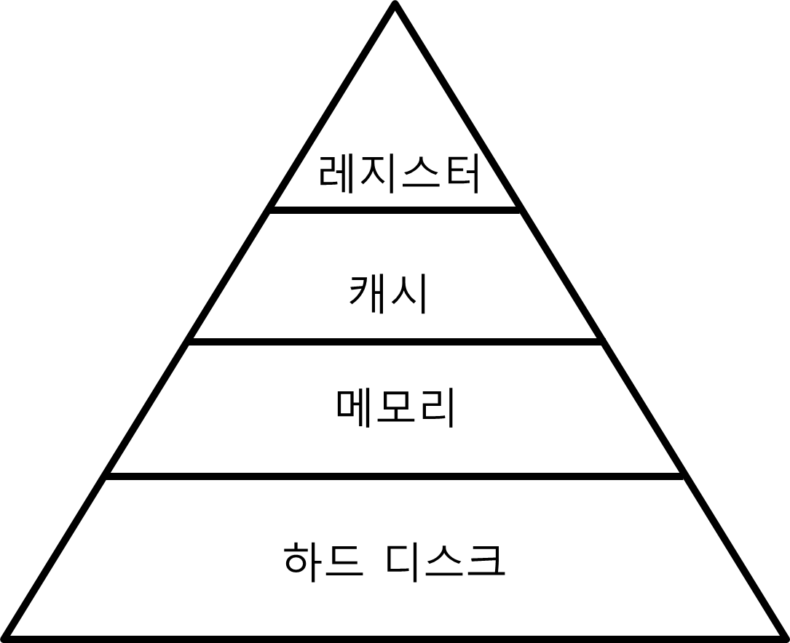

# 운영체제

## :book:RAM과 ROM에 대해 설명하시오.
### RAM(Random Access Memory)
- 임의 액세스 방식
- 반도체 집적회로 기억장치(Semiconductor IC Memory)
- 데이터 읽기와 쓰기가 모두 가능
- 휘발성(Volatile) : 전원 공급이 중단되면 내용이 지워짐

#### 제조 기술에 따른 분류
- DRAM(Dynamic RAM)
  - 축전기(Capacitor)에 전하(Charge)를 충전하는 방식으로 데이터를 저장하는 기억 소자들(Memory Cells)로 구성
    - 집적 밀도가 높음
  - 데이터 저장 상태를 유지하기 위해 주기적인 재충전(Refresh)가 필요
  - 같은 용량의 SRAM보다 가격이 저렴
  - 용량이 큰 주기억장치로 사용

- SRAM(Static RAM)
  - 기억 소자로서 플립-플랍(Flip-Flop)를 이용
    - 집적 밀도가 낮음
  - 전력이 공급되는 동안에는 재충전 없이도 데이터 유지 가능
  - DRAM 보다 처리 속도가 빠름
  - 높은 속도가 필요한 캐쉬 기억장치로 사용

### ROM(Read Only Memory)
- 영구 저장이 가능한 반도체 기억장치
- 읽는 것만 가능하며 쓰는 것은 불가능
- 사용처
  - 시스템 초기화 및 진단 프로그램(ex. PC의 BIOS)
  - 자주 사용되는 함수들의 서브루틴
  - 제어 유닛의 마이크로프로그램

#### ROM의 종류
- PROM(Programmable ROM) : 사용자가 한 번은 쓰는 것이 가능한 ROM
- EPROM(Erasable Programmable ROM) : 자외선을 이용하여 내용을 지우는 것이 가능한 PROM
  - 여러 번 쓰기 가능
- EEPROM(Electrically Erasable PROM) : 전기적으로 지울 수 있는 EPROM
- 플래쉬 기억장치(Flash Memory)
  - 블록 단위로 지우는 것이 가능한 EEPROM
  - EEPROM에 비해 삭제 시간이 빠르고 집적 밀도가 높음

<hr>

## :book:[Process와 Thread의 차이점](Process-Thread.md)

## :book:Context-Switching에 대해 설명하시오.
**CPU에서 여러 프로세스를 돌아가면서 작업을 처리하는 과정**
- 동작 중인 프로세스가 대기를 하면서 해당 프로세스의 상태(Context)를 보관, 대기하던 다음 프로세스가 동작하면서 이전에 보관한 프로세스의 상태를 복구하는 작업을 말한다.

## :book:Deadlock에 대해 설명하시오.
**교착 상태. 운영체제 혹은 소프트웨어의 잘못된 자원 관리로 인하여 둘 이상의 프로세스(심하면 운영체제 자체도 포함해서)가 함께 멈추어 버리는 현상**

### 발생조건
- 상호 배제 (Mutual exclusion)
  - 프로그램이 자원을 점유하는 데 있어서 배타적이다. 즉 자원 자체를 동시에 쓸 수 없는 경우
- 점유 상태로 대기 (Hold and wait)
  - 자원을 붙잡은 상태에서 다른 자원을 기다리고 경우
- 선점 불가 (No preemption)
  - 다른 프로세스가 자원을 뺏어올 방법이 없는 경우
- 순환성 대기 (Circular wait)
  - 대기가 꼬리를 물고 사이클이 되어 자기 순서로 돌아와도 기다리는 경우

<hr>

## :book:Mutex와 Semaphore, Monitor의 차이점
**교착 상태를 해결하기 위한 방법들**

### Mutex
> 일종의 Locking 매커니즘으로 lock을 가지고 있을 경우에만 공유 데이터에 접근 가능
>> - Lock에 대한 소유권이 있어 Lock을 획득한 사람만 반납할 수 있다.

<hr>

### Semaphore
> 동시에 리소스에 접근할 수 있는 '허용 가능한 Counter의 갯수'를 가지고 있는 Counter
>> - Counter가 1개의 경우 Binary, 2개 이상의 경우 Counting Semaphore라고 부른다.
>> -  Binary Semaphore의 경우 개념적으로 Mutex와 같다

<hr>

### Monitor
> Mutex(Lock)와 Condition Variables(Queue라고도 함)을 가지고 있는 Synchronization 메카니즘
>> - 공유자원에 안전하게 접근하기 위해 Mutual Exclusion가 랩핑된 Thread-Safe한 클래스, 객체, 모듈들을 의미하기도 함

<hr>

## :book:Memory Hierarchy에 대해 설명하시오.

**CPU가 메모리에 더 빨리 접근하기 위해 필요에 따라 나눈 메모리 계층 구조(Memory hierarchy)**
- 레지스터와 캐시는 CPU 내부에 존재한다.
  - 당연히 CPU는 아주 빠르게 접근할 수 있다.
- 메모리는 CPU 외부에 존재한다.
  - 레지스터와 캐시보다 더 느리게 접근 할 수 밖에 없다.
- 하드 디스크는 CPU가 직접 접근할 방법조차 없다.
  - CPU는 하드 디스크의 데이터를 메모리로 이동시키고, 메모리에서 접근해야 하므로 아주 느린 접근 밖에 불가능하다.

## :book:메모리 관리 전략에 대해 설명하시오.
ref : http://blog.naver.com/PostView.nhn?blogId=yeop9657&logNo=220728971005&parentCategoryNo=&categoryNo=123&viewDate=&isShowPopularPosts=true&from=search

## :book:메모리 할당 알고리즘에 대해 설명하시오.
**새로 적재되어야 할 데이터를 주기억장치 영역 중 어느 곳에 배치할지를 결정하는 전략**
- 페이지, 세그먼트 따위가 적재될 위치를 결정하는 정책

### first-fit(최초 적합)
- 가용공간 중 수용가능한 첫번째 기억공간을 할당하는 방법

<hr>

### best-fit(최적 적합)
- 모든 공간 중에서 수용가능한 가장 작은 곳을 선택

<hr>

### worst-fit(최악 적합)
- 모든 공간 중에서 수용가능한 가장 큰 곳을 선택

### 성능
- 공간효율성 : 최적적합 > 최초적합 ≫ 최악적합
- 시간효율성 : 최초적합 > 최적적합 ≒ 최악적합
> 최악적합은 잘 사용되지 않음

<hr>

## :book:페이지 교체 알고리즘에 대해 설명하시오.
**페이지 부재 발생 시 새로운 페이지를 할당하기 위해 현재 할당된 페이지 중 어느 것과 교체할지를 결정하는 전략**
- OPT 페이지 교체 :	이론상 최적 알고리즘
- NRU 페이지 교체 :	not recently used. 최근 미사용 페이지 교체
- NFU 페이지 교체
- LRU 페이지 교체 :	least recently used. 최저 사용 빈도 페이지 교체
- 랜덤 페이지 교체
- FIFO : first-in, first-out
- 2차 기회 : second chance. FIFO의 변형판
- 클럭	
- 에이징
- 참조비트 없는 하드웨어 기법

## :book:CISC, RISC의 차이점

### Instruction Set
**Computer Hardware가 직접 해독∙실행이 가능한 명령어 집합**
- 설계 목표 : 효율적인 Implementation을 통해 속도 최적화
  - Instruction Field의 효율적 사용

<hr>

### CISC(Complex Instruction Set Computer)
**모든 고급언어 문장들에 대해 각각 기계 명령어가 대응되도록 하는것**
- 장점
  - 컴파일러 작성이 쉽다.
  - 복잡한 명령도 마이크로코드(microcode)이므로 실행효율이 좋다.
  - 호환성이 좋다.
- 단점
  - 하나의 명령어가 복잡하여 해석(디코딩)에 시간이 오래걸리며, 해석에 필요한 회로가 복잡하다.
  - 적은 수의 일부 명령어만 주로 쓰인다.
  - 명령어의 길이가 달라서 동시의 여러개의 명령처리는 어렵다.

<hr>

### RISC(Reduced Instruction Set Computer)
**CISC의 많은 명령어중 주로 쓰이는것만을 추려서 하드웨어로 구현하는 것**
- 장점
  - 각 명령어가 한 클럭에 실행되도록 고정되어, 파이프라인 성능에 최적화 됨
  - 고정된 명령어이기 때문에 해석(디코딩)속도가 빠르며, 여러개의 명령어를 처리할 수 있다.
- 단점
  - 컴파일러의 최적화 과정이 복잡해진다.
  - 명령길이가 고정되어 있기 때문에 코드효율이 낮다.

<hr>

## :book:[CPU Scheduling에 대해 설명하시오.](cpu_scheduling.md)

## :book:Sync와 Async의 차이점

## :book:Virtual Memory에 대해 설명하시오.

## :book:Cache Memory에 대해 설명하시오.
- CPU와 주기억장치의 속도 차이로 인한 CPU 대기 시간을 최소화시키기 위해 설치하는 고속 반도체 기억장치
  - CPU와 주기억장치 사이에 설치

### 캐쉬 기억장치
- 주기억장치보다 액세스 속도가 높은 칩 사용
- 가격 및 제한된 공간 때문에 용량이 적음

### 캐쉬 기억장치에 사용되는 용어
- 블록(Block) : 주기억장치로부터 동시에 인출되는 정보들의 그룹
  - 주기억장치 용량 = 2^n 단어
  - 블록 = K 단어
  - ```블록의 수 = 주기억장치 용량 / 블록```
- 슬롯(Slot) : 캐쉬에서 한 블록이 저장되는 장소
- 태그(Tag) : 슬롯에 적재된 블록을 구분해주는 정보
- 캐쉬 적중(Cache Hit) : CPU가 원하는 데이터가 이미 캐쉬에 있는 상태
- 캐쉬 미스(Cache Miss) : CPU가 원하는 데이터가 캐쉬에 없는 상태
- 적중률(Hit Ratio) :
  ```캐쉬에 적중되는 정도(H) = 캐쉬에 적중되는 횟수 / 전체 기억장치 액세스 횟수```
  - 캐쉬의 적중률이 높아질수록 평균 기억장치 액세스 시간은 캐쉬 액세스 시간에 접근
  - 캐쉬 적중률은 프로그램과 데이터의 지역성(Locality)에 의존
    - 시간적 지역성(Temporal Locality) :
        > 최근 액세스 된 프로그램이나 데이터는 가까운 미래에 다시 액세스 될 가능성이 높음
    - 공간적 지역성(Spatial Locality)
        > 기억장치 내에 인접하여 저장된 데이터들이 연속적으로 액세스 될 가능성이 높음
    - 순차적 지역성(Sequential Locality)
        > 분기(Branch)가 발생하지 않는 한 명령어들은 기억장치에 저장된 순서대로 인출되어 실행
- 캐쉬의 미스율(Miss Ratio) = 1 - H
- 평균 기억장치 액세스 시간(Ta) : Ta = H x Tc + (1 - H) x Tm
  - Tc는 캐쉬 액세스 시간, Tm은 주기억장치 액세스 시간

### 캐쉬 설계의 목표
- 캐쉬 적중률 극대화
- 캐쉬 액세스 시간 최소화
- 캐쉬 미스에 따른 지연 시간 최소화
- 주기억장치와 캐쉬간의 데이터 일관성 유지 및 오버헤드 최소화

### 캐쉬의 크기 / 인출 방식
- 캐쉬의 크기
  - 용량이 커질수록 적중률은 높아지나 비용이 증가
    - 또한 주소 해독 및 정보 인출을 위한 주변회로가 복잡해지므로 액세스 시간이 증가
- 인출 방식
  - 요구 인출(Demand Fetch) 방식
    - 필요한 정보만 인출해 오는 방법
  - 선인출(Prefetch) 방식
    - 필요한 정보 외에 앞으로 필요한 것으로 예측되는 정보도 미리 인출하는 방법
    - 지역성이 높은 경우 효과 상승

### 캐쉬 메모리의 사상 방식
**사상 방식 : 어떤 주기억장치 블록들이 어느 캐쉬 슬롯을 공유할 것인지 결정해주는 방법**
- 종류
  - 직접 사상(Direct Mapping)
  - 완전-연관 사상(Fully-Associative Mapping)
  - 세트-연관 사상(Set-Associative Mapping)

#### 직접 사상(Direct Mapping)
**주기억장치의 블록들이 지정된 하나의 캐쉬 슬롯으로만 적재**
- 주기억장치 주소 형식
  - 태그 필드(t비트) : 태그 번호
  - 슬롯 번호(s비트) : 캐쉬의 m = 2^s 개의 슬롯들 중 하나를 지정
  - 단어 필드(w비트) : 각 블록 내 2^w 개 단어들 중의 하나를 구분
- 주기억장치의 블록 j가 적재될 수 있는 캐쉬 슬롯의 번호 i
  - i = j mod m
    - j는 주기억장치 블록 번호, m은 캐쉬 슬롯의 전체 수
- 특징
  - 장점
    - 하드웨어가 간단하며 구현 비용이 저렴
  - 단점
    - 각 주기억장치 블록은 캐쉬 슬롯 하나에만 적재
      - 따라서 해당 슬롯을 공유하는 다른 블록이 적재되는 경우 swap-out 됨
- 직접 사상 캐쉬의 동작방법
  - 캐쉬로 기억장치 주소가 전송되면 s비트의 슬롯번호를 이용하여 캐쉬의 슬롯을 선택
  - 선택된 슬롯의 태그 비트들을 읽어서 주소의 태그 비트들과 비교
    - 캐쉬 적중시
      - 주소의 w비트들을 이용하여 슬롯 내의 단어 중 하나를 인출하여 CPU로 전송
    - 캐쉬 미스시
      - 주소를 주기억장치로 보내어 한 블록을 액세스
      - 인출된 블록을 지정된 캐쉬 슬롯에 적재하고 주소의 태그 비트들을 해당 슬롯의 태그 필드에 기록
      - 만약 그 슬롯에 다른 블록이 이미 적재되어 있다면 그 내용은 지워지고 새로이 인출된 블록을 적재

#### 완전-연관 사상
**주기억장치 블록이 캐쉬의 어떤 슬롯으로든 적재 가능**
- 주 기억장치 주소 형식
  - 태그필드(t), 단어 필드(w)
- 특징
  - 장점
    - 새로운 블록이 캐쉬로 적재될 때 슬롯의 선택이 매우 자유롭다
    - 지역성이 높다면, 적중률이 매우 높아진다
  - 단점
    - 캐쉬 슬롯들의 태그들을 병렬로 검사하기 위하여 매우 복잡하고 비용이 높은 회로가 필요
  
#### 세트-연관 사상
**주기억장치 블록 그룹이 하나의 캐쉬 세트를 공유하며 세트에는 두 개 이상의 슬롯 적재 가능**
- 주기억장치 주소 형식
  - 태그필드와 세트필드를 합한(t+d)비트가 주기억장치의 2^(t+d)블록들 중의 하나를 지정
  - 세트 수 = 캐쉬 슬롯 수(v=m), 세트 내 슬롯의 수 k = 1 > 직접 사상
  - 세트 수 = 1, 세트 내 슬롯의 수 = 캐쉬의 전체 슬롯 수(k=m) > 완전-연관 사상
- 세트-연관 사상의 동작 원리
  - 기억장치 주소의 세트 비트들을 이용하여 캐쉬 세트들 중의 하나를 선택
  - 주소의 태그 필드 내용과 그 세트내의 태그들을 비교
    - 캐쉬 적중시
      - 해당 슬롯 내의 한 단어를 w 비트로 선택하여 인출
    - 캐쉬 미스시
      - 주기억장치를 액세스
      - 슬롯들 중의 어느 슬롯에 새로운 블록을 적재할 것인지를 결정하여 교체(교체 알고리즘 필요)