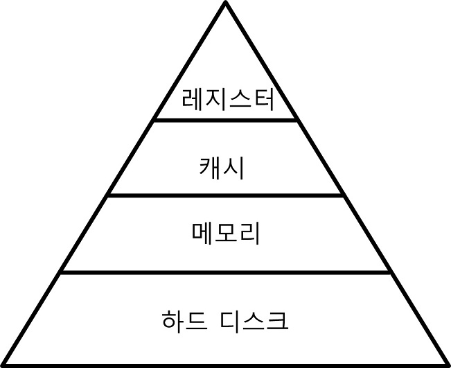

# 운영체제

## GPU와 CPU의 차이에 대해 설명하세요. 

## 메모리의 구성에 대해 설명해주세요.
메모리는 크게 코드, 데이터, 스택, 힙 영역으로 나누어져 있다. 코드 영역은 실행될 프로그램의 코드가 저장되어 있는 영역이다. 데이터 영역은 전역 변수와 정적 변수가 저장되어 있는 영역이다. 스택 영역은 지역변수와 매개 변수가 저장되어 있으며, 함수의 호출과 함께 할당되는 영역이다. 힙 영역은 사용자에 의해 동적으로 할당되고 해제될 수 있는 메모리 영역이다. 스택 영역은 컴파일 타임에 크기가 결정되고, 힙 영역은 런 타임에 크기가 결정된다.


## `RAM` 과 `ROM` 에 대해 알려주세요.
### RAM *(Random Access Memory)* 의 개요
- 임의 액세스 방식이며 반도체 집적회로 기억장치(Semiconductor IC Memory)이다.

- 데이터 읽기와 쓰기가 모두 가능하나 휘발성(Volatile, 전원 공급이 중단되면 내용이 지워짐)이다.

- 제조 기술에 따른 분류
  - DRAM(Dynamic RAM)
    - 축전기(Capacitor)에 전하(Charge)를 충전하는 방식으로 데이터를 저장하는 기억 소자들(Memory Cells)로 구성되어 집적 밀도가 높음
    
    - 데이터 저장 상태를 유지하기 위해 주기적인 재충전(Refresh)가 필요
    
    - 같은 용량의 SRAM보다 가격이 저렴
    
    - 용량이 큰 주기억장치로 사용

  - SRAM(Static RAM)
    - 기억 소자로서 플립-플랍(Flip-Flop)를 이용하여 집적 밀도가 낮음
    
    - 전력이 공급되는 동안에는 재충전 없이도 데이터 유지 가능
    
    - DRAM 보다 처리 속도가 빠름
    
    - 높은 속도가 필요한 캐쉬 기억장치로 사용

<br>

### ROM *(Read Only Memory)* 의 개요
- 영구 저장이 가능한 반도체 기억장치로 읽는 것만 가능하며 쓰는 것은 불가능하다.

- 사용처
  - 시스템 초기화 및 진단 프로그램(ex. PC의 BIOS)

  - 자주 사용되는 함수들의 서브루틴

  - 제어 유닛의 마이크로프로그램

- 사용 방법에 따른 분류
  - PROM(Programmable ROM) : 사용자가 한 번 쓰는 것이 가능하다.
  
  - EPROM(Erasable Programmable ROM) : 자외선을 이용하여 내용을 지우는 것이 가능한 PROM 으로 여러 번 쓸 수 있다.
  
  - EEPROM(Electrically Erasable PROM) : 전기적으로 데이터를 지울 수 있다.
  
  - 플래쉬 기억장치(Flash Memory)
    - 블록 단위로 지우는 것이 가능하며 기존 EEPROM에 비해 삭제 시간이 빠르고 집적 밀도가 높다.

<br>

<sup>[(상위 문서로)](https://github.com/InSeong-So/IT-Note)</sup>

<hr>
<br>

## `Process` 와 `Thread` 의 차이점을 알려주세요.
### Process 의 개요

<div align=center>


**컴퓨터에서 연속적으로 실행되고 있는 컴퓨터 프로그램**

</div>

```
- 메모리에 올라와 실행되고 있는 프로그램의 인스턴스(독립적인 개체)
- 운영체제로부터 시스템 자원을 할당받는 작업의 단위
  - 동적인 개념으로는 실행된 프로그램을 의미
```

- 특징
  - 프로세스는 각각 독립된 메모리 영역(Code, Data, Stack, Heap의 구조)을 할당받는다.
  
  - 기본적으로 프로세스당 최소 1개의 스레드(메인 스레드)를 가지고 있다.
  
  - 각 프로세스는 별도의 주소 공간에서 실행되며, 한 프로세스는 다른 프로세스의 변수나 자료구조에 접근할 수 없다.
  
  - 한 프로세스가 다른 프로세스의 자원에 접근하려면 프로세스 간의 통신(IPC, inter-process communication)을 사용해야 한다.
    - 파이프, 파일, 소켓 등을 이용한 통신 방법 등

<br>

### Thread 의 개요

<div align=center>


**프로세스 내에서 실행되는 여러 흐름의 단위**

</div>

```
- 프로세스의 특정한 수행 경로
- 프로세스가 할당받은 자원을 이용하는 실행의 단위
```

- 특징
  - 스레드는 프로세스 내에서 각각 Stack만 따로 할당받고 Code, Data, Heap 영역은 공유한다.
  
  - 스레드는 한 프로세스 내에서 동작되는 여러 실행의 흐름으로, 프로세스 내의 주소 공간이나 자원들(힙 공간 등)을 같은 프로세스 내에 스레드끼리 공유하면서 실행된다.
  
  - 같은 프로세스 안에 있는 여러 스레드들은 같은 힙 공간을 공유한다. 반면에 프로세스는 다른 프로세스의 메모리에 직접 접근할 수 없다.
  
  - 각각의 스레드는 별도의 레지스터와 스택을 갖고 있지만, 힙 메모리는 서로 읽고 쓸 수 있다.

  - 한 스레드가 프로세스 자원을 변경하면, 다른 이웃 스레드(sibling thread)도 그 변경 결과를 즉시 볼 수 있다.

<br>

### Thread-safe

<br>

<sup>[(상위 문서로)](https://github.com/InSeong-So/IT-Note)</sup>

<hr>
<br>

## Context Switching이 무엇인가요?
멀티 프로세스 환경에서 CPU가 어떤 하나의 프로세스를 실행하고 있는 상태에서, 인터럽트 요청에 의해 다음 우선 순위의 프로세스가 실행되어야 할 때 기존의 프로세스의 상태 또는 레지스터 값(context)을 저장하고 CPU가 다음 프로세스를 수행하도록 새로운 프로세스의 상태 또는 레지스터 값(context)을 교체하는 작업을 context switching이라고 한다.

OS에서 context는 CPU가 해당 프로세스를 실행하기 위한 해당 프로세스의 정보들이다. 이 context는 프로세스의 PCB(Process Control Block)에 저장된다.

<br>

<sup>[(상위 문서로)](https://github.com/InSeong-So/IT-Note)</sup>

<hr>
<br>

## `Multi-Process` 와 `Multi-Thread` 에 대해 알려주세요.
### Multi-Process 의 개요
<div align=center>

**하나의 응용프로그램을 여러 개의 프로세스로 구성하여 각 프로세스가 하나의 작업(태스크)을 처리**

</div>

- 장점
  - 자식 프로세스 중 하나에 문제가 발생하면 해당 프로세스를 제외하고 영향이 확산되지 않는다.

- 단점
  - `Context Switching 에서의 오버헤드`
    - Context Switching 과정에서 캐쉬 메모리 초기화 등 무거운 작업이 진행되고 많은 시간이 소모되는 등의 오버헤드가 발생하게 된다.
    
    - 프로세스는 각각의 독립된 메모리 영역을 할당받았기 때문에 프로세스 사이에서 공유하는 메모리가 없어, Context Switching 가 발생하면 캐쉬에 있는 모든 데이터를 모두 리셋하고 다시 캐쉬 정보를 불러와야 한다.
  
  - `프로세스 사이의 어렵고 복잡한 통신 기법(IPC)`
    - 프로세스는 각각의 독립된 메모리 영역을 할당받았기 때문에 하나의 프로그램에 속하는 프로세스들 사이의 변수를 공유할 수 없다.

<br>

### Multi-Thread 의 개요
<div align=center>

**하나의 프로그램에서 둘 이상의 프로세스가 필요할 때 사용**

</div>

- 장점
  - 시스템 자원 소모 감소 (자원의 효율성 증대)
    - 프로세스를 생성하여 자원을 할당하는 시스템 콜이 줄어들어 자원을 효율적으로 관리할 수 있다.
  
  - 시스템 처리량 증가 (처리 비용 감소)
    - 스레드 간 데이터를 주고 받는 것이 간단해지고 시스템 자원 소모가 줄어들게 된다.
  
    - 스레드 사이의 작업량이 작아 Context Switching이 빠르다.
  
  - 간단한 통신 방법으로 인한 프로그램 응답 시간 단축
    - 스레드는 프로세스 내의 Stack 영역을 제외한 모든 메모리를 공유하기 때문에 통신의 부담이 적다.

- 단점
  - 주의 깊은 설계가 필요하며 디버깅이 까다롭다.
  
  - 단일 프로세스 시스템의 경우 효과를 기대하기 어렵다.
  
  - 다른 프로세스에서 스레드를 제어할 수 없다(프로세스 밖에서 스레드 각각을 제어할 수 없음).
  
  - 멀티 스레드의 경우 자원 공유의 문제가 발생한다(동기화 문제).
  
  - 하나의 스레드에 문제가 발생하면 전체 프로세스가 영향을 받는다.

<br>

<sup>[(상위 문서로)](https://github.com/InSeong-So/IT-Note)</sup>

<hr>
<br>

## `User Thread` 와 `Kernel Thread` 의 차이점은 무엇인가요?
### Thread-Package Architectures 의 종류
- User-level Thread

- Kernel-level Thread

- Multiplexed Thread

- Kernel-supported User-level Thread

<br>

### `User-level Thread` 의 개요
- User-Level Thread 는 응용 프로그램과 Link/Load 가 되는 라이브러리로 구현 되어진다.
  - 해당 라이브러리에 동기화, 스케줄링 기능이 모두 담겨 있음

- 커널에서는 아무런 지원을 해주지 않으며, 커널이 보기에는 단지 그냥 Single process이다.

- 프로세스마다 런타임 라이브러리의 Copy 가 호출되므로 스케줄링 정책을 프로세스마다 달리 취할 수 있으며, 각 Thread 마다 time quantum 을 소모할 필요 없고, 런타임 라이브러리가 context 를 유지하기때문에 switching 을 할 필요가 없다.
  - 그래서 User-Level Thread는 빠르고, 매우 효율적이다. 그러나 장애가 꽤 있다.

- 문제점
  - BLocking System Calls
    - BLocking function 이란 처리가 완료되지 않으면 return 되지 않는 함수인데, 만약 특정 Thread 에서 BLocking 이 되어 버리면, 전체 process가 BLocking 이 되어린다. 이런 이유로 운영체제가 제공하는 non-bLocking 함수들만 사용해야 하며, 사용 빈도가 높은 함수(read,select,wait,...)들은 해당 함수의 non-bLocking 버젼으로 대체해야할 필요가 있다. 

  - Shared System Resources
    - 동기화나 Locking 없이 Thread 끼리 공유하는 변수(드러나지 않고 감춰져 있는 경우)가 있을때, 그 Thread 가 thread-safe 하지 않으면 Overwrite 되는 문제가 생길 수 있다. 이 이유로 User-Level, Kernel-Level 함수까지 모두 재진입이 가능해야한다.

  - signal Handling, Thread Scheduling
    - User-Level 에서 이것을 구현하기란 상당히 어렵다. Timeslice 를 다루기 위해 Hardware CLock 인터럽트를 보통의 방법으로는 받지 못한다. 선점형(Preemptive) 스케줄링을 하기 위해서는 커널로 부터 Time Siganl 을 받는 함수를 등록해두어야 하며, Timer Alarm Siganl 을 다루는것은 다른 시그널을 다루는 것보다 아주 어럽다.

  - Multiprocess Utilization
    - 하나의 프로세스에서 Time 을 공유하고 있기때문에 여러개의 CPU 를 동시에 사용할 수는 없다.

  - 구현상의 어려움과 복잡성 그리고, 몇가지 장애에도 불구하고, 정확성(concurrency)과 효율성(efficiency) 이 있다.

<br>

### `Kernel-level Thread` 의 개요
- Kernel-level에 있는 Thread 는 독립적으로 스케줄되므로 특정 Thread 에서의 BLocking 이 process 로 전파되지 않는다.
  - 그래서 BLocking System Calls 를 이용할수 있으며 각 Thread 끼리 Signal 을 주고 받을 수 있다.

- Kernel-level Thread 는 특별히 고려할만한 장애를 가지고 있지는 않다. 물론 마찬가지로 Thread-Safe해야 하지만, OS 개발자들은 대개의 표준 라이브러리를 Thread-Safe하게(재진입해도 문제없겠끔) 만들기에 User-level Thread보다 문제가 적다.

- 문제점
  - Kernel-level Thread 는 안정성에 비해서 너무 느리다.
    - Thread Context-Switch 때문에 약 10배정도 느리다고 한다.

<br>

### Multiplexed Thread 의 개요
- User-level Thread와 Kernel-level Thread를 섞은 방법이다.

- User-level thread(줄여서 Thread)는 LWP(가벼워진 프로세스, Lightweight Processes)에 의해 multiplex 된다.
  - 커널은 LWP를 스케줄링/실행하고, LWP는 대기중인 thread를 골라서 실행한다.

  - thread는 하나의 LWP에서 실행이 되어지며, Time slice가 바뀔때 LWP도 바뀌어질 수 있다.

  - 프로그래머는 thread를 사용할 수도 있고, LWP를 직접 사용할수 있고, 둘 모두를 동시에 사용할 수도 있다.

- User-level Thread처럼 작동하면서 Hardware Parallelism과 BLocking calls에 대처할 수 있으며, Context-Switch을 많이 하지 않는다.

- 문제점
  - LWP가 BLocking이 되면 이 LWP가 가진 몇개의 Thread도 동시에 BLocking이 된다.

  - LWP의 Context-Switch 비용은 Kernel-level threas보다 비싸다.

  - 다중 CPU에서 효율적일려면 각 Thread는 각각 다른 LWP에 할당되야 한다.
    - 각 Thread의 LWP 할당과 LWP의 CPU 할당은 별개로서 이루어지기 때문에, 각 Thread가 서로다른 CPU에 할당되려면 매커니즘이 필요하다.

- 이러한 이유로 LWP에 의한 multiplexed Thread는 궁극의 해결책은 못 되지만 Kernel-level Thread의 결정적인 단점인 Thread Context-Switch를 user-level threds만큼 빠르게만 한다면 모든 장애는 해결된다.

<br>

### Scheduler Activation(kernel-supported user-level Thread) 의 개요
- User-level Thread들을 위한 특별한 지원을 kernel이 해준다.
  - Scheduler Activation이라 하며 User-level Thread 라이브러리는 커널에게 프로세스를 요구할때와 양도할때를 알려준다.
  
  - 커널의 Scheduler Activation은 이것을 커널에 의한 프로세스 주소 공간으로 할당된 Virtual Processor로 표현한다.
  
  - 여기서는 스케줄링과 BLocking 감지가 이루어지며, Granted processor, Preemptive thread, BLocked, UnbLocked등등의 Event를 User-level의 런타임 시스템에게 알려준다.

- 문제점
  - 커널과 라이브러리 코드가 효율적인 교신을 위해 같은 주소 공간을 공유하기 때문에 예외적으로 높은 신뢰를 가지고 있어야 하며 bug-free이어야한다.
    - 이 방법은 개념적으로 비정상적인 작동(의도적인 비정상적 작동 포함)과 버그에 대해서 강건함(robust)을 가지지 못한다.

<br>

<sup>[(상위 문서로)](https://github.com/InSeong-So/IT-Note)</sup>

<hr>
<br>

## `Context-Switching` 이 무엇인지 설명해주세요.
> CPU에서 여러 프로세스를 돌아가면서 작업을 처리하는 과정이다.
- 동작 중인 프로세스가 대기를 하면서 해당 프로세스의 상태(Context)를 보관, 대기하던 다음 프로세스가 동작하면서 이전에 보관한 프로세스의 상태를 복구하는 작업을 말한다.

<br>

<sup>[(상위 문서로)](https://github.com/InSeong-So/IT-Note)</sup>

<hr>
<br>

## `DeadLock` 에 대해 알려주세요.
> 교착 상태. 운영체제 혹은 소프트웨어의 잘못된 자원 관리로 인하여 둘 이상의 프로세스(심하면 운영체제 자체도 포함)가 함께 멈추어 버리는 현상이다.

- 발생조건
  - `상호 배제` *(Mutual exclusion)*
    - 프로그램이 자원을 점유하는 데 있어서 배타적이다. 즉 자원 자체를 동시에 쓸 수 없는 경우
  
  - `점유 상태로 대기` *(Hold and wait)*
    - 자원을 붙잡은 상태에서 다른 자원을 기다리고 경우
  
  - `선점 불가` *(No preemption)*
    - 다른 프로세스가 자원을 뺏어올 방법이 없는 경우
  
  - `순환성 대기` *(Circular wait)*
    - 대기가 꼬리를 물고 사이클이 되어 자기 순서로 돌아와도 기다리는 경우

<br>

<sup>[(상위 문서로)](https://github.com/InSeong-So/IT-Note)</sup>

<hr>
<br>

## `Mutex` 와 `Semaphore`, `Monitor` 의 차이점을 알려주세요.
> 교착 상태를 해결하기 위한 방법

### Mutex
> 일종의 Locking 매커니즘으로 Lock 을 가지고 있을 경우에만 공유 데이터에 접근이 가능하다.
> - Lock에 대한 소유권이 있어 Lock 을 획득한 사람만 반납할 수 있다.

<br>

### Semaphore
> 동시에 리소스에 접근할 수 있는 '허용 가능한 Counter의 갯수'를 가지고 있는 Counter
> - Counter가 1개의 경우 Binary, 2개 이상의 경우 Counting Semaphore라고 부른다.
> - Binary Semaphore의 경우 개념적으로 Mutex 와 같다

<br>

### Monitor
> Mutex(Lock)와 Condition Variables(Queue라고도 함)을 가지고 있는 Synchronization 메카니즘
> - 공유자원에 안전하게 접근하기 위해 Mutual Exclusion가 랩핑된 Thread-Safe한 클래스, 객체, 모듈들을 의미하기도 함

<br>

<sup>[(상위 문서로)](https://github.com/InSeong-So/IT-Note)</sup>

<hr>
<br>

## `Memory Hierarchy` 에 대해 알려주세요.

<div align=center>



<br>
<br>

<p><strong>CPU가 메모리에 더 빨리 접근하기 위해 필요에 따라 나눈 메모리 계층 구조(Memory hierarchy)</strong></p>

<br>

</div>

- 레지스터와 캐시는 CPU 내부에 존재한다.
  - 당연히 CPU는 아주 빠르게 접근할 수 있다.

- 메모리는 CPU 외부에 존재한다.
  - 레지스터와 캐시보다 더 느리게 접근 할 수 밖에 없다.

- 하드 디스크는 CPU가 직접 접근할 방법조차 없다.
  - CPU는 하드 디스크의 데이터를 메모리로 이동시키고, 메모리에서 접근해야 하므로 아주 느린 접근 밖에 불가능하다.

<br>

<sup>[(상위 문서로)](https://github.com/InSeong-So/IT-Note)</sup>

<hr>
<br>

## `메모리 관리 전략`에 대해 알려주세요.
- 메모리는 CPU 가 직접 접근하는 유일한 저장장치로 메모리 시스템(하드웨어)은 주소(메모리 위치)를 관리하며 할당과 접근을 제어한다.

- 이는 `제한된 물리적 메모리의 효율적인 사용(할당)`과 `효율적인 메모리 참조(논리-물리주소 할당)`를 위함이다.

- 종류
  - `Swapping` *(스와핑)*
    - CPU에서 실행 중이지 않은 프로세스의 메모리 이미지를 저장장치에 이동 (메모리 사용의 효율성 증가)
  
  - `Contiguous Memory Allocation` *(연속 메모리 할당)*
    - 각 프로세스가 필요로 하는 메모리 요구량을 분석해서 필요한 메모리를 연속으로 메모리에 할당(연속된 물리 메모리이므로 시작 주소만 알면 됨)

  - `Paging` *(페이징)*
    - 프로세스가 사용하는 주소 공간을 여러 개로 분할하여 비연속적인 물리 메모리 공간에 할당, 가상 메모리를 모두 같은 크기의 블록으로 편성

  - `Segmentation` *(세그멘테이션)*
    - 프로세스가 필요로 하는 메모리 공간을 분할하여 비연속적인 물리 메모리 공간에 할당

<br>

<sup>[(상위 문서로)](https://github.com/InSeong-So/IT-Note)</sup>

<hr>
<br>

## `메모리 할당 알고리즘`에 대해 알려주세요.
> 새로 적재되어야 할 데이터를 주기억장치 영역 중 어느 곳에 배치할지를 결정하는 전략

- 페이지, 세그먼트 따위가 적재될 위치를 결정하는 정책이다.

- 종류
  - `First-fit` *(최초 적합)*
    - 가용공간 중 수용가능한 첫번째 기억공간을 할당하는 방법

  - `Best-fit` *(최적 적합)*
    - 모든 공간 중에서 수용가능한 가장 작은 곳을 선택

  - `Worst-fit` *(최악 적합)*
    - 모든 공간 중에서 수용가능한 가장 큰 곳을 선택

- 성능
  - 공간효율성 : BF > FF ≫ WF
  
  - 시간효율성 : FF > BF ≒ WF

<br>

<sup>[(상위 문서로)](https://github.com/InSeong-So/IT-Note)</sup>

<hr>
<br>

## `페이지 교체 알고리즘`에 대해 알려주세요.
> 페이지 부재 발생 시 새로운 페이지를 할당하기 위해 현재 할당된 페이지 중 어느 것과 교체할 지를 결정하는 전략이다.

- 종류
  - `FIFO` : First-In, First-Out. 메모리에 올라온 지 가장 오래된 페이지를 교체
  
  - `최적 페이지 교체` :	Optimal Page Replace. 이론상 최적 알고리즘
  
  - `NRU 페이지 교체` :	Not-Recently-Used. 최근 미사용 페이지 교체
  
  - `LRU 페이지 교체` :	Least-Recently-Used. 가장 오래 사용되지 않은 페이지 교체
  
  - `LFU 페이지 교체` : Least-Frequently-Used. 참조 횟수가 가장 작은 페이지를 교체

  - `MFU 페이지 교체` : Most-Frequently-Used. 참조 횟수가 가장 많은 페이지를 교체
  
  - ~~랜덤 페이지 교체~~(잘 사용되지 않음)
  
  - ~~2차 기회 : Second Chance. FIFO의 변형판~~(잘 사용되지 않음)
  
  - ~~클럭~~(잘 사용되지 않음)
  
  - ~~에이징~~(잘 사용되지 않음)
  
  - ~~참조 비트 없는 하드웨어 기법~~(잘 사용되지 않음)

<br>

<sup>[(상위 문서로)](https://github.com/InSeong-So/IT-Note)</sup>

<hr>
<br>

## `Fragmentation` 란 무엇인가요?
### Fragmentation (메모리 단편화)의 개요
> RAM에서 메모리의 공간이 작은 조각으로 나뉘어져 사용가능한 메모리가 충분히 존재하지만 할당(사용)이 불가능한 상태를 일컫는다.
> - `내부 단편화`와 `외부 단편화`로 구분된다.

<br>

### `내부 단편화` *(Internal Fragmentation)*
> 메모리를 할당할 때 프로세스가 필요한 양보다 더 큰 메모리가 할당되어서 프로세스에서 사용하는 메모리 공간이 낭비 되는 상황을 내부 단편화라고 한다.

<br>

### `외부 단편화` *(External Fragmentation)*
> 메모리가 할당되고 해제되는 작업이 반복될 때 작은 메모리가 중간중간 존재하게 된다.
> - 이 때 중간중간에 생긴 사용하지 않는 메모리가 많이 존재해서 총 메모리 공간은 충분하지만 실제로 할당할 수 없는 상황을 외부 단편화라고 한다.

<br>

<sup>[(상위 문서로)](https://github.com/InSeong-So/IT-Note)</sup>

<hr>
<br>

## `Paging` 과 `Segmentation` 의 차이점에 대해 알려주세요.
### `Paging` 의 개요
> 사용하지 않는 프레임을 페이지에 옮기고, 필요한 메모리를 페이지 단위로 프레임에 옮기는 기법이다.
> - 페이징 기법을 사용하면 연속적이지 않은 공간도 활용할 수 있기 때문에 `외부 단편화 문제를 해결`할 수 있다.
> - 페이지 단위를 작게하면 내부 단편화 문제도 해결할 수 있겠지만 대신 page mapping 과정이 많아지므로 오히려 효율이 떨어질 수 있다. 

<br>

### `Segmentation` 의 개요
> 세그먼트들의 크기가 다르기 때문에 미리 분할해 둘 수 없고 메모리에 적재될 때 빈 공간을 찾아 할당하는 기법이다.
> - 페이징 기법은 가상메모리를 같은 크기의 단위로 분할했지만 세그멘테이션 기법은 가상메모리를 서로 크기가 다른 논리적 단위인 세그먼트로 분할해서 메모리를 할당하여 실제 메모리 주소로 변환한다.
> - 프로세스가 필요한 메모리 만큼 할당해주기 때문에 내부단편화는 일어나지 않으나 여전히 중간에 프로세스가 메모리를 해제하면 생기는 구멍, 즉 외부 단편화 문제는 여전히 존재한다.

<br>

<sup>[(상위 문서로)](https://github.com/InSeong-So/IT-Note)</sup>

<hr>
<br>

## `CISC`, `RISC` 의 차이점을 알려주세요.
### 들어가기 전에, Instruction Set 란?
> Computer Hardware가 직접 해독 / 실행이 가능한 명령어 집합

- 설계 목표 : 효율적인 Implementation 을 통해 속도 최적화
  - Instruction Field 의 효율적 사용

<br>

### `CISC` *(Complex Instruction Set Computer)*
> 모든 고급언어 문장들에 대해 각각 기계 명령어가 대응되도록 하는것

- 장점
  - 컴파일러 작성이 쉽다.

  - 복잡한 명령도 마이크로코드(microcode)이므로 실행효율이 좋다.

  - 호환성이 좋다.

- 단점
  - 하나의 명령어가 복잡하여 해석(디코딩)에 시간이 오래걸리며, 해석에 필요한 회로가 복잡하다.

  - 적은 수의 일부 명령어만 주로 쓰인다.

  - 명령어의 길이가 달라서 동시의 여러개의 명령처리는 어렵다.

<br>

### `RISC` *(Reduced Instruction Set Computer)*
> CISC의 많은 명령어중 주로 쓰이는 것만을 추려서 하드웨어로 구현하는 것

- 장점
  - 각 명령어가 한 클럭에 실행되도록 고정되어, 파이프라인 성능에 최적화 됨

  - 고정된 명령어이기 때문에 해석 속도가 빠르며, 여러개의 명령어를 처리할 수 있다.

- 단점
  - 컴파일러의 최적화 과정이 복잡해진다.

  - 명령길이가 고정되어 있기 때문에 코드 효율이 낮다.

<br>

<sup>[(상위 문서로)](https://github.com/InSeong-So/IT-Note)</sup>

<hr>
<br>

## `CPU Scheduling` 에 대해 알려주세요.
### CPU 스케줄링의 개요
> 다중 프로그래밍을 가능하게 하는 운영 체제의 동작 기법이다.
> - 운영 체제는 자원 배정을 통해 시스템의 성능을 개선하며 장기, 중기, 단기 스케줄링이 있다.

### 스케줄링 단계
- 1단계 스케줄링
  - 작업 스케줄링(Job scheduling). 어느 작업부터 시스템 내의 자원들을 실제로 사용할 수 있도록 할지를 결정한다. 승인 스케줄링(Admission scheduling)이라고도 한다.

- 2단계 스케줄링
  - 어느 프로세스부터 CPU를 차지할 수 있게 할지를 결정한다. 프로세스들을 보류시키고 다시 활성화시키는 기법을 사용하여 시스템에 대한 단기적인 부하를 조절한다.

  - 작업 승인(1단계)와 CPU 배당(3단계) 사이의 완충 작용을 한다.

- 3단계 스케줄링
  - CPU가 사용 가능한 경우 어느 프로세스에게 배당할지를 결정한다.

<br>

### 결정 시점
> 프로세스의 상태 변화가 있을 때로 아래와 같다.
> 1. 수행 → 대기
> 2. 수행 → 준비
> 3. 대기 → 준비
> 4. 수행 → 종료

<br>

### `비선점형(Non-preemptive Scheduling)` 프로세스 알고리즘
- 어떤 프로세스가 CPU를 할당 받으면 그 프로세스가 종료되거나 입출력 요구가 발생하여 자발적으로 중지될 때까지 계속 실행되도록 보장한다.

- 순서대로 처리되는 공정성이 있고 다음에 처리해야 할 프로세스와 관계없이 응답 시간을 예상할 수 있으며 선점 방식보다 스케줄러 호출 빈도가 낮고 문맥 교환에 의한 오버헤드가 적다.

- 일괄 처리 시스템에 적합하며, CPU 사용 시간이 긴 하나의 프로세스가 CPU 사용 시간이 짧은 여러 프로세스를 오랫동안 대기시킬 수 있으므로, 처리율이 떨어질 수 있다는 단점이 있다.

- 종류
  - [FCFS 스케줄링(First Come First Served Scheduling)](https://ko.wikipedia.org/wiki/%EC%84%A0%EC%9E%85_%EC%84%A0%EC%B2%98%EB%A6%AC_%EC%8A%A4%EC%BC%80%EC%A4%84%EB%A7%81)
  
  - [SJF 스케줄링(Shortest Job First Scheduling)](https://ko.wikipedia.org/wiki/SJF_%EC%8A%A4%EC%BC%80%EC%A4%84%EB%A7%81)
  
  - [HRRN 스케줄링(Highest Response Ratio Next Scheduling)](https://ko.wikipedia.org/wiki/HRRN_%EC%8A%A4%EC%BC%80%EC%A4%84%EB%A7%81)

<br>

### `선점형(Preemptive Scheduling)` 프로세스 알고리즘
- 어떤 프로세스가 CPU를 할당받아 실행 중에 있어도 다른 프로세스가 실행 중인 프로세스를 중지하고 CPU를 강제로 점유할 수 있다.

- 모든 프로세스에게 CPU 사용 시간을 동일하게 부여할 수 있다. 빠른 응답시간을 요하는 대화식 시분할 시스템에 적합하며 긴급한 프로세서를 제어할 수 있다.

- '운영 체제가 프로세서 자원을 선점'하고 있다가 각 프로세스의 요청이 있을 때 특정 요건들을 기준으로 자원을 배분하는 방식이다.

- 종류
  - [RR 스케줄링(Round Robin Scheduling)](https://ko.wikipedia.org/wiki/RR_%EC%8A%A4%EC%BC%80%EC%A4%84%EB%A7%81)
  
  - [SRTF 스케줄링(Shortest Remaining-Time First Scheduling)](https://ko.wikipedia.org/wiki/SRTF_%EC%8A%A4%EC%BC%80%EC%A4%84%EB%A7%81)
  
  - [다단계 큐 스케줄링(Multilevel Queue Scheduling)](https://ko.wikipedia.org/wiki/%EB%8B%A4%EB%8B%A8%EA%B3%84_%ED%81%90_%EC%8A%A4%EC%BC%80%EC%A4%84%EB%A7%81)
  
  - [다단계 피드백 큐 스케줄링(Multilevel Feedback Queue Scheduling)](https://ko.wikipedia.org/wiki/%EB%8B%A4%EB%8B%A8%EA%B3%84_%ED%94%BC%EB%93%9C%EB%B0%B1_%ED%81%90_%EC%8A%A4%EC%BC%80%EC%A4%84%EB%A7%81)
  
  - [RM 스케줄링(Rate Monotonic Scheduling)](https://ko.wikipedia.org/wiki/RM_%EC%8A%A4%EC%BC%80%EC%A4%84%EB%A7%81)
  
  - [EDF 스케줄링(Earliest Deadline First Scheduling)](https://ko.wikipedia.org/wiki/EDF_%EC%8A%A4%EC%BC%80%EC%A4%84%EB%A7%81)

<br>

### 평가 기준
- `CPU 사용률` *(CPU Utilization)* : 전체 시스템 시간 중 CPU가 작업을 처리하는 시간의 비율.

- `처리량` *(Throughput)* : CPU가 단위 시간당 처리하는 프로세스의 개수.

- `응답 시간` *(Response Time)* : 대화식 시스템에서 요청 후 응답이 오기 시작할 때까지의 시간.

- `대기 시간` *(Waiting Time)* : 프로세스가 준비 큐 내에서 대기하는 시간의 총합.

- `반환 시간` *(Turnaround Time)* : 프로세스가 시작해서 끝날 때까지 걸리는 시간.

<br>

<sup>[(상위 문서로)](https://github.com/InSeong-So/IT-Note)</sup>

<hr>
<br>

## `Sync` 와 `Async` 의 차이점을 알려주세요.
### Sync *(Synchronous, 동기식 전송)* 의 개요
- `Synchronous` 은 한 문자 단위가 아니라 미리 정해진 수 만큼의 문자열을 한 묶음으로 만들어서 일시에 전송하는 방법이다.
  - 데이터와는 별도로 송신측과 수신측이 하나의 기준 클록으로 동기 신호를 맞추어 동작한다.
  
  - 송신측에서 전송된 데이터를 수신측에서 정확히 수신하기 위해, 보내는 측과 받는 측의 타이밍이 일치하는 것을 동기식 전송이라 한다.

- 장점
  - 비동기식에 비해 전송효율이 높다.

- 단점
  - 수신측에서 문자를 조립하여 별도의 비트 계산을 하는 기억장치가 필요하므로 가격이 다소 높다.

<br>

### Async *(Asynchronous, 비동기식 전송)* 의 개요
- `Asynchronous` 은 에디터 내에 동기 신호를 포함시켜 데이터를 전송한다.
  - 송신측의 송신 클록에 관계없이 수신 신호 클록으로 타임 슬롯의 간격을 식별하여 한 번에 한 문자씩 송수신한다.

  - 이처럼 타이밍을 맞추지 않고 문자 단위로 구분하여 전송하는 것을 비동기식 전송이라 한다.

- 장점
  - 시작 비트와 정지 비트 사이의 간격이 가변적이므로 불규칙적인 전송과 짧은 데이터 전송에 적합하다.
  
  - 필요한 접속장치와 기기들이 간단하므로 동기식정송 장비보다 값이 싸다.

- 단점
  - 시작 비트와 정지 비트를 전송하므로 많은 오버헤드를 갖는다.

<br>

<sup>[(상위 문서로)](https://github.com/InSeong-So/IT-Note)</sup>

<hr>
<br>

## `Virtual Memory` 에 대해 알려주세요.
> 물리적으로 존재하지는 않으나 사용자에게 있어 메모리의 역할을 하는 가상의 메모리이다.
> - 운영체제가 발전하면서 실제 메모리를 더 효율적으로 사용하기 위해 파생된 기법이다.
> - 프로그램은 가상메모리의 크기에 맞춰 수용된다.
> - 단, 수용된 프로그램 실행 시 실제 메모리가 필요하다.

<br>

<sup>[(상위 문서로)](https://github.com/InSeong-So/IT-Note)</sup>

<hr>
<br>

## `Cache Memory` 에 대해 알려주세요.
### 캐쉬 메모리의 개요
> CPU 와 주기억장치의 속도 차이로 인한 CPU 대기 시간을 최소화시키기 위해 설치하는 고속 반도체 기억장치
> - CPU 와 주기억장치 사이에 설치되며 주기억장치보다 액세스 속도가 높은 칩을 사용한다.
> - 가격 및 제한된 공간 때문에 용량이 적다.

<br>

### 캐쉬 메모리의 사상 방식
> 사상 방식 : 어떤 주기억장치 블록들이 어느 캐쉬 슬롯을 공유할 것인지 결정해주는 방법

- 종류
  - `직접 사상` *(Direct Mapping)*

  - `완전-연관 사상` *(Fully-Associative Mapping)*

  - `세트-연관 사상` *(Set-Associative Mapping)*

<br>

<sup>[(상위 문서로)](https://github.com/InSeong-So/IT-Note)</sup>

<hr>
<br>

## 컴파일러와 인터프리터의 차이는 뭘까요?
컴파일러와 인터프리터 모두 고레벨 언어를 기계어로 변환하는 역할을 수행하지만 차이점은 컴파일러의 경우 전체 코드를 보고 명령어를 수집하고 재구성하는 반면, 인터프리터는 소스코드의 각 행을 연속적으로 분석하며 실행한다. 인터프리터는 고레벨 언어를 중간 레벨 언어로 한 번 변환하고 이를 각 행마다 실행하기 때문에 일반적으로 컴파일러가 인터프리터보다 실행 시간이 빠른 경우가 많다. java의 경우 .java 파일을 .class 파일로 자바 컴파일러가 컴파일을 하고, .class 파일을 기계어로 인터프리터가 변환하는 것이다.