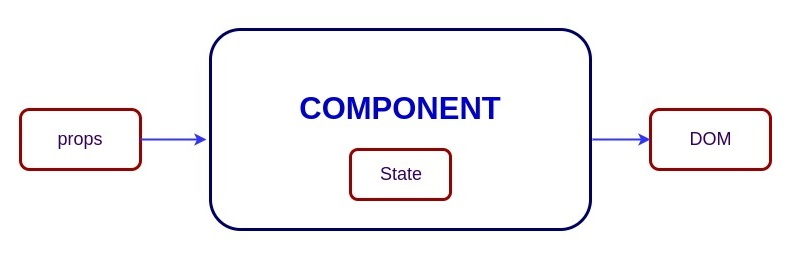

> 원본 글은 [여기](https://github.com/sudheerj/reactjs-interview-questions)입니다.
> - 의역이 포함되고, 필요 없는 내용은 삭제하였으므로 원본 글을 확인하고 싶다면 상단의 링크를 클릭해주세요.

## :book: 리액트란 무엇인가요?
리액트(React)는 오픈 소스 프론트엔드 자바스크립트 라이브러리로, 웹 및 모바일 앱의 뷰 레이어를 처리하고 특히 단일 페이지 응용 프로그램을 위한 사용자 인터페이스를 구축하는 데 사용됩니다. 리액트는 페이스북에서 일하는 소프트웨어 엔지니어인 조던 월크에 의해 만들어졌으며 리액트는 2011년 페이스북의 뉴스 피드와 2012년 인스타그램에 처음 배포되었습니다.

## :book: React의 주요 특징은 무엇인가요?
- RealDOM 조작 비용이 많이 든다는 점을 고려하여 RealDOM 대신 VirtualDOM을 사용합니다.
- 서버 측 렌더링(Server-side-rendering)을 지원합니다.
- 단방향 데이터 흐름 또는 데이터 바인딩을 따릅니다.
- 재사용 가능/구성 가능한 UI 구성 요소를 사용하여 View를 개발합니다.

## :book: JSX란 무엇인가요?
JSX는 ECMAScript(JavaScript XML의 약자)에 대한 XML과 같은 확장 구문입니다. HTML과 같은 템플릿 구문과 함께 문법적 설탕인 `React.createElement()` 함수와 사용하여 자바스크립트의 표현력을 제공합니다.

아래의 예제는 `<h1> 태그` 안의 텍스트가 렌더 함수에 의해 자바스크립트 함수로 반환됨을 보여줍니다.

```js
class App extends React.Component {
  render() {
    return(
      <div>
        <h1>{'Welcome to React world!'}</h1>
      </div>
    )
  }
}
```

## :book: 엘리먼트(Element)와 컴포넌트(Component)의 차이점은?
엘리먼트는 화면에 표시할 DOM Node와 그 밖의 컴포넌트들을 설명하는 일반적인 객체입니다. 엘리먼트는 다른 엘리먼트의 Props에 포함할 수 있습니다. 리액트의 엘리먼트를 만드는 비용은 매우 저렴하며, 일단 작성된 엘리먼트는 변화(mutated)되지 않습니다.

- 리액트 엘리먼트의 객체 표현은 다음과 같습니다.
  ```js
  const element = React.createElement(
    'div',
    {id: 'login-btn'},
    'Login'
  )
  ```
  - 위의 React.createElement() 함수는 객체를 반환합니다.
    ```js
    {
      type: 'div',
      props: {
        children: 'Login',
        id: 'login-btn'
      }
    }
    ```
  
  - 마지막으로 `ReactDOM.render()`를 사용하여 DOM에 렌더링합니다.
    ```html
    <div id='login-btn'>Login</div>
    ```

- 반면, 컴포넌트는 여러 가지 다른 방법으로 선언될 수 있습니다. `render()` 메서드를 사용하는 클래스 혹은 함수로 정의할 수 있습니다. 두 경우 모두 입력으로 Props를 사용하고 JSX Tree를 반환합니다.
  ```jsx
  const Button = ({ onLogin }) =>
    <div id={'login-btn'} onClick={onLogin}>Login</div>
  ```
  - 그러면 JSX는 React.createElement() 함수 트리로 트랜스파일(transpiled)됩니다.
    ```js
    const Button = ({ onLogin }) => React.createElement(
      'div',
      { id: 'login-btn', onClick: onLogin },
      'Login'
    )
    ```

## :book: React에서 컴포넌트를 만드는 방법
> 컴포넌트를 생성하는 방법에는 두 가지가 있습니다.

### 함수형 컴포넌트
> 컴포넌트를 만드는 가장 간단한 방법

함수형 컴포넌트는 첫 번째 매개변수로 Props 객체를 넘겨 받아 React 요소를 반환하는 순수 자바스크립트 함수입니다.
```js
function Greeting({ message }) {
  return <h1>{`Hello, ${message}`}</h1>

}
```

<br>

### 클래스형 컴포넌트
> ES6 클래스를 사용한 컴포넌트 정의

위의 컴포넌트를 이렇게 정의할 수 있습니다.
```js
class Greeting extends React.Component {
  render() {
    return <h1>{`Hello, ${this.props.message}`}</h1>
  }
}
```

## :book: 함수형 컴포넌트와 클래스형 컴포넌트의 차이점은?
컴포넌트에 상태 또는 라이프 사이클 메서드가 필요한 경우 클래스형 컴포넌트를 사용하고 그렇지 않으면 함수형 컴포넌트를 사용합니다. 그러나 Hook이 추가된 React 16.8부터는 상태, 라이프사이클 메소드 및 클래스형 컴포넌트에서만 사용할 수 있던 여러 기능을 함수형 컴포넌트에서 바로 사용할 수 있습니다.

## :book: Pure Component란?
`React.PureComponent`는 React.Component와 동일하며 `shouldComponentUpdate()` 메서드로 예외를 핸들링할 수 있습니다.

Props 또는 State가 변경되면 `PureComponent`는 Props와 State 모두에서 얕은 비교를 수행하는 반면 컴포넌트는 현재 Props와 State를 다음 컴 Props과 비교하지 않습니다. 따라서 컴포넌트는 `shouldComponentUpdate()`가 호출될 때마다 다시 렌더링됩니다.

## :book: 리액트의 State는 무엇일까요?
컴포넌트의 State는 컴포넌트의 라이프타임 동안 변경될 수 있는 정보를 포함한 객체입니다. 개발자는 항상 컴포넌트의 State를 최대한 단순하게, State의 수를 최소화하도록 노력해야 합니다.

<br>

<div align='center'>



<p>State는 컴포넌트의 내부 통신에 사용됩니다.</p>

</div>

<br>

## :book: 리액트의 Props는 무엇일까요?
Props는 컴포넌트에 대한 입력 값들입니다. 입력 값을 풀어 표현하자면 상위 컴포넌트에서 하위 컴포넌트로 전달되는 데이터입니다. HTML 태그 속성과 유사한 네이밍 규칙이 적용되었으며 컴포넌트 생성 시 전달 되는 파라미터로서, 단일 값 또는 객체가 될 수 있습니다.

리액트에서 Props의 주 목적은 다음과 같은 컴포넌트 기능을 제공하는 것입니다.
  1. 사용자 정의 데이터를 컴포넌트로 전달합니다.
  2. State의 변경을 트리거(Trigger)합니다.
  3. 클래스형 컴포넌트의 경우 `render()` 메서드 내에서 `this.props.reactProp`로 사용할 수 있습니다.

예를 들어 reactProp 프로퍼티를 가진 엘리먼트를 작성해볼까요?
```js
<Element reactProp={'1'} />
```

이 `reactProp(또는 사용자가 정의한)`는 리액트 라이브러리를 사용하여 작성된 모든 컴포넌트에 존재하는 React의 기본 Props 객체의 속성에 저장됩니다.
```js
props.reactProp // '1'
```

## :book: State와 Props의 차이점은요?
Props와 State는 순수한 자바스크립트 객체입니다. 둘 다 render의 출력에 영향을 주지만 컴포넌트에 대한 기능이 다릅니다. Props는 매개변수로 컴포넌트에 전달되는 반면 State는 함수 내에서 선언된 변수와 유사하게 컴포넌트 내부에서 관리됩니다.

## :book: 왜 DOM을 직접 업데이트하면 안될까요?
State를 직접 업데이트하면 컴포넌트가 다시 렌더링되지 않습니다.
```js
// Wrong
this.state.message = 'Hello world'
```

그러나  `setState()` 메서드를 사용하면 컴포넌트의 State 객체에 대한 업데이트가 예약됩니다. 따라서 State가 변경되면 컴포넌트는 다시 렌더링하여 응답합니다.
```js
// Correct
this.setState({ message: 'Hello World' })
```

## :book: `setState()`의 인수에 콜백 함수를 넣는 목적은 무엇인가요?
`setState()`는 비동기적이므로 콜백 함수는 모든 작업 이후에 사용됩니다. 즉, callback 함수는 setState가 완료되고 컴포넌트가 다시 렌더링될 때 호출되는 형태입니다. 물론 콜백 함수보다는 라이프사이클을 이용하는 것이 좋습니다.

```js
setState({ name: 'John' }, () => console.log('The name has updated and component re-rendered'))
```

## :book: HTML과 React 이벤트 핸들링의 차이점은 무엇인가요?
1. HTML에서 이벤트명은 기본적으로 소문자의 형태를 취하는 반면, 리액트에서는 카멜 케이스(Calmel Case)를 따릅니다.
  ```html
  <!-- html -->
  <button onclick='activateLasers()'>

  <!-- react -->
  <button onClick={activateLasers}>
  ```

2. HTML에서 false를 반환하여 기본 동작을 방지할 수 있는 반면, 리액트에서는 명시적으로 `preventDefault()`를 호출해야 합니다.
  ```html
  <!-- html -->
  <a href='#' onclick='console.log("The link was clicked."); return false;' />
  ```
  ```js
  // react
  function handleClick(event) {
    event.preventDefault()
    console.log('The link was clicked.')
  }
  ```

3. HTML에서는 `()`를 추가하여 함수를 호출해야 하는 반면, 리액트에서는 함수에 `()`을 추가하면 안 됩니다.

## :book: JSX 콜백에서 메서드 또는 이벤트 핸들러를 바인딩하는 방법은 무엇인가요?
### 생성자에서 바인딩하기
JavaScript 클래스에서 메서드는 기본적으로 바인딩되지 않습니다. 클래스 메서드로 정의된 React 이벤트 핸들러도 마찬가지입니다. 보통은 생성자에 묶습니다.

```jsx
class Foo extends Component {
  constructor(props) {
    super(props);
    this.handleClick = this.handleClick.bind(this);
  }
  handleClick() {
    console.log('Click happened');
  }
  render() {
    return <button onClick={this.handleClick}>Click Me</button>;
  }
}
```

<br>

### Public 클래스 필드 구문
바인딩 접근 방식을 사용하지 않으려면 Public 클래스 필드 구문을 사용하여 콜백을 올바르게 바인딩할 수 있습니다.

```js
handleClick = () => {
  console.log('this is:', this)
}
```
```html
<button onClick={this.handleClick}>
  {'Click me'}
</button>
```

<br>

### 콜백의 화살표 함수
콜백에서 바로 화살표 함수를 사용할 수 있습니다.

```js
handleClick() {
    console.log('Click happened');
}
render() {
    return <button onClick={() => this.handleClick()}>Click Me</button>;
}
```

참고: 콜백을 하위 컴포넌트에 대한 Props로 전달하면 해당 컴포넌트가 추가로 리렌더링을 수행할 수 있습니다. 이러한 경우 성능을 고려하여 `.bind()` 또는 Public 클래스 필드 구문 방식을 사용하는 것이 좋습니다.

## :book: 이벤트 핸들러 또는 콜백에 매개 변수를 전달하는 방법은 무엇입니까?
- 화살표 함수를 사용하여 이벤트 핸들러를 감싸고 다음 매개변수를 전달할 수 있습니다.
  ```html
  <button onClick={() => this.handleClick(id)} />
  ```

- `.bind()`를 호출하는 것과 동일한 효과를 가집니다.
  ```html
  <button onClick={this.handleClick.bind(this, id)} />
  ```

- 화살표 함수로 정의된 함수에 인수를 전달할 수도 있습니다.
  ```js
  handleClick = (id) => () => {
      console.log("Hello, your ticket number is", id)
  };
  ```
  ```html
  <button onClick={this.handleClick(id)} />
  ```

## :book: 리액트에서 합성 이벤트는 무엇입니까?
`SyntheticEvent`는 브라우저 네이티브 이벤트 주변의 크로스 브라우저 Wrapper입니다. 이벤트가 모든 브라우저에서 동일하게 작동한다는 점을 제외하고는 `stopPropagation()` 및 `preventDefault()`를 포함한 브라우저의 기본 이벤트와 동일합니다.

## :book: 인라인 조건부 표현식이란 무엇인가요?
JavaScript에서 사용할 수 있는 `문(Statement)` 또는 `삼항 연산자(Ternary operator)` 중 하나를 사용하여 조건부로 식을 렌더링할 수 있습니다. 이러한 접근 방식 외에도 중괄호로 묶은 다음 JavaScript 논리 연산자를 사용하여 JSX에 `표현식(Expression)`을 포함시킬 수도 있습니다.

```js
<h1>Hello!</h1>
{
    messages.length > 0 && !isLogin?
      <h2>
          You have {messages.length} unread messages.
      </h2>
      :
      <h2>
          You don't have unread messages.
      </h2>
}
```

## :book: "key" props이란 무엇이며 요소 배열에서 props을 사용하면 어떤 이점이 있습니까?
Key는 엘리먼트 배열을 작성할 때 반드시 포함해야 하는 특별한 문자열 Attribute입니다. Key 프로퍼티는 리액트가 변경, 추가 또는 제거된 항목을 식별하도록 돕습니다.

- 대부분의 경우 데이터의 ID를 키로 사용합니다.
  ```js
  const todoItems = todos.map((todo) =>
    <li key={todo.id}>
      {todo.text}
    </li>
  )
  ```

- 렌더링된 항목에 대한 안정적인 ID가 없는 경우 index를 마지막 수단으로 사용할 수 있습니다.
  ```js
  const todoItems = todos.map((todo, index) =>
    <li key={index}>
      {todo.text}
    </li>
  )
  ```

- 구성된 배열(또는 목록)의 순서가 변경될 수 있는 경우 Key에 index를 사용하지 않는 것이 좋습니다. 이로 인해 성능에 부정적인 영향을 미칠 수 있으며 컴포넌트의 State에 문제가 발생할 수 있습니다.
- 배열을 별도의 컴포넌트로 추출하는 경우 li 태그 대신 해당 컴포넌트에 Key를 적용합니다.
- 배열에 Key Attribute가 없으면 콘솔에 경고 메시지가 표시됩니다.

## :book: refs는 무슨 용도인가요?
refs는 엘리먼트에 대한 참조 객체를 반환하는 데 사용됩니다. 가급적 지양해야 하지만 DOM 엘리먼트 또는 컴포넌트의 인스턴스에 직접 접근해야 하는 경우 유용할 수 있습니다.

<br>

## :book: refs를 만드는 방법은?
1. 최근에 추가된 접근법입니다. refs는 `React.createRef()` 메서드를 사용하여 생성하고 React 엘리먼트의 `ref` Attribute에 정의합니다. 컴포넌트 전체에서 ref를 사용하려면 ref를 생성자 내의 인스턴스(instance) 속성에 할당하면 됩니다.
   ```js
   class MyComponent extends React.Component {
     constructor(props) {
       super(props)
       this.myRef = React.createRef()
     }
     render() {
       return <div ref={this.myRef} />
     }
   }
   ```

2. Ref 콜백 접근 방식은 리액트 버전에 관계없이 사용할 수 있습니다.
   ```js
   class SearchBar extends Component {
     constructor(props) {
         super(props);
         this.txtSearch = null;
         this.state = { term: '' };
         this.setInputSearchRef = e => {
           this.txtSearch = e;
         }
     }
     onInputChange(event) {
         this.setState({ term: this.txtSearch.value });
     }
     render() {
         return (
           <input
               value={this.state.term}
               onChange={this.onInputChange.bind(this)}
               ref={this.setInputSearchRef} />
         );
     }
   }
   ```

3. 리액트 16.8 이후의 버전에서, Hooks을 사용하여 ref 객체를 생성하고 필요한 요소에 바인딩할 수 있습니다.
   ```js
   const refContainer = useRef(initialValue);
   ```

그 외에도, 클로저(Closure)를 사용하여 함수형 컴포넌트에 ref를 사용할 수도 있으며, 권장하진 않지만 `인라인 ref 콜백`을 사용할 수도 있습니다.

<br>

## :book: forward refs란 무엇인가요?
forward refs는 일부 컴포넌트가 수신한 ref를 가져와서 하위 컴포넌트로 전달하는 기능입니다.

```js
const ButtonElement = React.forwardRef((props, ref) => (
  <button ref={ref} className="CustomButton">
    {props.children}
  </button>
));

// Create ref to the DOM button:
const ref = React.createRef();
<ButtonElement ref={ref}>{'Forward Ref'}</ButtonElement>
```
<!-- 
## :book: 콜백 refs 및 findDOMNode()에서 선호하는 옵션은 무엇인가요?
## :book: String Refs가 왜 레거시(Legacy)가 되었을까요? -->

<br>

## :book: 가상 DOM이란?
VirtualDOM(VDOM)은 RealDOM의 내부 메모리 표현으로, 수정된 UI는 메모리에 보관되었다가 실제(Real) DOM과 동기화됩니다. 이런 동기화 단계는 render 함수를 호출하는 것과 화면에 엘리먼트를 표시하는 것 사이에 발생하며. 이 모든 과정을 조정 또는 조화(reconciliation)라고 부릅니다.

<br>

## :book: 가상 DOM 작동 방식
1. 기본 데이터가 변경될 때마다 전체 UI가 VirtualDOM으로 다시 렌더링됩니다.
2. Diff Algorithms에 의해 이전 DOM과 새로운 DOM 간의 차이가 계산됩니다.
3. 계산이 완료되면 실제로 변경된 부분만 RealDOM에 반영됩니다.

<br>

## :book: Shadow DOM과 Virtual DOM의 차이점은 무엇입니까?
Shadow DOM은 웹 컴포넌트의 CSS와 변수의 범위를 지정하기 위해 설계된 브라우저 API이지만, VirtualDOM은 브라우저 API 위에 자바스크립트의 라이브러리에 의해 구현된 개념입니다.

<br>

## :book: React Fiber란 무엇인가?
Fiber는 리액트 v16에서 `새로운 조정 엔진(reconciliation engine)` 또는 코어 알고리즘의 재구현체입니다.

리액트 컴포넌트가 화면에 렌더링 되는 과정은 다음과 같습니다.
1. 리액트의 JSX가 `React.createElement`로 바벨에 의해 트랜스파일됩니다.
2. `React.createElement` 호출에 의해 리액트 엘리먼트 트리가 반환됩니다.
3. React의 조정 알고리즘에 의해 리액트 엘리먼트 트리를 재귀적으로 순회하면서 이전 트리와 현재 트리의 변경사항을 비교한다음 변경된 부분만 실제 DOM에 반영합니다(VirtualDOM).

기존 조정 알고리즘은 애니메이션에 약해 재귀적으로 조정이 일어나 리액트 엘리먼트를 전부 순회할 때까지 자바스크립트 콜 스택을 차지했습니다.

그 대안으로 등장한 React Fiber는 `자체 가상 스택을 사용하는 작업 단위`로서 기존 엔진에서의 재귀를 연결 리스트로 작성하여 해결하는데, 작업이 종료되면 연결된 다음 작업을 실행합니다.

결국 React의 엘리먼트와 React Fiber Node는 1:1로 대응되며, 이는 하나의 엘리먼트를 렌더링 하는 행위를 작은 단위인 하나의 Fiber로 맵핑한 것입니다.

<br>

## :book: React Fiber의 주요 목적은 무엇인가요?
React Fiber의 목적은 애니메이션, 레이아웃 및 제스처와 같은 영역에 대한 적합성을 높이는 것입니다. 주요 기능은 증분 렌더링으로, 렌더링 작업을 청크로 분할하여 여러 프레임에 분산할 수 있습니다.

리액트 공식 문서는 이렇게 설명합니다.
1. 중단 가능한 작업을 청크로 분할할 수 있습니다.
2. 진행 중인 작업의 우선 순위를 지정하고 재배치 및 재사용이 가능합니다.
3. `render()`에서 여러 요소를 반환할 수 있습니다.
4. 오류 경계에 대한 지원이 개선되었습니다.

## :book: Controlled Component란 무엇인가요?
입력 엘리먼트들을 제어하는 컴포넌트입니다. form에서 사용자 입력 이후 컨트롤드 컴포넌트가 호출됩니다.

즉, State를 변경시키는 mutation은 관련된 핸들러 함수를 가집니다. 예를 들어, 모든 이름을 대문자로 쓰려면 아래와 같이 handleChange를 사용합니다.

```js
handleChange(event) {
  this.setState({value: event.target.value.toUpperCase()})
}
```

<br>

## :book: Uncontrolled Component란?
제어되지 않은 컴포넌트는 자체 State를 내부에 저장하여 필요할 때 ref를 사용해 DOM을 조회(Query)하여 현재 값을 가져옵니다. 전통적인 HTML에 조금 더 가깝습니다.

아래의 UserProfile 컴포넌트에서는 ref를 사용하여 이름을 입력하는 input DOM에 접근합니다.
```js
class UserProfile extends React.Component {
  constructor(props) {
    super(props)
    this.handleSubmit = this.handleSubmit.bind(this)
    this.input = React.createRef()
  }

  handleSubmit(event) {
    alert('A name was submitted: ' + this.input.current.value)
    event.preventDefault()
  }

  render() {
    return (
      <form onSubmit={this.handleSubmit}>
        <label>
          {'Name:'}
          <input type="text" ref={this.input} />
        </label>
        <input type="submit" value="Submit" />
      </form>
    );
  }
}
```

보통 Form을 구현하려면 컨트롤드 컴포넌트를 사용하는 것이 좋습니다. 컨트롤드 컴포넌트에서 Form 데이터는 React 컴포넌트에 의해 처리됩니다.

Form 데이터를 DOM 자체에서 처리하려면 언컨트롤드 컴포넌트가 좋습니다.

<br>

## :book: createElement와 cloneElement의 차이점은 무엇입니까?
JSX 엘리먼트는 UI의 객체 표현에 사용될 리액트 앨리먼트를 생성하기 위해 `React.createElement()` 함수로 트랜스파일됩니다. `cloneElement`는 요소를 복제하고 새로운 Props를 전달하는 데 사용됩니다.

<br>

## :book: 상태 끌어올리기(Lifting State Up)란?
여러 컴포넌트가 변경 가능한 동일 데이터를 공유해야 할 경우 State를 가장 가까운 공통 부모 컴포넌트로 끌어올리는 것이 좋습니다. 즉, 두 개의 하위 컴포넌트가 상위 컴포넌트에서 동일한 데이터를 공유하는 경우 두 하위 컴포넌트 모두에서 지역적인 State를 유지하는 대신 State를 상위 항목으로 이동합니다.

- [참조](https://berkbach.com/react-docs-%EB%B2%88%EC%97%AD-lifting-state-up-e7c8d980c2b3)

<br>

## :book: 컴포넌트의 라이프사이클을 설명해주세요.
### 라이프사이클
컴포넌트 라이프사이클에는 세 가지 라이프사이클 단계가 있습니다.

1. `Mounting`: 컴포넌트를 브라우저 DOM에 마운트할 준비가 되었으며, 라이프사이클의 초기화 단계입니다. 이 단계에서는 `constructor()`, `getDerivedStateFromProps()`, `render()` 및 `componentDidMount()` 메서드가 있습니다.

2. `Updating`: 이 단계에서 컴포넌트는 `setState()` 또는 `forceUpdate()`에서 새 Props를 전달하고 State를 반영하는 두 가지 방법으로 갱신됩니다. `getDerivatedStateFromProps()`, `shouldComponentUpdate()`, `render()`, `getSnapshotBeforeUpdate()` 및 `componentDidUpdate()` 메서드가 있습니다.

3. `Unmounting`: 마지막 단계에서는 컴포넌트가 필요하지 않으므로 브라우저 DOM에서 해제되며, `componentWillUnmount()` 메서드가 있습니다.

### 변경 사항을 적용하기
React는 DOM에 변경 사항을 적용할 때 내부적으로 진행되는 단계가 있습니다..

1. `Render`: 컴포넌트가 어떤 부수 효과(Side Effect)없이 렌더링됩니다. 순수 컴포넌트에 적용되며, 이 단계에서는 React는 render를 일시 중지, 중단 또는 재시작할 수 있습니다.

2. `Pre-commit`: 컴포넌트가 실제로 변경사항을 DOM에 적용하기 전에 `getSnapshotBeforeUpdate()`를 통해 React가 DOM을 읽을 수 있는 단계입니다.

3. `Commit`: React는 DOM과 함께 동작하데, 최종 라이프사이클의 마운팅을 위한 `componentDidMount()`와 업데이트를 위한 `componentDidUpdate()` 및 해제를 위한 `componentWillUnmount()`를 실행합니다.

<br>

<div align='center'>


<p>v16.3+ 이후의 라이프사이클 단계</p>

</div>

<br>

## :book: React의 라이프사이클 메서드는 무엇입니까?
> v16.3+ 이후입니다.

- `getDerivedStateFromProps`: render()를 호출하기 직전에 호출되며 모든 render에서 호출됩니다. Derived State가 필요할 때 드물게 사용합니다.

- `componentDidMount`: 첫 번째 렌더링 후 동작하며 모든 ajax 요청, DOM 또는 State 업데이트, 이벤트 리스너 설정 등의 작업이 수행되는 곳입니다.

- `shouldComponentUpdate`: 컴포넌트의 업데이트 여부를 결정합니다. 기본적으로 true를 반환하는데, State 또는 Props가 변경된 후 컴포넌트를 렌더링할 필요가 없는 경우 false를 반환하면 됩니다. 컴포넌트에서 새로운 Props이 들어오면 리렌더링을 방지할 수 있어 성능을 향상시킬 수 있습니다.

- `getSnapshotBeforeUpdate`: 렌더링된 결과가 DOM에 커밋되기 직전에 실행됩니다. 반환되는 모든 값은 `componentDidUpdate()`로 전달됩니다. 이 기능은 DOM 스크롤 위치에서 정보를 캡처하는 데 유용합니다.

- `componentDidUpdate`: 대부분 Props 또는 State의 수정에 대응하여 DOM을 업데이트하는 데 사용됩니다. `shouldComponentUpdate()`가 false를 반환하면 이 작업이 실행되지 않습니다.

- `componentWillUnmount`: 네트워크 요청을 취소하거나 컴포넌트와 관련된 모든 이벤트 리스너를 제거하는 데 사용됩니다.

## :book: 고차 컴포넌트란 무엇인가요?
고차 컴포넌트(HOC)는 컴포넌트를 가져다가 새 컴포넌트를 반환하는 함수로서 리액트의 구성에서 파생된 패턴입니다.

```js
const EnhancedComponent = higherOrderComponent(WrappedComponent)
```

HOC는 다음과 같은 다양한 부분에 사용할 수 있습니다.
- 코드 재사용, 로직과 bootstrap을 추상화하는 경우
- Render 하이재킹(hijacking)의 경우
- State를 추상화하고 조작하는 경우
- Props를 조작하는 경우

## :book: HOC 컴포넌트에 대한 Props 프록시를 만드는 방법은 무엇인가요?
다음과 같이 Props 프록시 패턴을 사용하여 컴포넌트에 전달된 Props을 추가/수정할 수 있습니다.

```js
function HOC(WrappedComponent) {
  return class Test extends Component {
    render() {
      const newProps = {
        title: 'New Header',
        footer: false,
        showFeatureX: false,
        showFeatureY: true
      }

      return <WrappedComponent {...this.props} {...newProps} />
    }
  }
}
```

<br>

## :book: 컨텍스트(context)이란 무엇인가요?
컨텍스트를 사용하면 모든 레벨에서 수동으로 Props를 전달할 필요 없이 컴포넌트 트리를 통해 데이터를 전달할 수 있습니다.

예를 들어 사용자 인증, 환경 설정, UI 테마는 응용 프로그램에서 많은 컴포넌트가 접근해야 합니다.

```js
// 클래스형 컴포넌트
const {Provider, Consumer} = React.createContext(defaultValue)

// 함수형 컴포넌트
const value = useContext(MyContext);
```

## :book: Children Props이란 무엇인가요?
Children Props는 사용하는 데이터를 다른 컴포넌트에 전달할 수 있는 `컴포넌트(this.props.children)`입니다. 컴포넌트의 열기 태그와 닫기 태그 사이에 있는 컴포넌트 트리는 하위 Props로 해당 컴포넌트에 전달됩니다.

```js
const MyDiv = React.createClass({
  render: function() {
    return <div>{this.props.children}</div>
  }
})

ReactDOM.render(
  <MyDiv>
    <span>{'Hello'}</span>
    <span>{'World'}</span>
  </MyDiv>,
  node
)
```

## :book: props 인수에 super() constructor를 사용하는 목적은 무엇입니까?
## :book: 재조정(reconciliation) 무엇인가?
## :book: dynamic key name으로 state를 설정하는 방법은?
## :book: 컴포넌트를 렌더링할 때마다 기능이 호출되는 일반적인 실수는 무엇입니까?
## :book: lazy 함수는 named exports를 지원하는가?
## :book: React가 class가 아닌 className을 사용하는 이유는 무엇입니까?
## :book: 프래그먼트(fragments)란?
## :book: 왜 프래그먼트가 container div보다 더 좋은가?
## :book: React의 포털은 무엇인가?
포털은 하위 항목을 상위 구성 요소의 DOM 계층 구조 외부에 있는 DOM 노드로 렌더링하는 데 권장되는 방법입니다.

```js
ReactDOM.createPortal(child, container);
```
- 첫 번째 인수는 요소, 문자열 또는 조각과 같은 렌더링 가능한 리액트 하위 인수입니다. 두 번째 인수는 DOM 요소입니다.

## :book: 무상태(stateless) 컴포넌트란 무엇입니까?
## :book: 상태(stateful) 컴포넌트란 무엇입니까?
## :book: React에서 props에 대한 유효성 검사를 적용하는 방법은?
## :book: 리액트의 장점은 무엇인가?
## :book: React의 한계는 무엇입니까?
## :book: React v16의 오류 경계(error boundaries)란?
## :book: 정적 타입 검사를 위해 권장되는 방법은 무엇인가?
## :book: 리액트-돔 패키지의 용도는 무엇입니까?
## :book: 리액트-돔의 렌더링 방법의 목적은 무엇인가?
## :book: ReactDOMServer란 무엇인가?
## :book: 리액트에서 InnerHtml를 사용하는 방법은?
## :book: React에서 스타일을 사용하는 방법?
## :book: React의 이벤트들은 어떻게 다른가?
리액트 컴포넌트의 이벤트 처리에는 몇 가지 구문적 차이가 있습니다.

1. 리액트 이벤트 핸들러는 소문자가 아닌 camelCase를 사용하여 명명됩니다.
2. JSX를 사용하면 문자열이 아닌 이벤트 핸들러로 함수를 전달합니다.

## :book: 생성자에서 setState를 사용하면 어떻게 됩니까?
## :book: 키가 인덱스가 미치는 영향은 무엇입니까?
## :book: componentWillMount() 메서드에서 setState()를 사용하는 것이 좋습니까?
## :book: 만약 당신이 초기 state에서 props을 사용한다면 어떤 일이 일어날까요?
## :book: 컴포넌트를 조건부로 렌더링하려면 어떻게 해야 합니까?
## :book: DOM 요소에 props을 spreadOpreator 때 주의해야 하는 이유는 무엇입니까?
## :book: 리액트에서는 데코레이터(decorators)를 어떻게 사용합니까?
## :book: 컴포넌트를 기록(memoize)하는 방법은 무엇입니까?
## :book: 서버 측 렌더링 또는 SSR를 구현하는 방법
React는 노드 서버에서 렌더링을 처리할 수 있도록 이미 장착되어 있습니다. 클라이언트 측과 동일한 패턴을 따르는 DOM 렌더러의 특수 버전을 사용할 수 있습니다.

```js
import ReactDOMServer from 'react-dom/server'
import App from './App'

ReactDOMServer.renderToString(<App />)
```
- 이 메서드는 일반 HTML을 문자열로 출력한 다음 서버 응답의 일부로 페이지 본문 내부에 배치할 수 있습니다. 클라이언트 측에서는 React가 미리 렌더링된 내용을 감지하고 중단한 부분을 원활하게 복구합니다.

## :book: React에서 production 모드를 활성화하는 방법?
## :book: CRA와 CRA의 이점은 무엇입니까?
## :book: 마운팅 시 라이프사이클 메소드의 순서는 어떤가요?
라이프사이클 메서드는 구성 요소의 인스턴스를 만들어 DOM에 삽입할 때 다음 순서로 호출됩니다.

1. `constructor()`
2. `static getDerivedStateFromProps()`
3. `render()`
4. `componentDidMount()`

## :book: React v16에서 사용되지 않는 라이프사이클 메서드는 무엇입니까?
## :book: DreasiveStateFromProps() 라이프사이클 메서드의 목적은 무엇입니까?
## :book: getSnapshotBeforeUpdate() 라이프사이클 메서드의 목적은 무엇입니까?
## :book: Hooks가 render props 및 고차 컴포넌트을 대체할 수 있나요?
## :book: 컴포넌트의 이름을 지정하는 권장 방법은 무엇입니까?
## :book: 컴포넌트 클래스에서 권장되는 메소드 순서는 무엇입니까?
## :book: 스위칭 컴포넌트란 무엇입니까?
## :book: 함수를 setState()에 전달해야 하는 이유는 무엇입니까?
## :book: React에서 엄격한 모드는 무엇입니까?
## :book: 리액트 Mixins 이란 무엇인가?
## :book: isMounted()가 안티패턴인 이유 및 해결책은 무엇입니까?
## :book: 리액트에서 지원되는 포인터 이벤트는 무엇입니까?
## :book: 컴포넌트 이름은 대문자로 시작해야 하는 이유는 무엇입니까?
## :book: 커스텀 DOM Attribute는 React v16에서 지원됩니까?
## :book: constructor와 getInitialState의 차이점은 무엇입니까?
## :book: setState를 호출하지 않고 컴포넌트를 강제로 다시 렌더링할 수 있습니까?
## :book: ES6 등급의 리액트에서 super()와 super(props)의 차이점은 무엇입니까?
## :book: JSX 내부에서 반복문을 수행하는 방법?
## :book: 따옴표가 존재하는 attribute에서 props에 어떻게 접근합니까?
## :book: shape가 있는 React PropType Array란 무엇입니까?
## :book: class attribute를 조건부로 적용하는 방법은?
## :book: React와 ReactDOM의 차이점은 무엇입니까?
## :book: ReactDOM과 React가 분리되는 이유는 무엇입니까?
## :book: React에서 label 엘리먼트를 사용하는 방법
## :book: 여러 인라인 스타일의 객체를 결합하는 방법은?
## :book: 브라우저 크기가 조정될 때 보기를 다시 렌더링하는 방법은 무엇입니까?
## :book: setState와 replaceState 방법의 차이점은 무엇입니까?
## :book: state변화에 어떻게 감지하는가?
## :book: 리액트 state에서 Array Element를 제거할 때 권장되는 접근 방식은 무엇입니까?
## :book: HTML을 렌더링하지 않고 React를 사용할 수 있습니까?
## :book: React로 JSON을 예쁘게 출력하는 방법?
## :book: React에서 props을 업데이트할 수 없는 이유는 무엇입니까?
## :book: 페이지 로드 시 input element에 focus하는 방법은?
## :book: state에서의 객체를 업데이트할 수 있는 방법은 무엇입니까?
## :book: 브라우저에서 실행시 React 버전을 어떻게 찾을 수 있습니까?
## :book: CRA에 polyfills을 포함시키는 방법은 무엇입니까?
## :book: create-react-app에서 http 대신 https를 사용하는 방법
## :book: create-react-app에서 상대 경로 가져오기를 사용하지 않는 방법은?
## :book: 리액트 Router를 위한 Google Analytics를 추가하는 방법은?
## :book: 매초마다 컴포넌트를 업데이트하는 방법은?
## :book: React에서 인라인 스타일에 벤더 접두사를 어떻게 적용합니까?
React는 벤더 접두사를 자동으로 적용하지 않습니다. 벤더 접두사를 수동으로 추가해야 합니다.

```js
<div style={{
  transform: 'rotate(90deg)',
  WebkitTransform: 'rotate(90deg)', // note the capital 'W' here
  msTransform: 'rotate(90deg)' // 'ms' is the only lowercase vendor prefix
}} />
```

## :book: 리액트 및 ES6를 사용하여 컴포넌트을 import/export하는 방법은?
## :book: 왜 컴포넌트 생성자는 한 번만 호출되나요?
## :book: 리액트에서 상수를 정의하는 방법은?
## :book: React에서 클릭 이벤트를 트리거하는 방법?
## :book: 순수 리액트에서 async/await 사용이 가능합니까?
## :book: React의 일반적인 폴더 구조는 무엇입니까?
## :book: 인기 애니메이션 패키지는 무엇입니까?
## :book: 스타일 모듈의 이점은 무엇입니까?
## :book: 인기 있는 리액트 전용 린터는 무엇입니까?
## :book: AJAX 호출 방법 및 AJAX 호출을 수행하는 컴포넌트 수명 주기 메서드는 무엇입니까?

Axios, jQuery AJAX 및 브라우저의 built-in `fetch API` 등의 AJAX 라이브러리를 사용할 수 있습니다. `componentDidMount()` 구성 요소 수명 주기 메서드에서 데이터를 가져와야 합니다. 따라서 데이터 검색 시 `setState()`를 사용하여 구성 요소를 업데이트할 수 있습니다.

예를 들어 API에서 가져온 직원 목록과 로컬 상태를 설정합니다.

```js
class MyComponent extends React.Component {
  constructor(props) {
    super(props)
    this.state = {
      employees: [],
      error: null
    }
  }

  componentDidMount() {
    fetch('https://api.example.com/items')
      .then(res => res.json())
      .then(
        (result) => {
          this.setState({
            employees: result.employees
          })
        },
        (error) => {
          this.setState({ error })
        }
      )
  }

  render() {
    const { error, employees } = this.state
    if (error) {
      return <div>Error: {error.message}</div>;
    } else {
      return (
        <ul>
          {employees.map(employee => (
            <li key={employee.name}>
              {employee.name}-{employee.experience}
            </li>
          ))}
        </ul>
      )
    }
  }
}

```

## :book: render props이란 무엇입니까?
# :book: 리액트 라우터
## :book: 리액트 라우터란?
## :book: 라우터는 history library과 어떻게 다른가?
## :book: React Router v4의 <라우터> 컴포넌트는 무엇입니까?
## :book: push()와 replace() 메서드의 history 관리 목적 무엇인가?
## :book:React 라우터 v4를 사용하여 프로그래밍 방식으로 탐색하는 방법은 무엇입니까?
## :book:리액트 라우터 v4에서 쿼리 매개 변수를 가져오는 방법
## :book:왜 "라우터는 한 엘리먼트만 있을 수 있습니다" 경고를 받는가?
## :book:React Router v4에서 history.push 메서드에 param을 전달하는 방법?
## :book: default 페이지 또는 NotFound 페이지를 구현하는 방법
## :book: React Router v4의 히스토리를 가져오는 방법은?
## :book: 로그인 후 자동으로  리디렉션을 수행하는 방법은 무엇입니까?
# 리액트 리덕스
## :book: 플럭스(flux)란 무엇인가?
## :book: 리덕스란 무엇인가?
## :book: Redux의 핵심 원리는 무엇인가?
## :book: Redux와 Flux의 단점은 무엇입니까?
## :book: mapStateToProps()와 mapDispatchToProps()의 차이점은 무엇입니까?
## :book: 리듀서로 action을 dispatch 할 수 있습니까?
## :book: 컴포넌트 외부의 Redux 저장소에 액세스하는 방법은 무엇입니까?
## :book: MVW 패턴의 단점
1. DOM 조작은 애플리케이션이 느리게 동작하고 비효율적으로 동작하게 하는 매우 많은 비용이 듭니다.
2. 순환 종속성 때문에 모델과 뷰를 중심으로 복잡한 모델이 생성되었습니다.
3. 공동 작업 응용 프로그램(예: Google Docs)에서 많은 데이터 변경이 발생합니다.
4. 코드를 너무 많이 추가하지 않고는 쉽게 실행 취소(시간 경과)할 수 없습니다.

## :book: Redux와 RxJS 사이에 유사점이 있습니까?
## :book: dispatch한 action을 로드하는 방법?
## :book: React Redux의 connect()를 어떻게 사용합니까?
## :book: Redux에서 state를 초기화(resest)하는 방법?
## :book: 리덕스 커넥트 데코레이터의 `at` 심볼의 용도는 무엇입니까?
## :book: React Context와 React Redux의 차이점은 무엇입니까?
## :book: Redux state 기능을 reducers라고 부르는 이유는 무엇입니까?
## :book: Redux에서 AJAX 요청을 하는 방법은?
## :book: 모든 컴포넌트의 state를 Redux 저장소에 보관해야 합니까?
## :book: Redux 저장소에 접근하는 올바른 방법은 무엇입니까?
## :book: React Redux의 컴포넌트와 컨테이너의 차이점은 무엇입니까?
## :book: Redux에서 상수의 목적은 무엇입니까?
## :book: mapDispatchToProp()을 작성하는 다른 방법은 무엇입니까?
## :book: mapStateToProps() 및 mapDispatchToProps()에서 ownProps 변수는 어떤 용도로 사용됩니까?
## :book: Redux 최상위 디렉터리를 구성하는 방법은?
## :book: redux-saga란 무엇인가?
## :book: 리덕스 사가의 정신적 모델은 무엇인가?
## :book: 리덕스 사가의 call()과 put()의 차이점은 무엇입니까?
## :book: Redux Thunk란 무엇인가?
## :book: Redux-saga와 Redux-thunk의 차이점은 무엇인가?
## :book: Redux DevTools란?
## :book: Redux DevTools의 기능은 무엇입니까?
## :book: Redux selectors란 무엇이며 왜 사용해야 하는가?
## :book: Redux Form이란?
## :book: Redux Form의 주요 기능은 무엇입니까?
## :book: 리덕스에 미들웨어를 여러 개 추가하는 방법은?
## :book: Redux의 초기 state를 설정하는 방법은?
## :book: 릴레이(Relay)와 Redux의 차이점은 무엇입니까?
## :book: Redux에서 액션은 무엇인가?

# 리액트 네이티브
## :book: 리액트 네이티브와 리액트의 차이점은 무엇입니까?
## :book: 네이티브 리액트 앱 테스트 방법
React Native는 iOS 및 안드로이드와 같은 모바일 시뮬레이터에서만 테스트할 수 있습니다. [엑스포 앱](https://expo.io)을 사용하여 모바일에서 앱을 실행할 수 있습니다. QR 코드를 사용하여 동기화할 경우 모바일과 컴퓨터가 동일한 무선 네트워크에 있어야 합니다.

## :book: React Native에서 로그인은 어떻게 합니까?
## :book: 리액트 네이티브 앱을 디버그하는 방법은?
다음 단계에 따라 React Native 앱을 디버그하십시오.

1. iOS 시뮬레이터에서 애플리케이션을 실행합니다.
2. Command + D 키를 누르면 웹페이지 [localhost:8081/debugger-ui](http://localhost:8081/debugger-ui)가 열립니다.
3. 더 나은 디버깅 환경을 위해 탐지된 예외에 일시 중지를 사용하도록 설정합니다.
4. Command + Option + I를 눌러 크롬 개발자 도구를 열거나 View -> Developer -> Developer Tools를 통해 엽니다.
5. 이제 평소처럼 디버깅할 수 있습니다.

# 지원되는 라이브러리 및 통합 대응
## :book: reselect란 무엇이며 어떻게 작동하는가?
Reselect는 메모화 개념을 사용하는 선택기 라이브러리입니다. 원래 Redux와 유사한 애플리케이션 상태에서 파생된 데이터를 계산하기 위해 작성되었지만 아키텍처나 라이브러리에 연결할 수 없습니다.

Reselect는 마지막 호출의 입력/출력 사본을 보관하고 입력 중 하나가 변경되는 경우에만 결과를 다시 계산합니다. 동일한 입력이 연속으로 두 번 제공된 경우 Reselect는 캐시된 출력을 반환합니다. 메모라이제이션과 캐시는 완전히 사용자 정의할 수 있습니다.

## :book: Flow란 무엇인가?
Flow는 JavaScript에서 유형 오류를 찾기 위해 설계된 정적 유형 검사기입니다. 흐름 유형은 기존 유형 시스템보다 훨씬 세분화된 차이를 나타낼 수 있습니다. 예를 들어, 대부분의 유형 시스템과 달리 흐름은 null과 관련된 오류를 잡는 데 도움이 됩니다.

## :book: Flow와 PropType의 차이점은 무엇입니까?
Flow는 언어의 상위 집합을 사용하는 정적 분석 도구(정적 검사기)로, 컴파일 시 모든 코드에 유형 주석을 추가하고 전체 클래스 버그를 잡을 수 있습니다.

PropTypes는 React에 패치된 기본 형식 검사기(런타임 검사기)입니다. 지정된 구성 요소에 전달되는 props 유형 외에는 확인할 수 없습니다. 전체 프로젝트에 대해 보다 유연한 타이페싱을 원할 경우 Flow/TypeScript를 선택하는 것이 좋습니다.

## :book: 리액트에서 Font Awesome icons을 사용하는 방법?
1. Install font-awesome
  ```sh
  npm install --save font-awesome
  ```
2. Import font-awesome in your index.js file
  ```js
  import 'font-awesome/css/font-awesome.min.css'
  ```
3. Add Font Awesome classes in className
  ```js
  render() {
    return <div><i className={'fa fa-spinner'} /></div>
  }
  ```

## :book: React Dev Tools란?
React Developer Tools를 사용하여 구성 요소 props와 상태를 포함한 구성 요소 계층을 검사할 수 있습니다. 브라우저 확장(Chrome 및 Firefox용)과 독립 실행형 앱(Safari, IE 및 React Native를 포함한 다른 환경에서 작동)으로 모두 존재합니다.

다른 브라우저 또는 환경에서 사용할 수 있는 공식 확장입니다.

1. Chrome extension
2. Firefox extension
3. Standalone app (Safari, React Native, etc)

## :book: 로컬 파일의 경우 DevTools가 Chrome에서 로드되지 않는 이유는 무엇입니까?
브라우저에서 로컬 HTML 파일(파일://...)을 연 경우 먼저 Chrome Extensions를 열고 파일 URL에 대한 액세스 허용을 선택해야 합니다.

## :book: 리액트에서 Polymer를 어떻게 사용하는가?
1. Polymer 엘리먼트 생성
  ```js
  <link rel='import' href='../../bower_components/polymer/polymer.html' />
  Polymer({
    is: 'calender-element',
    ready: function() {
      this.textContent = 'I am a calender'
    }
  })
  ```

2. HTML 문서로 가져와서 폴리머 구성요소 HTML 태그를 만듭니다. 예를 들어, React 응용프로그램의 index.html로 가져옵니다.
  ```html
  <link rel='import' href='./src/polymer-components/calender-element.html'>
  ```

3. 사용하기
  ```js
  import React from 'react'

  class MyComponent extends React.Component {
    render() {
      return (
        <calender-element />
      )
    }
  }

  export default MyComponent
  ```


## :book: React가 Vue.js보다 좋은 점은 무엇인가?
1. 대형 애플리케이션 개발에 더 많은 유연성을 제공합니다.
2. 테스트하기 쉽습니다.
3. 모바일 앱을 만드는 데 적합합니다.
4. 더 많은 정보와 솔루션을 이용할 수 있습니다.

## :book: React와 Angular의 차이점은 무엇입니까?
- 리액트는 라이브러리로 뷰 계층만 존재합니다.
  - Angular는 프레임워크이며 완전한 MVC 기능을 가지고 있다.

- 리액트는 서버사이드 랜더링을 처리합니다.
  - AngularJS는 클라이언트 측에서만 렌더링하지만 Angular 2 이상은 서버 측 렌더링

- React는 JS에서 HTML처럼 보이는 JSX를 사용하며 이는 혼동을 일으킬 수 있다.
  - Angular는 코드를 더 짧고 이해하기 쉽게 만드는 HTML을 위한 템플릿 접근 방식을 따릅니다.

- React Native - 모바일 애플리케이션을 구축하는 React 유형으로서 더 빠르고 안정적입니다.
  - Ionic, Angular의 모바일 네이티브 앱은 상대적으로 안정성이 떨어지고 속도가 느립니다.

- React에서 데이터는 한 가지 방식으로만 흐르기 때문에 디버깅이 쉽습니다.
  - Angular에서 데이터 흐름은 양쪽 모두, 즉 자식과 부모 사이에 양방향 데이터 바인딩이 있으므로 디버깅이 종종 어렵습니다.

## :book: DevTools에 React 탭이 표시되지 않는 이유는 무엇입니까?
페이지가 로드되면 React DevTools는 __REACT_DEVTOOLS_GLOBAL_HOOK__이라는 전역 이름을 설정합니다. 그 다음 React는 초기화 중에 해당 Hooks와 통신합니다. 웹 사이트가 React를 사용하지 않거나 React가 DevTools와 통신하지 못하면 탭이 표시되지 않습니다.
## :book: styled-components은 무엇입니까?
styled-components는 리액트 응용 프로그램의 스타일링을 위한 자바스크립트 라이브러리입니다. 스타일과 컴포넌트 간의 매핑을 제거하고, 자바스크립트로 증강된 실제 CSS를 작성할 수 있습니다.

## :book: Styled Components의 예를 들면?
- 특정 스타일로 <Title> 및 <Wrapper> 컴포넌트를 생성해 보겠습니다.
  ```js
  import React from 'react'
  import styled from 'styled-components'

  const Title = styled.h1`
    font-size: 1.5em;
    text-align: center;
    color: palevioletred;
  `
  const Wrapper = styled.section`
    padding: 4em;
    background: papayawhip;
  `
  ```

- <Title> 및 <Wrapper> 두 변수는 이제 다른 리액트 컴포넌트와 마찬가지로 렌더링할 수 있는 컴포넌트가 되었습니다.

## :book: relay란?
relay는 리액트의 View 계층을 사용하여 웹 애플리케이션에 데이터 계층과 클라이언트-서버 통신을 제공하기 위한 자바스크립트 프레임워크입니다.

## :book: CRA에서 TypeScript를 사용하는 방법
react-scripts@2.1.0 이상부터는 typescript를 기본 지원합니다. 즉, create-react-app는 typescript를 기본적으로 지원합니다. 아래와 같이 --typescript 옵션을 전달할 수 있습니다.

```sh
npx create-react-app my-app --typescript

# or

yarn create react-app my-app --typescript
```

그러나 하위 버전의 리액트 스크립트인 경우 새 프로젝트를 만드는 동안 `--scripts-version` 옵션으로 `react-scripts-ts`로 주면 됩니다. `react-scripts-ts`는 CRA 프로젝트 파이프라인을 사용하고 TypeScript를 혼합하기 위한 계산 옵션입니다.

이제 프로젝트 레이아웃은 다음과 같아야 합니다.

```
my-app/
├─ .gitignore
├─ images.d.ts
├─ node_modules/
├─ public/
├─ src/
│  └─ ...
├─ package.json
├─ tsconfig.json
├─ tsconfig.prod.json
├─ tsconfig.test.json
└─ tslint.json
```

# 기타
## :book: Reselect library의 주요 특징은 무엇입니까?
1. 선택기는 파생 데이터를 계산할 수 있으므로 Redux가 가능한 최소 상태를 저장할 수 있습니다.
2. 선택기가 효율적입니다. 인수 중 하나가 변경되지 않는 한 선택기는 재계산되지 않습니다.
3. 선택기는 합성이 가능합니다. 다른 선택기에 대한 입력으로 사용할 수 있습니다.
## :book: Reselect의 사용 예를 들면?
단순화된 재판매 방식을 사용하여 배송 주문의 계산과 금액을 계산해 보겠습니다.

```js
import { createSelector } from 'reselect'

const shopItemsSelector = state => state.shop.items
const taxPercentSelector = state => state.shop.taxPercent

const subtotalSelector = createSelector(
  shopItemsSelector,
  items => items.reduce((acc, item) => acc + item.value, 0)
)

const taxSelector = createSelector(
  subtotalSelector,
  taxPercentSelector,
  (subtotal, taxPercent) => subtotal * (taxPercent / 100)
)

export const totalSelector = createSelector(
  subtotalSelector,
  taxSelector,
  (subtotal, tax) => ({ total: subtotal + tax })
)

let exampleState = {
  shop: {
    taxPercent: 8,
    items: [
      { name: 'apple', value: 1.20 },
      { name: 'orange', value: 0.95 },
    ]
  }
}

console.log(subtotalSelector(exampleState)) // 2.15
console.log(taxSelector(exampleState))      // 0.172
console.log(totalSelector(exampleState))    // { total: 2.322 }
```

## :book: 정적(Static) 객체는 React의 ES6 클래스와 함께 작동합니까?
- 스태틱은 React.createClass()에만 동작합니다.
  ```js
  someComponent= React.createClass({
    statics: {
      someMethod: function() {
        // ..
      }
    }
  })
  ```

- 그러나 ES6+ 클래스 내에서 아래와 같이 스태틱을 작성할 수 있습니다.
  ```js
  class Component extends React.Component {
    static propTypes = {
      // ...
    }

    static someMethod() {
      // ...
    }
  }
  ```
  - 또는 아래와 같이 class 밖에서 사용할 수 있습니다.
    ```js
    class Component extends React.Component {
      // ....
    }

    Component.propTypes = {...}
    Component.someMethod = function(){....}
    ```

## :book: Redux는 React에서만 사용할 수 있습니까?
Redux는 모든 UI 계층의 데이터 저장소로 사용할 수 있습니다. 가장 일반적인 용법은 React와 React Native에 사용되지만 Angular, Angular 2, Vue, Mithril 등에 사용 가능한 바인딩이 있습니다. Redux는 다른 코드에서 단순하게 사용할 수 있는 구독 메커니즘을 제공합니다.

## :book: Redux를 사용하려면 특정 빌드 도구가 필요합니까?
Redux는 원래 ES6에서 작성되었으며 웹 팩과 Babel이 포함된 ES5로 생산을 위해 변환됩니다. 당신은 당신의 자바스크립트 빌드 프로세스에 상관없이 그것을 사용할 수 있어야 한다. Redux는 또한 빌드 프로세스 없이 직접 사용할 수 있는 UMD 빌드를 제공합니다.

## :book: state로부터 Redux Form initialValues를 업데이트하는 방법
- enableReinitialize : true 설정을 추가해야 합니다.
  ```js
  const InitializeFromStateForm = reduxForm({
    form: 'initializeFromState',
    enableReinitialize : true
  })(UserEdit)
  ```

초기 값 프로그램이 업데이트되면 양식도 업데이트됩니다.

## :book: PropType이 하나의 Prop에 대해 다른 유형을 허용하는 방법은 무엇입니까?
PropTypes의 oneOfType() 메소드를 사용하면 되며, 다음과 같이 문자열 또는 숫자 유형으로 높이 속성을 정의할 수 있습니다.

```js
Component.PropTypes = {
  size: PropTypes.oneOfType([
    PropTypes.string,
    PropTypes.number
  ])
}
```

## :book: 리액트 컴포넌트로 SVG 파일을 가져올 수 있습니까?
SVG를 파일로 로드하는 대신 컴포넌트로 직접 가져올 수 있습니다. 이 기능은 react-scripts@2.0.0 이상에서 사용할 수 있습니다.

```js
import { ReactComponent as Logo } from './logo.svg'

const App = () => (
  <div>
    {/* Logo is an actual react component */}
    <Logo />
  </div>
)
```

## :book: 인라인 ref callbacks 또는 함수가 권장되지 않는 이유는 무엇입니까?
참조 콜백이 인라인 함수로 정의되는 경우, 업데이트 중에 처음에는 null로, 그 다음에는 DOM 요소로 두 번 호출됩니다. 이는 각 렌더에서 함수의 새 인스턴스가 생성되기 때문에 React는 이전 참조를 지우고 새 참조를 설정해야 합니다.

```js
class UserForm extends Component {
  handleSubmit = () => {
    console.log("Input Value is: ", this.input.value)
  }


  render () {
   return (
     <form onSubmit={this.handleSubmit}>
       <input
         type='text'
         ref={(input) => this.input = input} /> // Access DOM input in handle submit
       <button type='submit'>Submit</button>
     </form>
   )
 }
}
```

그러나 구성 요소가 마운트되면 레퍼런스 콜백이 한 번 호출될 것으로 예상됩니다. 빠른 해결 방법 중 하나는 ES7 클래스 속성 구문을 사용하여 함수를 정의하는 것입니다.

```js
class UserForm extends Component {
 handleSubmit = () => {
   console.log("Input Value is: ", this.input.value)
 }

 setSearchInput = (input) => {
   this.input = input
 }

 render () {
   return (
     <form onSubmit={this.handleSubmit}>
       <input
         type='text'
         ref={this.setSearchInput} /> // Access DOM input in handle submit
       <button type='submit'>Submit</button>
     </form>
   )
 }
}
```

## :book: React에서 render 하이재킹이란 무엇인가?
렌더 하이재킹의 개념은 구성요소가 다른 구성요소에서 출력할 내용을 제어하는 기능입니다. 실제로 구성 요소를 고차 구성 요소로 포장하여 장식합니다. 줄바꿈을 통해 추가 props를 주입하거나 다른 변경을 수행할 수 있으며, 이로 인해 렌더링 논리가 변경될 수 있습니다. 실제로 하이재킹이 가능하지는 않지만 HOC를 사용하면 구성 요소가 다른 방식으로 작동하도록 할 수 있습니다.

## :book: HOC 팩토리 구현이란 무엇입니까?
React에서 HOC를 구현하는 두 가지 주요 방법이 있습니다.

- 프록시 프롭스(Props Proxy, PP)
  - 이 접근 방식에서 HOC의 렌더링 메서드는 RapedComponent 유형의 리액트 요소를 반환합니다. 우리는 또한 HOC가 수신하는 props을 통과하므로 Props Proxy라는 이름이 붙는다.
  ```js
  function ppHOC(WrappedComponent) {
  return class PP extends React.Component {
    render() {
      return <WrappedComponent {...this.props}/>
    }
  }
  }
  ```


- 상속 반전(Inheritance Inversion, II)입니다.
  - 이 접근 방식에서 반환된 HOC 클래스(Enhancer)는 랩핑 컴포넌트를 확장한다. 일부 Enhancer 클래스를 확장하는 WrapedComponent 대신 Enhancer에 의해 수동적으로 확장되기 때문에 이것은 Inhergence Inversion이라고 불립니다. 이런 식으로 그들 사이의 관계는 역행하는 것처럼 보인다.
  ```js
  function iiHOC(WrappedComponent) {
  return class Enhancer extends WrappedComponent {
    render() {
      return super.render()
    }
  }
  }
  ```

그러나 랩핑 컴포넌트를 조작하기 위해 서로 다른 접근 방식을 사용합니다.

## :book: 리액트 컴포넌트에 Number를 전달하는 방법은?
중괄호({})를 통해 숫자를 전달해야 합니다. 여기서 따옴표의 문자열로 사용됩니다.

```js
React.render(<User age={30} department={"IT"} />, document.getElementById('container'));
```

## :book: 모든 state를 Redux로 유지해야 합니까? 리액트 내부 state를 사용해야 합니까?
그것은 개발자의 결정에 달려있다. 즉, 어떤 종류의 주가 당신의 애플리케이션을 구성하고, 각 주의 부분이 어디에 살아야 하는지를 결정하는 것은 개발자 일이다. 일부 사용자는 애플리케이션의 완전한 직렬화 및 제어 버전을 항상 유지하기 위해 Redux에 모든 데이터를 보관하는 것을 선호합니다. 구성 요소의 내부 상태 내에 "현재 이 드롭다운이 열려 있습니까"와 같은 중요하지 않은 상태 또는 UI 상태를 유지하는 것을 선호하는 사람도 있습니다.

다음은 Redux에 넣어야 하는 데이터 종류를 결정하는 기본 규칙입니다.

1. 애플리케이션의 다른 부분이 이 데이터에 대해 신경을 쓰고 있습니까?
2. 이 원본 데이터를 기반으로 더 많은 파생 데이터를 생성할 수 있어야 합니까?
3. 동일한 데이터가 여러 구성 요소를 구동하는 데 사용되고 있습니까?
4. 이 상태를 지정된 시점(즉, 시간 여행 디버깅)으로 복원할 수 있는 가치가 있습니까?
5. 데이터를 캐시하시겠습니까(즉, 데이터를 재요청하는 대신 이미 존재하는 경우 상태 그대로 사용)?

## :book: 리액트에서 registerServiceWorker를 등록하는 목적은 무엇입니까?
React는 기본적으로 구성 없이 서비스 작업자를 생성합니다. 서비스 근로자는 사용자가 오프라인 상태이거나 느린 네트워크에 있을 때에도 화면에 결과를 볼 수 있도록 자산 및 기타 파일을 캐시할 수 있도록 도와주는 웹 API로, 현재 서비스 근로자에 대해 알아야 할 더 나은 사용자 환경을 구축하는 데 도움이 됩니다. 사이트에 오프라인 기능을 추가하는 것입니다.

```js
import React from 'react';
import ReactDOM from 'react-dom';
import App from './App';
import registerServiceWorker from './registerServiceWorker';

ReactDOM.render(<App />, document.getElementById('root'));
registerServiceWorker();
```

## :book: React의 memo 함수란?
PureComponent 또는 shouldComponentUpdate를 사용하여 입력 props가 동일한 경우 클래스 구성 요소의 렌더링을 제한할 수 있습니다. 이제 React.memo로 기능 구성요소를 포장하여 동일한 작업을 수행할 수 있습니다.

```js
const MyComponent = React.memo(function MyComponent(props) {
 /* only rerenders if props change */
});
```

## :book: React lazy 기능이란?
React.lazy 함수를 사용하여 동적 가져오기를 컴포넌트로 렌더링할 수 있습니다. 컴포넌트가 렌더링되면 OtherComponent가 포함된 번들이 자동으로 로드됩니다. React 컴포넌트가 포함된 기본 내보내기가 있는 모듈로 확인하는 약속을 반환해야 합니다.

## :book: setState를 사용하여 불필요한 업데이트를 방지하는 방법
상태의 현재 값을 기존 상태 값과 비교하여 페이지를 다시 렌더링할지 여부를 결정할 수 있습니다. 값이 같으면 null을 반환하여 재렌더링을 중지해야 하며 그렇지 않으면 최신 상태 값을 반환해야 합니다.

예를 들어, 사용자 프로파일 정보는 다음과 같이 조건부로 렌더링됩니다.

```js
getUserProfile = user => {
  const latestAddress = user.address;
  this.setState(state => {
    if (state.address === latestAddress) {
      return null;
    } else {
      return { title: latestAddress };
    }
  });
};
```

## :book: Respect 16 버전에서 Array, String, Number를 어떻게 렌더링합니까?
- 배열 : 이전 버전과 달리 렌더링 메서드가 React16에서 단일 엘리먼트를 반환하는지 확인할 필요가 없습니다. 배열을 반환하여 래핑 엘리먼트 없이 여러 형제 엘리먼트를 반환할 수 있습니다.

  - 예를 들어, 아래를 살펴보자.
    ```js
    const ReactJSDevs = () => {
      return [
        <li key="1">John</li>,
        <li key="2">Jackie</li>,
        <li key="3">Jordan</li>
      ];
    }
    ```

  - 이 항목 배열을 다른 배열 컴포넌트에 에 병합할 수도 있습니다.
    ```js
    const JSDevs = () => {
      return (
        <ul>
          <li>Brad</li>
          <li>Brodge</li>
          <ReactJSDevs/>
          <li>Brandon</li>
        </ul>
      );
    }
    ```

- 문자열과 숫자 : 렌더링 메서드에서 String, Number Type을 반환할 수도 있습니다.
  ```js
  render() {
  return 'Welcome to ReactJS questions';
  }
  // Number
  render() {
  return 2018;
  }
  ```

## :book: React 클래스에서 클래스 필드 선언 구문을 사용하는 방법은 무엇입니까?
리액트 클래스 컴포넌트는 클래스 필드 선언을 사용하여 훨씬 더 간결하게 만들 수 있습니다. 생성자를 사용하지 않고 로컬 상태를 초기화하고 바인딩할 필요 없이 화살표 함수를 사용하여 클래스 메서드를 선언할 수 있습니다.

생성자를 사용하지 않고 상태에 대한 클래스 필드 선언과 바인딩되지 않은 메서드를 사용하는 경우를 예로 들어 보겠습니다.

```js
class Counter extends Component {
  state = { value: 0 };

  handleIncrement = () => {
    this.setState(prevState => ({
      value: prevState.value + 1
    }));
  };

  handleDecrement = () => {
    this.setState(prevState => ({
      value: prevState.value - 1
    }));
  };

  render() {
    return (
      <div>
        {this.state.value}

        <button onClick={this.handleIncrement}>+</button>
        <button onClick={this.handleDecrement}>-</button>
      </div>
    )
  }
}
```

## :book: Hooks란 무엇인가?
Hooks는 클래스를 작성하지 않고 State 및 부가 기능을 사용할 수 있는 새로운 기능(React v16.8+)입니다.

useState hook 예제입니다.
```js
import { useState } from 'react';

function Example() {
  const [count, setCount] = useState(0);

  return (
    <div>
      <p>You clicked {count} times</p>
      <button onClick={() => setCount(count + 1)}>
        Click me
      </button>
    </div>
  );
}
```

## :book: Hooks에 대한 규칙은 무엇입니까?
Hooks를 사용하기 위해서는 두 가지 규칙을 따라야 합니다.

1. 리액트 함수의 최상위 레벨에서만 Hooks를 호출하는데, 컴포넌트가 렌더링될 때마다 동일한 순서로 Hooks가 호출되고 여러 useState와 useEffect 호출 사이의 Hooks 상태가 유지됩니다. 따라서 반복문, 조건문 또는 중첩 함수 내에서 Hooks를 호출하면 안 됩니다. 
2. React의 함수형 컴포넌트에서만 Hooks를 호출해야 합니다. 즉, 일반 자바스크립트 함수나 클래스형 컴포넌트에서 Hooks을 호출해서는 안 됩니다.

## :book: Flux와 Redux의 차이점은 무엇입니까?
다음은 플럭스와 리덕스의 주요 차이점입니다.

|Flux|Redux|
|----|----|
|State는 변할 수 있습니다.|State는 불변입니다.|
|Store에는 State 및 변경 logic이 모두 포함되어 있습니다.|Store와 변경 logic은 분리되어 있습니다.|
|여러 개의 Store가 존재할 수 있습니다.|단 하나의 Store만 존재합니다.|
|모든 Store는 연결이 끊어지고 수평적입니다.|단일 Store는 여러 reducer로 계층 구조를 가집니다.|
|Singletone Dispatcher입니다.|정해진 컨셉이 없는 Dispatcher입니다.|
|리액트 컴포넌트들은 Store를 통해 subscribe합니다.|컨테이너 컴포넌트를 사용해 function과 연결합니다.|

## :book: componentDidCatch LifeCycle 메서드에 대해 설명해주실 수 있습니까?
componentDidCatch 라이프사이클 메서드는 하위 구성 요소에 의해 오류가 발생한 후 호출됩니다. 메소드는 두 개의 매개 변수를 수신합니다.

- 오류: 발생한 오류 개체
- 정보: 구성 요소Stack 키가 있는 개체에는 오류를 발생시킨 구성 요소에 대한 정보가 포함되어 있습니다.
- 메서드 구조는 다음과 같습니다.
  ```js
  componentDidCatch(error, info)
  ```

## :book: 어떤 시나리오에서 ErrorBoundary가 오류를 포착하지 않는가?
1. 내부 이벤트 핸들러
2. setTimeout 또는 requestAnimationFrame 콜백을 사용하는 비동기 코드
3. 서버 측 렌더링 중
4. ErrorBoundary 코드 자체에 오류가 발생한 경우

## :book: 이벤트 핸들러에 ErrorBoundary가 필요하지 않은 이유는 무엇입니까?
## :book: try catch block과 ErrorBoundary 사이의 차이점은 무엇입니까?
## :book: 리액트 16에서 발견되지 않은 오류가 발생하면 어떻게 됩니까?
## :book: ErrorBoundary의 적절한 위치는?
## :book: ErrorBoundary로부터의 컴포넌트 스택 추적의 이점은 무엇인가?
## :book: 클래스 컴포넌트에 대해 정의되는 필수 방법은 무엇입니까?
## :book: render method가 반환할 수 있는 유형은 무엇입니까?

1. React elements: DOM 노드를 렌더링하도록 React를 지시하는 요소입니다. 여기에는 <div/>와 같은 html 요소와 사용자 정의 요소가 포함됩니다.
2. Arrays and fragments: 여러 요소를 래핑하기 위해 Array와 Fragment로 렌더링할 여러 요소 반환
3. Portals: 자식을 다른 DOM 하위 트리로 렌더링합니다.
4. String and numbers: DOM에서 문자열과 숫자 모두 텍스트 노드로 렌더링
5. Booleans or null: D어떤 것도 렌더링하지 않지만 이러한 유형은 내용을 조건부로 렌더링하는 데 사용됩니다.

## :book: 생성자의 주된 목적은 무엇입니까?
## :book: React 컴포넌트에 대한 생성자 정의는 필수인가?
## :book: default props이란 무엇입니까?
## :book: 컴포넌트에서 setState를 호출하지 않는 이유는 무엇입니까?
## :book: getDerivedStateFromError 메서드의 목적은 무엇입니까?
## :book: 컴포넌트를 다시 렌더링할 때 사용하는 메서드는 무엇입니까?
특성 또는 상태가 변경되어 업데이트가 발생할 수 있습니다. 다음 메서드는 컴포넌트를 다시 렌더링할 때 다음 순서로 호출됩니다.

1. static getDerivedStateFromProps()
2. shouldComponentUpdate()
3. render()
4. getSnapshotBeforeUpdate()
5. componentDidUpdate()

## :book: 오류 처리 중에 호출되는 방법은 무엇입니까?
아래 메소드는 렌더링 중, 라이프사이클 메서드 또는 자식 컴포넌트의 생성자에 오류가 있을 때 호출됩니다.

- static getDerivedStateFromError()
- componentDidCatch()

## :book: displayName class property를 표시하는 목적은 무엇입니까?
## :book: 리액트 애플리케이션의 브라우저 지원은 무엇입니까?
## :book: unmountComponentAtNode 메서드의 목적은 무엇입니까?
## :book: 코드 분할(code-splitting)이란?
## :book: 엄격한 모드(strict mode)의 이점은 무엇입니까?
## :book: 키 조각( Keyed Fragments)이란 무엇인가?
## :book: React는 모든 HTML 속성(attributes)을 지원합니까?
## :book: HOC의 한계 무엇입니까?
## :book: DevTools에서 ForwardRefs를 디버깅하는 방법
## :book: 컴포넌트 props가 true로 기본 설정될 때?
## :book: NextJS 및 주요 기능은 무엇입니까?
Next.js는 React로 구축된 정적 및 서버 렌더링 응용 프로그램을 위해 많이 사용되는 경량 프레임워크입니다. 또한 스타일링 및 라우팅 솔루션도 제공합니다. NextJS에서 제공하는 주요 기능은 다음과 같습니다.

1. 기본적으로 서버에서 렌더링됩니다.
2. 더 빠른 페이지 로드를 위한 자동 코드 분할(Automatic code splitting)
3. 간단한 클라이언트 사이드 라우팅(client-side routing)(페이지 기반)
4. 웹 팩 기반 개발 환경을 지원((HMR))
5. Express 또는 다른 Node.js와 함께 HTTP 서버로 구현 가능
6. Babel 및 웹 팩 설정을 커스터마이징할 수 있음

## :book: 이벤트 핸들러를 컴포넌트에 어떻게 전달합니까?
## :book: render 메서드에 화살표 함수를 사용하는 것이 좋은가?
## :book: 어떤 함수가 여러 번 호출되는 것을 방지하는 방법은?
onClick 또는 onScroll과 같은 이벤트 핸들러를 사용하는 경우 콜백이 너무 빨리 실행되지 않도록 하려면 콜백 실행 속도를 제한할 수 있습니다. 이것은 아래의 가능한 방법으로 달성될 수 있다.

1. Throttling: 시간 기반 빈도에 따라 변경됩니다. 예를 들어 _.throttle lodash 함수를 사용하여 사용할 수 있습니다.
2. Debouncing: 일정 기간 동안 사용하지 않은 후 변경 사항을 게시합니다. 예를 들어 _.debounce lodash 함수를 사용하여 사용할 수 있습니다.
3. RequestAnimationFrame throttling: 요청애니메이션 프레임에 따라 변경됩니다. 예를 들어, Raf-schd lodash 기능을 사용하여 사용할 수 있습니다.

## :book: JSX가 주입(Injection) 공격을 방지하는 방법
## :book: 렌더링된 엘리먼트를 어떻게 업데이트합니까?
## :book: props은 어떻게 read only라고 합니까?
## :book: state 업데이트를 병합하는 방법은 무엇입니까?
## :book: 이벤트 핸들러에게 인수를 전달하려면 어떻게 해야 합니까?
## :book: 컴포넌트의 렌더링을 방지하는 방법
## :book: index를 안전하게 key로 사용하기 위한 조건은 무엇인가요?
- list와 items는 계산되지도 않고 변경되지도 않는 정적(static)이어야만 합니다.
- list와 items의 프로퍼티 중에 ID(유니크한 식별자)가 없어야 합니다.
- list와 items는 순서가 바뀌거나 필터링되지 않아야 합니다.

## :book: 키가 전체적으로 유니크해야 하나요?
배열 내에서 사용되는 Key는 고유성은 형제 간에만 국한합니다. 즉, 전체적으로는 유니크할 필요는 없습니다.

## :book: 상속을 사용할 필요가 없는 이유는 무엇입니까?
React에서는 상속 대신 컴포지션(composition)을 사용하여 컴포넌트 간에 코드를 재사용하는 것이 좋습니다. props 및 컴포지션 모두 컴포넌트의 모양과 동작을 명확하고 안전하게 사용자 지정하는 데 필요한 모든 유연성을 제공합니다. 반면, 컴포넌트 간에 UI가 아닌 기능을 재사용하려면 별도의 자바스크립트 모듈로 추출하는 것이 좋습니다. 이후 컴포넌트는 확장하지 않고 해당 함수, 개체 또는 클래스를 가져와 사용합니다.

## :book: 리액트 응용 프로그램에서 웹 컴포넌트를 사용할 수 있습니까?
## :book: 동적 가져오기란(dynamic import)?
## :book: 적재 가능한 컴포넌트(loadable components)란?
## :book: 서스펜스 컴포넌트(suspense component)란 무엇인가?
## :book: 경로 기반 코드 분할(code splitting)이란?
## :book: 컨텍스트 사용하는 방법에 대한 예를 들어보자.
## :book: 컨텍스트의 default value의 목적은 무엇인가?
## :book: contextType은 어떻게 사용합니까?
## :book: consumer란 무엇인가?
Consumer는 컨텍스트 변경 사항을 구독하는 React 컴포넌트입니다. 현재 컨텍스트 값을 인수로 수신하고 반응 노드를 반환하는 하위 함수가 필요합니다. 함수에 전달된 값 인수는 트리에서 위의 이 컨텍스트에 대해 가장 가까운 Provider의 값 props와 같습니다.

## :book: 컨텍스트를 사용해 성능 문제를 해결한 사례가 있나요?
## :book: HOC에서 forward ref의 목적은 무엇입니까?
## :book: 모든 함수 또는 클래스 컴포넌트에 대해 refs argument가 가능합니까?
## :book: refs를 사용하는 동안 컴포넌트 라이브러리에 대한 추가 관리가 필요한 이유는 무엇입니까?
## :book: ES6 없이 리액트 클래스 컴포넌트를 생성하는 방법은?
ES6을 사용하지 않는 경우, 대신 create-react-class 모듈을 사용해야 할 수도 있습니다. 기본 props의 경우 getDefaultProps()를 전달된 객체에 대한 함수로 정의해야 합니다. 반면 초기 상태의 경우 초기 상태를 반환하는 별도의 getInitialState 메서드를 제공해야 합니다.

```js
var Greeting = createReactClass({
  getDefaultProps: function() {
      return {
        name: 'Jhohn'
      };
    },
  getInitialState: function() {
      return {message: this.props.message};
    },
  handleClick: function() {
     console.log(this.state.message);
  },
  render: function() {
    return <h1>Hello, {this.props.name}</h1>;
  }
});
```

## :book: JSX 없이 리액트를 사용할 수 있나요?
예, React를 사용할 때 JSX는 필수 항목이 아닙니다. 실제로 빌드 환경에서 컴파일을 설정하지 않으려는 경우 편리합니다. 각 JSX 요소는 React.createElement(component, props, ...children)를 호출하기 위한 문법적 설탕일 뿐입니다.

- JSX 사용 시
  ```js
  class Greeting extends React.Component {
    render() {
      return <div>Hello {this.props.message}</div>;
    }
  }

  ReactDOM.render(
    <Greeting message="World" />,
    document.getElementById('root')
  );
  ```

- 사용하지 않을 때
  ```js
  class Greeting extends React.Component {
    render() {
      return React.createElement('div', null, `Hello ${this.props.message}`);
    }
  }

  ReactDOM.render(
    React.createElement(Greeting, {message: 'World'}, null),
    document.getElementById('root')
  );
  ```

## :book: 디핑 알고리즘(diffing algorithm)이란 무엇인가?
React는 알고리즘을 사용하여 최신 트리와 일치하도록 UI를 효율적으로 업데이트하는 방법을 알아내었습니다. 분산 알고리즘은 한 트리를 다른 트리로 변환하기 위한 최소 연산 수를 생성하는 것입니다. 그러나 이 알고리즘은 O(n3)의 순서로 느리고 복잡하다. 여기서 n은 트리의 요소 수이다.

이 경우 1000개의 원소를 표시하려면 10억 개의 비교가 필요합니다. 이건 너무 비싸요. 대신 React는 다음 두 가지를 가정하여 휴리스틱 O(n) 알고리즘을 구현합니다.

1. 다른 유형의 두 elements는 다른 tree를 생성할 것이다.
2. 개발자는 key prop을 사용하여 여러 렌더링에서 어떤 자식 요소가 안정적일 수 있는지 암시할 수 있습니다.

## :book: 디핑 알고리즘(diffing algorithm)으로 적용되는 규칙은 무엇입니까?
두 트리를 분산시킬 때 React는 먼저 두 루트 요소를 비교합니다. 동작은 루트 요소의 유형에 따라 다릅니다. 알고리즘을 조정(reconciliation algorithm)하는 동안 아래 규칙을 다룹니다.
1. 다른 유형의 요소: 루트 요소가 다른 유형을 가질 때마다 React는 이전 트리를 해체하고 새 트리를 처음부터 만듭니다. 예를 들어, 다른 유형의 , 또는 ~의 요소는 전체 재구성을 유도합니다.
2. 동일한 유형의 DOM 요소: 동일한 유형의 두 React DOM 요소를 비교할 때 React는 두 가지 특성을 모두 살펴보고 동일한 기본 DOM 노드를 유지하며 변경된 특성만 업데이트합니다. className 속성을 제외한 동일한 DOM 요소의 예를 들어 보겠습니다.
  ```js
  <div className="show" title="ReactJS" />

  <div className="hide" title="ReactJS" />
  ```

3. 동일한 유형의 컴포넌트 엘리먼트: 컴포넌트가 업데이트되면 인스턴스는 동일하게 유지되므로 렌더링 시에도 상태가 유지됩니다. React는 기본 컴포넌트 인스턴스의 props를 새 요소와 일치하도록 업데이트하고 componentWillReceiveProps() 및 componentWillUpdate()를 기본 인스턴스에서 호출합니다. 그런 다음 render() 메서드가 호출되고 diff 알고리즘이 이전 결과와 새 결과를 비교하며 반복됩니다.
4. 하위 항목 재귀: DOM 노드의 하위 항목에서 반복할 때 리액트는 두 하위 항목 목록을 동시에 반복하고 차이가 있을 때마다 변형시킵니다. 예를 들어 하위 트리 끝에 요소를 추가할 때 두 트리를 변환하는 것이 좋습니다.
  ```js
  <ul>
    <li>first</li>
    <li>second</li>
  </ul>

  <ul>
    <li>first</li>
    <li>second</li>
    <li>third</li>
  </ul>
  ```

5. Keys 핸들링: React는 Key attribute을 지원합니다. 하위 키가 있는 경우 React는 키를 사용하여 원래 트리의 하위 트리와 후속 트리의 하위 트리의 하위 키를 일치시킵니다. 예를 들어 키를 추가하면 트리 변환이 효율적으로 수행될 수 있습니다.
  ```js
  <ul>
    <li key="2015">Duke</li>
    <li key="2016">Villanova</li>
  </ul>

  <ul>
    <li key="2014">Connecticut</li>
    <li key="2015">Duke</li>
    <li key="2016">Villanova</li>
  </ul>
  ```

## :book: refs는 언제 필요한가요?
refs를 받을 수 있는 몇 가지 사용 사례가 있습니다.

1. focus, text selection 또는 미디어 재생 관리 시
2. 명령형 애니메이션을 트리거할 때
3. 서드 파티 DOM 라이브러리와 통합할 때
## :book: render props에는 반드시 render props 이름을 붙여야 합니까?
render props라는 패턴이 있더라도 이 패턴을 사용하기 위해 render props를 사용할 필요는 없습니다. 즉, 컴포넌트가 렌더링할 대상을 알기 위해 사용하는 함수인 prop은 기술적으로 "render prop"입니다. render props에 대한 하위 프로포트의 예를 들어 보겠습니다.

```js
<Mouse children={mouse => (
  <p>The mouse position is {mouse.x}, {mouse.y}</p>
)}/>
```

실제로 자식 prop은 JSX 요소의 "attributes" 목록에 이름을 추가할 필요가 없습니다. 대신, 여러분은 그것을 element 안에 직접 둘 수 있습니다.

```js
<Mouse>
  {mouse => (
    <p>The mouse position is {mouse.x}, {mouse.y}</p>
  )}
</Mouse>
```

위의 매개 변수를 사용하는 동안(이름 없이) propType에서 하위 항목이 함수여야 한다고 명시합니다.

```js
Mouse.propTypes = {
  children: PropTypes.func.isRequired
};
```

## :book: 순수한 컴포넌트로 render props을 사용하는 것의 문제는 무엇입니까?
렌더 메서드 내에 함수를 만들면 순수 함수의 목적에 어긋납니다. 얕은 prop 비교는 항상 새 prop에 대해 false를 반환하므로 이 경우 각 렌더는 렌더링 prop에 대해 새 값을 생성합니다. 이 문제는 렌더링 함수를 인스턴스 메서드로 정의하여 해결할 수 있습니다.

## :book: render props를 사용하여 HOC를 만드는 방법은 무엇입니까?
render props이 있는 일반 컴포넌트를 사용하여 대부분의 고차 컴포넌트(HOC)를 구현할 수 있습니다. 예를 들어 컴포넌트 대신 마우스 HOC를 사용하는 것이 더 좋다면 render props가 있는 일반 프로그램을 사용하여 쉽게 만들 수 있습니다.

## :book: windowing 테크닉이란 무엇인가?
windowing 설정은 지정된 시간에 행의 작은 부분 집합만 렌더링하는 기술로 컴포넌트를 다시 렌더링하는 데 걸리는 시간과 생성된 DOM 노드 수를 크게 줄일 수 있습니다. 프로그램에서 긴 데이터 목록을 렌더링하는 경우 이 매개 변수를 사용하는 것이 좋습니다. react-window과 react-virtualized는 모두 목록, 그리드 및 표 형식 데이터를 표시하기 위한 몇 가지 재사용 가능한 구성 요소를 제공하는 널리 사용되는 windowing 라이브러리입니다.

## :book: JSX에서 falsy값은 어떻게 출력합니까?
거짓, null, 정의되지 않은 및 true와 같은 거짓 값은 유효한 자식 값이지만 아무 것도 렌더링하지 않습니다. 그래도 표시하려면 문자열로 변환해야 합니다. 문자열로 변환하는 방법에 대한 예를 들어 보겠습니다.

```js
<div>
  My JavaScript variable is {String(myVariable)}.
</div>
```

## :book: 포털의 대표적인 활용 사례는 무엇인가?
리액트 포털은 상위 컴포넌트에 오버플로가 있을 때 매우 유용하며, 숨겨지거나 스택 컨텍스트(z 인덱스, 위치, 불투명도 등 스타일)에 영향을 미치는 속성이 있다면 컨테이너를 시각적으로 "분리"해야 합니다.

예를 들어 dialogs, global message notifications, hovercards 및 tooltips 등이 있습니다.

## :book: 제어되지 않는 컴포넌트의 기본값을 설정하는 방법은 무엇입니까?
리액트에서 폼 요소의 값 속성은 DOM의 값을 재정의합니다. 제어되지 않는 구성 요소의 경우 React에서 초기 값을 지정하도록 할 수 있지만 후속 업데이트는 제어되지 않은 상태로 둘 수 있습니다. 이 경우를 처리하기 위해 value 대신 defaultValue 특성을 지정할 수 있습니다.
```js
render() {
  return (
    <form onSubmit={this.handleSubmit}>
      <label>
        User Name:
        <input
          defaultValue="John"
          type="text"
          ref={this.input} />
      </label>
      <input type="submit" value="Submit" />
    </form>
  );
}
```

select 및 textArea 입력도 마찬가지입니다. 그러나 체크박스와 라디오 입력에 대해서는 defaultChecked를 사용해야 합니다.

## :book: 가장 좋아하는 리액트 스택은 무엇입니까?
기술 스택은 개발자마다 다르지만, 가장 인기 있는 스택은 react boilerplate project code에 사용됩니다. 주로 상태 관리와 비동기의 부가 효과들에 리덕스와 리덕스 사가, 라우팅 목적의 리액트 라우터, 리액트 컴포넌트의 스타일링에 스타일드 컴포넌트, REST api를 호출하기 위한 axios, 다른 스택을 지원하기 위한 웹팩, reselct, ESnext, 바벨 등을 사용합니다.
## :book: Real DOM과 Virtual DOM의 차이점은 무엇입니까?
- Real DOM
  1. 업데이트가 느립니다.
  2. DOM 조작에 자원이 많이 소비됩니다.
  3. HTML을 직접 업데이트할 수 있습니다.
  4. 너무 메모리 낭비를 야기한다.
  5. 요소가 업데이트될 경우 새 DOM 만들기

- Virtual DOM
  1. 업데이트가 빠릅니다.
  2. DOM 조작이 효율적이고 쉽습니다.
  3. HTML을 직접 업데이트할 수 없음
  4. 메모리의 낭비가 없다.
  5. 요소가 업데이트되는 경우 JSX를 업데이트합니다.
## :book: 리액트 애플리케이션에 Bootstrap을 추가하는 방법
Bootstrap은 세 가지 가능한 방법으로 React 앱에 추가할 수 있습니다.

- Bootstrap CDN 사용: Bootstrap을 추가하는 가장 쉬운 방법입니다. 헤드 태그에 Bootstrap CSS 및 JS 리소스를 모두 추가합니다.
- Dependency에 Bootstrap 추가: 빌드 도구나 웹 팩과 같은 모듈 번들러를 사용하는 경우, 이 옵션을 사용하면 리액트 응용 프로그램에 Bootstrap을 추가할 때 선호되는 옵션입니다.
  - npm install bootstrap
- Bootstrap 패키지 대응: 이 경우 Bootstrap 구성 요소를 재구성한 패키지를 사용하여 React 앱에 Bootstrap을 추가할 수 있습니다. 아래 패키지는 이 범주에서 인기가 있습니다.
    - react-bootstrap
    - reactstrap

## :book: react를 프런트 엔드 프레임워크로 사용한 인기 웹 사이트나 응용 프로그램은 뭐가 있나요?
- Facebook
- Uber
- Instagram
- WhatsApp
- Khan Academy
- Airbnb
- Dropbox
- Flipboard
- Netflix
- PayPal

## :book: React에서 CSS In JS 기법을 사용하는 것이 권장되는가?
아니요. 그러나 기존 코드를 다시 작성하지 않고도 몇 가지 구성 요소(또는 새 구성 요소)에서 Hooks를 시도할 수 있습니다. 리액트에서 클래스를 제거할 계획이 없기 때문입니다.

## :book: 모든 클래스 컴포넌트를 Hooks로 다시 작성해야 하나요?
Respect는 스타일이 정의되는 방식에 대해 어떤 의견도 가지고 있지 않지만, 초보자인 경우 평소처럼 별도의 *.css 파일에서 스타일을 정의하고 className을 사용하여 스타일을 참조하는 것이 좋습니다. 이 기능은 React의 일부가 아니라 타사 라이브러리에서 제공됩니다. 그러나 다른 접근 방식(CSS-In-JS)을 시도하려면 스타일 구성 요소 라이브러리를 선택하는 것이 좋습니다.

## :book: React Hooks로 데이터를 가져오는 방법?
useEffect라는 Effect Hooks는 axios API로 데이터를 가져오고 state Hooks의 업데이트 함수로 컴포넌트의 지역 상태 데이터를 변경하는 데 사용됩니다.

API에서 반응 문서 목록을 가져오는 예를 들어 보겠습니다.

## :book: Hooks는 클래스를 사용한 모든 케이스에 적용되는가?
Hooks가 모든 클래스 사용 사례를 포함하지는 않지만 곧 추가할 계획이 있습니다. 현재 자주 사용되지 않는 `getSnapshotBeforeUpdate` 및 `componentDidCatch` 라이프사이클에 해당하는 Hooks는 아직 없습니다.
## :book: Hooks 지원으로 안정화된 릴리스는 무엇입니까?
React는 아래 패키지에 대한 16.8 릴리스의 React Hook의 안정적인 구현을 포함한다.

1. React DOM
2. React DOM Server
3. React Test Renderer
4. React Shallow Renderer

## :book: useState에서 구조 분해 할당을(destructuring)을 사용하는 이유는 무엇입니까?
useState를 사용하여 상태 변수를 선언하면 두 항목이 있는 배열인 쌍을 반환합니다. 첫 번째 항목은 현재 값이고 두 번째 항목은 값을 업데이트하는 함수입니다. [0]과 [1]을 사용하여 액세스하면 특정 의미가 있기 때문에 다소 혼란스럽습니다. 이것이 우리가 대신 구조 분해 할당을 사용하는 이유입니다.

- 아래의 코드를
  ```js
  const userStateVariable = useState('userProfile'); // Returns an array pair
  let user = userStateVariable[0]; // Access first item
  const setUser = userStateVariable[1]; // Access second item
  ```

- 이렇게 변경합니다.
  ```js
  const [user, setUser] = useState('userProfile');
  ```

## :book: Hooks를 도입하기 위해 사용된 코드들은 무엇인가?
훅스는 여러 다른 출처에서 아이디어를 얻었습니다. 다음은 그 중 일부입니다.

리액트-미래 저장소에서 함수형 API를 사용한 이전 실험
리액션 컴포넌트와 같은 렌더링 prop API를 이용한 커뮤니티 실험
DisplayScript의 상태 변수 및 상태 셀.
Rx의 Subscriptions입니다.
ReasonReact의 Reducer 컴포넌트입니다.
## :book: 웹 컴포넌트의 필수 API에 어떻게 액세스합니까?
웹 컴포넌트는 종종 그 기능을 구현하기 위해 필수적인 API를 노출합니다. 웹 구성요소의 필수 API에 액세스하려면 DOM 노드와 직접 상호 작용해야 합니다. 그러나 다른 웹 컴포넌트를 사용하는 경우 가장 좋은 솔루션은 웹 컴포넌트의 래퍼 역할을 하는 React 컴포넌트를 작성하는 것입니다.

## :book: formik이란 무엇인가?
Formik은 세 가지 주요 문제를 해결하는 데 도움을 주는 리액트의 소규모 라이브러리이다.

1. 폼 상태에서 값 가져오기 및 내보내기
2. 유효성 검사 및 오류 메시지
3. 폼 전송에 대한 핸들링

## :book: Redux에서 비동기식 호출을 처리하기 위해 선택하는 일반적인 미들웨어는 무엇입니까?
가장 많이 사용되는 미들웨어로는 비동기식 호출이 가능한는 Redux의 생태계인 Redux Thunk, Redux Promise, Redux Saga가 있습니다.

## :book: 브라우저가 JSX 코드를 이해합니까?
브라우저는 JSX코드를 이해할 수 없습니다. 트랜스파일러를 거쳐 JSX를 일반적인 자바스크립트 문법으로 변환해야 브라우저가 이해할 수 있습니다. 현재 바벨이 트랜스파일러 중 가장 많이 사용됩니다.
## :book: 리액트하는 데이터 흐름에 대해 설명하십시오.
React는 기존의 양방향 데이터 바인딩보다 이해하기 쉬운 props를 사용하여 표준 코드량을 줄이고 단방향 반응 데이터 흐름을 구현합니다.

## :book: 리액트 스크립트란?
리액트 스크립트 패키지는 구성 없이 프로젝트를 시작할 수 있도록 도와주는 create-react-app 스타터 팩의 스크립트 세트입니다. react-scripts start 명령은 개발 환경을 설정하고 서버를 시작하고 핫 모듈을 다시 로드합니다.
## :book: create-react-app의 기능은 무엇입니까?
1. 리액트, JSX, ES6, Typescript 및 Flow 구문 지원.
2. CSS 자동변환
3. CSS 재설정/정규화
4. 실시간 개발 서버
5. coverage reporting과 대화형 유닛 테스트 러너가 빌트인으로 제공됩니다.
6. 프로덕션용 JS, CSS 및 이미지를 해시 및 소스 맵으로 번들하는 빌드 스크립트
7. 모든 Progressive Web App 기준을 충족하는 오프라인 서비스 워커와 및 웹 기술 모음집입니다.

## :book: renderToNodeStream 메서드의 목적은 무엇입니까?
ReactDOMServer.renderToNodeStream 메서드는 서버에서 HTML을 생성하고 페이지 로딩 속도를 높이기 위한 초기 요청 시 마크업을 다운하는 데 사용됩니다. 또한 검색 엔진이 SEO 목적을 위해 페이지를 쉽게 탐색할 수 있도록 도와줍니다.
## :book: MobX란 무엇인가?
MobX는 간단하고 확장 가능하며 함수형 프로그래밍을 위한 상태 관리 솔루션입니다. 

## :book: Redux와 MobX의 차이점은 무엇입니까?

|주제|Redux|Mobx|
|----|-----|----|
|정의|애플리케이션 상태를 관리하기 위한 JavaScript 라이브러리입니다.|애플리케이션의 상태를 대응적으로 관리하기 위한 라이브러리입니다.|
|프로그래밍|그것은 주로 ES6로 쓰여져 있다.|자바스크립트(ES5)로 작성되어 있다.|
|데이터 저장소|데이터 스토리지를 위한 대형 스토어가 하나만 존재합니다.|저장소에 대한 스토어가 두 개 이상 있습니다.|
|사용법|주로 크고 복잡한 애플리케이션에 사용됨|단순 응용 프로그램에 사용|
|성능|개선 필요|더 나은 성능 제공|
|저장방법|JS 개체를 사용하여 저장|관측 가능 데이터를 저장하는 데 사용|


## :book: 리액트를 배우기 전에 ES6를 배워야 합니까?
## :book: 동시 렌더링이란?
## :book: 비동기 모드(async mode)와 동시 모드(concurrent mode)의 차이점은 무엇입니까?
둘 다 같은 의미이다. 이전에는 React 팀이 "Async Mode"라고 불렀습니다. 다른 우선 순위 수준에서 작업을 수행할 수 있는 React의 기능을 강조하기 위해 이름이 변경되었습니다. 따라서 비동기 렌더링에 대한 다른 접근 방식의 혼동을 피할 수 있습니다.

## :book: react16.9에서 JavaScript urls을 사용할 수 있습니까?
## :book: Hooks를 위한 eslint 플러그인의 목적은 무엇입니까?
## :book: 명령형(Imperative)과 선언형(Declarative) 리액트의 차이점은 무엇인가?
## :book: 리액션과 함께 타입스크립트를 사용하면 어떤 이점이 있습니까?
## :book: Context API 상태 관리를 사용할 때 페이지 새로 고침 시 사용자 인증 상태를 유지하려면 어떻게 해야 합니까?
## :book: 새로운 JSX transform의 이점은 무엇입니까?
## :book: 새로운 JSX transform은 이전 transform과 어떻게 다릅니까?
## :book: 어떻게 창조-리액트-앱을 사용하여 리덕스 발판을 만들 수 있을까요?
## :book: React Server 컴포넌트란?