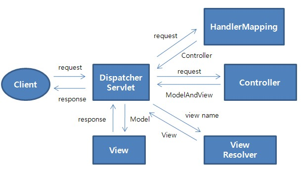

# 스프링 프레임워크

## :book: DI(Dependency Injection)
> 구성요소간의 의존 관계가 소스코드 내부가 아닌 외부의 설정파일 등을 통해 정의하는 것입니다.

### 과거와 현재의 객체 개념
- 배터리 일체형 : 배터리가 떨어지면 장난감을 새로 구입하는 것은 문제가 발생했을 때 전체를 교체하는 것과 같으므로 유연성이 떨어집니다.
    ```java
    // 일체형 : 생성자에서 객체 주입
    public class ElectronicCarToy{
        private Battery battery;

        public ElectronicCarToy(){
            battery = new NormalBatter();
        }
    }
    ```

- 배터리 분리형 : 배터리가 떨어지면 배터리만 교체하는 것은 필요한 부분만 수정이 가능다는 것이므로 재사용성, 이식성, 유연성이 증가됩니다.
    ```java
    // 분리형 1 : setter를 이용한 객체 주입
    public class ElectronicRobotToy{
        private Battery battery;

        public ElectronicRobotToy(){

        }

        public void setBattery(Battery battery){
            this.battery = battery;
        }
    }

    // 분리형 2 : 생성자, setter를 이용한 객체 주입
    public class ElectronicRadioToy{
        private Battery battery;

        public ElectronicRadioToy(Battery battery){
            this.battery = battery;
        }

        public void setBattery(Battery battery){
            this.battery = battery;
        }
    }
    ```

따라서 가장 유연한 코드는 생성자, setter를 이용해 객체를 분리하는 `분리형 2`입니다.
- `배터리를 필요로하는 장난감은 배터리에 의존적`이므로, 배터리를 분리하여 개발 후 의존성을 주입합니다.

<br>

### 스프링의 의존 객체 주입방법
- 생성자를 이용한 의존 객체 주입
  - service 클래스 생성(java)
      ```java
      public StudentRegisterService(StudentDao studentDao){
          this.studentDao = studentDao;
      }
      ```

  - bean 추가(xml)
      ```xml
      <bean id="studentDao" class="day1.ems.member.dao.StudentDao" ></bean>
      <bean id="registerService" class="day1.ems.member.service.StudentRegisterService">
          <!-- // 생성자 파라미터는 studentDao를 참조하라 -->
          <constructor-arg ref="studentDao" ></constructor-arg>
      </bean>
      ```

  - 선언 방식
      ```java
      private StudentDao studentDao;
      private StudentRegisterService registerService = new StudentRegisterService(studentDao);
      ```
- setter를 이용한 의존 객체 주입
  - setter 선언(java)
      ```java
      public void setJdbcUrl(String jdbcUrl){
          this.jdbcUrl = jdbcUrl;
      }
      ```

  - bean 추가(xml)
      ```xml
      <bean id="dataBaseConnectionInfoDev" class="day1.ems.member.DataBaseConnectionInfo">
          <!-- // set을 없애고 그 뒤에오는 대문자를 소문자로 변경하면 프로퍼티의 이름이 됨 -->
          <property name="jdbcUrl" value="jdbc:oracle:thin:@localhost:1521:xe" />
          <property name="userId" value="scott" />
          <property name="userPw" value="tiger" />
      </bean>
      ```

- List 타입 의존 객체 주입
  - setter 선언(java)
      ```java
      public void setDevelopers(List<String> developers){
          this.developers = developers;
      }
      ```

  - property 선언(xml)
      ```xml
      <property name="developers">
          <list>
              <value>Cheney.</value>
              <value>Eloy.</value>
              <value>Jasper.</value>
              <value>Dillon.</value>
              <value>Kian.</value>
          </list>
      </property>
      ```

- Map 타입 의존 객체 주입
  - setter 선언
      ```java
      public void setAdministrators(Map<String, String> administrators){
          this.administrators = administrators;
      }
      ```

  - propery 선언
      ```xml
      <property name="administrators">
          <map>
              <entry>
                  <key>
                      <value>Cheney</value>
                  </key>
                  <value>cheney@springPjt.org</value>
              </entry>
              <entry>
                  <key>
                      <value>Jasper</value>
                  </key>
                  <value>jasper@springPjt.org</value>
              </entry>
          </map>
      </property>
      ```

<br>

### 의존 객체 자동 주입
> 스프링 설정 파일에서 의존 객체를 주입할 때 `<constructor-org>` 또는 `<property>` 태그로 의존 대상 객체를 명시하지 않아도 스프링 컨테이너가 자동으로 필요한 의존 대상 객체를 찾아서 의존 대상 객체가 필요한 객체에 주입해 주는 기능입니다.

- 기존 스프링 컨테이너 설정 *(의존 객체를 수동으로 주입)*
    ```xml
    <?xml version="1.0" encoding="UTF-8"?>
    <beans xmlns="http://www.springframework.org/schema/beans"
    xmlns:xsi="http://www.w3.org/2001/XMLSchema-instance"
    xsi:schemaLocation="http://www.springframework.org/schema/beans 
     http://www.springframework.org/schema/beans/spring-beans.xsd">
    <bean id="wordDao" class="day2.com.word.dao.WordDao" />
    <bean id="registerService" class="day2.com.word.service.WordRegisterService">
    <constructor-arg ref="wordDao" />
    </bean>
    <bean id="searchService" class="day2.com.word.service.WordSearchService">
    <constructor-arg ref="wordDao" />
    </bean>
    </beans>
    ```

- 의존 객체 자동 주입 스프링 컨테이너 설정
    ```xml
    <?xml version="1.0" encoding="UTF-8"?>
    <beans xmlns="http://www.springframework.org/schema/beans <!-- 추가  -->"
    xmlns:context="http://www.springframework.org/schema/context"
    xmlns:xsi="http://www.w3.org/2001/XMLSchema-instance"
    xsi:schemaLocation="http://www.springframework.org/schema/beans 
     http://www.springframework.org/schema/beans/spring-beans.xsd
     <!-- 추가  --> 
     http://www.springframework.org/schema/context
     <!-- 추가  -->
     http://www.springframework.org/schema/context/spring-context.xsd">
    <!-- 추가  -->
    <context:annotation-config />
    <bean id="wordDao" class="day2.com.word.dao.WordDao" >
    <!-- <qualifier value="usedDao"/> -->
    </bean>
    <bean id="wordDao2" class="day2.com.word.dao.WordDao" />
    <bean id="wordDao3" class="day2.com.word.dao.WordDao" />
    <bean id="registerService" class="day2.com.word.service.WordRegisterServiceUseAutowired" />
    <bean id="searchService" class="day2.com.word.service.WordSearchServiceUseAutowired" />
    </beans>
    ```

- `@Autowired` : 주입하려고 하는 객체의 타입이 일치하는 객체를 자동으로 주입합니다.
  - 프로퍼티, 생성자, 메소드에 전부 사용할 수 있습니다.
  - 스프링 컨테이너에서 `@Autowired`에 접근하면 어노테이션을 적용한 객체의 데이터 타입을 가진 빈 객체를 찾아 알맞은 데이터를 주입합니다.

- `@Resources`
  - 주입하려고 하는 객체의 이름이 일치하는 객체를 자동으로 주입하므로 프로퍼티, 메소드에만 사용하고 생성자에는 사용할 수 없습니다.
  - @Autowired와 거의 동일하나 일치하는 타입이 아닌 `일치하는 이름`을 찾는다는 것을 확실히 구분해야 합니다.

<br>

### 의존 객체 선택
> 동일한 타입의 빈 객체가 여러 개 있을 때 @Autowired는 무엇에 의존성을 주입해야하는지 헷갈릴 수 있습니다.

동일한 객체가 2개 이상인 경우 스프링 컨테이너는 자동 주입 대상 객체를 판단하지 못하고 Exception을 발생시키므로 개발자가 의존 객체를 선택할 수 있는 방법을 제시할 수 있어야 합니다.

- `@Autowired` : 같은 WordDao 객체지만 @Qualifier(우선통과자)를 사용해 의존 객체 선택
  - 스프링 설정 파일(xml)
    ```xml
    <bean id="wordDao" class="day2.com.word.dao.WordDao" >
        <qualifier value="usedDao"/>
    </bean>
    <bean id="wordDao2" class="day2.com.word.dao.WordDao" />
    <bean id="wordDao3" class="day2.com.word.dao.WordDao" />
    ```

  - 의존성을 주입 받을 파일(java)
    ```java
    @Autowired
    @Qualifier("usedDao")
    private WordDao wordDao;
    ```

- `@Inject`
  - 스프링 설정 파일(xml)
    ```xml
    <bean id="wordDao1" class="day2.com.word.dao.WordDao" />
    <bean id="wordDao2" class="day2.com.word.dao.WordDao" />
    <bean id="wordDao3" class="day2.com.word.dao.WordDao" />
    ```
    
  - 의존성을 주입 받을 파일(java)
    ```java
    @Inject
    @Named(value = "wordDao1")
    private WordDao wordDao;
    ```

<br>

### 의존 객체 자동 주입 체크
> 의존 객체가 스프링 컨테이너에서 생성되지 않은 경우, @Autowired 어노테이션을 붙이면 Exception이 발생합니다.

@Autowired(requier=false)를 적용하면 `의존 객체 자동 주입을 하지 않겠다`는 기능이 활성화됩니다. 그러나 어떤 개발자도 빈 객체를 생성하지 않고 객체 주입을 하지 않으므로 이런 기능이 있다는 것만 알아두세요.

@Autowired와 거의 비슷하게 @Inject 어노테이션을 이용해 의존 객체를 자동으로 주입할 수 있습니다. 차이점이라면 @Autowired는 required 속성으로 의존 대상 객체가 없어도 Exception을 피할 수 있지만, @Inject는 required 속성을 지원하지 않습니다.

<br>

<sup>[(상위 문서로)](https://github.com/InSeong-So/IT-Note)</sup>

<hr>
<br>

## :book: 생명주기(Life Cycle)
### 스프링 컨테이너의 생명주기
> `GenericXmlApplicationContext`를 이용한 스프링 컨테이너 초기화(생성), `getBean()`을 이용한 빈(Bean) 객체 이용, `close()`를 이용한 스프링 컨테이너 종료가 있습니다.

빈(Bean) 객체의 생명주기는 스프링 컨테이너의 생명주기와 같습니다. 아래를 살펴볼까요?

1. 스프링 컨테이너 초기화 : 빈(Bean) 객체 생성 및 주입
    - 빈 객체 생성시점에 호출 : `afterPropertiesSet`(InitializingBean 인터페이스에서 구현)
2. 스프링 컨테이너 종료 : 빈(Bean) 객체 소멸
    - 빈 객체 소멸시점에 호출 : `destory`(DiposableBean 인터페이스에서 구현)

<hr>
<br>

### init-method, destroy-method 속성
> 빈 객체 선언시 init-method, destory-method 속성을 적용해 생성/소멸 단계를 제어합니다.

지정한 이름과 동일한 메소드를 의존객체 주입한 대상 내부에 메소드로 구현되며 생성/소멸 시 자동으로 호출됩니다.

- 스프링 설정 *(xml, java)*
    ```xml
    <bean id="bookRegisterService" class="day3.com.brms.book.service.BookRegisterService" 
    init-method="initMethod" destroy-method="destroyMethod"/>
    ```
    ```java
    public void initMethod() {
        System.out.println("BookRegisterService 빈(Bean)객체 생성 단계");
    }
    public void destroyMethod() {
        System.out.println("BookRegisterService 빈(Bean)객체 소멸 단계");
    }
    ```

<br>

### 어노테이션을 이용한 스프링 설정
> 기존 스프링 설정을 `*.xml` 파일로 설정했다면 이제 `*.java` 파일로 설정합니다.

즉, applicationContext.xml을 어노테이션을 활용한 config.java 파일로 대체하는 것이죠. `@Configuration` 어노테이션으로 설정 파일임을 알리고, `@Bean` 어노테이션으로 빈 객체를 생성한다고 알립니다.

<br>

### java 파일로 스프링 설정 분리
> `*.xml` 파일을 분리하여 유지하듯 `*.java` 파일도 동일하게 분리하여 관리할 수 있습니다.


이는 설정 파일의 내부 코드가 길어지면 직관성이 떨어지고 유지보수에 어려움이 생길 수 있기 때문입니다. 따라서 마음대로 분리해도 상관 없으나, 분류를 나누어 분리하는 것이 좋습니다.

- `@Import` 어노테이션을 이용한 스프링 설정(java) 파일 읽기
    ```java
    // 변경 전
    AnnotationConfigApplicationContext ctx
        = new AnnotationConfigApplicationContext(MemberConfig1.class,
                MemberConfig2.class, MemberConfig3.class);
    
    // 변경 후
    @Configuration
    @Import({ MemberConfig2.class, MemberConfig3.class})
    public class MemberConfig1 {
        .........
    }
    ```

<br>

<sup>[(상위 문서로)](https://github.com/InSeong-So/IT-Note)</sup>

<hr>
<br>

## :book: 웹 프로그래밍 설계 모델
### 웹 프로그래밍을 구축하기 위한 설계 모델
-  Model1 : `브라우저(클라이언트)` | `WAS(JSP ↔ Service & DAO)` | `데이터베이스`
   - 처리과정
     - 클라이언트가 WAS(이하 서버)로 요청을 하면 내부에서 작업을 하면서 데이버테이스에 접근해 데이터를 가져옵니다(내부 로직 처리).
     
     - 가져온 데이터로를 UI 작업을 통해 클라이언트에게 응답합니다(HTML 코드로 반환).
     
     - WAS에서 사용자로부터 받은 요청을 받은 기능(Service)과 데이터베이스와 연결짓는 기능(DAO), 요청받은 내용을 응답하는 기능(JSP)을 통합하여 하나의 파일로 관리합니다.

   - 장점
     - 단순한 흐름으로 개발에 빠릅니다.
     - 초보자도 쉽게 적용할 수 있습니다.
     - 작은 프로젝트에 적합합니다.
       
   - 단점 
     - 여러가지 언어를 하나의 문서에 작성하여 유지보수가 어렵습니다.

- Model2 : Model1의 단점을 보완하기 위해 등장, `브라우저(클라이언트)` | `WAS(Controller( ↔ View) ↔ Service ↔ DAO)` | `Model` | `데이터베이스`
  - 처리 과정
    - 클라이언트가 서버에 요청을 하는 것은 같으나 각각의 기능을 분리시켜 모듈화
      - 기능은 `Service`
      
      - 데이터베이스와 연결하는 것은 `DAO`
      
      - 사용자에게 보여줄 것은 `JSP`
      
      - 이들을 통제하는 것이 `Controller`
      
      - 데이터베이스와 관련된 데이터는 `Model`

  - 장점
    - 기능별 로직이 분리되어 유지보수 및 분업이 용이합니다.
    
    - 단위가 큰 프로젝트에 적합합니다.

  - 단점
    - 구조 설계 등 개발자가 신경써야 하는 부분이 많아 개발이 느립니다.

<br>

### 스프링 MVC프레임워크 설계 구조

<br>

<div align='center'>



</div>

<br>

- 구분별 설명
  - `HandleMapping` : 많은 컨트롤러 중 가장 알맞은 컨트롤러를 찾습니다.
  
  - `HandlerAdapter` : 많은 메소드 중 사용자가 요청한 데이터에 가장 적합한 메소드를 찾고, 요청에 대한 작업 후 Model을 통해 데이터를 운반합니다.
  
  - `ViewResolver` : 사용자 요청에 대한 작업이 컨트롤러로부터 모두 종료되고 DispatcherServlet은 ViewResolver에 데이터 정보를 보내면 가장 적합한 JSP 페이지(View 페이지)를 찾습니다.
  
  - View : 페이지를 통해 사용자 요청에 대해 응답합니다.

<br>

### DispatcherServlet 설정
> WEB-INF 폴더에 web.xml을 만들어 설정할 내용들을 태그로 묶어 기입하며, 설정이 완료되면 스프링 설정 파일도 같이 만들어집니다.
  
DispatcherServlet을 등록, 초기 파라미터로 스프링 설정 파일(servlet-context.xml)을 설정하면 컨테이너가 생성되고 디스패쳐 서블릿이 설정됩니다.
1. 초기화 파라미터에서 지정한 파일(servlet-context.xml)을 이용해서 스프링 컨테이너를 생성합니다.
2. 초기화 파라미터에서 스프링 설정 파일을 지정하지 않은 경우 서블릿 별칭을 이용해 스프링 컨테이너를 생성합니다.

<br>

### Controller 객체 1 : @Controller
> `DispatcherServlet` ↔ `HandlerAdapter` ↔ `Controller`

servlet-context.xml에 선언 후 Controller 객체로 사용할 클래스를 정의합니다.

@Controller 적용 방법
```java
@Controller
public class HomeController{
    ...
}
```

<br>

### Controller 객체 2 : @RequestMapping
> `DispatcherServlet` ↔ `HandlerAdapter` ↔ `Controller`

Controller 클래스 내부의 메소드 중 @RequestMapping 어노테이션을 붙이고 값을 입력하고, 사용자로부터 오는 요청을 특정 문자로 매칭합니다.

@RequestMapping 적용 방법
```java
@RequestMapping("/success")
public String success(Model model){
    ...
}
```

<br>

### Controller 객체 3 : Model 타입의 파라미터
> 개발자는 Model 객체에 데이터를 담아서 DispatcherServlet에 전달할 수 있습니다.

DispatcherServlet에 전달된 Model 데이터는 View 에서 가공되어 클라이언트에게 응답 처리됩니다.

Model 파라미터 적용 방법
```java
@RequestMapping("/success")
public String success(Model model){
    ...
}

model.setAttribute("model", "model status set!");
```

<hr>
<br>

### View 객체
> 뷰를 찾는 역할을 View Resolver에게 위임합니다.

스프링 설정파일에 InternalResourceViewResolver를 찾고, HandlerAdapter에서 찾은 메소드의 리턴 값에 따른 파일을 찾아 실제로 사용자에게 응답합니다.

<br>

### 전체적인 웹 프로그래밍 구조
- 구분 별 설명
    1. `DispatcherServlet`은 등록과 설정만 해주면 되며, 개발자가 참여할 필요가 전혀 없습니다.
    2. `HandlerMapping, HandlerAdapter`는 개발자가 참여할 필요가 전혀 없으며 컨테이너가 자동으로 처리합니다.
    3. `Controller`의 @Controller, @RequestMapping 등 개발자가 처리해야 합니다.
    4. `ViewResolver` 개발자가 참여할 필요가 전혀 없습니다.
    5. `View`는 개발자가 처리해야 합니다.

- 진행 프로세스를 볼까요?
  1. 최초 사용자 요청 : [http://localhost:8080/test/success](http://localhost:8080/test/success)
  2. DispatcherServlet
  3. HandlerMapping
  4. Controller : @Controller 어노테이션이 적용된 클래스 검색
  5. DispatcherServlet
  6. HandlerAdapter : 사용자 요청에 해당하는 메소드 검색
  7. Controller : @RequestMapping("/success") 어노테이션이 적용된 메소드 검색 및 실행
  8. DispatcherServlet
  9. ViewResolver : ViewResolver에 의해 검색된 success.jsp 검색 및 실행
  10. View : 브라우저에 JSP를 이용해 응답

즉, 서버와 뷰에 대한 개발자의 작업을 분할하여 사용합니다.

<br>

<sup>[(상위 문서로)](https://github.com/InSeong-So/IT-Note)</sup>

<hr>
<br>

## :book: 웹 어플리케이션 구조
> 사용자 요청(브라우저) → 프론트 컨트롤러(DispatcherServlet) → 뷰(jsp 파일 등) → 컨트롤러 → 서비스 → DAO(Data Access Object) → Database

### 서비스 객체 구현
- 방법 1 : new 연산자를 이용한 service 객체 생성 및 참조
    ```java
    MemberService service = new MemberService();
    ```

- 방법 2 : 스프링 설정파일을 이용한 서비스 객체 생성 및 의존 객체 자동 주입
    ```xml
    <beans:bean id="service" class="com.spring.basic.member.service.MemberService" />
    ```
    ```java
    @Autowired
    MemberService service;
    ```

- 방법3 : 어노테이션을 이용한 서비스 객체 생성 및 의존 객체 자동 주입
    ```java
    @Repository("memService")
    public class MemberService implements IMemberService{}
    ```
    ```java
    @Resource(name="memService")
    MemberService service;
    ```

<br>

### DAO 객체 구현
- 어노테이션을 이용한 DAO 객체 생성 및 의존 객체 자동 주입
    ```java
    @Repository
    public class MemberDao implements IMemberDao{}
    ```
    ```java
    @Autowired
    MemberDao dao;
    ```

- 한글 처리(web.xml 추가)
    ```xml
    <filter>
    <filter-name>encodingFilter</filter-name>
    <filter-class>
    org.springframework.web.filter.CharacterEncodingFilter     
    </filter-class>
    <init-param>
    <param-name>encoding</param-name>   
    <param-value>UTF-8</param-value>
    </init-param>
    <init-param>
    <param-name>forceEncoding</param-name>  
    <param-value>true</param-value>
    </init-param>
    </filter>    
    
    <filter-mapping>
    <filter-name>encodingFilter</filter-name>
    <url-pattern>/*</url-pattern>                 
    </filter-mapping>
    ```

<br>

<sup>[(상위 문서로)](https://github.com/InSeong-So/IT-Note)</sup>

<hr>
<br>

## :book: 컨트롤러의 기능
### @RequestMapping을 이용한 URL 매핑
> 메소드에 @RquestMapping 적용

컨트롤러 내부의 세부 기능으로 구분합니다.
1. http://locatlhost:8080/basic/memJoin → memJoin() 실행
2. 기본적인 매핑 방법
    ```java
    @RequestMapping("/memJoin")
    public String memJoin(){
        ...
    }
    ```
3. 전송 방식에 따른 매핑 방법
    ```java
    // 전송 방식이 GET 방식일 경우(속성 생략 가능)
    @RequestMapping(value="memJoin")
    public String memJoin(){
        ...
    }
 
    // 전송 방식이 POST 방식일 경우(속성 반드시 기입)
    @RequestMapping(value="memJoin", method=RequestMethod.POST)
    public String memJoin(){
        ...
    }
    ```

<br>

### 클래스에 @RequestMapping 적용

기능에 따른 컨트롤러 클래스를 제작하는데 사용합니다. 매핑 URL이 아래인 경우 코드를 확인해볼까요?
- http://localhost:8080/basic/member/memJoin
- http://localhost:8080/basic/member/memLogin
    ```java
    @Controller
    @RequestMapping("/member")
    public class MemberController{
        @RequestMapping(value="/memJoin", method=RequestMethod.POST)
            ...
            
        @RequestMapping(value="/memLogin", method=RequestMethod.POST)
            ...
    }
    ```


### 요청 파라미터
- HttpServletRequest 객체를 이용한 HTTP 전송 정보 얻기

    # 사용 방법
    public String memJoin(Model model, HttpServletRequest request){
    String memid = request.getParamter("memId");
    }

## :book: @RequestParam 어노테이션을 이용한 HTTP 전송 정보 얻기
> @RequestParam의 속성

```java
public String memJoin(Model model, @RequestParam("memId") String memId,
    @RequestParam("memPw") String memPw) {
    String memid = request.getParamter("memId");
}
```
  - value : 생략(value="")해도 됩니다.
  - required : 생략(required=true||false)해도 됩니다. 입력 여부를 정하는 속성입니다.
  - default : 생략해 됩니다. 입력을 하지 않아도 기본적으로 들어가는 값을 지정하는 속성입니다.

<br>

### 받아온 전송정보 사용하기
- 각 파라미터를 설정하여 사용하는 방법
    ```java
    // Controller 코드
    @RequestMapping(value="/memJoin", method=RequestMethod.POST)
    public String memJoin(Model model, HttpServletRequest request) {
        String memId = request.getParameter("memId");
        String memPw = request.getParameter("memPw");
        String memMail = request.getParameter("memMail");
        String memPhone1 = request.getParameter("memPhone1");
        String memPhone2 = request.getParameter("memPhone2");
        String memPhone3 = request.getParameter("memPhone3");
        
        service.memberRegister(memId, memPw, memMail, memPhone1, memPhone2, memPhone3);
        
        model.addAttribute("memId", memId);
        model.addAttribute("memPw", memPw);
        model.addAttribute("memMail", memMail);
        model.addAttribute("memPhone", memPhone1 + " - " + memPhone2 + " - " + memPhone3);
        
        return "memJoinOk";
    }
    ```
    ```html
    <!-- View 코드 --> 
    <h1> memJoinOk </h1>
    ID : ${memId}<br />
    PW : ${memPw}<br />
    Mail : ${memMail} <br />
    Phone : ${memPhone} <br />
    ```
    ```java
    // 커맨드 객체를 생성하여 사용하는 방법(getter, setter 반드시 필요)
    // Controller 코드
    @RequestMapping(value="/memJoin", method=RequestMethod.POST)
    public String memJoin(Member member) {
        service.memberRegister(member.getMemId(), member.getMemPw(),
                member.getMemMail(), member.getMemPhone1(), member.getMemPhone2(),
                member.getMemPhone3());

        return "memJoinOk";
    }
    ```
    ```html
    <!-- View 코드 --> 
    <h1> memJoinOk </h1>
    ID : ${member.memId}<br />
    PW : ${member.memPw}<br />
    Mail : ${member.memMail} <br />
    Phone : ${member.memPhone1}, ${member.memPhone2}, ${member.memPhone3} <br />
    ```

최근엔 개발자의 스트레스를 줄이기 위해 커맨드 객체를 사용하는 방법을 애용합니다.

<br>

### @ModelAttribute
- 사용 방법 1
    ```java
    // 컨트롤러
    public String memJoin(Member member){...}
    public String memLogin(Member member){...}
    public String memRemove(@ModelAttribute("mem") Member member){...}
    ```
    ```html
    <!-- 뷰 -->
    ${member.memId}<br />
    ${member.memId}<br />
    ${mem.memId}<br />
    ```

@ModelAttribute를 이용하면 커맨드 객체의 이름을 변경할 수 있고, 변경된 이름은 뷰에서 커맨드 객체를 참조할 때 사용됩니다. 중복된 이름으로 개발 간 스트레스를 받지 않아도 됩니다.

<br>

- 사용 방법 2
    ```java
    @ModelAttribute("serverTime")
    public String getServerTime(Locale locale) {
    
    Date date = new Date();
    DateFormat dateFormat = DateFormat.getDateTimeInstance(DateFormat.LONG, DateFormat.LONG, locale);
    
    return dateFormat.format(date);
    }
    ```

@ModelAttribute가 적용된 메소드는 다른 메소드가 호출되어질지라도 공통적으로 같이 호출됩니다.

<br>

### 커맨드 객체 프로퍼티 데이터 타입
- 데이터가 기본 타입인 경우 : 필요한 절차 없이 받고 싶은 타입으로 지정하면 스프링이 자동으로 설정합니다.
    ```html
    <!-- memberJoin.html -->
    ID : <input type="text" name="memId" ><br />
    PW : <input type="password" name="memPw" ><br />
    MAIL : <input type="text" name="memMail" ><br />
    AGE : <input type="text" name="memAge" size="4" value="0"><br />
    ```
    ```java
    // Member.java
    private String memId;
    private String memPw;
    private String memMail;
    private int memAge;
    ```

- 데이터가 중첩 커맨드 객체를 이용한 List 구조인 경우, 해당하는 이름의 커맨드 객체를 새로 하나 만들어 저장합니다.
    ```html
    <!-- memberJoin.html -->
    PHONE1 : <input type="text" name="memPhones[0].memPhone1" size="5"> -
     <input type="text" name="memPhones[0].memPhone2" size="5"> -
     <input type="text" name="memPhones[0].memPhone3" size="5"><br />
    PHONE2 : <input type="text" name="memPhones[1].memPhone1" size="5"> -
     <input type="text" name="memPhones[1].memPhone2" size="5"> -
     <input type="text" name="memPhones[1].memPhone3" size="5"><br />
    ```
    ```java
    // Member.java
    private List<MemPhone> memPhones;
    ```

<br>

### Model & ModelAndView
> 컨트롤러에서 뷰에 데이터를 전달하기 위해 사용되는 객체입니다.

- Model : View에 데이터만 전달하는 객체
    ```java
    @RequestMapping(value = "/memModify", method = RequestMethod.POST)
    public String memModify(Model model, Member member) {

        Member[] members = service.memberModify(member);

        // 데이터 이름, 데이터 값
        model.addAttribute("memBef", members[0]);
        model.addAttribute("memAft", members[1]);

        // 뷰 이름
        return "memModifyOk";
    }
    ```
    
- ModelAndView : 데이터와 뷰의 이름을 함께 전달하는 객체
    ```java
    @RequestMapping(value = "/memModify", method = RequestMethod.POST)
    public ModelAndView memModify(Member member) {
    
        Member[] members = service.memberModify(member);
        ModelAndView mav = new ModelAndView();
        
        // 데이터 이름, 데이터 값
        mav.addObject("memBef", members[0]);
        mav.addObject("memAft", members[1]);
        
        // 뷰 이름
        mav.setViewName("memModifyOk");
        
        // 객체 반환
        return mav;
    }
    ```

<br>

<sup>[(상위 문서로)](https://github.com/InSeong-So/IT-Note)</sup>

<hr>
<br>