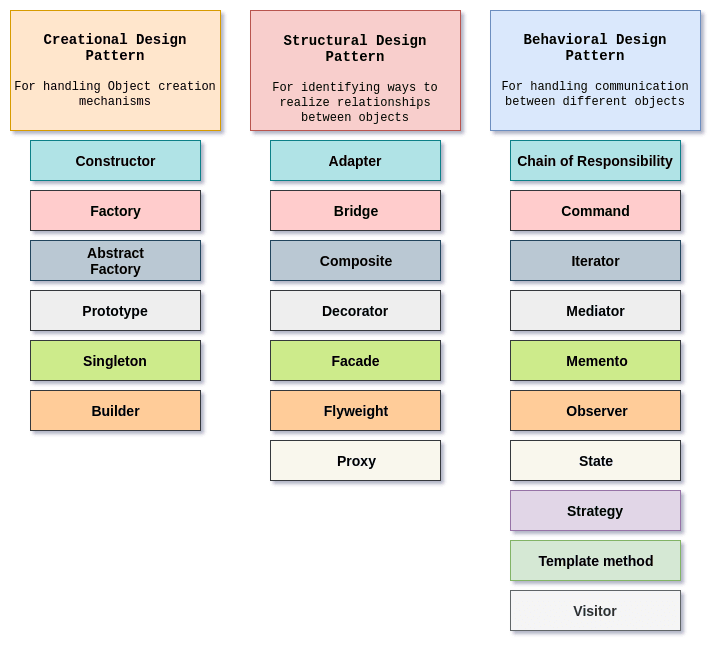
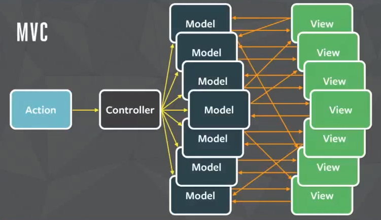
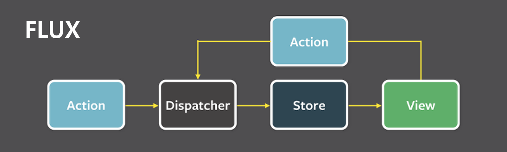

# `JavaScript`의 디자인 패턴
> 참조 [Link](https://www.telerik.com/blogs/design-patterns-in-JavaScript)

 

 

## GOF 패턴

 

### ref
[참조](https://github.com/ziyasal/design-patterns-and-idioms-in-es6)

 

## Flux 패턴
> MVC 패턴은 양방향 데이터 흐름을 만들어 예측하기 어려운 버그를 발생시킵니다. Flux의 가장 큰 특징은, 바로 **단방향 데이터 흐름**이라는 겁니다.

 

⛔️MVC의 안티 패턴으로, 이 형태가 MVC인 것은 아니에요⛔️

 

 

차이점이 보이시나요? 데이터가 단방향으로 흐름으로 MVC 패턴보다 데이터 변화를 예측하기 훨씬 쉬워집니다. Flux를 쪼개보면 크게 Dispatcher, Store와 View로 이루어집니다.

개략적으로 살펴보면 아래와 같습니다.
1. Dispatcher : 데이터의 모든 흐름을 총괄하는 허브(Hub)입니다.
2. Store : 중앙 집중형 저장소로 모든 상태 변경은 Store를 통해 이루어집니다.
3. View : 데이터 변경과 그에 따른 화면 출력이 이루어지는 부분입니다.
4. Action Dispatcher와 Store 사이에 인수로서 전달되는 객체입니다. 해당 이벤트에 대한 정보, 데이터 등을 담고 있습니다.

 

[(상위 문서로)](https://github.com/InSeong-So/IT-Note)

 

<!-- # Creational Patterns
크레셔널 패턴은 객체를 직접 인스턴스화하는 대신 객체를 생성하는 패턴입니다. 따라서 프로그램에 주어진 경우에 대해 작성해야 하는 개체를 보다 유연하게 결정할 수 있습니다.

추상 팩토리: 구체적인 클래스를 지정하지 않고 관련 객체 또는 종속 객체의 패밀리를 작성할 수 있는 인터페이스를 제공합니다.
Builder: 복잡한 객체의 구성을 표현과 분리하여 동일한 구성 프로세스가 다양한 표현을 만들 수 있습니다.
Factory 메서드: 단일 객체를 만들기 위한 인터페이스를 정의하지만, 하위 클래스가 인스턴스화할 클래스를 결정하도록 합니다. Factory Method를 사용하면 클래스가 인스턴스화를 하위 클래스로 연기할 수 있습니다.
프로토타입: 프로토타입 인스턴스를 사용하여 생성할 객체의 종류를 지정하고, 기존 객체의 '골격'에서 새 객체를 생성하여 성능을 높이고 메모리 설치 공간을 최소화합니다.
Singleton: 클래스에 인스턴스가 하나만 있는지 확인하고 클래스에 대한 전역 액세스 지점을 제공합니다.

# Structural Patterns
이것들은 클래스 및 객체 구성에 관한 것입니다. 그들은 상속을 사용하여 인터페이스를 구성하고 객체를 구성하는 방법을 정의하여 새로운 기능을 얻는다.

어댑터: 호환되지 않는 인터페이스가 있는 클래스가 이미 존재하는 클래스의 인터페이스를 래핑하여 함께 작동할 수 있습니다.
브리지: 구현에서 추상화를 분리하여 두 가지가 독립적으로 달라질 수 있습니다.
합성: 0개 또는 그 이상의 유사한 개체를 구성하여 하나의 개체로 조작할 수 있습니다.
장식자: 객체의 기존 메서드에서 동작을 동적으로 추가하거나 재정의합니다.
파사드: 대규모 코드에 대한 단순화된 인터페이스를 제공합니다.
플라이웨이트: 많은 수의 유사한 개체를 만들고 조작하는 비용을 절감합니다.
프록시: 다른 객체가 액세스를 제어하고, 비용을 절감하고, 복잡성을 줄일 수 있는 자리 표시자를 제공합니다.

# Behavioral Patterns
이러한 디자인 패턴의 대부분은 특별히 물체들 간의 의사소통과 관련이 있다.

책임 사슬: 일련의 처리 객체에 명령을 위임합니다.
명령: 동작 및 매개 변수를 캡슐화하는 개체를 만듭니다.
통역: 전문 언어를 구현합니다.
반복자: 기본 표현을 노출하지 않고 객체의 요소에 순차적으로 액세스합니다.
중재자: 메서드에 대한 자세한 정보를 가진 유일한 클래스가 되어 클래스 간의 느슨한 결합을 허용합니다.
메멘토: 객체를 이전 상태(언도)로 복원하는 기능을 제공합니다.
관찰자:는 여러 관찰자 개체가 이벤트를 볼 수 있는 게시/구독 패턴입니다.
State: 객체가 내부 상태가 변경될 때 동작을 변경할 수 있습니다.
전략: 알고리즘 제품군 중 하나를 런타임에 즉시 선택할 수 있습니다.
템플릿: 메소드는 알고리즘의 골격을 추상 클래스로 정의하여 해당 하위 클래스가 구체적인 동작을 제공할 수 있도록 합니다.
방문자: 메소드 계층을 한 개체로 이동하여 알고리즘을 개체 구조에서 분리합니다. -->