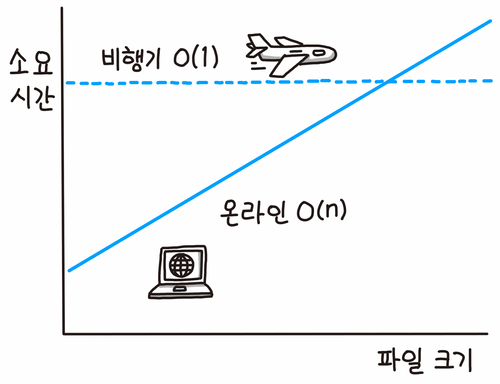
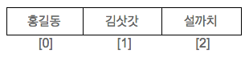
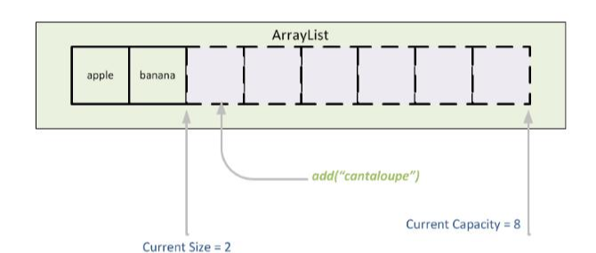
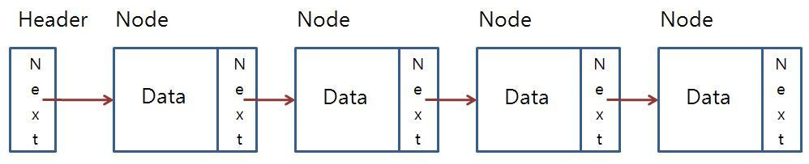
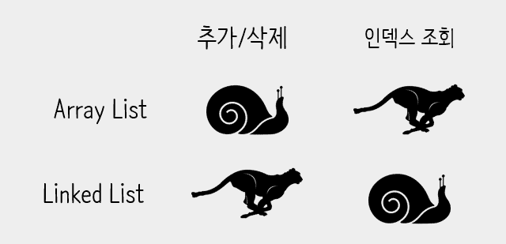
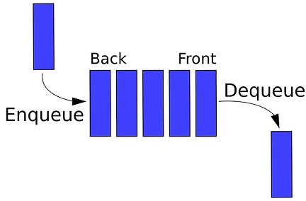

# 자료구조와 알고리즘
> 간단하게 짚고 넙어가는 항목입니다. 워낙 방대한 영역이므로 적혀 있는 내용이 자료구조와 알고리즘에 대한 모든 설명이라고 생각하지 마세요.

- 어디까지나 기본 문제를 풀기 위한 이해를 우선하므로 간단히 읽고 넘어가세요.
- 만약 흥미롭거나 이해가 되지 않는 부분이 존재한다면, 개인적인 탐구를 하시거나 PR로 수정해주시기 바랍니다.

<br>

# 자료구조
## :book: 빅오(Big-O) 표기법에 대해 설명해주세요.
> 알고리즘(Algorithm)의 효율성을 나타내는 지표입니다. 문제 풀이 후 **정확성**/**효율성** 검사를 하는데, 정확성은 `주어진 입출력을 얼마나 오차 없이 맞추는지`, 효율성은 `주어진 입출력을 얼마나 빠르게 맞추는지` 입니다.

먼저 그림을 볼까요?

<div align="center">

  

  <p></p><a href="https://www.onlybook.co.kr/entry/algorithm-interview">파이썬 알고리즘 인터뷰</a> p.100, 책만, 2020</p>
</div>

디스크에 있는 파일을 다른 지역의 친구에게 전송한다고 합시다. 두 가지 방법으로 비교합니다. 인터넷을 통한 전송과 비행기를 통한 전송이죠.

1. 인터넷 전송 : 파일 크기가 `n`이라면 O(n)의 시간이 소요됩니다.
  - 비용이 `적게` 듭니다!
2. 비행기 전송 : 파일 크기에 **상관 없이** O(1)의 시간이 소요됩니다.
  - 비용이 `많이` 듭니다!

파일 크기가 매우 작다면 인터넷으로 전송하는 것이 매우 효율적이며, 커질 수록 반대가 됩니다. 그러나 비행기로 전송하는 경우, 파일의 크기와 상관 없이 비행기로 전송하기 때문에 항상 일정한 시간이 소요됩니다. 

이 수치를 `점근적 실행 시간`이라고 하며, 빅오는 점근적 실행 시간을 표기하는 방법 중 하나입니다. 오, 물론 사용한 공간을 표기할 수도 있죠! 위의 예제에서 `비용이 적게/많게`라는 것은 메모리를 `조금/많이` 사용했다고 이해하시길 바랍니다! 정리하자면 아래와 같죠.
- 시간 복잡도(Time Complexity) : Big-O 표기법의 시간 개념으로, 알고리즘의 **수행시간**이 얼마인지를 나타냅니다.
- 공간 복잡도(Space Complexity) : Big-O 표기법의 메모리 사용 개념으로, 알고리즘의 **메모리 효율**을 나타냅니다.

일반적으로 알고리즘은 `시간과 공간의 트레이드오프(Space-Time Tradeoff)`라고 합니다. 실행 시간이 빠를수록 공간을 많이 사용하고, 공간을 조금 사용하는 알고리즘은 실행 시간이 느리다는 이야기죠. 아닌 것도 드물게 존재하지만... 여기는 거기까지 다루지 않아요!

<br>

<sup>[(상위 문서로)](https://github.com/InSeong-So/IT-Note)</sup>

<hr>
<br>

## :book: 배열 리스트(Array List)와 연결 리스트(Linked List)의 차이점을 알려주세요.
### 들어가기 앞서
자료구조에서 데이터를 구조화 시키는 방식으로는 `순차 자료구조` 와 `연결 자료구조` 두가지 방식이 있습니다.

리스트에 나열한 데이터들이 **일정한 순서**를 가지고 있으면 `선형 리스트(Linear List)` 또는 `순차 리스트(Ordered List)` 라 부르며, 선형 리스트를 표현하는 방법은 `<인덱스, 데이터>` 로 구성된 `배열(Array)` 를 사용합니다.

선형 리스트 메모리 상에 저장 될 때도 데이터가 나열 된 순서대로 정해집니다. 아래와 같이 말이죠.

1. 선언
    ```
    선형 리스트 이름 = ["홍길동", "김삿갓", "설까치"]
    ```

2. 저장된 메모리 형태

  <br>

  <div align='center'>

  

  </div>

<br>

### Array List
> 원소(Element)들이 메모리 상에 연속되어 있어 데이터의 추가, 삭제를 위해 더블링(Doubling of Array)으로 임시 배열을 생성하고 데이터를 복사합니다.

자바(Java) 기준으로 설명하자면, `List Interface`를 상속받은 배열 리스트(Array List)는 가변적으로 변하는 `선형 리스트`입니다. 일반적인 배열과 같으며 인덱스로 내부의 객체를 관리하죠.

그러나 한 번 생성되면 크기가 변하지 않는 배열과는 달리, 객체들이 추가되어 저장 용량(Capacity)을 초과한다면 자동으로 부족한 크기만큼 저장 용량이 늘어납니다.

관련 내용을 더 알아보고 싶다면, [더블링](https://github.com/InSeong-So/IT-Note/blob/master/chapter07-%EC%9E%90%EB%A3%8C%EA%B5%AC%EC%A1%B0%EC%99%80_%EC%95%8C%EA%B3%A0%EB%A6%AC%EC%A6%98/DoublingofArray.md#%EB%8D%94%EB%B8%94%EB%A7%81doubling-of-array) 페이지를 참조하세요!

<br>

<div align='center'>



<p>Array List의 시각화</p>

</div>

<br>

그럼 특징을 알아볼까요?
1. 데이터의 수에 따라 더블링을 통해 크기를 조절하므로 가변적입니다.
2. **무작위 접근(Random Access)** 으로 `O(1)`에 해당하는 시간 복잡도에 데이터 탐색이 가능합니다.
3. 중간 데이터의 삭제, 추가 또는 지정된 길이를 초과하는 데이터의 추가가 있을 경우 앞, 뒤 데이터의 이동이 많아지게 됩니다.

<br>

### Linked List
> 원소들이 메모리에 흩어져 있으나 노드(Node, 또는 Vertex)로 연결되어 있어 데이터의 추가, 삭제 시 데이터의 복사가 없어 성능상 유리한 반면 데이터의 탐색 시 처음부터 노드를 순회해야 합니다.

연결 리스트(LinkedList)는 각 노드가 데이터와 포인터(Pointer)를 가지고 한 줄로 연결되어 있는 방식의 자료구조입니다.

데이터를 담고 있는 노드들이 연결되어 있고, 노드의 포인터가 이전 노드와 다음 노드와의 연결을 담당하므로 중간에 데이터의 추가, 삭제 시 객체의 앞 뒤 링크만 변경합니다.

이처럼 전체의 인덱스(Index)가 한 칸씩 뒤로 밀리거나 당겨지는 일이 없기에 `배열 리스트`에 비해서 데이터의 추가, 삭제가 용이하나 인덱스가 없으므로 특정 요소에 접근하기 위해서는 `순차 탐색이 필요`합니다.

<br>

<div align='center'>



<p>Linked List의 시각화</p>

</div>

<br>

이미 특징을 이해한 것 같은데... 조금 더 알아볼까요?
1. 포인터로 노드와 노드를 연결하여 관리하므로 데이터의 추가, 삭제 시 데이터의 이동이 없습니다.
2. 그러나 포인터로 인해 메모리를 더 소비합니다.                                  |

<br>

### Array List vs Linked List
> 결론! 탐색 또는 **정렬을 자주 하는 경우엔 배열 리스트**를 사용하고 **데이터의 추가/삭제가 많은 경우 연결 리스트**를 사용하는 것이 좋습니다.

<br>

<table align="center">

  <tr align="center">
    <td>항목</td>
    <td>Array List</td>
    <td>Linked List</td>
  </tr>
  <tr>
    <td>인덱스(index)로 원소 참조</td>
    <td align="center"><em>O(1)</em></td>
    <td align="center"><em>O(n)</em></td>
  </tr>
  <tr>
    <td>처음 위치에 원소 삽입/삭제</td>
    <td align="center"><em>O(n)</em></td>
    <td align="center"><em>O(1)</em></td>
  </tr>
  <tr>
    <td>마지막 위치에 원소 삽입/삭제</td>
    <td align="center"><em>O(1)</em></td>
    <td align="center"><em>마지막 원소를 모를 때 O(n)</em><br><em>마지막 원소를 알 때 O(1)</em></td>
  </tr>
  <tr>
    <td>중간 위치에 원소 삽입/삭제</td>
    <td align="center"><em>O(n)</em></td>
    <td align="center"><em>search time + O(1)</em></td>
  </tr>

</table>

<br>

<div align='center'>



<p>치타와 달팽이</p>

</div>

<br>

<sup>[(상위 문서로)](https://github.com/InSeong-So/IT-Note)</sup>

<hr>
<br>

## :book: 스택(Stack)과 큐(Queue)는 무엇인가요?
### 스택(Stack)
> LIFO(Last-In, First-Out)으로 후입선출 구조라고 합니다.
> - [Javascript로 Stack 구현하기](https://github.com/InSeong-So/IT-Note)

<br>

<div align='center'>


</div>

<br>

아래와 같은 특징이 있습니다.

1. 가장 마지막에 들어온 데이터가 가장 먼저 나갑니다.
2. 재귀 알고리즘, 실행 취소, 후위 표기법 계산 등에 쓰입니다.

<br>

### 큐(Queue)
> FIFO(First-In, First-Out)으로 선입선출 구조라고 합니다.
> - [Javascript로 Queue 구현하기](https://github.com/InSeong-So/IT-Note)

<br>

<div align='center'>



</div>

<br>

아래와 같은 특징이 있습니다.

1. 가장 먼저 들어온 데이터가 가장 먼저 나갑니다.
2. 프로세스 처리, CPU 관리에서 많이 사용됩니다.

<br>

<sup>[(상위 문서로)](https://github.com/InSeong-So/IT-Note)</sup>

<hr>
<br>

## :book: 우선순위 큐(Priority Queue)는 무엇이고, 어떻게 동작하나요?

<br>

<sup>[(상위 문서로)](https://github.com/InSeong-So/IT-Note)</sup>

<hr>
<br>

## :book:Hash 에 대해 설명해주세요.
- 임의의 크기를 가진 데이터를 고정된 데이터의 크기로 변환시키는 것
  - Hash 를 사용하면 즉시 저장하거나 찾고자 하는 위치를 참조하므로 향상된 속도로 처리가 가능

<br>

<sup>[(상위 문서로)](https://github.com/InSeong-So/IT-Note)</sup>

<hr>
<br>

## :book:HashTable 의 이중 해쉬에 대해 설명해주세요.
해시테이블은 효율적인 탐색을 위한 자료구조로 key값을 value에 대응시킨다. 해시테이블을 구현하기 위해서는 연결 리스트와 해쉬 함수가 필요하다. 해싱은 임의의 길이의 값을 해쉬 함수를 통해 고정된 크기의 값으로 변환하는 작업을 말하는데, 키 값을 해시 코드로 변환한 후 해당 해시 코드로 배열의 인덱스를 참조하여 값을 찾는다. 충돌이 발생할 수 있으며, 최악의 경우 O(N), 일반적으로 잘 구현된 경우는 O(1)의 시간 복잡도를 가지게 된다. 충돌은 Chaining, Open addressing 등의 방식으로 해결할 수 있다.

해시테이블은 균형 이진 탐색 트리로도 구현할 수 있다. 이 경우는 탐색 시간이 O(logN)이 된다. 이 방법은 크기가 큰 배열을 미리 할당해 놓지 않아도 되기 때문에 잠재적으로 적은 공간을 사용한다는 장점이 있다.

<br>

<sup>[(상위 문서로)](https://github.com/InSeong-So/IT-Note)</sup>

<hr>
<br>

## :book:Tree 구조는 무엇인가요?
- 노드(Node)로 이루어진 자료구조
  - 트리는 하나의 루트 노드를 보유
  - 루트 노드는 0개 이상의 자식 노드를 보유
  - 그 자식 노드 또한 0개 이상의 자식 노드를 보유하며 이는 반복적으로 정의됨

- 그래프의 한 종류로서 계층형 모델이자 '최소 연결 트리' 라고 부름

- 계층적인 데이터 형태들은 트리에 저장하면 자연스럽게 표현되며 더욱 효율적임

<br>

<sup>[(상위 문서로)](https://github.com/InSeong-So/IT-Note)</sup>

<hr>
<br>

## :book:Binary Tree와 트리 순회법에 대해 설명해주세요.
### 이진 트리(Binary Tree)
> 이진 탐색과 연결 리스트를 결합한 자료구조입니다.

각 노드가 최대 두 개의 자식을 갖는 트리(Tree) 구조로서, 모든 트리가 이진 트리는 아닙니다. 효율적인 이진 탐색이 가능하면서 자료 입력과 삭제의 시간 복잡도가 O(h)라는 특징이 있습니다.

왼쪽 트리의 값은 반드시 부모 노드보다 작아야 하며, 오른쪽 트리의 값은 부모 노드보다 커야 합니다.

### 이진 트리 순회 방식
  - 전위 순회(pre-order traversal): 현재 노드 -> 왼쪽 가지 -> 오른쪽 가지
  - 중위 순회(in-order traversal): 왼쪽 가지 -> 현재 노드 -> 오른쪽 가지
  - 후위 순회(post-order traversal): 왼쪽 가지 -> 오른쪽 가지 -> 현재 노드

<br>

<sup>[(상위 문서로)](https://github.com/InSeong-So/IT-Note)</sup>

<hr>
<br>

## :book:Red-Black-Tree 구조를 알려주세요.
> 레드-블랙 트리(Red-Black Tree, RB Tree) : 자가 균형 이진 탐색 나무로써 연관 배열 등을 구현하는 데 쓰이는 대표적인 자료구조

- 특징
  - 복잡한 자료구조이나 실 사용에서 효율적
  - 자료의 삽입과 삭제, 검색에서 최악의 경우에도 일정한 실행 시간을 보장(worst-case guarantees)
  - 트리에 n개의 원소가 있을 때 O(log n)의 시간복잡도로 삽입, 삭제, 검색이 가능

- 동작
  - 레드-블랙 트리의 읽기 전용(read-only) 동작(탐색 등)은 이진 탐색 트리의 읽기 전용 동작의 구현을 변경하지 않아도 된다.
    - 레드-블랙 트리가 이진 탐색 트리의 특수한 한 형태이기 때문
  - 삽입(insertion)과 삭제(removal)의 경우 이진 탐색 트리의 구현에 따른 동작만으로는 레드-블랙 트리의 특성을 만족하지 못한다.
    - 레드-블랙 트리의 특성을 만족하게 만들기 위해서는 O(log n) 또는 amortized O(1)번의 색 변환과(실제로는 매우 빨리 이루어진다) 최대 3회의 트리 회전(tree rotation)이 필요하다(삽입의 경우 2회).
    - 삽입과 삭제는 복잡한 동작이지만, 그 복잡도는 여전히 O(log n)이다.

<br>

<sup>[(상위 문서로)](https://github.com/InSeong-So/IT-Note)</sup>

<hr>
<br>

## :book:B+ Tree 구조는 뭐에요?
> B+ 트리(Quaternary Tree) : 키에 의해서 각각 식별되는 레코드의 효율적인 삽입, 검색과 삭제를 통해 정렬된 데이터를 표현하기 위한 트리 자료구조

- 특징
  - 동적이며, 각각의 인덱스 세그먼트(블록 또는 노드) 내에 최대와 최소범위 키의 개수를 가지는 다계층 인덱스(MultiLevel Index)로 구성
  - 모든 레코드들이 트리의 가장 하위 레벨에 정렬되어 있으며 오직 키만 내부 블록에 저장
  - 블록-지향적인 Storage Context(예: filesystem)에서 검색을 효율적으로 할 수 있음
  - 바이너리 서치 트리에 비해 B+ 트리 노드의 fanout(한 노드의 자식 노드의 수)이 훨씬 높아 검색에 필요한 I/O 동작 횟수 감소 가능

<br>

<sup>[(상위 문서로)](https://github.com/InSeong-So/IT-Note)</sup>

<hr>
<br>

## :book:최소 스패닝 트리(Minimum Spanning Tree)는 무엇인가요?
그래프 G의 스패닝 트리 중 edge weight 값이 최소인 스패닝 트리를 말한다. 스패닝 트리란 그래프 G의 모든 vertex가 cycle 없이 연결된 형태를 말한다. n개의 vertex를 가지는 그래프에서 반드시 (n-1)개의 edge만을 사용해야 하며 사이클이 포함되어서는 안 된다. Kruskal과 Prim을 통해서 MST를 구현할 수 있다. Kruskal의 경우 그래프의 간선들을 오름차순으로 정렬하여 가장 낮은 가중치의 간선부터 차례로 MST에 집합체 추가하는 그리디 알고리즘 방식을 사용한다. Prim의 경우는 시작 정점부터 단계적으로 트리를 확장하는 방법이다.

<br>

<sup>[(상위 문서로)](https://github.com/InSeong-So/IT-Note)</sup>

<hr>
<br>

## :book:Heap 구조는 무엇인가요?
> 힙(heap) : 최댓값 및 최솟값을 찾아내는 연산을 빠르게 하기 위해 고안된 완전이진트리(complete binary tree)를 기본으로 한 자료구조
> - A가 B의 부모노드(parent node)이면, A의 키(key)값과 B의 키값 사이에는 대소관계가 성립

- 특징
  - 부모 노드의 키값이 자식 노드의 키값보다 항상 큰 힙인 '최대 힙'과 부모 노드의 키값이 자식 노드의 키값보다 항상 작은 힙인 '최소 힙'이 존재
  - 키값의 대소관계는 오로지 부모 노드와 자식 노드 간에만 성립하며 형제 사이에는 대소관계가 정해지지 않음
  - 각 노드의 자식 노드의 최대 개수는 힙의 종류에 따라 다르나 대부분의 경우는 자식 노드의 개수가 최대 2개인 이진 힙(binary heap)을 사용
  - 힙에서는 가장 높은(혹은 가장 낮은) 우선순위를 가지는 노드가 항상 뿌리 노드에 오게 되는 특징이 있음
    - 이를 응용하여 우선순위 큐와 같은 추상적 자료형을 구현

<br>

<sup>[(상위 문서로)](https://github.com/InSeong-So/IT-Note)</sup>

<hr>
<br>

## :book:Graph 구조에 대해 설명해주세요.
> 그래프(Graph) : vertex(정점)와 edge(정점과 정점을 연결하는 간선)로 구성된 한정된 자료구조

- 특징
  - 연결되어 있는 객체 간의 관계를 표현할 수 있는 자료구조
  - 그래프에는 방향성이 있을 수도 있고 없을 수도 있음
    - 방향성이 있는 간선은 일방통행, 방향성이 없는 간선은 양방통행 도로
  - 그래프는 여러 개의 고립된 부분 그래프(Isolated Subgraphs)로 구성 가능
    - 모든 정점 쌍(pair of vertices) 간에 경로가 존재하는 그래프는 연결 그래프라고 부름
  - 그래프에는 사이클이 존재할 수도, 존재하지 않을 수도 있으며 사이클이 없는 그래프는 비순환 그래프라고 부름

- 종류
  - 인접 리스트(Adjacency List)
    - 그래프를 표현할 때 사용되는 가장 일반적인 방법
    - 모든 정점(혹은 노드)를 인접 리스트에 저장
      - 무방향 그래프(Undirected Graph)에서 (a, b) 간선은 두 번 저장
      - 한 번은 a 정점에 인접한 간선을 저장하고 다른 한 번은 b에 인접한 간선을 저장

<br>

<sup>[(상위 문서로)](https://github.com/InSeong-So/IT-Note)</sup>

<hr>
<br>

## :book:Binary Search Tree 의 최악을 말하자면 어떤가요?

<br>

<sup>[(상위 문서로)](https://github.com/InSeong-So/IT-Note)</sup>

<hr>
<br>

## :book:DFS 와 BFS 는 뭔가요?
- DFS : 깊이 우선 탐색
  - a 노드를 방문한 위 a와 인접한 노드들을 차례로 순환
    - a와 이웃한 노드 b를 방문했다면 a와 인접한 또 다른 노드를 방문하기 전에 b의 이웃 노드들을 전부 방문
    - 즉 b의 분기를 완벽하게 탐색한 뒤에야 a의 다른 이웃 노드를 방문할 수 있다는 뜻
  - 전위 순회를 포함한 다른 형태의 트리 순회는 모두 DFS의 한 종류임
    - 그래프 탐색의 경우 어떤 노드를 방문했었는지 여부를 검사하지 않으면 무한 루프에 빠질 위험이 있음
  - DFS를 구현한 의사코드
    ```java
    void search(Node root){
      if (root == null) return;
      visit(root);
      root.visited = true;
      foreach (Node n in root.adjacent){
        if(n.visited == false){
          search(n);
        }
      }
    }
    ```

- BFS : 너비 우선 탐색
  - 재귀적으로 동작하지 않으며 큐(queue)를 사용
  - a 노드에서 시작한다면 a 노드의 이웃 노드를 모두 방문한 다음에 이웃의 이웃들을 방문
    - 즉 a에서 시작하여 거리에 따라 단계별로 탐색
  - 일반적으로 큐를 이용하여 반복적 형태로 구현하는 것이 가장 잘 작동
  - BFS를 구현한 의사코드
    ```java
    void search(Node root){
      Queue queue = new Queue();
      root.marked = true;
      queue.enqueue(root); // 큐의 끝에 추가

      while(!queue.isEmpty()){
        Node r = queue.dequeue(); // 큐의 앞에서 추출
        visit(r);
        foreach (Node n in r.adjacent){
          if(n.marked == false){
            n.marked = true;
            queue.enqueue(n);
          }
        }
      }
    }
    ```

<br>

<sup>[(상위 문서로)](https://github.com/InSeong-So/IT-Note)</sup>

<hr>
<br>

# 알고리즘
## :book:Bubble Sort 를 구현해주세요.
> 서로 인접한 두 원소를 검사하여 정렬하는 알고리즘

- 특징
  - 인접한 2개의 레코드를 비교하여 크기가 순서대로 되어 있지 않으면 서로 교환

<br>

<sup>[(상위 문서로)](https://github.com/InSeong-So/IT-Note)</sup>

<hr>
<br>

## :book:Selection Sort 를 구현해주세요.
> 최소값을 찾고 값을 최초 위치와 바꿔친 다음 리스트의 나머지 부분에 대해 이 과정을 반복하는 제자리 비교 정렬

- 특징
  - 알고리즘이 단순하며 사용할 수 있는 메모리가 제한적인 경우에 사용시 성능 상의 이점이 존재

- 동작
  1. 주어진 리스트 중에 최소값을 찾는다.
  2. 그 값을 맨 앞에 위치한 값과 교체한다(패스(pass)).
  3. 맨 처음 위치를 뺀 나머지 리스트를 같은 방법으로 교체한다.

<br>

<sup>[(상위 문서로)](https://github.com/InSeong-So/IT-Note)</sup>

<hr>
<br>

## :book:Insertion Sort 를 구현해주세요.
> 자료 배열의 모든 요소를 앞에서부터 차례대로 이미 정렬된 배열 부분과 비교하여, 자신의 위치를 찾아 삽입함으로써 정렬을 완성

- 특징
  - 구현이 간단하지만 열이 길어질수록 효율이 떨어진다.
  - 선택 정렬, 거품 정렬 같은 O(n2) 알고리즘보다 빠르며, 안정 정렬이고 in-place 알고리즘이다.

- 동작
  - 각 반복에서 정렬되지 않은 나머지 부분 중 첫 번째 항목은 제거되어 정확한 위치에 삽입한다.

<br>

<sup>[(상위 문서로)](https://github.com/InSeong-So/IT-Note)</sup>

<hr>
<br>

## :book:Quick Sort 를 구현해주세요.
> 다른 원소와의 비교만으로 정렬을 수행하는 비교 정렬이자 원소들 중에 같은 값이 있는 경우 같은 값들의 정렬 이후 순서가 초기 순서와 달라질 수 있어 불안정 정렬에 속함

- 특징
  - 퀵 정렬은 n개의 데이터를 정렬할 때 최악의 경우에는 O(n2)번의 비교를 수행하고, 평균적으로 O(n log n)번의 비교를 수행
  - 퀵 정렬의 내부 루프는 대부분의 컴퓨터 아키텍처에서 효율적으로 작동하도록 설계되어 있고(그 이유는 메모리 참조가 지역화되어 있기 때문에 CPU 캐시의 히트율이 높아지기 때문), 대부분의 실질적인 데이터를 정렬할 때 제곱 시간이 걸릴 확률이 거의 없도록 알고리즘을 설계하는 것이 가능
  - 매 단계에서 적어도 1개의 원소가 자기 자리를 찾게 되므로 이후 정렬할 개수가 적어지므로 일반적인 경우 퀵 정렬은 다른 O(n log n) 알고리즘에 비해 훨씬 빠르게 동작
  - 정렬을 위해 O(log n)만큼의 memory가 필요
  - 퀵 정렬은 분할 정복(divide and conquer) 방법을 통해 리스트를 정렬
  - 재귀 호출이 한번 진행될 때마다 최소한 하나의 원소는 최종적으로 위치가 정해지므로, 이 알고리즘은 반드시 끝난다는 것을 보장할 수 있음

- 동작
  - 리스트 가운데서 하나의 원소를 고르고 해당 원소를 피벗이라고 칭함
  - 피벗 앞에는 피벗보다 값이 작은 모든 원소들이 오고, 피벗 뒤에는 피벗보다 값이 큰 모든 원소들이 오도록 피벗을 기준으로 리스트를 둘로 나눔
    - 이렇게 리스트를 둘로 나누는 것을 분할이라고 하며 분할을 마친 뒤에 피벗은 더 이상 움직이지 않음
  - 분할된 두 개의 작은 리스트에 대해 재귀(Recursion)적으로 이 과정을 반복
    - 재귀는 리스트의 크기가 0이나 1이 될 때까지 반복됨

<br>

<sup>[(상위 문서로)](https://github.com/InSeong-So/IT-Note)</sup>

<hr>
<br>

## :book:Merge Sort 를 구현해주세요.
> O(n log n) 비교 기반 정렬 알고리즘으로 일반적인 구현 시 안정 정렬에 속하는 분할 정복 알고리즘의 하나

- 동작
  - n-way 합병 정렬
    - 정렬되지 않은 리스트를 각각 하나의 원소만 포함하는 n개의 부분리스트로 분할(한 원소만 존재하는 리스트는 정렬된 것과 같으므로)
    - 부분리스트가 하나만 남을 때까지 반복해서 병합하며 정렬된 부분리스트를 생성하다보면 마지막 남은 부분리스트가 최종적으로 정렬된 리스트가 됨
  - 하향식 2-way 합병 정렬
    - 리스트의 길이가 1 이하이면 이미 정렬된 것으로 간주하고 그렇지 않은 경우 아래 수순을 따름
    - 분할(divide) : 정렬되지 않은 리스트를 절반으로 잘라 비슷한 크기의 두 부분 리스트로 나눔
    - 정복(conquer) : 각 부분 리스트를 재귀적으로 합병 정렬을 이용해 정렬
    - 결합(combine) : 두 부분 리스트를 다시 하나의 정렬된 리스트로 합병하고, 이때 정렬 결과가 임시배열에 저장
    - 복사(copy) : 임시 배열에 저장된 결과를 원래 배열에 복사

<br>

<sup>[(상위 문서로)](https://github.com/InSeong-So/IT-Note)</sup>

<hr>
<br>

## :book:Heap Sort 를 구현해주세요.
> 최대 힙 트리나 최소 힙 트리를 구성해 정렬을 하는 방법으로서, 내림차순 정렬을 위해서는 최대 힙을 구성하고 오름차순 정렬을 위해서는 최소 힙을 구성하면 됨

- 동작
  - n개의 노드에 대한 완전 이진 트리를 구성하는데 이때 루트 노드부터 부모노드, 왼쪽 자식노드, 오른쪽 자식노드 순으로 구성
  - 부모노드가 자식노드보다 큰 트리인 최대 힙을 구성하는데 단말 노드를 자식노드로 가진 부모노드부터 구성하며 아래부터 루트까지 올라오며 순차적으로 작성
  - 가장 큰 수(루트에 위치)를 가장 작은 수와 교환
  - 2와 3을 반복

<br>

<sup>[(상위 문서로)](https://github.com/InSeong-So/IT-Note)</sup>

<hr>
<br>

## :book:Sorting Algorithm 중 가장 빠른 알고리즘은 무엇인가요?

<br>

<sup>[(상위 문서로)](https://github.com/InSeong-So/IT-Note)</sup>

<hr>
<br>

## :book:숫자형 배열이 주어지면 어떤 Sorting Algorithm 을 사용할 건가요?

<br>

<sup>[(상위 문서로)](https://github.com/InSeong-So/IT-Note)</sup>

<hr>
<br>

## :book:Factorial 를 구현하는 여러 방식에 대해 설명해주세요.

<br>

<sup>[(상위 문서로)](https://github.com/InSeong-So/IT-Note)</sup>

<hr>
<br>


## TODO : 알고리즘 종류별로 정리할것
- 누적 합(Prefix Sum)