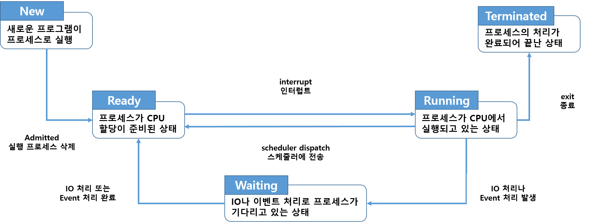

# 유닉스와 리눅스
## 운영체제(OS, Operating System)
- 운영체제 : 컴퓨터의 하드웨어와 소프트웨어 제어 및 사용자가 컴퓨터를 사용할 수 있게 해주는 프로그램
- 기능
  - 하드웨어와 응용프로그램 간의 인터페이스 역할
  - CPU, 주기억장치, 입출력장치 등 컴퓨터 자원 관리
  - 인간과 컴퓨터 간의 상호작용을 제공함과 동시에 컴퓨터의 동작 구동(Booting)
  - 작업의 순서를 정하며 입출력 연산 제어
  - 프로그램의 실행 제어
  - 데이터와 파일의 저장 및 관리

<hr>
<br>

## 유닉스와 리눅스 비교
- `유닉스` : 중형 및 대형 서버시스템에서 가장 많이 사용되는 OS, 고성능, 고 가용성의 운영체제
  - IBM, HP, SUN 등
- `리눅스` : 리누스 토발즈가 중형 및 대형 기종에서만 작동하던 유닉스 운영체제를 PC에서도 작동하게 만든 것
  - 프로그램 소스 코드를 무료로 공개하여 사용자가 원하는 기능 추가 가능
  - 어느 플랫폼에도 포팅(Forting) 가능
  - 개인용PC, 기업의 중형 및 대형 컴퓨터, 임베디드 기기, 모바일 기기에도 리눅스 사용

<hr>
<br>

## 커널, 쉘, 유틸리티
- `커널(Kernel)`
  - 사용자가 작동시키는 어플리케이션과 하드웨어 사이에서의 조정자 역할을 담당
  - 컴퓨터 운영체제의 핵심이며 하드웨어 진화에 같이 진화함

- `쉘(Shell)`
  - 커널과 사용자 간의 인터페이스
  - 명령어를 해석하고 명령과 관련된 유틸리티나 커널을 호출하고 실행결과를 출력
  - Dos의 Command.com과 같이 기본 제공 OS 명령어를 수행하는 곳
  - 윈도우에서 탐색기의 왼쪽 마우스 메뉴의 압축 기능과 같은 기본 명령

- `유틸리티(Utility)`
  - 사용자가 시스템을 편하게 사용하기 위한 응용 프로그램
  - 사용자 입장에서는 Shell과 유틸리티의 구분이 필요하지 않음
  - dir, ping, type, 좀 더 편리하게 사용하기 위해 만들어 제공하는 명령 시스템
  - 윈도우에서 알집 등 좀 더 편리하게 만든 압축 프로그램을 사용하는 명령

<hr>
<br>

# 가상터미널
- `콘솔(Console)` : 리눅스 서버에 직접 연결된 화면(모니터)
  - 원격지에서 서버로 접속하는 대표적인 방법 : `telnet`, `ssh`

- `가상 터미널` : 전용 서버를 사용하기 위한 원격지 프로그램
  - telnet : 서버의 네트워크를 통해 원격으로 접속하는 프로토콜
  - ssh : telnet과 동일하나 보안이 강화된 방식으로 접속하는 프로토콜

<!-- TODO -->
- `가상 머신(Virtual Machine)`

- `NAT(Network Address Trans)`
  - 사설 IP주소를 공인 IP주소로 바꿔주는데 사용하는 통신망의 주소 변환법
  - 가상 머신이 실행될 때마다 해당 PC의 IP주소 체계와 별도로 가상의 IP를 자동으로 배정함

<hr>
<br>

# 사용자 등록, 패스워드 설정
## 관리자(root)와 일반 사용자
- 관리자 : 시스템 관리자가 시스템 제어를 위해 특별히 권한을 가지고 있는 사용자 계정
  - 운영체제에서 슈퍼 사용자, 운용 관리자 또는 루트(root)를 일컬음

- 일반 사용자 : 운영체제를 사용하는 사용자

<hr>
<br>

## 사용자(User)와 그룹(Group)
- 유닉스와 리눅스 시스템은 여러 사람이 사용하는 `다중 사용자 운영체제`임

- 여러 사용자를 묶는 그룹 개념이 존재
  - `root`라는 사용자는 관리자 권한을 가진 사용자
  - `tester`라는 임의의 사용자를 관리자 그룹(root 그룹)에 포함시키면 root 권한 사용 가능
  - `tester1`이라는 사용자를 만들면 해당 사용자는 기본적으로 `tester1 그룹`의 `tester1` 사용자로 생성
  - tester1 사용자와 동일한 권한을 부여하고 싶다면 tester2 사용자를 만들고 tester1 그룹에 포함시키면 됨

- 사용자는 여러 개의 그룹에 포함될 수 있음

<hr>
<br>

## 사용자 및 그룹 관리
- 사용자 또는 그룹 등록
  - `adduser [userId]` : userId라는 사용자 생성
    - **사용자를 생성할 수 있는 권한을 가진 건 root 계정**
  - `addgroup [userId]` root : userId라는 사용자를 root 그룹에 포함

- 사용자 또는 그룹 삭제
  - `deluser [userId]` : userId라는 사용자 삭제
  - `delgroup [userId]` : userId라는 그룹 삭제

- 자기 권한에 맞는 사용자만 등록 및 삭제 가능
  - root 계정으로 모든 사용자를 등록하거나 삭제할 수 있음

- 패스워드 설정
  - passwd 명령어를 사용하여 화면 지시에 따라 새로운 패스워드 입력
  - 권한에 따라 패스워드 설정 가능
    - 일반 사용자의 패스워드를 잊어버려도 root 권한을 가진 계정으로 접속하여 변경 가능
    - *root 계정의 패스워드를 잊어버리면 시스템 접근이 불가능하므로 유의할 것*

<hr>
<br>

<!-- TODO -->
# 권한 획득, 명령어 메뉴얼
- 권한 획득 방법
  - 다른 사용자로 재 로그인

  - 다른 사용자의 권한을 얻어오기
    - `sudo` : 쉘 명령어 라인에서 root의 권한을 잠시 사용
      - sudo 등록이 되어 있는 경우에만 가능
    
    - `su -userId` : 다른 사용자의 권한 사용
      - `su -` 명령은 `su -root` 와 동일

- 명령어 메뉴얼
  - `man` 명령어
    - `man adduser` : adduser라는 명령어에 대한 설명 출력
    - 리눅스 유닉스 명령은 쉘 상태에서 영문약자 형식으로 되어 있으므로 인자(argument), 옵션 등을 알고자 할 때 유용함

<hr>
<br>

# 리눅스 파일 기본사항
> 윈도우 OS의 `파일(File)`을 `폴더(Folder)`에 모아두는 개념과 마찬가지
>> 유닉스와 리눅스에서는 `디렉토리(Directory)`와 `파일(File)`의 개념을 사용

## 디렉토리, 절대/상대경로
- 디렉토리의 위치는 `절대경로`와 `상대경로`로 표시

- 최상위 경로는 역슬래쉬 `/` 로 `루트 디렉토리(root directory)`라고 읽음

- 절대경로 : 루트(root) 디렉토리부터 현재 파일이 위치한 디렉토리의 경로를 전체로 표기한 경로
  - ex) /home/tester1/test/help.txt

- 상대경로
  - 명령어 쉘 상태에서 현재 위치로부터 파일이 있는 디렉토리를 표기한 경로
  - 현재 위치를 점으로 나타내어 표기
  - 현재 위치는 점 한개 `.`, 하위 디렉토리는 점 두개 `..`로 표시
  
  - ex) 현재 위치가 /home/tester1 이라면
    - ./test/help.txt -> /home/tester1/test/help.txt
    - ../../home/tester1/test/help.txt -> /home/tester1/test/help.txt

<hr>
<br>

# 파일과 디렉토리
## 파일 탐색
- `pwd` :  현재 작업 디렉토리의 절대경로 출력

- `cd` : 작업 디렉토리 이동

- `ls` : 디렉토리에 파일 목록을 보여줌

<hr>
<br>

## 파일 내용 보기
- `cat [fileName]` : 파일 내용 전체를 한 번에 출력

- `[more]`
  - `파이프 필터(|)`를 같이 사용하여 화면 단위로 출력
  - ex) `cat [fileName] | more`

- `page [fileName]` : 화면 단위로 출력

- `head-n [fileName]` : 파일 내용의 처음으로부터 n줄 표시

- `tail-n [fileName]` : 파일 내용의 마지막으로부터 n줄 표시

- `tail-f [fileName]` 수정 중인 파일 내용의 마지막을 계속적으로 표시

<hr>
<br>

## 파일 다루기
- 파일 이동
  - `mv [oldFileName] [newFileName]` : 파일명을 [oldFileName에서] [newFileName으로] 변경

  - `mv [fileName] [dirName]` : 파일을 해당 디렉토리로 이동

  - `mv [oldDirName] [newDirName]` : 디렉토리명을 oldDirName에서 newDirName으로 변경

- 파일 복사
  - `cp [fileName] {path/} [newFileName]` : 해당 위치로 파일이름을 변경하여 복사

  - `cp [fileName] {path/}` : 해당 위치에 파일명 변경없이 복사

  - `cp [dirName] [newDirName]` : 해당 디렉토리(하위 포함)를 새로운 디렉토리명으로 복사

<hr>
<br>

## 명령어 히스토리
- `r 또는 !` : `!c` 라고 입력하면 최근 사용 명령어 중 c로 시작하는 것을 자동 실행

- `↑ 또는 ↓(방향키 위 아래)` : 사용했던 명령어를 순차적으로 표시

- `history` : 사용했던 모든 명령어 표시

<hr>
<br>

## 명령어 히스토리 파일
- 리눅스에서 사용한 명령어는 해당 사용자의 기본 디렉토리에 저장된다. 파일명은 아래와 같다.
  - `.bash_history`(리눅스 bash)
  - `.history`(일반 유닉스)

<hr>
<br>

## 디렉토리 관리
- `mkdir [dirName]` : 디렉토리 생성

- `rmdir [dirName]` : 디렉토리 삭제
  - 디렉토리 하위에 파일이 존재하면 삭제 불가

<hr>
<br>

## 파일의 문자 수 세기
- `wc [fileName]` : 파일의 `줄 수`, `단어 수`, `글자 수` 출력

<hr>
<br>

# 파일 필터
## 파이프(|)와 grep 명령
- `파이프 필터(|)`와 `grep` 명령어를 이용해 파일에 지정된 패턴을 검색

- grep(Globally find Regular-Expression and Print) 사용 형식
  - `grep [pattern] [fileName]` : 파일명 또는 확장파일명으로 검색
  - `| grep [pattern]` : 필터로 검색

    |pattern|설명|
    |-------|----|
    |`-w`| 전체 단어가 일치되는 경우 출력|
    |`-n`|라인넘버 출력|
    |`-v`|단어가 일치하지 않는 경우 출력|
    |`-l`|해당되는 파일명을 출력|

<hr>
<br>

## 리다이렉션(Redirection))
- 표준 출력
  - `[명령] > [fileName]` : 명령의 결과를 파일을 생성하여 기록
    - `cat xinetd.conf > a.file`

  - `[명령] >> [fileName]` : 명령의 결과를 파일의 마지막 내용에 계속 추가
    - `cat xinetd.conf >> a.file`

- 표준 입력
  - `[명령] < [fileName]` : 파일의 데이터를 명령에 입력

- 기타
  - `[명령] >& [fileName]` : 명령이 실행된 표준 출력의 결과와 에러를 파일로 출력
  
  - `[명령] >>& [fileName]` : 명령이 실행된 표준 출력의 결과와 에러를 파일로 덧붙여 출력
  
  - `[명령] >! [fileName]` : 파일의 존재 유무와 상관없이 생성하고 명령이 실행된 표준 출력의 결과를 파일로 출력
  
  - `[명령] >&! [fileName]` : 파일의 존재 유무와 상관없이 생성하고 명령이 실행된 표준 출력의 결과와 에러를 파일로 출력
  
  - `[명령] >>! [fileName]` : 파일의 존재 유무와 상관없이 생성하고 파일에 덧붙여 출력
  
  - `[명령] >>&! [fileName]` : 파일의 존재 유무와 상관없이 생성하고 명령이 실행된 표준 출력의 결과와 에러를 파일에 덧붙여 출력
  
  - `[명령1] | [명령2]` : 명령1의 출력을 명령B로 입력하여 실행

  - `[명령1] |& [명령2]` : 명령1의 출력과 에러를 명령2의 입력으로 사용하여 실행

- 파일 디스크립터
  - 표준 입력과 출력, 에러를 쉘이나 시스템 프로그래밍에서 숫자로 표현할 수 있다.

    |구분|장치|파일 디스크립터|
    |----|----|---------------|
    |표준 입력|키보드|`0`|
    |표준 출력|모니터|`1`|
    |표준 에러|모니터|`2`|

<hr>
<br>

# 파일 비교 / 정렬 / 탐색
- 파일 비교
  - `cmp [fileName1] [fileName2]` : 두 파일을 비교한다.
    - 같으면 exit code=0 반환
    - 다르면 exit code=1 반환, 일치하지 않는 첫번째 byte 출력

  - `diff [fileName1] [fileName2]` : 두 파일의 차이를 보여주며 프로그램 소스 등을 비교할 때 사용한다.

- 파일 정렬
  - `sort [fileName] [opt]` : 파일 내용을 정렬 조건에 따라 정렬

- 파일 탐색
  - `find [dirName] [opt] [exec]` : 특정 조건에 맞는 파일을 찾아 원하는 동작 실행
  - 조건문
    |조건문|설명|
    |------|----|
    |-name|파일의 이름 패턴|
    |-user|파일의 소유 유저명|
    |-group|파일의 소유 그룹명|
    |-type|파일의 유형|
    |-perm|파일의 권한|
    |-mtime|최근에 수정한 파일|
    |-atime|최근에 접근한 파일|
    
  - 실행문
    |실행문|설명|
    |------|----|
    |-print|파일명 출력|
    |-ls|ls 수행|
    |-exec|명령어 수행|

  - 예시
    - `find . -name '*.c' -print`
    - `find . -mtime 14 -print`
    - `find . \(-name '*.c' -o -name '*.txt'\) -print`
    - `find / | grep abc`
    - `find / -name abc`

<hr>
<br>

# 파일 보관 / 압축
## 파일 묶어서 보관
- 파일을 묶을 때
  - `tar -cvf tarFileName fileList`

    |구분|설명|
    |----|----|
    |-c|fileList에 대한 tar 형식의 백업 파일 생성|
    |-v|진행 상황 출력|
    |-f|tar 형식의 백업 파일 이름 지정<br>(default : /dev/rmt/0 ... tape drive)|

- 파일을 풀 때
  - `tar -txru tarFileName fileList`

    |구분|설명|
    |----|----|
    |-t|tar 형식의 백업 파일 안에 어떤 것들이 들어 있는지 목차만 표시|
    |-x|백업 파일로부터 파일을 추출 및 복귀(extract)|
    |-r|fileList를 기존의 백업 파일 뒤에 무조건 덧붙임(rear)|
    |-u|기존의 백업 파일에 이미 포함되어 있는 fileList 중 수정된 파일들만 백업 파일의 뒤에 덧붙임<br>디렉토리가 있어도 recursive하게 적용|

- tar 명령은 CD / TAPE 드라이브에 저장 및 복원 시 많이 사용
  - `tar -cvf tarFile /dev/rmt0`
  - `tar -xvf /dev/rmt0`

<hr>
<br>

## 파일 압축 및 풀기
- 압축 파일 생성
  - `compress fileName`
  - `compress *.txt`

- 압축된 파일을 해제하여 복원 파일 생성
  - `uncompress fileName.z`
  - `uncompress *.z`

<hr>
<br>

## 파일 묶음과 압축 시행
- 파일을 묶고 압축하는 유틸리티
  - `apt-get install ncompress`로 유틸리티 설치 후 사용
  - gzip : 파일을 압축하여 묶음

    |구분|설명|
    |----|----|
    |-d|압축 해제|
    |-l|현재 압축된 파일의 내용을 표시|
    |-r|현재 디렉토리부터 하위 디렉토리까지 전부 압축|
    |-t|압축된 파일의 무결성 검사|
    |-v|압축 진행 상황 출력|
    |-9|최대한 압축|

  - gunzip : 압축된 파일을 해제하여 복원함 *(gzip-d와 동일)*

<hr>
<br>

# 사용자 및 그룹 관리
## 사용자, 그룹, 권한 관리
> 유닉스와 리눅스는 다중 사용자 운영체제로 그룹이라는 개념이 존재
> - 사용자는 여러 그룹에 포함될 수 있음

- 명령어

  |구분|설명|
  |----|----|
  |[id], [groups]|현재의 사용자와 그룹을 알아보는 명령|
  |[adduser], [addgroup]|사용자 등록, 그룹 등록|
  |[deluser], [delgroup]|사용자 삭제, 그룹 삭제|

  - 사용자와 그룹은 시스템 내부에서 숫자로 표시
    - uid : 사용자 표시 숫자
    - gid : 그룹 표시 숫자

<hr>
<br>

## 그룹 관리 명령어
- 그룹 조회
  - 자신이 속한 그룹 보기 : `groups`, `id`
  - 전체 그룹 보기 : `cat /etc/group`

- 그룹 생성
  - groupName이라는 이름의 그룹을 gid 900으로 생성 : `groupadd -g 900 groupName`

- 그룹 변경
  - groupName이라는 그룹의 gid를 700번으로 변경 : `groupmod -g 700 groupName`
  - groupName이라는 그룹의 이름을 newGroupNm으로 변경 : `groupmod -n newGroupNm groupName`

- 그룹 삭제
  - newGroupNm이라는 그룹을 삭제 : `groupdel newGroupNm`

<hr>
<br>

## 패스워드, 그룹 관련 설정 파일
- `/etc/passwd` 파일
  - 사용자의 정보(user, password, uid, pid) 기록
  - 해당 파일의 수정, 삭제 등으로 사용자 관련 설정 변경 가능

- `/etc/group` 파일
  - 그룹의 정보 기록
  - 해당 파일의 수정, 삭제 등으로 그룹 관련 설정 변경 가능

- `/etc/shadows` 파일
  - /etc/passwd 파일과 함께 사용자 패스워드 저장
  - 패스워드는 암호화 되어 함부로 변경 할 수 없음
  - 해당 파일에서 패스워드 필드를 고치면 오류가 발생

- passwd 파일의 구성
  - `username:password:uid:gid:gecos:homedir:shell`

    |구분|설명|
    |----|----|
    |username|사용자 이름|
    |password|사용자 암호|
    |uid, gid|사용자 아이디, 그룹 아이디|
    |gecos|General Electric Comprehensive Operation System<br>구 유닉스 서비스와 호환성을 갖추기 위해 만든 필드<br>처음 입력한 사용자 정보가 저장|
    |homedir|해당 사용자의 기본 디렉토리|
    |shell|해당 사용자가 사용하는 유닉스 shell의 종류|

<hr>
<br>

# 권한의 이해 및 표기
## 파일이나 디렉토리 소유자
- `chown`
  - 파일 또는 디렉토리의 소유 사용자를 변경
  - a 파일을 chgUser라는 사용자의 소유로 변경 : `chown chgUser a`

- `chgrp`
  - 파일 또는 디렉토리의 소유 그룹을 변경
  - a 파일을 chgGroup라는 그룹의 소유로 변경 : `chgrp chgGroup a`

<hr>
<br>

## 권한의 이해
- 유닉스와 리눅스 3단계 권한
  - 읽기 권한 : 파일 조회 가능
    - 읽기 권한만 보유 시 조회만 가능, 수정 불가능
  - 쓰기 권한 : 파일 수정 및 삭제 가능
  - 실행 권한 : 파일 실행 가능
    - 실행 파일의 실행 권한이 없다면 실행 불가능

- 권한 부여는 소유자(user), 그룹(group), 다른 사용자(other)에 대해 부여
  - `ls -al` 명령어로 파일/디렉토리의 권한 확인 가능
  - `drwxr--r--(1, 3, 3, 3)`
    - 10개의 문자로 나누어 확인
    - 처음 비트는 파일이면 `-`, 디렉토리라면 `d`로 표시
    - 다음 세 자리 : 소유자(user)의 허가권
    - 다음 세 자리 : 그룹의 허가권
    - 다음 세 자리 : 소유자도 그룹도 아닌 자(other)의 허가권
  - 권한의 설명

    |구분|설명|
    |----|----|
    |d 또는 -|파일 종류나 디렉토리임을 표시|
    |r 또는 -|사용자의 읽기 권한|
    |w 또는 -|사용자의 쓰기 권한|
    |x 또는 -|사용자의 실행 권한|
    |r 또는 -|그룹의 읽기 권한|
    |w 또는 -|그룹의 쓰기 권한|
    |x 또는 -|그룹의 실행 권한|
    |r 또는 -|타 사용자의 읽기 권한|
    |w 또는 -|타 사용자의 쓰기 권한|
    |x 또는 -|타 사용자의 실행 권한|

<hr>
<br>

## 권한의 숫자 표기법
- 파일 속성
  - 소유자(user)
    - 읽기 : r(4)
    - 쓰기 : w(2)
    - 실행 : x(1)
  - 그룹(group)
    - 읽기 : r(4)
    - 쓰기 : w(2)
    - 실행 : x(1)
  - 타 사용자(other)
    - 읽기 : r(4)
    - 쓰기 : w(2)
    - 실행 : x(1)

- 사용자가 rx의 권한, 그룹이 wx의 권한, 타 사용자가 아무 권한을 가지지 않을 때
  - 사용자 : r(4) + x(1) = 5
  - 그룹 : w(2) + x(1) = 3
  - 타 사용자 : 0
  - 해당 파일은 530의 권한을 가짐

<hr>
<br>

# 권한 설정
## 상대모드
- `chmod`
  - 권한 설정을 변경

    |연산자|의미|엑세스 구분|의미|
    |------|----|-----------|----|
    |+|권한 부여|u|사용자|
    |-|권한 제거|g|해당 그룹의 멤버|
    |=|권한 유지|o|타 사용자|
    |$|사용자와 그룹만 실행|a|사용자, 그룹, 타 사용자 모두 권한 부여|

    - a 파일에 그룹의 쓰기 권한 제거 : `chmod g-w a`
    - a 파일에 그룹의 읽기/쓰기/권한 부여 : `chmod g+rw a`
    - a 파일에 모든 실행 권한 부여 : `chmod a+x a`
    - a 파일에 타 사용자의 읽기/쓰기/실행 권한을 제거 : `chmod o-rwx a`

<hr>
<br>

## 절대모드
- 숫자 표기 방법으로 권한 부여

- 파일 속성
  - 소유자(user)
    - 읽기 : r(4)
    - 쓰기 : w(2)
    - 실행 : x(1)
  - 그룹(group)
    - 읽기 : r(4)
    - 쓰기 : w(2)
    - 실행 : x(1)
  - 타 사용자(other)
    - 읽기 : r(4)
    - 쓰기 : w(2)
    - 실행 : x(1)

- 앞서 언급한 권한의 숫자 표기법 참고
  - 530 권한을 a 파일에 부여한다면 `chmod 530 a` 실행

<hr>
<br>

# 링크파일
## 하드 링크(Hard Link)
- 개요
  - 하드링크의 두 파일명은 같은 디스크에 위치한 같은 데이터를 가리킴
  - 하드링크는 원본 파일과 완전히 동일하고, 부가적인 디스크 공간을 차지하지 않음
  - 하드링크 파일은 원본과 동일하기 때문에 하드링크 파일을 지우면 원본도 삭제됨

- 명령어
  - 하드링크 실행 : `ln targetA targetB`
  - 파일 상태 확인 : `stat targetB`

<hr>
<br>

## 심볼릭 링크(Symbolic Link)
- 개요
  - 윈도우 바로가기 아이콘과 같이 특정 파일이나 디렉토리를 연결해주는 빈 크기의 파일
  - 해당 심볼릭 링크파일을 지운다고 원본 파일이 지워지지는 않음

- 명령어
  - 심볼릭 링크 실행 : `ln -s  targetA targetB`
  - 파일 상태 확인 : `stat targetB`

<hr>
<br>

# vi 편집기 명령어
## 기본
- 편집기
  - 파일의 조회, 수정, 작성을 위한 프로그램으로 윈도우에서 메모장과 같은 기능
  - 기본 쉘 상태에서의 편집기 실행 : `vi fileName`

- vi 편집기의 세 가지 모드
  - 입력모드 : 텍스트를 입력하는 상태

    |명령어|기능|
    |------|----|
    |`ESC, Ctrl, [`|명령모드로 전환|


  - 명령모드 : 간단한 키 명령을 입력하는 상태

    |명령어|기능|
    |------|----|
    |방향 이동|화살표 키|
    |페이지 이동|Ctrl + u, Ctrl + f|
    |`a`|(append) 현재 문자 뒤부터 입력 -> 입력모드로 전환|
    |`i`|(insert) 현재 문자 앞부터 입력 -> 입력모드로 전환|
    |`o`|현재 줄 아래 한 줄 삽입 -> 입력모드로 전환|
    |`:`|마지막 행 모드로 전환|

  - 마지막 행 명령모드 : 화면의 마지막 행에서 명령을 입력하는 모드(하단에 `:` 출력)

    |명령어|기능|
    |------|----|
    |`:q`|vi 편집기 종료|
    |`:wq`|변경 내용을 저장하고 vi 편집기 종료|
    |`:e`|입력모드로 전환|

<hr>
<br>

## vi 명령어
- 명령 모드에서 사용되는 키

  |키|내용|
  |--|----|
  |h|<-(방향키 왼쪽)|
  |k|방향키 위쪽|
  |l|->(방향키 오른쪽)|
  |j|방향키 아래쪽|
  |^b|한 페이지 위로 이동|
  |e|한 단어 뒤로 이동|
  |^f|한 페이지 아래로 이동|
  |b|한 단어 앞으로 이동|
  |$|해당 라인 맨 끝으로 이동|
  |^u|반 페이지 위로 이동|
  |x|현재 커서 문자 삭제(del)|
  |^d|반 페이지 아래로 이동|
  |dd|커서가 위치한 라인 삭제|
  |0|해당 라인 맨 앞으로 이동|
  |yy|현재 라인을 yank(copy)함|
  |X|현재 커서 앞 문자 삭제(Backspace)|
  |p|카피한 라인을 커서가 있는 라인 아래에 붙임(Paste)|
  |dw|한 단어 삭제|
  |cw|한 단어를 바꿈|
  |r|커서가 위치한 글자를 바꿈|

- 명령 모드에서 편집기로 전환하는 키

  |키|내용|
  |--|----|
  |a|커서의 오른쪽에서 입력|
  |o|현재 라인 아래 빈 라인을 추가하여 입력|
  |i|커서의 왼쪽에서 입력|
  |A|라인의 마지막에서 입력|
  |O|현재 라인 위에서 빈 라인을 추가하여 입력|

- 마지막 행 명령 모드의 키

  |키|내용|
  |--|----|
  |:q!|변경 내용을 저장하지 않고 vi 편집기 종료|
  |:w|문서의 저장|
  |:x|문서 저장 후 vi 편집기 종료(명령모드에서 zz, :wq와 같음)|
  |:e!|변경한 내용을 undo하여 원본으로 회귀|

<hr>
<br>

# vi 편집기 활용
## 파일 내 단어 검색
- 마지막 행 명령모드에서 실행
  - name이라는 단어를 위에서 아래로 찾기 : `/name`
  - name이라는 단어를 아래에서 위로 찾기 : `?name`
  - 한 번 검색 후 다음으로 동일한 검색어 찾기 : `n`
  - 한 번 검색 후 이전으로 동일한 검색어 찾기 : `N`

<hr>
<br>

## 정규식을 이용한 문자열 변경
- 마지막 행 명령모드에서 실행
  - `s/교체될 문자열/교체할 문자열/`
    - name이라는 문자열을 admin으로 변경 : `s/name/admin/`

<hr>
<br>

## 유용한 사용법
- 여러 파일을 동시 편집
  - `vi fileName1 fileName2 fileName3`
  - `vi *.conf`
  - vi 편집기에서 마지막 행 명령모드에서 n(다음파일), e#(이전파일)를 입력하여 돌아갈 수 있음

- 마지막 행 명령모드에서의 기타 명령
  - 현재 파일에서 다른 파일을 열고 n 키로 다시 돌아가기 : `e fileName`
  - 현재 파일명 등의 상황 확인 : `f` 또는 `Ctrl + g`

- 현재 파일을 다른 이름으로 저장
  - `w newFileName`
  - 3 ~ 6라인 내용만 저장 : `3, 6 w newFileName`
  - 현재 파일 백업 : `w %.bak`

- vi 편집기에서 쉘 모드 열기
  - 마지막 행 명령모드에서 `!` 다음에 쉘 명령어를 사용하면 해당 쉘 명령어를 실행한 후 vi 편집기로 복귀

<hr>
<br>

# 프로세스, 데몬
## 프로세스와 데몬
> 프로세스(Process) : 실행 중인 프로그램
> - 프로세스 명, 프로세스 번호(Process Id, PID), 부모 프로세스, 자식 프로세스

> 데몬(Daemon) : 주기적인 서비스 요청을 처리하기 위해 계속 실행되는 프로그램

- 프로세스 스케쥴링

<div align=center>



</div>

- 프로세스 개념
  - 프로세스가 실행 중에 자신에게 종속적인 프로세스를 두어 보조 업무를 처리
    - 부모 프로세스, 자식 프로세스라고 부름
  - 윈도우에서도 작업관리자를 통해 프로세스의 실행 상황을 볼 수 있음

<hr>
<br>

## 프로세스 조회
- 명령어
  - 프로세스들은 파일로 상태를 표현
    - 위치 : `/proc/프로세스명`
  - cpu 상태 확인 : `/proc/cpuinfo`
  - 프로세스 조회 명령어 : `ps [option]`
    - 전체 사용자의 모든 프로세스 출력 : `a`
    - 명령문 실행 후, 프로세스 환경 변수 출력 : `e`
    - 자세히 출력 : `i`
    - 사용자 이름과 프로세스 시작 시간을 출력 : `u`
    - 출력 결과가 한 줄이 넘어도 모두 출력 : `w`
    - 제어하는 터미널이 없는 프로세스 출력 : `x`

- 프로세스 조회 명령어 출력 필드
  - 프로세스 상태 필드

    |구분|설명|
    |----|----|
    |R|Ready, 실행 대기|
    |S|Sleep, 잠든 상태|
    |D|DeadLock, 입출력을 기다리는 인터럽트가 불가능한 상태|
    |T|Terminated, 멈춰있거나 흔적이 남아있는 상태|
    |Z|Zombie, 완전히 죽어있는 상태|

  - 옵션 필드

    |구분|설명|
    |----|----|
    |USER|프로세스 소유자의 계정 이름|
    |PPID|부모 프로세스의 PID|
    |%CPU|프로세스의 CPU 사용량|
    |%MEM|프로세스가 사용하는 시스템 메모리 자원량|
    |VSZ|가상 메모리|
    |RSS|사용된 실제 메모리|
    |TIME|총 CPU 사용시간|
    |CMD|실행된 프로세스 명령어|

<hr>
<br>

## 프로세스 관련 시스템 현황 조회
- 명령어
  - 트리구조로 시스템 프로세스를 출력 : `pstree`
  - 프로세스들의 실시간 구동 상황을 출력 : `top`
  - 프로세스 자원한도를 출력 : `ulimit -a`
  - CPU 활동 상황 출력 : `vmstat`

<hr>
<br>

# foreground, background
## foreground, background 개요
- foreground
  - 프로세스, 프로그램이 쉘 화면에서 실행되어 쉘 명령을 사용할 수 없음

- background
  - 백그라운드로 프로세스를 실행하여 쉘 명령을 사용할 수 있음
  - 실행할 프로그램 뒤에 `&`를 붙여 실행

<hr>
<br>

## 실행 제어
- 명령어
  - 실행되는 작업 확인 : `jobs` 또는 `ps`
  - foreground, background 전환 : `fg % 작업번호` 또는 `bg % 작업번호`
  - 프로세스 강제 종료 : `kill %` 또는 `kill PID`

<hr>
<br>

# 프로세스 스케쥴러
## crontab
> 서버 내의 특정 프로세스를 주기적으로 실행할 때 사용

- crontab의 편집 및 관리
  - 예약된 작업 리스트 출력 : `crontab -l`
  - 예약된 작업 수정 : `crontab -e`

    |분|시|일|월|요일|
    |--|--|--|--|----|
    |0~59|0~23|1~31|1~12|1~7(월~일)|

  - 예약된 작업 삭제 : `crontab -r`

- 필드 다중 설정방법

  |구분|표현식|내용|
  |----|------|----|
  |여러 값|`10,30,50****`|매 10,30,50분마다 실행|
  |범위 값|`01-3***`|매일 1~3시에 실행|
  |시간 간격|`1*/5***`|매일 5시간 간격으로 실행|
  |모든 값|`*****`|매 분마다 실행|

  - 사용방법
    - 매주 일요일마다 excute.sh를 실행 : `****7 ./excute.sh`
    - 매일 5시간 간격으로 excute.sh를 실행 : `1*/5*** ./excute.sh`

<hr>
<br>

## 시작프로그램 역할
- inittab
  - 기존 : `/etc/inittab` 설정 파일에 부팅 이후 자동 실행 프로그램을 등록하여 사용
  - 최근 : `/etc/event.d`의 sh 파일이 inittab의 역할 담당
  - 현재 : `/etc/rc.local` 파일 맨 마지막 행에 부팅 이후 자동 실행 프로그램을 등록하여 사용
    - 마지막 행에 강제 종료 명령어 `exit 0`이 있으므로 마지막 행 위에 구동할 프로세스 등록

<hr>
<br>

# 쉘 명령어
## 쉘
- 개요
  - 커널과 사용자간의 인터페이스로서 중간매개의 역할
  - 명령어를 해석하고 명령과 관련된 유틸리티나 커널을 호출하여 실행 결과를 출력
  - Dos의 command.com과 같이 기본 OS 명령어 수행
  - 최초 유닉스에서는 ksh(콘쉘), 이후 발전된 csh(씨쉘) 등이 사용되었으나, 리눅스에서는 bash(배쉘)이 많이 사용
  - bash 명령어의 문법은 거의 대부분의 sh(쉘)과 호환

- 쉘 스크립트, 쉘 프로그램
  - 하나의 쉘 명령어를 여러 개 묶어서 실행 가능
  - 쉘 명령어를 나열하여 text file로 기록하여 이를 실행하는 묶음 명령어

- 쉘 스크립트의 장점
  - 타 프로그래밍 언어에 비해 실행속도가 빠름
  - 컴파일 과정이 필요 없이 빠르게 실행 가능
  - 시스템 운영이나 유지/보수 때 사용하기 용이

- 쉘 스크립트의 제한 사항
  - 다중 산술 작업이나 복잡한 정보 처리에 사용하거나 유닉스, 리눅스 이외 다른 운영체계에 이식은 어려움

<hr>
<br>

## 쉘 스크립트 실행
- 명령어를 묶어서 실행하기
  - 여러 명령어를 한 번에 실행하기 위해 ;(세미콜론) 사용
  - home 디렉토리로 이동한 후 ls 명령어 실행하기 : `pwd;cd /home;ls -l;pwd`

- 쉘 스크립트 파일을 작성 후 실행하기
  - vi 편집기 등으로 실행할 명령어를 작성하여 저장
  - 작성한 파일명으로 명령 실행
  - 쉘 스크립트 파일 실행 시 리눅스의 권한과 파일의 경로를 고려할 것

- 권한
  - 쉘 스크립트 파일이 실행 권한을 가져야 함 : `chmod 755 test.sh`
  - 실행 권한 이외의 형식으로 실행 : `sh test.sh`

- 경로
  - 쉘 스크립트 파일 내 모든 명령은 절대 경로로 작성(Full Path)
  - 쉘 스크립트 파일보다 일반 명령어 실행이 우선됨
    - 쉘 스크립트 파일도 경로를 지정 : `./test.sh`
  - 쉘 스크립트 파일에 환경변수를 인지하도록 작성
    - `export PATH="/home/test01/"`
    - `#!/bin/sh`

<hr>
<br>

## 자주 쓰는 쉘 프로그래밍 기법
- 리다이렉션(`>`, redircetion), 파이프(`|`, pipe)

  |명령|설명|
  |----|----|
  |명령 > fileName|어떤 명령의 결과를 파일로 생성하여 기록|
  |명령 >> fileName|어떤 명령의 결과를 파일 뒤에 계속 첨부하여 기록|
  |명령1 | 명령2|어떤 명령의 결과를 받아 다른 명령 실행|

  - 리다이렉션
    - `cat test.conf > fileNm.file`
    - `cat test.conf >> fileNm.file`
    - `cat test.conf|grep port > fileNm.file`
  - 파이프
    - `ps > ps.out, sort ps.out > ps.sort`
    - `ps | sort > ps.sort`
    - `ps | sort > ps.sort, more ps.sort`
    - `ps | sort | more`

- echo
  - 출력에 사용되는 기본 시스템 변수
  - `echo $PATH`
  - `echo "Hello World!"`

- cut
  - 텍스트 파일이나 명령어의 결과 중 필요한 부분을 간단히 추출
  - 옵션 -b : 바이트(byte)
    - 한글은 2바이트가 1글자
  - 옵션 -c : 글자(character)

  |형태|설명|예|
  |----|----|--|
  |NN|자릿수만을 의미|`cut -b3`|
  |N,M,O|N자리와 M자리, O자리를 의미|`cut -5,6,7,8,9`|
  |N-|N자리부터 마지막까지를 의미|`cut -b10-`|
  |N-M|N자리부터 M자리까지를 의미|`cut -b5-10`|
  |-M|처음부터 M자리까지를 의미|`cut -b-10`|

<hr>
<br>

# 변수 조건문
## 변수, 매개변수
- 변수
  - 간단한 데이터로 문자 형태의 변수 등을 저장
  - `변수명 = "값"` 으로 입력하여 `echo $변수명`으로 사용

- 매개변수
  - 실행 명령어 뒤에 공백으로 구분하여 부여하는 값
  - `cp aFileNm bFileNm`  이라면 `cp`는 명령어, `aFileNm`은 첫 번째, `bFileNm`은 두 번째 매개변수
  - `$HOME`, `$PATH` 등의 매개변수 표현도 존재

<hr>
<br>

## 변수 조건문
- `if / elif / fi`
  - if문 다음에 나오는 조건에 따라 elif와 fi 사이의 코드를 실행

<hr>
<br>

# 반복문, 조건문
## 반복문
- `for in(조건)/do/.../done`
  - 조건 내 상황을 하나씩 적용하여 do와 done 사이의 스크립트를 실행
    ```sh
    #!/bin/sh
    for x in 1 2 3 4 5
    do
    echo $x
    done
    exit 0
    ```
    ```sh
    #!/bin/sh
    for file in $(ls *.txt)
    do
    echo $file
    done
    exit 0
    ```

- `while(조건)/do/.../done`
  - 조건 내 상황이 만족되면 계속 do와 done 사이의 스크립트를 실행하며, 그 외 조건이 되는 경우 반복구문에서 탈출
    ```sh
    #!/bin/sh
    echo -n "Please input password : "
    read pawd
    while [$paswd != "1234"]
    do
      echo -n "Please input password : "
      read pawd
    done
    echo "OK"
    exit 0
    ```

- `until(조건)/do/.../done`
  - 조건 내 상황이 만족하지 않으면 계속하여 do와 done 사이의 스크립트를 실행하며 그 외 조건이 만족되는 경우 반복구문에서 탈출
    ```sh
    #!/bin/sh
    pawd="0000"
    until [$pawd = "1234"]
    do
      echo -n "Please input password : "
      read pawd
    done
    echo "OK"
    exit 0
    ```
    ```sh
    #!/bin/sh
    loop=10
    until ["$loop" -eq 0]
    do
      echo "loop $loop"
      loop=$(($loop-1))
    done
    exit 0
    ```

- `break`
  - do/done의 루프를 종료
    ```sh
    #!/bin/sh
    for var in 1 2 3 4 5 6 7 8 9 10 ; do
      echo "var $var"
      if [ $var = "5" ]; then
        echo "break"
        break;
      fi
    done
    exit 0
    ```

<hr>
<br>

## 조건문
> true, false의 조건을 여러 개 나열하여 기능을 작성할 때 사용

- booelan 형태의 AND(&&)와 OR(||)
  ```sh
  #!/bin/sh
  touch file1
  rm -f file2
    if [ -f file1 ] && echo "next1" && [ -f file2 ] && echo "next2"
    # true인 경우 다음 문장 수행
    then
      echo "if-true"
    else
      echo "if-false"
    fi
  exit 0
  ```
  ```sh
  #!/bin/sh
  touch file1
    if [ -f file1 ] || echo "next1" ||  [ -f file2 ] || echo "next2"
    # true인 경우 다음 문장 수행
    then
      echo "if-true"
    else
      echo "if-false"
    fi
  exit0
  ```

<hr>
<br>

# 함수, 다중 조건문
## 함수
> 쉘 프로그램 내에서 실행할 블록을 지정하고 필요하면 호출하여 사용하는 기능
> - 전역변수 : 쉘 전체 프로그램 영역에서 사용되는 변수
> - 지역변수 : 함수 내부에서만 사용되는 변수

- 함수 정의(파일 형식)
  ```sh
  #!/bin/sh
  str="Global Variable"
  foo()
  {
    local str="Local variable"
    echo "call function!"
    echo $str
  }
  echo "start shell-program"
  echo $str
  foo
  echo $str
  str="Global variable"
  echo $str
  foo
  echo $str
  exit 0
  ```

<hr>
<br>

## 다중 조건문
- `case 조건/a)../b)../.../esac`
  ```sh
  #!/bin/sh
  echo "Do you love me?"
  read ans
  case "ans in
    [yY][eE][sS] ) echo Thank you. ;;
    [nN]*) echo oh, so sad... ;;
    *) echo really? ;;
  esac
  exit 0
  ```
  ```sh
  #!/bin/sh
  echo "test"
  read ans
  case $ans in
    [1]) echo "case 1"; echo "case 1-2"; echo "case1-3";;
    [2]) echo "case 2";;
    *) echo "case 3";;
  esac
  exit 0
  ```
  - 조건이 A라면 A문장, B라면 B문장 실행
  - 다중 조건문을 간단하게 표현
  - 각 조건의 종료는 `;;`로 표현

<hr>
<br>

# 형식을 주어 출력하기
## printf 사용
- 형식
  - `%s` : 문자 출력
  - `%d` : 숫자 출력
  - `%.5s` : 문자열의 앞 5자리만 출력
  - `\n` : 줄을 바꾸는 `개행문자`

<hr>
<br>

# 주기적으로 처리하기
## while, sleep 활용
- `while :, do, done` : do ~ done 블록을 무한 반복
  - 반복을 중지시키기 위해서는 Ctrl + C 입력

- sleep : 특정한 주기시간을 부여하기 위해 사용

- 사용 방식
  ```sh
  #!/bin/sh
  icnt=0
  while :
  do
    A=`date`
    echo [ $icnt ] "******" $A
    icnt=`expr $icnt + 1`
    sleep 1
  done
  ```

<hr>
<br>

# 시스템 감시
## 특정 프로세스 감시
> ps와 주기처리를 이용해 특정 프로세스를 감시하기

- 예시
  ```sh
  #!/bin/sh
  while :
  do
    ps -ef | grep $1
    echo "================================="
    sleep 1
  done
  exit 0
  ```

<hr>
<br>

## 접속 단말수 세기
- 사용자가 단말에 telnet이나 ssh로 접속하는 경우
  - sshd 또는 bash 프로세스 실행
  - `ps -ef | grep bash` : bash의 감시방법, sshd보다 더 정확하게 계수 가능
    - 자신의 명령어도 체크
    - `wc -l` : 출력된 줄 수 카운트 가능

- 사용자가 웹 서버에 접속하는 경우
  - httpd 혹은 apache2 실행

- 예시
  ```sh
  #!/bin/sh
  while :
  do
    i_bash=`ps -ef | grep bash | wc -l`
    i_bash=`expr $i_bash - l`
    i_http=`ps -ef | grep apache2 | wc -l`
    i_http=`expr $i_http -l`
    echo =============================================
    echo ' CONNECTED USERS : ' $i_bash
    echo ' WEB USERS : ' $i_http
    echo =============================================
    sleep 2
  done
  exit 0
  ```

<hr>
<br>

# 시스템 모니터링
## 크기가 일정 수치 이상인 파일 찾기
- `cut` 명령어를 이용해 출력 줄에서 필요한 부분만 자르는 방법
  ```sh
  #! /bin/sh
  
  ## cut을 이용하여 ls -l /etc/*.conf 출력 및 자르기
  ## 파일 크기 저장
  ls_list=`ls -l /etc/*.conf | cut -c25-29`
  ## 파일 이름 저장
  file_list=`ls -l /etc/*.conf | cut -c43-`
  cnt=0
  for ls_one in $ls_list ;do
    if [ $ls_one -gt 100 ] ; then
      echo -n "OK :"
      fcnt=0
      for filename in $file_list ; do
        if [ $cnt -eq $fcnt ]; then
          printf "file [%s] size[%d]￦n" $filename $ls_one
        fi
        fcnt=$(($fcnt+1))
      done
    fi
    cnt=$(($cnt+1))
  done
  ```

- `awk` 명령어를 이용한 방법
  - 추출 필드를 지정하고 형식을 주어서 출력할 수 있는 awk 명령어를 사용하면 해당 내용이 간단

- 명령어 : `ls -l /etc/*.conf | awk '{ print "size : " $5 " , name : " $9}'`
  - `ls –l /etc/*.conf` : 결과를 awk명령으로 다시 처리
  - `awk '{ print "size : " $5 " , name : " $9}'` : 형식을 지정하여 출력
    - `$5` : `ls –l /etc/*.conf`의 출력 결과를 띄어쓰기(space)를 기준으로 5번째 항목 출력
    - `$9` : `ls –l /etc/*.conf`의 출력 결과를 띄어쓰기(space)를 기준으로 9번째 항목 출력
  - 쉘 파일 작성
    ```sh
    #! /bin/sh
    ls -l /etc/*.conf | awk '{ print "size : " $5 " , name : " $9}' | awk '$3 >= 100 '
    ```

<hr>
<br>

# 시스템 백업 응용
## 파일명을 찾아 날짜 형식의 디렉토리로 백업하기
- `date`를 이용하여 날짜를 디렉토리 명으로 디렉토리 생성
  ```sh
  #! /bin/sh
  d_date=`date +%y%m%d`
  mkdir /home/$d_date
  mkdir /home/$d_date/etc
  for file in $(ls /etc/*.conf)
  do
    dest=`echo /home/$d_date$file`
    echo $file "===>" $dest
    cp $file $dest
  done
  exit 0
  ```

<hr>
<br>

# 네트워크 이론
## TCP/IP 기초
- OSI 7 Layer
  - 국제표준화기구(ISO)가 1977년에 정의한 국제 통신 표준 규약
  - 통신의 접속에서부터 완료까지의 과정을 7단계로 정의

- 계층의 이해
  - 응용 계층 : PC의 인터넷 브라우저를 실행, Telnet, FTP등을 실행하거나 프로그램을 개발
  - 전달 계층 : Windows OS의 TCP커널, 소켓 라이브러리 등이 통신프로그램과 실제 네트워크 부분과 연결
  - 인터넷 계층 : 인터넷IP체계, 라우팅 등은 시스템 하드웨어를 보다 논리적으로 이해하여 사용할 수 있도록 해줌
  - 네트워크 액세스 계층 : UTP케이블 스펙, 랜카드, 라우터, 허브 등 통신을 위한 물리적, 전기적 장비 및 이론 필요

<hr>
<br>

## IP 주소 체계
- 개요
  - 통신을 위한 위치를 알 수 있는 주소
    - 물리적 주소 : 하드웨어의 구분인 Mac Address, Device ID 등
    - 논리적 주소 : IP Address, URL(DNS) 등
    - 내부(서버) 프로토콜 주소 : 프로토콜 체계(TCP/IP, UDP), 포트 번호 등
  
  - `네트워크 식별자`와 `호스트 식별자`로 구성
    - 네트워크 식별자 : 네트워크가 같으면 허브 등으로 단순 연결되거나, 다르다면 라우팅을 통해 접근
    - 호스트 식별자 : 각각의 단말, 서버, 장비, 랜카드별로 유일한 한 개의 IP부여

  - 2진수를 10진법으로 표기하여 사용
  
  - 클래스 구분
    
    |클래스|주소범위|네트워크|단말|넷마스크|
    |------|--------|--------|----|--------|
    |A|1.0.0.0 ~ 127.255.255.255|`*.0.0.0`|`*.0.0.0`|255.0.0.0|
    |B|128.1.0.0 ~ 191.254.255.255|`*.*.0.0`|`*.*.0.0`|255.255.0.0|
    |C|192.0.1.0 ~ 223.255.254.255|`*.*.*.0`|`*.*.*.0`|255.255.255.0|

<hr>
<br>

## TCP/IP 통신흐름
- 장비
  - 허브(HUB, 멀티포트 리피터)
    - 같은 네트워크 내의 전송 자료를 증폭, 재생하고 N/W 규모를 확장
    - 2개 이상의 LAN을 연결하여 거리제한 극복
  - 라우터(Router)
    - 서로 상이한 Network protocol 을 연결
    - 서로 다른 네트워크의 전송속도, 프로토콜, 주소를 상호 변환시켜 호환성 있는 정보 교환
  - 스위치 장비(Switching Device)
    - 브릿지나 라우터 장비기능을 포함한 지능화된 장비
    - OSI7 계층 중 2계층 이상 지원기능 모듈 제공

- IP, netmask, default gateway
  ```예) 192.168.2.1과 192.168.3.1과의 통신```
  - 192.168.2.1은 C클래스의 IP로 앞 세자리 192.168.2.0 네트워크에 해당됨
    - 물론 넷마스크가 특별하게 지정되어 있지 않았다면 (255.255.255.0)의 넷마스크를 가짐
  - 이 IP가 192.168.3.1과 통신하기 위하여는 192.168.3.0이라는 다른 네트워크로 데이터(패킷)을 보내야 함
  - 192.168.2.1은 다른 네트워크로 보내기 위하여 라우팅 경로(디폴트 게이트 웨이 주소)인 192.168.2.255로 데이터를 보냄
  - 보통 이 주소는 해당 네트워크의 라우터와 같은 장비이며, 이 장비에 도착한 데이터(패킷)는 192.168.3.0 네트워크로 보낼 수 있는 경로의 장비로 데이터를 보냄
  - 두 IP는 192.168.2.0이라는 동일한 네트워크임
  - 동일한 네트워크이므로 라우팅 경로를 찾을 필요도 없이 동일한 네트워크 내 허브 등의 장비를 통하여 전기적인 신호를 주고 받을 수 있음
  - 실제로는 하드웨어 주소인 Mac과 서로간 빠른 통신을 위한 ARP cache등을 이용하여 통신함

<hr>
<br>

# 네트워크 환경 설정
## 네트워크 연결 설정
# 네트워크 관리
## ifconfig
## ping
## netstat
# 시스템 부팅
## 시스템 부팅의 전 과정
## run level
# 시동, 초기화, 셧다운
## shutdown
## at 데몬
## cron 데몬
# 시스템 측정 명령
## sar
## top
## fsck, du
## 명령어 총 정리