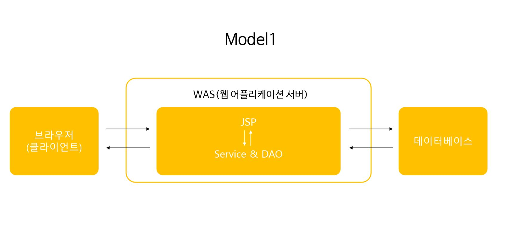
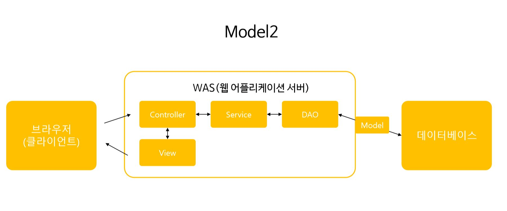

# MVC Pattern

<!-- TOC -->

- [MVC Pattern](#mvc-pattern)
  - [MVC 패턴에 대해 설명하시오.](#mvc-%ED%8C%A8%ED%84%B4%EC%97%90-%EB%8C%80%ED%95%B4-%EC%84%A4%EB%AA%85%ED%95%98%EC%8B%9C%EC%98%A4)
    - [개념](#%EA%B0%9C%EB%85%90)
    - [구성원리](#%EA%B5%AC%EC%84%B1%EC%9B%90%EB%A6%AC)
  - [Model 1과 Model 2의 차이점](#model-1%EA%B3%BC-model-2%EC%9D%98-%EC%B0%A8%EC%9D%B4%EC%A0%90)
    - [Model1](#model1)
    - [Model2](#model2)

<!-- /TOC -->

<br>

## MVC 패턴에 대해 설명하시오.


### 개념
**모델-뷰-컨트롤러(Model–View–Controller, MVC), 소프트웨어 공학에서 사용되는 소프트웨어 디자인 패턴**
- 사용자 인터페이스로부터 비즈니스 로직을 분리하여 애플리케이션의 시각적 요소나 그 이면에서 실행되는 비즈니스 로직을 서로 영향 없이 쉽게 고칠 수 있는 애플리케이션을 만들 수 있다.
- MVC에서 모델은 애플리케이션의 정보(데이터)를 나타내며, 뷰는 텍스트, 체크박스 항목 등과 같은 사용자 인터페이스 요소를 나타내고, 컨트롤러는 데이터와 비즈니스 로직 사이의 상호동작을 관리한다.

<br>

<hr>

### 구성원리
- 컨트롤러는 모델에 명령을 보냄으로써 모델의 상태를 변경할 수 있다.(예: 워드 프로세서에서 문서를 편집하는 것)
  - 컨트롤러가 관련된 뷰에 명령을 보냄으로써 모델의 표시 방법을 바꿀 수 있다. (문서를 스크롤하는 것)
- 모델은 모델의 상태에 변화가 있을 때 컨트롤러와 뷰에 이를 통보한다.
  - 이와 같은 통보를 통해 뷰는 최신의 결과를 보여줄 수 있고, 컨트롤러는 모델의 변화에 따른 적용 가능한 명령을 추가·제거·수정할 수 있다.
  - 어떤 MVC 구현에서는 통보 대신 뷰나 컨트롤러가 직접 모델의 상태를 읽어 오기도 한다.
- 뷰는 사용자가 볼 결과물을 생성하기 위해 모델로부터 정보를 얻어 온다.


<br>

## Model 1과 Model 2의 차이점

### Model1


**모든 클라이언트 요청과 응답을 JSP가 담당하는 구조**

```
JSP 페이지에 비즈니스 로직을 처리하기 위한 코드와 결과 출력을 관리하는 코드가 뒤섞여있다.
JSP 페이지 안에서 모든 정보를 표현(View), 저장(Model), 처리(Controller)된다.
```

> 장점 : 단순한 페이지 작성으로 구현이 쉬워 중소형 프로젝트에 적합하다.
>> 단점 : 재사용이 힘들고 가독성이 떨어지며 코드가 복잡해지면 유지보수가 어렵다.

<br>

<hr>

### Model2


**클라이언트의 요청, 응답, 비즈니스 로직 처리 부분을 모듈화한 구조**

```
클라이언트의 요청을 하나의 Servlet이 받아 알맞게 처리한 후 그 결 과를 JSP 페이지로 전달한다.
```

> 장점 : 처리작업의 분리로 유지보수와 확장이 용이하다.
>> 단점 : 구조 설계를 위한 시간이 많이 소요되므로 개발 시간이 증가한다.
