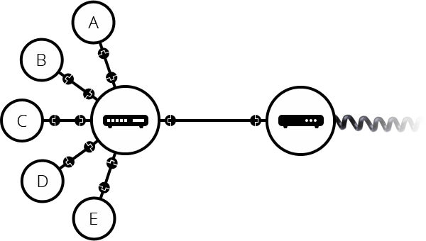
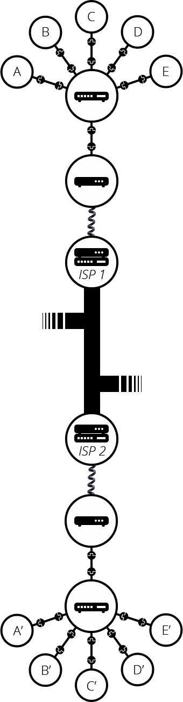

# 프론트엔드 개발상식
> 프론트엔드 개발자 로드맵을 정리해봅시다.

 

  

 

# 인터넷
> 인터넷은 웹의 핵심적인 기술로, 컴퓨터들이 서로 통신 가능한 거대한 네트워크라는 것입니다.

인터넷은 1960년 대 미육군에서 기금한 연구 프로젝트에서 시작되었습니다. 많은 시간이 흘렀지만 작동 방식은 크게 변하지 않았습니다. 인터넷의 존재 의의는, 모든 컴퓨터를 연결하고 어떤 일이 있어도 연결 상태를 유지할 수 있게 하는 것입니다.

## 인터넷은 어떻게 작동되나요?
### 그 전에, 네트워크란 무엇일까요?
두 컴퓨터가 통신할 때, 우리는 다른 컴퓨터와 유선(보통은 Ethernet Cable 이죠), 또는 무선(WiFi 혹은 Bluetooth)으로 연결되어야 합니다.

물론, 이런 통신은 단 두 대로 국한되지 않습니다. 그러나 이런 형태로는 통신을 원하는 컴퓨터가 늘어날 수록 케이블의 수가 기하급수적으로 늘어나게 되죠(여기서는 유선으로 설명하지만, 무선도 동일하긴 합니다).

 

 

이를 해결하기 위해 각 컴퓨터는 라우터(Router)라는 컴퓨터에 연결되고, 라우터는 각 컴퓨터의 통신이 `올바른 대상에게`, `올바로 도착했는지` 점검합니다. 그러면 위 그림처럼 복잡할만큼의 케이블 수가 아래의 그림처럼 단 10개의 케이블과 라우터 하나로 줄어들게 됩니다!

 

 

라우터도 라우터와 연결될 수 있습니다. 컴퓨터니까요! 이로써 네트워크는 무한히 확장될 수 있습니다.

 

 

그런데, 여기서 이상함을 느껴야 합니다. 우리는 지금껏 비교적 `가까운` 네트워크 그룹을 만들었으나, 이제 상당히 `멀리` 있는 누군가와도 네트워크를 구축하고 싶습니다. 하지만 이 모든 집들을 라우터-케이블로 연결하기는 쉽지 않죠.

고민하다가, 떠올립니다! 이미 연결되어 있는 케이블을 사용하자! 전력과 전화 같이 말이죠. 전화기 기반의 시설은 세계 곳곳에 연결되어 있으니, 우리가 필요로 하는 완벽한 배선입니다.

 

 

따라서 우리는 네트워크를 이 전화 시설과 연결하는 모뎀(Modem)이라는 장비를 사용하여 우리 네트워크 정보를 전화 시설에서 처리 가능한 정보로 변환해줍니다. 때로는 그 반대로도요.

이렇게 연결된 우리의 네트워크는 도달하려는 네트워크에 `메세지`를 보냅니다. 그러기 위한 절차는 아래와 같아요.
1. 네트워크를 인터넷 서비스 제공 업체(Internet Service Provider, ISP)에 연결합니다.
2. 우리의 네트워크가 보낸 메세지는 ISP의 네트워크를 통해 대상 네트워크로 전달됩니다.

인터넷은 이런 전체 네트워크 인프라로 구성되는 것이죠.

 

 

아직 끝난 것이 아닙니다. 도달하려는 네트워크를 어떻게 찾아 갈까요? 네트워크에 연결된 모든 컴퓨터에는 IP(Internet Protocol) 주소라는 고유한 값이 있습니다. `192.168.1.1`처럼요.

이 주소는 사람이 외우기에는 어려움이 있습니다. 그래서 우리는 `도메인 이름`에 IP 주소를 연결합니다.
연결된 도메인과 IP 주소는 동음이의어 같은 존재가 됩니다. 그래서 우리는 도달하려는 네트워크를 명확하게 식별할 수 있는 것이죠!

정리하자면, 인터넷은 인프라입니다. 웹은 그 인프라 위에 구축된 서비스입니다. 즉, 웹 말고도 많은 서비스들이 존재한답니다!

 

## HTTP는 무엇인가요?
> HTTP(HyperTest Transfer Protocaol)는 월드 와이드 웹(World Wide Web, WWW, W3) 상에서 정보를 주고받을 수 있는 프로토콜입니다.

인터넷을 이해했다면, 우리는 이 월드 와이드 웹(이하 W3)에 대해 알아야 합니다. 우리는 인터넷을 보고, 전송하고, 수신할 수 있죠. 즉 인터넷에 연결된 컴퓨터를 통해 사람들이 정보를 공유할 수 있는 전 세계적인 정보 공간을 W3이라고 합니다.

인터넷에서 HTTP 프로토콜, 하이퍼텍스트, HTML 형식 등을 사용해 그림과 문자를 교환하는 전송방식이라고 이해해도 좋습니다.
- 그럼... 프로토콜은 무엇일까요?
  - 사람은 각자가 이해할 수 있는 공통된 언어로 다른 사람과 대화 할 수 있습니다. 컴퓨터도 마찬가지로 이러한 언어를 사용하여 다른 컴퓨터와 대화할 수 있죠. 이 언어가 프로토콜(Protocol)입니다.

후술할 HTTP 클라이언트, HTTP 서버(웹 서버는 HTTP 프로토콜로 의사소통하기 때문에 일반적으로 HTTP 서버라고 불립니다)는 W3의 기본 요소이며 HTTP 클라이언트는 HTTP를 사용할 수 있는 에이전트를 뜻합니다.

주로 `80번 Port`로 HTML 문서를 주고받는 데에 쓰이며, 대부분 TCP를 사용하고 `HTTP/3`부터는 UDP를 사용하고 있습니다.

웹브라우저, 서버, 웹 어플리케이션 모두 HTTP를 통해 서로 대화하므로 현대 인터넷 공용어라고 할 수 있죠! 또한 신뢰성 있는 데이터 전송 프로토콜을 사용하여 데이터가 지구 반대편에서 오더라도 전송 중 손상되거나 꼬이지 않음을 보장할 수 있습니다.

 

## 브라우저의 동작 원리에 대해 설명해주세요.
1. 요청된 HTML을 분석하여 무엇을 보여줘야 할 지 결정합니다.
   - HTML 마크업(Mark-up)을 처리하고 DOM 트리를 빌드(Build)합니다.
2. 어떻게 보여줄 지가 결정되었다면, 어떻게 그릴지 결정합니다.
   - CSS 마크업을 처리하고 CSSOM 트리를 빌드합니다.
3. HTML과 CSS 마크업은 화면에 보여질 것만을 처리합니다.
   - DOM 및 CSSOM 을 결합하여 렌더링(Rendering) 트리를 빌드합니다.
4. CSS적인 특성, `Box-Model`을 생성합니다.
   - 렌더링 트리에서 레이아웃을 실행하여 각 노드의 기하학적 형태를 계산합니다.
5. 최종적으로 개별 노드를 화면에 그립니다(Paint or Rasterisation).

 

## DNS는 무엇이고, 어떻게 동작하나요?
> DNS(Domain Name System)은 사람이 읽을 수 있는 도메인 이름(예: https://github.com/InSeong-So/IT-Note)을 컴퓨터가 읽을 수 있는 IP 주소(예: 192.0.2.44)로 변환합니다.

인터넷상의 모든 컴퓨터는 숫자로 서로를 찾고 통신합니다. 이러한 숫자를 **IP 주소**라고 합니다. 숫자는 사람이 암기하기에는 너무 복잡하지만 DNS를 사용하면 example.com 같은 이름을 입력해도 이 주소가 가리키는 IP 주소로 이동할 수 있습니다.

사용자가 도메인 이름을 웹 브라우저에 입력(요청, 이를 **쿼리(Query)** 라고 부릅니다)하면, DNS 서버는 아래와 같이 동작합니다. 
1. 이름에 대한 요청을 IP 주소로 변환
2. 어떤 서버에 연결할지 제어

DNS는 크게` 신뢰할 수 있는 DNS`와 `재귀적 DNS`의 서비스 유형으로 나뉩니다.

 

## 도메인 네임(Domain Name)은 무엇인가요?

 

## 호스팅은 무엇인가요?

 

# HTML
## 기초
## 의미론적(Semantic)인 HTML 작성법
> HTML 문서의 정보를 잘 표현하기 위해서는 의미에 맞는 태그를 사용해야 합니다. 그런데, 저희가 알고 있는 div, p, span 등으로 표현 가능할까요?

HTML5에서는 웹 페이지에서 **많이 사용하는 구조에 의미를 부여**하기 위해 **의미론적 태그(Semantic Element)** 를 정의하여 제공합니다. 자세히 살펴볼까요?

| Semantic Element | Content                                                     |
| :--------------: | ----------------------------------------------------------- |
|   `<article>`    | 본문                                                        |
|    `<aside>`     | 광고와 같이 페이지의 내용과는 관계가 적은 내용들            |
|   `
`    | 기본적으로 표시되지 화면에 표시되지 않는 정보들을 정의      |
|    `<figure>`    | 삽화나 다이어그램과 같은 부가적인 요소를 정의               |
|    `<footer>`    | 화면의 하단에 위치하는 사이트나 문서의 전체적인 정보를 정의 |
|    `<header>`    | 화면의 상단에 위치하는 사이트나 문서의 전체적인 정보를 정의 |
|     `<main>`     | 문서에서 가장 중심이 되는 컨텐츠를 정의                     |
|     `<mark>`     | 참조나 하이라이트 표시를 필요로 하는 문자를 정의            |
|     `<nav>`      | 문서의 네비게이션 항목을 정의                               |
|   `<section>`    | 문서의 구획들을 정의 (참고)                                 |
|     `<time>`     | 시간을 정의                                                 |

 

## 폼과 유효성 검사
## 컨벤션과 모범 사례(Best Practice)
## 접근성
## 기본 SEO

 

# CSS
## 기초
## 레이아웃 만들기
- Floats
- Positioning
- Display
- Box Model
- CSS Grid
- Flex Box
## 반응형 디자인과 미디어쿼리

 

# JavaScript
## 구문(Syntax)과 문법
## DOM과 DOM의 조작 방법
## Fetch API / Ajax(XHR)
## 모듈러 JavaScript와 ES6+
## 개념 이해하기
- 호이스팅
- 이벤트 버블링
- 스코프
- 프로토타입
- Shadow DOM
- strict

 

# 버전관리(Version Control Systems)
## Git과 Git의 사용법

 

# 웹 보안 지식
## HTTPS
## CORS
## 컨텐츠 보안 정책
## OWASP 보안 취약점

 

# 패키지 매니저
## npm
## yarn

 

# CSS의 구조(Architecture)와 전처리기(Preprocessor)
## 구조 - BEM
## 전처리기 - SASS
## 전처리기 - PostCSS

 

# 빌드 도구
## 태스크 러너
- npm scripts
- Gulp
## 모듈 번들러
## Linters / Formatters
- Prettier
- ESLint

 

# 프레임워크
## ReactJS
- Redux
- Mobx
## VueJs
- VueX

 

# 최신 CSS
## Styled Components
## CSS Modules
## Styled JSX
## Emotio

 

# 웹 컴포넌트
## HTML 템플릿
## 커스텀 엘리먼트
## 섀도 DOM

 

# CSS 프레임워크
## Reactstrap
- JS 기반으로 프레임워크 기반의 JavaScript 애플리케이션과 함께 사용하면 좋음
## Material UI
- JS 기반으로 프레임워크 기반의 JavaScript 애플리케이션과 함께 사용하면 좋음
## Taliwind CSS
- JS 기반으로 프레임워크 기반의 JavaScript 애플리케이션과 함께 사용하면 좋음
## Chakra UI
- JS 기반으로 프레임워크 기반의 JavaScript 애플리케이션과 함께 사용하면 좋음
## Bootstrap
- 기본적으로 JavaScript 구성 요소가 없어도 작동하는 CSS 우선 프레임워크

 

# 앱 테스트
- 단위(Unit 테스트), 통합(Intergration) 테스트, 기능(function) 테스트의 차이를 익히기
## Jest
## react-testing-library
## Cypress
## Enzyme

 

# 타입 체커
## TypeScript

 

# 프로그레시브 웹(PWA)
## PWA 웹 API
- 스토리지
- 웹소캣
- 서비스 워커
- 사용자 위치
- 푸시 알림
- 기기 방향 감지하기
- 결제
- 자격 증명
## 성능 계산, 측정 및 개선
- PRPL 패턴
- RAIL 모델
- 성능 메트릭
- Lighthouse 사용하기
- DevTools 사용하기

 

# 서버 사이드 렌더링(SSR)
## ReactJS
- NextJS
- AfterJS
## VueJS
- NuxtJS

 

# GraphQL
## Apollo
## Relay Modern

 

# 정적 사이트 생성기
## NextJS
## GatsbyJS
## NuxtJS
## Vuepress
## Jekyll
## Hugo
## Gridsome

 

# 모바일 애플리케이션
## React Native
## Native Script
## Flutter
## Ionic

 

# 데스크톱 애플리케이션
## Electron

 

# 웹 어셈블리
- 자바스크립트보다 빠르며 주요 브라우저들은 이미 Wasm 1.0을 지원함

 

# 프론트엔드 체크포인트
1. FE만의 비즈니스 로직도 구성하고 렌더 최적화

2. 로딩 중엔 인디케이터도 적절히 배치

3. UX 개선을 위한 작업들

4. SEO 를 위한 메타태그, OG 분석, UA 태깅 등을 구성

5. 크롬 Lighthouse 로 성능 체크

6. 웹팩번들 용량 관리

7. 구형 브라우저에 알맞는 패치

8. 속도가 느린 환경, 예외처리도 필수

9. 기획상 변경이 발생하는 상황들

10. state of js, state of css, best of js 등의 사이트 들을 매년 체크

11. 반응형으로 움직이는 특수효과들. lottie, framer motion, remotion 등으로 영상처리

12. 빠진 부분들을 임의로 상상해서 어떻게든 먼저 작업

13. 백엔드 작업이 FE 작업 전 완료되지 못한 경우 http://msw.io  같은 백엔드 모킹 라이브러리

14. 반드시 나와야하는 관리자페이지 같은 페이지가 FE 작업 먼저 진행하게 된 경우

15. react-aria, react-spectrum 등으로 웹 접근성 작업도 틈틈히

16. 소셜로그인 (애플, 구글, 페이스북, 인스타그램, 네이버, 카카오) 를 지원

17. 안정적 버전관리를 위해선, Github Action (CI/CD) 연동을 통한 자동 테스팅 구성

18. abrahamjuliot.github.io/creepjs/ 와 같이 A/B 테스트를 위한 구분점 확보는 순수 FE의 역량

19. Clarity 로 유저들이 어디서 마우스를 멈추고 데드클릭 하는지, 클릭량은 얼마나되는지 등