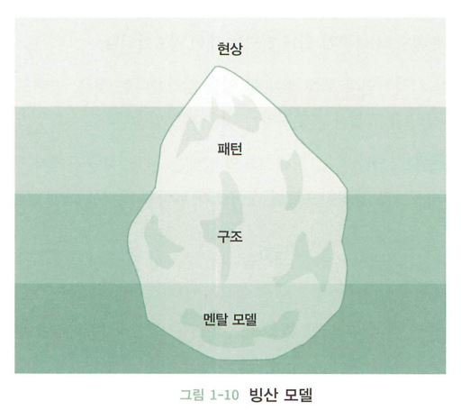
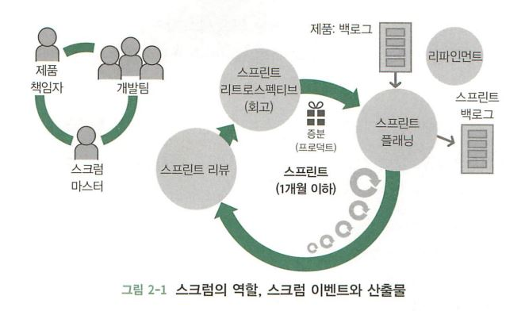
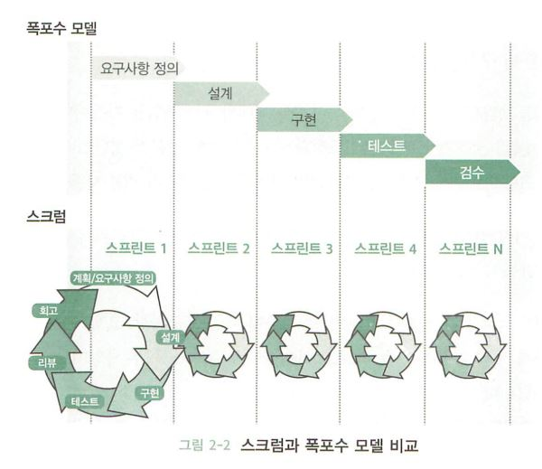
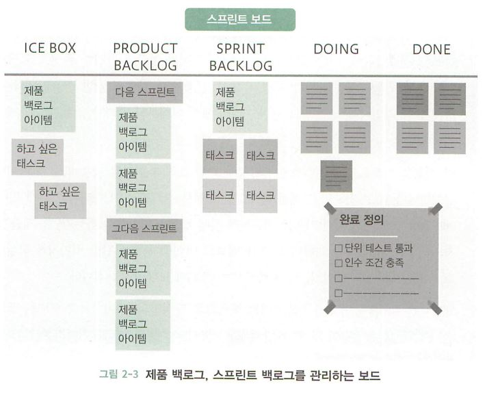
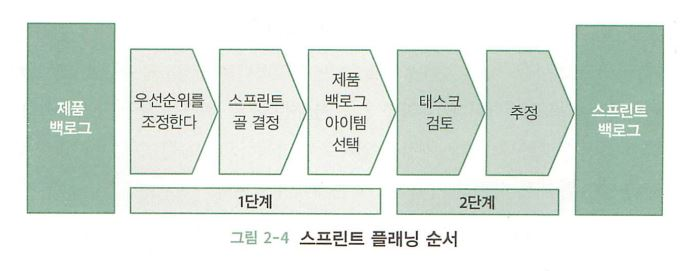
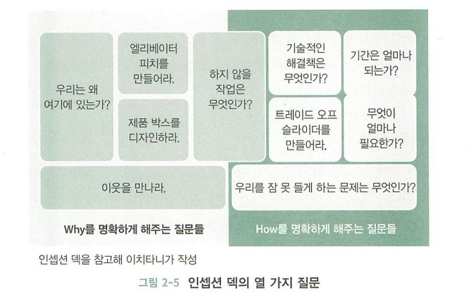
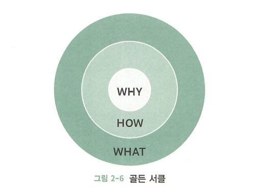
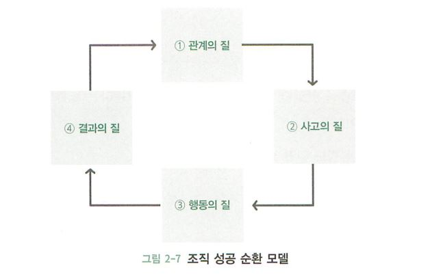
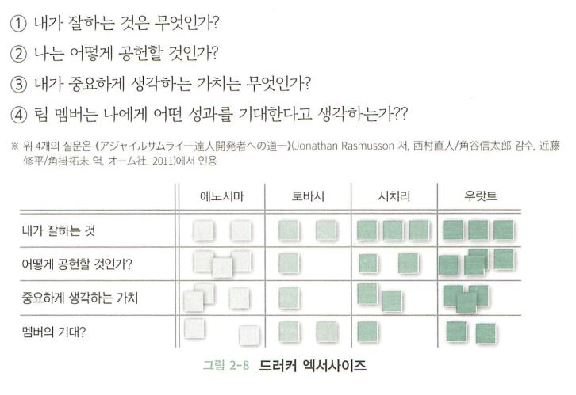

# 애자일 뜯어보기

모든 그림과, 내용의 저작권은 [카이젠 저니](http://www.yes24.com/Product/Goods/78594571)의 저자에게 있습니다.

> "개발 방향과 개발 방식"의 조합 : 팀과 클라이언트 뒤섞기, 일일 미팅, 시각화, 스크럼과 칸반의 병행 운영, 팀 구성원들과 이해관계자를 섞는 방법, 애자일한 추정과 계획 수립, 프로젝트 전체의 버퍼를 관리하는 방법

 

## 1장, 회사를 떠나기 전에 꼭 해야 할 일
> 내가 있던 곳에서 밖으로 나와야 합니다.

일하는 방식을 좀 더 좋게 바꾸려면 어떻게 해야 할까요? 정보를 수집하는 일만으로는 실전에 활용하기 어렵고, 같은 장소에서는 생각하는 방법과 방식이 굳어지는 경우가 많습니다. 여기서 추천하는 방법은 `자신이 늘 있던 곳에서 한 발짝 밖으로 나와 볼 것`입니다.

외부에는 우리와 다른 사고를 가졌거나 다른 경험을 한 사람들이 매우 많겠죠? 즉, 밖에 나오는 행위 자체만으로도 문제가 해결될 가능성이 커집니다. 또한 자신이 가진 의문이나 의견을 표현하며 커뮤니티를 형성할 수도 있죠. 이는 매우 중요한데, 다른 사람에게 말로 전달하는 것은 자신의 생각을 정리할 수도 있다는 것입니다.

단, 외부로부터 지식을 얻을 때 꼭 기억해야 하는 점이 있는데, 바로 `우리가 처해 있는 **상황**에 맞춰 적용하는 것`입니다. 외부에서 얻은 정보 대부분은 해당 정보를 제공한 사람의 경험을 바탕으로 만들어진 것이기 때문에 전제 조건을 고려하지 않고 결과만을 취하고자 한다면... 다른 상황에 적용되니 잘 진행되지 않을 수 있죠.

다른 사람들이 만들어 낸 Practice의 배경에는 어떤 상황, 어떤 제약이 있었는지 이해한 뒤 우리에게 어떤 Practice를 적용할 지 반드시 여러 번 판단해야 합니다.

 

 
 

## 2장, 나부터 시작하기
> 회사에서의 개발이나 부서의 문제점을 제기하는 것은 얼마든지 할 수 있지만, 스스로 할 수 있는 일은 무엇일까요?

어디에서나 일어날 법한 문제는 장소나 상황이 바뀌면 계속해서 일어납니다. 발생했던 문제와 해결책은 조직적으로 축적되지 않고 개인에게 의지할 뿐입니다. 더욱이 업무의 누락도 심해 프로젝트 종반이 되면 당연히 했어야 하는 일들을 하지 않아 문제가 발생하기도 하죠. 또한 리더의 경험에 크게 의존하는 환경에서는 리더가 경험하지 못한 업무들은 계획 단계에서 제거되므로 관리자가 수행해야 할 중요한 기능이 구현되지 않거나 성능에서 이슈가 생깁니다.

물론 계획에만 국한된 이야기는 아닙니다. 오늘 무엇을 해야 할 것인지, 팀원이 무엇을 하는지, 어떤 문제를 느끼고 있는지 전혀 모릅니다. 어떤 문제가 일어났을 때 협력하여 행동을 취하는 것은 너무 느립니다. 그렇다면 이러한 상황, 현장을 바꾸려면 무엇부터 시작해야 할까요? 우선 `혼자 시도`해 보는 것입니다. 아래를 살펴볼까요?

### 상태 시각화
> 일이 보다 잘 되도록 하기 위해서 시작해야 하는 네 가지이자, 습관적으로 실행하는 `프랙티스(Practice)`

1. 태스크 매니지먼트(Task Management)
2. 태스크 보드(Task Board)
3. 아침 회의(Morning Meeting)
4. 회고(Retrospective)

업무 개선의 첫걸음은 **현재 상태를 시각화**하는 것입니다. 태스크 누락, 커뮤니케이션 부족이 발생한다면 상태를 시각화할 시기입니다. 그러나 상태의 좋고 나쁨을 판단할 수 없는 상황이나 문제에 대처해야 하지만 손댈 수 없는 상황에서는 효과를 기대하기 힘듭니다.

위 프랙티스는 독립적으로 시작할 수 있지만 서로 연관되어 있으므로 네 가지를 동시에 수행하면 더욱 큰 효과를 얻을 수 있습니다.

- **태스크 매니지먼트**
  - 일을 할 때는 해당 업무의 배경, 목적을 먼저 이해한 후에 시작하는 것이 좋습니다. 즉, 목적을 명확히 함으로써 목적 달성에 필요한 리소스(절차, 스킬)가 부족한 것을 알 수 있고, 빨리 알아챌수록 더 신속하게 대응할 수 있죠. `잘 되지 않는 요소`들을 빠르게 식별하는 것 역시 중요한 관점입니다.
  - 업무 규모가 커지면 작은 크기의 독립 태스크로 분할을 고려하는 것이 좋습니다. 태스크가 작으면 완료 가능한 상태를 쉽게 추정할 수 있기 때문이죠.
  - 태스크의 규모를 추정하면 기간을 근거로 무엇부터 어떤 순서로 진행하는 것이 좋을지 계획할 수 있습니다.

- **태스크 보드**
  - 수립한 계획 내용을 시각화한 것으로, 태스크 상태에 해당하는 단계를 만들어 이를 보이도록 합니다.
  - 얼마나 많은 태스크가 남아 있는지, 각 태스크가 어떤 상태에 있는지 쉽게 이해할 수 있으며, 무엇인가를 식별하기도 쉽습니다. 즉, 문제를 신속하게 발견하고 대응할 수 있습니다.
  - 이를 위해 `변화를 보드에 매일매일 반영하는 것이 매우 중요`합니다.

- **아침 회의**
  - 태스크 보드에 변화를 반영하는 시간입니다. 아침 회의에서의 확인을 통해 계획과 어긋난 정도를 식별하고 다시 계획을 수립할 기회를 얻습니다.
  - 아침 회의의 원칙은 매일 `정해진 시간`과 `장소`에서 `같은 리듬`으로 수행하는 것입니다. 조건을 제한하면 변화가 발생했을 때 쉽게 알아챌 수 있습니다.
  - `어제 무엇을 했는가`, `이를 기반으로 오늘은 무엇을 할 것인가`, `오늘 할 일이나 계획을 달성하는데 있어 어려운 점은 없는가`를 정리하며, 수립했던 계획과 크게 어긋날 우려가 있는 경우 계획을 조정합니다.

- **회고**
  - 회고의 목적은 일하는 방법과 그 결과를 바탕으로 다음 계획을 수립하거나 일과에 활용하는 것입니다.
  - 4개의 프랙티스에서 회고를 하지 않는 경우가 많은데, 나머지 3개의 프랙티스를 하지 않더라도 회고는 `반드시 수행`할 것을 권장합니다. 회고가 아니면 `일하는 방법을 개선할 기회가 없기 때문`입니다.

 

 

프랙티스 실천은 작은 실험에서 시작합니다. 팀 전체로 범위를 늘리지 말고 우선 `혼자 시작`해보세요. 시작하면 여러 가지를 알 수 있게 됩니다.

 

## 3장, 혼자 시작하는 회고
회고를 통해 일하는 방법을 고쳐봅시다.

### 회고의 기본
> 회고는 지금까지 해온 일을 통해 **깨닫고** 학습하며 앞으로 **어떻게** 할 것인지를 결정하는 활동입니다.

대부분 하루하루가 바쁘기 때문에 자신의 일을 매우 좁은 범위만을 볼 수 없게 되고, 자신이 일하는 방법을 객관적으로 파악할 기회가 줄어들죠. 이처럼 가끔은 멈추는 시간도 필요한데, 회고는 `멈춰 서서 생각하기` 위한 기회라고 할 수 있습니다.

회고의 목적은 크게 두 가지로 나눌 수 있습니다.
- `프로세스 개선` : 일이 보다 잘 되도록 하기 위함입니다.
- `앞으로 나아가기` : 조건이나 제약 사항을 잘 모르는 경우나 어떻게 전개될지 예측하기 어려운 **불확실성이 높은** 상황 속에도 나아가기 위함입니다.

지난 과정에서 얻은 단서들을 분석하고 다음 액션을 생각하는 것은 불확실한 상황을 명확하게 만들고, 경험으로부터 얻은 지식을 계획에 수시로 반영하는 작전을 수립하여 좋은 결과를 이끌어낼 수 있습니다.

 

**Keep, Problem, Try**
> 회고 방법 중 하나입니다.

 

이 밖에도 `해본 것, 알게 된 것, 다음에 할 것` 등의 다양한 프레임워크가 존재합니다.

Keep은 유지할 것으로 `실행해 본 결과, 좋았던 것(Good)을 선정`합니다. 좋았던 것과는 별개로 계속할지 여부는 별도로 판단해야 하는 경우도 있죠.

Keep에서 선정된 아이템 자체도 중요하지만, 팀이 막 구성되었거나 프로젝트 상황이 좋지 않을 경우 단 하나의 Keep도 선정되지 않을 수 있습니다.

Problem에서는 `문제점`을 선정합니다. 단, 문제가 되기 이전의 도전이나 깨달음을 놓치지 않기 위해 애매했던 점, 마음이 걸렸던 점 등을 바운더리에 포함시킵니다.

Problem은 가능한 구체적인 것이 좋습니다. 단편적 감정("힘들었어요" 같은 감정들)이라도 시각화할 수 있으므로 안 되는 것은 아니지만 그 상태는 대응하기 힘들죠. 대신 감정을 표현한 동료의 설명과 생각을 들어보면 그 문제가 어떤 불편함이나 불이익을 야기했는지 깊은 통찰을 얻을 수 있을 것입니다.

자, 우선 Keep과 Problem 선정에 전념한 뒤, 선정된 것 중에서 Try, `다음에 시도해보고 싶은 것`을 골라봅시다.

Problem이 많아 대응하는 Try 항목도 많아질 수 있지만, 모든 Try 항목을 실행하려고 하지 마세요. 이를 실행하다가 전부 애매하게 되어 버리면 효과적이라 할 수 없으니까요.

Try 항목 중 긴급도, 중요도를 따져 순번을 정해보세요. 다음 회고까지의 기간과 팀의 숙련도에 따라 시도할 Try의 양이 달라집니다.

 

**회고 빈도**
> 회고는 얼마나 자주 해야 할까요?

 

회고의 적절한 간격은 절대 기준이 없어 답을 줄 수 없지만, 접근 방식은 도와줄 수 있겠군요. 회고에서 도출한 `Try`는 일종의 실험입니다. 그렇다면 실험을 통해 결과를 얻고 평가할 수 있을 정도의 기간이 적당하죠.

애자일 개발 방식 중 하나인 `스크럼(Scrum)`에서는 1개월 또는 그보다 짧은 기간에 회고를 반복적으로 수행합니다(스크럼에서는 팀 상태를 확인하고 개선 계획을 세우는 회의를 `스프린트 회고(Sprint Retrospective)`라 해요).

이제 막 팀을 구성해 팀워크가 갖춰지지 않았다면 1주 간격의 잦은 회고를 통해 개선 사이클을 빠르게 만드는 것이 중요한 반면, 팀이 스크럼에 익숙해졌다면 2주 간격이 적당합니다.

 

### 두 번째 회고
> 이전 회고에서 도출한 Try 항목들에 대한 검토부터 시작합니다.

Try 항목을 시도해 본 결과는 어땠나요? 효과가 있어 지속하는 것이 좋다면 `Keep 항목`으로 옮깁니다. 이 의미는 구체적으로 Problem에 변화가 일어났다는 것이며, 문제의 정도가 감소하거나 그 자체가 사라졌는지 등 결과를 확인합니다.

이런 회고가 반복되면 Keep 항목이 증가하겠죠? 따라서 Keep 항목을 다시 한 번 확인하는 것은 잊지 않아야 합니다.

팀의 상태나 프로젝트 상황은 시간과 함께 변하므로 회고 당시에는 Keep 항목이었더라도 현재는 불필요한 상태가 될 수 있으니, 이런 항목은 유지하지 않아도 됩니다. 즉, Keep 항목을 멈추는 판단도 회고에서 함께 하는 것이 좋습니다.

 

 

회고를 계속하다 보면 Problem 항목이나 Try 항목의 경향이 보이기 시작하는데, 태스크 누락이 많아 Problem 항목으로 몇 차례 선정되는 경우가 존재합니다. 이런 경우 경향을 파악해 문제의 원인을 해결하거나, 태스크 매니지먼트 방식을 도입해 볼 수 있겠죠.

회고는 팀에서의 수행을 전제로 하는 경우가 많지만, 똑같은 목적으로 혼자 수행하는 것도 좋은 방법입니다.

 

### 칼럼) 사실/의견/대책
사내의 문제 해결을 위한 논의는 다양한 부분에서 이뤄지죠. 회의에서 언급한 내용은 사실에 기반을 두었거나, 주관적인 의견이나 해결안을 포함할 수 있습니다.

여기서는 사실, 의견, 대책 세 가지를 구분하여 논의를 정리하고 문제 해결 방법을 안내합니다. 객관적인 사실을 도출한 의논은 오해가 적고 감정적인 부정이 발생하기 어려우니 반드시 시도해보세요.

**순서**
1. 문제 발견 단계
   - 문제점을 자유롭게 제시하고 모든 문제점은 임시 의견으로 둡니다(A).
2. 사실 발견 단계
   - 의견을 기반으로 불이익을 기재합니다(B).
   - 이와 관련된 보다 구체적인 사실을 기재합니다(C).
3. 대책 단계
   - 사실의 문제가 발생하지 않는 대책을 생각해 보고 최적의 의견을 선정합니다(D).
   - 선정한 대책을 누가 언제, 수행하는지를 기재합니다(E).

 

 

정리해봅시다.

여러분은 회고를 통해 팀이 성장하는 것을 느꼈고, 이에 뿌듯함을 느끼고 있습니다. 그런데, `회고가 잘 되고 있다는 것을 어떻게 판단할 수 있나요`?

여기서 **회고의 회고**를 해보면 좋겠네요. 다음에 시도할 것으로 선정한 내용이 `성찰`에서 그치고 유효한 행동으로 이어지지 않았는지, 문제를 대처해야 하겠다는 다짐만으로 나 자신만을 만족시키진 않았는지 말이죠.

다른 팀원도 동일할 것입니다. 수립한 대책은 구체적인 내용 없이 `열심히` 정도의 이야기가 많을 것이에요. 여기서 드러나는 것은, 문제를 간과하고 있었다는 사실입니다.

회고에서 문제를 간과하면 이후 `다시 파악할 수 있는 기회도 사라집니다`. 문제가 커져야만 알아차리는 일이 반복되죠. 시야를 귀찮은 문제로부터 다른 곳으로 돌릴 때도 많습니다. 이런 상황에서 `눈을 돌리지 말자!`를 아무리 다짐해도 해결책이 되지 않습니다.

그렇다면 왜 회고에서 `아무런 의미 없는 이야기로 많은 시간을 낭비`하고 있을까요? 바로 **다른 사람이 깨닫도록 하고 싶은 것**입니다. 스스로 깨닫지 못하는 것은 어쩔 수 없으니, 상대방의 경험과 생각으로 하여금 자신의 한계로 뛰어넘고자 하는 것입니다!

결국 회고가 `팀`에서 하는 것이 중요해지는 이유입니다.

 

## 4장, 태스크 가시화 혼자 시작하기
> 달성하고자 하는 일을 실현시키기 위해 해야만 하는 일은 무엇인가요?

하고자 하는 일을 빠짐없이 찾아내 하나하나 성취하는 것이죠. 글로 적으면 별 것 아닌데 실제로는 잘 되지 않습니다. 그 이유는 해야할 일을 `상상`해 내야 하기 때문입니다.

### 태스크를 도출해 가시화하기
> 우선 해야 할 일을 관리하는 것부터 시작합니다.

태스크란 일의 최소 단위로, 태스크 매니지먼트에서 반드시 고려해야 하는 사항은 아래와 같습니다.
- 태스크의 양은 얼마나 되나요?
- 각 태스크의 목표는 무엇인가요?
- 각 태스크의 목표를 달성하는데 있어 주의해야 할 점은 무엇인가요?
- 현재 상황은 어떠한가요?

상황이 바쁘면 자신에게 얼마만큼의 태스크가 있는지 모르는 경우가 많으므로, 가장 먼저 태스크를 `가시화`해야 합니다. 가장 추천하는 방법은 포스트잇 한 장에 태스크를 하나씩 적는 것입니다.

소프트웨어보다 아날로그 방식이 한 눈에 보기 편하고, 다른 사람들도 볼 수 있는 장점이 있습니다. 물리적으로 아날로그적인 방법이 힘들다면 어쩔 수 없지만, 최대한 시선이 자주 가는 장소에 붙여 두는 것이 좋습니다.

시선을 유도할 때는 태스크의 종류, 업무 의뢰자에 따른 그룹화로 포스트잇 색상을 분리한다면 어떤 종류의 태스크가 있는지 단번에 알 수 있습니다.

또한 태스크를 기록할 때는 `OO처리`보다는 `OO 처리를 프로그래밍한다`와 같이 명사+동사 형태로 쓰는 것이 훨씬 알아보기 쉽습니다. 명사로 끝나면 무엇을 해야 하는지 알 수 없는 경우가 존재하니까요.

이러한 수단으로 태스크 보드 또는 칸반을 사용할 수 있습니다.

 

### "어떻게 하면 이 태스크가 끝나나요?" 를 말할 수 있습니다.
태스크와 관련된 정보는 다음과 같습니다.
- 누가 의뢰한 것인가요?
- 다음에는 누구에게 전달하나요?
- 기한은 언제까지인가요?
- 작업 시간이 얼마나 소요되나요?
- 어떤 상태가 되면 이 태스크가 완료되나요?

**누가 의뢰한 것인가**에 따라 의뢰한 측에서 무엇을 기대하고 있는지가 달라집니다. 태스크를 직접 의뢰한 당사자만을 고려해서는 안됩니다. 제 3의 요청자가 무엇을 기대하는지 파악하지 못해 결과적으로 부정적인 상황을 만나게 될 수 있어요.

물론 일일이 제 3의 요청자가 누구인지, 무엇을 원하는지 확인하는 것은 매우 비생산적입니다. 따라서 어떤 상태가 되면 일이 완료되었다고 할 수 있는지를 정확하게 정해 업무를 주고 받는 것이 좋습니다. 이러한 사고를 담고 있는 것이 `칸반`입니다. 단, 칸반을 운용하기 위해서는 업무의 흐름을 정리해야 합니다.

**다음에는 누구에게 전달**할까요? 여러분이 의뢰하는 사람이 되므로 해당 태스크를 이어받을 사람을 생각해야 합니다. 즉, 그 대상이 어떤 상황에서 전달받기를 기대하는지 명확히 정하는 것이 효율적입니다.

태스크에는 착수하는 순서가 있어야 하는데, 이 때 필요한 정보가 **기한은 언제까지인지**, **작업 시간이 얼마나 소요되는지** 입니다. 기한과 작업 시간 정보를 통해 어느 태스크에 가장 먼저 착수할 것인지 정해야 하기 떄문이죠.

착수할 순서를 결정했다면 팀원이 알 수 있도록 해주세요. '나는 무엇을 어디에서부터 진행할 예정이니 기대하는 바가 다르다면 알려주세요'라고 인지시키는 것으로, 태스크 보드나 칸반을 사용할 수 있습니다.

마지막은 **어떤 상태가 되면 이 태스크가 완료되는지** 확인합니다. `완료 정의` 또는 `완료 조건`이라 불리는 것이 있는데, 사람에 따라 완료의 정의가 다를 수 있다는 것을 전제로 하는 것입니다.

'OO(이)라는 문서를 작성합니다'라는 태스크의 완료 정의를 '문서를 작성해 저장소에 커밋하는 것' 또는 '문서를 작성해 의뢰자에게 리뷰를 받고 리뷰 의견에 대한 대응도 마치는 것'으로 생각할 수도 있기 때문입니다.

각각의 완료 정의를 그대로 태스크에 반영하면 재작업이 발생하고 예상보다 많은 시간이 걸리므로 태스크의 목적과 요청자의 기대를 반영한 완료 정의를 관계자 사이에서 합의해야 합니다.

 

### 큰 태스크를 그대로 취급하지 않기
> 완성의 형태를 그리기 위한 `태스크의 자세한 정도`

태스크의 자세한 정도를 조율해 두지 않으면 완료 후의 모습에 큰 차이가 발생하므로 크기가 큰 태스크를 그대로 다루면 불협화음이 발생하기 쉽습니다.

따라서 가장 먼저 태스크를 **목적에 따라 분할**하는 것이 좋습니다. 큰 상태 그대로는 해결할 수 없는 문제를 작은 문제로 분할하고, 분할한 문제를 모두 해결하여 가장 큰 문제를 처리하는 방법을 분할 정복(Divide and Conquer)라고 부릅니다.

태스크를 분할한 후 각 태스크를 어디까지 구현해야 하는지 관계자와 다시 조율하고, 적절한 크기로 분할했는지 판단하기 위한 크기 추정을 진행해야 합니다. 태스크의 크기란 **태스크를 종료하기 위해 필요한 시간**입니다.

예로 종료까지 하루 이상 걸리는 태스크는 분할을 고려하는 것이 좋아요. 하루 동안 무엇을 했는지 명확하게 알 수 있어 진척도를 표시하기 좋습니다. 또한 태스크를 완료함으로써 `일이 진행되고 있다`는 느낌도 얻으니 스스로 동기 부여를 할 수 있게 됩니다.
 

### 칼럼) 긴급/중요 매트릭스
> 확보한 시간을 필요로 하는 태스크 또는 중요 업무를 뒤로 미룬 경험은 없나요?

긴급 태스크만을 일정대로 수행하는 것은 좋은 시간 관리가 아니며, 시간을 바쁘게 보내는 것으로 일을 한다고 착각해도 안 됩니다. `고객에게 가치를 전달하는 것`만이 진짜 일이죠.

때로는 멈춰 서서 일을 다시 파악해야 합니다. 향상시키고 싶은 스킬, 궁금증을 갖는 태스크도 있을테니 이를 모두 포함한 `긴급/중요의 사분면 매트릭스`를 정리합니다.

 

 

1번/3번 영역의 일을 하는 것만으로 대부분의 시간을 사용해서는 안 되며, 긴급하지 않은 2번 영역의 시간을 늘려야 합니다. 이는 인간 관계 형성, 자기 계발/개선과 같은 태스크에 투자하는 것이 중요하기 때문입니다.

중요한 일에 손조차 쓰지 못하면 일정표를 작성하는 시간을 미리 확보하세요. 실행하지 않으면 안 되는 상황을 만들고 같은 영역에서 같은 정도의 긴급/중요도를 가진 태스크를 최소의 실행 노력으로 최대의 효과를 낼 수 있게 우선해야 합니다. 즉, `스스로 성장하기 위해 시간을 관리하는 기술을 몸에 익히셔야 합니다`.

 

> 정리해볼까요? 

문제가 닥쳤을 때 어떻게 해결할 지 모르고 시작할 수 없다면 무엇을 해야 할까요? 대부분은 고객(클라이언트)의 요구사항을 파고 들지 않습니다. 그러면 태스크는 큰 덩어리로 존재하는 거죠. 얼마나 만들어야 하는지 추정조차 힘들고, 만든 후에만 알 수 있는 것도 늘어납니다. 자, 돌아가서 큰 문제를 분할 정복해봅시다.

큰 이야기를 작게 나누고, 큰 달성은 작은 달성의 집합이라고 생각하죠. 무엇을 달성하면 좋은지를 생각하고 이를 더 작은 단위로 나눕니다. 그리고 작게 나눈 태스크를 업무 요청자와 합의하세요. 그렇다면 고려하지 못했던 사항, 개선점을 도출할 수 있을 겁니다.

 

## 5장, 내일(Tomorrow)을 내 편으로 만들기
캘린더가 없을 때 오늘과 내일이 구분되지 않을 때가 있습니다. 늘 같은 날들이 계속되고, 바뀌는 건 날짜 뿐이죠. 태스크를 구분해서 업무를 진행하지만 일에 쫓겨 태스크를 다시 확인하면 우선순위에 따라 정리하지 않은 경우가 허다합니다. 무엇이 문제일까요?

### 아침 회의 : 하루 계획 세우기
> 매일매일 우선해야 하는 것은 하루의 계획을 세우는 것입니다.

하루의 계획을 세운다는 점에서, 일을 시작하는 시점에 하루의 계획을 세우는 것이 좋으니 아침 회의가 효과적입니다. 이를 반복하면 하루의 계획을 세우는 데 걸리는 시간이 많이 필요하지 않다는 걸 알게 될 거에요.

아침 회의의 목적은 `어제까지 했던 일을 확인`하고 오늘 할 일의 계획을 세우는, 즉 `태스크를 다시 계획하는 것`입니다. 따라서 다른 태스크 관리 방법과 함께 운용하는 것이 좋죠. 아침 회의에서는 다음과 같은 세 가지 사항을 점검하는 것이 좋습니다.

- [ ] 어제 한 일
- [ ] 오늘 할 일
- [ ] 곤란한 일

스크럼에서도 매일 세 가지 사항을 점검합니다.

- [ ] 개발팀이 스프린트 목표를 달성하기 위해 내가 어제 한 일은 무엇인가요?
- [ ] 개발팀이 스프린트 목표를 달성하기 위해 내가 오늘 할 일은 무엇인가요?
- [ ] 나 또한 개발팀이 스프린트 목표를 달성함에 있어 장애가 되는 것을 보았나요?

팀 단위로 진행하는 경우 스크럼의 질문에 답하는 방식이 가장 간단한 상황 설명입니다. 혼자 아침 회의를 하는 경우는 물론, 팀 단위 회의에도 `어제 한 일`을 말로 표현해 보면 회고의 효과를 얻을 수 있습니다. 어제 발견한 문제, 오늘 신경 써야 할 것, 다른 사람에게 알려야 할 것 등을 말이죠. 스크럼의 질문 중 세 번째 질문이 특히 중요한데, 이 질문을 매일 던짐으로써 문제를 찾아낼 `기회`를 얻을 수 있습니다.

문제의 원인을 찾을 때는 한 번에 핵심에 다가가지 않아도 좋습니다. `문제를 인식하는 것`과 `원인을 찾아내는 것`은 나눠 수행해도 좋죠. 문제를 `가시화`하는 것이 최우선입니다.

 

### 내일을 내 편으로 만들기
> 아침 회의를 시작하면서 깨닫는 것이 있습니다.

오늘 해야 할 일이 무엇인지 이해하고 결정한다는 것과 무엇을 내일로 미뤄도 좋을 지 판단할 수 있다는 것이죠. 즉, `오늘의 태스크 매니지먼트는 내일의 태스크 매니지먼트`이기도 합니다.

모든 태스크를 오늘 내에 처리하는 것은 불가능에 가까우므로, 오늘과 내일 사이에서 모든 태스크를 검토해보세요. 태스크를 진행하는 것을 오늘과 내일에서만 판단하면 되므로 시간이 많이 걸리지 않기 때문입니다. 결과적으로, 오늘 해야 할 일들 중 잊어버리는 태스크를 상당히 줄일 수 있게 됩니다.

 

### 1 on 1
> 일대일로 대화하기

일이 많거나 바빠 야간 막차를 타는 상황이 반복되면 당연히 생산성은 떨어지고, 일 자체를 계속할 수 없게 될 수 있습니다. 또 본인만의 힘으로는 상황을 바꿀 수 없는 경우도 있죠. 이런 경우 상사나 리더 역할을 하는 사람이 팀원 한 사람, 한 사람을 만나 진솔하게 대화하는 시간을 갖는 것이 중요합니다. 이러한 대화를 `1 on 1`이라고 합니다.

`1 on 1`은 정기적으로 정해진 시간에 상사와 멤버가 일대일로 커뮤니케이션하는 시간입니다. 일방적인 지시가 아닌 대화의 시간이죠. 이를 통해 멤버의 상황을 개선하고 대화를 통해 깨달은 것으로 성장의 기회가 다가올 수 있습니다. 그럼 `1 on 1`을 어떻게 해야 할까요?

처음에는 `잡담의 연장선`이라고 생각하세요. 편안한 분위기를 조성하고, 멤버가 말하고 싶은 어떤 것이라도 상사는 듣는 것에 집중합니다. 신뢰 관계는 지속적으로 쌓는 것입니다. 이야기를 진지하게 들어줌으로서 `나를 지켜보는 사람이 있구나`, `내 말에 귀 기울여주는 사람이 있구나`라는 사실을 인식시켜 주세요. 상대를 응시하며 고개를 끄덕이고, 최대한 당신의 이야기를 듣고 싶다는 마음이 전달되도록 노력해봅시다.

이러한 대화를 몇 차례 반복하면 평상시 표현하기 힘든 문제, 경력 및 진로, 개인적으로 상담하고 싶은 이야기 등으로 변할 것입니다. 이때 상사는 자신의 생각을 일방적으로 강요하지 않고 `질문하는 것에 집중`해주세요. 상사가 할 일은 멤버가 도출한 대답을 `응원해 주는 것`뿐입니다. 최소한 한 달에 한 번, 30분이라도 멤버를 위한 시간을 내어 `함께 하는 순간`을 만드세요. 이런 시간을 만들 수 없다면 상사나 리더의 자리에서 물러나는 편이 좋을지도 몰라요.

 

## 6장, 경계를 넘나들기
> 다른 사람에게 부탁한 태스크가 기한을 넘겼나요?

일하는 도중 태스크는 곧잘 주고받지만 다른 사람에게 부탁한 태스크의 행방을 알 수 없게 되는 경우가 있을 겁니다. 많은 확률로 여러 사람에게 `동시에` 태스크를 맡기기 때문에 누구에게 무엇을 부탁했는지 쉽게 잊어버리죠. 상대가 본인이 맡은 태스크를 확실히 관리하면 좋겠지만 그런 일은 거의 없어요. 그러면 돌아와야 하는 태스크가 지연되고 결국 자신의 일에 영향을 미치게 됩니다.

이러한 문제는 크게 두 가지로 구분해 볼 수 있습니다.
1. 다른 사람에게 무엇을 의뢰했는지 잊어 버리는 것
2. 의뢰한 태스크가 언제 돌아올지 모른다는 것

물론 다른 사람의 태스크 상황을 일일이 파악할 수 있는 방법은 현재로선 없습니다. 하나하나 다른 사람의 태스크 상황을 추적하는 것도 불가능하죠. 그렇다면 최소 `지금 자신이 진행하는 태스크`와 `다른 사람에게 전달한 태스크`의 총량이 자신의 역량을 넘지 않아야 합니다. 따라서 나에게 주어진 태스크와 맡긴 태스크 양쪽을 `함께` 보면서 일을 조합할 수 있는 구조가 필요하죠.

 

### 태스크 보드로 태스크를 가시화하기
> 태스크 보드 : 세 단계로 구성한 보드

일정한 기간 내에 끝내야 하는 태스크가 `얼마나` 있는지, 해당 태스크들이 대기 중인지(`TODO`), 진행 중인지(`DOING`), 완료됐는지(`DONE`)를 구분하는 단계로 표현합니다.

 

 

혼자 태스크 보드를 사용한다면 작은 화이트보드와 포스트잇으로, 팀에 서운용한다면 큰 화이트보드와 포스트잇으로 시작할 수 있습니다.

사용 방법은, 가장 먼저 포스트잇에 일정 기간(예를 들어 1주) 동안 진행할 만큼의 태스크를 각각 적고, 이제부터 해야 할 TODO 단계에 붙입니다.
1. TODO 단계의 태스크 중 지금부터 진행할 태스크를 DOING 단계로 옮긴 후 DOING 단계의 태스크가 완료되면 DONE 단계로 옮깁니다.

2. 다시 TODO 단계에 있는 태스크를 DOING 단계로 옮겨 업무를 시작합니다. 

3. 과정을 모든 TODO가 없어질 때까지 반복합니다.

태스크 보드를 운용하기 시작하면 TODO의 항목이 급격히 늘어나는 현상이 자주 발생합니다. 태스크를 가시화하면서 깨닫는 것과 미래를 예측하여 모두 태스크로 등록하기 때문이죠. 이렇게 TODO 항목을 도출하면 태스크가 깔끔하게 정리 되지만 양이 많아 전체적인 모습을 확인하긴 힘들어집니다.

따라서 TODO 단계에서는 일정 기간 내에 `수행 가능한 양만큼`의 태스크만 붙여 두고, `미래의 태스크나 신경 쓰이는 태스크` 등은 별도의 공간에 놓는 것이 좋습니다. 이 공간을 아이스박스(Icebox) 또는 파킹-랏(Parking-Lot)이라 부르는데, 우선순위를 정하지 않고 일단 모아 두는 장소라는 의미입니다.

 

 

태스크에는 대부분 처리해야 할 순서가 있으므로, TODO 단계에서 태스크들을 정렬해 우선순위를 표시하는 게 좋습니다.

 

> DOING 단계에 태스크가 많아도 괜찮을까요?

DOING 단계는 `이제부터 진행할 태스크`를 두는 곳으로, 원칙을 따지면 하나의 태스크만 놓을 수 있습니다. 여러 태스크를 동시에 진행한다면 업무 전환 시 과부하가 걸려 효율이 저하되죠. 이 부하를 `전환 비용(Switching cost)`이라 부릅니다.

DOING 단계에 태스크가 많다는 것은 업무를 열심히 하는 것처럼 보이나, DONE 단계로 이동하지 않으면 완료된 업무가 없는 것과 같습니다. 즉, 전환 비용이 높아지므로 효율이 낮으므로 `태스크 하나를 어떻게 빨리 DONE 단계로 옮길까?`라는 관점에서 노력하는 것이 좋습니다.

 

마지막으로, 회고에서 태스크 보드를 활용합니다. `자신이 일정 기간에 얼마나 많으 태스크를 수행했는지`, `어떤 태스크를 완료하지 못했는지`와 같은 질문들을 태스크 보드를 통해 알 수 있으며, 향후 태스크 계획을 수립할 때 /활용할 수 있습니다.

 

### 칼럼) 진행 중 업무 제한/긴급 인터럽트 레인
> 멀티 태스크 상황에서 업무를 진행하면 다양한 방해 요소가 발생합니다.

가령 작업을 전환할 때 발생하는 전환 비용이 그렇죠. 해당 태스크와 관련된 배경 등을 생각하는 데 필요한 시간은 의미가 없어 가치를 만들어 내지 않으므로 가능하면 0으로 하는 것이 좋습니다.

동시에 여러 가지 일을 생각해야 하므로 집중력이 떨어져 주의가 산만해지고 실수할 확률이 높아집니다. 실수는 재작업으로 이어지고 쓸데 없는 일이 반복됩니다.

이를 해결하기 위해 `WIP(Work in Progress, 진행 중 작업)`을 제한하는 방법이 있는데 WIP를 1이나 2로 제한함으로 동시에 다수의 일 진행할 수 없다고 결정하는 것입니다.

이를 통해 태스크를 한 가지씩 완료하면 다음 공정이나 고객에게 가치를 전달할 때까지 기다리는 시간을 줄일 수 있으므로, 무가치한 대기 시간이 감소합니다. 업무 흐름이 빨라져 문제가 발생해도 개선을 위한 기회를 얻을 수 있습니다. 또한 문제가 해결되지 않으면 다음 업무를 시작할 수 없으므로 문제를 적극적으로 해결하게 되고 문제를 뒤로 미루는 현상이 줄어듭니다.

추가적으로 태스크를 완료하기 위해 동료 또는 경험자와 함께 문제를 해결하기도 하고, 결과적으로 팀에서의 협력을 높이는 효과도 얻을 수 있습니다.

하지만 WIP 제한을 하더라도 돌발적인 긴급 사고에는 어떻게 대응해야 할까요? 이 경우, 태스크 보드에 `긴급 인터럽트(진행 업무) 레인`을 추가합니다. 마치 구급차가 지나갈 수 있는 갓길 같은 것으로, 항상 비워두고 누가 보더라도 긴급하고 중요한 것임을 알 수 있게 레이아웃을 결정합니다.

긴급 인터럽트 레인은 가장 위쪽에, 빨간 테두리로 표시하는 것을 권장합니다. 분홍색/빨간색 포스트잇에 긴급 태스크를 기재해 문제에 대응하고 있는 중임을 알림으로서 긴급도가 낮은 의뢰나 업무 중단이 발생하지 않도록 가시화하는 방법도 좋습니다. 만약 혼자 대응하는 문제에 시간이 오래 걸리면, 동료가 자신의 일을 멈추고 도와주는 것도 필요합니다.

 

정리해봅시다.

태스크 보드는 일관되나 개성을 가질 수 있으므로 아래처럼 자신만의 태스크 보드를 만들어 사용할 수 있죠. 

 

 

아침 회의에서는 태스크 보드를 점검하고 포스트잇을 옮깁니다. 다른 사람의 태스크에서 진행되지 않고 있는 일이 있다면 논의합니다.

회고 시간에는 이번 주의 보드를 확인합니다. `무엇을 DONE으로 옮겼지?`, `처리해야 할 태스크가 남지는 않았나?`, `다른 사람에게 맡긴 태스크가 진행되지 않는 게 있나?` 등을 확인한 후 TODO 단계를 보며 앞으로의 태스크를 결정하고, 다음 주에는 어떤 상황이 전개될지 예측합니다.

 

## 7장, 둘이라면 바꿀 수 있어요
혼자 하는 아침 회의로 하루가 시작되며, 태스크 보드를 정리합니다. 아침 회의를 다섯 번 반복하면 혼자만의 회고가 시작되죠. 또 다음 주에는 아침 회의가 시작됩니다. 이런 과정이 계속 반복됩니다. 확실히, 같은 문제가 계속 발생하거나 태스크가 누락되는 상황은 줄어들었지만 여전히 `나 혼자만의 이야기`입니다.

혼자 하는 활동은 한 사람의 능력이나 경험이 한계로 작용합니다. 팀 단위로 하는 일의 의의를 이제서야 이해할 수 있게 됩니다. 하지만, 대체 어떻게 해야 다른 사람을 끌어들일 수 있을까요?

### 시작은 늘 혼자이지만, 언제까지나 혼자일 순 없습니다
> 애자일 개발에는 `XP(eXtreme Programming)`라는 방식이 있습니다.

XP를 창시한 켄트 벡이 쓴 익스트림 프로그래밍의 서두에는 `XP is about social change.`라는 문장이 있는데, `지금까지 자신이 하던 행동을 바꾸고 다른 사람과 관계하는 방법을 바꾼다`는 의미입니다. 기존과는 다른 새로운 개발 방향과 방식을 전파하는 것으로 행동을 바꾸고 스스로 변화하자는 것이죠.

행동을 바꾸고 새로운 한 발을 내딛는 데 `너무 늦은 시점`은 없으며, **행동을 시작해야만 한다고 깨달은 시기가 그 사람에게 가장 빠른 타이밍**입니다. 변화는 한 사람에게서 시작되지만, 그 변화를 눈여겨보는 두 번째 사람은 반드시 나타납니다. 두 사람이라면 할 수 있는 일들이 더욱 많아지며, 더 많은 것을 전할 수 있습니다. 변화는 전파되고, 이는 거대한 성과로 발전합니다.

언제나 시작은 자신, 혼자입니다. 하지만 언제까지 혼자여서는 안됩니다.

 

### 칼럼) 소외 이론과 건설적 상호 작용
> 두 번째 사람의 존재는 단지 서로를 격려하는 동료 이상의 의미를 지니는데, 의문이나 배경에 관한 질문을 통해 서로 영향을 주고 받으며 보다 깊은 지식을 갖게 합니다.

사람은 자신이 경험한 것을 바탕으로 사물을 생각하고 일상에서 배운 지혜를 조합하여 경험을 강화합니다. 교육심리학개론에서는 이 경험을 통한 지식의 집합을 `소외 이론`이라고 부릅니다.

또한 직접 체험하지 않은 일이라도 학교나 서적 등을 통해 자연 현상이나 물리적인 원리 원칙 등을 배울 수 있죠. 시험을 보기 위해 암기한 지식 또는 경험이 뒷받침되지 않는 분야의 지식은 설명하기 쉽지 않겠죠. 그러나 학습을 위한 절호의 기회이기도 합니다. 설명을 하기 위해 계속 조사하고 만들어보면서 원리와 원칙, 자신의 경험 사이에서 아이디어가 소용돌이치며 지식의 질을 높여 나갑니다. 인식하지 못했던 일이나 관점, 다른 질문들이 서로의 사고를 성장시키는 것입니다. 이처럼 상호 의존적으로 함께 생각함으로써 이해의 정도가 진화하는 것을 `건설적 상호 작용`이라고 부릅니다.

 

 
 

## 8장, 둘이서 경계를 넘기
### 혼자 시작한 가시화가 주변을 끌어들입니다
가장 먼저 시도할 일은 몸 담고 있던 회사에서 밖으로 나가는 것입니다. 바깥 세상은 넓고 현장은 다양하기에, 회사 안에서만 있어선 체험할 수 없는 것도 보고 듣고 느낄 수 있습니다.

그러나 아무리 멋진 이야기라도 자신의 현장에 적용하면 안됩니다. 모든 프랙티스의 배경에는 상황과 제약이 존재하기 때문이죠. 새로운 일을 시작하기에 앞서 작은 실험부터 시작하는 것이 중요합니다. 크게 시작했다가 실패하면 결과에 따른 영향이 커지니까요.

가장 먼저 회고를 시작해봅시다. 문제를 가시화하고 해결하는 사이클을 만들어 즉시 효과를 느낄 수 있게 말이죠. 혼자 하는 회고의 한계도 깨달을 수 있습니다. 나는 볼 수 없으나 다른 사람은 볼 수 있는 영역이 있으므로 팀에서 회고를 시도하면 다양한 것을 발견할 수 있게 됩니다.

다음은 태스크 매니지먼트를 시도합시다. 크기가 큰 태스크를 그대로 처리하는 경우 파악하기 어려운 부분이 있어 원활히 진행되기 힘든 경우가 많아요. 큰 태스크는 작게 분할해 다루기 쉽게 만드세요.

아침 회의를 시작하면 오늘 해야 할 일을 결정하는 것이 오늘 하지 않아도 될 일을 결정하는 것과 같다는 것을 깨달을 수 있습니다.

태스크 보드를 볼까요? 자신의 태스크 상태는 물론, 누군가에게 전달한 태스크 역시 자신의 태스크로 관리함으로써 태스크가 누락될 걱정을 크게 줄일 수 있습니다.

이렇게 프랙티스를 실천하면 리듬이 생깁니다. 혼자서 매일 태스크 보드와 아침 회의로 하루 업무를 시작합니다. 아침 회의를 다섯 번 반복하면 한 주가 끝나며, 이 마무리하는 시점에 회고를 합니다. 이 사이클을 반복하는 것이 `업무 리듬`입니다.

한 번 리듬을 타면 리듬을 유지하고 싶은 생각이 커지는데, `리듬을 크게 무너뜨리지 않도록 일을 진행하자`는 마음이 개선을 뒷받침하는 힘이 됩니다.

가시화의 대상은 자신의 태스크만이 아닙니다. 자신이 하는 일 자체가 주위 상황들까지 가시화하며, 그 결과 혼자 시작한 활동이 두 번째 사람의 눈에 띄고 동료를 늘려가며 성과를 내기 시작하는 것입니다.

 

### 칼럼) 학습하는 조직(빙산 모델)
> 당연하게 관습화 된 태스크에서는 문제를 발견하거나 개선하기가 쉽지 않습니다.

바다에 떠 있는 빙산에서 눈으로 볼 수 있는 부분은 극히 작습니다. 세상의 여러 사상도 빙산과 같은 모델을 사용하는데, 가장 윗부분의 `현상`만이 눈에 보이는 것입니다. 그렇다면 바닷속의 덩어리들이 이런 현상에 어떤 영향을 미칠까요?

피터 M 센게는 학습하는 조직(Learning Organization)에서 다음과 같이 표현합니다.

 

 

현상은 변화 또는 행동의 전체적인 결과에 따른 패턴으로부터 발생하며 패턴이나 큰 흐름은 구조 또는 짜임새에 기인합니다. 이런 구조를 발생시키는 밑바닥에는 관련된 요소의 멘탈 모델이 존재합니다.

멘탈 모델은 가장 깊은 바닥 부분에 뿌리 깊이 박혀 있는 신념 또는 세계관으로써 사람은 누구나 경험에 의해 멘탈 모델을 형성합니다.

무엇인가 문제가 발생했을 때 빙산의 눈에 보이는 현상에만 생각을 뺏기지 마세요. 그 문제가 `어떤 시간의 흐름에서 발생했는지`, `어떤 구조를 기반으로 발생했는지`, 결과적으로 `어떤 멘탈 모델로부터 발생했는지`를 생각하십시오. 멘탈 모델에는 인지 평향(Cognitive bias, 과거의 경험이나 선입견에 따른 고정 관념으로 무의식 중에 판단이나 평가를 내리는 것)이 영향을 미치고 있기에 그 전제를 부수기 어렵습니다.

혼자만의 힘으로는 바꿀 수 없는 멘탈 모델을 개선하는 방법은, `대화를 통해 다양한 생각을 접하거나 학습하는 것`입니다. 두 사람에서 세 사람, 더 나아가 팀을 형성하는 과정 속에서 학습의 중요성을 느껴보세요. 이는 학습하는 조직으로 업그레이드 되는 것을 의미합니다.

 

## 9장, 혼자에서 팀으로
> 스크럼(Scrum), 드디어 등장합니다!

 

### 스크럼이란?
> 개선이 내재된 프레임워크

스크럼(Scrum)은 스프린트(Sprint)라 불리는 `고정된 기간을 반복`하며 `설계`, `개발`, `테스트`, `딜리버리` 등을 수행해 가치를 담은 제품을 낭비 없이 구현하는 프레임워크입니다.

구체적으로 아래와 같은 다섯 가지 이벤트로 구성됩니다.

- 스프린트(`Sprint`) : 반복적으로 수행하는 개발 주기이며, 일반적으로 1개월 이하(1주, 2주 또는 4주)로 설정합니다.

- 스프린트 플래닝(`Sprint Planning`) : 한 스프린트 내에서 무엇을 할 지 계획하는 회의입니다.

- 데일리 스크럼(`Daily Scrum`) : 스프린트 목표를 달성하기 위해 매일의 업무 진행과 우선 순위, 장애 등을 확인하는 회의입니다. 매일 같은 시간, 같은 장소에서 15분 동안 진행합니다. 아침 회의도 이와 비슷한 목적으로 실시하나 데일리 스크럼은 꼭 아침에 할 건 아닙니다.

- 스프린트 리뷰(`Sprint Review`) : 스프린트 마무리 시점에 스프린트의 산출물을 리뷰하고 피드백을 수집하는 회의입니다.

- 스프린트 리트로스펙티브(`Sprint Retrospective`) : 스프린트 프로세스를 개선하기 위해 진행하는 회의입니다.

 

 

다음은 팀 구성입니다.

- 제품 책임자(`Product Owner`) : 제품 가치를 최대화하는 책임을 가집니다.

- 개발팀(`Development Team`) : 자기조직화(`Self-Organized`)된 전문가 집단입니다.

- 스크럼 마스터(`Scrum Master`) : 개발팀의 성과를 향상시키 위한 지원을 합니다.

위 세 역할의 멤버와 다섯 이벤트를 통해 `세 가지 산출물`을 만들 수 있습니다.

- 제품 백로그(`Product Backlog`) : 구현할 제품에 대한 요구사항, 요청, 기능 목록입니다. 목록의 각 항목을 제품 백로그 아이템이라 부르며 세부 사양이나 추정 등을 기재합니다.

- 스프린트 백로그(`Sprint Backlog`) : 제품 백로그에서 스프린트 기간 내에 구현할 수 있을 것이라 결정한 제품 백로그 아이템과 그 작업 목록입니다.

- 증분(`Increment`) : 구현한 제품입니다.

 

### 스크럼 이론과 사상
> 투명성(Transparency), 검사(Inspection), 적용(Adaptation)

스크럼에서는 `투명성`, `검사`, `적용`을 중요한 이론으로 삼고 있습니다.
- **투명성** : 스프린트 정보와 상황을 가시화함으로써 팀이 함께 인식하는 데 도움을 줍니다.

- **검사** : 팀이나 제품, 프로세스 상황을 항상 검사하여 문제를 신속하게 인식합니다.

- **적용** : 문제가 발생하면 개선안을 검토하고 문제 해결에 초점을 맞춰 적용합니다.

즉, 스크럼은 `지속적인 개선을 수행할 수 있는` 장치를 내재하고 있습니다.

스크럼은 회고를 통해 개선하는 `경험주의` *(경험을 통한 학습을 중시하고 불확실한 상황에서도 혁신적인 일을 추진해 나가는 사고방식)* 를 기반으로 합니다. 이전 단계의 산출물을 기반으로 하기 때문에 앞 단계로 되돌리기 어려운 `폭포수(Waterfall)` 접근 방식과는 크게 다릅니다.

 

 

스크럼에서는 과거 실패로부터의 학습도 중요한데, 난해하고 복잡한 프로젝트에서는 사람 사이의 신뢰 관계가 필요하며 상호 존중이 업무 진행에 있어 중요하다고 주장합니다.

즉, `개발 과정만을 관리하기 위한 프레임워크가 아닙니다`.

 

## 10장, 완료 기준을 팀에서 결정하기
> 어떤 상태를 완료라고 할 수 있을까요?

### 스프린트 플래닝과 제품 백로그
> 무엇을 전달할지 함께 인식하기

제품 백로그는 제품에 요구되는 기능의 우선순위 목록입니다.

요구사항의 완성된 모습을 `멤버 각자가 판단`하면 제품을 고객에게 전달할 때 **인식 또는 기대 차이**가 발생합니다. 그로 인한 팀 내의 낭비, 조정, 재작업 등은 쉽게 상상할 수 있죠. 스프린트 플래닝이란 `스크럼팀 모두가 무엇을 만들지를 함께 생각해 계획을 수립하는 것`입니다. 무엇을 만들어야 할 지와 만든 것을 어떻게 고객에게 전달할지 결정하는 두 단계로 구성됩니다.

**첫 번째 단계**는 `고객의 요구사항을 정리해 우선순위를 조정`합니다. 고객의 각 요구사항을 `제품 백로그 아이템(Product Backlog Item)`이라 부르며 우선순위에 따라 목록으로 정리한 것을 모아 `제품 백로그(Product Backlog)`로 관리합니다. 제품 백록으를 만드는 작업은 프로덕트 오너(Product Owner)의 중요한 업무이며, 스프린트가 시작되기 전에 제품 백로그 작성을 완료(*이른바 준비 완료 상태*)해야 합니다. 스프린트 진행 중 제품 백로그를 유지 보수하는 단계를 `제품 백로그 리파인먼트`(Product Backlog Refinement)라고 해요. 추후 자세히 알아봅니다.

스크럼팀 전원이 개발 대상을 동일하게 이해해야 하므로 제품 백로그는 특정한 사람이 전담하여 폐쇄적으로 관리하는 것이 아니라 팀이 공유하고 항상 보이도록 해야 합니다. 제품 백로그를 통해 누구라도 제품 요구사항의 우선순위, 규모를 파악할 수 있어야 하죠. 제품 백로그를 처음 도입할 때는 모조지/화이트보드 등의 아날로그 방법이 좋습니다(눈에 띄니까요).

이러한 투명성을 통해 만들 대상에 관한 이미지를 공유하고 강화하여 리소스를 최소화하는 개발로 이어질 수 있죠. 그 다음, 시장이나 고객의 요구를 반영한 우선순위를 기준으로 스프린트에서 달성할 `목표를 결정`하며, 이를 `스프린트 골`(Sprint Goal)이라고 합니다. 이 스프린트 골은 개발팀에게 이제부터 시작할 스프린트의 지침이 되죠.

이 지침을 기준으로 `스프린트에서 달성해야 할 목적`과 `연결된 제품 백로그 아이템을 선택`하고 스프린트 골은 제품 백로그를 구현한 결과로서의 형태를 갖추게 됩니다. 제품 백로그 아이템 구현에 관한 이미지가 확실해지면 스프린트 결과물인 제품(Product, Increment)이 명확해지죠.

 

 

개발팀은 **두 번째 단계**에서 `스프린트 백로그`(Sprint Backlog)를 작성합니다. 이는 첫 번째 단계에서 선택한 `제품 백로그 아이템`과 이를 고객에게 전달할 때 필요한 `태스크 목록`입니다. 개발팀에서는 선택한 제품 백로그 아이템을 기반으로 필요한 작업을 정리하는데 이 때 분석, 설계, 테스트 등 필요한 작업을 모두 포함합니다. 단, 제품에 가치를 더하지 않거나 고객에게 부가 가치를 전달하지 않는 `중간 산출물은 낭비이므로 태스크에서 제외`합니다.

태스크가 정리되면 멤버 전원이 `추정`(Estimation)을 합니다. 여러 멤버의 의견을 모으면 걱정되는 점이나 구멍들을 사전에 인식할 수 있습니다. 추정 단위는 시간으로, 작업 중 다른 업무가 끼어들지 않는다는 가정 하 태스크를 완료하는 데 어느 정도의 시간이 걸릴지 예측합니다. 만약 8시간 이상 걸린다면 태스크가 너무 큰 것이므로 분할을 검토해주세요.

이처럼 스프린트 백로그는 스프린트를 진행하는 동안 `매일 남은 업무량`이나 `진척률`을 개발팀 내에서 관리하기 위해 사용합니다.

 

 

### 완료 정의와 인수 조건
> 제품 백로그 아이템의 완료 이미지를 그리려면 어떻게 해야 할까요?

완료 정의(Definition of Done)와 인수 조건(Acceptance Criteria)이 애매하거나 없으면 제품 백로그 아이템의 완료 이미지를 그릴 수 없습니다. 이는 소프트웨어 개발에만 국한된 것이 아니에요. "이런 걸 요구한 게 아닌데... 시간도 이만큼 걸렸다구요?" 곤란한 경험이죠.

스크럼에서는 이런 현상을 줄이기 위한 방법으로 **완료 정의**를 제공합니다. 이는 `멤버 모두가 제품이 완료되었음을 동일하게 인식하는 어떤 것`을 의미하며, 제품을 고객에게 전달하기 위해 스프린트가 진행되는 동안 일괄적으로 확인해야 하는 체크리스트입니다.

> 완료를 위해 `무엇을 수행`해야 하고 `지금은 어떤 상황`인가?

예를 들자면 "스테이징(Staging) 환경에서 동작한다.", "단위 테스트를 통과한다.", "인수 조건을 만족한다." 등으로 제품을 사용할 수 있도록 하기 위한 필요 기준을 선정하는 것입니다. 이런 완료 정의는 개발팀 뿐만 아니라 제품 책임자와도 합의해야 하며 여러 팀에서 같은 제품을 개발하는 경우에도 모든 팀이 `동일한 완료 정의`를 사용해야 합니다. 즉, `완료란 무엇인가요?`라는 질문에 대해 제품 구현과 관련된 모든 사람이 동일한 인식을 갖도록 해야 합니다.

제품 책임자는 각 제품 백로그 아이템마다 **인수 조건**을 정의해야 합니다. 여기서 뜻하는 바는 `해당 조건을 만족시키면 요구사항을 확실하게 구현했다고 판단할 수 있는 리스트`를 의미하죠. 계획한 기능은 물론 비기능 사양도 만족시켰는지를 인수 조건에 포함시킵니다. 또한 제품 책임자로서 납득하고 인수할 수 있는지 여부와 그 만족 조건은 제품 백로그 아이템별로 존재해야 합니다.

`제품으로서의 완료 정의`와 `각 제품 백로그 아이템의 인수 조건`을 사용해 객관적 기준을 명문화하면 팀 구성원 모두가 동일한 판단을 할 수 있으므로 불필요한 대립을 피할 수 있게 됩니다.

 

## 11장, 팀이 가야할 곳을 내다보기
> 스크럼 마스터(Scrum Master)

### 프로젝트의 Why와 How를 명확히 하는 인셉션 덱(Inception Deck)
> 스프린트를 시작하기 전에 만드는 것이 좋습니다.

개발이 진행되고 제품이 동작하기 시작하면 변경 요구가 빈번해지거나 완성을 위해 초기의 추정을 크게 뛰어넘는 경우가 발생합니다. 그렇기 때문에 팀 멤버 사이, 팀과 외부 이해관계자들 사이에 더 많은 커뮤니케이션이 필요해지지만 프로젝트의 목표 기준이 어긋난 상태라면 의사소통이 잘 되지 않습니다.

그러나 개발팀이 처리할 수 있는 일에는 한계가 있죠. 멤버는 지쳐가고, 일은 잘 진행되지 않으며 작업 시간은 점점 줄어듭니다. 이 상황을 극복하기 위해 야근을 하고 피로는 누적되고, 작업이 더 지연되면서 악순환이 시작됩니다.

결국 목적과 방향성이 맞지 않는 것입니다. 이해관계자를 포함해 멤버 사이에 프로젝트의 목표, 달성하고자 하는 방향성 뿐 아니라 기간, 범위, 비용이나 필요한 팀의 구성, 우선순위, 리스크 등. 함께 일을 할 때 필요한 사고방식을 맞추지 않은 채 진행한다면 프로젝트는 잘 진행될 수 없어요.

프로젝트의 목적지나 제약 사항을 명확히 하고 관계자 모두가 합의한 투명성에 기반하여 운영해야 합니다. 인셉션 덱은 이를 위한 도구이며, 이를 만들면서 프로젝트를 둘러싼 다양한 질문에 대답하고 모두의 이해를 높여야 합니다.

 

### 열 가지 질문
인셉션 덱에서는 열 가지 질문에 대답함으로써 프로젝트의 Why와 How를 명확히 해 나갑니다. 모두가 대답하기 쉽지 않은 질문이에요. 하지만 대답하기 어려운 내용이야말로 프로젝트 초기부터 솔직하게 마주해야 합니다.

- [ Why를 명확하게 해주는 질문들 ]
  1. 우리는 왜 여기에 있는가(Why are we here)? : **프로젝트의 미션은 무엇인가?**
  2. 엘리베이터 피치를 만들어라(Create an elevator pitch) : **제품 필요, 고객, 차별화 포인트는 무엇인가?**
  3. 제품 박스를 디자인하라(Design a product box) : **사용자가 바라보는 제품의 가치는 무엇인가?**
  4. 하지 않을 작업은 무엇인가(Create a NOT list)? : **범위에 포함되지 않는 것은 무엇인가?**
  5. 이웃을 만나라(Meet your neighbors) : **팀을 둘러싸고 있는 이해관계자는 누구인가?**

 

- [ How를 명확하게 해주는 질문들 ]
  1. 기술적인 해결책은 무엇인가(Show the solution)? : **사용할 수 있는 기술과 아키텍처에는 어떤 것이 있는가?**
  2. 우리를 잠 못들게 하는 문제가 무엇인가(Ask what keep up us at night)? : **불안이나 리스크에는 어떤 것이 있는가?**
  3. 기간은 얼마나 되는가(Size it up)? : **필요한 개발 기간은 얼마나 되는가?**
  4. 트레이드 오프 슬라이더를 만들어라(Tradeoff slider. Be clear on what's going to give) : **출시, 범위, 예산, 품질의 우선순위 관계는 어떠한가?**
  5. 무엇이 얼마나 필요한가(Show what's going to take)? : **기간, 비용, 팀 구성은 어떻게 되는가?**

 

 

### 팀이 함께 만드는 데 의미가 있다.
인셉션 덱을 리더가 혼자 작성하는 것은 아무런 의미가 없습니다. 제품 책임자가 "제가 만들어 뒀으니 한 번 보세요."라며 일방적으로 전달하는 것도 아니에요. 하향식으로 아무리 기분 좋게 구성한들 구성원들의 눈에는 들어오지 않습니다.

팀에 스며들며 살아 움직이는 인셉션 덱을 만들려면 **팀 멤버 모두가 함께 생각해야 합니다.** 프로젝트는 대개 분주하지만, 팀 멤버 모두가 참여할 수 있는 시간을 확보하고 멈춰 서서 생각하는 것이 중요합니다. 최초에 시간이 걸린다 하더라도 프로젝트에 관한 공통의 이해를 한다면 반드시 프로젝트가 진행되는 동안 함께 살아 움직입니다.

인셉션 덱을 만드는 데는 시간이 걸리므로 지치기도 합니다. 팀의 상황에 따라 다르지만 질문 하나에 대답하기까지 한 시간 이상 소요되기도 하죠. 리더의 생각이나 제품 책임자의 열의를 언어로 바꾸고 멤버 각자가 프로젝트에 대한 Why와 부딪혀 팀으로서의 공통된 인식을 만들어야 하기 때문입니다.

이렇게 모두가 목적을 깊이 이해하는 과정이 팀 빌딩이나 자기조직화로 이루어지는데, 바라보는 방향을 합의함으로써 팀은 망설이지 않고 프로젝트를 스스로 주도할 수 있게 됩니다. 상명하달의 지시 스타일에서 당사자의 의식이 조금씩 싹트기 시작합니다. 각 멤버가 약속을 지키려는 의식을 갖게 되고 결과적으론 개인과 팀이 강해집니다.

 

### 도저히 시간을 낼 수 없는 팀이라면
인셉션 덱이 의미 있는 방법일지라도 오랜 시간 구성원 모두를 모아 둘 수 없는 경우도 있죠. 이런 경우 열 가지 질문에 대한 초안을 준비한 뒤 초안을 바탕으로 팀과 이야기해야 합니다. 시간을 단축시킬 수 있는 현실적인 방법이죠. 단, 초안은 어디까지나 초안일 뿐 모든 구성원이 함께 생각해야 합니다.

또한 모든 질문에 반드시 덱을 만들 필요는 없습니다. 아래의 네 가지 질문만으로도 프로젝트를 빠르게 추진할 수 있죠.

 

1. 미션이나 목적 공유를 위한 **우리는 왜 여기에 있는가?**

2. 리스크나 불안한 목록 작성을 위한 **밤에도 잠들지 않는 문제**

3. 범위 내외의 경계를 확실히 하기 위한 **하지 않을 일의 목록**

4. 판단 기준을 가시화하고 그 우선순위를 명확하게 하기 위한 **트레이드 오프 슬라이더**

 

`우리는 왜 여기에 있는가?`는 팀 활동의 핵심입니다. **Start with Why(목적에서 시작하라)** 라는 말처럼 모든 사고와 행동의 기점이 되므로 이 질문에는 반드시 답해야 합니다.

팀의 첫 시작에는 당연히 많은 불안이 존재합니다. 그 불안이 표출되지 않고 파묻혀 있는 것이 바로 리스크입니다. `밤에도 잠들지 않은 문제`에 답함으로써 한 번에 불안감이 드러나도록 합니다.

대략적이라도 팀이 `할 일과 하지 않을 일`을 명확히 해두면 방향성을 쉽게 유지할 수 있습니다. 프로젝트 초기에는 의외로 알지 못하는 것이나 결정되지 않은 것이 많습니다. 계속 골라 내면서 확인해야 합니다.

마지막으로 `트레이드 오프 슬라이더`를 통해 프로젝트 진행의 판단 기준을 결정합니다. 판단 기준에 어긋나면 일이 제대로 진행되지 않습니다. 마치 표적 없이 활을 쏘는 것과 같죠. 프로젝트가 잘 진행되고 있는지를 확인할 수 없으며 설사 잘 진행된다고 하더라도 그런 일은 좀처럼 일어나지 않습니다.

 

생각은 보통 '무엇(what)'에서 시작하고 그것을 '어떻게(how)' 할 것인지, '왜(why)' 그런 것인지로 정리합니다. 골든 서클은 이 사고의 흐름을 '왜(why)에서 시작해 어떻게(how) 실현하여 무엇을(what)을 할 것인가'처럼 반대로 뒤집은 것입니다. 어떤 쪽에서부터 생각을 시작하는지에 따라 how의 선택이 완전히 달라지죠.

 

커뮤니케이션에서도 갑자기 what을 제시하는 것보다 why에서 시작하는 것이 이해하기 쉽습니다. why는 목적에 해당하기 때문에, 목적을 설명하지 않은 채 구체적인 수단을 아무리 설명한들 결국 마지막에 반대로 질문을 받을 것입니다. "그런데 이걸 하는 이유가 뭐에요?"

 

프로젝트나 제품을 만들 때 why를 먼저 대답해봅시다. "왜 이 프로젝트를 시작했는가?", "왜 이 제품을 만드는가?". 이 질문에 대답할 수 있는 사람이 없다면 아직 프로젝트를 시작할 준비가 되어 있지 않은 것입니다.

 

### 스크럼 마스터의 역할
인셉션 덱을 만드는 데 있어 다음이란 없습니다. 프로젝트 종료 시점에 있다 하더라도 지금까지 만들어 낸 것이 목적에 부합하는 지 돌아보는 것이 좋습니다.

인셉션 덱을 만드는 것을 퍼실리테이션하는 작업은 결코 간단하지 않습니다. 물론 잘 안되는 것을 포함해 팀에서 본 것으로 흉내내 시도해 보는 것도 좋지만, 만약 경험이 충분한 스크럼 마스터와 함께 할 수 있다면 꼭 그렇게 하길 권합니다.

스크럼 마스터는 스크럼 도입을 지원하는 역할과 스크럼 이벤트를 촉진하는 역할을 주로 담당합니다. 또한 스크럼팀이 만들어 낸 가치를 최대화하기 위한, 팀의 생산성을 높이기 위한 역할을 합니다.

 

## 12장, 우리가 일하는 방식
> 각자의 규칙이 존재합니다.

### 조직 성공 순환 모델
> 다니엘 킴(Daniel Kim)이 고안한 성공 순환 모델

 

 

`행동의 질`은 `사고의 질`로 결정이 됩니다. 행동하는 것은 중요하나 생각하지 않으면 단지 움직이기만 하는 것이죠. 또한 `사고의 질`에 영향을 미치는 것이 `관계의 질`로 팀워크의 질을 의미합니다. 팀워크를 높이기 위해서는 팀이 어떤 행동을 할지에 관한 공감대가 필요합니다.

 

### Working Agreement란?
> 자신이 일하는 방법이나 개발 규칙을 스스로 정하기

프로젝트 방향성을 인셉션 덱으로 정리했다면 이번엔 팀에 관한 이야기입니다. 가치관이나 행동 규범이 제각각이어서는 팀으로서의 기능을 하기 어렵죠. 특히, 팀 전체가 분주해져서 개개인의 융통성이 없어질수록 분위기가 딱딱해집니다. 일하는 방식에 대한 서로의 기대 차이가 발생하죠.

팀의 상태가 안정되어 있다면 어긋난 기대감도 받아들일 수 있지만, 여유가 없으면 사사로운 일이 말다툼이나 비난으로 이어집니다. 그렇게 되면 모티베이션이 점점 낮아지고 팀의 생산성도 떨어지죠. 모두의 의욕은 마치 바람 앞의 등불처럼 되어 버립니다.

이런 패배의 연속이 되지 않도록 팀에서 자신의 행동 방식이나 약속을 정해 둬야 합니다. 그러면 기대의 어긋남이 줄어들어요. 팀에서 결정한 팀의 규칙을 Working Agreement라고 합니다.

`이미 문제가 된 것`, 또는 `문제가 될 만한 것`을 중심으로 규칙을 정해 나갑니다. 팀으로 일하는 데 있어 조율해 두고 싶은 것도 포함시키죠. 모든 것을 세세하게 결정할 필요는 없습니다. Working Agreement는 멤버의 행동 방식을 제한하기 위한 것이 아니라 팀의 생산성을 보다 높이기 위한 결정입니다.

규칙은 팀에서 스스로 결정해야 합니다. 왜냐하면 이 규칙은 리더나 매니저를 위한 것이 아니기 때문이에요. 누군가가 자신이 아닌 사람의 일에 대해 정한 규칙은 그 즉시 형식화됩니다. 시간이 지나면 무엇을 위해 결정한 것인지조차 모르게 되어 버리죠.

종종 있는 일이지만, 슬로건과 같은 형태는 피하는 것이 좋습니다. "모두 좋은 코드를 작성하죠!" 같은 것 말이에요. 슬로건은 받아들이는 사람에 따라 이해가 달라지므로 모호해질 가능성이 무척 높습니다. 그러므로 규칙은 모두가 동일하게 판단할 수 있는 내용, 상태나 수치가 함께 적혀 있는 내용이 좋습니다.

예를 들자면 이렇겠네요.

- 결석을 하는 경우 데일리 스크럼 시작 10분 전까지 슬랙의 팀 채널로 알린다.

- 데일리 스크럼은 10시 45분부터 15분 이내로 태스크 보드 앞에서 서서 한다.

- 회의 시에는 논의를 활성화하기 위해 팔짱을 끼지 않는다.

- 단위 테스트가 없는 코드는 커밋할 수 없다.

- 의문이 드는 것은 즉시 물어보고 아는 것에 가치가 있으므로 멤버들은 항상 칭찬하는 리액션을 한다.

 

### 규칙 만들기를 위한 퍼실리테이션과 운용
규칙을 만들 때는 팀 멤버 전원이 참가해야 하므로 개인의 입장, 역할을 뛰어넘어야 합니다. 이 퍼실리테이션이 스크럼 마스터가 실력을 보여 줄 수 있는 곳인데, 그 이유는 각자의 가치관이 부딪히게 될지도 모르기 때문입니다. 하지만 충돌을 두려워해서는 안 돼요. 보고 듣기 좋은 문장으로 정리하면 문맥을 받아들일 때 큰 간극이 생깁니다.

내용이 너무 구체적이어서 전체를 담지 못한다고 느껴지면 논의의 추상도를 조금 높이는 편이 좋을 수도 있습니다. 인셉션 덱으로 결정한 `우리는 왜 여기에 있는가?`를 다시 끌어내어 목적으로 되돌아 가도록 할 수 있습니다.

이와 반대로 앞서 설명한 슬로건처럼 된다면 `구체적으로 어떤 것인가?`와 같이 발이 땅에 확실히 닿아 있는 느낌을 주는 표현으로 레벨을 낮추는 일을 스크럼 마스터가 해줘야만 합니다.

그리고 Working Agreement는 인셉션 덱과 마찬가지로 한 번 만들었다고 끝이 아닙니다. 규칙이란 금방 형식화 됩니다. 정기적으로 업데이트하는 것을 잊지 마세요. 규칙을 변경하기 위한 규칙을 정해 두는 것도 좋은 방법입니다.

Working Agreement가 살아 움직일 수 있도록 회고에서 좋은 습관으로 뽑은 Keep 항목을 Working Agreement에 추가합시다. 이렇게 팀의 현실에 맞는 Working Agreement는 새로운 멤버가 합류할 때도 큰 도움이 됩니다. 팀이 중요하게 생각하는 가치관이나 행동 규범을 쉽게 알려 줄 수 있기 때문에 팀에 적응하는 데 장애가 되는 벽을 단숨에 낮춰 줍니다. 경력 채용 등의 면접에서 지원자가 팀의 가치관과 맞는지를 판단할 때도 사용할 수 있죠.

Working Agreement도 인셉션 덱과 같이 항상 떠올릴 수 있도록 팀에서 잘 볼 수 있는 장소에 놓아 두도록 합니다.

 

### 성공 순환 모델
미리 언급한 `성공 순환 모델`에 대한 설명을 해볼까요? 성공 순환 모델은 조직의 성과를 높이기 위해서 어떤 시점에 개선해 나가야 할 것인지에 대한 지침을 얻기 위한 프레임워크입니다. 아직 성숙하지 않은 팀이나 성과가 오르지 않은 조직이 깨달음을 얻을 수 있죠. 

여러분이 일하는 곳은 다음과 같은 **나쁜 사이클**에 같혀 있진 않나요?
1. 결과의 질 : 성과가 오르지 않는다.

2. 관계의 질 : 대립이 발생하고 강요나 명령이 늘어난다.

3. 사고의 질 : 재미가 없고 수동적이 된다.

4. 행동의 질 : 자발적이고 적극적으로 행동하지 않는다.

5. (다시 1번으로)결과의 질 : 성과가 오르지 않는다.

결과를 추구하는 동력이 강하면 `결과의 질`을 향상시키는 것에서부터 시작됩니다. "어쨌든 결과를 내야 해!"라며 정신론 또는 공포 정치를 앞세우면 단기적으로 효과를 낼 수 있을지 모르나, 지속 가능한 페이스는 만들어지지 않습니다.

결과의 질이 아니라 `관계의 질`에 문제가 없는지부터 점검하는 것이 좋습니다. 결과나 행동의 질은 비즈니스를 유지하는 동안 업무 목표나 지표가 되기 쉽습니다. 한편, 사고나 관계의 질은 말과 행동으로 보이기 어렵죠. 멤버의 관계나 사고방식에 관심을 가져야 할 필요가 있습니다.

단기적인 결과를 요구하는 압력에 굴복하지 마세요. 결과는 행동에, 그 행동은 사고에, 그 사고는 멤버의 관계에 크게 의존합니다. 관계의 질에서 시작하는 것이 지속적인 성과를 내며 성장하기 위한 지름길입니다.

좋은 사이클을 봐야겠죠?
1. 관계의 질 : 서로 존중하고 함께 생각한다.

2. 사고의 질 : 깨달음이 있어 즐겁다.

3. 행동의 질 : 스스로 생각하고 자발적으로 행동한다.

4. 결과의 질 : 성과가 오른다.

5. (다시 1번으로)관계의 질 : 신뢰 관계가 쌓인다.

 

## 13장, 서로의 기대를 명확히 하기
> 각자 수행해야 하는 역할과 서로에게 어떤 행동을 기대하는지 확실히 해야 해요.

### 기대의 차이를 줄이는 드러커 엑서사이즈
팀은 다양한 이유를 가진 사람들로 구성됩니다. 대개 모두가 서로를 잘 모르는 상태로 시작하죠. 어떤 경험을 했는지, 어떤 일을 잘하고 못하는지, 어떤 가치관을 갖고 있는지 등 일을 잘하기 위해 서로에 대해 알아 둬야 합니다.

그렇지 않으면 상대에게 어떤 일을 의뢰하는 것이 좋은지, 함께 일을 하는 경우 어떤 방법으로 하는 것이 좋은지 알 수 없기 때문입니다. 서로를 잘 모르는 상황에서 무리하게 일을 추진하려고 하면 기대하는 바가 달라 업무 진행 도중에 사고가 발생할 수 있습니다. 당연히 퍼포먼스는 나지 않고 재작업도 늘어나며 커뮤니케이션은 원활하지 않아 스트레스가 늘어가죠.

따라서 `팀에서 할 수 있는 기대`를 맞출 필요가 있습니다. 퍼포먼스가 좋은 팀의 특징 중 하나는 구성원 각자의 특기나 가치관 또는 서로 기대하는 바를 함께 이해하고 있는 것입니다.

팀원 각자가 완결된 업무를 수행한 총량만이 팀의 아웃풋이 되는 건 아직 팀이라고 할 수 없습니다. 기대가 맞는 팀은 함께 일하기 쉽고 뒤를 지켜준다는 느낌을 갖게 돼요. 서로의 특기를 합쳐 뭔가를 만들어 나가게 되며, 단순히 각 멤버의 힘을 더한 것 이상의 퍼포먼스를 발휘할 수 있습니다.

 

### 두 가지 기대 매니지먼트
`매니지먼트`라는 단어는 무엇일까요? 관리, 계획, 경영, 매니저 같은 느낌인가요? 매니지먼트에는 `목적이나 목표를 달성하기 위해 필요한 것이 무엇인지 파악하고 표적을 향해 겨눈 활을 당긴 손을 적절하게 놓는 것`이라는 의미가 담겨 있습니다.

앞서 설명한 `기대` 역시 매니지먼트 대상 중 하나입니다. 프로젝트의 목적이나 목표를 달성하기 위해 필요한 `기대`가 어떤 상태인지 파악하고 기대를 맞추도록 기회를 놓치지 않고 쏘는 것. 즉 팀에 대한 기대도 그냥 내버려 둘 대상이 아니라는 거죠.

불확실한 요소가 많아 난이도가 높은 프로젝트일수록 `기대 매니지먼트`에 신경을 기울여야 합니다. 좀 더 구체적으로 아래의 `두 가지 기대`를요.
1. 내적 기대 : 팀에 대한 기대
2. 외적 기대 : 프로젝트 관계자에 대한 기대

내적/외적 기대는 2개의 바퀴라고 생각해주세요. 양쪽 모두 무시하면 안 됩니다. 앞서 설명한 인셉션 덱은 내적/외적 기대를 맞추는 데 효과가 있습니다. 특히 프로젝트 관계자(팀 외부)와 팀 사이의 기대를 매니지먼트하기 위해서는 반드시 인셉션 덱을 만들어야 합니다.

 

### 드러커 엑서사이즈(The Drucker Exercise)
드러커 엑서사이즈는 "애자일 마스터"에 소개된 바 있는 팀 빌딩 방법으로 서로의 기대를 맞추는 데 도움이 됩니다. 4개의 질문을 통해 기대를 조정해 나가죠.

드러커 엑서사이즈에서는 다음 4개의 질문을 합니다.
1. 내가 잘하는 것은 무엇인가?
2. 나는 어떻게 공헌할 것인가?
3. 내가 중요하게 생각하는 가치는 무엇인가?
4. 팀 멤버는 나에게 어떤 성과를 기대한다고 생각하는가?

 

 

참가자는 각 포스트잇에 자신의 의견을 적어 다른 멤버와 공유합니다. 대화를 통해 서로에 대해 더 깊이 이해해 나갑니다.

드러커 엑서사이즈를 할 때는 심리적으로 안전한 장소에서 대화를 진행하는 것이 중요합니다. 자신이 중요하게 생각하는 가치관이나 특기라고 생각하는 것을 이야기했는데 그 자리에서 부정당하면 감정이 상해 이야기를 이어 나가지 못하게 됩니다.

가슴에 응어리가 맺혀 있으면 좋은 팀이 될 수 없으며 아무리 오랜 시간이 지나도 기대에 부응하기 어렵습니다. 그렇기 때문에 이야기를 자유롭게 나누기 위해서는 가장 먼저 이곳이 심리적으로 안전하다는 것을 모두가 인식해야 합니다. 퍼실리테이터나 리더는 솔선해서 그 장소가 안전한 장소임을 공식적으로 선언하는 것이 좋습니다. 대화 중 상대를 비판하거나 부정하지 않는다는 그라운드 룰을 확실하게 인식시키는 것이 좋습니다.

 

### 다섯 번째 질문: 그 기대가 내 생각과 맞는가?
앞의 4개 질문에 하나의 질문을 추가할게요. 4개의 질문은 자신의 시점이 기준이지만, 다섯 번째 질문에는 자신이 아닌 팀의 다른 멤버가 대답합니다.

스스로 대답한 후 `내 생각과 다른 사람의 기대가 맞는지`를 다른 멤버로부터 확인하면 보다 나은 피드백을 얻을 수 있습니다. 주변에서 `나에게 기대하는 것`에 대해 내 생각을 조정할 수 있기 때문이죠.

`팀 멤버는 나에게 어떤 성과를 기대한다고 생각하는가?`라는 대답에 대해서는 5단계 투표로 피드백할 수 있습니다.
1. 전혀 맞지 않는다.
2. 약간 맞지 않는다.
3. 보통
4. 대개 맞는다.
5. 정확하게 맞는다.

 

### 일방적인 강요에서 공동의 이해로
마지막으로 한 가지 주의할 점이 있는데, 사람은 본능적으로 자신의 기대를 다른 사람에 강요한다는 것입니다. 이와 반대로 필요 이상으로 자신을 꾸짖어 기대를 저버리기도 하죠. 그리고 기대가 맞지 않으므로 과도한 스트레스가 쌓이거나 불만을 표출합니다.

단순히 프로젝트 태스크를 나눠 진행하는 것만으로는 개인의 생각이나 가치관을 알 수 없습니다. 드러커 엑서사이즈와 같이 의도적으로 섞이도록 해야 하죠. 기대 매니지먼트를 통해 서로의 기대를 가시화하고 생각하는 방식이나 그 존재를 인정하면서 공동의 이해를 길러야 합니다. 서로의 기대가 맞는 팀은 퍼포먼스를 끌어낼 수 있고, 팀을 최고의 결과로 만들어 갑니다.

 