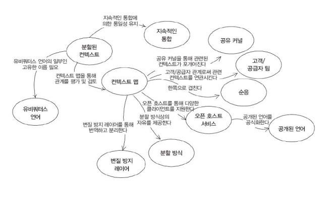

# DDD(Domain Driven Development)
> 도메인 주도 설계란 무엇이며 왜 하는 것일까요?

 

 

## 등장 배경
> 복잡성이라는 도전과제

관료주의, 불명확한 목표와 자원 부족 등의 다양한 이유로 프로젝트는 궤도에서 이탈하게 됩니다. 하지만 얼마나 `복잡한 소프트웨어`를 만들어 낼 수 있는가를 결정하는 주 요인은 **설계 접근법**에 있습니다. 복잡성을 감당하지 못하면 개발자는 더 이상 소프트웨어를 쉽고 안전하게 변경/확장할 수 없지만, 좋은 설계는 이러한 복잡한 특징을 활용할 **기회**를 만들어 줍니다.

수 많은 애플리케이션에서 가장 중요한 복잡성은 기술이 아니라 사용자의 활동이나 업무에 해당하는 `도메인` 자체입니다. 도메인의 복잡성을 설계에서 제대로 다루지 않으면 기반 기술을 잘 이해해도 무용지물이죠. 성공적인 설계라면 소프트웨어 중심 요소인 도메인을 체계적인 방법으로 다룰 것입니다. 따라서 DDD의 전제는 다음과 같습니다.

1. 소프트웨어 프로젝트에서는 가장 먼저 도메인과 도메인 로직에 집중해야 합니다.

2. 복잡한 도메인은 모델을 기반으로 설계합니다.

> +반드시 따를 필요는 없지만 아래에 제시하는 실천법을 지향해보세요.
> 1. 개발은 반복주기를 토대로 진행합니다.
> 		- 애자일 개방 방법론의 토대이며 반복주기를 기반으로 한 개발은 수십 년 동안 지지를 받고 있습니다.
> 2. 개발자와 도메인 전문가는 밀접한 관계에 있어야 합니다.
> 		- 많은 양의 지식을 토대로 모델을 만드는데, 이 모델은 도메인에 대한 깊은 통찰력, 핵심 개념에 집중합니다.
> 		- 즉, 모델은 도메인 전문가와 소프트웨어 개발자 사이에서 일어나는 협업의 결과입니다.
> 		- 또한 개발은 반복주기를 갖고 진행되므로 협업은 프로젝트 전체 생명주기 동안 지속적으로 이뤄져야 합니다.

도메인 주도 설계는 기술적으로 힘든 도전이 맞습니다. 대부분의 소프트웨어 프로젝트가 레거시 시스템으로 굳어버리는 것과는 상반되게 크고 열린 기회를 가져다 줄 수 있습니다.

- 우발적 복잡성(Accidental Complexity)과 본질적 복잡성(Essential Complexity)의 차이

## 레거시 코드
- 빈약한 도메인 모델(Anemic Domain Model)
- 거대한 서비스 레이어(Big Service Layer)

### 전략적 설계
유비쿼터스 언어 - 개발자와 도메인 전문가가 공통적으로 이해 할수 있는 영역의 언어.
- 모든 상황(회의, 코드, 도메인…)에서 사용하는 언어 (언제, 어디에서나)
- 기획자나 개발자는 모두 동일하게 이해할 수 있는 언어를 사용해야 한다.
- 용어사전을 정의 하고 항상 유지 해야 한다.
    - 용어 사전은 죽은 문서가 될 가능성이 많다. 
- 유비쿼터스 언어를 가장 잘 검증해주는 곳은 코드레벨 이다.
    - 개발자의 입장에선 코드레벨에 유비쿼터스 언어가 존재하는것은 좋다. 
    - 기획자와 디자이너도 볼 수 있도록 용어가 추가 될 시 용어 사전을 업데이트 해야한다.
- 용어 사전이란 유비쿼터스 언어를 정리 해둔 사전이다.
    - 프로젝트에 참여하는 모두가 알고 관리 해야한다.

효과적인 모델링
- RouteService 는 RouteSecification 만족하는 plan을 찾는다.
    - 개발자는 RouteService 에 RouteSecification 전달하면 plan return 이라고 해석이 된다.  
Ex ) 환불은 환불정책을 통해서 환불금액이 결정된다.

한팀, 한 언어
- 사업팀도 모델링을 이해하지 못한다면 모델링이 잘못된 것이다.

Bounded Context (문맥 경계)
- 도메인 별로 용어사전이 다르기때문에 동일한 용어를 다른 도메인에서 사용하면 안된다.
- 모델은 특정한 문장(문맥)에서 완전한 의미를 가지게 된다.
- 동일한 단어가 발생하면 Bounded Context 나누기 가장 좋은 상태이다
- Ex) 피자가게있는 피자, 쓰레기통에 있는 피자
  - 피자라는 언어를 사용하지만 문맥에 따라서 피자의 의미가 다르다.

좋은 Bounded Context
- 하나의 Bounded Context는 하나의 팀만 관리 해야 한다.
    - 의견 마찰 및 도메인 영역의 마찰을 줄이기 위해.
    - 하나의 팀이 여러 Bounded Context는 관리 할 수 있다.
- 각각의 Bounded Context는 각각의 개발 환경을 가질 수 있다.
    - 명확히 구분되는 경계를 그엇기 때문이다.
    - MSA로 가는 기초.
    - 어떻게 경계를 나눌것인지를 먼저 생각 해야 한다.

Context Map
- 컨텍스트 맵은 상호 교류하는 시스템의 목록 제공 및 의사소통의 촉매 역할을 한다.
- Upstream : 데이터 제공. (Api, Event)
- DownStream : 데이터 수신.

프로젝트와 조직 관계
- 파트너십 : 두 context가 하나의 트랜잭션으로 묶여있다.
- 공유 커널 : 상호 의존하는 공유 모델을 관리한다.
- 고객 - 공급자(costomer - surpplier) : 업스트림(서버 : 공급자) : 다운스트림(클라이언트 : 고객)으로 단방향 의존한다.
- 순응주의자(Ex_Open API) : 업스트림(서버)가 모든것을 제어한다.
- 오픈 호스트 서비스 : REST/API, RPC, Socket
- 분리된 방법 : 의존 없음
- 큰 진흙공 : 안티 패턴

DDD vs OOP
- Context 마다 서로 유비쿼터스 언어를 다른 도메인으로 인식한다.
- OOP는 상속이나 재활용성을 위해서 공통된 데이터를 공유하는 것을 중요시
- DDD는 도메인 분리를 중시

DDD가 성공할 수 있는 전제 조건
- DDD는 현업의 절대적인 도움이 필요하다.
- 이해관계자의 스폰서십이 적극 필요.

이벤트 스토밍
- 정의
    - 도메인 전문가와 개발자를 학습 과정에 참여시키기 위한 빠른 설계기술
    - 비즈니스 및 비즈니스 프로세스에 중점을 둔다.
        - 클래스와 데이터베이스가 아닌 이벤트와 비즈니스 프로세스에 중점을 둔다.
    - 코드를 없애고 모든 사람을 동일한 수준으로 만드는 시각적 접근

Aggregate
- 이벤트 스토밍 중 같은 단어가 중복적으로 발생하면 집합으로 만든다.
- Aggreate 하나의 하나의 엔티티를 가지는것이 좋지만 항상 지켜야 하는것은 아니다.

 

## 2주차 복습
- 유비쿼터스 언어
	- 유비쿼터스 언어는 회의록, 회의, 코드 등에서 나타난다.
	- 유비쿼터스 언어는 Bounded Context에서만 존재 해야 한다.
	- 코드레벨에서는 유비쿼터스 언어가 검증이 되어야 한다.
	- 검증이 되지 않으면 실패할 가능성이 크다.

- 용어사전
	- 도메인 주도 설계가 성공하기 위해선 용어 사전을 개발자만 참여하는것이 아닌 프로젝트에 참여하는 모두가 관리 해야 한다.
	- 프로젝트가 커질 시 컨텍스트 별로 용어 사전을 정리 해야 한다. (동일한 용어가 다른 의미를 가질 수 있다.)

- 모델링
	- 모델링은 소리 내어 읽었을때 어색하지 않아야 한다.

- Bounded Context
	- BC는 서로 다른 관점을 찾는 것이다. 
	- 우발적인 중복은 충분한 고민을 해봐야 한다.
	- 하나의 BC는 하나의 팀에서만 관리하는것이 베스트이다.

- OOP vs DDD
	- oop 에서의 상속으로 풀수 있는 문제 라고 하더라도 ddd 에선 context 간 분리가 더 중요하다.     
	그로 인해 context 내부에 중복이 발생 할 수도 있다.

- 이벤트 스토밍
	- 단순한 조회 같은 행위는 이벤트가 아닐 수도 있다.
	- 조회를 하여 조회 카운트가 상승했다 와 같은 행위가 이벤트이다.
	- 개발자들은 이벤트 스토밍 도중 기획자나 도메인 전문가 들이 설계를 어렵게 하는 부분에 대해 문제를 제기 할 줄 알아야 한다. 

- Aggregate 
	- 독립된 라이프 사이클을 가지는 무언가

> 공통된 단어가 나오면 반드시 context를 나눠야 한다.  (최소 context 수)
> 최대 context 개수는 는 aggregate 개수

> 도메인 주도 설계는 설게 후 구축이 아닌 설계와 구축이 병렬적으로 진행 되어야 한다.

## 전술적 설계 - ENTITY 와 VALUE OBJECT
- Entity는 지속적으로 상태를 관찰해야할 필요가 있을때 만든다.
- 내부적인 상태가 변하더라도 동일한 객체라고 인식을 해야 할 때 식별자를 만들고 Entity로 만든다.
- 도메인 모델에 setter 가 있으면 해당 도메인 모델은 완전한 상태가 아니게 된다.
	- 버릇처럼 쓰는 setter 는 남발하면 안된다.

- 모든 객체는 불변 객체가 가장 좋다.
	- 새로운 타입의 객체를 만들어서 유효성 검사 로직을 옮긴다.
	- 객체 끼리의 책임을 나누는 방법. 
	- 분리 된 객체는 만들어지거나 실패하거나 원자성을 보장한다.
	- 값 객체 (value object- 불변 객체)는 동일성과 동등성을 보장해야 한다.
		- 가변 객체는 값이 바뀜에 따라 의미가 달라 질 수 있다.
		- 불변 객체는 값이 바뀜에 따라 새로운 불변 객체를 만들어 내야 한다.
		- 불변 객체는 계속 생성이 되면 메모리 부하가 일어나지 않나 ?
			- -> 컴퓨팅 파워와 GC를 믿어야 한다.
	- 불변 객체
		- 포함 되고 있는 모든 값들을 final 로 만든다.
		- 1 + 1 = 2 가 아닌 new int(2)
		- 리스트 같은 멤버 변수는 final을 사용해도 값이 바뀔수 있어서 의식적인 방어적 복사가 필요하다.

# AGGREGATE
- 엔티티와 ValueObject (관련 객체)가 모여있는 군집.
- 반장이라는 개념이 있다 (루트 엔티티)
-  Bounded Context > Context > AGGREATE
- 동일한라이프 사이클을 가진것을 하나의 AGGREGATE로 묶는다.
	- ex) 자동차 인스턴스가 사라지면 내부에 속한 핸들 및 바퀴와 같은 인스턴스도 같이 사라져야 한다.
- 하나의 Aggregate에 속하면 다른 Aggregate에는 속하지 못한다.
- 정리 하면 많은 엔티티들을 동일한 라이프 사이클로 묶어둔 군집
- Aggregate Root
	- 외부에선 해당 aggregate와 대화 하기 위해선 Root에게 요청을 해야 한다.
	- Aggregate Root 도 하나의 엔티티 이기 때문에 내부에 상태를 가지고 있다.
	- 서로 다른 Aggregate와 대화 하기 위해선 반드시 Aggregate Root를 거쳐야 한다. 
	- 내부에 어떤 상태를 가지고 있는지 외부에서는 알지 못한다 (캡슐화)
- 두개 이상의 엔티티가 하나의 Aggretate에 있으면 어떤걸 Root로 할까 ?
	- Aggregate Root 가 될 수 있는 기준은 Global 식별자(외부에서 참조 하고 있는 식별자) 를 가지고 있는것. 따라서 Order가 Root 
	- 로컬 식별자 를 가지고 있으면 루트가 될 수 없다.  
- 정리 하면 글로벌 식별자를 가지고 있어야 루트 에그리게잇이 될 수 있다.
- Aggregate 참조
	- 직접 참조를 허용하면 편리함을 오용한다.
	- ID를 이용한 간접 참조를 권장한다.
		- 복잡도를 낮출 수 있다.
	- 같은 Aggregate 에선 직접 참조 해야 한다.

## Repository 
- Repository 는 구현을 위한 도메인 모델.
- Aggregate 단위로 도메인 객체를 저장하고 조회하는 기능을 정의한다.
- 리포지토리는 Aggregate(Root)단위로 존재하며 테이블 단위로 존재하는 것이 아니다.
	- 리포지토리는 Aggregate을 위한 컬렉션으로 생각하면 된다.

## Service
- 어플리케이션 서비스와 도메인 서비스는 다르다.
- 여러 도메인이 가진 로직들을 하나의 서비스에서 처리 하기 위한 레이어.
- 도메인 서비스라는 것은 엔티티, vo, repository를 만든 상태에서 정책 또는 로직을 특정 애그리게잇의 행위로 지정하기 어려운것들.
- 객체 지향이 아닌 절차 지향적인 로직들을 도메인 서비스로 분리해서 특별하게 관리 할 수 있다.
- 도메인 서비스와 어플리케이션 서비스는 상태값을 가지고 있지 않다는것에선 유사하지만 서로 다루는 서비스 영역이 다르다.

## Factory
- 연관된 Aggregate에서 생성 해보자.
	- ex) 좋은 모델링 - LadderGame 이 종료되야 GameResult 생성
		- 사다리게임이 끝나야 게임 결과를 생성한다 라는것은 게임 결과는 게임을 통해서 알수 있다는 비즈니스 로직을 한눈에 알수 있는것이다.

 

## 3주차 복습
- 전술적 설계 - ddd lite , building block  
  - 특정 디자인 패턴이 필요하다면 building block에 포함되는 것이다.  
- 좋은 객체는 불변한 객체  
  - 도메인 주도 설계 빌딩 블록중 불변인 것들을 vo 라고 부른다.  
  - vo는 equals와 hashcode를 재정의 하는것을 권장한다.  
  - 생성자 보다는 정적 팩토리 메소드를 사용해라.  
- Entity
  - 내부에 상태값이 변하는 객체들은 entity로 만들 수 있다.  
  - entity는 식별자를 갖는다.  
  - 도메인 모델에 set 메서드 넣지 않기  

# Aggregate
- 한 애그리거트에 속한 객체는 다른 애그리거트에 속하지 않는다.  
- 공통적으로 사용하는 애그리거트는 baseAggregate과 같이 trade-off할 수 있다.  

- 수많은 aggregate중 root 로 만드는 방법은 외부에서 바라보는지를 확인 하면 된다.  
- 애그리거트 루트는 일관성이 깨지지 않도록 해야한다.  
  - 생성자로 엔티티를 만들때 모든 속성을 가지고 있어야 한다.  
- 클라이언트는 애그리거트의 내부 구현이 어떻게 되어 있는지 몰라야 한다.  

- Aggregate 참조  
  - subentity를 외부에 노출시키면 안된다.  
  - Root entity를 기준으로 repository를 제공해줘야 한다.  

  - 두개의 aggregate가 필요하다면 domain service가 도출되어야 한다.  
  - 하나의  aggregate에서도 domain service가 발생할 수 있다.  

- Factory  
  - 데이터를 가지고 있는 객체가 일을 하도록 메시지를 던져야 한다.  

## 4주차
- 계층형 아키텍처
	- 표현영역
		- httprequest, response, session을 관리
	- 응용 서비스
		- 로직을 직접 수행하기 보다는 도메인 모델에 로직 수행을 위임.
		- 도메인 영역에서 발생시킨 이벤트를 처리.
	- 도메인 서비스
		- 로직에 대한 버전 관리를 해야할 필요가 있는 경우 도메인 서비스가 될 수 있다.
		- 두개 이상의 aggregate를 사용하면 반드시 도메인 서비스가 되어야 한다.
			- 같은 aggregate라도 두개 이상을 사용한다면 도메인 서비스.
	- 메서드 파라미터와 값 리턴
		- 응용 서비스에 데이터로 전달할 파라미터가 두개 이상이면 데이터전달을 위한 별도 클래스를 사용하는것이 편리.
		- 응용 서비스는 표현 영역에서 필요한 데이터만 리턴하는 것이 기능 실행 로직의 응집도를 높이는 확실한 방법.
	- 값 검증
		- 값 검증은 표현영역과 응용 서비스 두 곳에서 모두 수행 할 수 있다.
		- 표현 영역에서 필수 값과 값의 형식을 검사하면 실질적으로 응용 서비스는 아이디 중복 여부와 같은 논리적 오류만 검사하면 된다.
	- 인터페이스는 어느 시점에 생성하는것이 적절한가
		- 외부와 연동할 가능성이 크거나 연동하고 있는 것은 인터페이스를 만드는 것이 좋다.
- DTO
	- DTO는 프로세스 간에 데이터를 전달하는 객체가 아니고 구조체 라고 보는것이 맞다.
	- value object는 dto가 아니다.
	- value object는 어플리케이션 내부의 요구사항으로 만들어지고 dto는 어플리케이션 외부의 요구사항을 반영한다.
	- dto에서 entity를 만드는것은 괜찮으나 entity 에서 dto를 만드는것은 불가하다.
	- domain model everywhere
	- pure domain model
		- 항상 dto를 만드는 것은 실용적이지 않다.
			- -> vo로 해결 가능한 것은 vo로 해결 해도 된다.
			- vo는 영역과 관계없이 사용가능하기 때문이다.
- 의존 역전 원칙
	- 고수준 모듈의 의존 문제
		- 저수준 모듈의 변경에 따라 고수준 모듈의 변경이 불가피 해진다.
	- DIP 주의 사항
		- 추상화 한 인터페이스는 저수준 모듈이 아닌 고수준 모듈에 위치 해야 한다.
		- 실제 구현은 infrastructure에서 구현(저수준)
	- 육각형, 양파, 클린 아키텍처
		- 공통된 목적은 내부에 있는 domain layerr를 외부로 부터 숨기고 지키는것이다.
		- 내부는 외부를 모르고 외부는 내부를 몰라야 한다.
- anti corruption layer
	- 외부로부터 내부 도메인 레이어를 지키기 위한 계층

- 주 생성자 -> 모든 상태를 가지고 있는 생성자
- 부 생성자 -> 부생성자가 주 생성자를 호출하는 방법
- 최상단 패키지는 Bounded Context로 나누고 Aggregate은 domain package에서 나누는 방
- menu product가 price를 가지도록
- infra - product 와 관련된 클래스를 만들고 productservice를 주입 받아 price를 얻는다 ? -> anti corruption layer 만든다

 

## 4주차 복습
- 비즈니스 로직 수행은 어느 곳에 하는 것이 좋을까 ?
	- 도메인 레이어에서 기능을 수행하고 다른 응용 및 표현 레이어에서 해당 기능을 사용한다.
- 응용 서비스
	- 사용자의 요청에 맞는 도메인 모델을 찾아오고 그 모델의 로직을 위임하는 처리를 한다.
- 도메인 서비스
	- 응용 서비스와 도메인 서비스를 판단 하는 기준
		- 두개 이상의 애그리거트가 사용될때
		- 다루고 있는 로직이 위키나 지라에 정리를 해야할 필요성이 있는 경우
		- 두가지 조건을 한줄로 요약하면 도메인 지식이 다른곳으로 흘러가는것을 막아주는 역할을 한다.
		- 도메인 서비스는 어플리케이션 레이어와 도메인 레이어 사이에 위치한다.
- 응용 서비스의 구현
- vo가 dto로 돌아다녀 외부에 노출된다면 캡슐화가 깨지는것이 아닌가 ?
	- vo가 dto로 돌아다니는 것은 일종의 trade-off이다.
	- vo의 접근 제어자를 default로 두어 도메인 패키지 내부에서만 사용할수 있도록 만드는것도 하나의 방법이다.
- 항상 DTO를 만드는것은 실용적이지 않아 DTO를 대신 할 수 있는 VO를 찾는것도 방법이다.
- 고수준 모듈 저수준 모듈
	- 고수준 모듈이 저수준 모듈에 의존하는것이 아니고 저수준 모듈이 고수준 모듈에 의존하도록 dip를 적용해야 한다.
- 클린 아키텍처
	- 안에선 밖을 모르고 밖에선 안을 알수 있는 아키텍처
	- 도메인 모델을 외부로 부터 지키는 것이 중요하다.
- anticorruption layer
	- anticorruption layer 하는 역할이 크다면 별도의 레이어로 만들수도 있고 클래스로도 만들 수 있다.
	- 많은 mapper class assemblr pattern이 등장 하더라도 나의 도메인 모델을 지킬 수 있다.
- 도메인 서비스 구현 방법
	- 응용 서비스에서 도메인 서비스를 주입 받고 응용서비스 내부에서 메시지를 전달한다.
	- 해당 도메인 서비스에서는 도메인들을 가지고 와서 실제 로직을 실행하는 과정을 거친다. 
	- repository는 domain service에 담고 있다.
	- repository에서 실행하는 save와 같은 데이터 추가는 실제로 DB에 값이 저장되지는 하지만 도메인 입장에서는 add와 같은 기능을 한다고 생각하여 repository가 infra영역이 아닌 domain 영역에 있다고 본다.
	- Domain layer가 필요 없는 상황 (하나의 도메인만 사용한다면) application layer에서 처리
	- 도메인 모델에서 에러 같은 경우는 try - catch하여 상위 레이어에 노출되지 않도록 막아준다.
		- 상위 레이어에서 알 수 있는 에러를 핸들링 할수 있도록 하는 것.
- DTO 가이드
	- dto를 도메인으로 전환하고 도메인을 dto로 전환하는건 application service에서 담당하는것이 맞다.
	- dto가 데이터를 담아서 전달 할 수 있는 영역은 application service까지 이다.
- 모놀리식 아키텍처는 다른 패키지의 서비스를 주입 받아서 사용하지만 마이크로 서비스로 분리 되는 경우 변경이 힘들다. 
- 외부 컨텍스트에서 발생한 예외 또한 내부 컨텍스트에서 이해할 수 있는 에러로 감싸주어야 한다.
- infrastructure layer가 anti corruption layer 역할을 할 수도 있다.
- exception은 domain 패키지에 위치
- anticorruptionlayer 도메인 내부 에그리게잇 폴더에 위치 
- order - buyer 예시에선 order 에그리게잇이 root가 되었다. 내부에 order , order item entity를 가지고 있고 vo 도 가지고 있다.

## 전술적 설계 - Domain Event
- 이벤트란 도메인 전문가가 관심을 가질 법한 것들 (단순 조회 제외)
- 강한 결합
- 이벤트
	- 이벤트는 어떤 상태가 변경되었다는것이다.
	- 도메인 모델에서 이벤트를 관리 하는 주체는 에그리게잇이 될 수 있다.
	- 이벤트 핸들러는 이벤트에 담긴 주체를 가지고 부가적인 행동을 하게 된다.
	- 스프링에선 application event publisher 가 트랜잭션이 종료될때 이벤트를 발행 해 준다.
		- 테스트 코드에선 이벤트가 발행되었는지 안되었는지만 확인 하면 된다.
	- 스프링 이벤트는 기본적으로 한 트랜젝션 내부에선 묶여있다.  
		- 하나가 실패하면 롤백되는 구조이다.
		- TransactionalEventListener 를 사용하면 트랜잭션이 끝난 후 동작하도록 사용할 수 있다.
	- 스프링 이벤트를 사용하지 않고 이벤트를 발행 하려면 AbstractAggregateRoot 를 상속 받아 registerEvent()으로 이벤트를 발생할 수 있다. 이떄는 save를 강제로 호출 해줘야 한다.
	- 도메인 내부에 이벤트를 가지고 있어야 한다.
	
- 이벤트 소싱
	- 도메인 모델에서 발생하는 모든 이벤트를 기록하는 방법

- CQRS
	- 상태를 변경하는 명령과 모델의 상태를 조회하는 모델을 분리한 패턴.
	- 커멘트 패키지와 조회 패키지등으로 분리 할 수 있다.