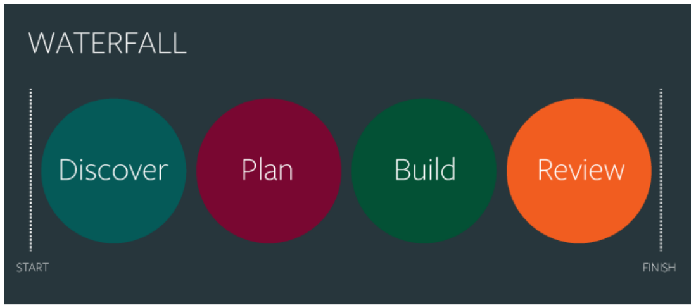
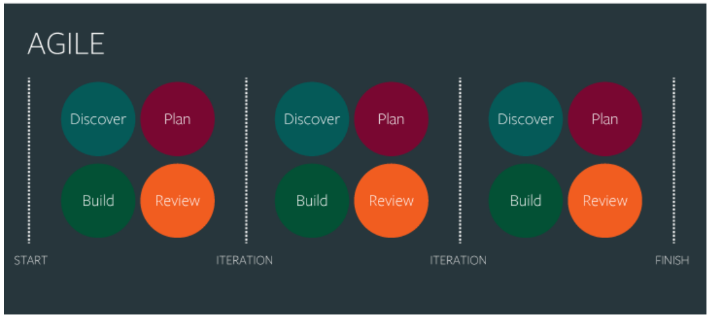

# 소프트웨어 개발 방법론

## :bar_chart: WaterFall
> 미리 정해진 몇 개의 단계가 마치 폭포수처럼 위에서 아래로 차례대로 진행되는 일직선 형태의 방법론입니다.

### 진행 과정

 

1. 계획 및 분석
   - `현재의 수준` 과 `고객의 요구사항`의 Gap을 분석하고, 이행을 위해 준비하는 단계입니다.
   - 고객의 요구사항을 파악하여 기능과 제약조건을 정의하는 명세서를 작성합니다.
2. 설계
   - `계획 및 분석` 단계의 산출물을 바탕으로 설계서를 작성합니다.
   - 작성 된 분석 모델을 세부적으로 추상화하여 쪼개어 구현 가능한 형태로 전환하는 단계입니다.
3. 개발
   - `설계` 단계의 산출물을 바탕으로 개발합니다.
   - 코딩과 디버깅으로 프로그램 개발을 수행합니다.
4. 시험
   - `개발` 단계의 산출물인 프로그램이 정상적으로 동작하는지 시험합니다.
   - 단위(모듈, 소규모 기능) 테스트, 통합(전체 프로세스) 테스트로 구분됩니다.
5. 운영 및 유지보수
   - `시험` 단계에서 완료된 시스템 운용 간 발생하는 문제점을 해결합니다.
   - 추가적인 기능의 구현, 수정 등 시스템 변경에 대응합니다.

### 특징
1. 계획 중심적
   - 각 단계가 정해져 있으므로 최초에 정의한 단계별 요구 사항을 `수치로서` 측정하여 계획을 수립한 뒤 실제 결과만을 기록하며 수행합니다.
2. 문서로 진척도 관리
   - 계획에 따른 진척률을 문서로서 진단합니다.
3. 마지막에 수행하는 테스트
   - 마지막 전까지 개발된 프로그램을 통합하지 않습니다. 그 이유는 초기 계획을 수립할 때 모든 과정을 기록하고 계산하였으니 `완벽`하다고 기대하기 때문입니다.
4. 수직적인 개발
   - 건물을 짓는 것과 같은 방법론입니다. 흩어진 모듈(기능)별 아래에서부터 개발을 진행하기 때문에 튼튼할 수 있습니다.
5. 빅뱅(Big Bang) 릴리즈
   - 이 또한 요구사항이 완벽함을 전제로 합니다. 따라서 시스템 통합을 한 번에 수행합니다.
6. 요구사항을 미리 정의
   - `계획 및 분석` 단계에서 모든 요구사항을 수집하므로 이후에 일어날 디자인 또는 기능의 변동사항에 대해 대처하기 힘듭니다.
7. 고객과의 의사소통 결여
   - 문서 중심의 개발 방법론입니다. 고객과의 직접적인 소통보다 문서를 통한 진척도와 요구사항 등 세부 항목을 다루므로 개발 기간 동안 한정적인 협업이 이루어집니다.

 

## :wrench: Agile
> `애자일`(Agile, 기민하다는 뜻으로 좋은것을 빠르고 낭비없게 만드는 것)은 개발을 가능하게 해 주는 다양한 방법론 전체를 일컫는 말입니다.

일정 주기로 지속적인 프로토타입 제작 및 고객과의 소통을 유도하여 빠른시간 안에 모두가 만족하는 결과물을 완성하기 위한 방법론입니다.

폭포수 방법론은 미래를 예측하기 힘들고 효율적이지 못합니다. 또한 계획에 너무 의존하여 형식적인 절차를 따르는데 많은 시간과 비용이 소요됩니다. 즉, 전체적인 개발의 흐름을 느리게 했습니다.

이를 극복하기 위해 문서 지향성 감소(Less Document-oriented)와 코드 지향(Code-oriented)적인 방법론이 등장하였는데, 그것이 애자일입니다.

### 애자일 선언문
**Individuals and interactions over processes and tools** 
`프로세스와 도구보다 개개인과 상호 소통이 더 중요합니다.`

**Working software over comprehensive documentation** 
`포괄적인 문서화보다 제대로 동작하는 소프트웨어가 더 중요합니다.`

**Customer collaboration over contract negotiation** 
`계약 협상보다 고객과의 협력이 더 중요합니다.`

**Responding to change over following a plan** 
`세워진 계획을 따르기보다는 변화에 대한 대응이 더 중요합니다.`

 

### 진행 과정

 

자세한 내용은 [애자일 뜯어보기]()를 참고하세요.

 

### 특징
1. 미래를 예측하는 개발이 아닌, 일정한 주기로 끊임없이 `프로토타입(Prototype)`을 작성합니다.
   - 그때 그때 필요한 요구를 더하고 수정하여 하나의 커다란 소프트웨어를 개발해 나가는 Adaptive Style입니다.
2. 애자일 개발 프로세스란 어느 특정 개발 방법론을 가리키는 말이 아닙니다.
   - 예전에는 `경량`(Lightweight) 프로세스로 불렸습니다.
3. 문서 중심이 아닌 동작하는 프로그램 중심입니다.
4. 프로젝트 초기부터 종료까지 고객과의 의사소통과 점진적인 요구사항 분석 및 반영으로 신뢰도가 상승합니다.
5. 고객이 프로젝트의 일원처럼 지속적으로 참여하므로 개발되는 프로그램에 대한 사전 교육이 가능합니다.
6. 폭포수 방법론의 빅뱅 릴리즈처럼 마지막에 요구사항이 몰리지 않습니다.

 

