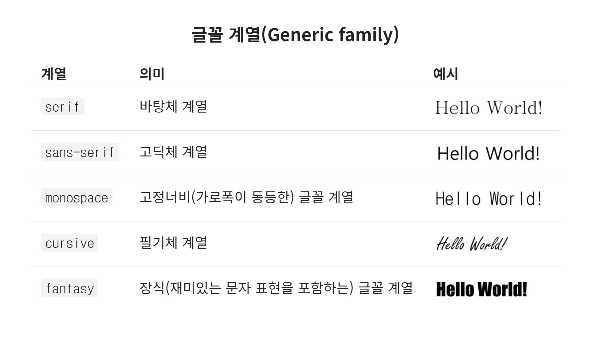

# 4일차

## CSS

### CSS Reset

> 브라우저별 설정된 기본 style이 다르므로 이를 통일시키기 위해 초기화 시킨다.

- [reset.css cdn](https://www.jsdelivr.com/package/npm/reset-css)

### Emmet

> 선택자를 통해 쉽게 태그를 만드는 문법

## CSS 개요, 선택자, 상속

### 기본 문법

- 선택자

  ```css
  선택자 {
    속성: 속성값;
    속성: 속성값;
  }

  div {
    background: red;
  }
  ```

- 주석

  ```css
  /*Comment*/
  ```

### 선언방식

- 인라인(in-line) 방식 : HTML 요소(태그)의 `'style'` 속성에 직접 작성

  ```html
  <div style="color:red;">in-line css</div>
  ```

  - 직접 손으로 입력하는 행위는 지양(유지보수가 힘듦)

- 내장(embedded) 방식 : HTML `<style></style>` 안에 작성하는 방식

  ```html
  <head>
    <style>
      div {
        color: red;
      }
    </style>
  </head>
  <body>
    <div>embedded</div>
  </body>
  ```

- 링크(link) 방식 : HTML `<link>`를 이용하여 외부 CSS 문서를 불러와 적용하는 방식

  ```html
  <head>
    <link rel="stylesheet" href="./main.css" />
  </head>
  <body>
    <div>link</div>
  </body>
  ```

  - 병렬 호출, 거의 동시에 불러오기가 완료

- @import(at import) 방식 : CSS의 @import를 이용하여 외부 CSS 문서를 불러와 적용하는 방식

  ```css
  <head>
      <link rel="stylesheet" href="./main.css" />
  </head>
  <body>
      <div>link</div>
  </body>

  /*main.css*/
  @import url("./common.css");

  /*common.css*/
  div {
    color:red;
  }
  ```

  - 직렬 호출, 순차적인 불러오기로 주의하여 사용

### 선택자(Selector) : 기본 선택자(Basic Selectors)

- 전체 선택자(Universal Selector) : 요소 내부의 모든 요소를 선택

  ```css
  * {
    color: red;
  }
  ```

- 태그 선택자(Type Selector) : 태그 이름이 `<E>`인 모든 요소 선택

  ```css
  li {
    color: red;
  }
  ```

- 클래스 선택자(Class Selector) : HTML `class 속성`의 값이 `E`인 모든 요소 선택

  ```css
  .apple {
    color: red;
  }
  ```

  ```html
  <div class="apple">class1</div>
  <div class="apple">class2</div>
  <div class="apple">class3</div>
  ```

- 아이디 선택자(Id Selector) : HTML `id 속성`의 값이 `E`인 단일 요소 선택

  ```css
  #apple {
    color: red;
  }
  ```

  ```html
  <div class="apple">id1</div>

  <div id="apple" class="apple">id2</div>
  ```

### 선택자(Selector) : 복합 선택자(Combinators)

- 일치 선택자(Basic Combinator) : `E`와 `F`를 동시에 만족하는 요소 선택

  ```css
  span.apple {
    color: red;
  }
  ```

  ```html
  <div class="apple">basic1</div>

  <span class="apple">basic2</span>
  ```

- 자식 선택자(Child Combinator) : `E`의 `자식 요소 F`를 선택

  ```css
  div > .apple {
    color: red;
  }
  ```

  ```html
  <span class="apple">child1</span>

  <div>
    <span class="apple">child2</span>
  </div>
  ```

- 후손(하위) 선택자(Descendant Combinator) : `E`의 `후손(하위) 요소 F`를 모두 선택

  - `띄어쓰기`가 선택자의 기호로 사용된다.

    ```css
    div .apple {
      color: red;
    }
    ```

    ```html
    <div>
      <div class="apple">div1</div>
      <span class="apple">span1</span>
      <p class="apple">p1</p>
    </div>
    ```

- 인접 형제 선택자(Adjacent Sibling Combinator) : `E`의 `다음 형제 요소 F` 하나만 선택

  ```css
  .apple + span {
    color: red;
  }
  ```

  ```html
  <div class="apple">div1</div>

  <span>span1</span>
  ```

- 일반 형제 선택자(General Sibling Combinator) : `E`의 `다음 형제 요소 F` 모두 선택

```css
.apple ~ span {
  color: red;
}
```

```html
<span>span1</span>

<div class="apple">div1</div>

<span>span2</span>
<span>span3</span>
```

### 가상 클래스 선택자(Pseudo-Classes Selectors)

- hover : `E`에 마우스(포인터)가 올라가 있는 동안에만 `E` 선택

  ```css
  a:hover {
    font-weight: bold;
  }
  ```

- active : `E`를 마우스로 클릭하는 동안에만 `E` 선택

  ```css
  div:active {
    width: 200px;
  }
  ```

- focus : `E`가 포커스 된 동안에만 `E`선택

  - 대화형 콘텐츠에서 사용 가능(input, img, tabindex)

    ```css
    input:focus {
      border-color: red;
      width: 200px;
    }
    ```

- first child : `E`가 형제 요소 중 첫번째 요소라면 선택

  ```css
  .fruits li:first-child {
    color: red;
  }

  /* 이것도 가능함 */
  /* 후손의 모든 첫번째 요소 선택*/
  .fruits :first-child {
    color: blue;
  }
  ```

  ```html
  <ul class="fruits">
    <!-- 선택 -->
    <li>사과</li>
    <li>포도</li>
    <li>오렌지</li>
  </ul>
  ```

- last child : `E`가 형제 요소 중 마지막 요소라면 선택

  ```css
  .fruits li:last-child {
    color: red;
  }
  ```

  ```html
  <ul class="fruits">
    <li>사과</li>
    <li>포도</li>
    <!-- 선택 -->
    <li>오렌지</li>
  </ul>
  ```

- nth-child : `E`가 형제 요소 중 n번째 요소라면 선택(n 키워드는 0부터 해석(Zero-base))

  - 자연수

    ```css
    .fruits li:nth-child(2) {
      color: red;
    }
    ```

    ```html
    <ul class="fruits">
      <li>사과</li>
      <!-- 선택 -->
      <li>포도</li>
      <li>오렌지</li>
      <li>바나나</li>
    </ul>
    ```

  - `자연수 * n` : `자연수 * n` 요소들 선택

    ```css
    .fruits li:nth-child(2n) {
      color: red;
    }
    ```

    ```html
    <ul class="fruits">
      <li>사과</li>
      <!-- 선택 -->
      <li>포도</li>
      <li>오렌지</li>
      <!-- 선택 -->
      <li>바나나</li>
    </ul>
    ```

  - `자연수 + n` : n 이후 요소들 선택

    ```css
    .fruits li:nth-child(n + 3) {
      color: red;
    }
    ```

    ```html
    <ul class="fruits">
      <li>사과</li>
      <li>포도</li>
      <!-- 선택 -->
      <li>오렌지</li>
      <!-- 선택 -->
      <li>바나나</li>
    </ul>
    ```

  - n 번째 자식 요소가 조건에 부합되지 않으면 선택되지 않는다.

    ```css
    .fruits p:nth-child(1) {
      color: red;
    }
    ```

    ```html
    <div class="fruits">
      <div>사과</div>
      <p>포도</p>
      <p>오렌지</p>
      <span>바나나</span>
    </div>
    ```

- nth-of-type : `E`의 타입(태그 이름)과 동일한 타입인 형제 요소 중 `E`가 n번째 요소라면 선택(n 키워드는 0부터 해석(Zero-base))

  ```css
  .fruits li:nth-of-type(1) {
    color: red;
  }
  ```

  ```html
  <ul class="fruits">
    <li class="red">사과</li>
    <li>포도</li>
    <li class="red">딸기</li>
    <li>바나나</li>
  </ul>
  ```

- 부정 선택자(Negation Selector) : `S`가 아닌 `E` 선택

  ```css
  .fruits li:not('apple') {
    color: red;
  }
  ```

  ```html
  <ul class="fruits">
    <li class="apple">사과</li>
    <li>포도</li>
    <li>딸기</li>
    <li>바나나</li>
  </ul>
  ```

### 가상 요소 선택자(Pseudo-Elements Selectors)

> 가상 클래스와는 다르게 CSS를 통해서 HTML에 가상의 요소를 제공

- before : `E` 요소 내부의 앞에, 내용(content)을 삽입

  - 가상 클래스는 `:` 하나, 가상 요소는 `::` 두개
  - 반드시 `content` 속성이 존재해야 한다.

  ```css
  ul li::before {
    content: '';
    width: 30px;
    height: 30px;
    background: red;
    margin-right: 20px;
    display: inline-block;
    border-radius: 50%;
  }
  ```

  ```html
  <!-- ul>li{숫자$}*10-->
  <ul>
    <li>1</li>
    <li>2</li>
    <li>3</li>
    <li>4</li>
    <li>5</li>
    <li>6</li>
    <li>7</li>
    <li>8</li>
    <li>9</li>
    <li>10</li>
  </ul>
  ```

- after : `E` 요소 내부의 뒤에, 내용(content)을 삽입

  ```css
  ul li::after {
    content: url('https://이미지경로');
  }
  ```

  ```html
  <!-- ul>li{숫자$}*10-->
  <ul>
    <li>1</li>
    <li>2</li>
    <li>3</li>
    <li>4</li>
    <li>5</li>
    <li>6</li>
    <li>7</li>
    <li>8</li>
    <li>9</li>
    <li>10</li>
  </ul>
  ```

### 속성 선택자(Attribute Selectors)

- attr : 속성 `attr`을 포함한 요소 선택

  ```css
  [disabled] {
    opacity: 0.5;
    color: red;
  }
  ```

  ```html
  <input type="text" value="attr test" disabled />
  ```

- attr=value : 속성 `attr`을 포함하며 속성 값이 `value인 요소` 선택

  ```css
  [type='password'] {
    opacity: 0.5;
    color: red;
  }
  ```

  ```html
  <input type="password" value="1234" />
  ```

- attr^=value : 속성 `attr`을 포함하며 속성 값이 `value로 시작하는 요소` 선택

  ```css
  [class^='btn-'] {
    font-weight: bold;
    border-radius: 20px;
  }
  ```

  ```html
  <button class="btn-success">Success</button>
  <button class="btn-danger">Danger</button>
  <button>Noraml</button>
  ```

- attr$=value : 속성 `attr`을 포함하며 속성 값이 `value로 끝나는 요소` 선택

  ```css
  [class$='success'] {
    color: green;
  }
  [class$='danger'] {
    color: red;
  }
  ```

  ```html
  <button class="btn-success">Success</button>
  <button class="btn-danger">Danger</button>
  <button>Noraml</button>
  ```

### 상속(Inherit)

> 조상의 속성이 하위 요소들에게도 적용되는 것

- 일반적인 상속

  ```css
  .ecosystem {
    color: red;
  }
  ```

  ```html
  <!-- 전부 color:red; 적용 -->
  <div class="ecosystem">
    <div class="animal"
      >동물
      <div class="tigar">호랑이</div>
      <div class="lion">사자</div>
      <div class="elephant">코끼리</div>
    </div>
  </div>
  ```

  - 상속되는 속성 : 기본적으로 글자를 다루는 속성은 상속이 가능하다.
    1. font(font-size, font-weight, font-style, line-height, font-family)
    2. color
    3. text-align
    4. text-indent
    5. text-decoration
    6. letter-spacing
    7. opacity 등

- 강제 상속

  ```css
  .parent {
    position: absolute; /*상속 되지 않는 속성 값*/
  }

  .child {
    position: inherit; /*강제로 상속 받은 것으로 position:absolute와 동일*/
  }
  ```

  ```html
  <div class="parent">
    <div class="child"></div>
  </div>
  ```

  - 상속되지 않는 속성(값)도 inherit이라는 값을 사용해 `부모`에서 `자식`으로 강제 상속시킬 수 있다.
    - `자식`을 제외한 `후손`에게는 적용되지 않으며 모든 속성이 강제 상속을 사용할 수 있는 것은 아니다.

### 우선순위

> 같은 요소가 여러 선언의 대상이 될 경우 어떤 선언의 CSS 속성(property)을 우선 적용할지 결정하는 방법

- 명시도 점수가 높은 선언이 우선이다.

  - 점수가 같은 경우, 가장 마지막에 해석(늦게 작성한)되는 선언이 우선이다.
  - 명시도는 `상속` 규칙보다 우선이다.
  - `!important`가 적용된 선언 방식이 다른 모든 방식보다 우선이다.

  ```html
  <body>
    <!--인라인 선언방식-->
    <div id="color_yellow" class="color_green" style="color: orange;"
      >Hello world!</div
    >
  </body>
  ```

  ```css
  /* !important : 점수 무한대*/
  div {
    color: red !important;
  }

  /*인라인 선언방식 : 점수 1000pt*/

  /* 아이디 선택자 : 점수 100pt */
  #color_yellow {
    color: yellow;
  }

  /* 클래스 선택자 : 점수 10pt */
  .color_green {
    color: green;
  }

  /* 태그 선택자 : 점수 1pt */
  div {
    color: blue;
  }

  /* 전체 선택자 : 점수 0pt */
  * {
    color: darkblue;
  }

  /* 상속 : 점수 없음 */
  body {
    color: violet;
  }
  ```

  - 주의사항
    - `가상 클래스`는 `클래스` 선택자의 점수(10pt)를 가진다.
    - `가상 요소`는 `태그` 선택자의 점수(1pt)를 가진다.
    - 부정 선택자 `:not()`은 점수를 가지지 않는다.

## CSS의 단위

### px, %

- px : 해상도에 따른 상대적 단위

  - 고정하기 위해 사용하는 절대 수치

- % : 부모 요소에 따른 상대적 단위

### em, rem

> 폰트 사이즈에 따른 상대적 단위

- em : 자기 자신이 가진 폰트 사이즈의 단위

  - 조상 요소의 폰트 사이즈에 영향을 받는다.

- rem : `root-em`으로 `html`에 지정된 폰트 사이즈의 단위

  - html에 rem용 폰트 사이즈를 지정한 뒤, body로 초기화 할 수 있다.

  ```css
  html {
    font-size: 10px;
  }

  body {
    font-size: 16px;
  }
  ```

### vw, vh

> viewport, 화면에 보이는 비율

- vw : viewport의 width, 화면에 보이는 절반 너비

- vh : viewport의 height, 화면에 보이는 절반 높이

### vmin, vmax

> viewport의 최소/최대 너비와 높이

- vmax : 가로/세로의 백분율 중 긴 쪽을 계산한다.

- vmin : 가로/세로의 백분율 중 짧은 쪽을 계산한다.

## CSS 속성 - 박스 모델

### width, height

- 블럭 요소와 인라인 요소에 따른 width, height 기본값이 다르다.

  ```css
  div {
    width: auto; /* 100% */
    height: auto; /* 0 */
  }
  span {
    width: auto; /* 0 */
    height: auto; /* 0 */
  }
  ```

### max-width/height, min-width/height

> 최소/최대를 정하여 제한

- max-width : 최대 가로 너비(기본값 `none`)
- max-height : 최대 세로 너비(기본값 `none`)
- min-width : 최소 가로 너비(기본값 `0`)
- min-height : 최소 세로 너비(기본값 `0`)

### margin

> 요소의 외부 여백을 지정

```css
margin: 위 우 아래 좌;
margin: 위 [좌, 우] 아래;
margin: [위, 아래] [좌, 우];
margin: [위, 아래, 좌, 우];

/* 시계방향 */

.box {
  margin: 10px 20px 30px 40px;
  margin: 10px 20px 40px;
  margin: 10px 40px;
  margin: 10px;
}
```

- margin에 `%`값을 입력하면 부모 요소의 `너비`에 대한 비율로 지정한다.

- 음수 값을 사용할 수 있다.

- 단축 속성이다.

  ```css
  .box1 {
    margin: 10px 20px 30px 40px; /* 단축속성 */
  }
  .box2 {
    /* 개별속성 */
    margin-top: 10px;
    margin-right: 20px;
    margin-bottom: 30px;
    margin-left: 40px;
  }
  ```

### margin 중복(collapse)

> margin의 특정 값들이 `중복`되어 합쳐지는 현상

- 상황

  - 형제 요소들의 margin-top과 margin-bottom이 만났을 때
  - 부모 요소의 margin-top과 자식 요소의 margin-top이 만났을 때
  - 부모 요소의 margin-bottom과 자식 요소의 margin-bottom이 만났을 때

- 중복 값을 계산하는 방법

  | 조건             | 요소A 마진 | 요소B 마진 | 계산법              | 중복 값 |
  | ---------------- | ---------- | ---------- | ------------------- | ------- |
  | 둘 다 양수       | 30px       | 10px       | 더 큰 값으로 중복   | 30px    |
  | 둘 다 음수       | -30px      | -10px      | 더 작은 값으로 중복 | -30px   |
  | 각각 양수와 음수 | -30px      | 10px       | -30 + 10 = -20      | -20px   |

### padding

> 요소의 내부 여백을 지정

```css
padding: 위 우 아래 좌;
padding: 위 [좌, 우] 아래;
padding: [위, 아래] [좌, 우];
padding: [위, 아래, 좌, 우];

/* 시계방향 */

.box {
  padding: 10px 20px 30px 40px;
  padding: 10px 20px 40px;
  padding: 10px 40px;
  padding: 10px;
}
```

- padding에 `%`값을 입력하면 부모 요소의 `너비`에 대한 비율로 지정한다.

- 단축 속성이다.

  ```css
  .box1 {
    padding: 10px 20px 30px 40px; /* 단축속성 */
  }
  .box2 {
    /* 개별속성 */
    padding-top: 10px;
    padding-right: 20px;
    padding-bottom: 30px;
    padding-right: 40px;
  }
  ```

- 내부 여백을 지정하므로 padding 값 만큼 요소의 크기가 커진다.
  - 크기가 커지지 않도록 직접 계산한다면 width, height와 padding 값을 각각 더한다.
  - 크기가 커지지 않도록 자동 계산한다면 `box-sizing : border-box;` 옵션으로 브라우저에게 계산을 할당한다.

### border

> 요소의 테두리 선을 지정

```css
border: 두께 종류 색상;

.box {
  border: 1px solid red;
}
```

- 단축 속성이다.
  - border-width, border-style, border-color

### border : border-width

> 선의 두께(너비)

```css
border-width: 위 우 아래 좌;
border-width: 위 [좌, 우] 아래;
border-width: [위, 아래] [좌, 우];
border-width: [위, 아래, 좌, 우];

/* 시계방향 */

.box {
  border-width: 10px 20px 30px 40px;
  border-width: 10px 20px 40px;
  border-width: 10px 40px;
  border-width: 10px;
}
```

- 개별 속성

  | 값     | 의미                      | 기본값 |
  | ------ | ------------------------- | ------ |
  | medium | 중간 두께                 | medium |
  | thin   | 얇은 두께                 |        |
  | thick  | 두꺼운 두께               |
  | 단위   | px, em, cm 등 단위로 지정 |        |

### border : border-style

> 선의 종류

```css
border-style: 위 우 아래 좌;
border-style: 위 [좌, 우] 아래;
border-style: [위, 아래] [좌, 우];
border-style: [위, 아래, 좌, 우];

/* 시계방향 */

.box {
  border-style: solid dotted double inset;
  border-style: solid dotted inset;
  border-style: solid inset;
  border-style: solid;
}
```

- 개별 속성

  | 값     | 의미                               | 기본값 |
  | ------ | ---------------------------------- | ------ |
  | none   | 선 없음                            | none   |
  | hidden | 선 없음과 동일(table요소에서 사용) |        |
  | solid  | 실선(일반선)                       |        |
  | dotted | 점선                               |        |
  | dashed | 파선                               |        |
  | double | 두 줄선                            |        |
  | groove | 홈이 파여있는 모양(선)             |        |
  | ridge  | 솟은 모양(선, groove의 반대)       |        |
  | inset  | 요소 전체가 들어간 모양(선)        |        |
  | outset | 요소 전체가 나온 모양(선)          |        |

### border : border-color

> 선의 색상

```css
border-color: 위 우 아래 좌;
border-color: 위 [좌, 우] 아래;
border-color: [위, 아래] [좌, 우];
border-color: [위, 아래, 좌, 우];

/* 시계방향 */

.box {
  border-color: red blue #fff rgba(0, 0, 0, 0.5);
  border-color: red blue rgba(0, 0, 0, 0.5);
  border-color: red rgba(0, 0, 0, 0.5);
  border-color: red;
}
```

- 개별 속성

  | 값          | 의미                            | 기본값 |
  | ----------- | ------------------------------- | ------ |
  | 색상        | 선의 색상을 지정                | black  |
  | transparent | 투명한 선(요소의 배경색이 보임) |        |

### box-sizing

> 요소의 크기 계산 기준을 지정

- 속성

| 값          | 의미                                                                                       | 기본값  |
| ----------- | ------------------------------------------------------------------------------------------ | ------- |
| content-box | 너비(width, height)만으로 요소의 크기를 계산                                               | 기본 값 |
| border-box  | 너비(width, height)에 안쪽 여백(padding)과 테두리 선(border)를 포함하여 요소의 크기를 계산 |         |

### display

> 요소의 박스 타입(유형)을 설정

| 값           | 의미                                   |
| ------------ | -------------------------------------- |
| block        | 블록 요소(`<div>` 등)                  |
| inline       | 인라인 요소(`<span>` 등)               |
| inline-block | 인라인-블록 요소(`<input>` 등)         |
| 기타         | table, table-cell, flex 등             |
| none         | 요소의 박스 타입이 없음(요소가 사라짐) |

### overflow

> 요소의 크기 이상으로 내용(자식요소)이 넘쳤을 때 내용의 보여짐을 제어

| 값      | 의미                                                               | 기본값  |
| ------- | ------------------------------------------------------------------ | ------- |
| visible | 넘친 부분을 자르지 않고 그대로 보여줌                              | visible |
| hidden  | 넘친 부분을 잘라내고, 보이지 않도록 함                             |         |
| scroll  | 넘친 부분을 잘라내고, 스크롤바를 이용하여 볼 수 있도록 함          |         |
| auto    | 넘친 부분이 있는 경우만 잘라내고, 스크롤바를 이용하여 볼 있도록 함 |         |

- overflow-x : 요소의 x축(좌, 우)으로 내용이 넘쳤을 때, overflow 지정
- overflow-y : 요소의 y축(좌, 우)으로 내용이 넘쳤을 때, overflow 지정

### opacity

> 요소의 투명도 지정

```css
opacity: 투명도; /* 0 ~ 1 */

.half {
  opacity: 0.5; /* 50% 투명도, 반투명 */
}
.transparent {
  opacity: 0; /* 0% 투명도, 투명 */
}
.box {
  opacity: 0.75; /* 75% 투명도, 반투명 */
}
```

## CSS 속성 - 글꼴, 문자

### font

> 글자 관련 속성들을 지정

```css
font: 기울기 두께 크기 / 줄높이 글꼴;

.box1 {
  font: italic bold 20px / 1.5 'Arial', sans-serif;
}

.box2 {
  font: 30px / 1.5; /* ERROR */
  font: bold; /* ERROR */
  font: bold sans-serif; /* ERROR */
  font: 30px / 1.5 sans-serif;
  font: bold 30px sans-serif;
  font: italic 30px / 1.5 'Arial', sans-serif;
}
```

- 단축 속성을 사용하려면 font-size와 font-family를 필수로 입력해야 한다.

### font-style

> 글자 스타일(기울기)을 지정

- 속성값
  | 값 | 의미 | 기본값 |
  | ------- | -------------- | ------ |
  | normal | 스타일 없음 | normal |
  | italic | 이텔릭체(활자) | |
  | oblique | 기울어진 글자 | |

### font-weight

> 글자의 두께(가중치)를 지정

| 값      | 의미                                                                                              | 기본값      |
| ------- | ------------------------------------------------------------------------------------------------- | ----------- |
| normal  | 기본 글자 두께, 400과 동일                                                                        | normal(400) |
| bold    | 글자 두껍게, 700과 동일                                                                           |             |
| bolder  | 부모(상위) 요소보다 더 두껍게(bold보다 두껍다는 개념이 아님)                                      |             |
| lighter | 부모(상위) 요소보다 더 얇게                                                                       |             |
| 숫자    | 100부터 900까지의 100단위의 숫자 9개, normal과 bold 이외의 두께를 제공하는 글꼴(서체)을 위한 설정 |             |

### font-size

> 글자의 크기를 지정

- 많은 속성이 있지만, 전달성이 부족하므로 단위와 %를 사용하는 것을 권장한다.

### line-height

> 줄 높이(줄 간격) 지정

| 값     | 의미                                | 기본값 |
| ------ | ----------------------------------- | ------ |
| normal | 브라우저의 기본 정의를 사용(1~1.4)  | normal |
| 숫자   | 요소 자체 글꼴 크기의 `배수`로 지정 |        |
| 단위   | px, em, cm 등 단위로 지정           |        |
| %      | 요소 자체 글꼴 크기의 비율로 지정   |        |

### font-family

> 글꼴(서체) 지정

```css
font-family: [글꼴후보1, 글꼴후보2...], 글꼴계열;

/* 후보가 없으면 글꼴 계열에서 찾아서 쓰도록 글꼴 계열을 마지막에 필수로 명시 */
.box {
  font-family: Arial, 'Open Sans', '돋움', dotum, sans-serif;
}
```

<div align=center>



</div>

### color

> 문자의 색상을 지정

| 표현     | 의미                                       | 예시                     |
| -------- | ------------------------------------------ | ------------------------ |
| 색상이름 | 브라우저에서 제공하는 색상의 이름          | red, blue                |
| Hex      | 색상코드 16 진수 색상 (Hexadecimal Colors) | #000000                  |
| RGB      | 빛의 삼원색                                | rgb(255, 255, 255)       |
| RGBA     | 빛의 삼원색, 투명도                        | rgba(255, 0, 0, .5)      |
| HSL      | 색상, 채도, 명도                           | hsl(120, 100%, 50%)      |
| HSLA     | 색상, 채도, 명도, 투명도                   | hsla(120, 100%, 50%, .3) |

- 색상 이름으로 값을 색상을 지정하는 것은 지양한다.

### text-align

> 문자 정렬 방식 지정

| 값      | 의미        | 기본값 |
| ------- | ----------- | ------ |
| left    | 왼쪽 정렬   |        |
| right   | 오른쪽 정렬 |        |
| center  | 가운데 정렬 |        |
| justify | 양쪽 맞춤   |        |

- direction 속성(텍스트 방향 및 쓰기 방향 지정 / ltr, rtl)의 값에 의해서 text-align 속성의 '기본 값'이 변경될 수 있다.
  - 일반적으로 left가 기본 값으로 사용된다.

### text-decoration

> 문자의 장식(line)을 설정

| 값           | 의미                       | 기본값 |
| ------------ | -------------------------- | ------ |
| none         | 선 없음                    | none   |
| underline    | 밑줄을 지정                |        |
| overline     | 윗줄을 지정                |        |
| line-through | 중앙 선(가로지르는)을 지정 |        |

### text-indent

> (첫번째 줄)들여쓰기 지정

- 음수 값을 사용하면 첫번째 줄이 내어쓰기 된다.

  - 명시적으로 -9999px를 사용하여 화면에 출력되지 않게 할 수 있다.

  ```css
  background: url('https://이미지경로...');
  width: 500px;
  height: 500px;
  /* 화면 밖으로 완전히 날려버림 */
  text-indent: -9999px;
  ```

  ```html
  <div class="use-indent">indent</div>
  ```

### letter-spacing

> 문자의 자간(글자 사이의 간격)을 지정

### word-spacing

> 단어 사이(띄어쓰기)의 간격 설정
