# 6일차

## CSS 속성 - 전환 & 변환

### 전환(Transitions)

> CSS 속성의 `전환` 효과를 지정

- transition : CSS 속성의 시작과 끝을 지정(전환 효과)하여 중간 값을 애니메이션

  | 값                         | 의미                         | 기본값 |
  | -------------------------- | ---------------------------- | ------ |
  | transition-property        | 전환 효과를 사용할 속성 이름 | all    |
  | transition-duration        | 전환 효과의 지속시간 설정    | 0s     |
  | transition-timing-function | 타이밍 함수 지정             | ease   |
  | transition-delay           | 전환 효과의 대기시간 설정    | 0s     |

  - 단축 속성이다.

    ```css
    transition: 속성이름 지속시간 [타이밍함수 대기시간];

    .box {
      height: 100px;
      background: red;
      transition: all 2s;
      /* transition-property : height, background */
      /* transition-duration : 2s */
      /* 시간으로 한다면 transition: duration, delay */
    }
    .box:hover {
      height: 50px;
      background: blue;
    }
    ```

  - transition-timing-function : 타이밍 함수(애니메이션 전환 효과를 계산하는 방법) 지정

    | 값                    | 의미                     | 기본값 | Cubic Bezier 값               |
    | --------------------- | ------------------------ | ------ | ----------------------------- |
    | ease                  | 빠르게 - 느리게          | ease   | cubic-bezier(.25, .1, .25, 1) |
    | linear                | 일정하게                 |        | cubic-bezier(0, 0, 1, 1)      |
    | ease-in               | 느리게 - 빠르게          |        | cubic-bezier(.42, 0, 1, 1)    |
    | ease-out              | 빠르게 - 느리게          |        | cubic-bezier(0, 0, .58, 1)    |
    | ease-in-out           | 느리게 - 빠르게 - 느리게 |        | cubic-bezier(.42, 0, .58, 1)  |
    | cubic-bezier(n,n,n,n) | 자신만의 값을 정의(0~1)  |        |
    | steps(n)              | n번 분할된 애니메이션    |        |

## 변환(Transforms)

> 요소의 변환 효과 지정

- transform : 요서의 변환 효과(변형)를 지정

  ```css
  transform: 변환함수1 변환함수2 변환함수3...;
  transform: 원근법 이동 크기 회전 기울임;

  .box {
    transform: rotate(20deg) translate(10px, 0);
  }
  ```

  - `transform`의 2D 변환 함수

    | 값(변환함수)        | 의미             | 단위       |
    | ------------------- | ---------------- | ---------- |
    | translate(x, y)     | 이동(X축, Y축)   | 단위       |
    | translateX(x)       | 이동(X축)        | 단위       |
    | translateY(y)       | 이동(Y축)        | 단위       |
    | scale(x, y)         | 크기(X축, Y축)   | 없음(배수) |
    | scaleX(x)           | 크기(X축)        | 없음(배수) |
    | scaleY(y)           | 크기(Y축)        | 없음(배수) |
    | rotate(degree)      | 회전(각도)       | deg        |
    | skew(x-deg, y-deg)  | 기울임(X축, Y축) | deg        |
    | skewX(x-deg)        | 기울임(X축)      | deg        |
    | skewY(y-deg)        | 기울임(Y축)      | deg        |
    | matrix(n,n,n,n,n,n) | 2차원 변환 효과  | 없음       |

    - 배치하고 끝내는 경우 : `position`(애니메이션에 비적합)
    - 언제든 이동할 필요가 있는 경우 : `translate`(애니메이션에 최적화)

  - `transform`의 3D 변환 함수

    | 값(변환함수)                              | 의미                               | 단위       |
    | ----------------------------------------- | ---------------------------------- | ---------- |
    | translate3d(x, y, z)                      | 이동(X축, Y축, Z축)                | 단위       |
    | translateZ(z)                             | 이동(Z축)                          | 단위       |
    | scale3d(x, y, z)                          | 크기(X축, Y축, Z축)                | 없음(배수) |
    | scaleZ(z)                                 | 크기(Z축)                          | 없음(배수) |
    | rotate3d(x, y, z, a)                      | 회전(X벡터, Y벡터, Z벡터, 각도) | 없음, deg  |
    | rotateX(x)                                | 회전(X축)                          | deg        |
    | rotateY(y)                                | 회전(Y축)                          | deg        |
    | rotateZ(z)                                | 회전(Z축)                          | deg        |
    | perspective(n)                            | 원근법(거리)                       | 단위       |
    | matrix3d(n,n,n,n,n,n,n,n,n,n,n,n,n,n,n,n) | 3차원 변환 효과                    | 없음       |

### transform 변환 속성

> [예제](transform-style.html)

| 속성                | 의미                                               |
| ------------------- | -------------------------------------------------- |
| transform-origin    | 요소 변환의 기준점을 설정                          |
| transform-style     | 3D 변환 요소의 자식 요소도 3D 변환을 사용할지 설정 |
| perspective         | 하위 요소를 관찰하는 원근 거리를 설정              |
| perspective-origin  | 원근 거리의 기준점을 설정                          |
| backface-visibility | 3D 변환으로 회전된 요소의 뒷면 숨김을 설정         |

- transform-origin : 요소 변환의 기분점 설정

  | 값  | 의미                         | 기본값 |
  | --- | ---------------------------- | ------ |
  | X축 | left, right, center, %, 단위 | 50%    |
  | Y축 | top, bottom, center, %, 단위 | 50%    |
  | Z축 | 단위                         | 0      |

  - 기본적으로 y축이 반전되어 있다.

- transform-style : 3D 변환 요소의 자식 요소도 3D 변환을 사용할지 설정

  | 값          | 의미                                | 기본값 |
  | ----------- | ----------------------------------- | ------ |
  | flat        | 자식 요소의 3D 변환을 사용하지 않음 | flat   |
  | preserve-3d | 자식 요소의 3D 변환을 사용함        |        |

  - preserve-3d 속성을 제거하면 자식 요소의 3D 변환 효과가 적용되지 않는다.

- perspective : 하위 요소를 관찰하는 원근 거리 설정

  - perspective 속성과 함수의 차이점

    | 속성/함수                | 적용대상              | 기준점 설정        |
    | ------------------------ | --------------------- | ------------------ |
    | perspective              | 관찰 대상의 부모 요소 | perspective-origin |
    | transform: perspective() | 관찰 대상             | transform-origin   |

    - perspective 속성은 관찰 대상의 부모(조상) 요소에 적용하여 하위 요소들을 관찰하는 원근 거리를 설정하며, transform: perspective() 변환 함수는 관찰 대상에 직접 적용하여 그 대상을 관찰하는 원근 거리를 설정한다.

- perspective-origin : 원근 거리의 기준점을 설정

- backface-visibility : 3D 변환으로 회전된 요소의 뒷면 숨김을 설정

### matrix(a, b, c, d, e, f)

> 요소의 2차원 변환(Transforms) 효과를 지정
>
> - scale(), skew(), translate(), rotate()

- 요소에 일반 변환(Transforms) 함수(2D, 3D)를 사용하더라도 브라우저에 의해 matrix 함수로 계산되어 적용된다.
  - 2D 변환 함수는 matrix로, 3D 변환 함수는 matrix3d로 변환된다.
  - 즉 일반적인 경우는 matrix 함수가 아닌 일반 변환 함수를 사용하면 된다.

## CSS 속성 - Animation

### animation

> 요소에 애니메이션을 설정/제어

- 단축 속성이다.

- transition이 전, 후(0%, 100%)만 제어된다면, animation은 전, 중, 후(0%, ..., 100%)가 제어된다.

| 값                        | 의미                              | 기본값  |
| ------------------------- | --------------------------------- | ------- |
| animation-name            | @keyframes규칙의 이름을 지정      | none    |
| animation-duration        | 애니메이션의 지속 시간 설정       | 0s      |
| animation-timing-function | 타이밍 함수 지정                  | ease    |
| animation-delay           | 애니메이션의 대기 시간 설정       | 0s      |
| animation-iteration-count | 애니메이션의 반복 횟수 설정       | 1       |
| animation-direction       | 애니메이션의 반복 방향 설정       | normal  |
| animation-fill-mode       | 애니메이션의 전후 상태(위치) 설정 | none    |
| animation-play-state      | 애니메이션의 재생과 정지 설정     | running |

```css
animation: 애니메이션이름 지속시간 [타이밍함수 대기시간 반복횟수 반복방향
  전후상태 재생/정지];

.box {
  width: 100px;
  height: 100px;
  background: tomato;
  animation: hello 2s linear infinite both;
}

@keyframes hello {
  0% {
    width: 200px;
  }
  100% {
    width: 50px;
  }
}
```

- animation-name : @keyframes 규칙(애니메이션 프레임)의 이름을 지정

- animation-duration : 애니메이션의 지속 시간 설정

- animation-timing-function : 타이밍 함수(애니메이션 효과를 계산하는 방법) 지정

  | 값                    | 의미                     | 기본값 | Cubic Bezier 값               |
  | --------------------- | ------------------------ | ------ | ----------------------------- |
  | ease                  | 빠르게 - 느리게          | ease   | cubic-bezier(.25, .1, .25, 1) |
  | linear                | 일정하게                 |        | cubic-bezier(0, 0, 1, 1)      |
  | ease-in               | 느리게 - 빠르게          |        | cubic-bezier(.42, 0, 1, 1)    |
  | ease-out              | 빠르게 - 느리게          |        | cubic-bezier(0, 0, .58, 1)    |
  | ease-in-out           | 느리게 - 빠르게 - 느리게 |        | cubic-bezier(.42, 0, .58, 1)  |
  | cubic-bezier(n,n,n,n) | 자신만의 값을 정의(0~1)  |        |
  | steps(n)              | n번 분할된 애니메이션    |        |

- animation-delay : 애니메이션의 대기 시간 설정

  - 음수가 허용되며 음수가 있다면 그 값만큼 애니메이션이 앞서 시작한다(애니메이션 주기 도중에 시작).

- animation-iteration-count : 애니메이션의 반복 횟수를 설정

  | 값       | 의미             | 기본값 |
  | -------- | ---------------- | ------ |
  | 숫자     | 반복 횟수를 설정 | 1      |
  | infinite | 무한 반복        |        |

- animation-direction : 애니메이션의 반복 방향을 설정

  | 값                | 의미                             | 기본값 |
  | ----------------- | -------------------------------- | ------ |
  | normal            | 정방향만 반복                    | normal |
  | reverse           | 역방향만 반복                    |        |
  | alternate         | 정방향에서 역방향으로 반복(왕복) |        |
  | alternate-reverse | 역방향에서 정방향으로 반복(왕복) |        |

- animation-fill-mode : 애니메이션의 전후 상태(위치)를 설정

  | 값        | 의미                                                                                   | 기본값 |
  | --------- | -------------------------------------------------------------------------------------- | ------ |
  | none      | 기존 위치에서 시작 -> 애니메이션 시작 위치로 이동 -> 동작 -> 기존 위치에서 끝          | none   |
  | forwards  | 기존 위치에서 시작 -> 애니메이션 시작 위치로 이동 -> 동작 -> 애니메이션 끝 위치에서 끝 |        |
  | backwards | 애니메이션 시작 위치에서 시작 -> 동작 -> 기존 위치에서 끝                              |        |
  | both      | 애니메이션 시작 위치에서 시작 -> 동작 -> 애니메이션 끝 위치에서 끝                     |        |

- animation-play-state : 애니메이션의 재생과 정지를 설정

  | 값      | 의미                   | 기본값  |
  | ------- | ---------------------- | ------- |
  | running | 애니메이션을 동작      | running |
  | paused  | 애니메이션 동작을 정지 |         |

## CSS 속성 - Multi-Columns

> 일반 블록 레이아웃을 확장하여 여러 텍스트 다단으로 쉽게 정리하며, 가독성 확보

<div align=center>

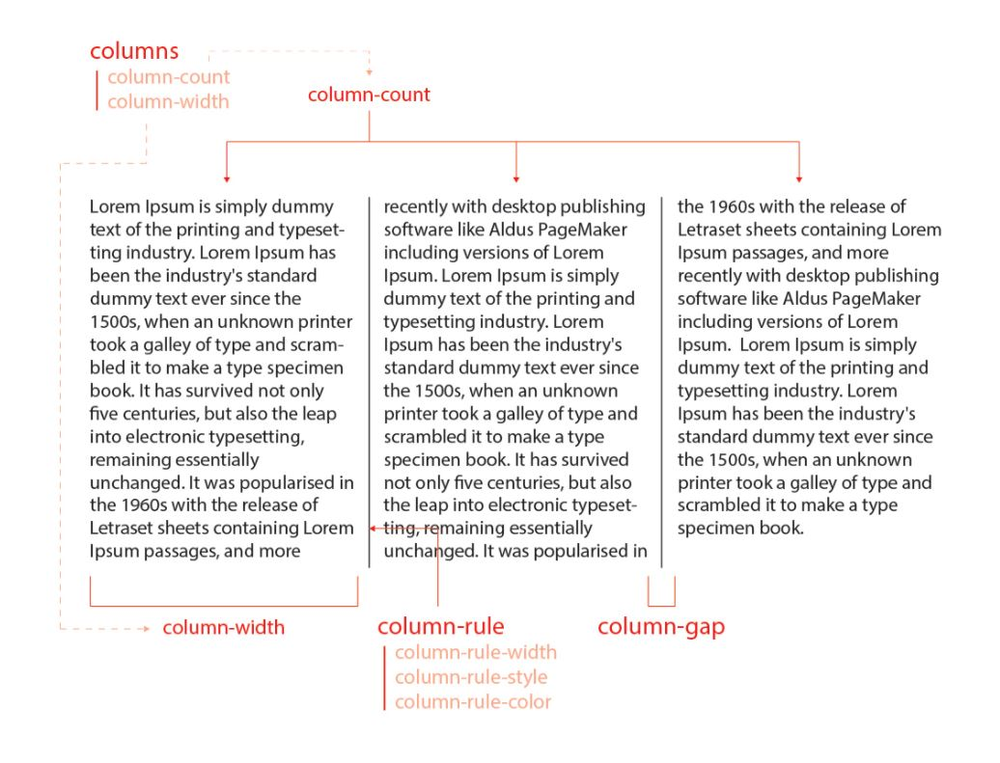

</div>

### columns

> 다단 정의

| 값           | 의미                               | 기본값 |
| ------------ | ---------------------------------- | ------ |
| auto         | 브라우저가 단의 너비와 개수를 설정 | auto   |
| column-width | 단의 최적 너비를 설정              | auto   |
| column-count | 단의 개수를 설정                   | auto   |

- column-width
  - 각 단이 줄어들 수 있는 최적 너비(최소 너비)를 설정하며, 요소의 너비가 가변하여 하나의 단이 최적 너비보다 줄어들 경우 단의 개수가 조정된다.

```css
columns: 너비 개수;

.text {
  columns: 100px 2;
}
```

### column-gap

> 단과 단 사이의 간격 설정

| 값     | 의미                                       | 기본값 |
| ------ | ------------------------------------------ | ------ |
| normal | 브라우저가 단과 단 사이의 간격을 설정(1em) | normal |
| 단위   | px, em, cm 등 단위로 지정                  |

### column-rule

> 단과 단 사이의 (구분)선을 지정

| 값           | 의미             | 기본값               |
| ------------ | ---------------- | -------------------- |
| column-width | 선의 두께를 지정 | medium               |
| column-style | 선의 종류를 지정 | none                 |
| column-color | 선의 색상을 지정 | 요소의 글자색과 동일 |

- 구분선(column-rule)은 단과 단 사이의 간격 중간에 위치한다.

### column-rule-width

> 단과 단 사이 선의 두께 설정

| 값     | 의미                      | 기본값 |
| ------ | ------------------------- | ------ |
| medium | 중간 두께 선              | medium |
| thin   | 얇은 두께 선              |        |
| thick  | 두꺼운 두께 선            |        |
| 단위   | px, em, cm 등 단위로 지정 |        |

### column-rule-style

> 단과 단 사이 선의 종류 설정

| 값     | 의미                               | 기본값 |
| ------ | ---------------------------------- | ------ |
| none   | 선 없음                            | none   |
| hidden | 선 없음과 동일(table요소에서 사용) |        |
| solid  | 실선(일반선)                       |        |
| dotted | 점선                               |        |
| dashed | 파선                               |        |
| double | 두 줄선                            |        |
| groove | 홈이 파여있는 모양(선)             |        |
| ridge  | 솟은 모양(선, groove의 반대)       |        |
| inset  | 요소 전체가 들어간 모양(선)        |        |
| outset | 요소 전체가 나온 모양(선)          |        |

### column-rule-color

> 단과 단 사이 선의 색상 설정

## [CSS 속성 - 플렉스(CSS3)](https://heropy.blog/2018/11/24/css-flexible-box/)

### Flexible Box

<div align=center>

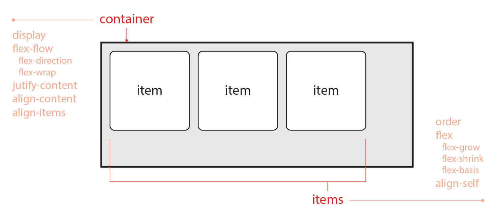

</div>

- Container는 Items를 감싸는 부모 요소로 각 Item을 정렬하기 위해 Container가 반드시 존재해야 한다.
  - Container : display, flex-flow, justify-content 등의 속성을 사용
  - Items : order, flex, align-self 등의 속성을 사용

### Flex Container

| 속성            | 의미                                                  |
| --------------- | ----------------------------------------------------- |
| display         | Flex Container를 정의                                 |
| flex-flow       | flex-direction와 flex-wrap의 단축 속성                |
| flex-direction  | Flex Items의 주 축(main-axis)을 설정                  |
| flex-wrap       | Flex Items의 여러 줄 묶음(줄 바꿈) 설정               |
| justify-content | 주 축(main-axis)의 정렬 방법을 설정                   |
| align-content   | 교차 축(cross-axis)의 정렬 방법을 설정(2줄 이상)      |
| align-items     | 교차 축(cross-axis)에서 Items의 정렬 방법을 설정(1줄) |

- display : display 속성으로 Flex Container를 정의

  - Block이나 Inline이 아닌 Flex(display: flex, display: inline-flex)로 정의

  | 값          | 의미                                | 기본값 |
  | ----------- | ----------------------------------- | ------ |
  | flex Block  | 특성의 Flex Container를 정의        |        |
  | inline-flex | Inline 특성의 Flex Container를 정의 |        |

  - `display: flex;`로 지정된 Flex Container는 Block 요소와 같은 성향(수직 쌓임)을 가진다.
  - `display: inline-flex;`로 지정된 Flex Container는 Inline(Inline Block) 요소와 같은 성향(수평 쌓임)을 가진다.
  - 단, 수직과 수평 쌓임은 Items가 아니라 Container이며 두 값의 차이는 내부에 Items에는 영향을 주지 않는다.

- flex-flow : 단축 속성으로 Flex Items의 주 축(main-axis)을 설정하고 Items의 여러 줄 묶음(줄 바꿈)도 설정한다.

  ```css
  flex-flow: 주축 여러줄묶음;

  .flex-container {
    flex-flow: row-reverse wrap;
  }
  ```

- flex-direction : items의 주 축(main-axis)을 설정

  | 값             | 의미                                         | 기본값 |
  | -------------- | -------------------------------------------- | ------ |
  | row            | Itmes를 수평축(왼쪽에서 오른쪽으로)으로 표시 | row    |
  | row-reverse    | Items를 row의 반대 축으로 표시               |        |
  | column         | Items를 수직축(위에서 아래로)으로 표시       |        |
  | column-reverse | Items를 column의 반대 축으로 표시            |        |

  <div align=center>

  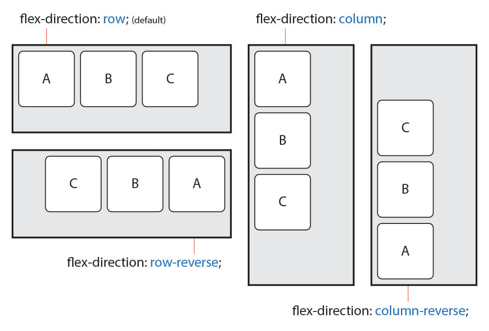

  </div>

- flex-wrap : items의 여러 줄 묶음(줄 바꿈) 설정

      | 값           | 의미                                           | 기본값 |
      | ------------ | ---------------------------------------------- | ------ |
      | nowrap       | 모든 Itmes를 여러 줄로 묶지 않음(한 줄에 표시) | nowrap |
      | wrap         | Items를 여러 줄로 묶음                         |        |
      | wrap-reverse | Items를 wrap의 역 방향으로 여러 줄로 묶음      |        |

      - Items는 지정된 크기(주 축에 따라 width나 height)를 무시하고 한 줄 안에서만 가변한다.
      - Items를 줄 바꿈 하려면 값으로 wrap을 사용해야 한다.

  <div align=center>

  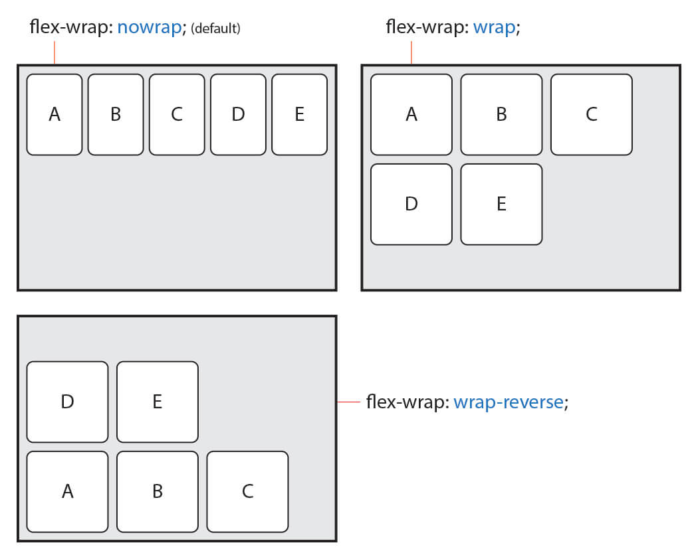

  </div>

- justify-content : 주 축(main-axis)의 정렬 방법을 설정

  | 값            | 의미                                                                                    | 기본값     |
  | ------------- | --------------------------------------------------------------------------------------- | ---------- |
  | flex-start    | Items를 시작점(flex-start)으로 정렬                                                     | flex-start |
  | flex-end      | Items를 끝점(flex-end)으로 정렬                                                         |            |
  | center        | Items를 가운데 정렬                                                                     |            |
  | space-between | 시작 Item은 시작점에, 마지막 Item은 끝점에 정렬되고 나머지 Items는 사이에 고르게 정렬됨 |            |
  | space-around  | Items를 균등한 여백을 포함하여 정렬                                                     |            |

  <div align=center>

  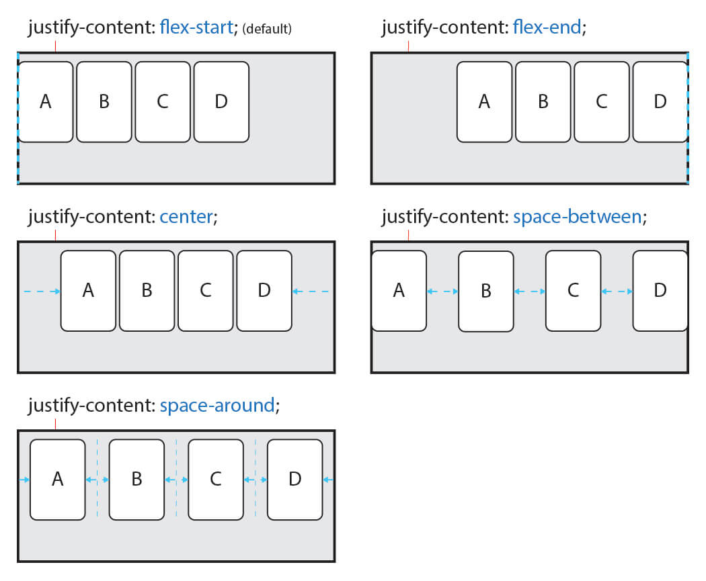

  </div>

- align-content : 교차 축(cross-axis)의 정렬 방법을 설정

  - `flex-wrap` 속성을 통해 Items가 여러 줄(2줄 이상)이고 여백이 있을 경우만 사용할 수 있다.
  - Items가 한 줄일 경우 `align-items` 속성을 사용

  | 값            | 의미                                                                                    | 기본값  |
  | ------------- | --------------------------------------------------------------------------------------- | ------- |
  | stretch       | Container의 교차 축을 채우기 위해 Items를 늘림                                          | stretch |
  | flex-start    | Items를 시작점(flex-start)으로 정렬                                                     |         |
  | flex-end      | Items를 끝점(flex-end)으로 정렬                                                         |         |
  | center        | Items를 가운데 정렬                                                                     |         |
  | space-between | 시작 Item은 시작점에, 마지막 Item은 끝점에 정렬되고 나머지 Items는 사이에 고르게 정렬됨 |         |
  | space-around  | Items를 균등한 여백을 포함하여 정렬                                                     |         |

  - stretch는 교차 축에 해당하는 너비(속성 width 혹은 height)가 값이 auto(기본값)일 경우 교차 축을 채우기 위해 자동으로 늘어난다.

  <div align=center>

  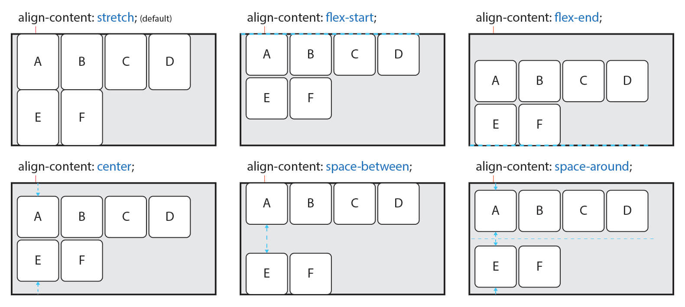

  </div>

- align-items : 교차 축(cross-axis)에서 Items의 정렬 방법을 설정

  - Items가 한 줄일 경우 많이 사용
  - Items가 flex-wrap을 통해 여러 줄(2줄 이상)일 경우에는 align-content 속성이 우선한다. 즉 align-items를 사용하려면 align-content 속성을 기본값(stretch)으로 설정해야 한다.

  | 값         | 의미                                           | 기본값  |
  | ---------- | ---------------------------------------------- | ------- |
  | stretch    | Container의 교차 축을 채우기 위해 Items를 늘림 | stretch |
  | flex-start | Items를 각 줄의 시작점(flex-start)으로 정렬    |         |
  | flex-end   | Items를 각 줄의 끝점(flex-end)으로 정렬        |         |
  | center     | Items를 가운데 정렬                            |         |
  | baseline   | Items를 문자 기준선에 정렬                     |         |

  <div align=center>

  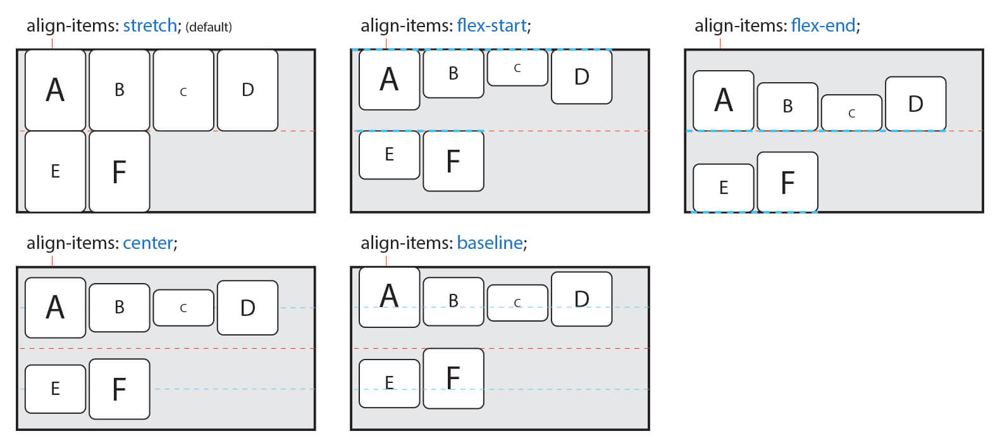

  </div>

### Flex Items

| 속성        | 의미                                            |
| ----------- | ----------------------------------------------- |
| order       | Flex Item의 순서를 설정                         |
| flex        | flex-grow, flex-shrink, flex-basis의 단축 속성  |
| flex-grow   | Flex Item의 증가 너비 비율을 설정               |
| flex-shrink | Flex Item의 감소 너비 비율을 설정               |
| flex-basis  | Flex Item의 (공간 배분 전) 기본 너비 설정       |
| align-self  | 교차 축(cross-axis)에서 Item의 정렬 방법을 설정 |

- order

  - Item의 순서를 설정한다.
  - Item에 숫자를 지정하고 숫자가 클수록 순서가 밀린다.
  - 음수가 허용된다.
  - HTML 구조와 상관없이 순서를 변경할 수 있기 때문에 유용하다.

  <div align=center>

  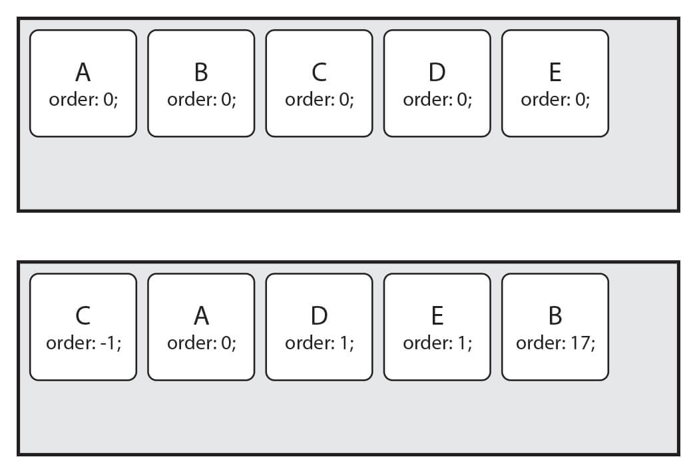

  </div>

- flex : Item의 너비(증가, 감소, 기본)를 설정하는 단축 속성

  | 값          | 의미                                 | 기본값 |
  | ----------- | ------------------------------------ | ------ |
  | flex-grow   | Item의 증가 너비 비율을 설정         | 0      |
  | flex-shrink | Item의 감소 너비 비율을 설정         | 1      |
  | flex-basis  | Item의 (공간 배분 전) 기본 너비 설정 | auto   |

  ```css
  flex: 증가너비 감소너비 기본너비;

  .item {
    flex: 1 1 20px; /* 증가너비 감소너비 기본너비 */
    flex: 1 1; /* 증가너비 감소너비 */
    flex: 1 20px; /* 증가너비 기본너비 (단위를 사용하면 flex-basis가 적용된다) */
    flex: 1 1 auto; /* flex-basis 속성으로 인해 0을 auto로 명시해야 한다. */
  }
  ```

  - flex-grow를 제외한 개별 속성은 생략할 수 있다.
    - flex-basis의 기본값은 auto입니다만 단축 속성인 flex에서 그 값을 생략할 경우 0이 적용된다.
    - flex: 1; 혹은 flex: 1 1;은 `flex: 1 1 0;`이 되는 걸 주의할 것

- flex : flex-grow

  - Item의 증가 너비 비율을 설정한다.
  - 숫자가 크면 더 많은 너비를 가진다.
  - Item이 가변 너비가 아니거나, 값이 0일 경우 효과가 없다.

  <div align=center>

  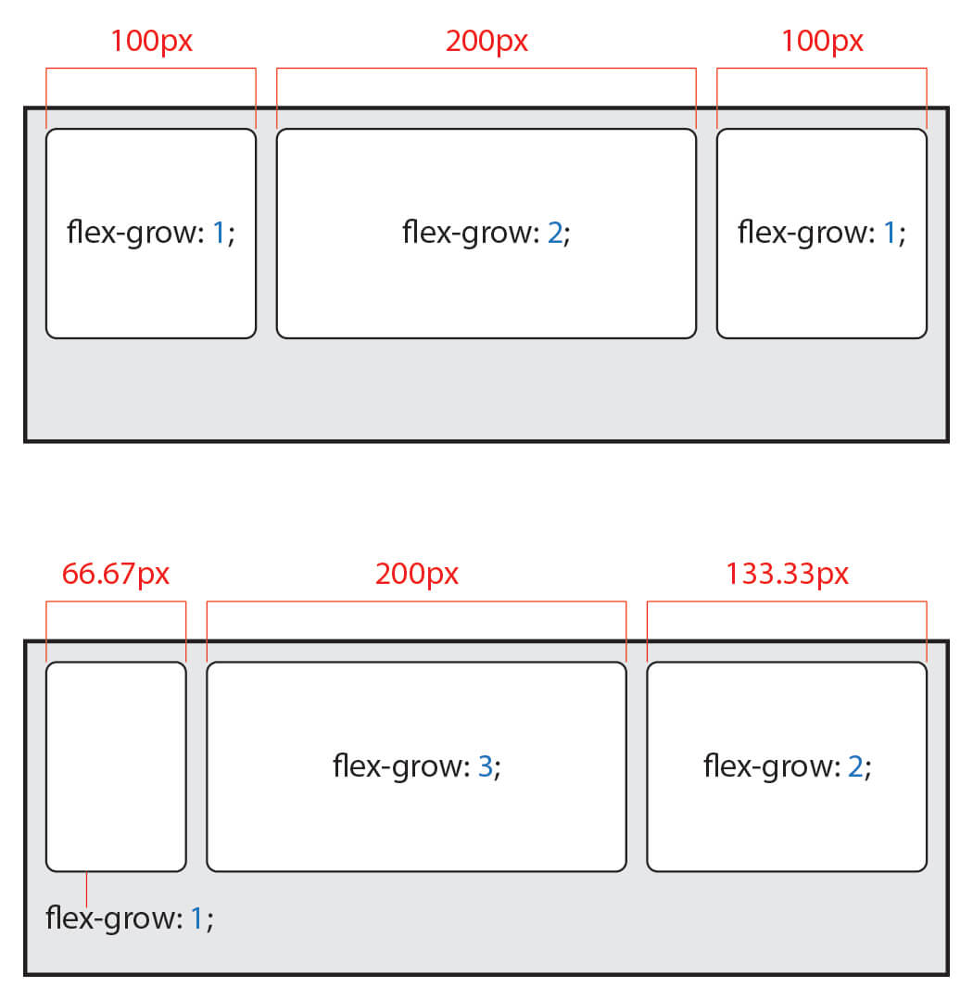

  </div>

- flex : flex-shrink

  - Item이 감소하는 너비의 비율을 설정한다.
  - 숫자가 크면 더 많은 너비가 감소한다.
  - Item이 가변 너비가 아니거나, 값이 0일 경우 효과가 없다.

  <div align=center>

  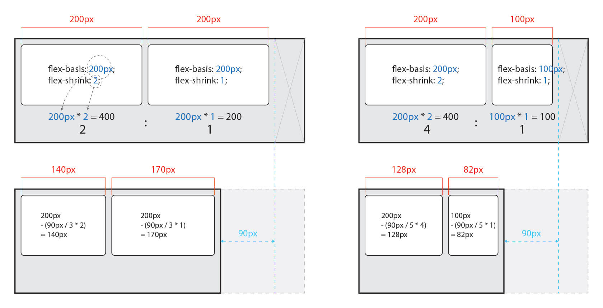

  </div>

- flex : flex-basis

  - Item의 (공간 배분 전) 기본 너비를 설정한다.
  - 값이 auto일 경우 width, height 등의 속성으로 Item의 너비를 설정할 수 있다.
  - 하지만 단위 값이 주어질 경우 설정할 수 없다.

  <div align=center>

  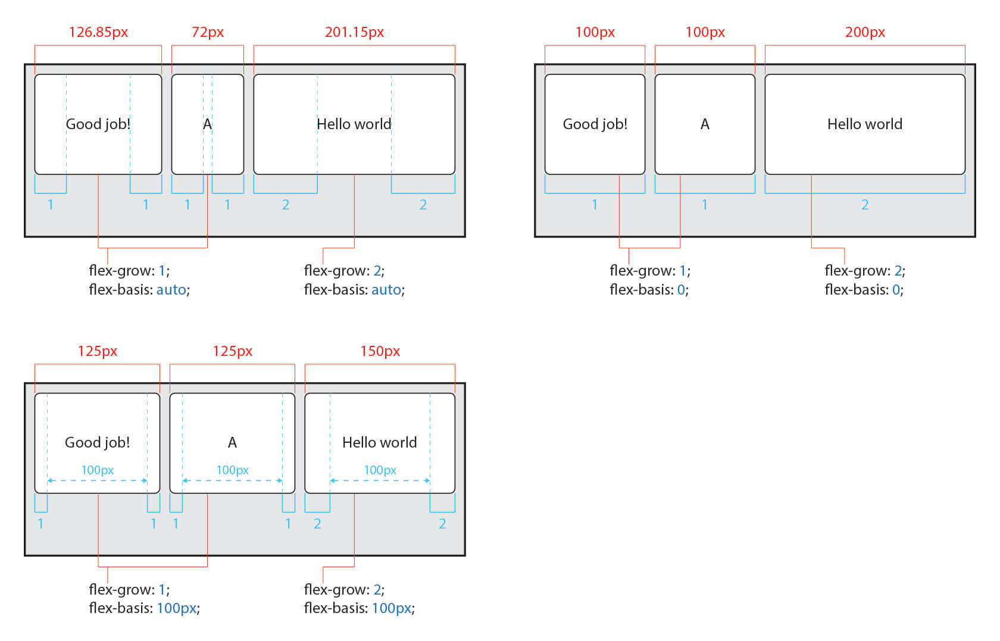

  </div>

- align-self : 교차 축(cross-axis)에서 개별 Item의 정렬 방법을 설정한다.

  - align-items는 Container 내 모든 Items의 정렬 방법을 설정한다.
  - 필요에 의해 일부 Item만 정렬 방법을 변경하려고 할 경우 align-self를 사용할 수 있다.
  - 이 속성은 align-items 속성보다 우선한다.

  | 값         | 의미                                          | 기본값 |
  | ---------- | --------------------------------------------- | ------ |
  | auto       | Container의 align-items 속성을 상속받음       | auto   |
  | stretch    | Container의 교차 축을 채우기 위해 Item을 늘림 |        |
  | flex-start | Item을 각 줄의 시작점(flex-start)으로 정렬    |        |
  | flex-end   | Item을 각 줄의 끝점(flex-end)으로 정렬        |        |
  | center     | Item을 가운데 정렬                            |        |
  | baseline   | Item을 문자 기준선에 정렬                     |        |

  <div align=center>

  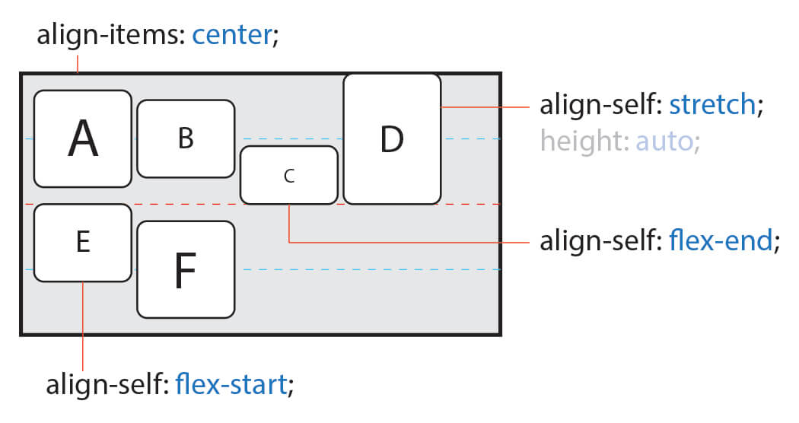

  </div>
