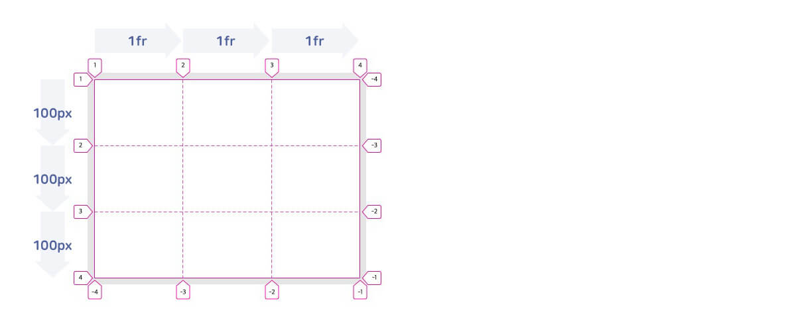
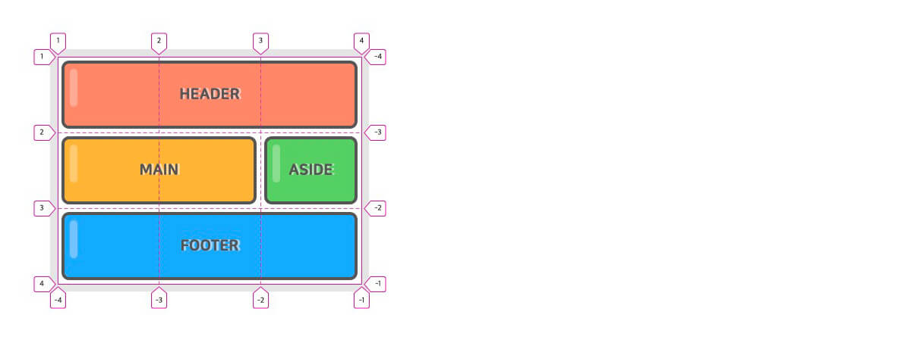
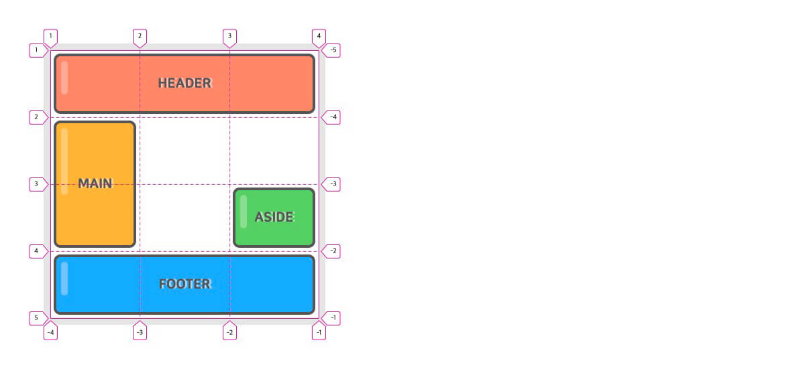

# 7일차

## CSS 속성 - Grid

> CSS Grid(그리드)는 2차원(행과 열)의 레이아웃 시스템을 제공

- `CSS Grid` : 예전부터 핵(Hack)으로 불린 다양한 레이아웃 대체 방식들을 해결하기 위해 만들어진 특별한 CSS 모듈
- `Grid Properties` : CSS Flex와 같이 Container(컨테이너)와 Item(아이템)이라는 두 가지 개념으로 구분되어 있다.

### Grid Container Properties

| 속성                        | 의미                                            |
| --------------------------- | ----------------------------------------------- |
| display                     | 그리드 컨테이너(Container)를 정의               |
| grid-template-rows          | 명시적 행(Track)의 크기를 정의                  |
| grid-template-columns       | 명시적 열(Track)의 크기를 정의                  |
| grid-template-areas         | 영역(Area) 이름을 참조해 템플릿 생성            |
| grid-template               | grid-template-xxx의 단축 속성                   |
| row-gap(grid-row-gap)       | 행과 행 사이의 간격(Line)을 정의                |
| column-gap(grid-column-gap) | 열과 열 사이의 간격(Line)을 정의                |
| gap(grid-gap)               | xxx-gap의 단축 속성                             |
| grid-auto-rows              | 암시적인 행(Track)의 크기를 정의                |
| grid-auto-columns           | 암시적인 열(Track)의 크기를 정의                |
| grid-auto-flow              | 자동 배치 알고리즘 방식을 정의                  |
| grid                        | grid-template-xxx과 grid-auto-xxx의 단축 속성   |
| align-content               | 그리드 콘텐츠(Grid Contents)를 수직(열 축) 정렬 |
| justify-content             | 그리드 콘텐츠를 수평(행 축) 정렬                |
| place-content               | align-content와 justify-content의 단축 속성     |
| align-items                 | 그리드 아이템(Items)들을 수직(열 축) 정렬       |
| justify-items               | 그리드 아이템들을 수평(행 축) 정렬              |
| place-items                 | align-items와 justify-items의 단축 속성         |

- display : Grid Container(컨테이너)를 정의하며, 컨테이너의 자식 요소들은 자동으로 Grid Items(아이템)로 정의된다.

  | 값          | 의미                                |
  | ----------- | ----------------------------------- |
  | grid        | Block 특성의 Grid Container를 정의  |
  | inline-grid | Inline 특성의 Grid Container를 정의 |

  ```css
  .container {
    display: grid;
  }
  ```

- grid-template-rows : 명시적 행(Track)의 크기를 정의한다.

  ```css
  .container {
    display: grid;
    grid-template-rows: 1행크기 2행크기 ...;
    grid-template-rows: [선이름] 1행크기 [선이름] 2행크기 [선이름] ...;
  }

  /* 각 행의 크기를 정의합니다. */
  .container {
    grid-template-rows: 100px 200px;
  }
  /* 동시에 각 라인의 이름도 정의할 수 있습니다. */
  .container {
    grid-template-rows: [first] 100px [second] 200px [third];
  }
  /* 라인에 중복된 이름을 지정할 수 있습니다. */
  .container {
    grid-template-rows: [row1-start] 100px [row1-end row2-start] 200px [row2-end];
  }
  ```

  - 라인(Line)의 이름도 정의할 수 있다.
  - fr(fraction, 공간 비율) 단위를 사용할 수 있다.
  - repeat() 함수를 사용할 수 있다.
  - 각 라인은 행(Row, Track)과 열(Column, Track)의 개수대로 숫자(양수/음수) 라인 이름이 자동으로 지정되어 있어서, 꼭 필요한 경우가 아니면 라인 이름을 정의할 필요가 없다.

    ```css
    .container {
      grid-template-rows: 100px 200px;
      /* grid-template-rows: [1 -3] 100px [2 -2] 200px [3 -1]; */
    }

    .container {
      width: 400px;
      display: grid;
      grid-template-rows: repeat(3, 100px);
      grid-template-columns: repeat(3, 1fr);
    }
    ```

    <div align=center>

    

    </div>

- grid-template-columns : 명시적 열(Track)의 크기를 정의한다.

라인(Line)의 이름도 정의할 수 있다.
fr(fraction, 공간 비율) 단위를 사용할 수 있다.
repeat() 함수를 사용할 수 있다.

```css
.container {
  display: grid;
  grid-template-columns: 1열크기 2열크기 ...;
  grid-template-columns: [선이름] 1열크기 [선이름] 2열크기 [선이름] ...;
}
/* 각 열의 크기를 정의합니다. */
.container {
  grid-template-columns: 100px 200px;
}
/* 동시에 각 라인의 이름도 정의할 수 있습니다. */
.container {
  grid-template-columns: [first] 100px [second] 200px [third];
}
/* 라인에 중복된 이름을 지정할 수 있습니다. */
.container {
  grid-template-columns: [col1-start] 100px [col1-end col2-start] 200px [col2-end];
}
```

```css
/* 1200px 너비의 ‘12컬럼 그리드 템플릿’을 정의한다면 다음과 작성 */
.container {
  width: 1200px;
  grid-template-columns: 100px 100px 100px 100px 100px 100px 100px 100px 100px 100px 100px 100px;
}
```

```css
/* repeat() 함수로 간소화하기 */
.container {
  width: 1200px;
  grid-template-columns: repeat(12, 100px);
}
```

- 컬럼을 크기를 fr 단위를 사용해 다음과 같이 비율로 지정할 수도 있다.

  - 각 컬럼은 비율에 맞게 출력되기 때문에 컨테이너의 너비가 가변해도 열 크기를 수정할 필요가 없다.

  ```css
  .container {
    width: 80%;
    grid-template-columns: repeat(12, 1fr);
  }
  ```

  ```css
  /* repeat() 함수는 2번째 인수를 반복하기 때문에 다음과 같이 활용할 수 있다. */
  .container {
    grid-template-columns: repeat(4, 100px 200px 50px);
    /* grid-template-columns: 100px 200px 50px 100px 200px 50px 100px 200px 50px 100px 200px 50px; */
  }
  .container {
    grid-template-columns: repeat(4, 1fr 2fr 3fr);
    /* grid-template-columns: 1fr 2fr 3fr 1fr 2fr 3fr 1fr 2fr 3fr 1fr 2fr 3fr; */
  }
  ```

- grid-template-areas : 지정된 그리드 영역 이름(grid-area)을 참조해 그리드 템플릿을 생성

  - grid-area는 Grid Container가 아닌 Grid Item에 적용하는 속성이다.

  ```css
  .container {
    display: grid;
    grid-template-rows: repeat(3, 100px);
    grid-template-columns: repeat(3, 1fr);
    grid-template-areas:
      'header header header'
      'main main aside'
      'footer footer footer';
  }
  header {
    grid-area: header;
  }
  main {
    grid-area: main;
  }
  aside {
    grid-area: aside;
  }
  footer {
    grid-area: footer;
  }
  ```

   <div align=center>
   
   
   
   </div>

  ```css
  /* .(마침표)를 사용하거나 명시적으로 none을 입력해 빈 영역을 정의할 수 있다. */
  .container {
    display: grid;
    grid-template-rows: repeat(4, 100px);
    grid-template-columns: repeat(3, 1fr);
    grid-template-areas:
      'header header header'
      'main . .'
      'main . aside'
      'footer footer footer';
  }
  header {
    grid-area: header;
  }
  main {
    grid-area: main;
  }
  aside {
    grid-area: aside;
  }
  footer {
    grid-area: footer;
  }
  ```

  <div align=center>
   
   
   
   </div>

- grid-template : `grid-template-rows`, `grid-template-columns`, `grid-template-areas`의 단축 속성이다.

  ```css
  .container {
    grid-template: <grid-template-rows> / <grid-template-columns>;
    grid-template: <grid-template-areas>;
  }
  /* 다음과 같이 작성할 수도 있다. */
  .container {
    grid-template:
      [1행시작선이름] 'AREAS' 행너비 [1행끝선이름]
      [2행시작선이름] 'AREAS' 행너비 [2행끝선이름]
      / <grid-template-columns>;
  }
  .container {
    display: grid;
    grid-template:
      'header header header' 80px
      'main main aside' 350px
      'footer footer footer' 130px
      / 2fr 100px 1fr;
  }
  header {
    grid-area: header;
  }
  main {
    grid-area: main;
  }
  aside {
    grid-area: aside;
  }
  footer {
    grid-area: footer;
  }
  /* 다음과 같이 해석된다. */
  .container {
    display: grid;
    grid-template-rows: 80px 350px 130px;
    grid-template-columns: 2fr 100px 1fr;
    grid-template-areas:
      'header header header'
      'main main aside'
      'footer footer footer';
  }
  ```

- row-gap(grid-row-gap) : 각 행과 행 사이의 간격(Gutter)을 지정

  - 그리드 선(Grid Line)의 크기를 지정하는 것

  ```css
  .container {
    row-gap: 크기;
  }
  ```

- column-gap(grid-column-gap) : 각 열과 열 사이의 간격(Gutter)을 지정

  ```css
  .container {
    column-gap: 크기;
  }
  ```

- gap(grid-gap) : 각 행과 행, 열과 열 사이의 간격(Gutter)을 지정

  ```css
  .container {
    gap: <grid-row-gap> <grid-column-gap>;
  }
  .container {
    display: grid;
    grid-template-rows: repeat(2, 150px);
    grid-template-columns: repeat(3, 1fr);
    gap: 20px 10px;
  }
  /* 하나의 값으로 통일 가능 */
  .container {
    gap: 10px; /* row-gap: 10px; + column-gap: 10px; */
  }
  /* 하나의 값만 적용하고자 한다면 다음과 같이 사용 */
  .container {
    gap: 10px 0; /* row-gap */
    gap: 0 10px; /* column-gap */
  }
  ```

  <div align=center>

  

  </div>

  - grid-gap(grid-row-gap, grid-column-gap)의 접두사 grid-는 더 이상 사용되지 않으며(Deprecated), gap(row-gap, column-gap)로 교체

- grid-auto-rows : 암시적 행(Track)의 크기를 정의

  - 아이템(Item)이 grid-template-rows로 정의한 명시적 행 외부에 배치되는 경우 암시적 행의 크기가 적용

  ```css
  .container {
    width: 300px;
    height: 200px;
    display: grid;
    grid-template-rows: 100px 100px; /* 명시적 2개 행 정의 */
    grid-template-columns: 150px 150px; /* 명시적 2개 열 정의 */
    grid-auto-rows: 100px; /* 그 외(암시적) 행의 크기 정의 */
  }
  .item:nth-child(3) {
    grid-row: 3 / 4;
  }
  ```

  ```html
  <div class="container">
    <div class="item">1</div>
    <div class="item">2</div>
    <div class="item">3</div>
  </div>
  ```

  <div align=center>

  

  </div>

- grid-auto-columns : 암시적 열(Track)의 크기를 정의

  - 아이템(Item)이 grid-template-columns로 정의한 명시적 열 외부에 배치되는 경우 암시적 열의 크기가 적용

  ```css
  .container {
    width: 300px;
    height: 200px;
    display: grid;
    grid-template-rows: 100px 100px;
    grid-template-columns: 150px 150px;
    grid-auto-rows: 100px;
    grid-auto-columns: 100px;
  }
  .item:nth-child(3) {
    grid-row: 3 / 4;
    grid-column: 3 / 4;
  }
  ```

  <div align=center>

  

  </div>

  - 다음과 같이 아이템이 배치되는 위치에 맞게 암시적 행과 열의 개수가 생성되며, 암시적 크기가 적용된 행과 열은 양수 라인 번호만 사용할 수 있다(음수 사용 불가).

  <div align=center>

  

  </div>

- grid-auto-flow : 배치하지 않은 아이템(Item)을 어떤 방식의 ‘자동 배치 알고리즘’으로 처리할지 정의

  - 배치한 아이템은 grid-area(이하 개별 속성 포함)를 사용한 아이템을 의미

  | 값               | 의미                                       | 기본값 |
  | ---------------- | ------------------------------------------ | ------ |
  | row              | 각 행 축을 따라 차례로 배치                | row    |
  | column           | 각 열 축을 따라 차례로 배치                |        |
  | row dense(dense) | 각 행 축을 따라 차례로 배치, 빈 영역 메움! |        |
  | column dense     | 각 열 축을 따라 차례로 배치, 빈 영역 메움! |        |

  ```css
  /* For row & row dense */
  .container {
    display: grid;
    grid-template-rows: repeat(3, 1fr);
    grid-template-columns: repeat(3, 1fr);
    grid-auto-flow: row || row dense || dense;
  }
  .item:nth-child(2) {
    grid-column: span 3;
  }
  ```

  <div align=center>

  

  </div>

  ```css
  /* For column & column dense */
  .container {
    display: grid;
    grid-template-rows: repeat(3, 1fr);
    grid-template-columns: repeat(3, 1fr);
    grid-auto-flow: column || column dense;
  }
  .item:nth-child(1) {
    grid-column: 2 / span 2;
  }
  .item:nth-child(2) {
    grid-column: span 2;
  }
  ```

  <div align=center>

  

  </div>

- grid : `grid-template-xxx`과 `grid-auto-xxx`의 단축 속성

  ```css
  .container {
    grid: <grid-template>;
    grid: <grid-template-rows> / <grid-auto-flow> <grid-auto-columns>;
    grid: <grid-auto-flow> <grid-auto-rows> / <grid-template-columns>;
  }
  /* ================================== */
  .container {
    grid: <grid-template-rows> / <grid-template-columns>;
  }
  .container {
    grid: 100px 200px / 1fr 2fr;
  }
  .container {
    grid-template-rows: 100px 200px;
    grid-template-columns: 1fr 2fr;
  }
  /* ================================== */
  .container {
    grid: <grid-template>;
  }
  .container {
    grid:
      'header header header' 80px
      'main main aside' 350px
      'footer footer footer' 130px
      / 2fr 100px 1fr;
  }
  .container {
    grid-template:
      'header header header' 80px
      'main main aside' 350px
      'footer footer footer' 130px
      / 2fr 100px 1fr;
  }
  ```

  - grid-auto-flow를 작성할 때는 auto-flow 키워드를 사용한다.
    - `/`로 구분해 작성하는 위치가 곧 row, column 값을 의미하므로 row, column 값은 작성하지 않는다.
    - dense 값은 auto-flow 뒤에 붙인다.
    ```css
    .container {
      grid: <grid-template-rows> / <grid-auto-flow> <grid-auto-columns>;
    }
    .container {
      grid: 100px 100px / auto-flow 150px;
    }
    .container {
      grid-template-row: 100px 100px;
      grid-auto-flow: column;
      grid-auto-columns: 150px;
    }
    /* ================================== */
    .container {
      grid: <grid-auto-flow> <grid-auto-rows> / <grid-template-columns>;
    }
    .container {
      grid: auto-flow 150px / 100px 100px;
    }
    .container {
      grid-template-columns: 100px 100px;
      grid-auto-flow: row;
      grid-auto-rows: 150px;
    }
    /* ================================== */
    .container {
      grid: auto-flow dense 150px / 100px 100px;
    }
    .container {
      grid-template-columns: 100px 100px;
      grid-auto-flow: row dense;
      grid-auto-rows: 150px;
    }
    ```

- align-content : 그리드 콘텐츠(Contents)를 수직(열 축) 정렬한다.

  - 그리드 콘텐츠의 세로 너비가 그리드 컨테이너(Container)보다 작아야 한다.
  - justify-content와 속성, 값이 동일하다.

  | 값            | 의미                                                                  | 기본값 |
  | ------------- | --------------------------------------------------------------------- | ------ |
  | normal        | stretch와 같습니다.                                                   | normal |
  | start         | 시작점(위쪽) 정렬                                                     |        |
  | center        | 수직 가운데 정렬                                                      |        |
  | end           | 끝점(아래쪽) 정렬                                                     |        |
  | space-around  | 각 행 위아래에 여백을 고르게 정렬                                     |        |
  | space-between | 첫 행은 시작점에, 끝 행은 끝점에 정렬되고 나머지 여백으로 고르게 정렬 |        |
  | space-evenly  | 모든 여백을 고르게 정렬                                               |        |
  | stretch       | 열 축을 채우기 위해 그리드 콘텐츠를 늘림                              |        |

  ```css
  .container {
    width: 450px;
    height: 450px;
    display: grid;
    grid-template-rows: repeat(3, 100px);
    grid-template-columns: repeat(3, 100px);
    align-content: <align-content>;
  }
  ```

  <div align=center>

  

  </div>

- justify-content : 그리드 콘텐츠(Contents)를 수평(행 축) 정렬한다.

  - 그리드 콘텐츠의 가로 너비가 그리드 컨테이너(Container)보다 작아야 한다.
  - align-content와 속성, 값이 동일하다.

  ```css
  .container {
    width: 450px;
    height: 450px;
    display: grid;
    grid-template-rows: repeat(3, 100px);
    grid-template-columns: repeat(3, 100px);
    justify-content: <justify-content>;
  }
  ```

  <div align=center>

  

  </div>

- align-items : 그리드 아이템(Items)들을 수직(열 축) 정렬한다.

  - 그리드 아이템의 세로 너비가 자신이 속한 그리드 행(Track)의 크기보다 작아야 한다.
  - justify-items와 속성, 값이 동일하다.

  | 값      | 의미                                     | 기본값 |
  | ------- | ---------------------------------------- | ------ |
  | normal  | stretch와 같습니다.                      | normal |
  | start   | 시작점(위쪽) 정렬                        |        |
  | center  | 수직 가운데 정렬                         |        |
  | end     | 끝점(아래쪽) 정렬                        |        |
  | stretch | 열 축을 채우기 위해 그리드 아이템을 늘림 |        |

  ```css
  .container {
    width: 450px;
    height: 450px;
    display: grid;
    grid-template-rows: repeat(3, 1fr);
    grid-template-columns: repeat(3, 1fr);
    align-items: <align-items>;
  }
  ```

  <div align=center>

  

  </div>

- justify-items : 그리드 아이템(Items)들을 수평(행 축) 정렬한다.

  - 그리드 아이템의 가로 너비가 자신이 속한 그리드 열(Track)의 크기보다 작아야 한다.

  ```css
  .container {
    width: 450px;
    height: 450px;
    display: grid;
    grid-template-rows: repeat(3, 1fr);
    grid-template-columns: repeat(3, 1fr);
    justify-items: <justify-items>;
  }
  ```

  <div align=center>

  

  </div>

### Grid Item Properties

| 속성              | 의미                                                             |
| ----------------- | ---------------------------------------------------------------- |
| grid-row-start    | 그리드 아이템(Item)의 행 시작 위치 지정                          |
| grid-row-end      | 그리드 아이템의 행 끝 위치 지정                                  |
| grid-row          | grid-row-xxx의 단축 속성(행 시작/끝 위치)                        |
| grid-column-start | 그리드 아이템의 열 시작 위치 지정                                |
| grid-column-end   | 그리드 아이템의 열 끝 위치 지정                                  |
| grid-column       | grid-column-xxx의 단축 속성(열 시작/끝 위치)                     |
| grid-area         | 영역(Area) 이름을 설정하거나, grid-row와 grid-column의 단축 속성 |
| align-self        | 단일 그리드 아이템을 수직(열 축) 정렬                            |
| justify-self      | 단일 그리드 아이템을 수평(행 축) 정렬                            |
| place-self        | align-self와 justify-self의 단축 속성                            |
| order             | 그리드 아이템의 배치 순서를 지정                                 |
| z-index           | 그리드 아이템의 쌓이는 순서를 지정                               |

- grid-row : grid-row-start과 grid-row-end의 단축 속성

  - 각 속성을 `/`로 구분

  ```css
  .item {
    grid-row: <grid-row-start> / <grid-row-end>;
  }

  /* ================================== */
  .item {
    grid-row-start: 1;
    grid-row-end: 2;
  }
  .item {
    grid-row: 1 / 2;
  }
  /* ================================== */
  .item {
    grid-row-start: 2;
    grid-row-end: span 3; /* + 개념 */
  }
  .item {
    grid-row: 2 / span 3;
  }
  .item {
    grid-row: 2 / 5;
  }
  /* ================================== */
  .item {
    grid-row-start: span 3;
    grid-row-end: 4;
  }
  .item {
    grid-row: span 3 / 4; /* - 개념 */
  }
  .item {
    grid-row: 1 / 4;
  }
  ```

- grid-area : grid-row-start, grid-column-start, grid-row-end 그리고 grid-column-end의 단축 속성

  - grid-template-areas가 참조할 영역(Area) 이름을 설정할 수도 있다.
  - 영역 이름을 설정할 경우 grid-row와 grid-column 개념은 무시

  ```css
  .item {
    grid-area: <grid-row-start> / <grid-column-start> / <grid-row-end> /
      <grid-column-end>;
    grid-area: 영역이름;
  }
  /* ================================== */
  .item {
    grid-row: 2 / 3;
    grid-column: span 2 / -1;
  }
  .item {
    grid-area: 2 / span 2 / 3 / -1; /* '시작 / 시작 / 끝 / 끝'임에 주의 */
  }
  ```

  - 다음과 같이 영역 이름을 지정해 grid-template-areas에서 참조할 수 있다.

    ```html
    <div class="container">
      <header class="item">HEADER</header>
      <main class="item">MAIN</main>
      <aside class="item">ASIDE</aside>
      <footer class="item">FOOTER</footer>
    </div>
    ```

- align-self : 단일 그리드 아이템(Item)을 수직(열 축) 정렬한다.

  - 그리드 아이템의 세로 너비가 자신이 속한 그리드 행(Track)의 크기보다 작아야 한다.
  - justify-self와 속성, 값이 동일하다.

  | 값      | 의미                                     | 기본값 |
  | ------- | ---------------------------------------- | ------ |
  | normal  | stretch와 같습니다.                      | normal |
  | start   | 시작점(위쪽) 정렬                        |        |
  | center  | 수직 가운데 정렬                         |        |
  | end     | 끝점(아래쪽) 정렬                        |        |
  | stretch | 열 축을 채우기 위해 그리드 아이템을 늘림 |        |

  ```css
  .container {
    display: grid;
    grid-template-rows: repeat(2, 1fr);
    grid-template-columns: repeat(2, 1fr);
  }
  .item:nth-child(1) {
    align-self: start;
  }
  .item:nth-child(2) {
    align-self: center;
  }
  .item:nth-child(3) {
    align-self: end;
  }
  .item:nth-child(4) {
    align-self: stretch;
  }
  ```

  <div align=center>

  

  </div>

- justify-self : 단일 그리드 아이템(Item)을 수평(행 축) 정렬한다.

  - 그리드 아이템의 가로 너비가 자신이 속한 그리드 열(Track)의 크기보다 작아야 한다.
  - align-self와 속성, 값이 동일하다.

  ```css
  .container {
    display: grid;
    grid-template-rows: repeat(2, 1fr);
    grid-template-columns: repeat(2, 1fr);
  }
  .item:nth-child(1) {
    justify-self: start;
  }
  .item:nth-child(2) {
    justify-self: center;
  }
  .item:nth-child(3) {
    justify-self: end;
  }
  .item:nth-child(4) {
    justify-self: stretch;
  }
  ```

  <div align=center>

  

  </div>

- order : 그리드 아이템이 자동 배치되는 순서를 변경할 수 있으며, 숫자가 작을수록 앞서 배치된다.

  ```css
  .container {
    display: grid;
    grid-template-rows: repeat(2, 1fr);
    grid-template-columns: repeat(3, 1fr);
  }
  .item:nth-child(1) {
    order: 1;
  }
  .item:nth-child(3) {
    order: 5;
  }
  .item:nth-child(5) {
    order: -1;
  }
  ```

  <div align=center>

  

  </div>

- z-index : z-index 속성을 이용해 아이템이 쌓이는 순서를 변경할 수 있다.

  ```css
  .item:nth-child(1) {
    grid-area: 1 / 1 / 2 / 3;
  }
  .item:nth-child(2) {
    grid-area: 1 / 2 / 3 / 3;
    z-index: 1;
  }
  .item:nth-child(3) {
    grid-area: 2 / 2 / 3 / 4;
  }
  ```

  <div align=center>

  

  </div>

### Grid Functions

> 그리드에서 사용하는 주요 함수

- repeat : repeat() 함수는 행/열(Track)의 크기 정의를 반복한다.

  - `반복되는 횟수`와 `행/열의 크기 정의`를 인수로, grid-template-rows와 grid-template-columns에서 사용한다.

  ```css
  /* 9컬럼 그리드 */
  .container {
    grid-template-columns: 100px 100px 100px 100px 100px 100px 100px 100px 100px;
  }
  .container {
    grid-template-columns: repeat(9, 100px);
  }
  /* ================================== */
  .container {
    grid-template-rows: [row-start] 200px [row-end row-start] 200px [row-end];
    grid-template-columns: [col-start] 100px [col-end col-start] 100px [col-end col-start] 100px [col-end];
  }
  .container {
    grid-template-rows: repeat(2, [row-start] 200px [row-end]);
    grid-template-columns: repeat(3, [col-start] 100px [col-end]);
  }
  .container {
    grid-template: repeat(2, [row-start] 200px [row-end]) / repeat(3, [col-start]
          100px [col-end]);
  }
  /* ================================== */
  .container {
    grid-template-columns: 1fr 2fr 1fr 2fr 1fr 2fr 1fr 2fr 1fr 2fr 1fr 2fr; /* 12컬럼 그리드 */
  }
  .container {
    grid-template-columns: repeat(6, 1fr 2fr);
  }
  ```

- minmax : minmax() 함수는 행/열(Track)의 ‘최소/최대 크기’를 정의한다.

  - 첫 번째 인수는 `최솟값`이고 두 번째 인수는 `최댓값`으로 grid-template-rows, grid-template-columns, grid-auto-rows 그리고 grid-auto-columns에서 사용한다.
  - 일반 요소에 min-width와 max-width 속성을 동시 지정하는 것과 유사합니다.

  ```css
  .container {
    grid-template-columns: minmax(100px, 1fr) minmax(200px, 1fr);
  }
  ```

  <div align=center>

  

  </div>

  - minmax()를 통해 암시적 행/열(Track) 크기를 좀 더 유연하게 사용할 수 있다.
    ```css
    /* 암시적 ‘행/열’의 크기를 최소 ‘200px/300px’으로 지정하지만 auto를 통해 그리드 아이템의 크기에 따라 확장 */
    .container {
      grid-auto-rows: minmax(200px, auto);
      grid-auto-columns: minmax(300px, auto);
    }
    ```

- fit-content : fit-content() 함수는 행/열(Track)의 크기를 그리드 아이템(Item)이 포함하는 내용(Contents) 크기에 맞춘다.

  - `내용의 최대 크기`를 인수로 사용하며 minmax(auto, max-content)와 유사하다.

  ```css
  .container {
    grid-template-columns: fit-content(300px) fit-content(300px);
  }
  ```

  <div align=center>

  

  </div>

### Grid Units

> 그리드에서 사용하는 주요 단위

- fr : fr(fractional unit)은 사용 가능한 공간에 대한 비율을 의미

  ```css
  /* 그리드 컨테이너의 3번째 컬럼에 100px, 4번째 컬럼에 25%를 사용하고 남은 공간을 1번째 컬럼에 ‘1/3’, 2번째 컬럼에 ‘2/3’ 만큼 사용 */
  .container {
    grid-template-columns: 1fr 2fr 100px 25%;
  }
  ```

  <div align=center>

  

  </div>

- min-content : 그리드 아이템이 포함하는 내용(Contents)의 최소 크기를 의미

  ```css
  .container {
    grid-template-columns: min-content 1fr;
  }
  ```

  ```html
  <div class="container">
    <div class="item">world wide web</div>
    <!-- ... -->
  </div>
  ```

  <div align=center>

  

  </div>

  - 한글을 사용하는 경우 word-break: keep-all;를 설정하면 정상적으로 동작한다.
    ```html
    <div class="container">
      <div class="item">내용의 최소 크기</div>
      <!-- ... -->
    </div>
    ```

  <div align=center>

  

  </div>

- max-content : 그리드 아이템이 포함하는 내용(Contents)의 최대 크기를 의미

  ```html
  <div class="container">
    <div class="item">world wide web</div>
    <!-- ... -->
  </div>
  ```

  ```css
  .container {
    grid-template-columns: max-content 1fr;
  }
  ```

  <div align=center>

  

  </div>

  - 그리드 함수들과 같이 더 유용하게 활용할 수 있다.

    ```css
    /* 총 4컬럼 그리드를 생성하며 각 열(Track)은 최대 1fr 크기를 가지지만, max-content를 통해 포함된 그리드 아이템의 내용보다 작아질 수 없다. */
    .container {
      grid-template-columns: repeat(4, minmax(max-content, 1fr));
    }
    ```

- auto-fill, auto-fit : 행/열(Track)의 개수를 그리드 컨테이너(Container) 및 행/열 크기에 맞게 자동으로(암시적) 조정한다.

  - repeat() 함수와 같이 사용하며, 행/열과 아이템(Item) 개수가 명확할 필요가 없거나 명확하지 않은 경우 유용하다.(반응형 그리드)
  - auto-fill과 auto-fit은 간단한 차이점을 제외하면 동일하게 동작한다.

  ```css
  /* 컨테이너의 크기가 아이템들을 수용하기 충분하지 않은 경우 아이템은 넘치기 시작 */
  .container {
    grid-template-columns: repeat(4, minmax(120px, 1fr));
  }
  ```

  <div align=center>

  

  </div>

  - 만약 4컬럼 그리드를 고집할 필요가 없다면 다음과 같이 `반복횟수(repeat() 함수의 첫 번째 인수)`를 auto-fill이나 auto-fit으로 수정할 수 있다.

    - 이는 컨테이너의 크기가 아이템들을 수용하기 충분하지 않을 경우 아이템을 자동으로 줄 바꿈 처리하며, 그에 맞게 암시적 행/열도 자동으로 수정한다.

      ```css
      .container {
        grid-template-columns: repeat(auto-fill, minmax(120px, 1fr));
      }
      ```

      <div align=center>

      

      </div>

- auto-fill과 auto-fit의 차이

  - auto-fill과 auto-fit은 차이점은 그리드 컨테이너가 하나의 행/열(Track)에 모든 아이템을 수용하고 남는 공간이 있을 때 발생한다.

  ```css
  /* auto-fill은 남는 공간(빈 트랙)을 그대로 유지하고, auto-fit은 남는 공간을 축소 */
  .container.auto-fill {
    grid-template-columns: repeat(auto-fill, minmax(120px, 1fr));
  }
  .container.auto-fit {
    grid-template-columns: repeat(auto-fit, minmax(120px, 1fr));
  }
  ```

  <div align=center>

  

  </div>
