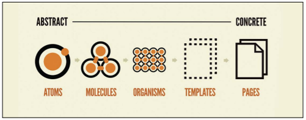

# CSS 설계
## 들어가며
### CSS의 시작
CSS는 문법이 간단하고 조금만 학습하면 누구나 사용할 수 있습니다. 이런 단순함 때문에 매우 빈약하죠. 역사를 말해보자면 아래와 같습니다.
1. 1994년 탄생

2. 1996년 W3C에서 CSS1 권고

3. 1998년 CSS2 권고

4. 2011년 CSS2.1 권고

5. CSS3부터는 버전이 아니라 `모듈`이라는 단위로 정의
   - 즉, CSS3, CSS4와 같이 전체를 의미하는 버전은 엄밀하게는 존재하지 않아요.

CSS는 HTML/XML의 각 요소를 꾸미는 것이자, 문서의 구조(HTML이나 XML)와 스타일(디자인)을 분리하는 것입니다. CSS가 등장하기 전에는 스타일을 각 태그 요소에 직접 지정했어요. 이런 방법에는 문제가 있었습니다.
- HTML/XML은 본래 문서 구조를 의미하기 때문에, 스타일을 지정하는 건 바람직하지 않았어요.

- 같은 스탕리 요소를 여러 페이지마다 사용하려면 수정할 때 그만큼 반복 수정을 해야 합니다.

이를 해결하기 위해 등장한 것이 CSS에요. 코드를 변형하여 문장 구조와 스타일을 분리함으로써 문제를 해결했죠.

 

### CSS의 문제점
> 문제를 해결했지만, 다른 문제가 등장했어요.

`페이지 수가 늘어남에 따라 CSS가 점점 복잡해지고 관리하기 어렵다`는 점이었습니다. 스타일 규칙을 확실하게 정한 뒤 CSS를 정하면 모두가 행복하겠지만, 그렇지 않은 경우가 더 많았죠. 그런데, 직관적으로 무엇이 어려운 것일까요?

바로 CSS 내부에서는 모든 것이 **전역 범위**이기 때문입니다.

프로그래밍적 언어를 취하자면 Global Scope만 가지고 있기 때문에, "모든 스타일링이 서로 간섭할 수 있는" 상태인 것이었죠. 물론 같은 파일 안에서만 국한 되었던 이야기는 아니에요. CSS 파일이 분리되어 있다 하더라도 모든 CSS 스타일링은 동일한 범위 안에 존재하게 됩니다. 이는 CSS의 강점이자 약점이고 규모가 커질 수록 리스크를 감당하기 힘들어집니다.

 

### 웹의 복잡성
CSS가 처음 등장했을 당시, 웹 사이트는 제목과 본문, 작은 제목 등으로 이루어진 간단한 문서 형태였습니다. 물론 HTML이 마크업 언어니까 문서로서의 역할은 지금도 이어지고 있죠. 그러나 애니메이션, 사용자 인터랙션에 화면이 변경되는 구현도 절대 적지 않아요. 현재 웹 개발에서의 CSS는 처음과 너무나 달라져 버렸습니다.

웹 개발의 성숙도가 증가하면서 `상태`가 빈번하게 변경되었고, 자바스크립트가 애니메이션이나 인터랙션을 담당하면서 페이지 안에서도 동적으로 상태를 전환하여 애니메이션이나 내용 전환 등의 기법을 적용할 수 있게 되었습니다. 이처럼 사용자 조작에 따라 동적 상태로 전환하면 스타일링만 하는 CSS 개발 방법으로는 관리가 너무나 어렵죠. 또한 HTML이나 자바스크립트 및 브라우저의 성능이 비약적으로 향상되면서 웹 애플리케이션이 일반화되었습니다.

 

### 그 해결책은 바로 CSS 설계
웹 개발의 복잡성에 맞추어 CSS를 통일하며 사용하자니, 아래와 같은 문제가 발생했습니다.
1. 규칙을 확실히 정리하지 않으면 혼자 개발을 수행하게 되므로 코드를 기술하는 방법이 어긋납니다.
2. 문서화 되어 있지 않으면 다른 사람과 협력해 작업을 수행할 때 코드를 기술하는 방법이 어긋납니다.
3. 너무 쉽게 생각하기 때문에 규칙으로서의 역할을 하지 못합니다(이게 가장 치명적이에요).

이를 해결하기 위해 CSS 설계가 등장합니다. OOCSS, BEM, SMACSS 등 다양한 CSS 설계 방법이 있지만 어떤 설계 방법이 특출나게 뛰어나진 않죠. 웹 애플리케이션은 다양하고 CSS 설계에도 규모나 웹 사이트 특성에 따라 최적의 방법이 다르기 때문입니다. 그러나 이 모든 CSS의 공통점이 존재합니다. 바로 **추상화**와 **분리**입니다.

추상화는 `공통화 할 수 있는 스타일을 추출해서 하나로 모으는 것`이고, 분리는 `File, Part, Role`에 따라 나누는 것입니다.

 

### CSS 설계, 그리고 디자인 시스템
웹이 거대하고 복잡해지는 것은 디자이너에게도 큰 고민이었고, 그런 와중에 `브래드 프로스트`가 **아토믹 디자인(Atomic Design)**이라는 방법론을 제창했습니다. 아토믹 디자인은 `디자인 시스템을 구축하고 운용하기 위한 사고방식 혹은 지침`이라 할 수 있어요.

아토믹 디자인에서는 사용자 인터페이스(User Interface, UI)를 다섯 가지로 나누어 재정리했다는 점에서 CSS와 공통점이 있습니다.

 

   

   
* 아토믹 디자인은 어디까지나 디자인 시스템을 구현하기 위한 것일 뿐, CSS 설계를 염두에 둔 것이 아닙니다.

 

간단하게 소개해볼게요.
- Atoms(원자) : 아토믹 디자인에서 가장 작은 단위가 되는 `모듈`입니다. 모든 웹 페이지의 button, input, label 등이 여기에 해당합니다. **더 이상 분리할 수 없을 정도로 작은 UI**라고 생각해주세요.

- Molecules(분자) : 원자가 모여 그룹을 만들면 분자가 됩니다. 흩어진 원자가 그룹을 형성하여 하나의 모듈이 된 것이라고 생각해주세요.

- Organisms(유기체) : 분자 뿐만 아니라 원자와 다른 유기체를 포함할 수 있습니다. UI가 비교적 복잡해지죠.

- Templates(템플릿) : 위의 요소들을 조합해 만든 레이아웃입니다. 컨텐츠를 고려하지 않고 레이아웃 혹은 구조를 정의한 것이에요.

- Pages(페이지) : 가장 마지막에 정의된 단위입니다. 템플릿에 컨텐츠를 적용한 것으로 웹 페이지의 형태를 갖추고 있어요.

원자부터 유기체까지를 체계(Systems), 템플릿부터 페이지까지를 상품(Product) 레이어라고 표현합니다.

 