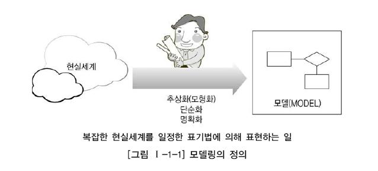
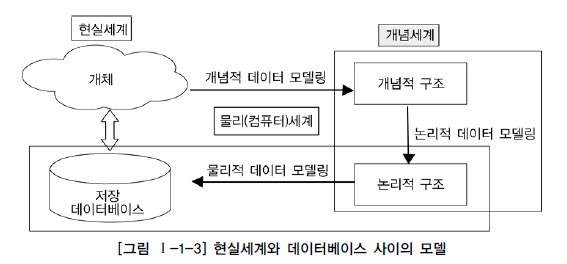
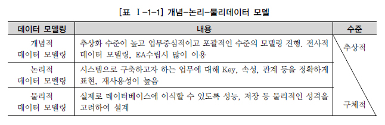
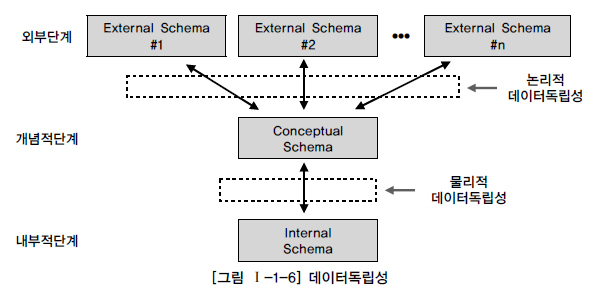
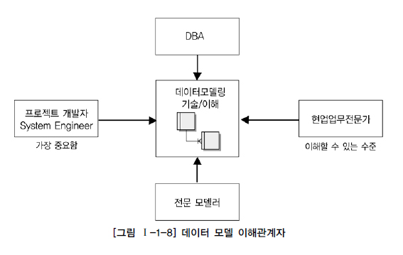
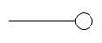
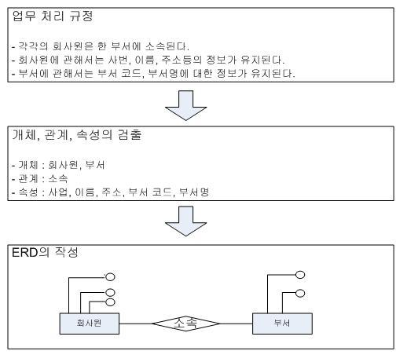

# 데이터 모델의 이해
## 모델링의 이해
### 정의
- 인류의 가장 보편적인 특징이면서 욕구 중의 하나는 의사소통을 하면서 항상 그에 대한 기록을 남기는 것
  - 사람이 어떤 목적을 달성하기 위해 커뮤니케이션의 효율성을 극대화한 고급화된 표현 방법

- 모델 : 일정한 표기법에 의해 모형, 축소형으로 표현해 놓은 모형을 일컬음
  - 사물 또는 사건에 관한 양상(Aspect)이나 관점(Perspective)을 연관된 사람이나 그룹을 위해 명확화
  - 복잡한 ‘현실세계’를 단순화시켜 표현

    

- 모델링 : 시스템의 대상이 되는 업무를 분석하여 정보시스템으로 구현하는 과정

<br>

### 특징
- 추상화 : 현실세계를 일정한 형식에 맞추어 표현
  - 다양한 현상을 일정한 양식으로 표기하는 개념

- 단순화 : 복잡한 현실세계를 약속된 규약에 의해 제한된 표기법이나 언어로 표현
  - 통합하여 쉽게 이해할 수 있게 하는 개념

- 명확화 : 누구나 이해하기 쉽게 하기 위해 표현
  - 대상에 대한 모호함을 제거하고 현상을 정확하게 기술하는 개념

<br>

### 모델링의 세 가지 관점
- 데이터 관점 : 업무가 어떤 데이터와 관련이 있는지, 데이터간의 관계는 무엇인지를 모델링하는 방법(What, Data)

- 프로세스 관점 : 업무가 실제하고 있는 일은 무엇인지, 무엇을 해야 하는지를 모델링하는 방법(How, Process)

- 데이터와 프로세스의 상관관점 : 업무가 처리하는 일의 방법에 따라 데이터는 어떻게 영향을 받고 있는지를 모델링하는 방법(Interaction)

<hr>
<br>

## 데이터 모델의 기본 개념
### 모델링의 상세
- 데이터베이스의 골격을 이해하고 그 이해를 바탕으로 SQL문장을 기능과 성능적인 측면에서 효율적으로 작성하기 위해 꼭 알아야 하는 핵심 요소
  - 정보시스템을 구축하기 위해, 해당 업무에 어떤 데이터가 존재하는지 또는 업무가 필요로 하는 정보는 무엇인지를 분석하는 방법
  - 기업 업무에 대한 종합적인 이해를 바탕으로 데이터에 존재하는 업무 규칙(Business Rule)에 대하여 참(True) 또는 거짓(False)을 판별할 수 있는 사실(사실명제)을 데이터에 접근하는 방법(How), 사람(Who), 전산화와는 별개의(독립적인) 관점에서 이를 명확하게 표현하는 추상화 기법

- 요약
  - 정보시스템을 구축하기 위해 데이터관점의 업무 분석 기법
  - 현실세계의 데이터(what)에 대해 약속된 표기법으로 표현하는 과정
  - 데이터베이스를 구축하기 위한 분석 / 설계의 과정

<br>

### 데이터 모델이 제공하는 기능
- 시스템을 현재 또는 원하는 모습으로 가시화하도록 도와줌

- 시스템의 구조와 행동을 명세화할 수 있게 함

- 시스템을 구축하는 구조화된 틀을 제공

- 시스템을 구축하는 과정에서 결정한 것을 문서화

- 다양한 영역에 집중하기 위해 다른 영역의 세부 사항은 숨기는 다양한 관점을 제공

- 특정 목표에 따라 구체화 된 상세 수준의 표현 방법을 제공

<br>

## 데이터 모델링의 중요성 및 유의점
### 파급효과(Leverage)
- 시스템 구축 작업 중에서 다른 어떤 설계 과정보다 데이터 설계가 더 중요하다. 이유는?
    ```
    1-1. 시스템 구축이 완성되어 간다.
    1-2. 대규모의 데이터 이행을 성공적으로 수행하기 위한 많은 단위 테스트들이 수행되고 이러한 과정들이 반복된다.
    1-3. 각 단위 테스트들이 성공적으로 수행되고 완료되면 이를 전체를 묶어서 병행테스트, 통합테스트를 수행한다.
    
    2-1. 이러한 시점에 데이터 모델의 변경이 불가피한 상황이 발생한다.
    2-2. 이를 해결하기 위해 데이터 구조의 변경에 따른 표준 영향 분석, 응용 변경 영향 분석 등 많은 영향 분석이 일어난다.
    2-3. 그 이후에 해당 분야의 실제적인 변경 작업이 발생하게 된다.
    1. 이 시기의 데이터 구조의 변경으로 인한 일련의 변경작업은 전체 시스템 구축 프로젝트에서 큰 위험요소이다.
    ```

<br>

### 복잡한 정보 요구사항의 간결한 표현(Concisensess)
- 이상적인 모델이 갖추어야 할 가장 중요한 점은 정보 요구사항이 정확하고 간결하게 표현되어야 한다는 것이다. 이유는?
    ```
    1-1. 데이터 모델은 건축물로 비유하자면 설계 도면에 해당한다.
    1-2. 설계 도면은 건축물을 짓는 많은 사람들이 공유하면서 설계자의 생각대로 아름다운 건축물을 만들어 내는 것이다.
    1-3. 시스템을 구축하는 사람들이 설계자의 정보요구사항을 이해하여 애플리케이션을 개발하고 데이터 정합성을 유지할 수 있도록 하는 것이다.
    ```

<br>

### 데이터 품질(Data Quality)
- 데이터베이스에 담겨 있는 데이터는 기업의 중요한 자산이다. 정확성이 떨어지는 데이터라면?
    ```
    1-1. 해당 데이터로 얻을 수 있는 비즈니스의 기회를 상실할 수도 있다.
    1-2. 데이터 구조가 설계되고 초기에 데이터가 조금 쌓일 때에는 인지하지 못하는 경우가 대부분이다.
    1-3. 데이터의 문제는 오랜 기간 숙성된 데이터를 전략적으로 활용하려고 하는 시점에 문제가 대두된다.

    2-1. 데이터 품질의 중대한 이유 중 하나는 데이터 구조이다.
    2-2. 중복 데이터 미정의, 비즈니스 정의 불충분, 동일한 성격의 데이터 비통합은 치유하기 어렵다.
    ```

<br>

### 데이터 모델링의 유의점
- 중복(Duplication)
  - 데이터 모델은 같은 데이터를 사용하는 사람, 시간, 그리고 장소를 파악하는데 도움을 준다.
  - 이는 데이터베이스가 여러 장소에 같은 정보를 저장하는 오류를 범하지 않게 한다.

- 비유연성(Inflexibility)
  - 데이터 모델을 어떻게 설계했느냐에 따라 사소한 업무변화에도 데이터 모델이 수시로 변경됨으로써 유지보수의 어려움을 가중시킬 수 있다.
  - 데이터 정의와 사용 프로세스를 분리한 모델은 데이터 혹은 프로세스의 변화가 애플리케이션과 데이터베이스에 중대한 변화를 일으킬 수 있는 가능성을 줄인다.

- 비일관성(Inconsistency)
  - 개발자가 다른 데이터와 모순된다는 고려 없이 일련의 데이터를 수정한다면 데이터의 중복이 없어도 비일관성이 발생할 수 있다.

<br>

## 데이터 모델링의 3단계 진행
### 시간에 따라 진행되는 과정
<div align=center>



</div>

<br>

### 데이터 모델링의 종류
<div align=center>



</div>

- 개념적 데이터 모델링
  - 개념적 데이터베이스 설계(개념 데이터 모델링)는 조직, 사용자의 데이터 요구사항을 찾고 분석하는데서 시작한다.
    - 이 과정은 어떠한 자료가 중요하며 또 어떠한 자료가 유지되어야 하는지를 결정하는 것도 포함한다.

  - 이 단계에 있어서의 주요한 활동은 핵심 엔터티와 그들 간의 관계를 발견하고, 그것을 표현하기 위해서 엔터티-관계 다이어그램을 생성하는 것이다.
    - 엔터티-관계 다이어그램은 조직과 다양한 데이터베이스 사용자에게 어떠한 데이터가 중요한지 나타내기 위해서 사용된다.

  - 데이터 모델링 과정이 전 조직에 걸쳐 이루어진다면, 그것은 전사적 데이터 모델(Enterprise Data Model)이라고 불린다.

  - 개념 데이터 모델을 통해 조직의 데이터 요구를 공식화하는 것은 두 가지의 중요한 기능을 지원한다.
    - 첫째, 개념 데이터 모델은 사용자와 시스템 개발자가 데이터 요구 사항을 발견하는 것을 지원한다.
      - 개념 데이터 모델은 추상적이다. 그렇기 때문에 그 모델은 상위의 문제에 대한 구조화를 쉽게 하며, 사용자와 개발자가 시스템 기능에 대해서 논의할 수 있는 기반을 형성한다.
    - 둘째, 개념 데이터 모델은 현 시스템이 어떻게 변형되어야 하는가를 이해하는데 유용하다.
      - 일반적으로 매우 간단하게 고립된(Stand Alone) 시스템도 추상적 모델링을 통해서 보다 쉽게 표현되고 설명된다.

- 논리적 데이터 모델링
  - 논리 데이터 모델링은 데이터베이스 설계 프로세스의 Input으로써 비즈니스 정보의 논리적인 구조와 규칙을 명확하게 표현하는 기법 또는 과정이라 할 수 있다.
  
  - 논리 데이터 모델링의 결과로 얻어지는 논리 데이터 모델은 데이터 모델링이 최종적으로 완료된 상태로 물리적인 스키마 설계를 하기 전에 액세스하고, 누가 데이터에 액세스하며, 그러한 액세스의 전산화와는 독립적으로 다시 말해서 누가(Who), 어떻게(How: Process) 그리고 전산화와는 별개로 비즈니스 데이터에 존재하는 사실들을 인식하여 기록하는 것이다.
  
  - 데이터 모델링 과정에서 가장 핵심이 되는 부분이 논리 데이터 모델링이라고 할 수 있다.
    - 데이터 모델링이란 모델링 과정이 아닌 별도의 과정을 통해서 조사하고 결정한 사실을 단지 ERD라는 그림으로 그려내는 과정을 말하는 것이 아니다.
    - 시스템 구축을 위해서 가장 먼저 시작할 기초적인 업무조사를 하는 초기단계에서부터 인간이 결정해야 할 대부분의 사항을 모두 정의하는 시스템 설계의 전 과정을 지원하는 ‘과정의 도구’라고 해야 할 것이다.
  
  - 이 단계에서 수행하는 또 한가지 중요한 활동은 정규화이다.
    - 정규화는 논리 데이터 모델 상세화 과정의 대표적인 활동으로, 논리 데이터 모델의 일관성을 확보하고 중복을 제거하여 속성들이 가장 적절한 엔터티에 배치되도록 함으로써 보다 신뢰성있는 데이터구조를 얻는데 목적이 있다.
    - 논리 데이터 모델의 상세화는 식별자 확정, 정규화, M:M 관계 해소, 참조 무결성 규칙 정의 등을 들 수 있으며, 추가적으로 이력 관리에 대한 전략을 정의하여 이를 논리 데이터 모델에 반영함으로써 데이터 모델링을 완료하게 된다.

- 물리적 데이터 모델링
  - 데이터베이스 설계 과정의 세 번째 단계인 물리 데이터 모델링은 논리 데이터 모델이 데이터 저장소로서 어떻게 컴퓨터 하드웨어에 표현될 것인가를 다룬다.

  - 데이터가 물리적으로 컴퓨터에 어떻게 저장될 것인가에 대한 정의를 물리적 스키마라고 한다.
    - 이 단계에서 결정되는 것은 테이블, 칼럼 등으로 표현되는 물리적인 저장구조와 사용될 저장 장치, 자료를 추출하기 위해 사용될 접근 방법 등이 있다.
    
    - 계층적 데이터베이스 관리 시스템 환경에서는 데이터베이스 관리자가 물리적 스키마를 설계하고 구현하기 위해서 보다 많은 시간을 투자하여야 한다.

<br>

## 프로젝트 생명주기(Life Cycle)에서 데이터 모델링
- 일반적인 사항
  - 계획 또는 분석단계 : 개념적 데이터 모델링
   - 분석단계 : 논리적 데이터 모델링
   - 설계단계 : 물리적 데이터 모델링

- 현실 프로젝트에서는 대부분 개념/논리 데이터 모델링이 합쳐져 분석단계 때 수행

<br>

## 데이터 모델링에서 데이터 독립성의 이해
### 데이터 독립성의 필요성
- 데이터 독립성은 미국 표준 협회(ANSI) 산하의 X3 위원회(컴퓨터 및 정보 처리)의 특별연구분과위원회에서 1978년에 DBMS와 그 인터페이스를 위해 제안한 ‘three-schema architecture’로 정의된다.
  - 데이터 독립성의 확보 시
    - 각 View의 독립성을 유지하고 계층별 View에 영향을 주지 않고 변경이 가능하다.
    - 단계별 Schema에 따라 데이터 정의어(DDL)와 데이터 조작어(DML)가 다름을 제공한다.

- 어떤 단위에 대해 독립적인 의미를 부여하고 그것을 효과적으로 구현하는 것이다.
  - 자신이 가지는 고유한 특징을 명확히 하고 다른 기능의 변경으로부터 자신의 고유한 기능을 변경하지 않고 제공할 수 있다.

- 데이터 독립성의 반대말은 데이터 종속성이다.
  - 여기에서 종속의 주체는 보통 응용(Application)을 지칭하는 경우이다.
  - 응용(Application)은 사용자 요구사항을 처리하는 사용자 접점의 인터페이스 오브젝트이다.

- 과거에 파일방식으로 데이터를 구성할 때는 데이터가 있는 파일과 데이터에 접근하기 위한 인덱스를 별도로 구현하여 접근하게 했다.
  - 사용자가 접근하는 방법(트랜잭션의 유형)에 따라 파일의 정렬순서, 인덱스의 정렬순서, 파일 구성 등을 제공하기 쉽게 별도로 구성하였다.
  - 즉, 사용자 접근하는 유형에 따라 데이터를 구성하는 방법이 영향을 받게 된다.
 
- 메인프레임 환경에서 파일방식을 사용했기에 개별로 데이터 처리를 시행하였다.
  - 1990년대 이후의 Client/Sever 세대는 파일처리 방식 이해가 난해할 수 있다.

- 데이터 독립성은 지속적으로 증가하는 유지보수 비용을 절감하고 데이터 복잡도를 낮추며 중복된 데이터를 줄이기 위한 목적이 있다.
  - 끊임없이 요구되는 사용자 요구사항에 대해 화면과 데이터베이스 간에 서로 독립성을 유지하기 위한 목적으로 데이터 독립성 개념이 출현했다고 할 수 있다.

- 요약 : 데이터 독립성이 필요한 이유
  - 유지보수 비용 증가
  - 데이터 중복성 증가
  - 데이터 복잡도 증가
  - 요구사항 대응 저하

<br>

### 데이터베이스의 3단계 구조
- 데이터 독립성은 3단계로 표현된 ANSI 표준 모델을 살펴보면 되는데 특히 3단계인 구조, 독립성, 사상(Mapping) 3가지로 이해하면 된다.

- ANSI/SPARC의 3단계 구성의 데이터 독립성 모델은 외부단계와 개념적 단계, 내부적 단계로 구성된 서로 간섭되지 않는 모델을 제시하고 있다.

<div align=center>



</div>

<br>

### 데이터 독립성 요소
- 외부 스키마 : 사용자 관점으로 각각의 특성에 따른 스키마를 구성
  - View 단계에서 여러 개의 사용자 관점으로 구성한 개인적 DB 스키마
  - DB의 개개 사용자나 응용프로그래머가 접근하는 DB 정의

- 개념 스키마 : 통합적인 관점
  - 개념단계 하나의 개념과 개념적 스키마로 구성되어 모든 사용자 관점을 통합한 조직 전체의 DB를 기술하는 것이다.
  - 모든 응용시스템들이나 사용자들이 필요로 하는 데이터를 통합한 조직 전체의 DB를 기술한 것으로 DB에 저장되는 데이터와 그들간의 관계를 표현하는 스키마

- 내부 스키마 : 물리적인 저장구조
  - 내부단계, 내부 스키마로 구성, DB가 물리적으로 저장된 형식
  - 물리적 장치에서 데이터가 실제적으로 저장되는 방법을 표현하는 스키마

- 데이터 독립성 요소가 3단계로 분리되면서 영역을 지정하는 용어가 생겼다.
  - 논리적 독립성 : 사용자 특성에 맞게 변경하거나 통합적으로 구조를 변경할 수 있다.
    - 개념 스키마가 변경되어도 외부 스키마에는 영향을 미치지 않도록 지원하는 것
    - 논리적 구조가 변경되어도 응용 프로그램에 영향이 없다.
  - 물리적 독립성 : 물리적 구조의 영향 없이 개념 구조를 변경하거나 개념 구조의 영향 없이 물리적 구조를 변경할 수 있다.
    - 내부 스키마가 변경되어도 외부/개념 스키마는 영향을 받지 않도록 지원하는 것이다.
    - 저장장치의 구조변경은 응용프로그램과 개념 스키마에 영향이 없다.

<br>

### 사상
- 영어로 ‘Mapping’은 우리말로 ‘사상’이며 상호 독립적인 개념을 연결시켜주는 다리를 뜻한다.
  - 연관성을 관계하여 연결시키는 의미이자, 해당 값이 다른 값을 가리키도록 하는 것이다.

- 외부적/개념적 사상 : 외부적인 뷰와 개념적 뷰의 상호 관련성을 정의
  - 즉, 외부 화면이나 사용자에게 인터페이스하기 위한 스키마 구조는 전체가 통합된 개념적 스키마와 연결된다는 것이다.
  - ex) 사용자가 접근하는 형식에 따라 다른 타입의 필드를 가질 수 있음.
  - ex) 개념적 뷰의 필드 타입은 변화가 없음

- 개념적/내부적 사상 : 개념적 뷰와 저장된 데이터 베이스의 상호관련성 정의
  - 통합된 개념적 스키마 구조와 물리적으로 저장된 구조의 물리적인 테이블스페이스와 연결되는 구조이다.
  - ex) 저장된 데이터베이스 구조가 바뀐다면 개념적/내부적 사상이 바뀌어야 함

<br>

## 데이터 모델링의 중요한 세 가지 개념
### 데이터 모델링의 3요소
```
0-0. A와 B는 서로 사랑하는 연인사이이다.
0-1. A는 키가 180cm에 친절하며 조용한 성격이다.
0-2. B는 키가 165cm에 세심하며 활달한 성격이다.

1-1. [A, B]는 어떤 것(Things)에 해당
1-2. [180cm라는 신장, 친절하다]는 어떤 것이 가지는 성격(Attributes)에 해당
1-3. [사랑하는 연인사이]는 어떤 것 간의 관계(Relationships)에 해당
```

- 엔터티 : 업무가 관여하는 어떤 것(Things)
  - 사물이나 사건 등을 바라 볼 때 전체를 지칭하는 용어

- 속성 : 어떤 것이 가지는 성격(Attributes)
  - 엔터티가 가지는 세부적인 사항

- 관계 : 업무가 관여하는 어떤 것 간의 관계(Relationships)
  - 각각의 엔터티는 다른 엔터티와 연관성을 가짐

<br>

### 단수와 복수(집합)의 명명
|개념|복수/집합|개별/단수|
|:--:|--------------------------|--------------------------------|
|어떤 것(Things)|엔터티 타입(Entity Type)|엔터티(Entity)|
|-|엔터티(Entity)|인스턴스(Instance), 어커런스(Occurrence)|
|어떤 것의 성격(Characterisitic of a Thing)|속성(Attribute)|속성값(Attribute Value)|
|어떤 것의 관계(Association between Things)|관계(Relationship)|페어링(Pairi

<br>

## 데이터 모델링의 이해관계자
<div align=center>



</div>

<br>

## ERD, 데이터 모델의 표기법
### 정의
- 1976년 피터첸(Peter Chen)에 의해 개체-관계 모델(Entity-Relationship Model) 제안
  - 개체-관계 모델이란 구조화된 데이터에 대한 일련의 표현

- 구조화된 데이터를 저장하기 위해 데이터베이스를 사용
  - 데이터의 구조 및 그에 수반한 제약 조건들은 다양한 기법에 의해 설계 가능
  - 개체-관계 모델링(ERM: Entity-Relationship Modelling)은 그런 기법 중 하나

- ERM 프로세스의 산출물을 가리켜 개체-관계 다이어그램(ERD: Entity-Relationship Diagram)이라고 부름

<br>

### 개념
- ERD : 전략적 계획이나 또는 하향식 계획에서 자주 사용되며, 개략적인 상부계층의 데이터 다이어그램
  - 기업체를 효율적으로 운영하기 위해서는 어느 정도의 데이터가 필요하며 정확한 데이터는 필요한 사람에게 전달하는데 효과적
  - 데이터에 관한 데이터를 흔히 메타데이터라고 칭하며 데이터 모델들은 이러한 메타데이터를 포함함
    - 문제가 되는 데이터는 정연하고 자세히 설명될 필요가 있으므로 이를 위해 데이터에 관한 데이터가 필요한 것

<br>

### 기본 요소
- Entity : 시스템화 하고자 하는 사건, 사물
<div align=center>

  

</div>

- Attribute : 엔티티, 관계성의 성질을 나타내는 더 이상 쪼갤수 없는 정보의 단위
<div align=center>

  

</div>

- Relationship : 엔티티 간, 애트리뷰트 간의 연관성
<div align=center>

  

</div>

- 실세계의 모든 업무체계는 기본요소 3가지(Entity, Relationship, Attribute)로 모두 표현 가능

<br>

### ERD 표기법을 이용한 모델링
<div align=center>

  

</div>

- 순서
  - 엔터티 배치
  - 엔터티 간 관계 설정

    
    - (IE 표기법임)
  - 관계명 기술
  - 관계 참여도 기술
  - 관계 필수여부 기술

<br>

## 좋은 데이터 모델의 요소
### 완전성(Completeness)
- 업무에서 필요로 하는 모든 데이터가 모델에 정의되어 있어야 한다.

<br>

### 중복배제(Non-Redundancy)
- 하나의 데이터베이스에 동일한 사실은 반드시 한번만 기록되어야 한다.

<br>

### 업무규칙(Business Rules)
- 업무규칙(Business Rules)을 데이터 모델링에 표현하고, 모든 사용자가 공유한다.

- 모든 사용자(개발자, 관리자)가 해당 규칙에 대해 동일하게 판단하고 데이터를 조작할 수 있어야 된다.

<br>

### 데이터 재사용(Data Reusability)
- 통합성
  - 데이터는 전사적 관점에서 공통데이터를 도출하고 이를 전 영역에서 사용하기 적절한 형태로 설계되어야 한다.

- 독립성
  - 데이터는 어플리케이션에 독립적으로 설계되어야 한다.

- 유연성
  - 데이터는 비즈니스 변화에 유연하게 대처하고 확장이 용이하게 설계되어야 한다.

<br>

### 의사소통(Communication)
- 데이터 모델은 대상 업무를 데이터 관점에서 분석하고 설계하여 나오는 최종 산출물이다.

- 분석과정에서 도출되는 수많은 업무 규칙들은 최대한 자세하게 표현되어야 한다.

- 모든 관련자들이 데이터 모델을 통해 의사소통을 할 수 있도록 자세하게 기술해야 한다.

<br>

### 통합성(Integration)
- 데이터 재사용 항목 참조

<br>
