# [엔터티, 속성, 관계] + 식별자

# 엔터티
## 엔터티의 개념
- 업무에 필요하고 유용한 정보를 저장하고 관리하기 위한 집합적인 것(Things)이다.
  - 사람, 장소, 물건, 사건, 개념 등의 명사에 해당
  - 업무상 관리가 필요한 관심사에 해당
  - 저장이 되기 위한 어떤 것(Thing)

- 엔터티는 눈에 보이는(Tangible)한 것만이 아니며 눈에 보이지 않는 개념도 포함된다.

 

## 엔터티와 인스턴스에 대한 내용과 표기법

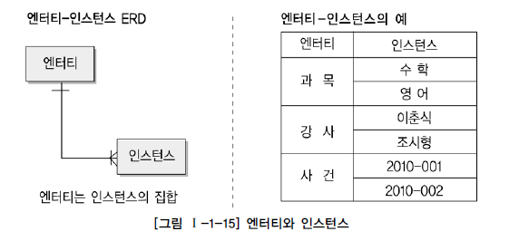

 

## 엔터티의 특징
- 도출된 엔터티가 다음의 성질을 만족하지 못하면 적절하지 않은 엔터티일 확률이 높다.
  - 해당 업무에 필요하고, 관리해야 하는 정보인가?

    

  - 유일한 식별자가 존재하는가?

    

  - 영속적으로 존재하는 인스턴스의 집합인가?

    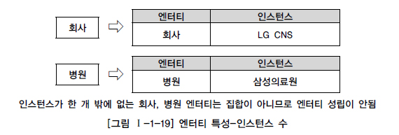

  - 업무 프로세스에 의해 이용되는가?

    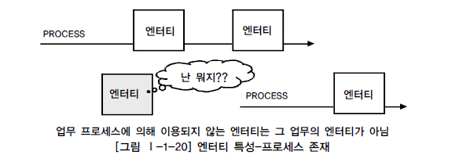

  - 속성이 존재하는가?

    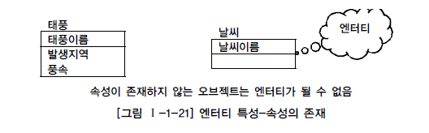

  - 다른 엔터티와 최소 한 개 이상의 관계가 존재하는가?

    

    - 예외적으로 통계성, 코드성, 시스템 처리시 내부 필요에 의한 엔터티 도출은 관계를 생략하게 된다.

 

## 엔터티의 분류

### 유무형에 따른 분류
- 유형 엔터티
  - 물리적인 형태가 있고 안정적이며 지속적으로 활용되는 정보
  - 업무로부터 엔터티를 구분하기가 가장 용이
  - 사원, 물품 등

- 개념 엔터티
  - 물리적인 형는 존재하지 않고 관리해야 할 개념적 정보
  - 조직, 휴가 등

- 사건 엔터티
  - 업무를 수행함에 따라 발생되는 정보
  - 주문, 청구, 신청, 결재 등

 

### 발생시점에 따른 분류
- 기본 엔터티
  - 업무에 원래 존재하는 정보로서 다른 엔터티와의 관계가 아닌 독립적으로 생성이 가능
  - 다른 엔터티로부터 주식별자를 상속받지 않고 고유한 주식별자를 소유
  - 사원, 조직, 고객, 상품 등

- 중심 엔터티
  - 업무에 있어서의 중심적인 역할을 하며 기본 엔터티로부터 발생
  - 다른 엔터티와의 관계로 많은 행위 엔터티를 생성
  - 주문, 청구, 매출, 신청 등

- 행위 엔터티
  - 두 개 이상의 부모 엔터티로부터 발생하고 자주 내용이 바뀌거나 데이터량이 증가
  - 분석 초기 단계에서는 잘 나타나지 않음
  - 상세 설계, 프로세스와 상관 모델링을 진행하면 도출될 수 있음
  - 주문목록, 사유 변경이력 등

 

### 엔터티 분류 방법의 예

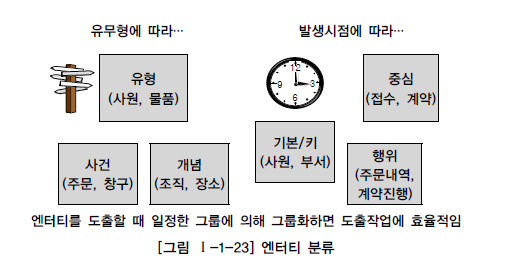

 

### 엔터티의 명명
- 가능한 현업에서 사용하는 용어를 채택

- 약어 사용 지양

- 단수 명사 사용

- 중복되는 이름이 없어야 함

- 엔터티의 생성 의미대로 이름 부여

 

# 속성
## 속성의 개념
- 사물이나 개념이 어떤 것인지를 나타내고 그것을 다른 것과 구별하는 성질

- 업무상 관리하기 위한 최소의 의미 단위
  - 이름, 주소, 생년월일 등 최소 데이터 단위
  - 업무에서 필요하며 의미가 더 이상 분리되지 않음
  - 엔터티를 설명할 수 있으며 인스턴스를 구성

 

## 엔터티, 인스턴스와 속성, 속성값에 대한 내용과 표기법
### 엔터티, 인스턴스, 속성, 속성값의 관계

- 한 개의 엔터티는 두 개 이상의 인스턴스의 집합이어야 한다.

- 한 개의 엔터티는 두 개 이상의 속성을 갖는다.

- 한 개의 속성은 한 개의 속성값을 갖는다.

 

### 속성의 표기법

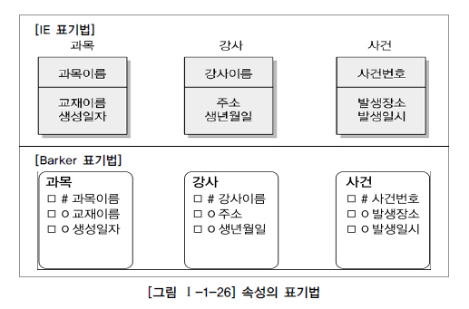

 

## 속성의 특징
- 도출된 속성이 다음의 성질을 만족하지 못하면 적절하지 않은 속성일 확률이 높다.
  - 해당 업무에 필요하고, 관리해야 하는 정보인가?

  - 정규화 이론에 근간하여 주식별자에 함수적 종속성을 가지는가?

  - 하나의 속성은 한 개의 값만을 가지는가?

 

## 속성의 분류
### 속성의 특성에 따른 분류
- 기본속성
  - 업무로부터 추출한 모든 속성이 여기에 해당하며 가장 일반적이고 많은 속성
  - 코드성 데이터, 엔터티를 식별하기 위해 부여된 일련번호, 그리고 다른 속성을 계산하거나 영향을 받아 생성된 속성을 제외한 모든 속성은 기본속성

- 설계속성
  - 설계속성은 업무상 필요한 데이터 이외에 데이터 모델링을 위해, 업무를 규칙화하기 위해 속성을 새로 만들거나 변형하여 정의하는 속성

- 파생속성
  - 다른 속성에 영향을 받아 발생하는 속성으로서 보통 계산된 값들이 이에 해당

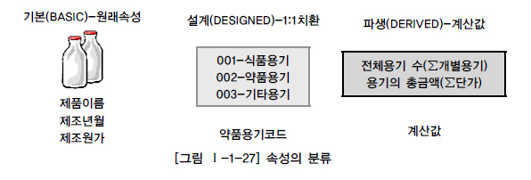

 

### 엔터티 구성방식에 따른 분류
- PK(Primary Key)속성 : 엔터티를 식별할 수 있는 속성

- FK(Foreign Key)속성 : 다른 엔터티와의 관계에서 포함된 속성

- 일반속성 : 엔터티에 포함되고 PK, FK에 포함되지 않은 속성

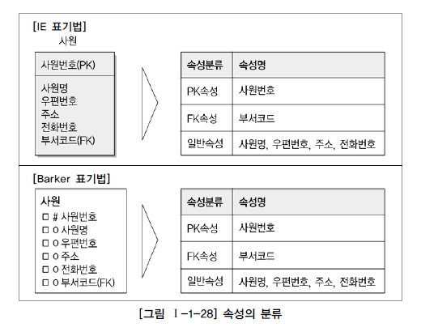

 

### 기타 방식에 따른 분류
- 세부 의미를 쪼갤 수 있는가?
  - 복합 속성
  - 단순 속성

- 동일한 성질의 여러 개의 값이 존재하는가?
  - 단일값 속성
  - 다중값 속성

 

## 도메인
- 엔터티 내에서 속성에 대한 데이터 타입과 크기, 제약사항을 지정한 것

 

## 속성의 명명
- 가능한 현업에서 사용하는 용어를 채택

- 서술식 속성명 사용 지양

- 약어 사용 지양

- 전체 데이터 모델에서 유일성을 확보할 것

 

# 관계
## 관계의 개념
- 정의
  - 엔터티의 인스턴스 사이에 존재의 형태나 행위로서 서로에게 연관성이 부여된 상태
  - 엔터티의 정의에 따라, 속성 및 관계 정의에 따라 다양하게 변함

- 페어링
  - 페어링 : 엔터티 안에 인스턴스가 개별적으로 관계를 가지는 것
  - 관계 : 페어링의 집합
  - 엔터티가 인스턴스의 집합을 논리적으로 표현한다면 관계는 관계 페어링의 집합을 논리적으로 표현한 것

 

## 관계의 분류

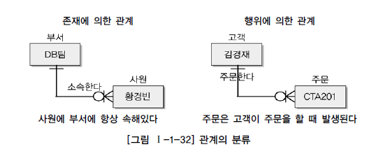

 

- ERD : 존재적 관계와 행위에 의한 관계를 구분하지 않고 표현

- UML : 존재적 관계와 행위에 의한 관계를 구분하여 표현
  - 의존관계(실선) : 멤버 변수
  - 연관관계(점선) : 파라미터

 

## 관계의 표기법
- 관계명 : 관계의 이름

  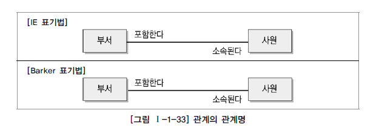

  - 관계시작점 : 관계가 시작되는 편
  - 관계끝점 : 관계를 받는 편
  - 참여자의 관점에 따라 관계 이름은 능동/수동적으로 명명
    - 애매한 동사를 해야 함
    - 현재형으로 표현

- 관계차수 : 1:1, 1:N, M:N
  - 1:1(OneToOne)

    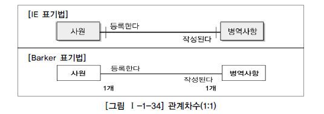

     

  - 1:M(OneToMany)

    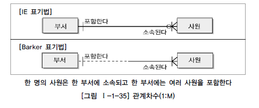

     

  - M:N(ManyToMany)

    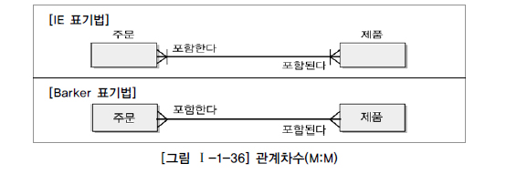

- 관계선택사양 : 필수관계, 선택관계

  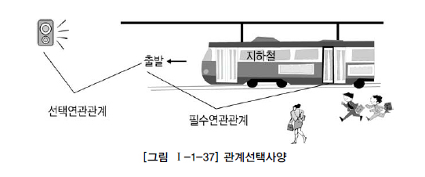

  - 참여하는 엔터티가 항상 참여하는지(필수참여), 참여할 수도 있는지(선택참여)를 나타내는 방법
  - 예 : 주문서는 반드시 주문목록을 가져야한다.
    - 주문목록이 없는 주문서는 의미가 없으므로 필수참여관계이다.
    - 주문목록은 주문이 될 수도, 되지 않을 수도 있으므로 선택참여관계이다.

  

 

## 관계 정의 및 읽기
### 관계 체크사항
- 개발자
  - 두 개의 엔터티 사이에 관심 있는 연관 규칙이 존재하는가?
  - 두 개의 엔터티 사이에 정보의 조합이 발생하는가?

- 현업
  - 업무 기술서, 장표에 관계연결에 대한 규칙이 서술되어 있는가?
  - 업무 기술서, 장표에 관계연결을 가능하게 하는 동사(Verb)가 있는가?

 

### 관계 읽기
- 기준 엔터티를 한 개 또는 각각으로 읽는다.

- 대상 엔터티의 관계참여도 갯수(하나, 하나 이상)를 읽는다.

- 관계선택사양과 관계명을 읽는다.

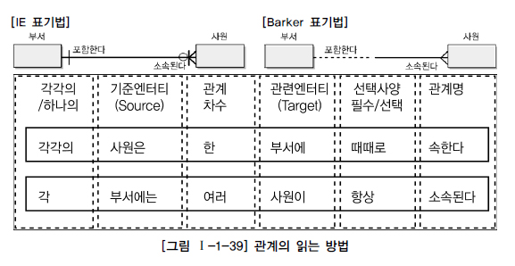

 

# [추가] 식별자
## 식별자의 개념
- 여러 개의 집합체(엔터티)의 통에서 각각을 구분할 수 있는 논리적인 이름

- 하나의 엔터티에 구성된 여러 속성 중 엔터티를 대표할 수 있는 속성
  - 하나의 엔터티는 반드시 하나의 유일한 식별자가 존재

- 식별자 : 업무적으로 구분이 되는 정보, 논리 데이터 모델링 단계에서 사용

- 키 : 데이터베이스 테이블에 접근을 위한 매개체로서 물리 데이터 모델링 단계에서 사용

 

## 식별자의 특징

 

## 식별자 분류 및 표기법
### 식별자 분류

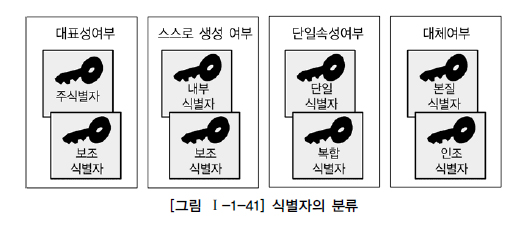

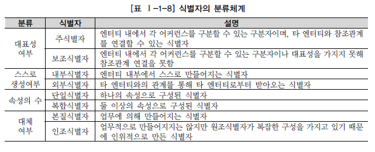

 

### 식별자 표기법

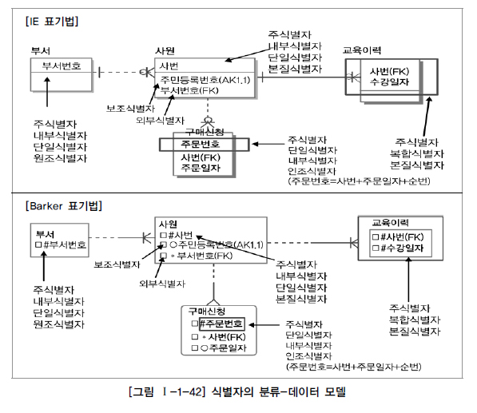

 

## 주식별자 도출기준
- 해당 업무에서 자주 이용되는 속성을 주식별자로 지정
  - 유일하게 식별 가능한 속성이 여러개여도 회사에서 자주 사용하는 속성을 채택

- 명칭, 내역 등 이름으로 기술되는 것은 지양
  - 이름보다 코드로 관리

- 속성의 수가 많아지지 않도록 함
  - 모델상에 표현하는 문장의 간편성과 애플리케이션에 복잡한 소스구성을 피하기 위해 과도한 복합키는 배제

 