# 성능 데이터 모델링의 개요
## 성능 데이터 모델링의 정의
- 데이터베이스 성능 향상을 목적으로 설계 단계부터 정규화, 반정규화, 테이블 통합, 테이블 분할, 조인 구조, PK, FK 등 성능과 관련된 여러 사항이 데이터 모델링에 반영될 수 있도록 하는 것

 

## 성능 데이터 모델링 수행시점
- 사전에 할 수록 비용이 들지 않음

- 분석 및 설계 단계에서 성능을 고려하여 데이터 모델링을 수행하면 차후 성능 저하로 발생하는 재업무(Rework) 비용을 최소화 할 수 있음

- 비즈니스 처리에 핵심적인 트랜잭션이 있다면, 프로젝트 초기에 운영을 대비한 테스트 환경을 구축한 뒤 임의의 트랜잭션을 발생시켜 성능 테스트를 해야함

- 가장 적절한 구조인지 검토한 후 데이터 모델의 구조를 변경하며 디자인하는 전략 요구

 

## 성능 데이터 모델링 고려사항
- 데이터 모델링 수행 시 정확한 정규화
- 데이터베이스 용량 산정
- 데이터베이스에 발생 되는 트랜잭션의 유형 파악
- 용량과 트랜잭션 유형에 따른 반정규화 수행
- 이력 모델, PK/FK, 슈퍼타입/서브타입의 조정 등 수행
- 성능 관점에서의 데이터 모델 검증
  - 일반적인 데이터 모델 규칙뿐만 아니라 충분한 성능이 고려 되었는지 체크리스트에 포함

 

# 정규화와 성능
## 정규화의 개념
- 정규화(Normalization) : 다양한 유형의 검사로 데이터 모델을 구조화하고 개선시켜 나가는 절차에 관한 이론

  |정규화 종류|정규화 내용|
  |--------|--------|
  |1차 정규화|복수의 속성값을 갖는 속성을 분리|
  |2차 정규화|주식별자에 종속적이지 않은 속성을 분리. 부분종속 속성을 분리|
  |3차 정규화|속성에 종속적인 속성의 분리, 이전 종속(Transitive Dependency) 속성을 분리|
  |보이스-코드|정규화	다수의 주식별자 분리|
  |4차 정규화|다가 종속(Multi-Valued Dependency) 속성 분리|
  |5차 정규화|결합 종속(Join Dependency)일 경우는 두 개 이상의 N개로 분리|

 

## 정규화를 통한 성능 향상 전략
- 정규화는 기본적으로 데이터의 중복성을 제거하고 데이터를 관심사별로 모은다.
  - 엔터티와 조인이 많이 발생하는 상황에서는 정규화로 인해 성능이 저하되기도 하므로 반정규화를 적용하는 전략이 필요하다.

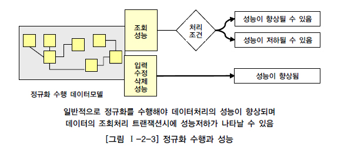

- 정규화를 수행하면 조회 성능이 항상 저하되는가?
  - 처리 조건에 따라 조회 성능이 향상될 수도, 저하될 수도 있다.
  - 정규화 모델은 일반적으로 반정규화 테이블보다 입력, 수정, 삭제 성능이 좋다.

 

## 반정규화 테이블의 성능 저하 사례 1

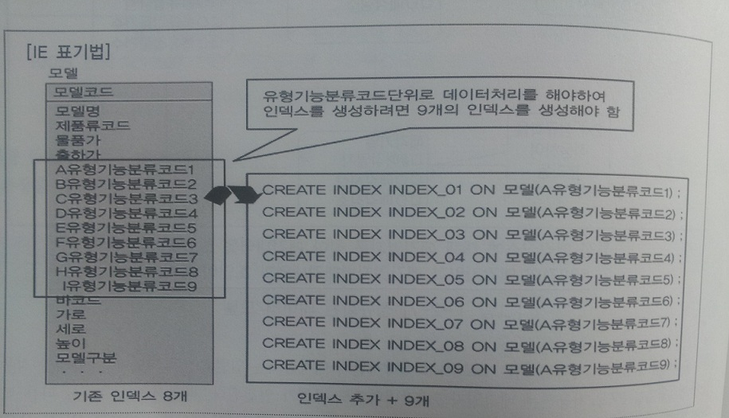

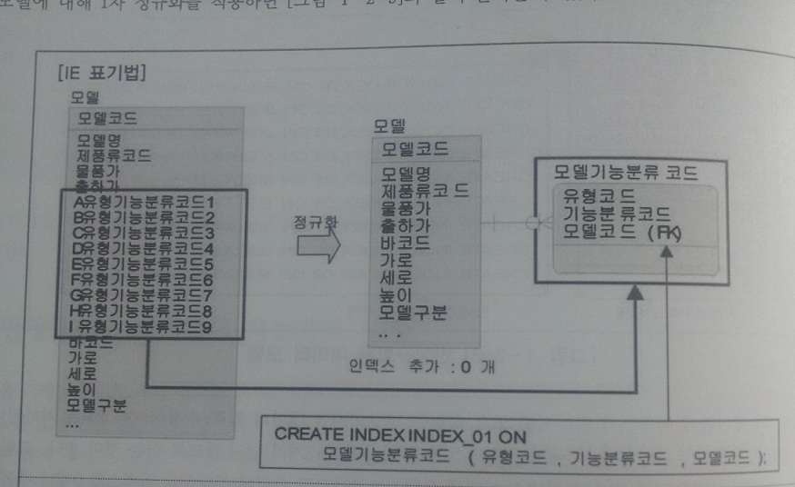

 

## 반정규화 테이블의 성능 저하 사례 2

 

## 반정규화 테이블의 성능 저하 사례 3

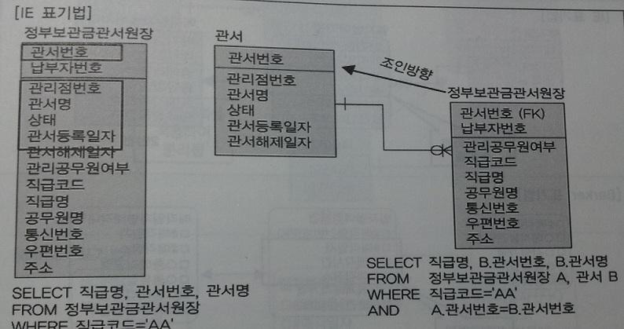

 

## 반정규화 테이블의 성능 저하 사례 4

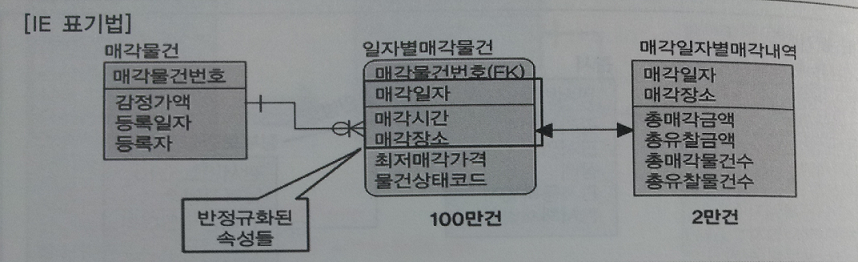

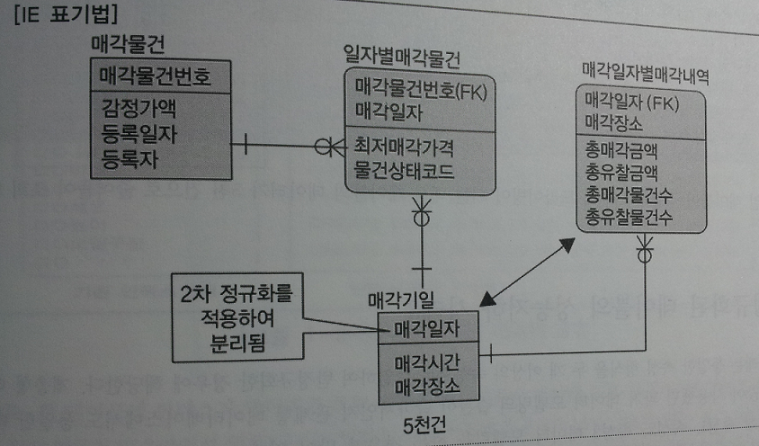

## 함수적 종속성에 근거한 정규화
- 함수의 종속성(Functional Dependency) : 데이터가 어떠한 기준값에 의해 종속되는 현상
  - 기준값을 결정자(Determinant), 종속되는 값을 종속자(Dependent)라고 지칭
  - ex) 주민등록번호는 사람의 이름, 출생지, 주소로 생성되어 유일한 값을 가지므로 '주민번호가 이름, 출생지, 주소를 함수적으로 결정한다' 고 말할 수 있다.

- 함수의 종속성은 데이터의 근본적인 속성으로 정규화 또는 각 오브젝트에 속성을 배치할 때 이용된다.

 

# 반정규화와 성능
## 반정규화의 개념
- 반정규화 : 정규화 된 엔터티, 속성, 관계를 시스템의 성능 향상과 개발 및 운영의 단순화를 위해 중복, 통합, 분리 등을 수행하는 데이터 모델링 기법

- 반정규화 수행 상황
  - 디스크 I/O량이 많아 조회 성능이 저하되는 경우
  - 테이블 사이의 경로가 너무 멀어 조인으로 인한 성능이 저하되는 경우
  - 컬럼을 계산하여 읽을 때 성능이 저하 될것으로 예상되는 경우
  - 업무적으로 조회에 대한 처리 성능이 중요하다고 판단될 때 부분적으로 반정규화를 고려

- 일반적으로 설계단계에서 반정규화를 적용하며 반정규화 미수행시에는 다음과 같은 현상이 발생한다.
  - 성능이 저하된 데이터베이스가 생성될 수 있다.
  - 구축 또는 테스트 단계에서 반정규화를 적용하면 수정 비용이 많이든다.

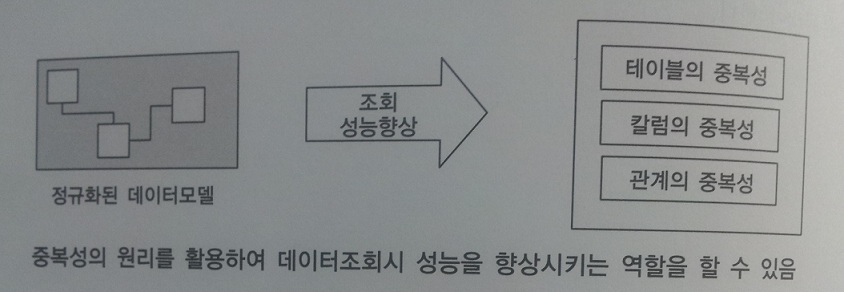

 

## 반정규화 적용방법
- 반정규화의 필요성이 결정되면 컬럼, 테이블, 관계의 반정규화를 종합적으로 고려하여 적용

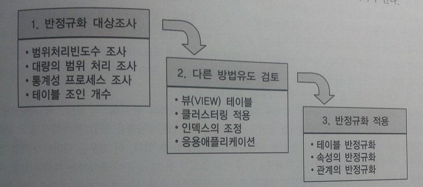

### 반정규화 적용 순서
- 반정규화 대상 조사
  - 자주 사용되는 테이블에 액세스하는 프로세스의 수가 가장 많고, 항상 일정한 범위만을 조회하는 경우
  - 테이블에 대량 또는 광범위한 데이터가 존재할 때 처리 성능을 보장할 수 없는 경우
  - 통계성 프로세스에 의한 정보가 필요한 경우 별도의 통계 테이블(반정규화) 생성
  - 테이블에 많은 조인으로 인해 데이터를 조회하는 것이 기술적으로 어려운 경우

- 반정규화 대상을 다른 방법으로 처리할 수 있는지 검토
  - 테이블에 많은 조인으로 데이터를 조회하는 것이 기술적으로 어려운 경우 View 검토
    - 조회성능을 향상 시키지는 않으나 SQL 작성의 미숙함으로 인한 성능 저하를 예방
  - 대량의 데이터 처리나 부분 처리에 의해 성능이 저하되는 경우 클러스터링을 적용하거나 인덱스 조정을 통해 성능 향상
  - 대량의 데이터는 PK의 성격에 따라 파티셔닝 기법을 적용하여 성능 저하를 방지
  - 어플리케이션에서 로직을 구현하는 방법을 변경하므로써 성능 향상

- 반정규화 적용
  - 반정규화 대상으로는 테이블, 속성, 관계에 대해 적용할 수 있으며 중복을 통한 방법뿐만 아니라 테이블, 속성, 관계를 추가/분할/제거할 수 있다.

 

## 반정규화의 기법
### 테이블 반정규화
- 테이블 병합
  - `1:1 관계 테이블 병합` : 1:1 관계를 통합
  - `1:M 관계 테이블 병합` : 1:M 관계를 통합
  - `슈퍼/서브타입 테이블병합` : 슈퍼/서브 관계를 통합

- 테이블 분할
  - 수직 분할 : 컬럼 단위 테이블을 디스크 I/O의 분산처리를 위해 1:1로 분리
  - 수평 분할 : 로우 단위 트랜잭션을 분석해 디스크 I/O 및 데이터 접근의 효율성을 증가

- 테이블 추가
  - 중복 테이블 추가 : 업무와 서버가 다른 경우 동일한 테이블 구조를 중복하여 원격 조인을 제거
  - 통계 테이블 추가 : SUM, AVG 등을 미리 계산하여 보관
  - 이력 테이블 추가 : 마스터 테이블에 존재하는 레코드를 중복하여 보관
  - 부분 테이블 추가 : 하나의 테이블에 자주 이용하는 컬럼을 별도로 모아 보관

 

### 컬럼 반정규화
- 중복 컬럼 추가
  - 조인 성능을 위해 중복 컬럼 추가

- 파생 컬럼 추가
  - 트랜잭션이 처리될 때 연산으로 발생하는 성능 저하를 예방하기 위해 미리 계산한 값을 저장하는 컬럼 추가

- 이력 테이블 추가
  - 대량의 이력 데이터 처리시 불특정 또는 최근 값을 조회할 때 나타날 수 있는 성능 저하를 예방하기 위해 기능성 컬럼(최근값여부, 시작일자,종료일자)을 추가

- PK에 의한 컬럼 추가
  - PK에 데이터가 존재하지만 성능을 위해 일반 속성으로 포함

- 응용시스템 오작동을 위한 컬럼 추가
  - 업무적으로는 의미가 없으나 데이터 처리 간 오류가 발생하면 원래의 값으로 복구할 필요가 있을 때 이전 데이터를 임시적으로 중복 보관

 

### 관계 비정규화
- 중복 관계 추가
  - 여러 경로를 거쳐 조인이 가능하지만 성능을 위해 추가적인 관계를 맺는 방법

 

## 정규화가 잘 정의된 데이터 모델에서 성능이 저하될 수 있는 경우
- 전화번호, 메일, 위치 정보가 이력 형태로 관리되는 데이터 모델

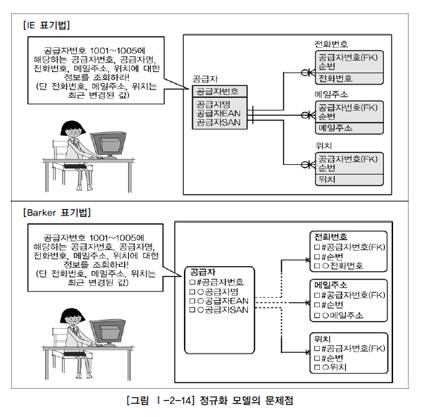

 

## 정규화가 잘 정의된 데이터 모델에서 성능이 저하된 경우
- 분산 환경에서 다른 서버의 테이블에서 정보를 가져올 때

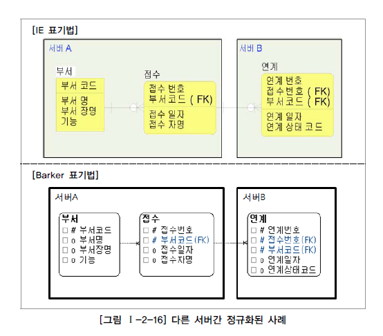

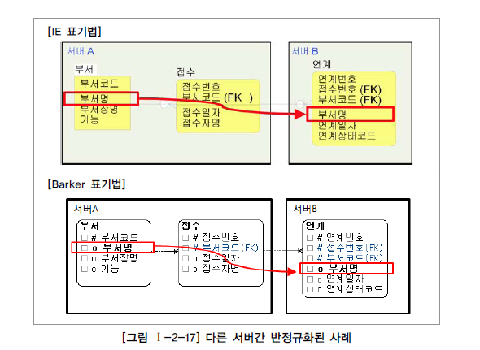

 

# 대량 데이터에 따른 성능
## 대량 데이터발생에 따른 테이블 분할 개요
- 대량 데이터가 발생하는 테이블의 문제점
  - 설계가 잘 되어 있어도 대량의 데이터가 하나의 테이블 또는 하드웨어 공간에 집약되어 있으면 성능 저하를 피하기 힘들다.
  - 인덱스의 트리가 커지고 깊어지며 조회 성능에 영향을 미친다.
  - 입력/수정/삭제의 트랜잭션 경우도 인덱스의 특성상 부하가 증가하여 성능 저하를 유발한다.
  - 컬럼이 많아지면 물리 디스크의 여러 블록에 데이터가 저장되는데, 이는 로우가 너무 길어져 로우 체이닝과 로우 마이그레이션이 증가하여 성능 저하를 유발하한다.

 

## 한 테이블에 대량의 컬럼을 가지고 있는 경우
- 200개의 컬럼을 가진 도서 테이블의 로우 길이가 10K이고 블록이 2K 단위로 쪼개져 있으면 로우는 대략 5개의 블록에 저장된다.
  - 컬럼이 여러 블록에 흩어지면, 디스크 I/O가 많이 일어난다.

- 트랜잭션이 어떤 컬럼에 집중적으로 발생되는지 분석하여 테이블 분할을 하면 디스크 I/O가 감소하여 성능을 개선할 수 있다.

 

## 대량 데이터 저장 및 처리로 인한 성능
- 대량 데이터가 예상되면 파티셔닝 및 PK에 의해 테이블을 분할하는 방법을 적용할 수 있다.

- 오라클의 경우 LIST PARTITION, RANGE PARTITION, HASH PARTITION, COMPOSITE PARTITION 등이 가능하다.

 

### RANGE PARTITION 적용

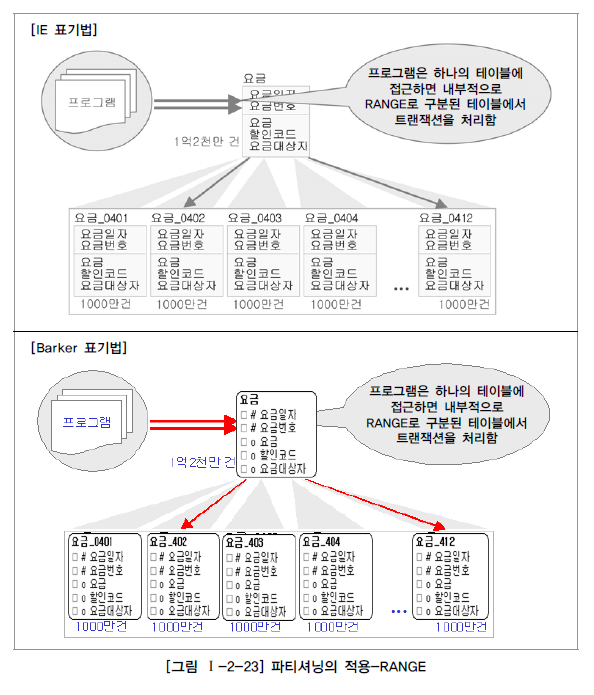

- 요금 정보처럼 항상 월 단위로 데이터를 처리하는 특성을 가진 경우 PK(요금일자)의 년 + 월을 이용하여 12개의 파티션 테이블을 생성하여 성능 개선 유도

- 대상 테이블이 날짜 또는 숫자로 분리가 가능하거나 영역별로 트랜잭션이 분리된다면 적용

- 데이터 보관주기에 따라 테이블 데이터를 쉽게 지우는 것이 가능하므로(파티션 테이블 DROP) 테이블 관리가 용이

 

### LIST PARTITION 적용

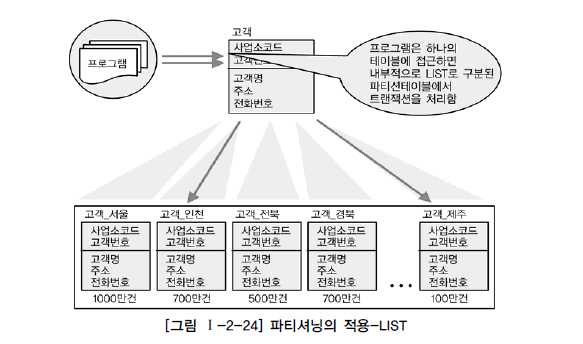

- 지점, 사업소, 사업장, 핵심적인 코드 값 등으로 PK가 구성되어 있는 테이블이라면 값들에 의해 파티셔닝이 되는 LIST PATITION 적용 가능

- 특정값에 따라 분리 저장할 수는 있으나, RANGE PARTITON과 같이 데이터 보관주기에 따라 쉽게 삭제하는 기능은 제공 불가

 

### HASH PARTITION 적용
- HASH조건에 따라 해시알고리즘이 적용되어 테이블이 분리되므로 설계자는 데이터가 어떤 테이블에 어떻게 들어갔는지 알 수 없다.

- HASH PARTITION도 보관주기에 따라 쉽게 삭제하는 기능은 제공 될 수 없다.

 

## 테이블에 대한 수평분할/수직분할의 절차
- 데이터 모델링 완성

- 데이터베이스 용량 산정

- 대량 데이터 처리 테이블의 트랜잭션 처리 패턴을 분석

- 집중화된 처리가 발생하는지 컬럼 단위인지 로우 단위인지 분석하여 테이블 분리를 검토

- 컬럼이 너무 많으면 테이블을 1:1 형태로 분리할 수 있는지 검증
  - 컬럼이 적지만 데이터 용량이 많아 성능 저하가 예상되면 테이블에 대한 파티셔닝 전략을 고려

 

# 데이터베이스 구조와 성능
## 슈퍼/서브타입 모델의 성능 고려 방법
### 슈퍼/서브타입 데이터 모델의 개념
- 슈퍼/서브타입 모델 업무를 구성하는 데이터의 특징을 효과적으로 표현할 수 있어 자주 쓰이는 모델링 기법

- 물리적 데이터 모델을 설계 시 일정한 기준에 의한 변환이 필요하다.
  - 아무런 기준이 없다면 변환하는 행위 자체가 성능 저하를 초래할 수 있다.

 

### 슈퍼/서브타입 데이터 모델의 변환

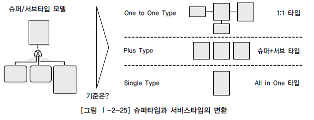

- 슈퍼/서브타입의 변환이 성능 저하를 초래하는 이유는 테이블 설계 시 트랜잭션 특성을 고려하지 않았기 때문이다.
  - 트랜잭션은 항상 일괄로 처리하지만 테이블은 개별로 유지되어 Union 연산으로 성능이 저하된다.
  - 트랜잭션은 항상 서브타입별로 처리하지만 테이블은 하나로 통합되어 많은 양의 데이터가 집약되므로 성능이 저하된다.
  - 트랜잭션은 항상 슈퍼+서브 타입을 공통으로 처리하는데 개별로 유지되어 있거나 하나의 테이블로 집약되어 있다면 성능이 저하된다.

- 데이터의 양이 소량일 경우 유연성을 고려해 1:1 관계를 유지하는 것이 바람직하다.
  - 대량일 경우 트랜잭션의 발생 형태에 따라 3가지 변환 방법을 참조하여 상황에 맞게 변환하도록 해야 한다.

 

### 슈퍼/서브타입 데이터 모델의 변환 방법
- 개별로 발생되는 트랜잭션은 개별 테이블로 구성

- 슈퍼+서브타입에 발생되는 트랜잭션은 슈퍼+서브타입 테이블로 구성

- 전체가 하나의 트랜잭션인 경우 하나의 테이블로 구성

 

### 슈퍼/서브타입 데이터 모델의 변환 타입 비교
|구분|OneToOne Type|Plus Type|Single Type|
|:-:|-------------|---------|-----------|
|특징|개별 테이블 유지|슈퍼+서브타입|테이블	하나의 테이블|
|확장성|우수함|보통|나쁨|
|조인 성능|나쁨|나쁨|우수함|
|I/O 성능|좋음|좋음|나쁨|
|관리 용이성|좋지않음|좋지않음|좋음(단일)|
|트랜잭션 유형에 따른 선택방법|개별 테이블로 접근이 많은 경우 선택|슈퍼+서브 형식으로 데이터를 처리하는 경우 선택|전체를 일괄적으로 처리하는 경우 선택|

 

## 인덱스 특성을 고려한 PK/FK 데이터베이스 성능 향상
### PK/FK 컬럼 순서와 성능 개념
- 인덱스는 데이터에 접근할 때 경로 제공에 대한 성능도 중요한 의미를 가지고 있으므로 설계 마지막에 컬럼의 순서를 조정할 필요가 있다.

- PK가 복합식별자인 경우 앞에 위치한 속성이 가급적 '=' 이거나 최소범위 'BETWEEN', '<>' 가 들어와야 인덱스를 이용할 수 있다.
  - FK라 하더라도 인덱스를 생성하고 인덱스 컬럼의 순서도 조회 조건을 고려하여 접근이 가장 효율적인 순서대로 배치한다.

 

### PK 컬럼의 순서를 조정하지 않으면 성능이 저하되는 사례
- 데이터 모델링에서 설계된 테이블의 PK 순서대로 인덱스가 만들어진 경우

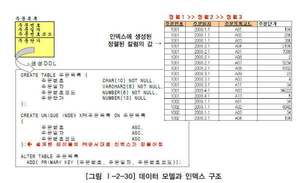

- 테이블에 접근하는 트랜잭션의 특징에 효율적이지 않은 인덱스가 생성되었으므로 인덱스 범위가 넓어지거나 Full Scan을 유발힌다.

 

### PK 순서를 잘못 지정하여 성능이 저하되는 간단한 사례

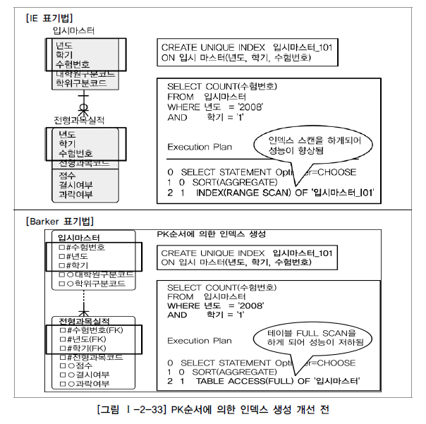

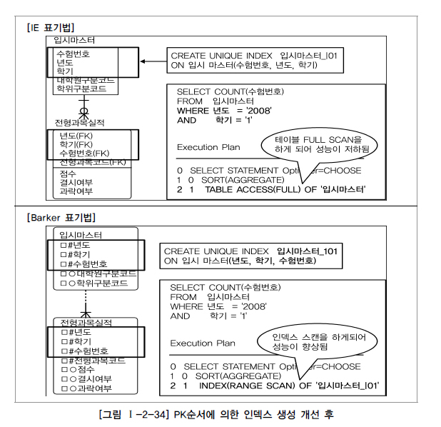

- 입시마스터 테이블 PK : 수험번호 + 년도 + 학기

- 입시마스터 테이블 조회조건에 수험번호가 존재하지 않아 FULL TABLE SCAN 발생

- 년도와 학기에 대한 내용이 자주 추가되므로 PK 순서를 변경하면 인덱스를 정상적으로 이용할 수 있다.

 

### PK 순서를 잘못 지정하여 성능이 저하되는 복잡한 사례

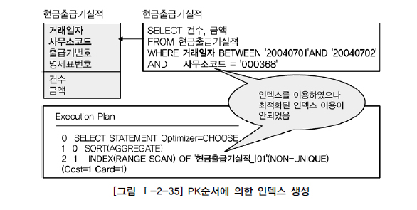

- 현금출급기실적 PK : 거래일자 + 사무소코드 + 출급기번호 + 명세표번호

- 대부분 거래일자가 BETWEEN 으로, 사무소코드가 '=' 로 들어와 인덱스를 이용할 수 있으나 효율성이 떨어짐

- 인덱스 컬럼을 사무소코드 + 거래일자 + 출급기번호 + 명세표번호로 순서 변경

- 테이블 PK 속성이 A+B와 B+A의 형태로도 빈번하게 조회된다면 더 잦은 형태로 PK 순서를 바꾸고 인덱스를 추가로 생성하는 것이 필요

 

## 물리적인 테이블에 FK 제약이 걸려있지 않은 경우 인덱스 미생성으로 인한 성능 저하
- 두 테이블 사이에 FK 참조 무결성 제약이 없더라도 데이터 모델 관계에 의해 상속받은 FK 속성들은 조인 조건으로 이용하는 경우가 많다.
  - 따라서 FK 인덱스를 생성하는 것이 좋다.

- FK 인덱스 생성을 기본 정책으로 한다면 향후 트랜잭션에 의해 거의 활용되지 않았을 때만 지우는 것이 가장 적절한 방법이다.

 

# 분산 데이터베이스와 성능
## 분산 데이터베이스의 개념
- 여러 곳으로 분산되어 있는 데이터베이스를 하나의 가상 시스템으로 사용할 수 있도록 통합한 데이터베이스

- 논리적으로는 동일한 시스템이지만 네트워크를 통해 물리적으로 분산되어 있는 데이터들의 모임

- 데이터베이스를 연결하는 네트워크 환경을 이용해 여러 지역 및 노드로 위치시켜 사용성 및 성능을 극대화

 

## 분산 데이터베이스의 투명성(Transparency)
- 최근 분산 데이터베이보다 통합 데이터베이스 구축 사례가 증가
  - 업무 및 지역적인 특징에 따라 적절히 활용하면 다양한 장점을 가지므로 대량 데이터의 로컬/글로벌 처리 등에 활용

### 분산 데이터베이스의 6가지 조건
- 분할 투명성(단편화) : 하나의 논리적인 관계가 여러 단편으로 분할되어 각 단편의 사본이 여러 사이트에 저장되어야 함

- 위치 투명성 : 사용하려는 데이터의 저장 장소 명시가 필요하지 않으며 위치정보는 System Caltalog에 유지되어야 함

- 지역사상 투명성 : 지역 DBMS와 물리적 DB사이의 Mapping을 보장해야함

- 중복 투명성 : DB객체가 여러 사이트에 중복되어 존재하는지 몰라도 됨

- 장애 투명성 : 구성 요소(DBMS, Computer)의 장애에 무관하게 트랜잭션의 원자성이 유지되어야 함

- 병행 투명성 : 다수 트랜잭션이 동시에 수행되더라도 결과는 일관성을 유지해야 함
  - Time Stamp, 분산 2단계 Locking 으로 구현

 

## 분산 데이터베이스의 적용 및 장/단점
### 분산 데이터베이스 적용방법
- 업무의 흐름을 보고 업무의 구성에 따른 아키텍처 특징을 고려하여 데이터베이스를 구성

- 분산 환경은 단순히 데이터베이스 구축이 주가 아니며 업무의 특징에 따라 분산 구조의 설계가 필요
  - 즉 데이터베이스 분산 설계보다 데이터베이스 구조 설계라는 의미로 이해해도 무방

 

### 분산 데이터베이스 장단점
- 장점
  - 지역 자치성, 점증적 시스템 용량 확장
  - 신뢰성과 가용성
  - 효용성과 융통성
  - 빠른 응답속도와 통신비용 절감
  - 데이터의 가용성과 신뢰성 증가
  - 시스템 규모의 적절한 조절
  - 각 지역 사용자의 요구 수용 증대

- 단점
  - 소프트웨어 개발 비용
  - 오류의 잠재성 증대
  - 처리비용의 증대
  - 설계,관리의 복잡성과 비용
  - 불규칙한 응답 소고
  - 통제의 어려움
  - 데이터 무결성에 대한 위협

 

## 분산 데이터베이스의 방향성

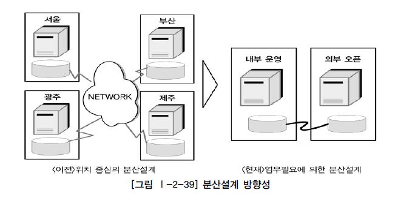

 

## 분산 데이터베이스의 가치

 

## 분산 데이터베이스의 적용 방식
- 가장 많이 사용하는 방식은 테이블 복제 분산 방식
  - 성능이 저하되는 대량 데이터베이스에서 유용하게 적용할 수 있는 방법

- 우선 통합 모델링을 진행한 후 각 테이블별 업무적 특징에 따라 지역 및 서버로 테이블을 분산 또는 복제 배치하는 형태로 설계

### 테이블 위치 분산
- 테이블의 구조는 변하지 않으며, 다른 데이터베이스에 중복되어 생성되지 않는다.
  - 설계된 테이블의 위치를 각각 다르게 위치시키는 것

 

### 테이블 분할(Fragmentation) 분산
- 테이블의 위치만 다른 곳에 두는 것이 아니라 각각의 테이블을 분산하는 방법

- 수평분할(Horizontal Fragmentation)
  - 테이블의 특정 컬럼을 기준으로 로우 분리
    - 컬럼은 분리되지 않으며, 데이터를 한 곳에 집합시켜도 PK 에 의해 중복 발생이 일어나지 않음
  - 각 지사별로 사용하는 로우가 다를 때 이용
    - 각 지사에 존재하는 테이블을 통합 처리하는 경우 JOIN 이 발생하여 성능 저하가 예상되므로 통합 처리 프로세스가 적을 때 이용

- 수직분할(Vertical Fragmentaion)
  - 특정 컬럼을 기준으로 컬럼 분리
  - 컬럼을 기준으로 분할했으니 각각의 테이블은 동일한 PK 구조와 값을 지님
    - 예) 제품의 재고량은 각 지사별로 관리하고 단가는 본사에서 관리할 때
  - 실제 프로젝트에는 이런 환경을 구성하는 사례가 적음

 

### 테이블 복제(Replication) 분산
- 동일한 테이블을 다른 지역이나 서버에 동시에 생성하여 관리하는 유형이다.

- 부분복제(Segment Replication)
  - 테이블의 일부만 다른 지역이나 서버에 위치시키는 방법
    - 예) 본사 데이터베이스에는 테이블의 전체 내용이, 각 지사 데이터베이스에는 각 지사별로 관계된 데이터만 들어가는 경우
  - 보통 지사에서 데이터가 먼저 발생되고 본사에는 지사데이터를 이용해 통합할 때 발생
    - 실제 프로젝트에서 많이 사용하는 분산 기법
  - 다른 지역간 데이터를 복제하는데는 많은 시간이 소요되므로 야간 배치 작업을 통해 수행
    - 본사와 지사 양쪽 데이터를 수정하여 전송하는 경우 정합성을 일치시키는 것이 어려워 한쪽(지사)에서만 데이터 수정을 발행하여 본사로 복제되도록 진행

- 광역복제(Broadcast Replication)
  - 테이블의 내용을 각 지역이나 서버에 위치시키는 방법
  - 본사와 지사모두 동일한 정보를 가지고 있어 데이처 처리에 특별한 제약을 받지 않음
    - 실제 프로젝트에서 많이 사용하는 분산 기법
  - 본사에서 데이터가 입력, 수정, 삭제가 이루어지면 지사에서 이용하는 형태
  - 부분복제와 마찬가지로 데이터를 복제하는데 많은 시간이 소요되고 많은 부하가 발생되므로 배치를 통해 진행

 

### 테이블 요약(Summarization) 분산
- 지역 또는 서버 간에 데이터가 비슷하지만 서로 다른 유형으로 존재하는 경우 사용

- 분석요약
  - 동일한 테이블 구조이면서 분산되어 있는 동일한 내용의 데이터를 이용해 통합된 데이터를 산출하는 방식
  - 각 지사별로 존재하는 요약 정보를 본사에서 통합해 전체에 대한 요약 정보를 재산출하는 분산 방법

- 통합요약
  - 분산되어 있는 다른 내용의 데이터를 이용해 통합된 데이터를 산출하는 방식
  - 각 지사별로 존재하는 다른 내용의 정보를 본사에 통합해 전체에 대한 요약정보를 재산출하는 분산 방법

 

## 분산 데이터베이스를 적용하여 성능이 향상된 사례
- 성능이 중요한 사이트
- 공통 코드, 기준정보, 마스터 데이터 등에 대해 분산 환경을 구성하면 성능 향상
- 실시간 동기화가 요구되지 않음에도 실시간(Near Real TIme)의 업무적인 특징을 가질 때도 구성가능
- 특정 서버에 부하 집중시 부하를 분산할 때
- 백업 사이트를 구성할 때 간단한 분산 기능을 적용하여 구성

 