# 관계형 데이터베이스 개요
## 데이터베이스
### 데이터베이스의 개념
- 데이터베이스 : 일상적인 정보들의 집합 자체를 의미
  - 효율적인 데이터의 관리 뿐만 아니라 예기치 못한 사건으로 인한 데이터의 손상을 예방하고 데이터를 복구할 수 있는 강력한 기능의 소프트웨어가 필요
    - 이런 기본적인 요구사항을 만족시켜주는 시스템을 DBMS(Database Management System)라고 칭함

### 데이터베이스의 발전
- 1960년대
  - 플로우차트 중심의 개발 방법 사용, 파일 구조를 통해 데이터를 저장하고 관리

- 1970년대
  - 데이터베이스 관리 기법이 태동되던 시기로 계층형(Hierarchical) 데이터베이스, 망형(Network) 데이터베이스 제품 상용화

- 1980년대
  - 현재 대부분의 기업에서 사용되고 있는 관계형 데이터베이스 상용화(ORACLE, Sybase, DB2)

- 1990년대
  - ORACLE, Sybase, Informix, DB2, Teradata, SQL Server 등 보다 향상된 기능으로 정보시스템의 핵심 솔루션으로 부상
  - 인터넷 환경의 급속한 발전과 객체 지향 정보를 지원하기 위해 객체 관계형 데이터베이스로 발전

<br>

### 파일시스템
- 하나의 파일을 많은 사용자가 동시에 검색할 수는 있지만 동시에 입력, 수정, 삭제할 수 없기 때문에 정보의 관리가 어려움
  - 하나의 파일을 여러 사용자나 어플리케이션에서 동시에 사용하기 위해서 원래의 데이터 파일을 여러 개 복사하여 사용

- 여러 개의 데이터 파일이 존재하는 경우 동일한 데이터가 여러 곳에 저장됨
  - 하나의 원본에 변경 작업이 일어날 때 모든 복사본을 병행하여 수정하지 않으면 서로 다른 정보 파일이 존재하게 되므로 데이터의 불일치성이 발생
  - 이렇듯 분산된 데이터의 정합성을 보장하기 힘들며 유지하는데 과다한 노력이 필요하다.

- 단일 사용자나 단일 어플리케이션이 파일시스템을 사용하면 데이터베이스보다 처리 성능이 뛰어나므로 특정 업무에서는 아직도 파일시스템을 사용

<br>

### 관계형 데이터베이스(Relational Database)
- 1970년 영국의 수학자였던 E.F. Codd 박사의 논문에서 처음으로 관계형 데이터베이스가 소개
  - IBM의 SQL 개발 단계를 거쳐서 ORACLE을 선두로 여러 회사에서 제품 상용화
  - 기존의 파일시스템과 계층 및 망형 데이터베이스를 대부분 대체하면서 주력 데이터베이스로 부상

- 정규화를 통한 합리적인 테이블 모델링으로 이상(ANOMALY) 현상을 제거하고 동시성 관리 및 병행 제어할 수 있어 사용자들이 동시에 데이터를 공유 및 조작 가능

- 메타 데이터를 총괄 관리할 수 있기 때문에 데이터의 성격, 속성 또는 표현 방법 등을 체계화할 수 있고 데이터 표준화를 통한 데이터 품질을 확보할 수 있는 장점 존재
  - 인증된 사용자만이 참조할 수 있도록 보안 기능 포함

- 테이블 생성 시 다양한 제약조건을 이용하여 조건에 위배되는 데이터가 입력되거나 관계 연결에서의 중요 데이터 삭제를 방지하여 데이터 무결성(Integrity)을 보장

- 시스템의 갑작스런 장애로부터 사용자가 입력, 수정, 삭제하던 데이터가 제대로 반영될 수 있도록 보장해주는 기능 보유
  - 시스템 다운, 재해 등의 상황에서 데이터를 회복/복구할 수 있는 기능도 제공

<br>

## SQL(Structured Query Language)
### SQL(Structured Query Language)의 개념
- 관계형 데이터베이스에서 데이터 정의, 데이터 조작, 데이터 제어를 위해 사용하는 언어
  - SQL의 최초 이름이 SEQUEL(Structured English QUEry Language)이었기 때문에 '시큐얼'로 읽는 경우도 있지만, 표준은 SQL이므로 '에스큐엘'로 읽는 것을 권고

- 1986년부터 ANSI/ISO를 통해 표준화되고 정의된 SQL 기능은 벤더별 DBMS 개발의 목표가 됨
  - 대부분의 관계형 데이터베이스에서 ANSI/ISO 표준을 최대한 따르고 있기 때문에, SQL에 대한 지식은 다른 데이터베이스를 사용하더라도 상당 부분 재활용 가능
  - ANSI/IS0 SQL-99, SQL-2003 이후 기준이 적용된 SQL이라면 프로그램의 이식성을 높이는 데도 공헌

- SQL 문장은 일반적인 개발 언어처럼 독립된 하나의 언어
  - 일반적인 프로그래밍 언어와는 달리 관계형 데이터베이스에 대한 전담 접속(다른 언어는 관계형 데이터베이스에 접속할 수 없다)
  - 세미콜론( ; ) 으로 분리되어 있는 SQL 문장 단위로 독립

- 관계형 데이터베이스는 수학의 집합 논리에 입각한 것이므로, SQL도 데이터를 집합으로써 취급

<br>

### SQL 문장
<div align=center>

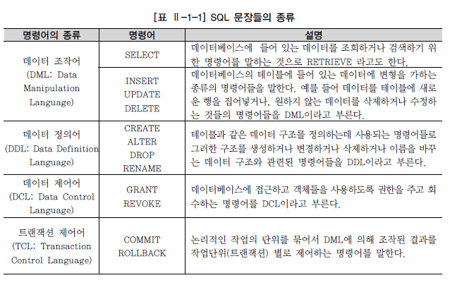

</div>

<br>

## TABLE
<div align=center>

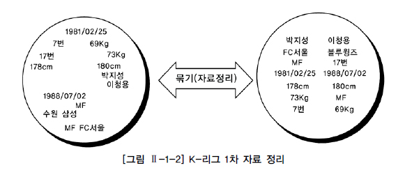

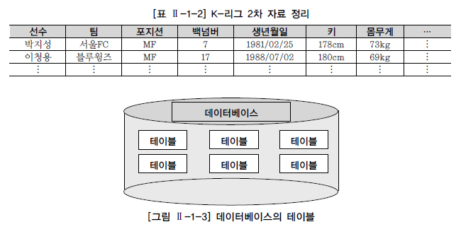

</div>

- 데이터는 관계형 데이터베이스의 기본 단위인 테이블 형태로 저장
  - 모든 자료는 테이블에 등록 되고 사용자는 테이블로부터 원하는 자료를 조회한다.
  - 결국 테이블은 어느 특정한 주제와 목적으로 만들어지는 일종의 집합이다.

- 테이블에 등록된 자료들은 삭제하지 않는 한 지속적으로 유지
  - 자료를 입력하지 않는다면 테이블은 생성되었을 때부터 가지던 속성을 그대로 유지하면서 존재

- 테이블(TABLE)은 데이터를 저장하는 객체(Object)로서 관계형 데이터베이스의 기본 단위이다.

- 관계형 데이터베이스에서는 모든 데이터를 컬럼과 행의 2차원 구조로 나타낸다.

- 세로 방향을 컬럼(Column), 가로 방향을 행(Row)이라고 하고, 컬럼과 행이 겹치는 하나의 공간을 필드(Field)라고 한다.
  - 선수 정보 테이블에서는 선수명과 포지션 등의 컬럼이 있고, 각 선수에 대한 데이터를 행으로 구성하여 저장한다.

    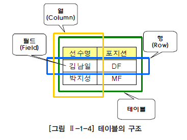

- 모든 데이터를 하나의 테이블로 저장하지 않는다.
  - 테이블을 분할하여 데이터의 불필요한 중복을 줄이는 것을 정규화(Normalization)라고 한다.
  - 데이터의 정합성 확보와 데이터 입력/수정/삭제 시 발생할 수 있는 이상 현상(Anomaly)을 방지하기 위함이다.

    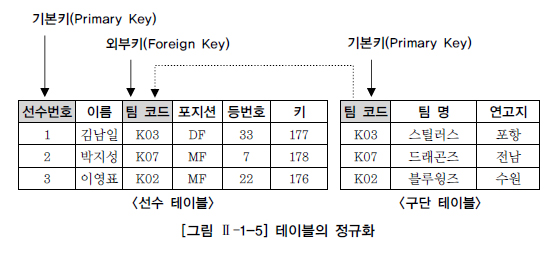

- 각 행을 한 가지 의미로 특정할 수 있는 한 개 이상의 컬럼을 기본키(Primary Key)라고 한다.
  - 다른 테이블의 기본 키로 사용되면서 테이블과의 관계를 연결하는 역할을 하는 컬럼을 외부키(Foreign Key)라고 한다.

    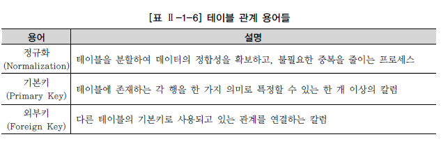

<br>

## ERD
- 테이블 간 서로의 상관 관계를 그림으로 도식화한 것을 E-R 다이어그램이라고 하며, ERD라 칭함

- 구성 요소는 엔터티(Entity), 관계(Relationship), 속성(Attribute) 3가지이며 현실 세계의 데이터는 이 3가지 구성 요소로 모두 표현이 가능

<div align=center>

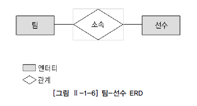

</div>

- 예제 1

    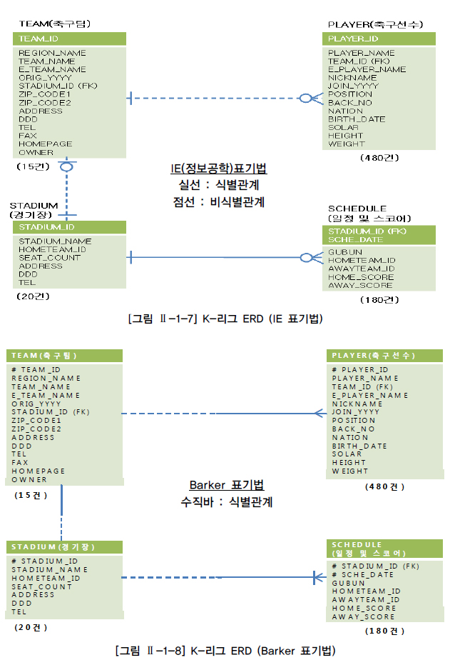

  - K-리그 테이블 간의 양방향 관계는 다음과 같다.
    - 하나의 팀은 여러 명의 선수를 포함할 수 있다. → `한 명의 선수는 하나의 팀에 반드시 속한다.`
    - 하나의 팀은 하나의 전용 구장을 반드시 가진다. → `하나의 운동장은 하나의 홈팀을 가질 수 있다.`
    - 하나의 운동장은 여러 게임의 스케쥴을 가질 수 있다. → `하나의 스케쥴은 하나의 운동장에 반드시 배정된다.`

- 예제 2

    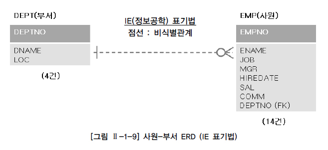

    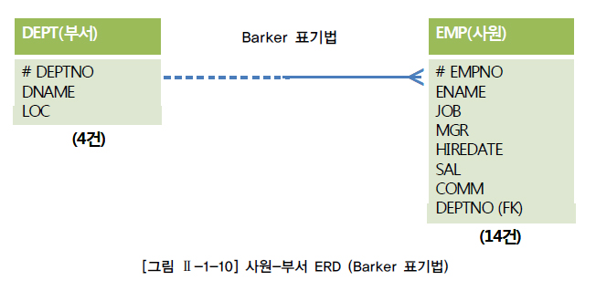

  - 사원-부서 테이블 간의 양방향 관계는 다음과 같다.
    - 하나의 부서는 여러 명의 사원을 보유할 수 있다. → `한 명의 사원은 하나의 부서에 반드시 소속된다.`

<br>

# DDL(DATA DEFINITION LANGUAGE)
## 데이터 유형
- 데이터베이스의 테이블에 특정 자료를 입력할 때, 받아들이는 공간을 자료의 유형별로 분류
  - 특정 컬럼을 정의할 때 선언한 데이터 유형은 그 컬럼이 받아들일 수 있는 자료의 유형을 규정
  - 선언한 유형이 아닌 다른 종류의 데이터가 들어오려고 하면 데이터베이스는 에러를 발생시킴

- 데이터 유형과 더불어 지정한 크기(SIZE)를 넘어선 자료가 입력되면 에러 발생

### 데이터 유형(숫자 타입)
  - ANSI/ISO 기준 NUMERIC Type의 하위 개념
    - NUMERIC, DECIMAL, DEC, SMALLINT, INTEGER, INT, BIGINT, FLOAT, REAL, DOUBLE PRECISION
  - SQL Server와 Sybase는 ANSI/ISO 기준의 하위 개념에 평준화
    - 작은 정수형, 정수형, 큰 정수형, 실수형 등 여러 숫자 타입 제공
    - 추가로 MONEY, SMALLMONEY 등의 숫자 타입도 가지고 있음
  - ORACLE은 숫자형 타입에 대해서 NUMBER 한 가지 숫자 타입의 데이터 유형만 지원
  - 벤더에서 ANSI/ISO 표준을 사용할 때는 기능을 중심으로 구현
    - 표준과 다른(ex: NUMERIC → NUMBER, WINDOW FUNCTION → ANALYTIC/RANK FUNCTION) 용어 허용

<br>

### 데이터 유형(문자열 타입)
- VARCHAR 유형
  - VARCHAR 유형은 가변 길이이므로 필요한 영역은 실제 데이터 크기
  - 길이가 다양한 컬럼과, 정의된 길이와 실제 데이터 길이에 차이가 있는 컬럼에 적합
  - CHAR 유형보다 작은 영역에 저장할 수 있음
  - VARCHAR 유형 문자열 비교에서 처음부터 한 문자씩 비교하고 공백도 하나의 문자로 취급하므로 끝의 공백이 다르면 다른 문자로 판단
  - 예) VARCHAR 유형 : `'AA'` ≠ `'AA '`
  - VARCHAR 유형 사용 예
    - 고정된 길이의 문자열을 가지지 않는 경우(팀명, 운동장 주소, 선수이름, 아이디, 이름, 이메일)

- CHAR 유형
  - CHAR에서는 문자열을 비교할 때 공백(BLANK)을 채워서 비교
  - CHAR의 공백 채우기 비교에서는 우선 짧은 쪽 컬럼의 끝에 공백을 추가하여 2개의 데이터가 같은 길이가 되도록 하고 앞에서부터 한 문자씩 비교
  - 예) CHAR 유형 : `'AA'` = `'AA '`
  - CHAR 유형 사용 예
    - 고정된 길이의 문자열을 가지는 경우(주민등록번호, 코드성컬럼)

- CHAR가 아닌 VARCHAR, NUMERIC 유형에서 정의한 길이나 자릿수의 의미는 해당 데이터 유형이 가질 수 있는 최대한의 한계값을 정의한 것이라고 보아야 함

- 문자열(CHAR와 VARCHAR)에 대한 최대 길이와 NUMBER 컬럼의 정밀도(Precision)를 지정하는 것은 테이블 설계시 반드시 고려해야 할 중요 요소

<br>

<div align=center>

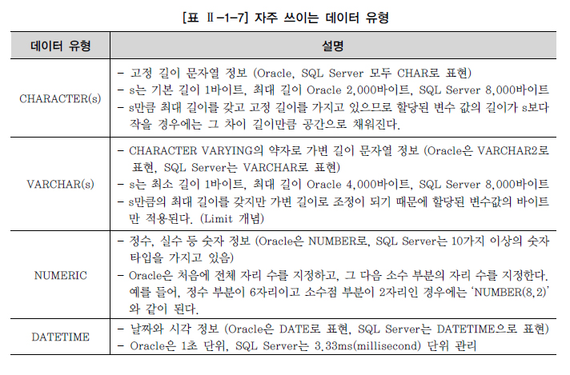

</div>

<br>

## CREATE TABLE
- 테이블은 일정한 형식에 의해서 생성
  - 테이블 생성을 위해서 해당 테이블에 입력될 데이터를 정의하고, 정의한 데이터를 어떤 데이터 유형으로 선언할지 결정

### 테이블과 컬럼 정의
- 테이블에 존재하는 모든 데이터를 고유하게 식별할 수 있으면서 반드시 값이 존재하는 단일 컬럼이나 컬럼의 조합들(후보키) 중에 하나를 선정하여 기본키 컬럼으로 지정
  - 선수 테이블을 예로 들면 '선수ID' 컬럼이 기본키로 적합

- 기본키는 단일 컬럼이 아닌 여러 개의 컬럼으로도 만들어질 수 있다.

- 테이블과 테이블 간에 정의된 관계는 기본키(PRIMARY KEY)와 외부키(FOREIGN KEY)를 활용해서 설정

- 선수 테이블에 선수의 소속팀 정보가 같이 존재한다고 가정하면, 특정 팀의 이름이 변경되었을 경우 그 팀에 소속된 선수 데이터를 일일이 찾아서 수정을 하거나, 또한 팀이 해체되었을 경우 선수 관련 정보까지 삭제되는 수정/삭제 이상(Anomaly) 현상이 발생할 수 있다.
  - 이상 현상을 방지하기 위해 팀 정보를 관리하는 팀 테이블을 별도로 분리해서 팀ID와 팀 이름을 저장하고, 선수 테이블에서는 팀ID를 외부키로 참조하게 한다.

<br>

<div align=center>

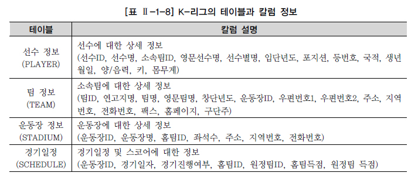

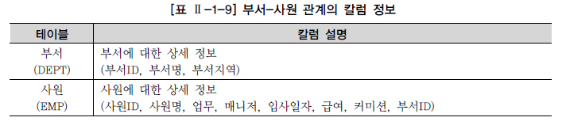

</div>

<br>

### CREATE TABLE
```sql
CREATE TABLE 테이블이름 ( 
    컬럼명1 DATATYPE [DEFAULT 형식], 
    컬럼명2 DATATYPE [DEFAULT 형식], 
    컬럼명2 DATATYPE [DEFAULT 형식] 
) ;
```

- 테이블 생성 규칙
  - 테이블명은 객체를 의미할 수 있는 적절한 이름을 사용(단수형 권장)
  - 테이블명은 다른 테이블의 이름과 중복되지 않아야 한다.
  - 한 테이블 내에서 컬럼명은 중복될 수 없다.
  - 테이블 이름을 지정하고 각 컬럼들은 괄호 "( )" 로 묶어 지정한다.
  - 각 컬럼들은 콤마 ","로 구분된다.
  - 컬럼에 대해서는 다른 테이블까지 고려하여 데이터베이스 내에서는 일관성 있게 사용하는 것이 좋다.(데이터 표준화 관점 : 공통성 컬럼을 도메인으로 관리)
  - 컬럼 뒤에 데이터 유형은 꼭 지정되어야 한다.
  - 테이블명과 컬럼명은 반드시 문자로 시작해야 하고, 벤더별로 길이에 대한 한계가 있다.
  - 벤더에서 사전에 정의한 예약어(Reserved word)는 쓸 수 없다. - A-Z, a-z, 0-9, _, $, # 문자만 허용된다.

- 작성 예
    ```
    테이블명 : PLAYER 
    테이블 설명 : K-리그 선수들의 정보를 가지고 있는 테이블 
    컬럼명 :    PLAYER_ID (선수ID) 문자 고정 자릿수 7자리,
                PLAYER_NAME (선수명) 문자 가변 자릿수 20자리,
                TEAM_ID (팀ID) 문자 고정 자릿수 3자리,
                E_PLAYER_NAME (영문선수명) 문자 가변 자릿수 40자리,
                NICKNAME (선수별명) 문자 가변 자릿수 30자리,
                JOIN_YYYY (입단년도) 문자 고정 자릿수 4자리,
                POSITION (포지션) 문자 가변 자릿수 10자리,
                BACK_NO (등번호) 숫자 2자리,
                NATION (국적) 문자 가변 자릿수 20자리,
                BIRTH_DATE (생년월일) 날짜,
                SOLAR (양/음) 문자 고정 자릿수 1자리,
                HEIGHT (신장) 숫자 3자리,
                WEIGHT (몸무게) 숫자 3자리, 
    제약조건 : 기본키(PRIMARY KEY) → PLAYER_ID 
                (제약조건명은 PLAYER_ID_PK) 
                값이 반드시 존재 (NOT NULL) → PLAYER_NAME, TEAM_ID 
    ```

    ```sql
    -- [ORACLE]

    CREATE TABLE PLAYER ( 
        PLAYER_ID CHAR(7) NOT NULL, 
        PLAYER_NAME VARCHAR2(20) NOT NULL,
        TEAM_ID CHAR(3) NOT NULL,
        E_PLAYER_NAME VARCHAR2(40),
        NICKNAME VARCHAR2(30),
        JOIN_YYYY CHAR(4),
        POSITION VARCHAR2(10),
        BACK_NO NUMBER(2),
        NATION VARCHAR2(20),
        BIRTH_DATE DATE,
        SOLAR CHAR(1),
        HEIGHT NUMBER(3),
        WEIGHT NUMBER(3),
        CONSTRAINT PLAYER_PK PRIMARY KEY (PLAYER_ID),
        CONSTRAINT PLAYER_FK FOREIGN KEY (TEAM_ID) REFERENCES TEAM(TEAM_ID) 
    ); 
    ```
    ```sql
    -- [SQL Server]

    CREATE TABLE PLAYER ( 
        PLAYER_ID CHAR(7) NOT NULL,
        PLAYER_NAME VARCHAR(20) NOT NULL,
        TEAM_ID CHAR(3) NOT NULL,
        E_PLAYER_NAME VARCHAR(40),
        NICKNAME VARCHAR(30),
        JOIN_YYYY CHAR(4),
        POSITION VARCHAR(10),
        BACK_NO TINYINT,
        NATION VARCHAR(20),
        BIRTH_DATE DATE,
        SOLAR CHAR(1),
        HEIGHT SMALLINT,
        WEIGHT SMALLINT,
        CONSTRAINT PLAYER_PK PRIMARY KEY (PLAYER_ID),
        CONSTRAINT PLAYER_FK FOREIGN KEY (TEAM_ID) REFERENCES TEAM(TEAM_ID) 
    );
    ```

- 추가 주의사항
  - 테이블 생성시 대/소문자 구분은 하지 않는다.
  - 기본적으로 테이블이나 컬럼명은 대문자로 만들어진다.
  - DATETIME 데이터 유형에는 별도로 크기를 지정하지 않는다.
  - 문자 데이터 유형은 반드시 가질 수 있는 최대 길이를 표시해야 한다.
  - 컬럼과 컬럼의 구분은 콤마로 하되, 마지막 컬럼은 콤마를 찍지 않는다.
  - 컬럼에 대한 제약조건이 있으면 CONSTRAINT를 이용하여 추가할 수 있다.
  - 제약조건
    - 컬럼 LEVEL 정의 방식 : 컬럼의 NOT NULL 등
    - 테이블 LEVEL 정의 방식 : 테이블 생성 마지막에 모든 제약조건을 기술

<br>

## 제약조건(CONSTRAINT)
- 데이터의 무결성을 유지하기 위한 데이터베이스의 보편적인 방법으로 테이블의 특정 컬럼에 설정

    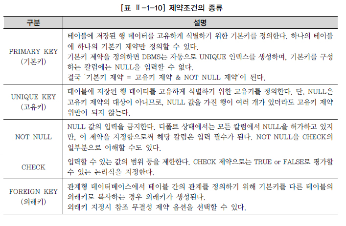

- NULL 의미
  - NULL(ASCII 코드 00번)은 공백(BLANK, ASCII 코드 32번)이나 숫자 0(ZERO, ASCII 48)과는 전혀 다른 값이며, 조건에 맞는 데이터가 없을 때의 공집합과도 다르다.
  - NULL은 '아직 정의되지 않은 미지의 값'이거나 '현재 데이터를 입력하지 못하는 경우'를 의미한다.

- DEFAULT 의미
  - 데이터 입력 시에 컬럼의 값이 지정되어 있지 않을 경우 기본값(DEFAULT)을 사전에 설정할 수 있다.
  - 데이터 입력시 명시된 값을 지정하지 않은 경우에 NULL 값이 입력되고, DEFAULT 값을 정의했다면 해당 컬럼에 NULL 값이 입력되지 않고 사전에 정의된 기본 값이 자동으로 입력된다.

- 작성 예
    ```
    테이블명 : TEAM 
    테이블 설명 : K-리그 선수들의 소속팀에 대한 정보를 가지고 있는 테이블 
    컬럼명 : TEAM_ID (팀 고유 ID) 문자 고정 자릿수 3자리,
                REGION_NAME (연고지 명) 문자 가변 자릿수 8자리,
                TEAM_NAME (한글 팀 명) 문자 가변 자릿수 40자리,
                E-TEAM_NAME (영문 팀 명) 문자 가변 자릿수 50자리 ,
                ORIG_YYYY (창단년도) 문자 고정 자릿수 4자리,
                STADIUM_ID (구장 고유 ID) 문자 고정 자릿수 3자리,
                ZIP_CODE1 (우편번호 앞 3자리) 문자 고정 자릿수 3자리,
                ZIP_CODE2 (우편번호 뒷 3자리) 문자 고정 자릿수 3자리,
                ADDRESS (주소) 문자 가변 자릿수 80자리,
                DDD (지역번호) 문자 가변 자릿수 3자리,
                TEL (전화번호) 문자 가변 자릿수 10자리,
                FAX (팩스번호) 문자 가변 자릿수 10자리,
                HOMEPAGE (홈페이지) 문자 가변 자릿수 50자리,
                OWNER (구단주) 문자 가변 자릿수 10자리,
    제약조건 : 기본 키(PRIMARY KEY) → TEAM_ID 
                (제약조건명은 TEAM_ID_PK) NOT NULL → REGION_NAME, TEAM_NAME, STADIUM_ID 
                (제약조건명은 미적용) 
    ```
    ```sql
    -- [ORACLE]

    CREATE TABLE TEAM ( 
        TEAM_ID CHAR(3) NOT NULL,
        REGION_NAME VARCHAR2(8) NOT NULL,
        TEAM_NAME VARCHAR2(40) NOT NULL,
        E_TEAM_NAME VARCHAR2(50),
        ORIG_YYYY CHAR(4),
        STADIUM_ID CHAR(3) NOT NULL,
        ZIP_CODE1 CHAR(3),
        ZIP_CODE2 CHAR(3),
        ADDRESS VARCHAR2(80),
        DDD VARCHAR2(3),
        TEL VARCHAR2(10),
        FAX VARCHAR2(10),
        HOMEPAGE VARCHAR2(50),
        OWNER VARCHAR2(10),
        CONSTRAINT TEAM_PK PRIMARY KEY (TEAM_ID),
        CONSTRAINT TEAM_FK FOREIGN KEY (STADIUM_ID) REFERENCES STADIUM(STADIUM_ID) 
    ); 
    ```
    ```sql
    -- [SQL Server]

    CREATE TABLE TEAM ( 
        TEAM_ID CHAR(3) NOT NULL,
        REGION_NAME VARCHAR(8) NOT NULL,
        TEAM_NAME VARCHAR(40) NOT NULL,
        E_TEAM_NAME VARCHAR(50),
        ORIG_YYYY CHAR(4),
        STADIUM_ID CHAR(3) NOT NULL,
        ZIP_CODE1 CHAR(3),
        ZIP_CODE2 CHAR(3),
        ADDRESS VARCHAR(80),
        DDD VARCHAR(3),
        TEL VARCHAR(10),
        FAX VARCHAR(10),
        HOMEPAGE VARCHAR(50),
        OWNER VARCHAR(10),
        CONSTRAINT TEAM_PK PRIMARY KEY (TEAM_ID),
        CONSTRAINT TEAM_FK FOREIGN KEY (STADIUM_ID) REFERENCES STADIUM(STADIUM_ID) 
    ); 
    ```

<br>

## 생성된 테이블 구조 확인
```sql
-- [ORACLE]
DESCRIBE 테이블명;
DESC 테이블명;

-- [SQL Server]
exec sp_help 'dbo.테이블명';
go
```

<br>

## SELECT 문장을 통한 테이블 생성 사례
### CTAS(Create Table ~ As Select ~)
- DML 문장 중에 SELECT 문장을 활용해서 테이블을 생성할 수 있는 방법
- 컬럼별로 데이터 유형을 다시 재정의 하지 않아도 됨
- CTAS 기법 사용시 기존 테이블의 제약조건 중에 NOT NULL만 새로운 복제 테이블에 적용이 되고, 기본키, 고유키, 외래키, CHECK 등의 다른 제약 조건은 없어짐
- SQL Server에서는 Select ~ Into ~ 를 활용하여 위와 같은 결과를 얻을 수 있음
- 컬럼 속성에 Identity를 사용했다면 Identity 속성까지 같이 적용됨

- 작성 예
    ```sql
    -- [ORACLE]

    CREATE TABLE TEAM_TEMP AS SELECT * FROM TEAM; 
    ```
    ```sql
    -- [SQL Server]

    SELECT * INTO TEAM_TEMP FROM TEAM; 
    ```

<br>

## ALTER TABLE
### ADD COLUMN
- 기존 테이블에 필요한 컬럼을 추가하는 명령문
    ```sql
    ALTER TABLE 테이블명
    ADD 추가할 컬럼명 데이터 유형; 
    ```

- 새롭게 추가된 컬럼은 테이블의 마지막 컬럼이 되며 컬럼의 위치를 지정할 수는 없다.

<br>

### DROP COLUMN
- 테이블에서 필요 없는 컬럼을 삭제하는 명령어
    ```sql
    ALTER TABLE 테이블명 
    DROP COLUMN 삭제할 컬럼명; 
    ```

- 데이터가 있거나 없거나 모두 삭제 가능
- 한 번에 하나의 컬럼만 삭제 가능하며, 컬럼 삭제 후 최소 하나 이상의 컬럼이 테이블에 존재해야 함
- 한 번 삭제된 컬럼은 복구가 불가능

<br>

### MODIFY COLUMN
- 테이블의 컬럼에 대한 정의를 변경하는 명령어
    ```sql
    -- [ORACLE]
    ALTER TABLE 테이블명 
    MODIFY (컬럼명1 데이터 유형 [DEFAULT 식] [NOT NULL], 
                컬럼명2 데이터 유형 ...); 

    -- [SQL Server]
    ALTER TABLE 테이블명 
    ALTER (컬럼명1 데이터 유형 [DEFAULT 식] [NOT NULL], 
                컬럼명2 데이터 유형 ...); 
    ```

  - 컬럼의 데이터 유형, 디폴트(DEFAULT) 값, NOT NULL 제약조건에 대한 변경을 포함할 수 있음

- 주의사항
  - 해당 컬럼의 크기를 늘릴 수는 있지만 줄이지는 못한다. 기존의 데이터가 훼손될 수 있기 때문이다.
  - 해당 컬럼이 NULL 값만 가지고 있거나 테이블에 아무 행도 없으면 컬럼의 폭을 줄일 수 있다.
  - 해당 컬럼이 NULL 값만을 가지고 있으면 데이터 유형을 변경할 수 있다.
  - 해당 컬럼의 DEFAULT 값을 바꾸면 변경 작업 이후 발생하는 행 삽입에만 영향을 미치게 된다.
  - 해당 컬럼에 NULL 값이 없을 경우에만 NOT NULL 제약조건을 추가할 수 있다.

<br>

### RENAME COLUMN
- 컬럼명을 변경하는 명령어
    ```sql
    ALTER TABLE 테이블명 
    RENAME COLUMN 변경해야 할 컬럼명 TO 새로운 컬럼명; 
    ```

- 해당 컬럼과 관계된 제약조건에 대해서도 자동으로 변경되는 장점이 있음
  - ADD/DROP COLUMN 기능처럼 ANSI/ISO에 명시되어 있는 기능이 아니라 ORACLE 등 일부 DBMS에서만 지원하는 기능
  - SQL Server에서는 sp_rename 저장 프로시저를 이용하여 컬럼 이름을 변경할 수 있다.
    ```sql
    sp_rename 변경해야 할 컬럼명, 새로운 컬럼명, 'COLUMN'; 
    ```

<br>

### DROP CONSTRAINT
- 테이블 생성 시 부여했던 제약조건을 삭제하는 명령어
    ```sql
    ALTER TABLE 테이블명 
    DROP CONSTRAINT 제약조건명;
    ```

<br>

### ADD CONSTRAINT
- 테이블 생성 시 제약조건을 적용하지 않아도 생성 이후에 필요에 의해서 제약조건을 추가할 수 있음
    ```sql
    ALTER TABLE 테이블명 
    ADD CONSTRAINT 제약조건명 제약조건 (컬럼명); 
    ```

<br>

## RENAME TABLE
- 테이블의 이름을 변경하는 명령어
    ```sql
    RENAME 변경전 테이블명 TO 변경후 테이블명; 

    -- [SQL Server]
    sp_rename 변경전 테이블명, 변경후 테이블명; 
    ```

<br>

## DROP TABLE
- 테이블을 삭제하는 명령어
    ```sql
    DROP TABLE 테이블명 [CASCADE CONSTRAINT]; 
    ```

- 테이블의 모든 데이터 및 구조를 삭제
  - CASCADE CONSTRAINT 옵션은 해당 테이블에 참조되는 제약조건에 대해서도 삭제
- SQL Server에서는 CASCADE 옵션이 존재하지 않으며 테이블을 삭제하기 전에 참조하는 FOREIGN KEY 제약 조건 또는 참조하는 테이블을 먼저 삭제해야 함
- ORACLE 10g 부터 RECYCLEBIN 파마메터가 ON일경우, PURGE 옵션을 사용하지 않으면 RECYCLEBIN 이동

<br>

## TRUNCATE TABLE
- 테이블에 들어있던 모든 행들이 제거되고 저장 공간을 재사용 가능하도록 해제
    ```sql
    TRUNCATE TABLE PLAYER;
    ```

- 테이블 구조를 완전히 삭제하기 위해서는 DROP TABLE 실행

- TRUNCATE TABLE은 테이블 구조는 그대로 유지한 체 데이터만 전부 삭제하는 기능
  - TRUNCATE는 데이터 구조의 변경 없이 테이블의 데이터를 일괄 삭제하는 명령어로 DML로 분류할 수도 있지만 내부 처리 방식이나 Auto Commit 특성 등으로 인해 DDL로 분류하였다.
- 테이블에 있는 데이터를 삭제하는 명령어는 TRUNCATE TABLE 명령어 이외에도 다음 DML 절에서 살펴볼 DELETE 명령어가 있다.
  - DELETE와 TRUNCATE는 처리하는 방식 자체가 다르다. 테이블의 전체 데이터를 삭제하는 경우, 시스템 활용 측면에서는 DELETE TABLE 보다는 시스템 부하가 적은 TRUNCATE TABLE을 권고한다.
- TRUNCATE TABLE의 경우 정상적인 복구가 불가능하므로 주의

<br>

# DML(DATA MANIPULATION LANGUAGE)
## INSERT
- 테이블에 데이터를 입력하는 명령어
    ```sql
    -- 1번
    INSERT INTO 테이블명 (COLUMN_LIST)
            VALUES (COLUMN_LIST에 넣을 VALUE_LIST); 

    -- 2번
    INSERT INTO 테이블명
            VALUES (전체 COLUMN에 넣을 VALUE_LIST); 


    -- 조회한 값을 저장(컬럼명, 데이타 타입 동일하게)
    INSERT INTO 테이블명
            SELECT * FROM 테이블명;
    ```

- 해당 칼럼명과 입력되어야 하는 값을 서로 1:1로 매핑해서 기입
  - 데이터 유형이 CHAR나 VARCHAR2 등 문자 유형일 경우 『 ' 』(SINGLE QUOTATION)로 입력할 값을 입력
  - 숫자일 경우 『 ' 』(SINGLE QUOTATION)을 붙이지 않아야 한다.

- 첫 번째 방법은 테이블의 칼럼을 정의할 수 있는데, 이때 칼럼의 순서는 테이블의 칼럼 순서와 매치할 필요는 없으며, 정의하지 않은 칼럼은 Default로 NULL 값이 입력
  - 단, Primary Key나 Not NULL 로 지정된 칼럼은 NULL이 허용되지 않는다.

- 두 번째 유형은 모든 칼럼에 데이터를 입력하는 경우로 굳이 COLUMN_LIST를 언급하지 않아도 되지만 칼럼의 순서대로 빠짐없이 데이터가 입력되어야 함

- 데이터를 입력하는 경우 정의되지 않은 미지의 값은 두 개의 『 '' 』SINGLE QUOTATION을 붙여서 표현하거나, NATION이나 BIRTH_DATE의 경우처럼 NULL이라고 명시적으로 표현할 수 있다.

<br>

## UPDATE
- 테이블의 데이터를 수정하는 명령어
    ```sql
    UPDATE 테이블명 
    SET 수정되어야 할 칼럼명 = 수정되기를 원하는 새로운 값; 
    ```

<br>

## DELETE
- 테이블의 데이터를 삭제하는 명령어
    ```sql
    DELETE [FROM] 삭제를 원하는 정보가 들어있는 테이블명;
    ```

- FROM 문구는 생략 가능한 키워드로 뒤에서 배울 WHERE 절을 사용하지 않는다면 테이블의 전체 데이터가 삭제된다.

### (별첨)데이터베이스의 DDL과 DML의 처리방식
- DDL(CREATE, ALTER, RENAME, DROP)
  - 직접 데이터베이스의 테이블에 영향을 미침
  - DDL 명령어를 입력하는 순간 명령어에 해당하는 작업이 즉시(AUTO COMMIT) 완료
  - TRUNCATE TABLE 명령어도 DDL에 해당

- DML(INSERT, UPDATE, DELETE, SELECT)
  - 조작하려는 테이블을 메모리 버퍼에 올려놓고 작업을 하기 때문에 실시간으로 테이블에 영향을 미치지 않음
  - 버퍼에서 처리한 DML 명령어가 실제 테이블에 반영되기 위해서는 COMMIT 명령어를 입력하여 TRANSACTION을 종료해야 함
  - SQL Server의 경우는 DML의 경우도 AUTO COMMIT으로 처리됨

- TRUNCATE TABLE의 경우 삭제된 데이터의 로그가 없으므로 ROLLBACK이 불가능
  - SQL Server의 경우 사용자가 임의적으로 트랜잭션을 시작한 후 TRUNCATE TABLE을 이용하여 데이터를 삭제한 이후 오류가 발견되어 다시 복구를 원할 경우 ROLLBACK 문을 이용하여 테이블 데이터를 원상태로 되돌릴 수 있다.

<br>

## SELECT
- 테이블의 데이터를 조회하는 명령어
    ```sql
    SELECT [ALL/DISTINCT] 보고 싶은 칼럼명, 보고 싶은 칼럼명, ...
    FROM 해당 칼럼들이 있는 테이블명;

    -- ALL : Default 옵션. 중복된 데이터가 있어도 모두 출력
    -- DISTINCT : 중복된 데이터가 있는 경우 1건으로 처리해서 출력
    ```

### *(WILDCARD)
- 해당 테이블의 모든 칼럼 정보를 보고 싶을 경우에는 와일드카드로 애스터리스크( * )를 사용하여 조회
    ```sql
    SELECT * 
    FROM 테이블명;
    ```

<br> 

### 별칭(AS, ALIAS)
- 조회된 결과에 별칭(ALIAS, ALIASES)을 부여하면 칼럼 레이블 변경 가능
  - 칼럼명 바로 뒤에 위치
  - 칼럼명과 ALIAS 사이에 AS, as 키워드를 사용할 수 있다.
  - 이중 인용부호(Double quotation)는 ALIAS가 공백, 특수문자를 포함할 경우와 대소문자 구분이 필요할 경우 사용된다.
    ```sql
    SELECT PLAYER_NAME AS 선수명, POSITION AS 위치, HEIGHT AS 키, WEIGHT AS 몸무게 
    FROM PLAYER; 

    -- 칼럼 별명에서 AS를 사용하지 않아도 아래 SQL은 위 SQL과 같은 결과를 출력

    SELECT PLAYER_NAME 선수명, POSITION 위치, HEIGHT 키, WEIGHT 몸무게 
    FROM PLAYER; 
    ```

<br>

## 산술 연산자와 합성 연산자
### 산술 연산자
- 산술 연산자는 NUMBER와 DATE 자료형에 대해 적용되며 일반적으로 수학에서의 4칙 연산과 동일
  - 우선순위를 위한 괄호 적용 가능

- 일반적으로 산술 연산을 사용하거나 특정 함수를 적용하게 되면 칼럼의 LABEL이 길어지게 되고, 기존의 칼럼에 대해 새로운 의미를 부여한 것이므로 적절한 ALIAS를 새롭게 부여하는 것이 좋다.

- 산술 연산자는 수학에서와 같이 (), *, /, +, - 의 우선순위를 가진다.

<div align=center>

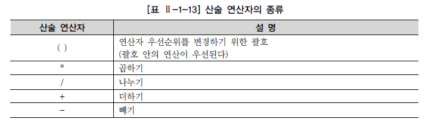

</div>

### 합성 연산자
- 문자와 문자를 연결하는 합성(CONCATENATION) 연산자를 사용하면 별도의 프로그램 도움 없이 SQL 문장만으로도 유용한 리포트 출력 가능

- 문자와 문자를 연결하는 경우 2개의 수직 바(||)에 의해 이루어진다. (ORACLE)
  - 문자와 문자를 연결하는 경우 + 표시에 의해 이루어진다. (SQL Server)

- 두 벤더 모두 공통적으로 CONCAT (string1, string2) 함수를 사용할 수 있다.

- 칼럼과 문자 또는 다른 칼럼과 연결시킨다.

- 문자 표현식의 결과에 의해 새로운 칼럼을 생성한다.

<br>

# TCL(TRANSACTION CONTROL LANGUAGE)
## 트랜잭션의 개요
- 트랜잭션 : 데이터베이스의 논리적 연산단위
  - 밀접히 관련되어 분리될 수 없는 한 개 이상의 데이터베이스 조작
  - 트랜잭션은 분할할 수 없는 최소의 단위이다.
  - 하나의 트랜잭션에는 하나 이상의 SQL 문장이 포함된다.
  - 하나의 트랜잭션은 전부 적용하거나 전부 취소한다.

- 계좌이체로 이해하는 트랜잭션
    ```
    STEP1. 100번 계좌의 잔액에서 10,000원을 뺀다.
    - 자신의 계좌에서 잔액을 확인하고 이체할 금액을 인출한 후 나머지 금액을 저장
    
    STEP2. 200번 계좌의 잔액에 10,000원을 더한다.
    - 이체할 계좌를 확인하고 앞에서 인출한 금액을 더한 다음 저장
    ```

    ```
    계좌이체라는 작업은 위의 두 개의 업데이트가 모두 성공적으로 완료되었을 때 종료된다.
    둘 중 하나라도 실패할 경우 계좌이체는 원래의 금액을 유지하고 있어야만 한다.
    어떠한 장애에 의해 어느 한 쪽만 실행된다면 이체한 금액은 어디로 증발하거나 임의로 증가하게 된다.
    그런 일이 있어서는 안 되므로 이러한 경우에는 수정을 취소하여 원 상태로 되돌려야 한다.
    ```

- 계좌이체 같은 하나의 논리적인 작업 단위를 구성하는 세부적인 연산들의 집합을 트랜잭션이라 한다.
  - 이런 관점에서 데이터베이스 응용 프로그램은 트랜잭션의 집합으로 정의할 수 있다.

- 트랜잭션의 대상은 UPDATE, INSERT, DELETE 등 데이터를 수정하는 DML 문이다.
  - SELECT 문장은 직접적인 트랜잭션의 대상이 아니지만, SELECT FOR UPDATE 등 배타적 LOCK을 요구하는 SELECT 문장은 트랜잭션의 대상이 될 수 있다.

- 요약
  - DML(INSERT, UPDATE, DELETE) 수행시 변경되는 데이터의 무결성을 보장하는 것이 커밋(COMMIT)과 롤백(ROLLBACK)의 목적
  - COMMIT은 변경된 데이터를 테이블이 영구적으로 반영
  - 저장점(SAVEPOINT/SAVE TRANSACTION)은 데이터 변경작업을 사전에 지정한 저장점까지만 롤백
  - ORACLE의 트랜잭션은 대상이 되는 SQL 문장을 실행하면 자동으로 시작되고, COMMIT 또는 ROLLBACK을 실행한 시점에서 종료
  - COMMIT과 ROLLBACK을 실행하지 않아도 자동으로 트랜잭션이 종료되는 경우
    - CREATE, ALTER, DROP, RENAME, TRUNCATE TABLE 등 DDL 문장을 실행하면 그 전후 시점에 자동으로 커밋
    - DML 문장 이후에 커밋 없이 DDL 문장이 실행되면 DDL 수행 전에 자동으로 커밋
    - 데이터베이스를 정상적으로 접속을 종료하면 자동으로 트랜잭션이 커밋
    - 애플리케이션의 이상 종료로 데이터베이스와의 접속이 단절되었을 때는 트랜잭션이 자동으로 롤백
  - SQL Server의 트랜잭션은 DBMS가 트랜잭션을 컨트롤하는 방식인 AUTO COMMIT이 기본 방식이다.
    - 다음의 경우는 ORACLE과 같이 자동으로 트랜잭션이 종료된다.
    - 애플리케이션의 이상 종료로 데이터베이스(인스턴스)와의 접속이 단절되었을 때는 트랜잭션이 자동으로 롤백

<br>

<div align=center>

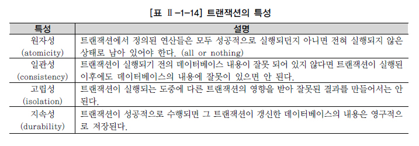

</div>

<br>

- 계좌이체에서 이체가 결정되기 전까지는 다른 사람이 해당 계좌의 정보를 변경할 수 없다.
  - 이를 자물쇠를 채우듯이 한다고 하여 잠금(LOCKING)이라고 표현한다.

- 트랜잭션의 특성(특히 원자성)을 충족하기 위해 데이터베이스는 다양한 레벨의 잠금 기능을 제공한다.
  - 잠금은 기본적으로 트랜잭션이 수행하는 동안 특정 데이터에 대해서 다른 트랜잭션이 동시에 접근하지 못하도록 제한하는 기법이다.

- 잠금이 걸린 데이터는 잠금을 실행한 트랜잭션만 독점적으로 접근할 수 있고 다른 트랜잭션으로부터 간섭이나 방해를 받지 않는 것이 보장된다.
  - 잠금이 걸린 데이터는 잠금을 수행한 트랜잭션만이 해제할 수 있다.

<br>

## COMMIT
- 입력한 자료나 수정한 자료에 대해서 또는 삭제한 자료에 대해서 전혀 문제가 없다고 판단되었을 경우 COMMIT 명령어를 통해서 트랜잭션을 완료할 수 있다.
    ```sql
    COMMIT; 
    ```

- COMMIT이나 ROLLBACK 이전의 데이터 상태
  - 메모리 BUFFER에만 영향을 받았다면 데이터의 변경 이전 상태로 복구 가능
  - 현재 사용자는 SELECT 문장으로 결과 확인 가능
  - 다른 사용자는 현재 사용자가 수행한 명령의 결과를 볼 수 없음
  - 변경된 행은 잠금(LOCKING)이 설정되어서 다른 사용자는 변경 불가

- COMMIT 명령어는 DML(INSERT, UPDATE, DELETE)을 사용한 후에 변경 작업이 완료되었음을 데이터베이스에 알려 주기 위해 사용한다.

- COMMIT 이후의 데이터 상태는 다음과 같다.
  - 데이터에 대한 변경 사항이 데이터베이스에 반영
  - 이전 데이터는 영원히 소실
  - 모든 사용자는 결과를 볼 수 있음
  - 관련된 행에 대한 잠금(LOCKING)이 풀리고, 다른 사용자들의 행 조작 가능

### (별첨)SQL Server의 COMMIT
- ORACLE은 DML을 실행하는 경우 DBMS가 트랜잭션을 내부적으로 실행하며 DML 문장 수행 후 사용자가 임의로 COMMIT 혹은 ROLLBACK을 수행해 주어야 트랜잭션이 종료
- SQL Server는 기본적으로 AUTO COMMIT 모드이기 때문에 DML 수행 후 사용자가 COMMIT이나 ROLLBACK을 처리할 필요가 없음
- DML 구문이 성공이면 자동으로 COMMIT이 되고 오류가 발생할 경우 자동으로 ROLLBACK 처리

<br>

### (별첨)SQL Server의 트랜잭션 방식
- AUTO COMMIT
  - SQL Server의 기본 방식이며, DML, DDL을 수행할 때마다 DBMS가 트랜잭션을 컨트롤하는 방식
  - 명령어가 성공적으로 수행되면 자동으로 COMMIT을 수행하고 오류가 발생하면 자동으로 ROLLBACK 수행

- 암시적 트랜잭션
  - ORACLE과 같은 방식으로 처리
  - 트랜잭션의 시작은 DBMS가 처리하고 트랜잭션의 끝은 사용자가 명시적으로 COMMIT 또는 ROLLBACK으로 처리
  - 인스턴스 단위 또는 세션 단위로 설정 가능.
    - 인스턴스 단위로 설정하려면 서버 속성 창의 연결화면에서 기본연결 옵션 중 암시적 트랜잭션에 체크
  - 세션 단위로 설정하기 위해서는 세션 옵션 중 SET IMPLICIT TRANSACTION ON 사용

- 명시적 트랜잭션
  - 트랜잭션의 시작과 끝을 모두 사용자가 명시적으로 지정하는 방식
  - BEGIN TRANSACTION (BEGIN TRAN 구문도 가능)으로 트랜잭션을 시작하고 COMMIT TRANSACTION(TRANSACTION은 생략 가능) 또는 ROLLBACK TRANSACTION(TRANSACTION은 생략 가능)으로 트랜잭션 종료
  - ROLLBACK 구문을 만나면 최초의 BEGIN TRANSACTION 시점까지 모두 ROLLBACK 수행

<br>

## ROLLBACK
- 롤백(ROLLBACK) : 테이블 내 입력, 수정, 삭제 데이터에 대하여 COMMIT 이전에 변경 사항을 취소
  - 데이터 변경 사항이 취소되어 이전 상태로 복구되며, 관련된 행에 대한 잠금(LOCKING)이 풀리고 다른 사용자들이 데이터 변경을 할 수 있게 된다.
    ```sql
    ROLLBACK; 
    ```

- ROLLBACK 후의 데이터 상태
  - 데이터에 대한 변경 사항은 취소된다.
  - 이전 데이터는 다시 재저장된다.
  - 관련된 행에 대한 잠금(LOCKING)이 풀리고, 다른 사용자들이 행을 조작할 수 있게 된다.

- COMMIT과 ROLLBACK을 사용함으로써 다음과 같은 효과를 볼 수 있다.
  - 데이터 무결성 보장
  - 영구적인 변경을 하기 전에 데이터의 변경 사항 확인 가능
  - 논리적으로 연관된 작업을 그룹핑하여 처리 가능

### (별첨)SQL Server의 ROLLBACK
- SQL Server는 AUTO COMMIT이 기본 방식이므로 임의적인 ROLLBACK 을 수행하려면 명시적으로 트랜잭션을 선언해야 된다.
    ```sql
    ROLLBACK;
    ```

<br>

## SAVEPOINT
- 저장점(SAVEPOINT)을 정의하면 롤백(ROLLBACK)할 때 트랜잭션에 포함된 전체 작업을 롤백하는 것이 아니라 현 시점에서 SAVEPOINT까지 트랜잭션의 일부만 롤백할 수 있다.

- 복잡한 대규모 트랜잭션에서 에러가 발생했을 때 SAVEPOINT까지의 트랜잭션만 롤백하고 실패한 부분에 대해서만 다시 실행할 수 있다.

- 복수의 저장점을 정의할 수 있으며, 동일이름으로 저장점을 정의했을 때는 나중에 정의한 저장점이 유효
    ```sql
    -- [ORACLE]

    -- SVPT1이라는 저장점 정의
    SAVEPOINT SVPT1;

    -- 저장점까지 롤백
    ROLLBACK TO SVPT1; 
    ```
    ```sql
    -- [SQL Server]
    -- SVPT1이라는 저장점 정의
    SAVE TRANSACTION SVTR1; 

    -- 저장점까지 롤백
    ROLLBACK TRANSACTION SVTR1; 
    ```

<br>

<div align=center>


</div>

<br>

- 저장점 A로 되돌리고 나서 다시 B와 같이 미래 방향으로 되돌릴 수는 없다.
  - 특정 저장점까지 롤백하면 그 저장점 이후에 설정한 저장점이 무효가 된다.
  - 'ROLLBACK TO A'를 실행한 시점에서 저장점 A 이후에 정의한 저장점 B는 존재하지 않는다.

- 저장점 지정 없이 "ROLLBACK"을 실행했을 경우 반영되지 않은 모든 변경 사항을 취소하고 트랜잭션 시작 위치로 되돌아간다.

<br>

# WHERE 절
## WHERE(조건)절 개요
- 정의
  - 자신이 원하는 자료만을 검색하기 위해서 SQL 문장에 WHERE 절을 추가해 조회 자료들의 조건을 제한할 수 있다.
  - WHERE 절을 사용하지 않은 SQL 문장은 해당 데이터베이스의 CPU와 메모리를 과다하게 사용한다.
    - 조건이 없는 SELECT문은 테이블을 전체(Full Table Scan)를 읽게 되어 데이터의 양에 따라 성능을 저하시킨다.

- 문법
    ```sql
    -- 문법
    SELECT [DISTINCT/ALL] 칼럼명 [ALIAS] 명 FROM 테이블명 WHERE 조건절;
    ```

- 구성
  - 칼럼(Column)명 (보통 조건식의 좌측에 위치)
  - 비교 연산자
  - 문자, 숫자, 표현식 (보통 조건식의 우측에 위치)
  - 비교 칼럼명 (JOIN 사용시)

<br>

## 연산자의 종류
### 비교 연산자
- 종류

    |연산자|연산자의 의미|
    |----|----------|
    |=|같다|
    |>|보다 크다(초과)|
    |>=|보다 크거나 같다(이상)|
    |<|보다 작다|
    |<=|보다 작거나 같다(이상)|

- 주의사항
  - 비교 연산자의 양쪽이 모두 CHAR 유형인 경우
    - 길이가 서로 다른 CHAR 유형이면 작은 쪽에 SPACE 를 추가하여 길이를 같게 한 후 비교
    - 서로 다른 문자가 나올 때까지 비교
    - 달라진 첫 번째 문자의 값에 따라 크기 결정

  - 비교 연산자의 어느 한 쪽이 VARCHAR 유형인 경우
    - 서로 다른 문자가 나올때까지 비교
    - 길이가 다르면 짧은 것이 끝날 때까지 비교한 후 길이가 긴 것이 크다고 판단
    - 길이가 같고 다른 것이 없다면 같다고 판단
    - VARCHAR 는 NOT NULL 까지 길이 판단

  - 상수값과 비교할 경우
    - 상수 쪽을 변수 타입과 동일하게 바꾸고 비교
    - 변수 쪽이 CHAR 유형이면 위의 CHAR 유형의 경우를 적용
    - 변수 쪽이 VARCHAR 유형이면 위의 VARCHAR 유형의 경우를 적용

- 기타
  - 숫자 유형 칼럼의 경우 숫자로 변환이 가능한 문자열과 비교되면 상대 타입을 숫자 타입으로 바꾸어 비교
  - VARCHAR, CHAR은 작은 따옴표나 큰따옴표를 묶어서 비교
    - NUMERIC과 같은 숫자 유형은 인용 부호를 사용하지 않는다.

### SQL 연산자
- 종류

    |연산자|연산자의 의미|
    |----|----------|
    |BETWEEN a AND b|a와 b의 값 사이에 있으면 된다(a와 b의 값이 포함).|
    |IN(list)|리스트에 있는 값 중에서 어느 하나라도 일치하면 된다.|
    |LIKE '비교문자열'|비교 문자열과 형태가 일치한다.|
    |IS NULL|NULL 값인 경우|

<br>

### BETWEEN 연산자
```sql
SELECT PLAYER_NAME 선수이름   
     , POSITION 포지션   
     , BACK_NO 백넘버   
     , HEIGHT 키   
  FROM PLAYER   
 WHERE  HEIGHT BETWEEN 170 AND 180;
```

<br>

### IN 연산자
```sql
SELECT PLAYER_NAME 선수이름   
     , POSITION 포지션   
     , BACK_NO 백넘버   
     , HEIGHT 키   
  FROM PLAYER   
 WHERE  TEAM_ID IN ('K02','K07');
```

<br>

### LIKE 연산자
```sql
SELECT PLAYER_NAME 선수이름   
     , POSITION 포지션   
     , BACK_NO 백넘버   
     , HEIGHT 키   
  FROM PLAYER   
 WHERE POSITION LIKE 'MF';
```

- 와일드 카드의 사용

    |와일드카드|설명|
    |----|----------|
    |%|a와 b의 값 사이에 있으면 된다(a와 b의 값이 포함).|
    |IN(list)|리스트에 있는 값 중에서 어느 하나라도 일치하면 된다.|

<br>

### 논리 연산자
- 조건들을 논리적으로 연결시키기 위해서 사용되는 연산자

    |연산자|연산자의 의미|
    |------|-------------|
    |AND|앞에 있는 조건과 뒤에 오는 조건이 참(TRUE)이 되면 결과도 참(TRUE)|
    |-|앞의 조건과 뒤의 조건을 동시에 만족해야 하는 것|
    |OR|앞의 조건이 참(TRUE)이거나 뒤의 조건이 참(TRUE)이 되면 결과도 참(TRUE)|
    |-|앞, 뒤의 조건 중 하나만 참(TRUE)이면 됨|
    |NOT|뒤에 오는 조건에 반대되는 결과를 반환|
    
- AND 연산자
    ```sql
    SELECT PLAYER_NAME 선수이름  
        , POSITION 포지션  
        , BACK_NO 백넘버  
        , HEIGHT 키  
    FROM PLAYER  
    WHERE TEAM_ID = 'K02'  
        AND HEIGHT >= 170; 
    ```

- OR 연산자
    ```sql
    SELECT PLAYER_NAME 선수이름  
        , POSITION 포지션  
        , BACK_NO 백넘버  
        , HEIGHT 키  
    FROM PLAYER  
    WHERE (TEAM_ID = 'K02'  
        OR BACK_NO = 1)  
        AND HEIGHT >= 170; 
    ```

<br>

### 부정 연산자
- 비교 연산자, SQL 비교 연산자에 대한 부정 표현

- 부정 논리 연산자

    |연산자|연산자의 의미|
    |------|-------------|
    |!=|같지 않음|
    |^=|같지 않음|
    |<>|같지 않음, ANSI/ISO 표준으로 모든 운영체제에서 사용 가능|
    |NOT 컬럼명 =|~와 같지 않음|
    |NOT 컬럼명 >|~보다 크지 않음|

- 부정 SQL 연산자

    |연산자|연산자의 의미|
    |------|-------------|
    |NOT BETWEEN a AND b|a와 b의 값 사이에 있지 않음(a, b 값을 포함하지 않음)|
    |NOT IN (list)|list 값과 일치하지 않음|
    |IS NOT NULL|NULL 값을 갖지 않음|

- 예제
    ```sql
    -- 1
    SELECT PLAYER_NAME 선수이름  
        , POSITION 포지션  
        , BACK_NO 백넘버  
        , HEIGHT 키  
    FROM PLAYER  
    WHERE TEAM_ID = 'K02'  
        AND NOT POSITION = 'MF'  
        AND NOT HEIGHT BETWEEN 175 AND 185; 

    -- 2
    SELECT PLAYER_NAME 선수이름  
        , POSITION 포지션  
        , BACK_NO 백넘버  
        , HEIGHT 키  
    FROM PLAYER  
    WHERE TEAM_ID = 'K02'  
        AND POSITION <> 'MF'  
        AND HEIGHT NOT BETWEEN 175 AND 185; 

    -- 3
    SELECT PLAYER_NAME 선수이름  
        , NATION 국적  
    FROM PLAYER  
    WHERE NATION IS NOT NULL; 
    ```

<br>

## ROWNUM, TOP 사용
- SQL 처리 결과 집합의 각 행에 대해 임시로 부여되는 일련번호
- 테이블이나 집합에서 원하는 만큼의 행만 가져오고 싶을 때 WHERE 절에서 행의 개수를 제한하는 목적으로 사용

### ROWNUM
- 한건을 가져올 경우
    ```sql
    SELECT PLAYER_NAME FROM PLAYER WHERE ROWNUM = 1;
    SELECT PLAYER_NAME FROM PLAYER WHERE ROWNUM <= 1;
    SELECT PLAYER_NAME FROM PLAYER WHERE ROWNUM < 2;
    ```

- N개 이상의 건을 가져올 경우
    ```sql
    SELECT PLAYER_NAME FROM PLAYER WHERE ROWNUM <= N;
    SELECT PLAYER_NAME FROM PLAYER WHERE ROWNUM < N + 1
    ```

<br>

### TOP 절
- SQL Server 에서는 TOP 절을 사용

- 형식
    ```sql
    TOP (Expression) [PERCENT] [WITH TIES]
    ```
  - Expression : 반환할 행의 수를 지정하는 숫자

  - PERCENT : 쿼리 결과 집합에서 처음 Expression  행만 반환됨을 의미

  - WITH TIES : ORDER BY 절이 지정된 경우에만 사용할 수 있으며 TOP N(PERCENT)의 마지막 행과 같은 값이 있는 경우 추가 행이 출력되도록 지정

- 한건을 가져올 경우
    ```sql
    SELECT TOP(1) PLAYER_NAME FROM PLAYER;
    ```

- N개 이상의 건을 가져올 경우
    ```sql
    SELECT TOP(N) PLAYER_NAME FROM PLAYER;
    ```

- ORDER BY 를 사용하면 ROWNUM과 TOP 은 기능의 차이가 발생

<br>