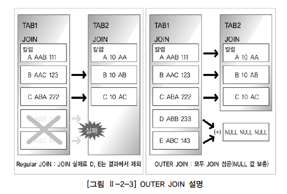
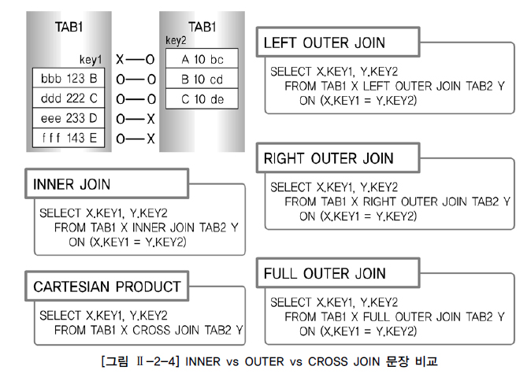
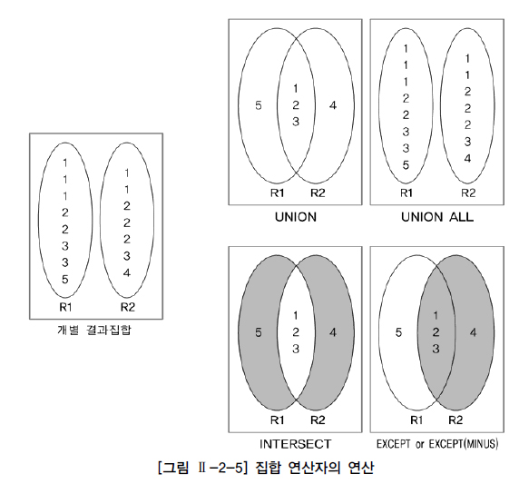
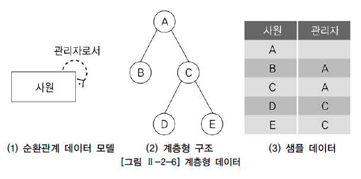
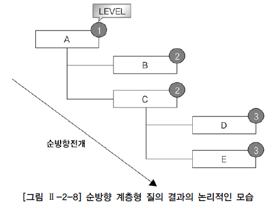
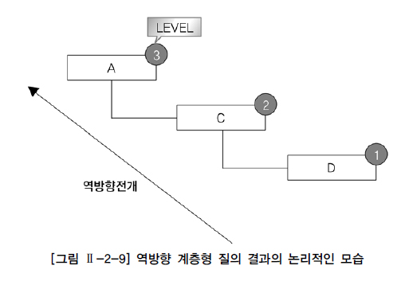
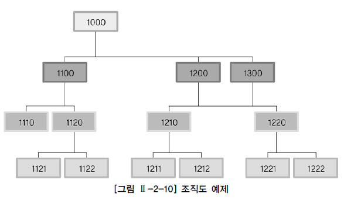
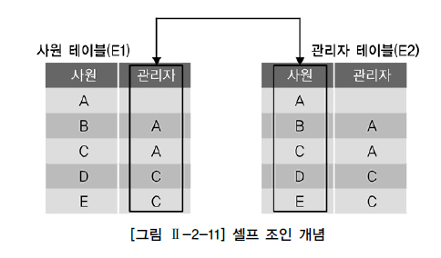

# 표준 조인(STANDARD JOIN)
## 표준 조인 개요
- 일반 집합 연산자

    

    - UNION : 합집합. 공통 교집합의 중복을 없애기 위해 사전 작업으로 정렬 작업 발생
    - UNION ALL : 합집합. 공통 교집합을 중복해서 출력하므로 정렬 작업 미발생
    - INTERSECTION : 교집합. 두 집합의 공통집합을 추출
    - DIFFERENCE : (오라클은 MINUS) 차집합. 첫 번째 집합에서 두 번째 집합과의 공통집합을 제외
    - PRODUCT : CROSS(ANIS/ISO 표준) PRODUCT라고 불리는 곱집합. 양쪽 집합의 M*N 건의 데이터 조합이 발생

- 순수 관계 연산자

    

    - SELECT 연산은 WHERE 절 기능으로 구현되었다.
    - PROJECT 연산은 SELECT 절의 컬럼 선택 기능으로 구현되었다.
    - JOIN 연산은 여러 JOIN 기능으로 가장 다양하게 구현되었다.
    - DIVIDE 연산은 현재 사용되지 않는다.
    - 관계형 데이터베이스의 경우 엔터티 확정 및 정규화 과정, 그리고 M:M (다대다) 관계를 분해하는 절차를 거치게 된다.
    - 정규화는 데이터 정합성과 데이터 저장 공간의 절약을 위해 엔터티를 최대한 분리하는 작업이며 일반적으로 3차 정규형이나 보이스코드 정규화까지 진행한다.
    - 정규화를 거치면 하나의 주제에 관련 있는 엔터티가 여러 개로 나누어지게 된다.
      - 해당 엔터티들이 주로 테이블이 되는데 흩어진 데이터를 연결해서 원하는 데이터를 가져오는 작업이 JOIN 이다.

<br>

## FROM 절 JOIN
### INNER JOIN
- OUTER JOIN과 반대로 내부 JOIN이라고 하며 JOIN 조건에서 동일한 값이 있는 행만 반환
    ```sql
    -- 1과 2는 같은 결과를 반환
    -- 1
    SELECT A.DEPTNO, A.EMPNO, A.ENAME, B.DNAME
    FROM   EMP A, DEPT B
    WHERE  A.DEPTNO = B.DEPTNO ;

    -- 2
    SELECT A.DEPTNO, A.EMPNO, A.ENAME, B.DNAME
    FROM   EMP A INNER JOIN DEPT B
    WHERE  A.DEPTNO = B.DEPTNO ;

    -- INNER 문구는 생략 가능
    SELECT A.DEPTNO, A.EMPNO, A.ENAME, B.DNAME
    FROM   EMP A  JOIN DEPT B
    WHERE  A.DEPTNO = B.DEPTNO ;
    ```

<br>

### NATURAL JOIN
- 두 테이블 간 동일한 이름을 갖는 모든 칼럼들에 대해 EQUI(=) JOIN을 수행
    ```sql
    SELECT DEPTNO, EMPNO, ENAME, DNAME
    FROM   EMP NATURAL JOIN DEPT ;
    ```

- SQL Server에서는 지원하지 않는다.

<br>

### USNIG 조건절
- 같은 이름을 가진 칼럼들 중에서 원하는 칼럼에 대해서만 선택적으로 EQUI JOIN 가능
    ```sql
    -- USING절에 명시된 컬럼이 기준이 되어 동일한 컬럼들을 조인
    -- 1
    SELECT *
    FROM DEPT JOIN DEPT_TEMP
    USING (DEPTNO);

    -- 2
    SELECT *
    FROM DEPT JOIN DEPT_TEMP
    USING (LOC, DEPTNO);
    ```

- SQL Server에서는 지원하지 않는다.

<br>

### ON 조건절
- JOIN 서술부(ON 조건절)와 비 JOIN 서술부(WHERE 조건절)를 분리, 칼럼명이 다르더라도 JOIN 조건을 사용할 수 있다.
    ```sql
    SELECT E.EMPNO, E.NAME, E.DEPTNO, D.DNAME
    FROM   EMP E JOIN DEPT D
    ON     (E.DEPTNO = D.DEPTNO);
    ```

- WHERE 절과 혼용하여 사용
    ```sql
    SELECT E.EMPNO, E.NAME, E.DEPTNO, D.DNAME
    FROM   EMP E JOIN DEPT D
    ON     (E.DEPTNO = D.DEPTNO)
    WHERE  E.DEPTNO = 30;
    ```

- ON 조건절 + 데이터 검증 조건 추가
    ```sql
    -- 1과 2는 같은 결과를 반환
    -- 1
    SELECT E.EMPNO, E.NAME, E.DEPTNO, D.DNAME
    FROM   EMP E JOIN DEPT D
    ON     (E.DEPTNO = D.DEPTNO AND E.DEPTNO = 30);

    -- 2
    SELECT E.EMPNO, E.NAME, E.DEPTNO, D.DNAME
    FROM   EMP E JOIN DEPT D
    ON     (E.DEPTNO = D.DEPTNO )
    WHERE   E.DEPTNO = 30;
    ```

- 다중 테이블 JOIN
    ```sql
    -- 1과 2는 같은 결과를 반환
    -- 1
    SELECT E.EMPNO, D.DEPTNO, D.DNAME, T.DNAME NEW_NAME
    FROM   EMP E JOIN DEPT D
    ON     (E.DEPTNO = D.DEPTNO)
                 JOIN DEPT_TEMP T
    ON     (E.DEPTNO = T.DEPTNO);

    -- 2
    SELECT E.EMPNO, D.DEPTNO, D.DNAME, T.DNAME NEW_NAME
    FROM   EMP E ,DEPT D, DEPT_TEMP T
    WHERE  E.DEPTNO = D.DEPTNO 
    AND    E.DEPTNO = T.DEPTNO;
    ```

<br>

### CROSS JOIN
- 일반 집합 연산자의 PRODUCT의 개념
- 테이블 간 JOIN 조건이 없는 경우 생길 수 있는 모든 데이터의 조합 출력
  - 두 개의 테이블에 대한 CARTESIAN PRODUCT 또는 CROSS PRODUCT와 같은 표현
  - 결과는 양쪽 집합의 M*N 건의 데이터 조합이 발생한다.
        ```sql
        -- EMP 14건 * DEPT 4건의 데이터로 56건 출력
        SELECT ENAME,  DNAME
        FROM   EMP CROSS JOIN DEPT
        ORDER  BY ENAME;
        ```

<br>

### OUTER JOIN
- INNER JOIN과 반대로 외부 JOIN이라고 하며 JOIN 조건에서 동일한 값이 없는 행도 반환

<div align=center>



</div>

- LEFT OUTER JOIN
    ```sql
    -- DEPT에 속하지 않은 EMP의 정보 반환
    SELECT *
    FROM   EMP E LEFT OUTER JOIN DEPT D
    ON     E.DEPTNO = D.DEPTNO;
    ```

- RIGHT OUTER JOIN
    ```sql
    -- EMP에 속하지 않은 DEPT 정보 반환
    SELECT *
    FROM   EMP E RIGHT OUTER JOIN DEPT D
    ON     E.DEPTNO = D.DEPTNO;
    ```

- FULL OUTER JOIN
    ```sql
    -- 1과 2는 같은 결과를 반환(OUTER 생략 가능)
    -- 1
    SELECT *
    FROM   EMP E FULL OUTER JOIN DEPT D
    ON     E.DEPTNO = D.DEPTNO;

    -- 2
    SELECT *
    FROM   EMP E LEFT OUTER JOIN DEPT D
    ON     E.DEPTNO = D.DEPTNO
    UNION
    SELECT *
    FROM   EMP E RIGHT OUTER JOIN DEPT D
    ON     E.DEPTNO = D.DEPTNO;
    ```

<br>

### INNER vs OUTER vs CROSS JOIN 비교

<div align=center>



</div>

- INNER JOIN : 2건 출력

- LEFT OUTER JOIN : 4건 출력

- RIGHT OUTER JOIN : 3건 출력

- FULL OUTER JOIN : 5건 출력

- CROSS JOIN : 12건 출력

<br>

# 집합 연산자(SET OPERATOR)
## 집합 연산자의 개요
- 두 개 이상의 테이블에서 조인을 사용하지 않고 연관된 데이터를 조회하는 방법

|집합 연산자|연산자의 의미|
|-----------|-------------|
|UNION|여러 개의 SQL문의 결과에 대한 합집합으로 결과에서 모든 중복된 행을 하나의 행으로 만든다.|
|UNION ALL|여러 개의 SQL문의 결과에 대한 합집합으로 중복된 행도 결과에 표시된다. 즉, 단순히 결과만 합쳐놓은 것이다.|
|-|일반적으로 여러 개의 결과가 상호 배타적인(Exclusive)일 때 많이 사용한다.|
|-|개별 SQL문의 결과가 서로 중복되지 않는 경우 UNION 과 동일(결과의 정렬 순서에는 차이가 있을 수 있음).|
|INTERSECT|여러 개의 SQL문의 결과에 대한 교집합으로 중복된 행을 하나의 행으로 만든다.|
|EXCEPT/MINUS|앞 SQL문의 결과와 뒤 SQL문의 결과에 대한 차집합으로 중복된 행을 하나의 행으로 만든다.|

<div align=center>



</div>

- UNION
    ```sql
    SELECT TEAM_ID 팀코드
        , PLAYER_NAME 선수명
        , POSITION 포지션
        , BACK_NO 백넘버
        , HEIGHT 키 
    FROM PLAYER 
    WHERE TEAM_ID = 'K02' 
    UNION 
    SELECT TEAM_ID 팀코드
        , PLAYER_NAME 선수명
        , POSITION 포지션
        , BACK_NO 백넘버
        , HEIGHT 키 
    FROM PLAYER 
    WHERE POSITION = 'GK';
    ```

- UNION ALL
    ```sql
    SELECT TEAM_ID 팀코드
        , PLAYER_NAME 선수명
        , POSITION 포지션
        , BACK_NO 백넘버
        , HEIGHT 키 
    FROM PLAYER 
    WHERE TEAM_ID = 'K02' 
    UNION ALL 
    SELECT TEAM_ID 팀코드
        , PLAYER_NAME 선수명
        , POSITION 포지션
        , BACK_NO 백넘버
        , HEIGHT 키 
    FROM PLAYER 
    WHERE POSITION = 'GK'; 
    ```

- INTERSECTIN
    ```sql
    SELECT TEAM_ID 팀코드
        , PLAYER_NAME 선수명
        , POSITION 포지션
        , BACK_NO 백넘버
        , HEIGHT 키 
    FROM PLAYER 
    WHERE TEAM_ID = 'K02' 
    INTERSECT 
    SELECT TEAM_ID 팀코드
        , PLAYER_NAME 선수명
        , POSITION 포지션
        , BACK_NO 백넘버
        , HEIGHT 키 
    FROM PLAYER 
    WHERE POSITION = 'GK' 
    ORDER BY 1, 2, 3, 4, 5; 
    ```

- MINUS
    ```sql
    SELECT TEAM_ID 팀코드
        , PLAYER_NAME 선수명
        , POSITION 포지션
        , BACK_NO 백넘버
        , HEIGHT 키 
    FROM PLAYER 
    WHERE TEAM_ID = 'K02' 
    MINUS 
    SELECT TEAM_ID 팀코드
        , PLAYER_NAME 선수명
        , POSITION 포지션
        , BACK_NO 백넘버
        , HEIGHT 키 
    FROM PLAYER 
    WHERE POSITION = 'MF' 
    ORDER BY 1, 2, 3, 4, 5; 
    ```

<br>

# 계층형 질의와 셀프 조인
## 계층형 질의(Hierarchical Query)
- 테이블에 계층형 데이터가 존재하는 경우 데이터를 조회하기 위해서 계층형 질의를 사용한다.
  - 계층형 데이터 : 동일 테이블에 계층적으로 상위와 하위 데이터가 포함된 데이터

<div align=center>



</div>

- 그림은 사원에 대한 순환관계 데이터 모델을 표현한 것이다.

- (2) 계층형 구조에서 A의 하위 사원은 B, C이고 B 밑에는 하위 사원이 없고 C의 하위 사원은 D, E가 있다.

- 계층형 구조를 데이터로 표현한 것이 (3) 샘플 데이터이다.

### Oracle 계층형 질의
- 문법
    ```sql
    SELECT ...
    FROM   TABLE
    WHERE  CONDITION AND CONDITION
    START WITH CONDITION
    CONNECT BY [NOCYCLE] CONDITION AND CONDITION
    [ORDER SIBLINGS BY COLUMN, COLUMN......]
    ```

    - START WITH 절 : 계층 구조 전개의 시작 위치를 지정하는 구문이다. 즉, 루트 데이터를 지정(액세스)한다.

    - CONNECT BY 절 : 다음에 전개될 자식 데이터를 지정하는 구문이다. 자식 데이터는 CONNECT BY절에 주어진 조건(조인)을 만족해야 한다.

    - PRIOR : CONNECT BY절에 사용되며, 현재 읽은 칼럼을 지정한다. PRIOR 자식 = 부모 형태를 사용하면 계층구조에서 자식 데이터에서 부모 데이터(자식 → 부모) 방향으로 전개하는 순방향 전개를 한다. 그리고 PRIOR 부모 = 자식 형태를 사용하면 반대로 부모 데이터에서 자식 데이터(부모 → 자식) 방향으로 전개하는 역방향 전개를 한다.

    - NOCYCLE : 데이터를 전개하면서 이미 나타났던 동일한 데이터가 전개 중에 다시 나타난다면 이것을 가리켜 사이클(Cycle)이 형성되었다라고 말한다. 사이클이 발생한 데이터는 런타임 오류가 발생한다. 그렇지만 NOCYCLE를 추가하면 사이클이 발생한 이후의 데이터는 전개하지 않는다.

    - ORDER SIBLINGS BY : 형제 노드(동일 LEVEL) 사이에서 정렬을 수행한다.

    - WHERE : 모든 전개를 수행한 후에 지정된 조건을 만족하는 데이터만 추출(필터링)한다.

- Oracle은 계층형 질의를 사용할 때 다음과 같은 가상 칼럼(Pseudo Column)을 제공한다.

    |가상 컬럼|설명|
    |---------|----|
    |LEVEL|루트 데이터이면 1, 그 하위 데이터이면 2이다. 리프(Leaf) 데이터까지 1씩 증가한다.|
    |CONNECT_BY_ISLEAF|전개 과정에서 해당 데이터가 리프 데이터이면 1, 그렇지 않으면 0이다.|
    |CONNECT_BY_ISCYCLE|전개 과정에서 자식을 갖는데, 해당 데이터가 조상으로서 존재하면 1, 그렇지 않으면 0이다. 여기서 조상이란 자신으로부터 루트까지의 경로에 존재하는 데이터를 말한다. CYCLE 옵션을 사용했을 때만 사용할 수 있다.|

- (3) 샘플 데이터의 계층형 질의 구문을 통한 조회(관리자 → 사원 방향이므로 순방향 전개)
    ```sql
    -- 결과 데이터를 계층별로 구분하기 위해 LPAD 함수 사용
    SELECT LEVEL, LPAD(' ', 4 * (LEVEL-1)) || EMPNO 사원, 
            MGR 관리자, CONNECT_BY_ISLEAF ISLEAF 
    FROM EMP
    START WITH MGR IS NULL 
    CONNECT BY PRIOR EMPNO = MGR; 

    -- 결과
    LEVEL     EMP            MGR      ISLEAF
    ------    -------------- -------  ---------
    1         7839                    0 
    2            7566        7839     0
    3               7788     7566     0 
    4                  7876  7788     1 
    ```

    

    - A는 루트 데이터이기 때문에 레벨이 1이다.
    - A의 하위 데이터인 B, C는 레벨이 2이다.
    - C의 하위 데이터인 D, E는 레벨이 3이다.
    - 리프 데이터는 B, D, E이다. 관리자 → 사원 방향을 전개이기 때문에 순방향 전개이다.
    - 그림은 계층형 질의에 대한 논리적인 실행 모습이다.
    
- (3) 샘플 데이터의 계층형 질의 구문을 통한 조회(사원 → 관리자 방향이므로 역방향 전개)
    ```sql
    -- 결과 데이터를 계층별로 구분하기 위해 LPAD 함수 사용
    SELECT LEVEL, LPAD(' ', 4 * (LEVEL-1)) || EMPNO사원, 
            MGR 관리자, CONNECT_BY_ISLEAF ISLEAF 
    FROM EMP 
    START WITH EMPNO = '7876' 
    CONNECT BY PRIOR MGR = EMPNO; 

    -- 결과
    LEVEL     EMP            MGR      ISLEAF
    ------    -------------- -------  ---------
    1         7876           7788     0 
    2            7788        7566     0
    3               7566     7839     0 
    4                  7839           1 
    ```

    

    - 역방향 전개는 하위 데이터에서 상위 데이터로 전개된다.
    - D는 루트 데이터이기 때문에 레벨이 1이다.
    - D의 상위 데이터인 C는 레벨이 2이다.
    - C의 상위 데이터인 A는 레벨이 3이다.
    - 리프 데이터는 A이다.
    - 루트 및 레벨은 전개되는 방향에 따라 반대이다.

- Orcle은 계층형 질의 시 사용자 편의성을 위해 함수를 제공한다.

    |함수|설명|
    |----|----|
    |SYS_CONNECT_BY_PATH|루트 데이터부터 현재 전개할 데이터가지의 경로를 표시한다. 사용법 : SYS_CONNECT_BY_PATH (칼럼, 경로분리자)|
    |CONNECT_BY_ROOT|현재 전개할 데이터의 루트 데이터를 표시한다. 단항 연산자이다. 사용법 : CONNECT_BY_ROOT 칼럼|

    ```sql
    SELECT CONNECT_BY_ROOT(EMPNO) 루트사원, SYS_CONNECT_BY_PATH(EMPNO, '/') 경로, 
            EMPNO 사원, MGR 관리자 
    FROM EMP
    START WITH MGR IS NULL 
    CONNECT BY PRIOR EMPNO = MGR; 

    -- 결과
    루트사원      경로                 사원       관리자
    --------    -------------------  ------     ----------
        7839    /7839                7839
        7839    /7839/7566           7566       7839
        7839    /7839/7566/7788      7788       7566
    ```

<br>

### SQL Server 계층형 질의
- 문법
    ```sql
    WITH EMPLOYEES_ANCHOR AS 
    ( SELECT EMPLOYEEID, LASTNAME, FIRSTNAME, REPORTSTO, 0 AS LEVEL 
        FROM EMPLOYEES 
        WHERE REPORTSTO IS NULL /* 재귀 호출의 시작점 */ 
        UNION ALL 
        SELECT R.EMPLOYEEID, R.LASTNAME, R.FIRSTNAME, R.REPORTSTO, A.LEVEL + 1 
        FROM EMPLOYEES_ANCHOR A, EMPLOYEES R 
        WHERE A.EMPLOYEEID = R.REPORTSTO 
    ) 
    SELECT LEVEL
        , EMPLOYEEID
        , LASTNAME
        , FIRSTNAME
        , REPORTSTO 
    FROM EMPLOYEES_ANCHOR 

    GO 
    
    -- 결과
    Level EmployeeID LastName   FirstName ReportsTo 
    ---- --------    -------    -----     -------- 
    0    2           Fuller     Andrew    NULL 
    1    1           Davolio    Nancy     2 
    1    3           Leverling  Janet     2 
    1    4           Peacock    Margaret  2 
    1    5           Buchanan   Steven    2 
    1    8           Callahan   Laura     2 
    2    6           Suyama     Michael   5 
    2    7           King       Robert    5 
    2    9           Dodsworth  Anne      5 
    ```

    - WITH 절의 CTE 쿼리를 보면, UNION ALL 연산자로 쿼리 두 개를 결합했다.
      - 위의 쿼리를 '앵커 멤버'(Anchor Member), 아래의 쿼리를 '재귀 멤버'(Recursive Member)라고 한다.

- 재귀적 쿼리의 처리 과정
  - CTE 식을 앵커 멤버와 재귀 멤버로 분할
  - 앵커 멤버를 실행하여 첫 번째 호출 또는 기본 결과 집합(T0) 생성
  - Ti는 입력으로 사용하고 Ti+1은 출력으로 사용하여 재귀 멤버 실행
  - 빈 집합이 반환될 때까지 3단계를 반복
  - T0에서 Tn까지의 UNION ALL의 결과 집합 반환

    

    ```sql
    WITH T_EMP_ANCHOR AS ( 
        SELECT EMPLOYEEID, MANAGERID, 0 AS LEVEL, CONVERT(VARCHAR(1000), EMPLOYEEID) AS SORT 
        FROM T_EMP 
        WHERE MANAGERID IS NULL /* 재귀 호출의 시작점 */ 
        UNION ALL 
        SELECT R.EMPLOYEEID, R.MANAGERID, A.LEVEL + 1, CONVERT(VARCHAR(1000), A.SORT + '/' + R.EMPLOYEEID) AS SORT 
        FROM T_EMP_ANCHOR A, T_EMP R 
        WHERE A.EMPLOYEEID = R.MANAGERID ) 
    SELECT LEVEL 
        , REPLICATE(' ', LEVEL) + EMPLOYEEID AS EMPLOYEEID
        , MANAGERID
        , SORT 
    FROM T_EMP_ANCHOR 
    ORDER BY SORT 
    GO 

    -- 결과
    Level EmployeeID ManagerID Sort 
    ----  --------   --------  ------------- 
    0     1000       NULL      1000 
    1     1100       1000      1000/1100 
    2     1110       1100      1000/1100/1110 
    2     1120       1100      1000/1100/1120 
    3     1121       1120      1000/1100/1120/1121 
    3     1122       1120      1000/1100/1120/1122 
    1     1200       1000      1000/1200 
    2     1210       1200      1000/1200/1210 
    3     1211       1210      1000/1200/1210/1211 
    3     1212       1210      1000/1200/1210/1212 
    2     1220       1200      1000/1200/1220 
    3     1221       1220      1000/1200/1220/1221 
    3     1222       1220      1000/1200/1220/1222 
    1     1300       1000      1000/1300 
    ```

<br>

## 셀프 조인(SELF JOIN)
- 동일 테이블 사이의 조인으로 FROM 절에 동일 테이블이 두 번 이상 나타난다.

- 동일 테이블 사이의 조인을 수행하면 테이블과 칼럼 이름이 모두 동일하기 때문에 식별을 위해 반드시 테이블 별칭(Alias)을 사용한다.
  - 칼럼에도 모두 테이블 별칭을 사용해서 어느 테이블의 칼럼인지 식별한다.

<div align=center>



</div>

- 문법
    ```sql
    SELECT E1.EMPNO 사원, E1.MGR 관리자, E2.MGR 차상위_관리자 
    FROM EMP E1, EMP E2 
    WHERE E1.MGR = E2.EMPNO 
    ORDER BY E2.MGR DESC, E1.MGR, E1.EMPNO; 

    -- 결과
    사원    관리자    차상위_관리자 
    -----  -------  ---------------
    7566   7839
    7689   7839
    7782   7839
    7788   7566     7839     
    ```

<br>

# 서브쿼리(SubQuery)

<br>