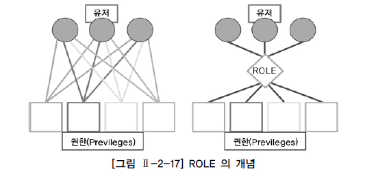

# 그룹 함수(GROUP FUNCTION)
- 그룹 함수 : ROLLUP, CUBE, GROUPING SETS

## ROLLUP
- 문법
    ```sql
    SELECT 컬럼1, 컬럼2, SUM(컬럼3)
    FROM 테이블
    GROUP BY ROLLUP(컬럼1, 컬럼2...)
    ```

- GROUP BY 절에 사용되며 그룹 지어진 집합 결과에 대해서 상세한 정보를 반환한다.

- ROLLUP에 지정된 컬럼은 Subtotal 생성에 사용
  - 그 컬럼의 수를 N이라고 했을 때 N + 1 Level의 Subtotal 생성

- ROLLUP의 인수는 계층 구조로 인수 순서가 바뀌면 수행 결과도 바뀐다.
  - 계층 간 집계에 대해서는 LEVEL 별로 정렬된다.

- 일반 GROUP BY 와 ROLLUP 사용 시
    ```sql
    SELECT DNAME, JOB, COUNT(*) "Total Empl", SUM(SAL) "Total Sal" 
    FROM EMP, DEPT 
    WHERE DEPT.DEPTNO = EMP.DEPTNO 
    GROUP BY DNAME, JOB; 

    DNAME          JOB       Total Empl  Total Sal
    -------------- --------- ---------- ----------
    SALES          MANAGER            1       2850
    SALES          CLERK              1        950
    ACCOUNTING     MANAGER            1       2450
    ACCOUNTING     PRESIDENT          1       5000
    ACCOUNTING     CLERK              1       1300
    SALES          SALESMAN           4       5600
    RESEARCH       MANAGER            1       2975
    RESEARCH       ANALYST            2       6000
    RESEARCH       CLERK              2       1900
    9 rows selected.


    SELECT DNAME, JOB, COUNT(*) "Total Empl", SUM(SAL) "Total Sal" 
    FROM EMP, DEPT 
    WHERE DEPT.DEPTNO = EMP.DEPTNO 
    GROUP BY DNAME, JOB ORDER BY DNAME, JOB; 

    DNAME          JOB       Total Empl  Total Sal
    -------------- --------- ---------- ----------
    ACCOUNTING     CLERK              1       1300
    ACCOUNTING     MANAGER            1       2450
    ACCOUNTING     PRESIDENT          1       5000
    RESEARCH       ANALYST            2       6000
    RESEARCH       CLERK              2       1900
    RESEARCH       MANAGER            1       2975
    SALES          CLERK              1        950
    SALES          MANAGER            1       2850
    SALES          SALESMAN           4       5600
    9 rows selected.


    SELECT DNAME, JOB, COUNT(*) "Total Empl", SUM(SAL) "Total Sal" 
    FROM EMP, DEPT 
    WHERE DEPT.DEPTNO = EMP.DEPTNO 
    GROUP BY ROLLUP (DNAME, JOB); 

    DNAME          JOB       Total Empl  Total Sal
    -------------- --------- ---------- ----------
    SALES          CLERK              1        950   Level 1
    SALES          MANAGER            1       2850
    SALES          SALESMAN           4       5600
    SALES                             6       9400   > Level 2
    RESEARCH       CLERK              2       1900
    RESEARCH       ANALYST            2       6000
    RESEARCH       MANAGER            1       2975   > Level 2
    RESEARCH                          5      10875
    ACCOUNTING     CLERK              1       1300
    ACCOUNTING     MANAGER            1       2450 
    ACCOUNTING     PRESIDENT          1       5000
    ACCOUNTING                        3       8750   > Level 2
                                     14      29025   > Level 3

    13 rows selected.

    -- * L1 - GROUP BY 수행시 생성되는 표준 집계 (9건)
    -- * L2 - DNAME 별 모든 JOB의 SUBTOTAL (3건)
    -- * L3 - GRAND TOTAL (마지막 행, 1건)
    ```

<br>

## GROUPING
- ROLLUP, CUBE, GROUPING SETS 등 새로운 그룹 함수를 지원하기 위해 추가된 함수

- ROLLUP이나 CUBE로 소계가 계산된 결과에는 GROUPING(EXPR) = 1 이 표시
  - 그 외의 결과에는 GROUPING(EXPR) = 0 이 표시

- GROUPING 함수와 CASE/DECODE 로 소계를 나타내는 필드에 원하는 문자열을 지정하여 사용 가능

- 문법 및 예제
    ```sql
    -- GROUPING 함수 사용 시
      SELECT DNAME
            ,GROUPING(DNAME)
            ,JOB
            ,GROUPING(JOB)
            ,COUNT(*) "Total Empl"
            ,SUM(SAL) "Total Sal"
        FROM EMP
            ,DEPT
       WHERE DEPT.DEPTNO = EMP.DEPTNO
    GROUP BY ROLLUP(DNAME, JOB);


    DNAME          GROUPING(DNAME) JOB       GROUPING(JOB) Total Empl  Total Sal
    -------------- --------------- --------- ------------- ---------- ----------
    SALES                        0 CLERK                 0          1        950
    SALES                        0 MANAGER               0          1       2850
    SALES                        0 SALESMAN              0          4       5600
    SALES                        0                       1          6       9400
    RESEARCH                     0 CLERK                 0          2       1900
    RESEARCH                     0 ANALYST               0          2       6000
    RESEARCH                     0 MANAGER               0          1       2975
    RESEARCH                     0                       1          5      10875
    ACCOUNTING                   0 CLERK                 0          1       1300
    ACCOUNTING                   0 MANAGER               0          1       2450
    ACCOUNTING                   0 PRESIDENT             0          1       5000
    ACCOUNTING                   0                       1          3       8750
                                 1                       1         14      29025

    13 rows selected.


    - GROUPING 함수 + CASE 사용 

      SELECT CASE GROUPING(DNAME) WHEN 1 THEN 'All Departments' ELSE DNAME END AS DNAME
            ,CASE GROUPING(JOB) WHEN 1 THEN 'All Jobs' ELSE JOB END AS JOB
            ,COUNT(*) "Total Empl"
            ,SUM(SAL) "Total Sal"
        FROM EMP
            ,DEPT
       WHERE DEPT.DEPTNO = EMP.DEPTNO
    GROUP BY ROLLUP(DNAME, JOB); 

    DNAME           JOB       Total Empl  Total Sal
    --------------- --------- ---------- ----------
    SALES           CLERK              1        950
    SALES           MANAGER            1       2850
    SALES           SALESMAN           4       5600
    SALES           All Jobs           6       9400
    RESEARCH        CLERK              2       1900
    RESEARCH        ANALYST            2       6000
    RESEARCH        MANAGER            1       2975
    RESEARCH        All Jobs           5      10875
    ACCOUNTING      CLERK              1       1300
    ACCOUNTING      MANAGER            1       2450
    ACCOUNTING      PRESIDENT          1       5000
    ACCOUNTING      All Jobs           3       8750
    All Departments All Jobs          14      29025

    13 rows selected.


      SELECT DECODE(GROUPING(DNAME), 1, 'All Departments', DNAME) AS DNAME
            ,DECODE(GROUPING(JOB), 1, 'All Jobs', JOB) AS JOB
            ,COUNT(*) "Total Empl"
            ,SUM(SAL) "Total Sal"
        FROM EMP
            ,DEPT
       WHERE DEPT.DEPTNO = EMP.DEPTNO
    GROUP BY ROLLUP(DNAME, JOB);

    DNAME           JOB       Total Empl  Total Sal
    --------------- --------- ---------- ----------
    SALES           CLERK              1        950
    SALES           MANAGER            1       2850
    SALES           SALESMAN           4       5600
    SALES           All Jobs           6       9400
    RESEARCH        CLERK              2       1900
    RESEARCH        ANALYST            2       6000
    RESEARCH        MANAGER            1       2975
    RESEARCH        All Jobs           5      10875
    ACCOUNTING      CLERK              1       1300
    ACCOUNTING      MANAGER            1       2450
    ACCOUNTING      PRESIDENT          1       5000
    ACCOUNTING      All Jobs           3       8750
    All Departments All Jobs          14      29025

    13 rows selected.


    - ROLLUP 함수 일부 사용 

    SELECT CASE GROUPING(DNAME) WHEN 1 THEN 'All Departments' ELSE DNAME END AS DNAME
            ,CASE GROUPING(JOB) WHEN 1 THEN 'All Jobs' ELSE JOB END AS JOB
            ,COUNT(*) "Total Empl"
            ,SUM(SAL) "Total Sal"
        FROM EMP
            ,DEPT
       WHERE DEPT.DEPTNO = EMP.DEPTNO
    GROUP BY DNAME
            ,ROLLUP(JOB);
    

    DNAME           JOB       Total Empl  Total Sal
    --------------- --------- ---------- ----------
    SALES           CLERK              1        950
    SALES           MANAGER            1       2850
    SALES           SALESMAN           4       5600
    SALES           All Jobs           6       9400
    RESEARCH        CLERK              2       1900
    RESEARCH        ANALYST            2       6000
    RESEARCH        MANAGER            1       2975
    RESEARCH        All Jobs           5      10875
    ACCOUNTING      CLERK              1       1300
    ACCOUNTING      MANAGER            1       2450
    ACCOUNTING      PRESIDENT          1       5000
    ACCOUNTING      All Jobs           3       8750

    12 rows selected.

    결과는 마지막 ALL DEPARTMENTS & ALL JOBS 줄만 계산이 되지 않았다. 
    ROLLUP이 JOB 칼럼에만 사용되었기 때문에 DNAME에 대한 집계는 필요하지 않기 때문이다. 


    - ROLLUP 함수 결합 칼럼 사용

      SELECT DNAME
            ,JOB
            ,MGR
            ,SUM(SAL) "Total Sal"
        FROM EMP
            ,DEPT
       WHERE DEPT.DEPTNO = EMP.DEPTNO
    GROUP BY ROLLUP(DNAME, (JOB, MGR));

    DNAME          JOB              MGR  Total Sal
    -------------- --------- ---------- ----------
    SALES          CLERK           7698        950
    SALES          MANAGER         7839       2850
    SALES          SALESMAN        7698       5600
    SALES                                     9400
    RESEARCH       CLERK           7788       1100
    RESEARCH       CLERK           7902        800
    RESEARCH       ANALYST         7566       6000
    RESEARCH       MANAGER         7839       2975
    RESEARCH                                 10875
    ACCOUNTING     CLERK           7782       1300
    ACCOUNTING     MANAGER         7839       2450
    ACCOUNTING     PRESIDENT                  5000
    ACCOUNTING                                8750
                                             29025

    14 rows selected.
    ```

<br>

## CUBE
- ROLLUP 은 가능한 Subtotal만을 생성하지만 CUBE 는 결합 가능한 모든 값에 대해 다차원 집계를 생성한다.

- CUBE 사용 시 내부적으로는 Grouping Columns의 순서를 바꾸므로 추가 쿼리를 수행해야 한다.

- Grand Total 은 양쪽의 Query 에서 모두 생성된다.
  - 하나의 쿼리 결과는 제거되므로 ROLLUP 에 비해 시스템의 연산 대상이 많다.

- Grouping Columns이 가질 수 있는 모든 Subtotal 을 생성해야 하는 경우에는 CUBE를 사용하는 것이 바람직하다.
  - 단, ROLLUP에 비해 시스템에 많은 부담을 주므로 사용에 주의해야 한다.

- CUBE 함수는 표시된 인수들에 대한 계층별 집계를 구할 수 있다.
  - 표시된 인수는 평등한 관계이므로 인수 및 행의 정렬 순서는 바뀔 수 있어도 데이터 결과는 같다.
  - 결과에 대한 정렬이 필요한 경우 ORDER BY 절에 명시적으로 정렬 칼럼을 추가한다.

- 문법 및 예제
    ```sql
    -- GROUP BY ROLLUP (DNAME, JOB) 조건에서 GROUP BY CUBE (DNAME, JOB) 조건으로 변경하여 수행

      SELECT CASE GROUPING(DNAME) WHEN 1 THEN 'All Departments' ELSE DNAME END AS DNAME
            ,CASE GROUPING(JOB) WHEN 1 THEN 'All Jobs' ELSE JOB END AS JOB
            ,COUNT(*) "Total Empl"
            ,SUM(SAL) "Total Sal"
        FROM EMP
            ,DEPT
       WHERE DEPT.DEPTNO = EMP.DEPTNO
    GROUP BY CUBE(DNAME, JOB);

    DNAME           JOB       Total Empl  Total Sal
    --------------- --------- ---------- ----------
    All Departments All Jobs          14      29025
    All Departments CLERK              4       4150
    All Departments ANALYST            2       6000
    All Departments MANAGER            3       8275
    All Departments SALESMAN           4       5600
    All Departments PRESIDENT          1       5000
    SALES           All Jobs           6       9400
    SALES           CLERK              1        950
    SALES           MANAGER            1       2850
    SALES           SALESMAN           4       5600
    RESEARCH        All Jobs           5      10875
    RESEARCH        CLERK              2       1900
    RESEARCH        ANALYST            2       6000
    RESEARCH        MANAGER            1       2975
    ACCOUNTING      All Jobs           3       8750
    ACCOUNTING      CLERK              1       1300
    ACCOUNTING      MANAGER            1       2450
    ACCOUNTING      PRESIDENT          1       5000

    18 rows selected.


    Execution Plan
    ----------------------------------------------------------
    Plan hash value: 4232949899

    --------------------------------------------------------------------------------------
    | Id  | Operation                     | Name | Rows  | Bytes | Cost (%CPU)| Time     |
    --------------------------------------------------------------------------------------
    |   0 | SELECT STATEMENT              |      |    14 |   756 |     8  (25)| 00:00:01 |
    |   1 |  SORT GROUP BY                |      |    14 |   756 |     8  (25)| 00:00:01 |
    |   2 |   GENERATE CUBE               |      |    14 |   756 |     8  (25)| 00:00:01 |
    |   3 |    SORT GROUP BY              |      |    14 |   756 |     8  (25)| 00:00:01 |
    |*  4 |     HASH JOIN                 |      |    14 |   756 |     7  (15)| 00:00:01 |
    |   5 |      TABLE ACCESS STORAGE FULL| DEPT |     4 |    88 |     3   (0)| 00:00:01 |
    |   6 |      TABLE ACCESS STORAGE FULL| EMP  |    14 |   448 |     3   (0)| 00:00:01 |
    --------------------------------------------------------------------------------------

    Predicate Information (identified by operation id):
    ---------------------------------------------------

    4 - access("DEPT"."DEPTNO"="EMP"."DEPTNO")

    Note
    -----
    - dynamic sampling used for this statement (level=2)


    Statistics
    ----------------------------------------------------------
            7  recursive calls
            0  db block gets
            30  consistent gets
            0  physical reads
            0  redo size
        1353  bytes sent via SQL*Net to client
            534  bytes received via SQL*Net from client
            3  SQL*Net roundtrips to/from client
            2  sorts (memory)
            0  sorts (disk)
            18  rows processed

    ```

<br>

## GROUPING SETS
- GROUP BY SQL 문장을 여러 번 반복하지 않아도 원하는 결과를 쉽게 얻을 수 있다.

- GROUPING SETS 에 표시된 인수들에 대한 개별 집계를 구할 수 있다.
  - 표시된 인수는 평등한 관계이므로 인수 및 행의 정렬 순서는 바뀔 수 있어도 데이터 결과는 같다.
  - 결과에 대한 정렬이 필요한 경우 ORDER BY 절에 명시적으로 정렬 칼럼을 추가한다.

- 문법 및 예제
    ```sql
      SELECT DECODE(GROUPING(DNAME), 1, 'All Departments', DNAME) AS DNAME
            ,DECODE(GROUPING(JOB), 1, 'All Jobs', JOB) AS JOB
            ,COUNT(*) "Total Empl"
            ,SUM(SAL) "Total Sal"
        FROM EMP
            ,DEPT
       WHERE DEPT.DEPTNO = EMP.DEPTNO
    GROUP BY GROUPING SETS(JOB
                          ,DNAME);


    DNAME           JOB       Total Empl  Total Sal
    --------------- --------- ---------- ----------
    All Departments CLERK              4       4150
    All Departments SALESMAN           4       5600
    All Departments PRESIDENT          1       5000
    All Departments MANAGER            3       8275
    All Departments ANALYST            2       6000
    ACCOUNTING      All Jobs           3       8750
    RESEARCH        All Jobs           5      10875
    SALES           All Jobs           6       9400

    8 rows selected.


    SELECT DNAME, JOB, MGR, SUM(SAL) "Total Sal" 
    FROM EMP, DEPT 
    WHERE DEPT.DEPTNO = EMP.DEPTNO 
    GROUP BY GROUPING SETS ((DNAME, JOB, MGR), (DNAME, JOB), (JOB, MGR));

    DNAME          JOB              MGR  Total Sal
    -------------- --------- ---------- ----------
    SALES          CLERK           7698        950
    SALES          MANAGER         7839       2850
    SALES          SALESMAN        7698       5600
    RESEARCH       CLERK           7788       1100
    RESEARCH       CLERK           7902        800
    RESEARCH       ANALYST         7566       6000
    RESEARCH       MANAGER         7839       2975
    ACCOUNTING     CLERK           7782       1300
    ACCOUNTING     MANAGER         7839       2450
    ACCOUNTING     PRESIDENT                  5000
    SALES          CLERK                       950
    SALES          MANAGER                    2850
    SALES          SALESMAN                   5600
    RESEARCH       CLERK                      1900
    RESEARCH       ANALYST                    6000
    RESEARCH       MANAGER                    2975
    ACCOUNTING     CLERK                      1300
    ACCOUNTING     MANAGER                    2450
    ACCOUNTING     PRESIDENT                  5000
                   CLERK           7698        950
                   CLERK           7902        800
                   PRESIDENT                  5000
                   CLERK           7788       1100
                   CLERK           7782       1300
                   SALESMAN        7698       5600
                   MANAGER         7839       8275
                   ANALYST         7566       6000

    27 rows selected.
    ```

<br>

# 윈도우 함수(WINDOW FUNCTION)
- 행과 행 사이의 관계를 쉽게 정의하기 위해 만든 함수

- WINDOW 함수는 중첩해서 사용하지는 못하나 서브쿼리에서 사용할 수 있다.

- 종류
  - 순위(RANK) 관련 : 대부분 지원
    ```
    RANK, DENSE_RANK, ROW_NUMBER
    ```

  - 집계(AGGREGATE) 관련 : SQL Server 경우 OVER절 내 ORDER BY 지원 못함
    ```
    SUM, MAX, MIN, AVG, COUNT
    ```

  - 순서 관련 함수
    - CUME_DIST 함수는 전부 지원
    - PERCENT_RANK 함수는 ANSI/ISO SQL 표준과 Oracle DBMS에서 지원
    - NTILE 함수는 ANSI/ISO SQL 표준에는 없으나 Oracle과 SQL Server에서 지원
    - RATIO_TO_REPORT 함수는 Oracle에서만 지원되는 함수(현업에서 유용)

  - 선형분석을 포함한 통계분석 함수
    ```
    CORR, COVAR_POP, COVAR_SAMP, STDDEV, STDDEV_POP, STDDEV_SAMP, VARIANCE, VAR_POP, VAR_SAMP, REGR_(LINEAR REGRESSION), REGR_SLOPE, REGR_INTERCEPT, REGR_COUNT, REGR_R2, REGR_AVGX, REGR_AVGY, REGR_SXX, REGR_SYY, REGR_SXY
    ```

- 문법 : WINDOW 함수는 OVER 문구가 필수 키워드
    ```sql
    SELECT WINDOW_FUNCTION (ARGUMENTS) OVER ( [PARTITION BY 칼럼]] [ORDER BY 절] [WINDOWING 절] )
    FROM 테이블 명;

    -- BETWEEN 사용 타입
    ROWS | RANGE BETWEEN UNBOUNDED PRECEDING | CURRENT ROW | VALUE_EXPR PRECEDING/FOLLOWING AND UNBOUNDED FOLLOWING | CURRENT ROW | VALUE_EXPR PRECEDING/FOLLOWING

    -- BETWEEN 미사용 타입
    ROWS | RANGE UNBOUNDED PRECEDING | CURRENT ROW | VALUE_EXPR PRECEDING
    ```

  - WINDOW_FUNCTION : 기존에 사용하던 함수와 새롭게 WINDOW 용으로 추가된 함수도 있다.
  - ARGUMENTS : 함수에 따라 0 ~ N개의 인수가 지정될 수 있다.
  - PARTITION BY 절 : 전체 집합을 기준에 의해 소그룹으로 나눌 수 있다.
  - ORDER BY 절 : 어떤 항목에 대해 순위를 지정할 지 ORDER BY 절을 기술한다.
  - WINDOWING 절 : WINDOWING 절은 함수의 대상이 되는 행 기준의 범위를 강력하게 지정할 수 있다.
    - ROWS는 물리적인 결과 행의 수를, RANGE는 논리적인 값에 의한 범위를 나타내며 둘 중의 하나를 선택해서 사용할 수 있다.
    - SQL Server에서는 지원하지 않는다.

## 그룹 내 순위 함수
### RANK 함수
- ORDER BY 를 포함한 쿼리문에서 특정 칼럼에 대한 순위를 구하는 함수
  - 특정 범위(PARTITION) 내에서 순위를 구할 수도 있고 전체 데이터에 대한 순위를 구할 수도 있다.
  - 동일한 값에 대해서는 동일한 순위를 부여한다.

- 문법
    ```sql
    SELECT JOB
        ,ENAME
        ,SAL
        ,RANK() OVER (ORDER BY SAL DESC) ALL_RANK
        ,RANK() OVER (PARTITION BY JOB ORDER BY SAL DESC) JOB_RANK
      FROM EMP;
    ```

<br>

### DENSE_RANK 함수
- 동일한 값에 대해서는 동일한 순위를 부여한다.

- 문법
    ```sql
    SELECT JOB
          ,ENAME
          ,SAL
          ,RANK() OVER (ORDER BY SAL DESC) RANK
          ,DENSE_RANK() OVER (ORDER BY SAL DESC) DENSE_RANK
      FROM EMP;
    ```

<br>

### ROW_NUMBER 함수
- 동일한 값이라도 고유한 순위를 부여한다.

- 문법
    ```sql
    SELECT JOB
          ,ENAME
          ,SAL
          ,RANK() OVER (ORDER BY SAL DESC) RANK
          ,ROW_NUMBER() OVER (ORDER BY SAL DESC) ROW_NUMBER
      FROM EMP;
    ```

<br>

## 그룹 내 순위 함수
### SUM 함수
- SUM 함수를 이용해 파티션별 윈도우의 합을 구할 수 있다.

- SQL Server 는 집계 함수의 경우 OVER 절 내의 ORDER BY 절을 지원하지 않는다.

- 문법
    ```sql
    SELECT MGR
          ,ENAME
          ,SAL
          ,SUM(SAL) OVER (PARTITION BY MGR ORDER BY SAL RANGE UNBOUNDED PRECEDING) AS MGR_SUM
      FROM EMP;
    ```

<br>

### MAX 함수
- 문법
    ```sql
    SELECT MGR
          ,ENAME
          ,SAL
          ,MAX(SAL) OVER (PARTITION BY MGR) AS MGR_MAX
      FROM EMP;
    ```

<br>

### MIN 함수
- 문법
    ```sql
    SELECT MGR
          ,ENAME
          ,HIREDATE
          ,SAL
          ,MIN(SAL) OVER (PARTITION BY MGR ORDER BY HIREDATE) AS MGR_MIN
      FROM EMP;
    ```

<br>

### AVG 함수
- 문법
    ```sql
    -- EMP 테이블에서 같은 매니저를 두고 있는 사원들의 평균 SALARY를 구함
    -- 같은 매니저 내에서 자기 바로 앞의 사번과 바로 뒤의 사번인 직원만을 대상으로 한다.
    SELECT MGR
          ,ENAME
          ,HIREDATE
          ,SAL
          ,ROUND(AVG(SAL) OVER (PARTITION BY MGR ORDER BY HIREDATE ROWS BETWEEN 1 PRECEDING AND 1 FOLLOWING)) AS MGR_AVG
      FROM EMP;
    ```

<br>

### COUNT 함수
- 문법
    ```sql
    SELECT ENAME
          ,SAL
          ,COUNT(*) OVER (ORDER BY SAL RANGE BETWEEN 50 PRECEDING AND 150 FOLLOWING) AS SIM_CNT
      FROM EMP;
    ```

<br>

## 그룹 내 행 순서 함수
### FIRST_VALUE 함수
- FIRST_VALUE 함수를 이용해 파티션별 윈도우에서 가장 먼저 나온 값을 구할 수 있다.

- SQL Server에서는 지원하지 않는다.

- MIN 함수를 활용하여 같은 결과를 얻을 수 있다.

- 문법
    ```sql
    SELECT DEPTNO
          ,ENAME
          ,SAL
          ,FIRST_VALUE(ENAME) OVER (PARTITION BY DEPTNO ORDER BY SAL DESC ROWS UNBOUNDED PRECEDING) AS DEPT_RICH
      FROM EMP;
    ```

<br>

### LAST_VALUE 함수
- LAST_VALUE 함수를 이용해 파티션별 윈도우에서 가장 나중에 나온 값을 구할 수 있다.

- SQL Server에서는 지원하지 않는다.

- MAX 함수를 활용하여 같은 결과를 얻을 수 있다.

- 문법
    ```sql
    SELECT DEPTNO
          ,ENAME
          ,SAL
          ,LAST_VALUE(ENAME) OVER (PARTITION BY DEPTNO ORDER BY SAL DESC ROWS BETWEEN CURRENT ROW AND UNBOUNDED FOLLOWING) AS DEPT_POOR
      FROM EMP;
    ```

<br>

### LAG 함수
- LAG 함수를 이용해 파티션별 윈도우에서 이전 몇 번째 행의 값을 가져올 수 있다. 

- SQL Server에서는 지원하지 않는다.

- 문법
    ```sql
    -- 직원들을 입사일자가 빠른 기준으로 정렬을 하고, 본인보다 입사일자가 한 명 앞선 사원의 급여를 본인의 급여와 함께 출력한다. 
    SELECT ENAME
          ,HIREDATE
          ,SAL
          ,LAG(SAL) OVER (ORDER BY HIREDATE) AS PREV_SAL
      FROM EMP
     WHERE JOB = 'SALESMAN';
    ```

    - LAG 함수는 3개의 ARGUMENTS 까지 사용할 수 있다.
    - 두 번째 인자는 몇 번째 앞의 행을 가져올지 결정(DEFAULT 1)한다.
    - 세 번째 인자는 NVL이나 ISNULL 기능을 한다.

<br>

### LEAD 함수
- LEAD 함수를 이용해 파티션별 윈도우에서 이후 몇 번째 행의 값을 가져올 수 있다.

- SQL Server에서는 지원하지 않는다.

- 문법
    ```sql
    SELECT ENAME
          ,HIREDATE
          ,LEAD(HIREDATE, 1) OVER (ORDER BY HIREDATE) AS "NEXTHIRED"
      FROM EMP;
    ```

    - LEAD 함수는 3개의 ARGUMENTS 까지 사용할 수 있다.
    - 두 번째 인자는 몇 번째 앞의 행을 가져올지 결정(DEFAULT 1)한다.
    - 세 번째 인자는 NVL이나 ISNULL 기능을 한다.

<br>

## 그룹 내 비율 함수
### RATIO_TO_REPORT 함수
- RATIO_TO_REPORT 함수를 이용해 파티션 내 전체 SUM(칼럼)값에 대한 행별 칼럼 값의 백분율을 소수점으로 구할 수 있다.

- 결과 값은 > 0 & <= 1 의 범위를 가진다.

- 개별 RATIO의 합을 구하면 1이 된다.

- SQL Server에서는 지원하지 않는다.

- 문법
    ```sql
    -- JOB이 SALESMAN인 사원들을 대상으로 전체 급여에서 본인이 차지하는 비율을 출력한다.
    SELECT ENAME
          ,SAL
          ,ROUND(RATIO_TO_REPORT(SAL) OVER (), 2) AS R_R
      FROM EMP
     WHERE JOB = 'SALESMAN';
    ```

<br>

### PERCENT_RANK 함수
- PERCENT_RANK 함수를 이용해 파티션별 윈도우에서 제일 먼저 나오는 것을 0으로,
제일 늦게 나오는 것을 1로 하여, 값이 아닌 행의 순서별 백분율을 구한다.

- 결과 값은 >= 0 & <= 1 의 범위를 가진다.

- SQL Server에서는 지원하지 않는다.

- 문법
    ```sql
    SELECT DEPTNO
          ,ENAME
          ,SAL
          ,PERCENT_RANK() OVER (PARTITION BY DEPTNO ORDER BY SAL DESC) AS P_R
      FROM EMP;
    ```

<br>

### CUME_DIST 함수
- CUME_DIST 함수를 이용해 파티션별 윈도우의 전체건수에서 현재 행보다 작거나 같은 건수에 대한 누적백분율을 구한다.

- 결과 값은 > 0 & <= 1 의 범위를 가진다.

- SQL Server에서는 지원하지 않는다.

- 문법
    ```sql
    SELECT DEPTNO
          ,ENAME
          ,SAL
          ,CUME_DIST() OVER (PARTITION BY DEPTNO ORDER BY SAL DESC) AS CUME_DIST
      FROM EMP;
    ```

<br>

### NTILE 함수
- NTILE 함수를 이용해 파티션별 전체 건수를 ARGUMENT 값으로 N 등분한 결과를 구할 수 있다.

- 문법
    ```sql
    SELECT ENAME
          ,SAL
          ,NTILE(4) OVER (ORDER BY SAL DESC) AS QUAR_TILE
      FROM EMP;
    ```

<br>

# DCL(DATA CONTROL LANGUAGE)
- DCL : 유저를 생성하고 권한을 제어

## 유저와 권한
- Oracle 접근 방식
    ```
    아이디와 비밀번호 방식으로 인스턴스에 접속을 하고 그에 해당하는 스키마에 오브젝트 생성 등의 권한을 부여받게 된다.
    ```

- SQL Server 접근방식
    ```
    첫 번째는 Windows 인증 방식으로 Windows에 로그인한 정보를 가지고 SQL Server에 접속하는 방식이다. ( 트러스트된 연결)
    두 번째는 혼합 모드(Windows 인증 또는 SQL 인증) 방식으로 기본적으로 Windows 인증으로도 SQL Server에 접속 가능.
    ```

### 유저 생성과 시스템 권한 부여
- 문법 및 예제
    ```sql
    -- [Oracle]

    GRANT CREATE USER TO SCOTT;
    conn scott/tiger
    CREATE USER PJS IDENTIFIED BY KOREA7; CREATE USER PJS IDENTIFIED BY KOREA7;
    GRANT CREATE SESSION TO PJS; (resource, connect)
    GRANT CRATE TABLE TO PJS;

    -- [SQL Server]
    -- SQL Server는 유저를 생성하기 전 먼저 로그인을 생성해야 한다. 
    -- 로그인을 생성할 수 있는 권한을 가진 로그인은 기본적으로 sa이다. 

    CREATE LOGIN PJS WITH PASSWORD='KOREA7'
        , DEFAULT_DATABASE=AdventureWorks 
    USE ADVENTUREWORKS; 
    GO
    CREATE USER PJS FOR LOGIN PJS 
        WITH DEFAULT_SCHEMA = dbo; 

    GRANT CREATE TABLE TO PJS; 
    GRANT Control ON SCHEMA:
    ```

<br>

### OBJECT에 대한 권한 부여
- ORACLE

    |객체권한|테이블|VIEWS|SEQUENC|PROCEDURE|
    |--------|:----:|:---:|:-----:|:-------:|
    |alter|O||O||
    |delete|O|O|||		
    |execute||||O|
    |index|O||||			
    |insert|O|O|||		
    |references|O||||			
    |select|O|O|O||
    |update|O|O|||	

- SQL Server

    |객체권한|테이블|VIEWS|SEQUENC|PROCEDURE|
    |--------|:----:|:---:|:-----:|:-------:|
    |alter|O||O||
    |delete|O|O|O||		
    |execute||||O|
    |index|O||||			
    |insert|O|O|||		
    |references|O||||			
    |select|O|O|O||
    |update|O|O|||	

<br>

## Role을 이용한 권한 부여
- 데이터베이스는 유저와 권한 사이에서 중개 역할을 하는 ROLE을 제공한다.

- 데이터베이스 관리자는 ROLE을 생성하고, ROLE에 각종 권한들을 부여한 후 ROLE을 다른 ROLE이나 유저에게 부여할 수 있다.

- ROLE에 포함되어 있는 권한들이 필요한 유저에게는 해당 ROLE만을 부여함으로써 빠르고 정확하게 필요한 권한을 부여할 수 있게 된다.

- ROLE에는 시스템 권한과 오브젝트 권한을 모두 부여할 수 있다.
  - ROLE은 유저에게 직접 부여될 수도 있고, 다른 ROLE에 포함하여 유저에게 부여될 수도 있다.

<div align=center>



</div>

### Connect Role 과 Rource Role 에 포함된 권한 목록 (ORACLE)

|CONNECT|RESOURCE|
|------|-------|
|ALTER SESSION|CREATE CLUSTER|
|CREATE CLUSTER|CREATE INDEXTYPE|
|CREATE DATABASE LINK|CREATE OPERATOR|
|CREATE MENU_SEQUENCE|CRATE PROCEDURE|
|CREATE SESSION	CREATE|MENU_SEQUENCE|
|CREATE SYSNONYM|CREATE TABLE|
|CREATE TABLE|CREATE TRIGGER|
|CREATE VIEW|CREATE|

<br>

### 서버 수준 역활 (SQL Server 사례)

- SQL Server에서는 Oracle과 같이 Role을 자주 사용하지 않는다.
  - 대신 위에서 언급한 서버 수준 역할 및 데이터베이스 수준 역할을 이용하여 로그인 및 사용자 권한을 제어한다.

- 인스턴스 수준의 작업이 필요한 경우 서버 수준 역할을 부여하고 그보다 작은 개념인 데이터베이스 수준의 권한이 필요한 경우 데이터베이스 수준의 역할을 부여하면 된다.
  - 인스턴스 수준을 요구하는 로그인에는 서버 수준 역할을, 데이터베이스 수준을 요구하는 사용자에게는 데이터베이스 수준 역할을 부여한다.

<br>

|서버 수준 역할명|설명|
|----------------|----|
|Public|모든 sql server 로그인은 public 권한에 속한다. 모든 사용자에게 개체를 사용 할 수 있도록 하라면 개체에 public 권한 할당 필요|
|bulkadmin|BULK INSERT 문을 수행할 수 있다|
|dbcrator|데이터베이스 생성,변경, 삭제 및 복원 가능|
|diskadmin|디스트 파일을 관리하는데 사용|
|processadmin|SQL server 의 인스턴승서 실행 중인 프로세스를 종료 가능|
|securityadmin|로그인 및 해당 속성 관리, grant, deny, revoke 을 할수 있음, 패스워스 변경 가능|
|serveradmin|서버 차원의 구성 옵션을 변경하고 서버 종료|
|setupadmin|연결된 서버를 추가하거나 제거 가능|
|sysadmin|서버에서 모든 작업을 수행 할 수 있다. (Default builtin\administators 그룹 맴버인 로컬 관리 그룹은 sysadmin 고정 서버 역활 맴버|
|db_accessadmin|window login, windows 그룹 및 sql server 로그인의 데이터베이스에 대한 액세스를 추가하거나 제거 가능|
|db_backupoperator|데이터베이스를 백업 할 수 있다|
|db_datareader|모든 사용자의 테이블의 모든 데이터를 읽을 수 있다|
|db_datawriter|모든 사용자의 테이블의 모든 데이터를 추가, 삭제, 변경 가능|
|db_ddladmin|데이터베이스에서 모든 ddl 을 명령을 수행 가능|
|db_denydatareader|데이터베이스 내 있는 사용자의 테이블 데이터를 읽을 수 없다|
|db_denydatawriter|데이터베이스 내 있는 모든 사용자의 데이터를 추가, 삭제, 변경 불가능|
|db_owner|데이터베이스 내에 있는 모든 구성 및 유지 관리 작업을 수행할 수 있고 데이터베이스 삭제 가능|
|db_securityadmin|역활 맴버 자격을 수정하고 사용 권한 관리를 할 수 있다, 이 역활에 보안 주체를 추가하면 원하지 않는 권한 상승이 설정 될 수 있다|

<br>

# 절차형 SQL

<br>
